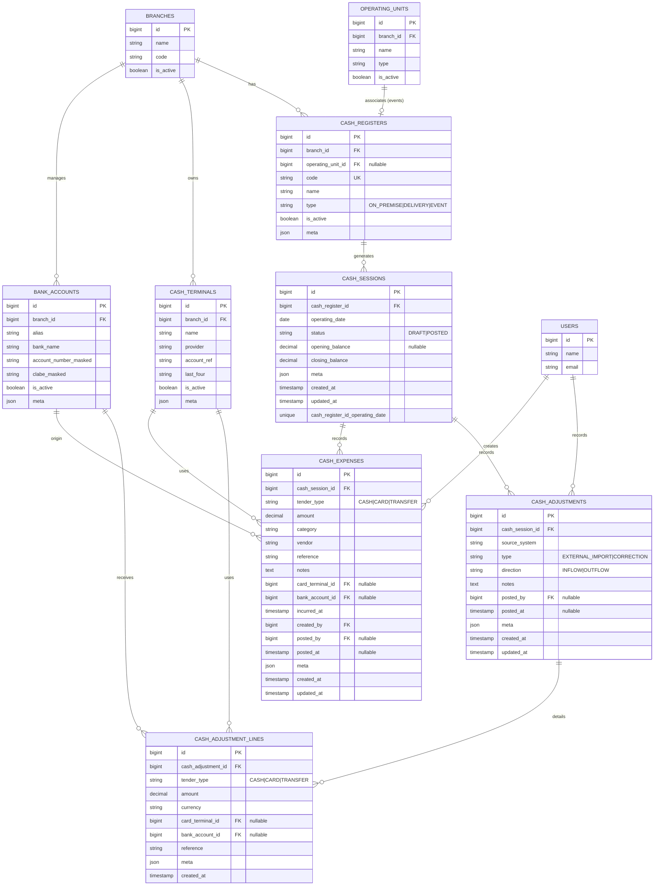
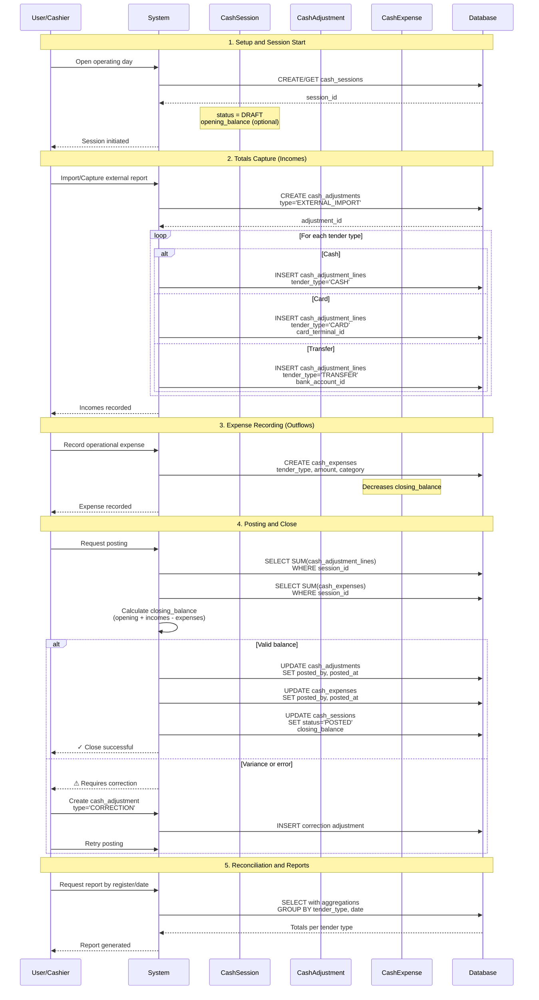
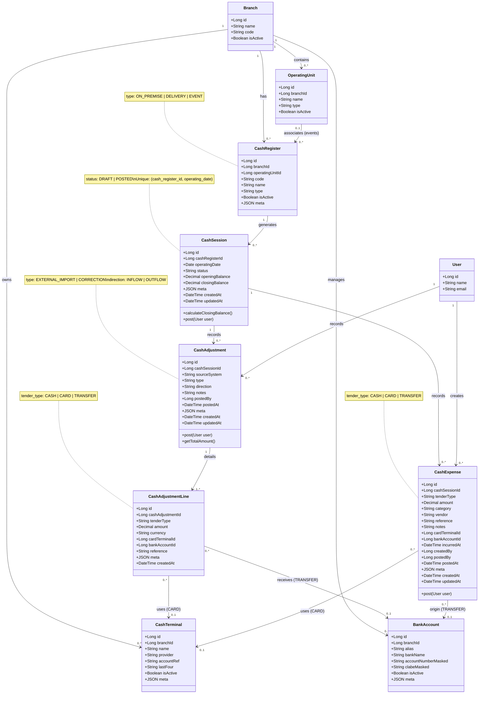

# 💵 Daily Cash Adjustments — Proposal

**Scope**
Record end-of-day sales totals provided by the external POS, split by cash register (on-premise, delivery, event) and by tender (cash, card with terminal, transfer with bank account). This iteration only covers **incoming adjustments**; ticket-level sales capture is out of scope.

---

## 1) Current state (DB and docs)

-   Inventory-first schema in place: `branches`, `operating_units`, `inventory_locations`, `items`, `item_variants`, `stock*`, `media*`, plus users/permissions (Spatie).
-   No **sales**, **cash registers**, **terminals**, or **bank accounts** tables. The only sales hint is optional metadata on `stock_movements` and pricing fields in `stock_movement_lines`, so there is no cash or reconciliation support yet.
-   Multi-branch and operating-unit abstraction already exists and should anchor cash registers to stores and events.

---

## 2) Goals for the module

-   Store daily income per register using totals coming from the external system (not per ticket).
-   Tag each income by **tender**: cash, card (with the terminal used), or transfer (with the destination account).
-   Support multiple registers per branch: on-premise, delivery, and one linked to special events.
-   Link registers to `branch` and, when relevant, to an event `operating_unit`.
-   Ensure traceability: captured by user, external source, operating date, and baseline audit fields.

---

## 3) Proposed data model

> New tables live in the finance domain and relate to `branches` and optionally `operating_units`.

### 3.1) Entity-Relationship Diagram (ER)

### 3.2) Table Descriptions

**`cash_registers`** — register catalog per branch

-   `branch_id` (FK), `operating_unit_id` (nullable FK for events), `code`, `name`.
-   `type`: `ON_PREMISE` (store), `DELIVERY`, `EVENT`.
-   Flags: `is_active`, `meta` (aliases or IDs from the external system).

**`cash_terminals`** — card terminals per branch

-   `branch_id` (FK), `name` (operator alias), `provider`, `account_ref` (acquirer/merchant ID), `last_four`, `is_active`, `meta`.

**`bank_accounts`** — destination accounts for transfers

-   `branch_id` (FK), `alias`, `bank_name`, `account_number_masked`, `clabe_masked`, `is_active`, `meta`.

**`cash_sessions`** — operating day per register

-   `cash_register_id` (FK), `operating_date`, `status` (`DRAFT|POSTED`), `opening_balance` (nullable), `closing_balance` (computed from adjustments), `meta` (e.g., external batch id).
-   Unique on (`cash_register_id`, `operating_date`) to avoid duplicate daily sessions.

**`cash_adjustments`** — header for imported income/outflows

-   `cash_session_id` (FK), `source_system` (short text), `type` (`EXTERNAL_IMPORT|CORRECTION`), `direction` (`INFLOW|OUTFLOW`), `notes`, `posted_by`, `posted_at`, `meta`.
-   Used for daily totals from the other system; `OUTFLOW` is reserved for general withdrawals (e.g., vault transfer).

**`cash_adjustment_lines`** — tender-level breakdown

-   `cash_adjustment_id` (FK), `tender_type` (`CASH|CARD|TRANSFER`), `amount`, `currency` (`MXN` default), `card_terminal_id` (nullable FK), `bank_account_id` (nullable FK), `reference` (external batch id), `meta` (tips, fees).
-   Index by `tender_type` and `operating_date` (via `cash_sessions`) for daily reporting.

**`cash_expenses`** — outflows paid from on-premise/delivery registers

-   `cash_session_id` (FK), `tender_type` (`CASH|CARD|TRANSFER`), `amount`, `category`, `vendor`, `reference` (invoice/receipt), `notes`, `card_terminal_id` (nullable), `bank_account_id` (nullable), `incurred_at`, `created_by`, `posted_by`, `posted_at`, `meta`.
-   Decrease the session `closing_balance`. Cover ad-hoc operational spend taken from the most convenient register/terminal.

---

## 4) Operational flow (EOD)

### 4.1) Sequence Diagram - Daily Close

### 4.2) Flow Description

1. **Setup**: create registers per branch (`cash_registers`) for on-premise, delivery, and events; register terminals and bank accounts.
2. **Daily session**: at close time, ensure a `cash_sessions` exists per register and operating date.
3. **Totals capture**: for each tender in the external report, create a `cash_adjustment` with lines:
    - cash → `CASH` line;
    - card → `CARD` line referencing `card_terminal_id`;
    - transfer → `TRANSFER` line referencing `bank_account_id`.
4. **Expense capture** (when paid from on-premise/delivery register for convenience): create a `cash_expense` in the matching session with its `tender_type`, amount, and reference.
5. **Post**: mark adjustments and expenses as `POSTED`, set `posted_by/posted_at`, and recompute session `closing_balance` (opening + incomes − expenses).
6. **Future reconciliation** (not now): allow outflows/transfers between registers and variance reporting.

---

## 5) Permissions and audit

### 5.1) UML Class Diagram - Domain Model

### 5.2) Access Control

-   Suggested new permissions: `cash-registers.manage`, `cash-terminals.manage`, `cash-adjustments.create`, `cash-adjustments.post`, `cash-expenses.create`, `cash-expenses.post`.
-   Reuse `OperatingUnitUser` to scope access to registers tied to a given branch/unit.
-   Baseline audit: `created_by`, `posted_by`, `meta.reference` (external batch/folio), and timestamps.

---

## 6) Out of scope and next steps

-   No ticket-level sales or line items; only daily totals per tender.
-   Physical cash counts or partial till drops are not modeled yet.
-   Next: design Laravel endpoints/services and React screens for manual close capture, plus daily register/tender reports.
