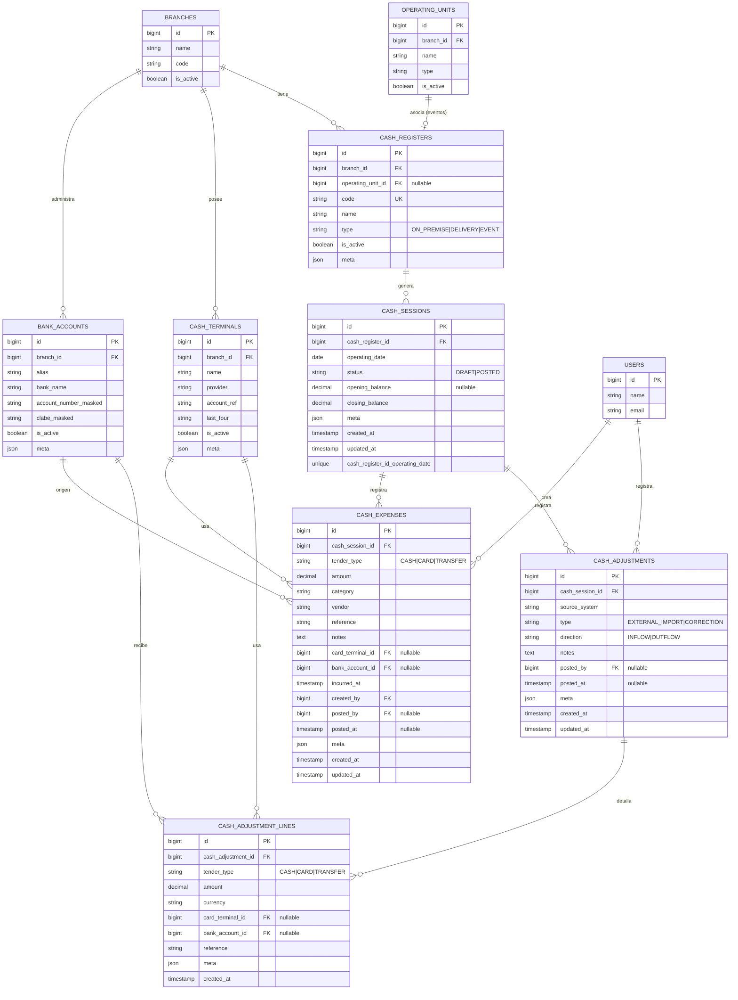
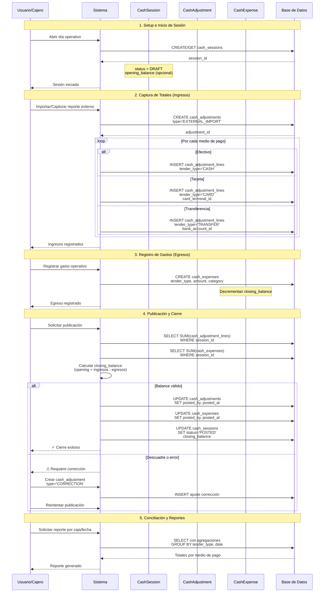
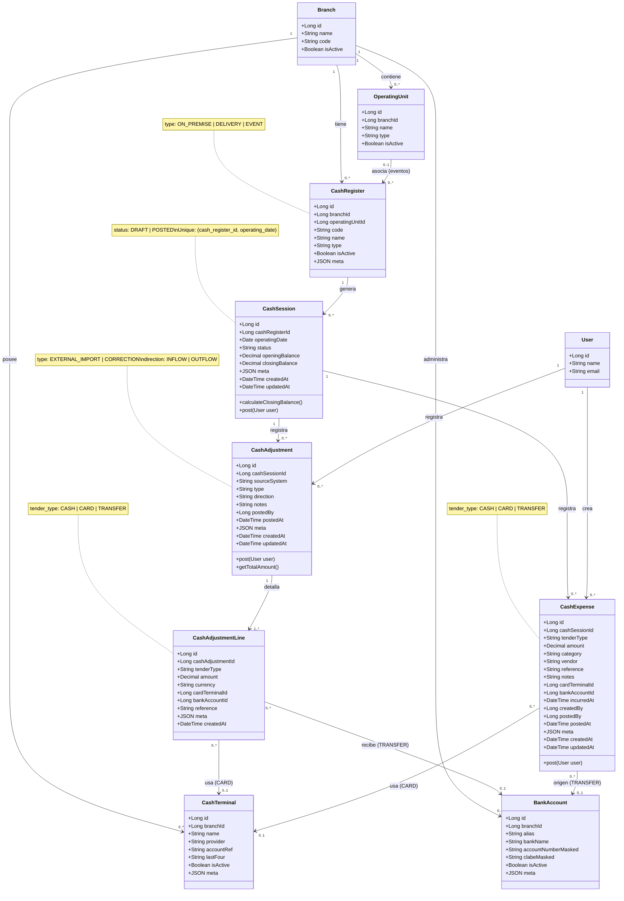

# 💵 Ajustes de Caja Diarios — Propuesta

**Alcance**
Registrar al cierre del día los totales de venta que entrega el software externo, dividiendo por caja (local, envíos a domicilio, eventos) y marcando el medio de cobro (efectivo, TC con terminal, transferencia con cuenta). Solo cubrimos **ajustes de ingreso** diarios; el alta de ventas ticket a ticket queda fuera de esta iteración.

---

## 1) Estado actual (DB y docs)

-   Tablas existentes orientadas a inventario: `branches`, `operating_units`, `inventory_locations`, `items`, `item_variants`, `stock*`, `media*`, usuarios y permisos (Spatie).
-   Sin tablas de **venta**, **cajas**, **terminales** ni **cuentas bancarias**. El único rastro de ventas es metadata opcional en `stock_movements` y campos de precio en `stock_movement_lines`, por lo que no hay soporte para caja o conciliación.
-   Estructura multi-sucursal y por unidad operativa (`operating_units`) ya disponible y sirve como ancla para relacionar las cajas con tiendas y eventos.

---

## 2) Objetivos del módulo

-   Registrar el ingreso diario por caja a partir de totales externos (no granular por ticket).
-   Etiquetar cada ingreso por **medio de pago**: efectivo, tarjeta (terminal usada) o transferencia (cuenta destino).
-   Permitir varias cajas por sucursal: local, delivery y una asociada a eventos especiales.
-   Asociar cajas con `branch` y, cuando aplique, con `operating_unit` de tipo evento.
-   Trazabilidad: usuario que captura, fuente externa, fecha operativa y auditoría básica.

---

## 3) Modelo de datos propuesto

> Las tablas nuevas se ubicarían en el dominio financiero, enlazando con `branches` y opcionalmente `operating_units`.

### 3.1) Diagrama Entidad-Relación (ER)

### 3.2) Descripción de Tablas

**`cash_registers`** — catálogo de cajas por sucursal

-   `branch_id` (FK), `operating_unit_id` (FK nullable para eventos), `code`, `name`.
-   `type`: `ON_PREMISE` (local), `DELIVERY`, `EVENT`.
-   Flags: `is_active`, `meta` (para alias en software externo).

**`cash_terminals`** — terminales de tarjeta por sucursal

-   `branch_id` (FK), `name` (alias operativo), `provider`, `account_ref` (ID de cuenta/afiliación), `last_four`, `is_active`, `meta`.

**`bank_accounts`** — cuentas destino para transferencias

-   `branch_id` (FK), `alias`, `bank_name`, `account_number_masked`, `clabe_masked`, `is_active`, `meta`.

**`cash_sessions`** — día operativo por caja

-   `cash_register_id` (FK), `operating_date`, `status` (`DRAFT|POSTED`), `opening_balance` (nullable), `closing_balance` (se calcula con ajustes), `meta` (e.g. folio externo).
-   Unicidad por (`cash_register_id`, `operating_date`) para evitar duplicados diarios.

**`cash_adjustments`** — encabezado de ajuste de ingreso/egreso

-   `cash_session_id` (FK), `source_system` (texto corto), `type` (`EXTERNAL_IMPORT|CORRECTION`), `direction` (`INFLOW|OUTFLOW`), `notes`, `posted_by`, `posted_at`, `meta`.
-   Representa el pase de totales desde el otro sistema o correcciones; `OUTFLOW` se reserva para egresos que se modelen como ajuste general (p. ej. retiro a bóveda).

**`cash_adjustment_lines`** — detalle por medio de pago

-   `cash_adjustment_id` (FK), `tender_type` (`CASH|CARD|TRANSFER`), `amount`, `currency` (`MXN` por defecto), `card_terminal_id` (FK nullable), `bank_account_id` (FK nullable), `reference` (ID de corte externo), `meta` (ej. propinas, cargos).
-   Índice por `tender_type` y `operating_date` (via `cash_session`) para reportes diarios.

**`cash_expenses`** — egresos pagados desde caja/delivery

-   `cash_session_id` (FK), `tender_type` (`CASH|CARD|TRANSFER`), `amount`, `category`, `vendor`, `reference` (folio/nota), `notes`, `card_terminal_id` (nullable), `bank_account_id` (nullable), `incurred_at`, `created_by`, `posted_by`, `posted_at`, `meta`.
-   Decrementan el `closing_balance` de la sesión. Sirven para “salidas operativas” tomadas de la caja/terminal más conveniente.

---

## 4) Flujo operativo (cierre diario)

### 4.1) Diagrama de Secuencia - Cierre Diario

### 4.2) Descripción del Flujo

1. **Setup**: crear cajas por sucursal (`cash_registers`) para local, delivery y eventos; registrar terminales y cuentas.
2. **Sesión diaria**: al iniciar el cierre, se crea/asegura un `cash_sessions` por caja y fecha operativa.
3. **Captura de totales**: por cada medio de pago del reporte externo se registra un `cash_adjustment` con líneas:
    - efectivo → línea `CASH`;
    - tarjeta → `CARD` con `card_terminal_id`;
    - transferencia → `TRANSFER` con `bank_account_id`.
4. **Registro de gastos** (cuando se pagan desde caja/delivery por comodidad): crear `cash_expense` en la sesión correspondiente con su `tender_type`, monto y referencia.
5. **Publicación**: al guardar, los ajustes y gastos se marcan `POSTED`, se fijan `posted_by/posted_at` y se recalcula `closing_balance` de la sesión (opening + ingresos − egresos).
6. **Conciliación futura** (no implementada ahora): permitir egresos/transferencias entre cajas y reporte de diferencias.

---

## 5) Permisos y auditoría

### 5.1) Diagrama de Clases UML - Modelo de Dominio

### 5.2) Control de Acceso

-   Nuevos permisos sugeridos: `cash-registers.manage`, `cash-terminals.manage`, `cash-adjustments.create`, `cash-adjustments.post`, `cash-expenses.create`, `cash-expenses.post`.
-   Reutilizar `OperatingUnitUser` para limitar acceso a cajas ligadas a una sucursal/unidad.
-   Auditoría mínima: `created_by`, `posted_by`, `meta.reference` (folio del sistema externo) y timestamps.

---

## 6) Fuera de alcance y siguientes pasos

-   No se captura detalle de ticket ni líneas de venta; solo totales por medio de pago.
-   No se modela el conteo físico de efectivo ni arqueos parciales.
-   Próximo paso: diseñar endpoints/servicios (Laravel) y pantallas (React) para captura manual del cierre, más reportes diarios por caja y medio de pago.
