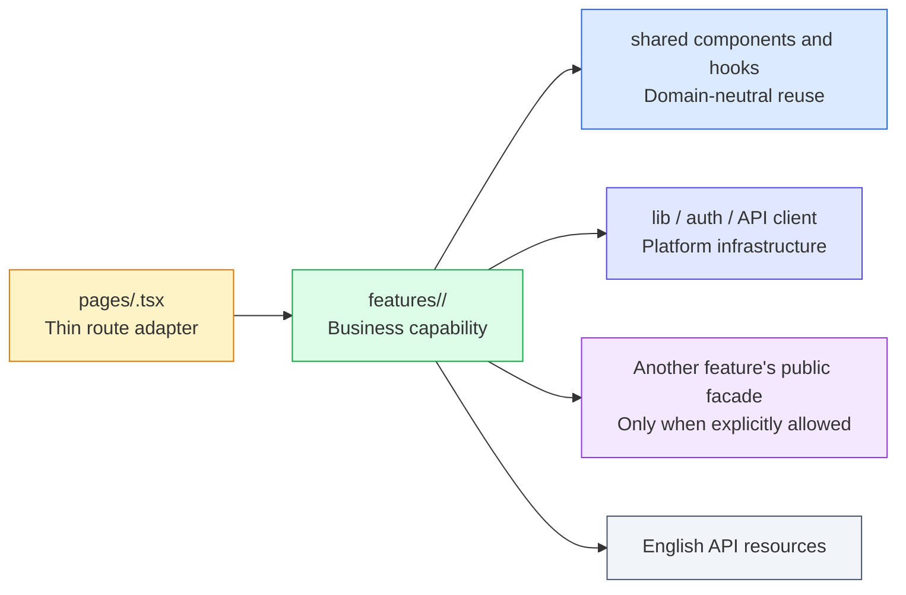
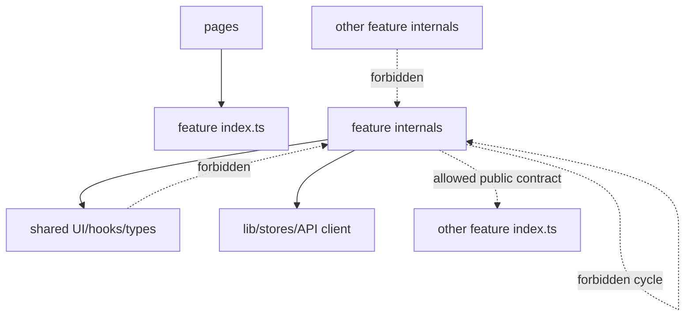
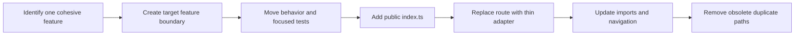

# Domain-Oriented Frontend Architecture

**Status:** Active target architecture

**Decision:** [TD-04](../../decisions/td-04-domain-oriented-frontend-structure.md)

**Convention:** [Frontend Domain-Oriented Structure](../../conventions/frontend/domain-oriented-structure.md)

## 1. Purpose

This document describes the target organization of the SushiGo React application. The frontend is
organized around business domains and cohesive features while preserving TanStack Router's
file-based routing and a small set of genuinely shared platform primitives.

The architecture is intentionally incremental. It defines where new code belongs and how an
existing vertical is migrated without requiring all legacy folders to move at once.

## 2. Architectural model



The main boundary is a **feature module**. A feature owns one user-recognizable capability within a
business domain. `suppliers` is a feature in the `purchasing` domain; it owns supplier catalog and
supplier purchase-offering behavior.

## 3. Target directory structure

```text
src/
├── features/
│   └── purchasing/
│       └── suppliers/
│           ├── api/
│           │   ├── supplier-api.ts
│           │   └── supplier-query-keys.ts
│           ├── components/
│           │   ├── supplier-detail.tsx
│           │   ├── supplier-form.tsx
│           │   ├── supplier-list.tsx
│           │   └── supplier-offering-form.tsx
│           ├── hooks/
│           │   ├── use-supplier-form.ts
│           │   ├── use-supplier-offering-form.ts
│           │   └── use-suppliers-page.ts
│           ├── pages/
│           │   └── suppliers-page.tsx
│           ├── types/
│           │   └── supplier.types.ts
│           ├── __tests__/
│           └── index.ts
├── pages/
│   └── inventario/
│       └── proveedores.tsx
├── components/
│   └── ui/
├── hooks/
├── lib/
├── stores/
└── routeTree.gen.ts
```

Not every feature needs every folder. Create only the folders justified by current behavior. A
small feature may begin with `components/`, `hooks/`, and `index.ts`; the boundary matters more than
an empty directory template.

## 4. Responsibilities

### 4.1 Route adapter

The route file represents the public web URL. It may declare route validation, access guards,
loaders that are specifically required by TanStack Router, and route metadata. It renders a page
from the feature public API.

```tsx
// src/pages/inventario/proveedores.tsx
import { createFileRoute } from '@tanstack/react-router'
import { SuppliersPage } from '@/features/purchasing/suppliers'

export const Route = createFileRoute('/inventario/proveedores')({
  component: SuppliersPage,
})
```

It must not contain form schemas, mutations, table definitions, slide-panel workflows, or API
normalization. Those belong to the feature.

### 4.2 Feature page

The feature page composes the feature's list, details, forms, and page-level hook. It is not coupled
to `Route` and can be rendered independently.

### 4.3 Components

Feature components render feature-specific UI. They may consume feature hooks and shared UI
primitives. Stateful form and API behavior continues to follow the project's mandatory Custom Hook
and Form conventions.

### 4.4 Hooks

Hooks own orchestration, form schemas, server-state queries and mutations, normalization, and UI
state machines. Hooks used only by one feature stay inside that feature. A hook is moved to global
`src/hooks/` only when it is domain-neutral and has proven reuse.

### 4.5 API adapters and query keys

The feature API folder owns requests for its API resource and the query-key factory used to cache
it. Calls still use the shared configured API client. HTTP resources remain English even when the
frontend route is Spanish.

### 4.6 Types

Feature-owned request, response, view-model, and form types live with the feature. Platform-wide
transport wrappers such as `PaginatedResponse<T>` remain shared. A feature may temporarily import
legacy shared types while it is being migrated, but the target is unambiguous ownership.

### 4.7 Tests

Focused tests live inside the feature, either next to the unit under test or under its
`__tests__/`. Route-only tests may remain beside the route adapters. Test location follows the code
owner; a migration normally moves its focused tests with it.

## 5. Dependency rules



1. Route adapters import a feature through its public `index.ts`.
2. Outside consumers do not deep-import another feature's internal files.
3. Shared code never imports a business feature.
4. Feature-to-feature access uses an explicit public export and must not create cycles.
5. Domain-neutral UI primitives remain under `components/ui`; business vocabulary is evidence that
   a component belongs to a feature.
6. A single second usage is not enough to promote code to shared. Shared ownership must be stable
   and independent from either feature's business rules.

## 6. Language and URL boundary

The system currently targets Mexico without an internationalization layer. User-facing web paths
are therefore Spanish. Programming identifiers and integration contracts remain English.

| Concern | Language | Example |
|---|---|---|
| Browser path | Spanish | `/inventario/proveedores` |
| Visible query-string vocabulary | Spanish | `?estado=activo&pagina=2` |
| Labels and user messages | Spanish | `Nuevo proveedor` |
| Feature/domain folders | English | `purchasing/suppliers` |
| Components, hooks, variables, types | English | `SupplierForm`, `useSuppliersPage` |
| Permissions | English | `suppliers.view` |
| API paths and fields | English | `/inventory/suppliers`, `supplier_id` |

Route segments use lowercase Spanish words, no diacritics, and kebab-case when more than one word
is required. Dynamic parameter names remain English because they are programming identifiers; the
value, not the parameter name, is visible in the resulting URL.

The URL hierarchy represents product navigation and user comprehension. It does not have to mirror
the code's bounded-context hierarchy exactly. This permits Suppliers to belong internally to
Purchasing while appearing under the current Inventory navigation.

## 7. Suppliers reference implementation

```text
Browser
  /inventario/proveedores
          │
          ▼
pages/inventario/proveedores.tsx
  TanStack route adapter
          │ imports public export
          ▼
features/purchasing/suppliers/index.ts
          │
          ▼
pages/suppliers-page.tsx
  ├── hooks/use-suppliers-page.ts
  ├── components/supplier-list.tsx
  ├── components/supplier-detail.tsx
  ├── components/supplier-form.tsx
  └── components/supplier-offering-form.tsx
          │
          ▼
api/supplier-api.ts
          │
          ▼
/api/v1/inventory/suppliers
```

Suppliers may consume product catalog selection contracts. During the first migration it is
acceptable to use the existing inventory API/type exports so the PR does not also reorganize the
Product domain. A later migration should expose the required catalog selectors through the Product
feature's public API rather than coupling Suppliers to Product internals.

## 8. Incremental migration strategy



For each migrated feature:

1. Map its current components, page logic, hooks, service calls, types, tests, navigation entries,
   and cross-domain dependencies.
2. Create the target domain/feature boundary.
3. Move one cohesive vertical without redesigning unrelated domains.
4. Keep temporary legacy imports explicit and record follow-up work when ownership cannot yet move.
5. Export only what outside code needs from `index.ts`.
6. Make the route file a thin adapter and update the visible URL to Spanish when the migration is
   in scope.
7. Redirect a previously released English frontend URL when bookmarks or external links may exist.
8. Remove obsolete files after every import has moved; do not maintain parallel implementations.

## 9. What does not belong in a domain feature

- Generic buttons, inputs, dialogs, data grids, and layout primitives.
- The configured HTTP client and authentication interceptor.
- Global authentication/session stores.
- Truly generic hooks with no domain vocabulary.
- Generated route-tree files.
- API backend code; the frontend structure does not rename API resources.

## 10. Architectural review checklist

- Can a reviewer locate the complete business capability under one feature subtree?
- Is the TanStack route adapter thin?
- Is the browser-facing path Spanish and the code/API vocabulary English?
- Does the feature expose a deliberate public API?
- Are there deep imports into another feature?
- Does shared code depend on a domain feature?
- Were focused tests moved with their owner?
- Is any temporary legacy dependency documented and bounded?
- Did the migration remove the superseded implementation?
