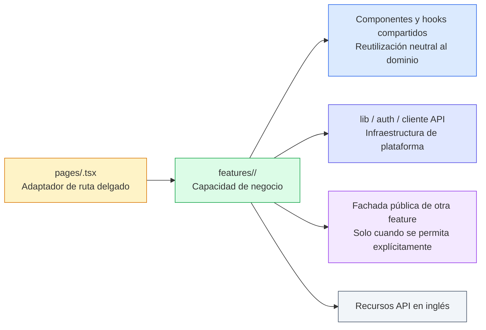
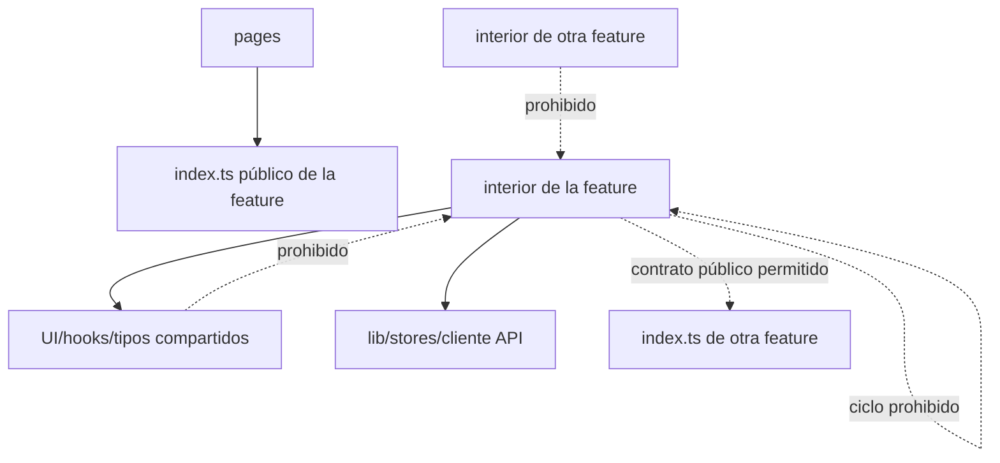
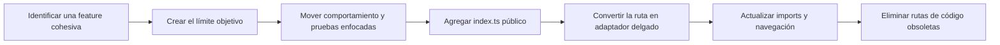

# Arquitectura del Frontend Orientada a Dominios

**Estado:** Arquitectura objetivo activa

**Decisión:** [TD-04](../../decisions/td-04-domain-oriented-frontend-structure.md)

**Convención:** [Estructura del frontend orientada a dominios](../../conventions/frontend/domain-oriented-structure.md)

## 1. Propósito

Este documento describe la organización objetivo de la aplicación React de SushiGo. El frontend se
organiza alrededor de dominios de negocio y funcionalidades cohesivas, conservando las rutas por
archivos de TanStack Router y un conjunto pequeño de primitivas de plataforma realmente
compartidas.

La arquitectura es intencionalmente incremental. Define dónde debe vivir el código nuevo y cómo se
migra una funcionalidad existente sin exigir que todas las carpetas heredadas se muevan al mismo
tiempo.

## 2. Modelo arquitectónico



El límite principal es un **módulo de funcionalidad**. Una feature posee una capacidad reconocible
por el usuario dentro de un dominio de negocio. `suppliers` es una feature del dominio `purchasing`;
es dueña del catálogo de proveedores y del comportamiento de sus ofertas de compra.

## 3. Estructura objetivo de directorios

```text
src/
├── features/
│   └── purchasing/
│       └── suppliers/
│           ├── api/
│           │   ├── supplier-api.ts
│           │   └── supplier-query-keys.ts
│           ├── components/
│           │   ├── supplier-detail.tsx
│           │   ├── supplier-form.tsx
│           │   ├── supplier-list.tsx
│           │   └── supplier-offering-form.tsx
│           ├── hooks/
│           │   ├── use-supplier-form.ts
│           │   ├── use-supplier-offering-form.ts
│           │   └── use-suppliers-page.ts
│           ├── pages/
│           │   └── suppliers-page.tsx
│           ├── types/
│           │   └── supplier.types.ts
│           ├── __tests__/
│           └── index.ts
├── pages/
│   └── inventario/
│       └── proveedores.tsx
├── components/
│   └── ui/
├── hooks/
├── lib/
├── stores/
└── routeTree.gen.ts
```

No todas las features necesitan todas las carpetas. Solo deben crearse las que justifique el
comportamiento actual. Una feature pequeña puede iniciar con `components/`, `hooks/` e `index.ts`;
el límite de propiedad importa más que una plantilla de directorios vacíos.

## 4. Responsabilidades

### 4.1 Adaptador de ruta

El archivo de ruta representa la URL pública de la aplicación web. Puede declarar validación de la
ruta, controles de acceso, loaders requeridos específicamente por TanStack Router y metadatos.
Renderiza una página exportada por la API pública de la feature.

```tsx
// src/pages/inventario/proveedores.tsx
import { createFileRoute } from '@tanstack/react-router'
import { SuppliersPage } from '@/features/purchasing/suppliers'

export const Route = createFileRoute('/inventario/proveedores')({
  component: SuppliersPage,
})
```

No debe contener esquemas de formularios, mutaciones, definiciones de tablas, flujos de paneles ni
normalización de API. Esas responsabilidades pertenecen a la feature.

### 4.2 Página de la feature

La página de la feature compone su lista, detalle, formularios y hook de orquestación. No se acopla
a `Route` y puede renderizarse de manera independiente.

### 4.3 Componentes

Los componentes de la feature renderizan UI específica del negocio. Pueden consumir hooks de la
feature y primitivas compartidas. El comportamiento con estado de formularios y API continúa
siguiendo las convenciones obligatorias de Custom Hooks y formularios del proyecto.

### 4.4 Hooks

Los hooks son dueños de la orquestación, esquemas de formularios, queries y mutaciones de estado de
servidor, normalización y máquinas de estado de UI. Los hooks usados por una sola feature permanecen
dentro de ella. Solo se mueven a `src/hooks/` cuando son neutrales al dominio y su reutilización está
demostrada.

### 4.5 Adaptadores de API y query keys

La carpeta API de la feature posee las peticiones de su recurso y la fábrica de query keys usada
para su caché. Las llamadas siguen utilizando el cliente API compartido. Los recursos HTTP
permanecen en inglés aunque la ruta del frontend esté en español.

### 4.6 Tipos

Los tipos de solicitudes, respuestas, modelos de vista y formularios propios de una feature viven
con ella. Envolturas generales de transporte como `PaginatedResponse<T>` permanecen compartidas.
Durante una migración, una feature puede importar temporalmente tipos compartidos heredados, pero el
objetivo es que su propiedad sea inequívoca.

### 4.7 Pruebas

Las pruebas enfocadas viven dentro de la feature, junto a la unidad probada o dentro de
`__tests__/`. Las pruebas exclusivas del adaptador pueden permanecer junto a las rutas. La ubicación
de las pruebas sigue al código que las posee; una migración normalmente mueve sus pruebas enfocadas.

## 5. Reglas de dependencias



1. Los adaptadores de ruta importan la feature mediante su `index.ts` público.
2. Los consumidores externos no importan archivos internos profundos de otra feature.
3. El código compartido nunca importa una feature de negocio.
4. El acceso entre features usa una exportación pública explícita y no debe crear ciclos.
5. Las primitivas de UI neutrales permanecen en `components/ui`; el vocabulario del negocio indica
   que un componente pertenece a una feature.
6. Un segundo uso aislado no basta para promover código a compartido. La propiedad compartida debe
   ser estable e independiente de las reglas de negocio de ambas features.

## 6. Límite de idioma y URLs

Actualmente el sistema está dirigido a México y no tiene una capa de internacionalización. Por lo
tanto, las rutas web visibles para el usuario están en español. Los identificadores de programación
y contratos de integración permanecen en inglés.

| Elemento | Idioma | Ejemplo |
|---|---|---|
| Ruta del navegador | Español | `/inventario/proveedores` |
| Vocabulario visible del query string | Español | `?estado=activo&pagina=2` |
| Etiquetas y mensajes al usuario | Español | `Nuevo proveedor` |
| Carpetas de dominio/feature | Inglés | `purchasing/suppliers` |
| Componentes, hooks, variables y tipos | Inglés | `SupplierForm`, `useSuppliersPage` |
| Permisos | Inglés | `suppliers.view` |
| Rutas y campos de API | Inglés | `/inventory/suppliers`, `supplier_id` |

Los segmentos de ruta usan palabras en español, minúsculas, sin acentos y kebab-case cuando se
requiere más de una palabra. Los nombres de parámetros dinámicos permanecen en inglés porque son
identificadores de programación; el usuario ve el valor resultante, no el nombre del parámetro.

La jerarquía de URLs representa la navegación y comprensión del producto. No tiene que reflejar de
forma idéntica la jerarquía de bounded contexts del código. Esto permite que Proveedores pertenezca
internamente a Compras y aparezca bajo la navegación actual de Inventario.

## 7. Implementación de referencia para Suppliers

```text
Navegador
  /inventario/proveedores
          │
          ▼
pages/inventario/proveedores.tsx
  Adaptador de TanStack Router
          │ importa la exportación pública
          ▼
features/purchasing/suppliers/index.ts
          │
          ▼
pages/suppliers-page.tsx
  ├── hooks/use-suppliers-page.ts
  ├── components/supplier-list.tsx
  ├── components/supplier-detail.tsx
  ├── components/supplier-form.tsx
  └── components/supplier-offering-form.tsx
          │
          ▼
api/supplier-api.ts
          │
          ▼
/api/v1/inventory/suppliers
```

Suppliers puede consumir contratos de selección del catálogo de productos. Durante la primera
migración es aceptable usar las exportaciones existentes de tipos y API de inventario para evitar
que el mismo PR reorganice también el dominio Product. Una migración posterior deberá exponer los
selectores necesarios mediante la API pública de Product, sin acoplar Suppliers a sus archivos
internos.

## 8. Estrategia de migración incremental



Para cada feature migrada:

1. Mapear sus componentes, lógica de página, hooks, servicios, tipos, pruebas, entradas de navegación
   y dependencias entre dominios.
2. Crear el límite objetivo de dominio y feature.
3. Mover una vertical cohesiva sin rediseñar dominios que no estén dentro del alcance.
4. Mantener explícitas las dependencias heredadas temporales y registrar seguimiento cuando su
   propiedad todavía no pueda migrarse.
5. Exportar en `index.ts` únicamente lo necesario para consumidores externos.
6. Convertir el archivo de ruta en un adaptador delgado y cambiar la URL visible a español cuando la
   migración esté dentro del alcance.
7. Redirigir una URL frontend anterior en inglés cuando puedan existir marcadores o enlaces externos.
8. Eliminar archivos obsoletos después de mover todos sus imports; no mantener implementaciones
   paralelas.

## 9. Qué no pertenece a una feature de dominio

- Botones, inputs, diálogos, data grids y primitivas de layout genéricos.
- El cliente HTTP configurado y el interceptor de autenticación.
- Stores globales de autenticación y sesión.
- Hooks realmente genéricos sin vocabulario del dominio.
- Archivos generados del árbol de rutas.
- Código del backend API; la estructura del frontend no renombra sus recursos.

## 10. Lista de revisión arquitectónica

- ¿Se puede localizar la capacidad de negocio completa dentro de una feature?
- ¿El adaptador de TanStack Router es delgado?
- ¿La ruta del navegador está en español y el código/API en inglés?
- ¿La feature expone una API pública deliberada?
- ¿Existen imports profundos hacia otra feature?
- ¿El código compartido depende de una feature de dominio?
- ¿Las pruebas enfocadas se movieron junto con su propietario?
- ¿Las dependencias heredadas temporales están documentadas y delimitadas?
- ¿La migración eliminó la implementación reemplazada?
