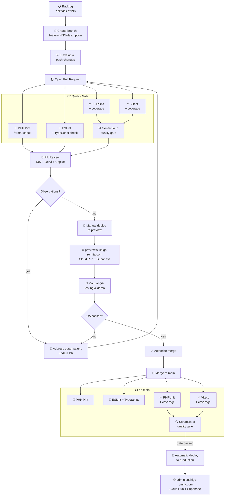
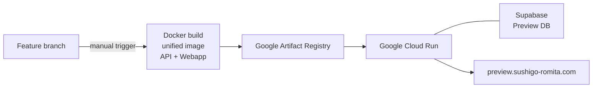
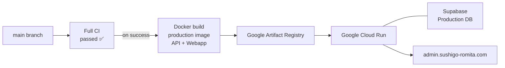

# Infrastructure Architecture — SushiGo

## 1. Scope

This document describes the deployment infrastructure, branch strategy, and CI/CD pipeline for the SushiGo platform. It covers the current state and the target automated pipeline being implemented via tasks #040–#046.

---

## 2. Environments

| Environment | URL | Source branch | Deploy trigger |
|-------------|-----|--------------|---------------|
| **Preview** | `preview.sushigo-romita.com` | `feature/*` | Manual — from feature branch after PR review passes |
| **Production** | `admin.sushigo-romita.com` | `main` | Automatic — after full CI pipeline passes on merge to `main` |

---

## 3. Branch Strategy

| Branch | Purpose |
|--------|---------|
| `main` | Production — always deployable, protected |
| `feature/*` | One branch per task — naming convention: `feature/NNN-short-description` |

**Rules:**
- No direct commits to `main`
- Every feature starts from `main` as a fresh branch
- Feature branches are deployed to preview for manual QA before merge is authorized
- Merge to `main` triggers the full CI pipeline and, on success, automatic production deployment

---

## 4. Development and Deployment Flow



---

## 5. Pipeline Summary by Trigger

| Trigger | Runs | Purpose |
|---------|------|---------|
| PR open / every push to feature branch | Linters + Tests + Coverage + SonarCloud | Full quality gate on PR — blocks merge on failure |
| Merge to `main` | Linters + Tests + Coverage + SonarCloud | Same pipeline re-runs — blocks production deploy on failure |

---

## 6. Deployment Details

### 6.1 Preview Deployment (Manual — from feature branch)

Triggered manually after the PR review cycle is complete and linters pass.



### 6.2 Production Deployment (Automatic — on full CI success after merge to main)



---

## 7. Workflow Files

| File | Trigger | Path filter | Steps |
|------|---------|------------|-------|
| `.github/workflows/api-lint.yml` | PR open/update + push to `main` | `code/api/**` | PHP Pint `--test` |
| `.github/workflows/webapp-lint.yml` | PR open/update + push to `main` | `code/webapp/**` | ESLint + TypeScript check |
| `.github/workflows/api-tests.yml` | PR open/update + push to `main` | `code/api/**` | PHPUnit + coverage → SonarCloud scan (`sushigo-api`) |
| `.github/workflows/webapp-tests.yml` | PR open/update + push to `main` | `code/webapp/**` | Vitest + coverage → SonarCloud scan (`sushigo-webapp`) |

---

## 8. Requirements

The full set of functional requirements (RF), business rules (RN), and closed definitions (DC) — including justification for each — is documented in:

📄 [`infrastructure-requirements.en.md`](./infrastructure-requirements.en.md)

---

## 9. Related Tasks

| Task | Issue | Description |
|------|-------|-------------|
| Architecture docs | [#040](https://github.com/pakodiazdev/sushigo/issues/40) | This document |
| PHP Pint linter | [#041](https://github.com/pakodiazdev/sushigo/issues/41) | `api-lint.yml` — PR + main |
| ESLint + TypeScript check | [#042](https://github.com/pakodiazdev/sushigo/issues/42) | `webapp-lint.yml` — PR + main |
| PHPUnit + coverage | [#043](https://github.com/pakodiazdev/sushigo/issues/43) | `api-tests.yml` — PR + main |
| Vitest + coverage | [#044](https://github.com/pakodiazdev/sushigo/issues/44) | `webapp-tests.yml` — PR + main |
| SonarCloud | [#045](https://github.com/pakodiazdev/sushigo/issues/45) | Quality gate — PR + main |
| Branch protection | [#046](https://github.com/pakodiazdev/sushigo/issues/46) | `main` protection — required checks: all 5 workflows |

---

## 10. Secret Management — `APP_KEY`

Laravel's `APP_KEY` encrypts sessions, cookies, and any `encrypted` cast/column. It must be unique
per environment and must never be committed to git — see [#384](https://github.com/pakodiazdev/sushigo/issues/384).

### 10.1 Where each environment's key actually lives

- **Local dev / dev-lab:** each workspace generates its own key via `php artisan key:generate`
  during bootstrap. Never shared between workspaces.
- **Local testing of the `prod`/`preview` Docker targets** (`docker-compose.prod.yml`,
  `docker-compose.preview.yml`): these compose files do **not** deploy anything — they only let a
  developer build and run the `prod`/`preview` Dockerfile stages on their own machine before
  triggering a real deploy. `docker-compose.preview.yml` reads `APP_KEY` from the developer's own
  `.env` (see root `.env.example`); `docker-compose.prod.yml` has no `APP_KEY` build arg at all —
  `docker/app/Dockerfile`'s `prod` stage never declares `ARG APP_KEY`, so baking one in at build
  time would be dead weight. The `prod` target's Laravel process reads whatever `APP_KEY` is in
  `code/api/.env` on whichever host builds/runs the image.
- **Live Cloud Run services** (`admin.sushigo-romita.com`, `preview.sushigo-romita.com`): neither
  compose file is used to deploy these — `deploy-preview.yml` builds the image directly with
  `docker build --target preview` and deploys with `gcloud run deploy`, without ever setting
  `APP_KEY`. This means each Cloud Run service's `APP_KEY` is configured directly on the service
  (Cloud Run carries an unspecified env var forward across revisions), entirely outside this repo.

### 10.2 Generating a new key

```bash
cd code/api && php artisan key:generate --show
```

This prints a value without writing it anywhere — copy it into the target the rotation is for
(never back into a docker-compose file or `.env.example`).

### 10.3 Rotating the live prod/preview Cloud Run keys

```bash
gcloud run services update <service-name> \
  --region "<region>" \
  --update-env-vars APP_KEY="<newly generated value>"
```

Rotating `APP_KEY` invalidates every existing session/cookie and any already-`encrypted` data
under the old key — expected fallout, not a bug, for a key treated as compromised. Prefer
migrating this to a GCP Secret Manager reference (`--update-secrets APP_KEY=<secret>:latest`)
over a plain env var so future rotations don't require a manual `gcloud` invocation per
environment; this repo does not yet do that; ask the person with GCP project access to check.

**Doing this requires GCP project access this repository's automation does not have** — it must be
run by a human with access to the `sushigo-app` GCP project, not scripted from a dev-lab workspace.
