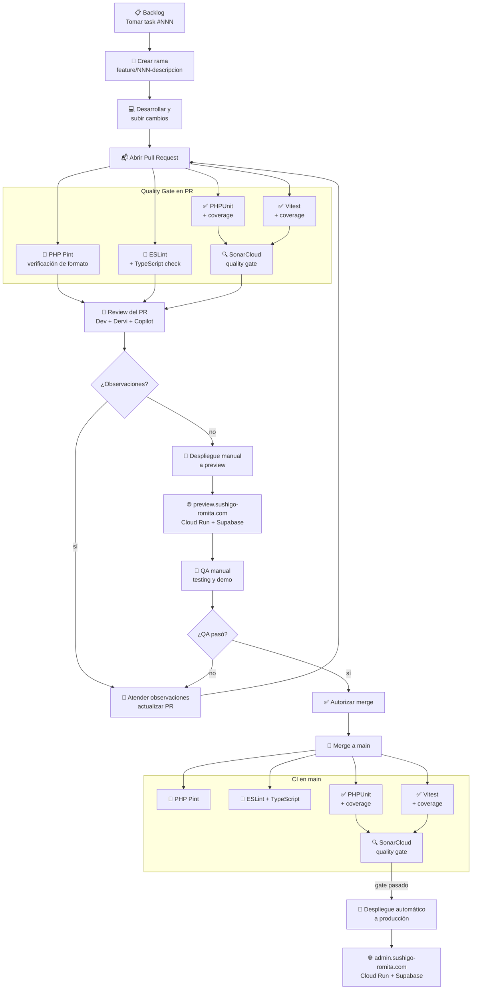
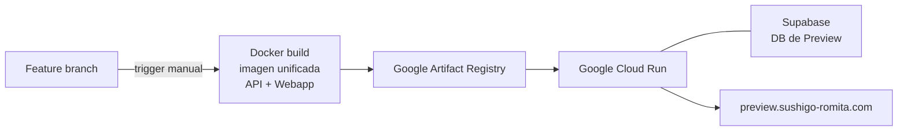
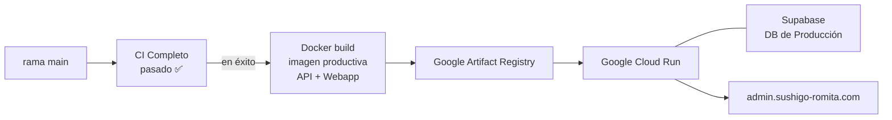

# Arquitectura de Infraestructura — SushiGo

## 1. Alcance

Este documento describe la infraestructura de despliegue, la estrategia de ramas y el pipeline CI/CD de la plataforma SushiGo. Cubre el estado actual y el pipeline automatizado objetivo que se implementa mediante los tasks #040–#046.

---

## 2. Ambientes

| Ambiente | URL | Rama fuente | Trigger de despliegue |
|----------|-----|------------|----------------------|
| **Preview** | `preview.sushigo-romita.com` | `feature/*` | Manual — desde la feature branch tras pasar el review del PR |
| **Producción** | `admin.sushigo-romita.com` | `main` | Automático — después de que el pipeline CI completo pase en el merge a `main` |

---

## 3. Estrategia de Ramas

| Rama | Propósito |
|------|-----------|
| `main` | Producción — siempre desplegable, protegida |
| `feature/*` | Una rama por task — convención: `feature/NNN-descripcion-corta` |

**Reglas:**
- Sin commits directos a `main`
- Cada feature parte de `main` como una rama nueva
- Las ramas de feature se despliegan en preview para QA manual antes de autorizar el merge
- El merge a `main` lanza el pipeline CI completo y, en caso de éxito, el despliegue automático a producción

---

## 4. Flujo de Desarrollo y Despliegue

---

## 5. Resumen del Pipeline por Trigger

| Trigger | Qué corre | Propósito |
|---------|-----------|-----------|
| PR abierto / cada push a feature branch | Linters + Tests + Coverage + SonarCloud | Quality gate completo en PR — bloquea el merge en caso de fallo |
| Merge a `main` | Linters + Tests + Coverage + SonarCloud | El mismo pipeline corre de nuevo — bloquea despliegue a producción en fallo |

---

## 6. Detalle de Despliegues

### 6.1 Despliegue a Preview (Manual — desde la feature branch)

Se lanza manualmente después de que el ciclo de review del PR está completo y los linters pasan.

### 6.2 Despliegue a Producción (Automático — en éxito del CI completo tras merge a main)

---

## 7. Archivos de Workflow

| Archivo | Trigger | Filtro de ruta | Pasos |
|---------|---------|---------------|-------|
| `.github/workflows/api-lint.yml` | PR abierto/actualizado + push a `main` | `code/api/**` | PHP Pint `--test` |
| `.github/workflows/webapp-lint.yml` | PR abierto/actualizado + push a `main` | `code/webapp/**` | ESLint + TypeScript check |
| `.github/workflows/api-tests.yml` | PR abierto/actualizado + push a `main` | `code/api/**` | PHPUnit + coverage + análisis SonarCloud |
| `.github/workflows/webapp-tests.yml` | PR abierto/actualizado + push a `main` | `code/webapp/**` | Vitest + coverage + análisis SonarCloud |

---

## 8. Requerimientos

El conjunto completo de requerimientos funcionales (RF), reglas de negocio (RN) y definiciones cerradas (DC) — incluyendo la justificación de cada uno — está documentado en:

📄 [`infrastructure-requirements.es.md`](./infrastructure-requirements.es.md)

---

## 9. Tasks Relacionados

| Task | Issue | Descripción |
|------|-------|-------------|
| Documentación de arquitectura | [#040](https://github.com/pakodiazdev/sushigo/issues/40) | Este documento |
| PHP Pint linter | [#041](https://github.com/pakodiazdev/sushigo/issues/41) | `api-lint.yml` — PR + main |
| ESLint + TypeScript check | [#042](https://github.com/pakodiazdev/sushigo/issues/42) | `webapp-lint.yml` — PR + main |
| PHPUnit + coverage | [#043](https://github.com/pakodiazdev/sushigo/issues/43) | `api-tests.yml` — PR + main |
| Vitest + coverage | [#044](https://github.com/pakodiazdev/sushigo/issues/44) | `webapp-tests.yml` — PR + main |
| SonarCloud | [#045](https://github.com/pakodiazdev/sushigo/issues/45) | Quality gate — PR + main |
| Branch protection | [#046](https://github.com/pakodiazdev/sushigo/issues/46) | Protección de `main` — checks requeridos: los 5 workflows |
