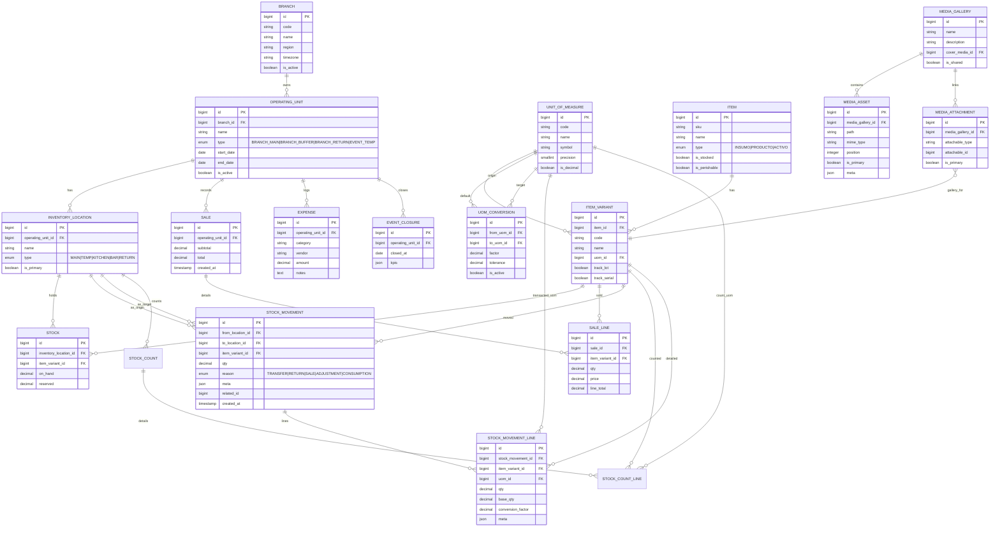
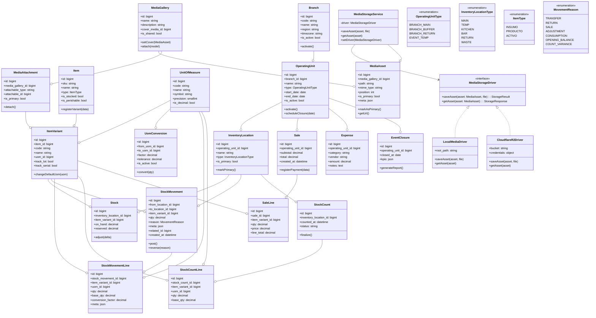
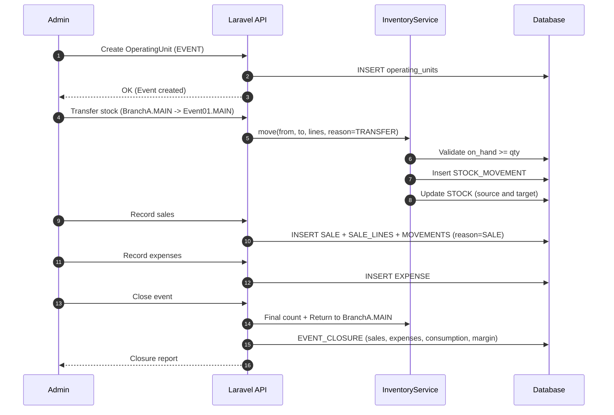
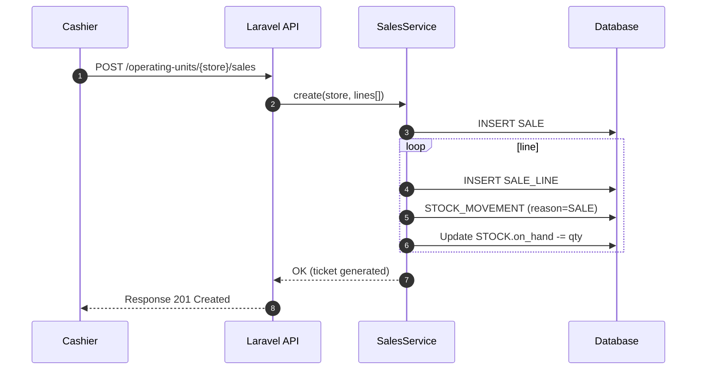
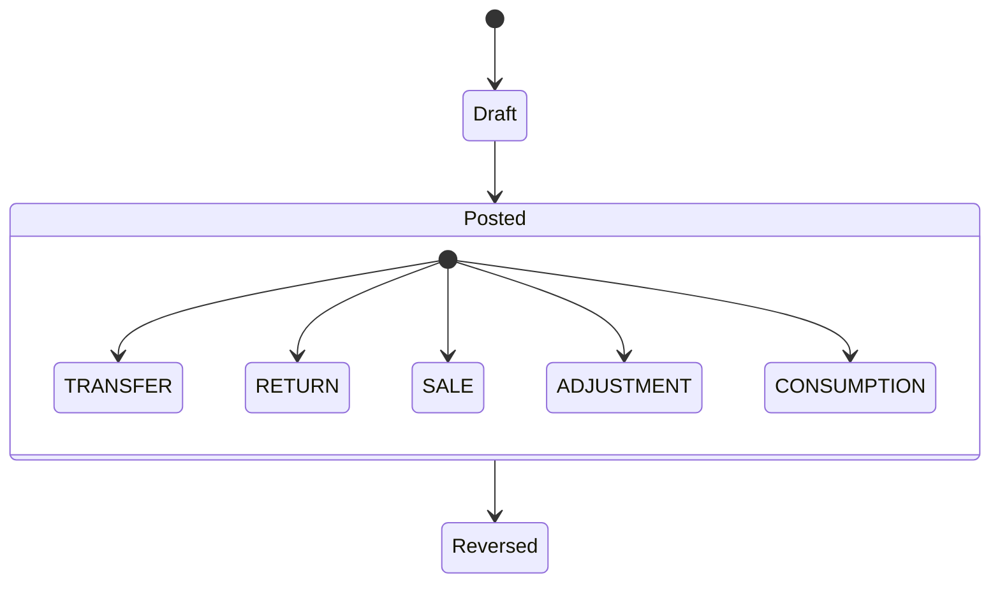

# 🍣 SushiGo Tenant — Inventory Architecture & Design

**Scope**
Comprehensive plan for the **SushiGo** tenant inventory system within ComandaFlow. Includes context, principles, domain model, ER diagrams, operational flows, and technical guidelines for implementation in Laravel + React.

---

## 1. Context and Requirements

SushiGo currently operates as a single restaurant with temporary events, but is preparing for:

-   **Multiple branches** that manage their own inventories by city or zone.
-   **Events (`EVENT`)** that require temporarily moving inventory, recording costs/sales, and executing closures with stock returns.
-   **Profitability control** per operating unit (store or event) and defined periods.
-   **Scalability** towards purchases, production, batches, and advanced analytics.

The system must guarantee:

-   Multi-location inventory per operating unit.
-   Auditable transfers and adjustments.
-   Registration of sales, expenses, and operational closures.
-   Complete traceability of movements (who, when, why).
-   Preparation for costing and forecasting modules.
-   Management of reusable image galleries with main cover, attachable to products or other domain objects.

---

## 2. Design Principles

| Principle                      | Description                                                                 |
| ------------------------------ | --------------------------------------------------------------------------- |
| **Single Tenant Scope**        | All data belongs to the SushiGo tenant; no multi-client isolation required. |
| **Operating Unit Abstraction** | Each operation occurs within a unit (branch inventory or temporary event).  |
| **Inventory by Location**      | Stock segregated by `InventoryLocation` (MAIN, KITCHEN, BAR, etc.).         |
| **Complete Traceability**      | Each movement generates `StockMovement` and detailed lines.                 |
| **Expandable Architecture**    | Ready for purchases, batches, production, and analytics.                    |
| **Secure IDs**                 | Internal incremental IDs, external exposed as Hashids.                      |
| **Service-Oriented Layering**  | Thin controllers → Domain services → Models.                                |
| **Laravel Native**             | Use of Laravel 12 + Spatie Permission native patterns.                      |

---

## 3. Domain Model

### 3.1 Main Entities

-   **Branch**: physical/administrative branch of the tenant; groups permanent and temporary inventories.
-   **OperatingUnit (Inventory)**: operational context within a branch (main inventory, auxiliary warehouses, or temporary events).
-   **InventoryLocation**: physical or logical zones within each unit.
-   **Item / ItemVariant**: master catalog (assets `ACTIVO`, finished products, supplies).
-   **UnitOfMeasure / UomConversion**: base unit per variant and allowed conversions.
-   **Stock / StockMovement / StockMovementLine**: stock, movements, and transactional detail.
-   **Sale / SaleLine**: sales tickets per operating unit.
-   **Expense**: operating expenses per unit.
-   **EventClosure**: results and KPIs at event closure.
-   **StockCount / StockCountLine**: physical counts that feed adjustments.
-   **MediaGallery / MediaAsset / MediaAttachment**: image management (cover + gallery) reusable between products, variants, or other models.
-   **Users & Roles**: personnel assignment to units and permissions by domain.

### 3.2 Main ER Diagram

### 3.3 Units of Measure and Transactions

-   Each variant has a **base unit** (`ITEM_VARIANT.uom_id`).
-   Conversions (`UOM_CONVERSION`) define directed factors `from_uom → to_uom` with tolerances.
-   Only `INSUMO` enables multiple conversions; `PRODUCTO` and `ACTIVO` operate 1:1 (same input and output unit).
-   `StockMovementLine` records both the operated quantity (`qty`, `uom_id`) and the normalized quantity (`base_qty`) and the applied factor.
-   `meta.original_qty` and `meta.original_uom` in `StockMovement` preserve the original transaction for auditing and costing.
-   Physical counts (`StockCountLine`) accept any unit and are converted with the same rules.

### 3.4 Security and Roles

The detail of the user, role, and permission system is documented in
[Security & User System Architecture](./security-and-user-system-architecture.md).
It describes the assignment flow, base roles (`super-admin`, `admin`, `user`), and the strategy to combine direct permissions with contextual roles.

---

### 3.5 Branch and Inventory Model

-   **Branch** acts as master container. Each branch has at least one permanent inventory (`OperatingUnit` of type `BRANCH_MAIN`) and can add auxiliary inventories (`BRANCH_BUFFER`, `BRANCH_RETURN`, etc.).
-   **Events** are represented as temporary `OperatingUnit` (`EVENT_TEMP`) associated with a source branch; they have `start_date` and `end_date` to delimit cutoff and stock return.
-   **Transfers** are performed between `OperatingUnit`, allowing intra-branch movements (main ↔ kitchen) and inter-branch (Branch A → Branch B). The transfer service validates capacity and records cross traceability.
-   When the system does not yet expose branch management, a default branch can be initialized and work with its main inventory. The design supports activating additional branches without refactoring domains.
-   Stock and profitability reports are calculated per `OperatingUnit` and aggregate metrics per branch for financial and operational analysis.

**Proposed Schema**

| Table                 | Key Fields                                                         | Notes                                                                                |
| --------------------- | ------------------------------------------------------------------ | ------------------------------------------------------------------------------------ |
| `branches`            | `id`, `code`, `name`, `region`, `timezone`, `is_active`            | Branch catalog; initially one is created by default.                                 |
| `operating_units`     | `branch_id`, `type`, `name`, `start_date`, `end_date`, `is_active` | Permanent (`BRANCH_*`) or temporary (`EVENT_TEMP`) inventories.                      |
| `inventory_locations` | `operating_unit_id`, `name`, `type`, `is_primary`                  | Locations within each inventory (Main, Kitchen, Bar, Waste, etc.).                   |
| `stock_movements`     | `from_location_id`, `to_location_id`, `reason`, `related_id`       | Allows inter-branch transfers thanks to the branch associated with each location.    |
| `event_closures`      | `operating_unit_id`, `closed_at`, `kpis`                           | Applies only to temporary inventories; executes closure and return to source branch. |

---

### 3.6 Media and Reusable Galleries

-   **MediaGallery** is the logical container of images; supports `is_shared` flag to reuse the same gallery between models.
-   **MediaAsset** represents each file (storage path, MIME, order, and whether it's the main image). The `position` field defines order and `is_primary` guarantees one cover per gallery.
-   **MediaAttachment** allows associating galleries to any model (`attachable_type` + `attachable_id`). The most common case is `ItemVariant`, but it's left open to future entities like recipes, campaigns, or assets.
-   When an `ItemVariant` is deleted, it evaluates if the gallery is shared; if it has no more attachments, it's marked for cleanup.
-   Transformations (thumbnails, webp, etc.) are stored in `meta` within the asset to coordinate with the file pipeline.
-   Services `MediaStorageService::saveAsset()` and `MediaStorageService::getAsset()` abstract storage interaction. In development, they will use the local disk (`storage/app/media`); in production, a driver for Cloudflare R2 will be configured. The architecture must allow adding additional adapters (S3, Azure Blob, etc.) without refactoring the domain or consumers.

---

### 3.7 Class Diagram (Logical View)

### 3.8 Class Summary

-   **Branch**
    -   Properties: `id`, `code`, `name`, `region`, `timezone`, `is_active`.
    -   Actions: `activate()` or `deactivate()` according to operational availability; defines default configurations (main inventory, currency).
-   **OperatingUnit**
    -   Properties: `id`, `branch_id`, `name`, `type`, `start_date`, `end_date`, `is_active`.
    -   Conceptual actions: `activate()` to enable operations, `scheduleClosure(date)` to mark closure date (will derive into services like `EventsService`); `changeType()` restricted to transition between `BRANCH_*` and `EVENT_TEMP`.
    -   Available types: `BRANCH_MAIN` (branch main inventory), `BRANCH_BUFFER`/`BRANCH_RETURN` (auxiliary warehouses) and `EVENT_TEMP` (temporary event inventory).
-   **InventoryLocation**
    -   Properties: `id`, `operating_unit_id`, `name`, `type`, `is_primary`.
    -   Actions: `markPrimary()` (used in initial unit adjustments).
-   **Item**
    -   Properties: `id`, `sku`, `name`, `type`, `is_stocked`, `is_perishable`.
    -   Actions: `registerVariant(data)` encapsulates variant creation through factories/actions.
-   **ItemVariant**
    -   Properties: `id`, `item_id`, `code`, `name`, `uom_id`, `track_lot`, `track_serial`.
    -   Actions: `changeDefaultUom(uom)` (validates 1:1 rules in products/assets), hooks for batches/serials.
-   **UnitOfMeasure**
    -   Properties: `id`, `code`, `name`, `symbol`, `precision`, `is_decimal`.
    -   Used as catalog; does not expose additional methods.
-   **UomConversion**
    -   Properties: `id`, `from_uom_id`, `to_uom_id`, `factor`, `tolerance`, `is_active`.
    -   Action: `convert(qty)` applies factor and tolerance (in practice resolved via `TransfersService`/`CostingService`).
-   **Stock**
    -   Properties: `id`, `inventory_location_id`, `item_variant_id`, `on_hand`, `reserved`.
    -   Actions: `adjust(delta)` to subtract/add stock (called from movement services).
-   **StockMovement**
    -   Properties: `id`, `from_location_id`, `to_location_id`, `item_variant_id`, `qty`, `reason`, `meta`, `related_id`, `created_at`.
    -   Actions: `post()` confirms and applies movement; `reverse(reason)` generates controlled reversals.
-   **StockMovementLine**
    -   Properties: `id`, `stock_movement_id`, `item_variant_id`, `uom_id`, `qty`, `base_qty`, `conversion_factor`, `meta`.
    -   Acts as movement detail to support multiple lines and conversions.
-   **StockCount / StockCountLine**
    -   Main properties: `inventory_location_id`, `counted_at`, `status` and lines with `qty`, `uom_id`, `base_qty`.
    -   Actions: `finalize()` processes differences against `Stock`.
-   **Sale / SaleLine**
    -   Properties: `operating_unit_id`, `subtotal`, `total`, `created_at` and lines with `qty`, `price`, `line_total`.
    -   Actions: `registerPayment(data)` (orchestrated by `SalesService`), generation of `SALE` movements.
-   **Expense**
    -   Properties: `operating_unit_id`, `category`, `vendor`, `amount`, `notes`.
    -   Simple record, associated with reports and closures.
-   **EventClosure**
    -   Properties: `operating_unit_id`, `closed_at`, `kpis`.
    -   Actions: `generateReport()` invokes services for KPIs, balances, and stock returns.
-   **MediaGallery / MediaAsset / MediaAttachment**
    -   Main properties: gallery (`name`, `description`, `cover_media_id`, `is_shared`), assets (`path`, `mime_type`, `position`, `is_primary`, `meta`) and attachments (`attachable_type`, `attachable_id`, `is_primary`).
    -   Actions: `setCover()` and `markAsPrimary()` ensure unique cover; `attach(model)`/`detach()` manage polymorphic links with products, variants, or other entities.
-   **MediaStorageService & Drivers**
    -   `MediaStorageDriver` interface with `saveAsset()` and `getAsset()` operations; local (disk) and Cloudflare R2 implementations planned, extensible to other providers.
    -   `MediaStorageService` maintains active driver (configurable by env), orchestrates file persistence and delivers accessible URLs (including temporary signatures in public clouds).

> Note: the described "actions" will be modeled as methods in services/applications (e.g., `TransfersService` or domain actions). The diagram helps visualize responsibilities before moving them to service and job layers.

---

## 4. Operational Flows

### 4.1 Event Flow

### 4.2 Normal Sale Flow

### 4.3 Movement State Machine

**Key Rules**

-   `SALE|CONSUMPTION`: only `from_location_id` (subtracts stock).
-   `TRANSFER|RETURN`: both (`from`, `to`) — subtracts from source, adds to target.
-   `ADJUSTMENT`: one direction (input or output).
-   Validate `on_hand >= qty` when subtracting stock.
-   Persist `meta.cost` for average cost auditing.

---

## 5. Obfuscated Identifiers

-   No incremental ID is exposed in APIs; we use Hashids to avoid enumeration and information leaks.
-   The complete configuration guide, risks, and helpers are in [Hashids Identifiers](./identifiers-hashids.md).

---

## 6. Laravel Architecture

| Layer                        | Responsibility                                                    |
| ---------------------------- | ----------------------------------------------------------------- |
| **Controllers**              | Receive requests, validate, and delegate to services.             |
| **FormRequests**             | Validate payloads, decode Hashids, and sanitize data.             |
| **Services**                 | Orchestrate business rules (transfers, sales, closures, costing). |
| **Policies**                 | Authorization per operating unit and role.                        |
| **Resources / Transformers** | Serialize responses exposing `hashid` and calculated data.        |

Main services:

-   `TransfersService`
-   `SalesService`
-   `AdjustmentsService`
-   `EventsService`
-   `CostingService`

---

## 7. References

-   [Tenancy for Laravel](https://tenancyforlaravel.com/docs)
-   [vinkla/hashids](https://github.com/vinkla/hashids)
-   [Martin Fowler — DDD Aggregates](https://martinfowler.com/bliki/DDD_Aggregate.html)
-   [Eric Evans — Domain Driven Design](https://domainlanguage.com/ddd/)
-   [Inventory Management Overview (MS Docs)](https://learn.microsoft.com/en-us/dynamics365/supply-chain/inventory/inventory-overview)

---

**Authorship**
SushiGo / ComandaFlow Team · 2025-11-04
