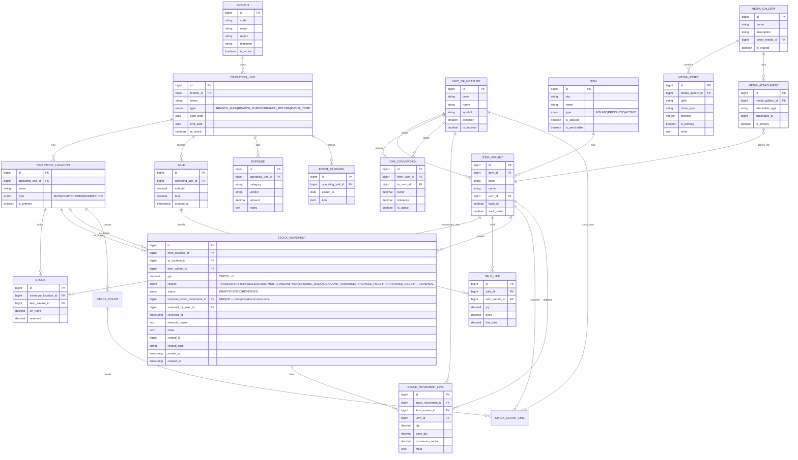
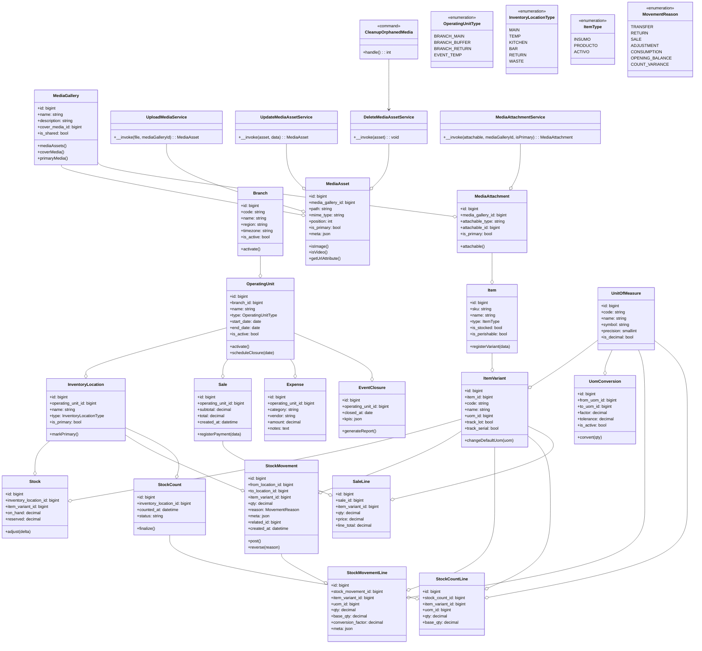
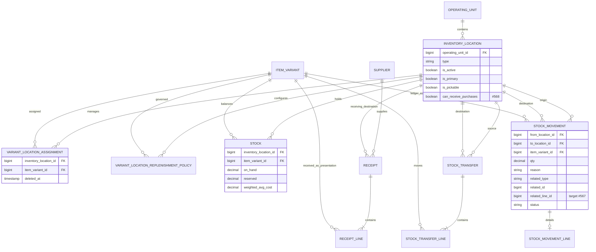
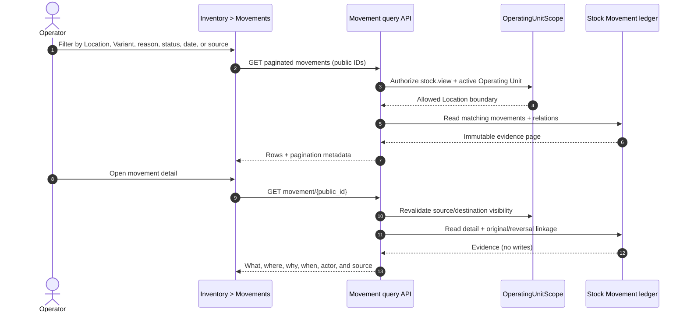
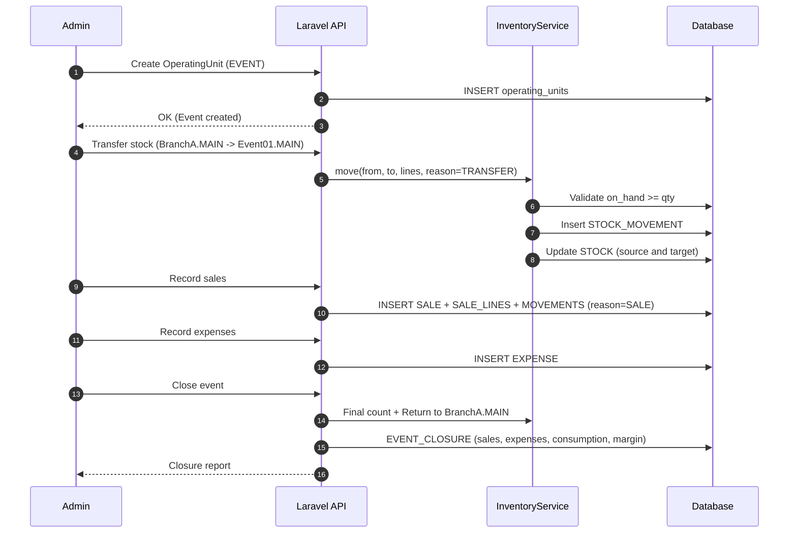
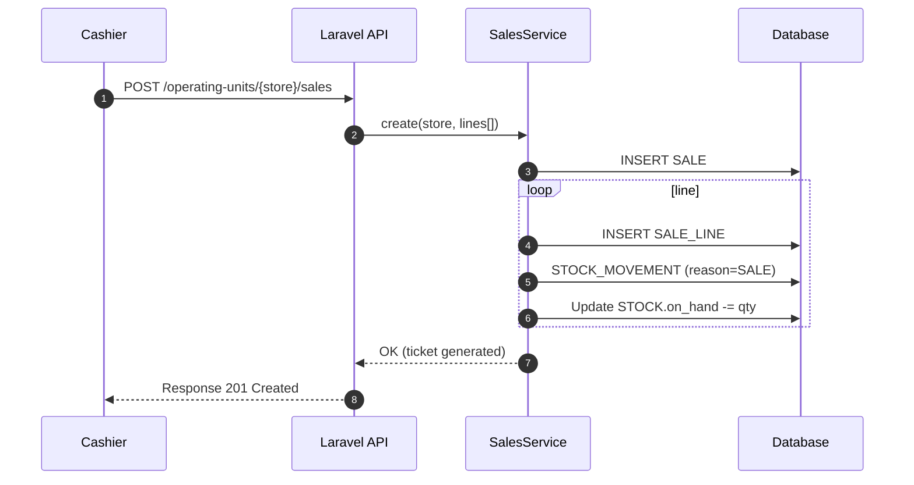
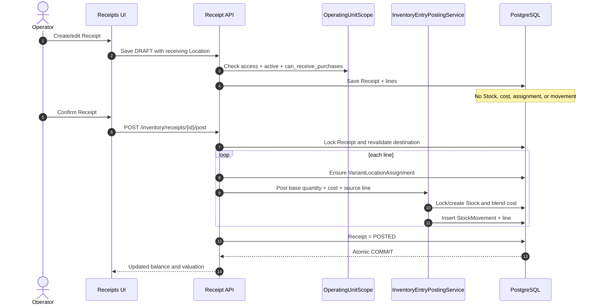
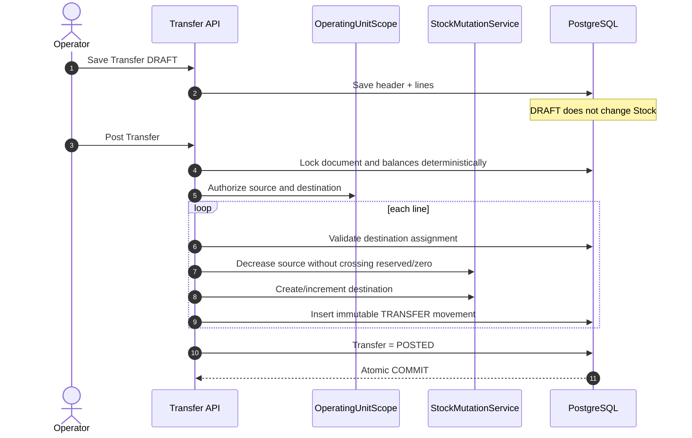

# 🍣 SushiGo Tenant — Inventory Architecture & Design

**Scope**
Comprehensive plan for the **SushiGo** tenant inventory system within ComandaFlow. Includes context, principles, domain model, ER diagrams, operational flows, and technical guidelines for implementation in Laravel + React.

---

## 1. Context and Requirements

SushiGo currently operates as a single restaurant with temporary events, but is preparing for:

-   **Multiple branches** that manage their own inventories by city or zone.
-   **Events (`EVENT`)** that require temporarily moving inventory, recording costs/sales, and executing closures with stock returns.
-   **Profitability control** per operating unit (store or event) and defined periods.
-   **Scalability** towards purchases, production, batches, and advanced analytics.

The system must guarantee:

-   Multi-location inventory per operating unit.
-   Auditable transfers and adjustments.
-   Registration of sales, expenses, and operational closures.
-   Complete traceability of movements (who, when, why).
-   Preparation for costing and forecasting modules.
-   Management of reusable image galleries with main cover, attachable to products or other domain objects.

---

## 2. Design Principles

| Principle                      | Description                                                                 |
| ------------------------------ | --------------------------------------------------------------------------- |
| **Single Tenant Scope**        | All data belongs to the SushiGo tenant; no multi-client isolation required. |
| **Operating Unit Abstraction** | Each operation occurs within a unit (branch inventory or temporary event).  |
| **Inventory by Location**      | Stock segregated by `InventoryLocation` (MAIN, KITCHEN, BAR, etc.).         |
| **Complete Traceability**      | Each movement generates `StockMovement` and detailed lines.                 |
| **Expandable Architecture**    | Ready for purchases, batches, production, and analytics.                    |
| **Secure IDs**                 | Internal incremental IDs, external exposed as `public_id` (ULID).           |
| **Service-Oriented Layering**  | Thin controllers → Domain services → Models.                                |
| **Laravel Native**             | Use of Laravel 12 + Spatie Permission native patterns.                      |

---

## 3. Domain Model

> **Note (updated #442):** the `Item`/`ItemVariant` shapes below (§3.2 ER diagram, §3.7 class
> diagram) now reflect the as-built identity-only schema. `min_stock`/`max_stock` moved to a
> per-Inventory-Location policy (#439, §3.10); `last_unit_cost`/`avg_unit_cost`/`sale_price` were
> dropped from `item_variants` in #442 — acquisition cost lives on `Stock.weighted_avg_cost` per
> location (#434, §3.9) and sale price on effective-dated price lists (#435). `Item.sku` is
> retained: authoritative for `INSUMO`/`ACTIVO` (#500), deprecated only for `type = PRODUCTO`. See
> [Product Catalog — Target Architecture](product-catalog/product-catalog-architecture.en.md) and
> [TD-03](../decisions/td-03-product-catalog-separation.md) for the Product/Variant/Purchase
> Presentation model and the full migration sequence.

### 3.1 Main Entities

-   **Branch**: physical/administrative branch of the tenant; groups permanent and temporary inventories.
-   **OperatingUnit (Inventory)**: operational context within a branch (main inventory, auxiliary warehouses, or temporary events).
-   **InventoryLocation**: physical or logical zones within each unit.
-   **Item / ItemVariant**: master catalog (assets `ACTIVO`, finished products, supplies).
-   **UnitOfMeasure / UomConversion**: base unit per variant and allowed conversions.
-   **Stock / StockMovement / StockMovementLine**: stock, movements, and transactional detail.
-   **Sale / SaleLine**: sales tickets per operating unit.
-   **Expense**: operating expenses per unit.
-   **EventClosure**: results and KPIs at event closure.
-   **StockCount / StockCountLine**: physical counts that feed adjustments.
-   **MediaGallery / MediaAsset / MediaAttachment**: image management (cover + gallery) reusable between products, variants, or other models.
-   **Users & Roles**: personnel assignment to units and permissions by domain.

### 3.2 Main ER Diagram


```mermaid
erDiagram
  BRANCH ||--o{ OPERATING_UNIT : owns
  OPERATING_UNIT ||--o{ INVENTORY_LOCATION : has
  OPERATING_UNIT ||--o{ SALE : records
  OPERATING_UNIT ||--o{ EXPENSE : logs
  OPERATING_UNIT ||--o{ EVENT_CLOSURE : closes

  INVENTORY_LOCATION ||--o{ STOCK : holds
  INVENTORY_LOCATION ||--o{ STOCK_MOVEMENT : as_origin
  INVENTORY_LOCATION ||--o{ STOCK_MOVEMENT : as_target
  INVENTORY_LOCATION ||--o{ STOCK_COUNT : counts

  UNIT_OF_MEASURE ||--o{ ITEM_VARIANT : default
  UNIT_OF_MEASURE ||--o{ UOM_CONVERSION : origin
  UNIT_OF_MEASURE ||--o{ UOM_CONVERSION : target

  ITEM ||--o{ ITEM_VARIANT : has
  ITEM_VARIANT ||--o{ STOCK : stored
  ITEM_VARIANT ||--o{ SALE_LINE : sold
  ITEM_VARIANT ||--o{ STOCK_MOVEMENT : moved
  ITEM_VARIANT ||--o{ STOCK_COUNT_LINE : counted
  ITEM_VARIANT ||--o{ STOCK_MOVEMENT_LINE : detailed

  STOCK_MOVEMENT ||--o{ STOCK_MOVEMENT_LINE : lines
  UNIT_OF_MEASURE ||--o{ STOCK_MOVEMENT_LINE : transacted_uom
  UNIT_OF_MEASURE ||--o{ STOCK_COUNT_LINE : count_uom

  SALE ||--o{ SALE_LINE : details
  STOCK_COUNT ||--o{ STOCK_COUNT_LINE : details
  MEDIA_GALLERY ||--o{ MEDIA_ASSET : contains
  MEDIA_GALLERY ||--o{ MEDIA_ATTACHMENT : links
  MEDIA_ATTACHMENT }o--|| ITEM_VARIANT : gallery_for

  BRANCH {
    bigint id PK
    string code
    string name
    string region
    string timezone
    boolean is_active
  }

  OPERATING_UNIT {
    bigint id PK
    bigint branch_id FK
    string name
    enum type "BRANCH_MAIN|BRANCH_BUFFER|BRANCH_RETURN|EVENT_TEMP"
    date start_date
    date end_date
    boolean is_active
  }

  INVENTORY_LOCATION {
    bigint id PK
    bigint operating_unit_id FK
    string name
    enum type "MAIN|TEMP|KITCHEN|BAR|RETURN"
    boolean is_primary
  }

  ITEM {
    bigint id PK
    string sku
    string name
    enum type "INSUMO|PRODUCTO|ACTIVO"
    boolean is_stocked
    boolean is_perishable
  }

  ITEM_VARIANT {
    bigint id PK
    bigint item_id FK
    string code
    string name
    bigint uom_id FK
    boolean track_lot
    boolean track_serial
  }

  UNIT_OF_MEASURE {
    bigint id PK
    string code
    string name
    string symbol
    smallint precision
    boolean is_decimal
  }

  UOM_CONVERSION {
    bigint id PK
    bigint from_uom_id FK
    bigint to_uom_id FK
    decimal factor
    decimal tolerance
    boolean is_active
  }

  STOCK {
    bigint id PK
    bigint inventory_location_id FK
    bigint item_variant_id FK
    decimal on_hand
    decimal reserved
  }

  STOCK_MOVEMENT {
    bigint id PK
    bigint from_location_id FK
    bigint to_location_id FK
    bigint item_variant_id FK
    decimal qty "CHECK > 0"
    enum reason "TRANSFER|RETURN|SALE|ADJUSTMENT|CONSUMPTION|OPENING_BALANCE|COUNT_VARIANCE|PURCHASE_RECEIPT|PURCHASE_RECEIPT_REVERSAL"
    enum status "DRAFT|POSTED|REVERSED"
    bigint reverses_stock_movement_id FK "UNIQUE — compensated at most once"
    bigint reversed_by_user_id FK
    timestamp reversed_at
    text reversal_reason
    json meta
    bigint related_id
    string related_type
    timestamp posted_at
    timestamp created_at
  }

  STOCK_MOVEMENT_LINE {
    bigint id PK
    bigint stock_movement_id FK
    bigint item_variant_id FK
    bigint uom_id FK
    decimal qty
    decimal base_qty
    decimal conversion_factor
    json meta
  }

  SALE {
    bigint id PK
    bigint operating_unit_id FK
    decimal subtotal
    decimal total
    timestamp created_at
  }

  SALE_LINE {
    bigint id PK
    bigint sale_id FK
    bigint item_variant_id FK
    decimal qty
    decimal price
    decimal line_total
  }

  EXPENSE {
    bigint id PK
    bigint operating_unit_id FK
    string category
    string vendor
    decimal amount
    text notes
  }

  EVENT_CLOSURE {
    bigint id PK
    bigint operating_unit_id FK
    date closed_at
    json kpis
  }

  MEDIA_GALLERY {
    bigint id PK
    string name
    string description
    bigint cover_media_id FK
    boolean is_shared
  }

  MEDIA_ASSET {
    bigint id PK
    bigint media_gallery_id FK
    string path
    string mime_type
    integer position
    boolean is_primary
    json meta
  }

  MEDIA_ATTACHMENT {
    bigint id PK
    bigint media_gallery_id FK
    string attachable_type
    bigint attachable_id
    boolean is_primary
  }
```

### 3.3 Units of Measure and Transactions

-   Each variant has a **base unit** (`ITEM_VARIANT.uom_id`).
-   Conversions (`UOM_CONVERSION`) define directed factors `from_uom → to_uom` with tolerances.
-   Only `INSUMO` enables multiple conversions; `PRODUCTO` and `ACTIVO` operate 1:1 (same input and output unit).
-   `StockMovementLine` records both the operated quantity (`qty`, `uom_id`) and the normalized quantity (`base_qty`) and the applied factor.
-   `meta.original_qty` and `meta.original_uom` in `StockMovement` preserve the original transaction for auditing and costing.
-   Physical counts (`StockCountLine`) accept any unit and are converted with the same rules.

### 3.4 Security and Roles

The detail of the user, role, and permission system is documented in
[Security & User System Architecture](./security-and-user-system-architecture.en.md).
It describes the assignment flow, base roles (`super-admin`, `admin`, `user`), and the strategy to combine direct permissions with contextual roles.

---

### 3.5 Branch and Inventory Model

-   **Branch** acts as master container. Each branch has at least one permanent inventory (`OperatingUnit` of type `BRANCH_MAIN`) and can add auxiliary inventories (`BRANCH_BUFFER`, `BRANCH_RETURN`, etc.).
-   **Events** are represented as temporary `OperatingUnit` (`EVENT_TEMP`) associated with a source branch; they have `start_date` and `end_date` to delimit cutoff and stock return.
-   **Transfers** are expressed between `InventoryLocation` records; each endpoint's
    `OperatingUnit` determines whether the move is internal, between a branch's units, or between
    branches. The `StockMovement` contract already accepts `TRANSFER`, but as of 2026-08-30 the
    Transfer document/API/UI remains planned in [#573](https://github.com/pakodiazdev/sushigo/issues/573)
    and must not be read as an already-built workflow.
-   When the system does not yet expose branch management, a default branch can be initialized and work with its main inventory. The design supports activating additional branches without refactoring domains.
-   Stock and profitability reports are calculated per `OperatingUnit` and aggregate metrics per branch for financial and operational analysis.

**Proposed Schema**

| Table                 | Key Fields                                                         | Notes                                                                                |
| --------------------- | ------------------------------------------------------------------ | ------------------------------------------------------------------------------------ |
| `branches`            | `id`, `code`, `name`, `region`, `timezone`, `is_active`            | Branch catalog; initially one is created by default.                                 |
| `operating_units`     | `branch_id`, `type`, `name`, `start_date`, `end_date`, `is_active` | Permanent (`BRANCH_*`) or temporary (`EVENT_TEMP`) inventories.                      |
| `inventory_locations` | `operating_unit_id`, `name`, `type`, `is_primary`, `is_active`, `can_receive_purchases` (#568) | Locations within each inventory; `can_receive_purchases` makes purchase-receiving eligibility an explicit, queryable capability. |
| `stock_movements`     | `from_location_id`, `to_location_id`, `reason`, `related_id`       | Allows inter-branch transfers thanks to the branch associated with each location.    |
| `event_closures`      | `operating_unit_id`, `closed_at`, `kpis`                           | Applies only to temporary inventories; executes closure and return to source branch. |

---

### 3.6 Media and Reusable Galleries

> Full system-level architecture (ownership authorization, concurrency safety, storage abstraction) lives in a dedicated document: [Media System Architecture](media/media-architecture.en.md). This section only covers how `Item` participates in it from the inventory domain's side.

-   **MediaGallery** is the logical container of images; supports `is_shared` flag to reuse the same gallery between models.
-   **MediaAsset** represents each file (storage path, MIME, order, and whether it's the main image). The `position` field defines order and `is_primary` guarantees one cover per gallery.
-   **MediaAttachment** allows associating galleries to any model (`attachable_type` + `attachable_id`). `Item` is the first adopter ([#377](https://github.com/pakodiazdev/sushigo/issues/377)); it's left open to future entities like `Employee`, `User`, or the upcoming Dish catalog — see `doc/conventions/backend/media-uploads.md` for the upload-first/attach-on-save pattern every new adopter follows.
-   Orphaned galleries (uploaded but never attached — e.g. an abandoned "New Dish" form) aren't cleaned up reactively on delete; `php artisan media:cleanup-orphans` sweeps them once they're older than a configurable grace period. See [TD-02](../decisions/td-02-media-cleanup-strategy.md) for why this runs at container startup instead of a recurring schedule.
-   Transformations (thumbnails, webp, etc.) are stored in `meta` within the asset to coordinate with the file pipeline.
-   `App\Services\Media\UploadMediaService`, `UpdateMediaAssetService`, `DeleteMediaAssetService`, and `App\Services\Media\MediaAttachmentService` — each a single-responsibility, invokable (`__invoke()`) class — encapsulate storage interaction. All go through `Storage::disk(config('filesystems.default'))` — never a hardcoded disk name — so Laravel's own Flysystem abstraction (already scaffolded with `local`/`public`/`s3` in `config/filesystems.php`) satisfies "swap cloud provider without touching business code" with no custom driver interface needed.

---

### 3.7 Class Diagram (Logical View)


```mermaid
classDiagram
  class Branch {
    +id: bigint
    +code: string
    +name: string
    +region: string
    +timezone: string
    +is_active: bool
    +activate()
  }

  class OperatingUnit {
    +id: bigint
    +branch_id: bigint
    +name: string
    +type: OperatingUnitType
    +start_date: date
    +end_date: date
    +is_active: bool
    +activate()
    +scheduleClosure(date)
  }

  class InventoryLocation {
    +id: bigint
    +operating_unit_id: bigint
    +name: string
    +type: InventoryLocationType
    +is_primary: bool
    +markPrimary()
  }

  class Item {
    +id: bigint
    +sku: string
    +name: string
    +type: ItemType
    +is_stocked: bool
    +is_perishable: bool
    +registerVariant(data)
  }

  class ItemVariant {
    +id: bigint
    +item_id: bigint
    +code: string
    +name: string
    +uom_id: bigint
    +track_lot: bool
    +track_serial: bool
    +changeDefaultUom(uom)
  }

  class UnitOfMeasure {
    +id: bigint
    +code: string
    +name: string
    +symbol: string
    +precision: smallint
    +is_decimal: bool
  }

  class UomConversion {
    +id: bigint
    +from_uom_id: bigint
    +to_uom_id: bigint
    +factor: decimal
    +tolerance: decimal
    +is_active: bool
    +convert(qty)
  }

  class Stock {
    +id: bigint
    +inventory_location_id: bigint
    +item_variant_id: bigint
    +on_hand: decimal
    +reserved: decimal
    +adjust(delta)
  }

  class StockMovement {
    +id: bigint
    +from_location_id: bigint
    +to_location_id: bigint
    +item_variant_id: bigint
    +qty: decimal
    +reason: MovementReason
    +meta: json
    +related_id: bigint
    +created_at: datetime
    +post()
    +reverse(reason)
  }

  class StockMovementLine {
    +id: bigint
    +stock_movement_id: bigint
    +item_variant_id: bigint
    +uom_id: bigint
    +qty: decimal
    +base_qty: decimal
    +conversion_factor: decimal
    +meta: json
  }

  class StockCount {
    +id: bigint
    +inventory_location_id: bigint
    +counted_at: datetime
    +status: string
    +finalize()
  }

  class StockCountLine {
    +id: bigint
    +stock_count_id: bigint
    +item_variant_id: bigint
    +uom_id: bigint
    +qty: decimal
    +base_qty: decimal
  }

  class Sale {
    +id: bigint
    +operating_unit_id: bigint
    +subtotal: decimal
    +total: decimal
    +created_at: datetime
    +registerPayment(data)
  }

  class SaleLine {
    +id: bigint
    +sale_id: bigint
    +item_variant_id: bigint
    +qty: decimal
    +price: decimal
    +line_total: decimal
  }

  class Expense {
    +id: bigint
    +operating_unit_id: bigint
    +category: string
    +vendor: string
    +amount: decimal
    +notes: text
  }

  class EventClosure {
    +id: bigint
    +operating_unit_id: bigint
    +closed_at: date
    +kpis: json
    +generateReport()
  }

  class MediaGallery {
    +id: bigint
    +name: string
    +description: string
    +cover_media_id: bigint
    +is_shared: bool
    +mediaAssets()
    +coverMedia()
    +primaryMedia()
  }

  class MediaAsset {
    +id: bigint
    +media_gallery_id: bigint
    +path: string
    +mime_type: string
    +position: int
    +is_primary: bool
    +meta: json
    +isImage()
    +isVideo()
    +getUrlAttribute()
  }

  class MediaAttachment {
    +id: bigint
    +media_gallery_id: bigint
    +attachable_type: string
    +attachable_id: bigint
    +is_primary: bool
    +attachable()
  }

  class UploadMediaService {
    +__invoke(file, mediaGalleryId): MediaAsset
  }

  class UpdateMediaAssetService {
    +__invoke(asset, data): MediaAsset
  }

  class DeleteMediaAssetService {
    +__invoke(asset): void
  }

  class MediaAttachmentService {
    +__invoke(attachable, mediaGalleryId, isPrimary): MediaAttachment
  }

  class CleanupOrphanedMedia {
    <<command>>
    +handle(): int
  }

  class OperatingUnitType {
    <<enumeration>>
    BRANCH_MAIN
    BRANCH_BUFFER
    BRANCH_RETURN
    EVENT_TEMP
  }

  class InventoryLocationType {
    <<enumeration>>
    MAIN
    TEMP
    KITCHEN
    BAR
    RETURN
    WASTE
  }

  class ItemType {
    <<enumeration>>
    INSUMO
    PRODUCTO
    ACTIVO
  }

  class MovementReason {
    <<enumeration>>
    TRANSFER
    RETURN
    SALE
    ADJUSTMENT
    CONSUMPTION
    OPENING_BALANCE
    COUNT_VARIANCE
  }

  Branch --o OperatingUnit
  OperatingUnit --o InventoryLocation
  OperatingUnit --o Sale
  OperatingUnit --o Expense
  OperatingUnit --o EventClosure
  InventoryLocation --o Stock
  InventoryLocation --o StockMovement
  InventoryLocation --o StockCount
  Item --o ItemVariant
  ItemVariant --o Stock
  ItemVariant --o StockMovement
  ItemVariant --o StockMovementLine
  ItemVariant --o StockCountLine
  ItemVariant --o SaleLine
  UnitOfMeasure --o ItemVariant
  UnitOfMeasure --o UomConversion
  UnitOfMeasure --o StockMovementLine
  UnitOfMeasure --o StockCountLine
  StockMovement --o StockMovementLine
  StockCount --o StockCountLine
  Sale --o SaleLine
  MediaGallery --o MediaAsset
  MediaGallery --o MediaAttachment
  MediaAttachment --o Item
  UploadMediaService --o MediaAsset
  UpdateMediaAssetService --o MediaAsset
  DeleteMediaAssetService --o MediaAsset
  MediaAttachmentService --o MediaAttachment
  CleanupOrphanedMedia --> DeleteMediaAssetService
```

### 3.8 Class Summary

-   **Branch**
    -   Properties: `id`, `code`, `name`, `region`, `timezone`, `is_active`.
    -   Actions: `activate()` or `deactivate()` according to operational availability; defines default configurations (main inventory, currency).
-   **OperatingUnit**
    -   Properties: `id`, `branch_id`, `name`, `type`, `start_date`, `end_date`, `is_active`.
    -   Conceptual actions: `activate()` to enable operations, `scheduleClosure(date)` to mark closure date (will derive into services like `EventsService`); `changeType()` restricted to transition between `BRANCH_*` and `EVENT_TEMP`.
    -   Available types: `BRANCH_MAIN` (branch main inventory), `BRANCH_BUFFER`/`BRANCH_RETURN` (auxiliary warehouses) and `EVENT_TEMP` (temporary event inventory).
-   **InventoryLocation**
    -   Properties: `id`, `operating_unit_id`, `name`, `type`, `is_primary`.
    -   Actions: `markPrimary()` (used in initial unit adjustments).
-   **Item**
    -   Properties: `id`, `sku`, `name`, `type`, `is_stocked`, `is_perishable`.
    -   Actions: `registerVariant(data)` encapsulates variant creation through factories/actions.
-   **ItemVariant**
    -   Properties: `id`, `item_id`, `code`, `name`, `uom_id`, `track_lot`, `track_serial`.
    -   Actions: `changeDefaultUom(uom)` (validates 1:1 rules in products/assets), hooks for batches/serials.
-   **UnitOfMeasure**
    -   Properties: `id`, `code`, `name`, `symbol`, `precision`, `is_decimal`.
    -   Used as catalog; does not expose additional methods.
-   **UomConversion**
    -   Properties: `id`, `from_uom_id`, `to_uom_id`, `factor`, `tolerance`, `is_active`.
    -   Action: `convert(qty)` applies factor and tolerance (in practice resolved via `TransfersService`/`CostingService`).
-   **Stock**
    -   Properties: `id`, `inventory_location_id`, `item_variant_id`, `on_hand`, `reserved`.
    -   Actions: `adjust(delta)` to subtract/add stock (called from movement services).
-   **StockMovement** — the append-only stock ledger entry (**single-line contract**, see §4.3).
    -   Properties: `id`, `from_location_id`, `to_location_id`, `item_variant_id`, `qty`, `reason`,
        `status`, `meta`, `related_id`, `related_type`, `reverses_stock_movement_id`,
        `reversed_by_user_id`, `reversed_at`, `reversal_reason`, `posted_at`, `created_at`.
    -   The header is the single source of truth for the moved Variant and base quantity; a POSTED
        movement is immutable and non-deletable (guarded at the model layer — an
        `ImmutableStockMovementException` on any edit/delete), and its `qty` carries a `> 0` CHECK.
    -   Actions: `assertContractInvariants()` enforces positive quantity, the reason ⇄ source/
        destination shape, and legal status transitions (`DRAFT → POSTED → REVERSED` only, nothing
        else). `StockMovementReverser::reverse($movement, $userId, $reason)` posts an immutable,
        causally-linked compensating movement (mirrored direction, same qty/Variant), flips the
        original to `REVERSED` with `reversed_by/at/reason`, and — via a **UNIQUE**
        `reverses_stock_movement_id` plus a locked status re-check — guarantees the balance is
        restored **exactly once**. An impossible reversal (stock already consumed past the moved
        amount) raises `StockMovementReversalBoundaryException` and persists nothing.
-   **StockMovementLine** — the optional UOM/cost/pricing breakdown of that one movement.
    -   Properties: `id`, `stock_movement_id`, `item_variant_id`, `uom_id`, `qty`, `base_qty`,
        `conversion_factor`, `unit_cost`, `line_total`, pricing fields, `meta`.
    -   At most **one** line per movement (UNIQUE `stock_movement_id`); it cannot express a
        different Variant or a different `base_qty` than its header (guarded at the model layer).
        Removing the now-redundant `item_variant_id` / quantity columns from this table was scoped
        out of #442 (whose Technical Tasks enumerate only Item SKU and per-Variant cost/price
        fields) and is left for a dedicated follow-up, given the risk of a schema change on an
        actively-written transactional table.
-   **StockCount / StockCountLine**
    -   Main properties: `inventory_location_id`, `counted_at`, `status` and lines with `qty`, `uom_id`, `base_qty`.
    -   Actions: `finalize()` processes differences against `Stock`.
-   **Sale / SaleLine**
    -   Properties: `operating_unit_id`, `subtotal`, `total`, `created_at` and lines with `qty`, `price`, `line_total`.
    -   Actions: `registerPayment(data)` (orchestrated by `SalesService`), generation of `SALE` movements.
-   **Expense**
    -   Properties: `operating_unit_id`, `category`, `vendor`, `amount`, `notes`.
    -   Simple record, associated with reports and closures.
-   **EventClosure**
    -   Properties: `operating_unit_id`, `closed_at`, `kpis`.
    -   Actions: `generateReport()` invokes services for KPIs, balances, and stock returns.
-   **MediaGallery / MediaAsset / MediaAttachment**
    -   Main properties: gallery (`name`, `description`, `cover_media_id`, `is_shared`), assets (`path`, `mime_type`, `position`, `is_primary`, `meta`) and attachments (`attachable_type`, `attachable_id`, `is_primary`).
    -   Uploaded through `POST /api/v1/media/upload` (upload-first, before the owning entity exists), reordered/marked-primary through `PATCH /api/v1/media/assets/{id}`, removed through `DELETE /api/v1/media/assets/{id}` — see `doc/conventions/backend/media-uploads.md`.
-   **UploadMediaService, UpdateMediaAssetService, DeleteMediaAssetService & MediaAttachmentService**
    -   `UploadMediaService`, `UpdateMediaAssetService`, and `DeleteMediaAssetService` each own one step of the upload/reorder/delete lifecycle as a single-responsibility invokable class, always through `Storage::disk(config('filesystems.default'))` — no custom driver interface, Laravel's own Flysystem abstraction is enough to swap `local`/`s3` by config.
    -   `MediaAttachmentService` (invokable) is the only place a `MediaAttachment` is created, linking an already-uploaded gallery to its owning entity on save.
    -   `CleanupOrphanedMedia` (`php artisan media:cleanup-orphans`) deletes galleries with no attachment past a grace period — runs at container startup, see [TD-02](../decisions/td-02-media-cleanup-strategy.md).
    -   `MediaGallery::isManageableBy()` gates all three media endpoints beyond the route's base `media.*` permission: once attached to an entity, it delegates to that entity's `App\Contracts\AuthorizesMediaOwnership::userCanManageMedia()` (`Item` checks the dedicated `items.manage-media` permission, not `items.update` — that also guards catalog/pricing edits); while still unattached, it checks a client-generated `owner_token` captured at creation — see `doc/conventions/backend/media-uploads.md` § 5.

> Note: the described "actions" will be modeled as methods in services/applications (e.g., `TransfersService` or domain actions). The diagram helps visualize responsibilities before moving them to service and job layers.

### 3.9 Weighted-Average Cost (#434)

Before `#434`, `OpeningBalanceService` wrote a *global*, cross-location weighted average onto
`ItemVariant.avg_unit_cost`, while `#432`'s Receipts wrote a *per-location* weighted average onto
`Stock.weighted_avg_cost` — the two could silently diverge, and stock-out costing/reporting each
read whichever field happened to be nearby.

**Source of truth: `Stock.weighted_avg_cost`, scoped per Inventory Location.** A catalog Variant
received into two different locations at different prices has two different actual acquisition
costs — blending them into one Variant-level number would misstate valuation at whichever location
paid more (or less) than the blended average. `#434` reconciled the legacy
`ItemVariant.avg_unit_cost`/`last_unit_cost` values with the per-location rollup and froze them
read-only; `#442` then **dropped both columns** (along with `sale_price`) from `item_variants`
entirely — `Stock.weighted_avg_cost` is the only acquisition cost the catalog knows about.

**Every writer goes through one calculation.** `Stock::applyWeightedAverageCost(float $qtyAdded,
float $unitCost)` is the only method that mutates `weighted_avg_cost`, and it delegates the blend
formula itself to `App\Support\Money\WeightedAverageCostCalculator::blend()` — a small, pure,
bcmath-backed helper (exact-decimal, not float, internally) shared by every cost-bearing inbound
flow:

-   `ReceiptService::postReceipt()` — one call per posted line, using the Receipt line's
    `effective_unit_cost` (see `doc/architecture/purchasing/purchase-receipts.en.md`).
-   `OpeningBalanceService::registerOpeningBalance()` — one call when a unit cost is supplied.

**Precision target (#415).** [TD-05](../decisions/td-05-monetary-precision-and-rounding.md) defines
`weighted_avg_cost` and other unit costs as exact scale-4 rates, quantities as scale 4, and
intermediate blends at scale 8 or greater. Valuation becomes Money only at its documented boundary,
where it rounds to scale 2 with `ROUND_HALF_UP`. The original two-decimal transaction total remains
authoritative; a rounded unit rate must never be multiplied back to rewrite that evidence. The
current float method signature above is as-built and must be removed by Sprint 8 issue #415.

**Transfers (target #573).** Posting a Transfer does not change the source Location's weighted
average: removing homogeneous units does not change the cost of those that remain. The line
snapshots that source cost and the destination blends it as an inbound cost through the same
calculator. A reversal does not attempt to reconstruct historical averages after later movements;
without lots/cost layers that reconstruction would not be exact. Compensating movements restore
quantity and retain the cost evidence used at posting.

**Every reader goes through the same field.** `StockOutService` costs an outbound movement using the
*same location's* `Stock.weighted_avg_cost` (never the catalog Variant); `SummarizesStock`,
`StockByLocationController`, and `StockByVariantController` already read it directly for valuation
reports.

Reversing a posted Receipt intentionally leaves `weighted_avg_cost` untouched — unwinding a blended
average exactly would need lot-level cost tracking this codebase doesn't have.

### 3.10 Replenishment thresholds, per Inventory Location (#439)

Before `#439`, `ItemVariant` carried a single global `min_stock` / `max_stock` pair. A Variant
stocked in a branch main warehouse, a bar fridge, and a temporary event unit has three different
demands and capacities, so one number could not represent any of them.

**Source of truth: `VariantLocationReplenishmentPolicy`, one row per `(inventory_location_id,
item_variant_id)` pair.** It holds `min_stock` (the reorder point), `max_stock` (the target
ceiling, DB-enforced `>= min_stock`), and an optional `notes`. A partial unique index keeps one
live policy per pair; the row soft-deletes. `ItemVariant.min_stock` / `max_stock` were dropped —
a one-time migration moved each legacy pair onto a policy row **only** where the Variant had stock
at exactly one location (an unambiguous target), and logged every pair it could not place, with a
summary (`LegacyThresholdMigrator`). Because the old schema had no `max >= min` guard, a legacy
ceiling below its reorder point (typically `0`, left unset) is clamped up to the reorder point on
migration — flagged per row and counted in the summary — rather than aborting on the new
constraint.

**Resolution goes through one service.** `App\Services\Inventory\ReplenishmentPolicyResolver`
returns the effective policy for a `(location, variant)` pair — today a direct lookup of the
location-level row; it is the single seam where Operating-Unit-level defaults/inheritance would be
added later. A stock row with **no** resolved policy is never "low" — there is no configured
reorder point to compare against.

**Low-stock semantics.** A `Stock` row is low when a resolved policy exists and `on_hand <=
policy.min_stock`. `Stock::scopeLowStock()` and `ItemVariant::scopeLowStock()` are defined in these
terms; `SummarizesStock` / `StockByLocationController` / `StockByVariantController` expose the
resolved `min_stock` / `max_stock` and an `is_low_stock` flag per row plus a low-count in the
summary; `GET /stock` gains a `low_stock` filter and carries the resolved fields on every row.

**API.** Location-scoped, under `inventory-locations/{id}/replenishment-policies`: `GET /` (list),
`GET /{variantId}` (resolved policy, synthetic `is_configured:false` when unset), `PUT /{variantId}`
(idempotent upsert — 201 new / 200 update), `DELETE /{variantId}`. Reads require `stock.view`,
writes `stock.manage` — replenishment configuration is stock governance, not catalog identity, so
it reuses the stock permissions rather than minting new ones. The management UI is a per-location
panel in the Stock Dashboard's location detail.

---

### 3.11 Horizontal Authorization — Operating Unit Scope (#440)

A global capability (`inventory_locations.*`, `stock.*`, …) says *what* a user may do; it does
**not** say *where*. Enforcing only the permission would let any holder read or mutate another
branch/event unit by guessing public IDs or changing a filter. Horizontal ("row-level")
authorization closes that gap.

**Rule.** For every scoped Inventory read or mutation, the caller must hold an **active**
`operating_unit_users` membership (`is_active = true`) in the Operating Unit that owns the
addressed `InventoryLocation` — *in addition to* the functional permission.

**Bypass roles.** Users with the `super-admin` or `admin` role bypass the membership requirement
entirely (they still need the functional permission). This is explicit and tested, not an
accident of the seeders assigning admins to every unit — see
`App\Support\Access\OperatingUnitScope::BYPASS_ROLES`.

**Single source of truth.** `App\Support\Access\OperatingUnitScope` centralizes the contract:

| Method | Used by |
| --- | --- |
| `accessibleOperatingUnitIds()` / `constrainLocations()` / `constrainStock()` | List endpoints — the result set is narrowed to the caller's units *before* any request filter, so `?operating_unit_id=` / `?inventory_location_id=` can never widen it. |
| `canAccessLocation()` | `InventoryLocationPolicy` per-instance abilities (`view`/`update`/`delete`/`restore`/`forceDelete`) via the `ChecksOperatingUnitAccess` concern; class-string Gate checks stay permission-only (#400). |
| `assertCanAccessLocation()` (throws 403) | Show / mutation controllers and stock movement flows — called once per location a movement touches, so **both** the source and the destination of a transfer are validated under the same rule. |

**Applied here:** Inventory Location list/show/create/update/delete, the `stock` query endpoints
(`/stock`, `/stock/by-location/{id}`, `/stock/by-variant/{id}`), the per-location
replenishment-policy sub-resource (`/inventory-locations/{id}/replenishment-policies…`, #439), and
the stock movement operations (`opening-balance`, `stock-out`). Receipt endpoints and additional
stock filters adopt the same `OperatingUnitScope` contract as their own issues land (coordinated
with #432).

An unknown / `missing` location or operating-unit id still fails as a normal `422` validation
error (the `exists` rule), never a misleading `403`.

---

### 3.12 Warehouse receiving and Location-aware Stock — Sprint 7 target

> **Status as of 2026-08-30:** this section is the approved target architecture for
> [Sprint 007](../sprints/planned/sprint-007-warehouse-receiving-and-location-aware-stock.md), not a
> claim that the code is already delivered. Pending pieces are tracked by #567–#574.

#### Warehouse boundary

Sprint 7 does not add a `warehouses` table. The existing model already separates operational scope
from custody:

```text
Branch
  └─ OperatingUnit          operational and authorization scope
       └─ InventoryLocation physical/logical custody point for Stock
```

A Location carries an explicit persisted `can_receive_purchases` capability (#568, delivered),
independent from `type`, `is_primary`, `is_active`, and `is_pickable`: primary storage may be
storage-only, while a receiving dock may accept purchases without being primary. New Locations
default to `false`; the #568 migration backfills only today's active, primary `MAIN` Locations
(excluding soft-deleted rows) to `true`, and rewrites no Receipt/Stock/StockMovement history.
`GET /api/v1/inventory-locations` accepts an optional `can_receive_purchases` filter that is always
applied inside the caller's `OperatingUnitScope`. Receipt-destination enforcement itself — a Receipt
may target only a non-deleted, active, receiving-capable Location inside the caller's
`OperatingUnitScope` — remains #572's target.

A separate `Warehouse` entity becomes justified only when one Operating Unit must contain multiple
administratively independent warehouses. Before that requirement exists it would duplicate the
ownership, authorization, and defaults already represented by `OperatingUnit` + `InventoryLocation`.

#### Assortment, evidence, and balance are separate concepts

| Concept | Target source of truth | Semantics |
|---|---|---|
| Managed assortment | `VariantLocationAssignment` (#569) | Variant is managed at the Location; creates no quantity |
| Policy | `VariantLocationReplenishmentPolicy` (#439) | Optional min/max for the pair; implies no balance |
| Evidence | `StockMovement` + line (#438, #567, #574) | Immutable and queryable ledger: reason, direction, quantity, source, actor, time |
| Projection | `Stock` (#430, #434) | Current balance and weighted-average cost by Location + Variant |

Assigning a Variant never inserts Stock. The first posted entry lazily creates the balance row with
the existing race-safe pattern. Existencias queries start from assortment and optionally project
Stock (#571), so an assigned pair with no physical row displays as zero without persisting a fake
balance or movement.

#### Target ER diagram


```mermaid
erDiagram
  OPERATING_UNIT ||--o{ INVENTORY_LOCATION : contains
  INVENTORY_LOCATION ||--o{ VARIANT_LOCATION_ASSIGNMENT : manages
  ITEM_VARIANT ||--o{ VARIANT_LOCATION_ASSIGNMENT : assigned
  INVENTORY_LOCATION ||--o{ VARIANT_LOCATION_REPLENISHMENT_POLICY : configures
  ITEM_VARIANT ||--o{ VARIANT_LOCATION_REPLENISHMENT_POLICY : governed
  INVENTORY_LOCATION ||--o{ STOCK : holds
  ITEM_VARIANT ||--o{ STOCK : balances

  SUPPLIER ||--o{ RECEIPT : supplies
  INVENTORY_LOCATION ||--o{ RECEIPT : receiving_destination
  RECEIPT ||--|{ RECEIPT_LINE : contains
  ITEM_VARIANT ||--o{ RECEIPT_LINE : received_as_presentation

  INVENTORY_LOCATION ||--o{ STOCK_TRANSFER : source
  INVENTORY_LOCATION ||--o{ STOCK_TRANSFER : destination
  STOCK_TRANSFER ||--|{ STOCK_TRANSFER_LINE : contains
  ITEM_VARIANT ||--o{ STOCK_TRANSFER_LINE : moves

  INVENTORY_LOCATION ||--o{ STOCK_MOVEMENT : origin
  INVENTORY_LOCATION ||--o{ STOCK_MOVEMENT : destination
  ITEM_VARIANT ||--o{ STOCK_MOVEMENT : ledger_entry
  STOCK_MOVEMENT ||--o| STOCK_MOVEMENT_LINE : details

  INVENTORY_LOCATION {
    bigint operating_unit_id FK
    string type
    boolean is_active
    boolean is_primary
    boolean is_pickable
    boolean can_receive_purchases "#568"
  }

  VARIANT_LOCATION_ASSIGNMENT {
    bigint inventory_location_id FK
    bigint item_variant_id FK
    timestamp deleted_at
  }

  STOCK {
    bigint inventory_location_id FK
    bigint item_variant_id FK
    decimal on_hand
    decimal reserved
    decimal weighted_avg_cost
  }

  STOCK_MOVEMENT {
    bigint from_location_id FK
    bigint to_location_id FK
    bigint item_variant_id FK
    decimal qty
    string reason
    string related_type
    bigint related_id
    bigint related_line_id "target #567"
    string status
  }
```

#### Write boundaries

- Creating Products/Variants, assigning assortment, configuring min/max, and saving `DRAFT`
  documents do not change Stock.
- Posting a Receipt creates/increments Stock at its receiving Location and appends one
  `PURCHASE_RECEIPT` evidence row per line (#572).
- Posting an Opening Balance creates/increments Stock with `OPENING_BALANCE` evidence; it is not a
  purchase and does not require `can_receive_purchases` (#570).
- Posting a Transfer decrements source and increments destination in one transaction and appends
  one `TRANSFER` row per line (#573).
- Every inbound entry (Receipt line, Opening Balance) posts through the one
  `InventoryEntryPostingService` primitive (#567), which appends the immutable movement, locks or
  race-safely creates `Stock`, and blends weighted-average cost as one operation the owning document
  transaction controls.
- Source-line identity is explicit on the movement — `related_type`/`related_id`/`related_line_id` —
  and a partial UNIQUE index over `(related_type, related_id, related_line_id, reason)` (live `POSTED`
  rows with a non-null line only) makes replaying the same source line idempotent: it returns the
  existing movement instead of incrementing Stock twice. `related_line_id` is null for manual
  movements with no source document, which the index leaves unconstrained.
- Every reversal is compensating; posted history is never edited or deleted.

#### Read-only movement ledger (#574 — delivered)

The movement ledger is a read model over existing immutable evidence, not another Stock source of
truth. List and detail queries are paginated, use public IDs, apply `stock.view`, and restrict both
source and destination Locations to the caller's active `OperatingUnitScope`. Filtering or opening
a detail must never materialize Stock, create evidence, or mutate a posted movement.

**Delivered contract:**

| Concern | Decision |
|---|---|
| Endpoints | `GET /api/v1/inventory/movements` (paginated list) · `GET /api/v1/inventory/movements/{movement}` (detail, bound by `public_id`) |
| Permission | `stock.view` — no dedicated read permission; the ledger only exposes evidence the Stock query endpoints already imply |
| Operating Unit scope | `OperatingUnitScope::constrainStockMovements()` (list) / `assertCanAccessStockMovement()` (detail) — a movement is visible when **either** touched Location belongs to an accessible unit; applied **before** filters/count/pagination so page metadata never leaks foreign rows. `super-admin`/`admin` bypass. Soft-deleted Locations still resolve to their owning unit. |
| Ordering | `posted_at DESC NULLS LAST, id DESC` — deterministic, stable tie-breaker, DRAFT rows (null `posted_at`) sort last |
| Page size | default 15, hard max 100 (`>100` → 422) |
| Filters | `location_id` (source **or** destination), `item_variant_id`, `reason`, `status`, `date_from`/`date_to` (on `posted_at`), `search` (ILIKE on `reference`, wildcards escaped), `source_type` (stable token → FQCN via `StockMovementSourceType`; `receipt` today). Filter IDs are validated against the same unit scope, so an out-of-scope ULID 422s exactly like a nonexistent one. |
| Payload | Public ID, derived `direction` (`entry`/`exit`/`transfer`/`adjustment` — never the removed legacy `type`), `is_reversal`, quantity + base UOM, source/destination Location, Variant, actor, reference, `posted_at`, `source` `{type, id}` where `id` is the origin document's **public ULID** (null for manual movements or a hard-deleted source — never the internal `related_id`/`related_line_id` keys). Detail adds `notes`, the two-way `reverses` / `reversed_by` linkage, and the reversal audit trail. Optional/soft-deleted relations serialize as `null` without hiding the movement. |
| Foreign-unit masking | A cross-unit transfer is returned when *one* end is in scope (the OR in `constrainStockMovements`), but the endpoint Location the caller cannot reach is nulled out before serialization — it renders exactly like a genuinely external endpoint, so a scoped caller never learns a foreign unit's Location name or public ID. No-op for bypass roles. |
| N+1 | List eager-loads `fromLocation`/`toLocation`/`itemVariant.unitOfMeasure`/`user` (all `withTrashed`); query count is flat regardless of page size. |
| Navigation | `Inventario > Movimientos` → `/inventario/movimientos`, gated by `stock.view`. Filter and open-row state live in the URL query string, so a filtered view or a specific movement is shareable by copying the address. |


```mermaid
sequenceDiagram
  autonumber
  actor Operator
  participant UI as Inventory > Movements
  participant API as Movement query API
  participant Scope as OperatingUnitScope
  participant DB as Stock Movement ledger

  Operator->>UI: Filter by Location, Variant, reason, status, date, or source
  UI->>API: GET paginated movements (public IDs)
  API->>Scope: Authorize stock.view + active Operating Unit
  Scope-->>API: Allowed Location boundary
  API->>DB: Read matching movements + relations
  DB-->>API: Immutable evidence page
  API-->>UI: Rows + pagination metadata
  Operator->>UI: Open movement detail
  UI->>API: GET movement/{public_id}
  API->>Scope: Revalidate source/destination visibility
  API->>DB: Read detail + original/reversal linkage
  DB-->>API: Evidence (no writes)
  API-->>UI: What, where, why, when, actor, and source
```

---

### 3.13 Managed assortment, per Inventory Location (#569) — as built

The "target" framing in §3.12 for `VariantLocationAssignment` is now delivered. This subsection
records the shipped contract; §3.12's wider Sprint 7 target still covers the consuming workflows
(#570–#574).

**Source of truth: `VariantLocationAssignment`, one row per `(inventory_location_id,
item_variant_id)` pair.** It states only that the Variant is *managed* at the Location. It carries
no quantity, no cost, and no threshold — those stay in `Stock` (#430/#434) and
`VariantLocationReplenishmentPolicy` (#439) respectively, neither renamed nor overloaded here. A
partial unique index (`vla_one_assignment_per_pair`) keeps one live row per pair; the row
soft-deletes, so unassigning and later re-assigning reactivates the same row and keeps the audit
trail.

**Backfill.** The create-table migration seeds the table from the distinct union of existing
`stock` pairs and live replenishment-policy pairs (`VariantLocationAssignmentBackfill`), so no
currently-managed Variant disappears from reads that start from assortment. The backfill writes no
`Stock` row and no `StockMovement`, is idempotent, and is reversed by `down()` dropping the table.

**API.** Location-scoped, under `inventory-locations/{id}/variant-assignments`, reusing the stock
permissions (`stock.view` read, `stock.manage` write) and `OperatingUnitScope` for horizontal
access, exactly like the replenishment sub-resource:

| Route | Purpose |
| --- | --- |
| `GET /` | Variant-centric, searchable, paginated listing for a picker. `state=assigned` (default) returns the managed assortment, `state=unassigned` the assignable remainder (active catalog Variants only), `state=all` every active Variant annotated with its state. |
| `PUT /{variantId}` | Idempotent assign — `201` when a live row is created or a soft-deleted one is reactivated, `200` when one is already live. Never creates `Stock` or a movement. |
| `DELETE /{variantId}` | Soft-delete the live assignment. Refused with a deterministic `409` while the pair's `Stock` row still has `on_hand > 0` or `reserved > 0`. |

**UI.** A focused panel in the Inventory Location detail workflow (`LocationDetails`), deliberately
separate from the replenishment-threshold editor in the Stock Dashboard: search, an
assigned/unassigned/all filter, assign/unassign controls gated on `stock.manage`, and the `409`
rejection message surfaced verbatim in a toast.

---

## 4. Operational Flows

### 4.1 Event Flow

> **Target, not fully as-built:** #573 delivers the Transfer segment. The remainder keeps the
> long-term Event workflow visible.


```mermaid
sequenceDiagram
  autonumber
  participant Admin as Admin
  participant API as Laravel API
  participant Inv as InventoryService
  participant DB as Database

  Admin->>API: Create OperatingUnit (EVENT)
  API->>DB: INSERT operating_units
  API-->>Admin: OK (Event created)

  Admin->>API: Transfer stock (BranchA.MAIN -> Event01.MAIN)
  API->>Inv: move(from, to, lines, reason=TRANSFER)
  Inv->>DB: Validate on_hand >= qty
  Inv->>DB: Insert STOCK_MOVEMENT
  Inv->>DB: Update STOCK (source and target)

  Admin->>API: Record sales
  API->>DB: INSERT SALE + SALE_LINES + MOVEMENTS (reason=SALE)

  Admin->>API: Record expenses
  API->>DB: INSERT EXPENSE

  Admin->>API: Close event
  API->>Inv: Final count + Return to BranchA.MAIN
  API->>DB: EVENT_CLOSURE (sales, expenses, consumption, margin)
  API-->>Admin: Closure report
```

### 4.2 Normal Sale Flow


```mermaid
sequenceDiagram
  autonumber
  participant Cashier as Cashier
  participant API as Laravel API
  participant Sales as SalesService
  participant DB as Database

  Cashier->>API: POST /operating-units/{store}/sales
  API->>Sales: create(store, lines[])
  Sales->>DB: INSERT SALE
  loop line
    Sales->>DB: INSERT SALE_LINE
    Sales->>DB: STOCK_MOVEMENT (reason=SALE)
    Sales->>DB: Update STOCK.on_hand -= qty
  end
  Sales-->>API: OK (ticket generated)
  API-->>Cashier: Response 201 Created
```

### 4.3 Movement State Machine

`DRAFT → POSTED → REVERSED` is the **only** legal path — enforced at the model layer
(`StockMovement::assertContractInvariants()` + a `saving`/`deleting` guard). A `POSTED` movement is
immutable and non-deletable; the sole change it still accepts is the `POSTED → REVERSED` transition
written by the reversal workflow. Corrections are made by **posting a new compensating movement**,
never by editing history.

```mermaid
stateDiagram-v2
  [*] --> DRAFT
  DRAFT --> POSTED : post
  DRAFT --> [*] : discard (delete allowed only while DRAFT)
  POSTED --> REVERSED : StockMovementReverser::reverse()\n(posts a linked compensating movement)
  REVERSED --> [*] : frozen (append-only)
```

**Single-line contract.** One `StockMovement` describes exactly one `ItemVariant` moving one base
`qty`. The header owns Variant + quantity; the optional `StockMovementLine` (at most one, UNIQUE
`stock_movement_id`) only adds the UOM/cost/pricing breakdown and cannot disagree with the header.

**Source / destination rules by `reason`** (violations fail atomically before any write):

| Shape | Reasons | `from` | `to` |
|---|---|---|---|
| Entry | `OPENING_BALANCE`, `PURCHASE_RECEIPT` | ∅ | required |
| Exit | `SALE`, `CONSUMPTION`, `PURCHASE_RECEIPT_REVERSAL` | required | ∅ |
| Move | `TRANSFER`, `RETURN` | required | required (≠ `from`) |
| Single-sided | `ADJUSTMENT`, `COUNT_VARIANCE` | exactly one of `from` / `to` | |

A **compensating reversal** keeps its original's `reason` but mirrors its direction, and is validated
against the original (same Variant/qty, swapped `from`/`to`) by `StockMovementReverser`.

**Other rules**

-   `qty` is strictly `> 0` (model guard + DB CHECK).
-   Validate `on_hand >= qty` when subtracting stock; a reversal that would drive `on_hand` below
    zero is refused (`StockMovementReversalBoundaryException`) and persists nothing.
-   `reverses_stock_movement_id` is UNIQUE → a posted movement is compensated **at most once**.
-   Persist `meta.cost` for average-cost auditing.

### 4.4 Confirmed Receipt into a receiving Location — Sprint 7 target


```mermaid
sequenceDiagram
  autonumber
  actor Operator
  participant UI as Receipts UI
  participant API as Receipt API
  participant Scope as OperatingUnitScope
  participant Posting as InventoryEntryPostingService
  participant DB as PostgreSQL

  Operator->>UI: Create/edit Receipt
  UI->>API: Save DRAFT with receiving Location
  API->>Scope: Check access + active + can_receive_purchases
  API->>DB: Save Receipt + lines
  Note over DB: No Stock, cost, assignment, or movement
  Operator->>UI: Confirm Receipt
  UI->>API: POST /inventory/receipts/{id}/post
  API->>DB: Lock Receipt and revalidate destination
  loop each line
    API->>DB: Ensure VariantLocationAssignment
    API->>Posting: Post base quantity + cost + source line
    Posting->>DB: Lock/create Stock and blend cost
    Posting->>DB: Insert StockMovement + line
  end
  API->>DB: Receipt = POSTED
  DB-->>API: Atomic COMMIT
  API-->>UI: Updated balance and valuation
```

### 4.5 Internal Transfer — Sprint 7 target


```mermaid
sequenceDiagram
  autonumber
  actor Operator
  participant API as Transfer API
  participant Scope as OperatingUnitScope
  participant StockSvc as StockMutationService
  participant DB as PostgreSQL

  Operator->>API: Save Transfer DRAFT
  API->>DB: Save header + lines
  Note over DB: DRAFT does not change Stock
  Operator->>API: Post Transfer
  API->>DB: Lock document and balances deterministically
  API->>Scope: Authorize source and destination
  loop each line
    API->>DB: Validate destination assignment
    API->>StockSvc: Decrease source without crossing reserved/zero
    API->>StockSvc: Create/increment destination
    API->>DB: Insert immutable TRANSFER movement
  end
  API->>DB: Transfer = POSTED
  DB-->>API: Atomic COMMIT
```

---

## 5. Obfuscated Identifiers

> **Stale note (2026-08-12):** this section described a planned Hashids strategy that was never
> implemented and links to a document that doesn't exist in this repository. The convention actually
> in use is `public_id` (ULID) via the `HasPublicId`/`SerializesPublicIdAsId` traits — already
> adopted by `Dish`, `MediaGallery`, `CashAdjustment`, and others. Bringing `Item`/`ItemVariant` (and
> the rest of this domain) onto that convention is tracked by
> [#399](https://github.com/pakodiazdev/sushigo/issues/399); the new Product-catalog tables
> (`Brand`, `InventoryCategory`, `PurchasePresentationTemplate`, `VariantPurchasePresentation`) adopt
> it from the start — see
> [Product Catalog — Target Architecture](product-catalog/product-catalog-architecture.en.md) §2.

-   No incremental ID is exposed in APIs; internal auto-increment IDs stay internal, external IDs are
    ULIDs (`public_id`).

---

## 6. Laravel Architecture

| Layer                        | Responsibility                                                    |
| ---------------------------- | ----------------------------------------------------------------- |
| **Controllers**              | Receive requests, validate, and delegate to services.             |
| **FormRequests**             | Validate payloads, resolve `public_id` route bindings, and sanitize data. |
| **Services**                 | Orchestrate business rules (transfers, sales, closures, costing). |
| **Policies**                 | Authorization per operating unit and role.                        |
| **Resources / Transformers** | Serialize responses exposing `public_id` (as `id`) and calculated data. |

As-built main services:

-   `StockMutationService` — locking, race-safe first creation, increments, and decrements.
-   `StockMovementReverser` — immutable compensating movements.
-   `OpeningBalanceService` and `StockOutService` — current initialization and exit flows.
-   `ReceiptService` — Receipt lifecycle, posting, and reversal.
-   `ReplenishmentPolicyResolver` — effective min/max per Location + Variant.

Sprint 7 target services:

-   `InventoryEntryPostingService` (#567) — idempotent balance + cost + evidence entry.
-   Transfer service (#573; final name chosen during implementation) — multi-line document,
    posting, and reversal between Locations.
-   Movement ledger query boundary (#574; final class names chosen during implementation) —
    paginated, filterable, Operating-Unit-scoped list/detail reads with no mutation side effects.

---

## 7. References

-   [Sprint 007 — Warehouse Receiving & Location-Aware Stock](../sprints/planned/sprint-007-warehouse-receiving-and-location-aware-stock.md)
-   [Purchase Receipts](purchasing/purchase-receipts.en.md)
-   [Tenancy for Laravel](https://tenancyforlaravel.com/docs)
-   [Martin Fowler — DDD Aggregates](https://martinfowler.com/bliki/DDD_Aggregate.html)
-   [Eric Evans — Domain Driven Design](https://domainlanguage.com/ddd/)
-   [Inventory Management Overview (MS Docs)](https://learn.microsoft.com/en-us/dynamics365/supply-chain/inventory/inventory-overview)

---

**Authorship**
SushiGo / ComandaFlow Team · 2025-11-04
