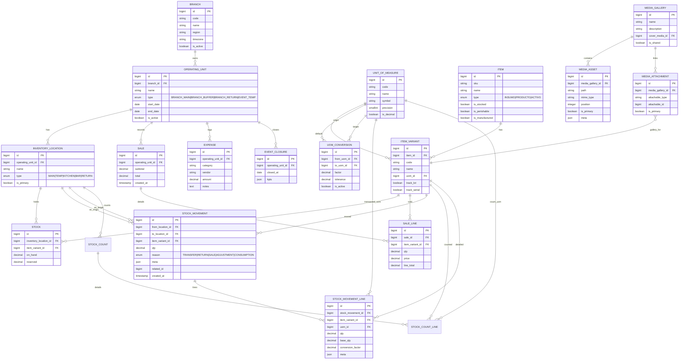
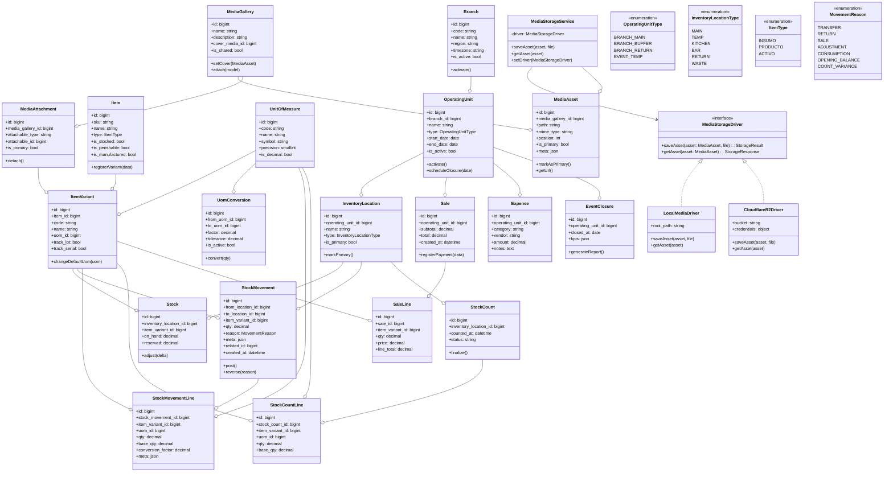
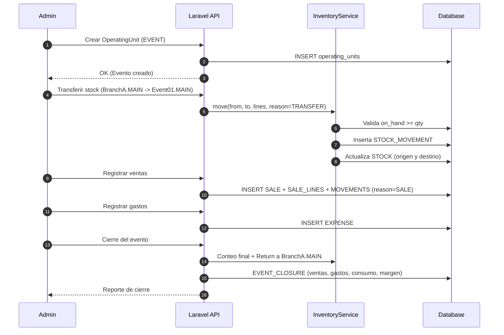
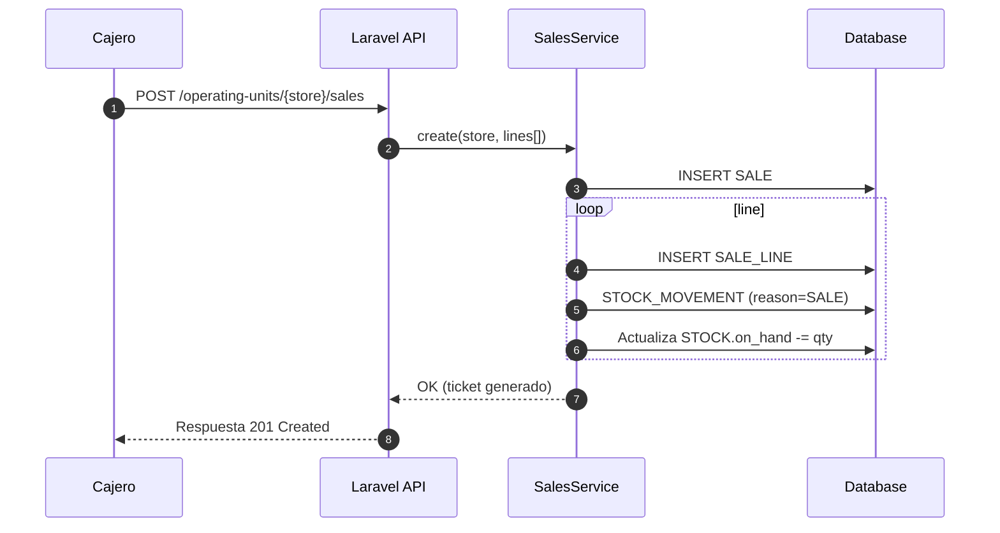
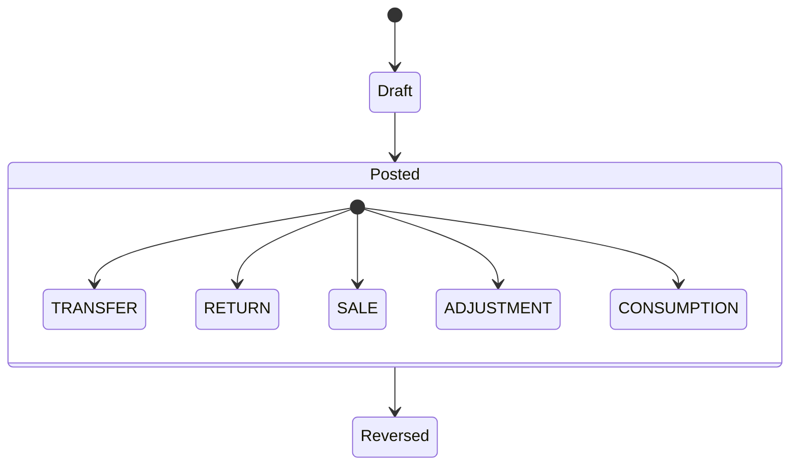

# 🍣 SushiGo Tenant — Inventory Architecture & Design

**Scope**
Plano integral del sistema de inventarios del tenant **SushiGo** dentro de ComandaFlow. Incluye contexto, principios, modelo de dominio, diagramas ER, flujos operativos y lineamientos técnicos para la implementación en Laravel + React.

---

## 1. Contexto y requerimientos

SushiGo opera hoy como un restaurante único con eventos temporales, pero se prepara para:

-   **Sucursales múltiples** que administran inventarios propios por ciudad o zona.
-   **Eventos (`EVENT`)** que requieren mover inventario temporalmente, registrar costos/ventas y ejecutar cierres con retorno de existencias.
-   **Control de rentabilidad** por unidad operativa (tienda o evento) y periodos definidos.
-   **Escalabilidad** hacia compras, producción, lotes y analítica avanzada.

El sistema debe garantizar:

-   Inventario multi-ubicación por unidad operativa.
-   Transferencias y ajustes auditables.
-   Registro de ventas, gastos y cierres operativos.
-   Trazabilidad completa de movimientos (quién, cuándo, por qué).
-   Preparación para módulos de costos y forecasting.
-   Gestión de galerías de imágenes reutilizables con portada principal, asociables a productos u otros objetos de dominio.

---

## 2. Principios de diseño

| Principio                      | Descripción                                                                            |
| ------------------------------ | -------------------------------------------------------------------------------------- |
| **Single Tenant Scope**        | Toda la data pertenece al tenant SushiGo; no se requiere aislamiento multi-cliente.    |
| **Operating Unit Abstraction** | Cada operación ocurre dentro de una unidad (inventario de sucursal o evento temporal). |
| **Inventory by Location**      | Stock segregado por `InventoryLocation` (MAIN, KITCHEN, BAR, etc.).                    |
| **Traceabilidad total**        | Cada movimiento genera `StockMovement` y líneas detalladas.                            |
| **Expandable Architecture**    | Preparado para compras, lotes, producción y analítica.                                 |
| **Secure IDs**                 | IDs internos incrementales, externos expuestos como Hashids.                           |
| **Service-Oriented Layering**  | Controladores delgados → Servicios de dominio → Modelos.                               |
| **Laravel Native**             | Uso de patrones propios de Laravel 12 + Spatie Permission.                             |

---

## 3. Modelo de dominio

### 3.1 Entidades principales

-   **Branch**: sucursal física/administrativa del tenant; agrupa inventarios permanentes y temporales.
-   **OperatingUnit (Inventory)**: contexto operativo dentro de una sucursal (inventario principal, almacenes auxiliares o eventos temporales).
-   **InventoryLocation**: zonas físicas o lógicas dentro de cada unidad.
-   **Item / ItemVariant**: catálogo maestro (bienes `ACTIVO`, productos terminados, insumos).
-   **UnitOfMeasure / UomConversion**: unidad base por variante y conversiones permitidas.
-   **Stock / StockMovement / StockMovementLine**: existencias, movimientos y detalle transaccional.
-   **Sale / SaleLine**: tickets de venta por unidad operativa.
-   **Expense**: gastos operativos por unidad.
-   **EventClosure**: resultados y KPIs al cierre de un evento.
-   **StockCount / StockCountLine**: conteos físicos que alimentan ajustes.
-   **MediaGallery / MediaAsset / MediaAttachment**: gestión de imágenes (portada + galería) reutilizable entre productos, variantes u otros modelos.
-   **Users & Roles**: asignación de personal a unidades y permisos por dominio.

### 3.2 Diagrama ER principal

### 3.3 Unidades de medida y transacciones

-   Cada variante posee una **unidad base** (`ITEM_VARIANT.uom_id`).
-   Las conversiones (`UOM_CONVERSION`) definen factores dirigidos `from_uom → to_uom` con tolerancias.
-   Solo los `INSUMO` habilitan conversiones múltiples; `PRODUCTO` y `ACTIVO` operan 1:1 (misma unidad de entrada y salida).
-   `StockMovementLine` registra tanto la cantidad operada (`qty`, `uom_id`) como la cantidad normalizada (`base_qty`) y el factor aplicado.
-   `meta.original_qty` y `meta.original_uom` en `StockMovement` preservan la transacción original para auditoría y costing.
-   Los conteos físicos (`StockCountLine`) aceptan cualquier unidad y se convierten con las mismas reglas.

### 3.4 Seguridad y roles

El detalle del sistema de usuarios, roles y permisos se documenta en
[Security & User System Architecture](./security-and-user-system-architecture.md).
Allí se describe el flujo de asignación, los roles base (`super-admin`, `admin`, `user`) y la estrategia para combinar permisos directos con roles contextuales.

---

### 3.5 Modelo de sucursales e inventarios

-   **Branch** actúa como contenedor maestro. Cada sucursal tiene al menos un inventario permanente (`OperatingUnit` de tipo `BRANCH_MAIN`) y puede sumar inventarios auxiliares (`BRANCH_BUFFER`, `BRANCH_RETURN`, etc.).
-   Los **events** se representan como `OperatingUnit` temporales (`EVENT_TEMP`) asociados a una sucursal origen; poseen `start_date` y `end_date` para delimitar el corte y el retorno de stock.
-   Las **transferencias** se realizan entre `OperatingUnit`, permitiendo movimientos intra-sucursal (principal ↔ cocina) e inter-sucursal (Sucursal A → Sucursal B). El servicio de transferencias valida capacidad y registra trazabilidad cruzada.
-   Cuando el sistema aún no expone la gestión de sucursales, se puede inicializar una sucursal por defecto y trabajar con su inventario principal. El diseño soporta activar sucursales adicionales sin refactorizar dominios.
-   Los reportes de stock y rentabilidad se calculan por `OperatingUnit` y agregan métricas por sucursal para análisis financiero y operativo.

**Esquema propuesto**

| Tabla                 | Campos clave                                                       | Notas                                                                             |
| --------------------- | ------------------------------------------------------------------ | --------------------------------------------------------------------------------- |
| `branches`            | `id`, `code`, `name`, `region`, `timezone`, `is_active`            | Catálogo de sucursales; inicialmente se crea una por defecto.                     |
| `operating_units`     | `branch_id`, `type`, `name`, `start_date`, `end_date`, `is_active` | Inventarios permanentes (`BRANCH_*`) o temporales (`EVENT_TEMP`).                 |
| `inventory_locations` | `operating_unit_id`, `name`, `type`, `is_primary`                  | Localidades dentro de cada inventario (Main, Kitchen, Bar, Waste, etc.).          |
| `stock_movements`     | `from_location_id`, `to_location_id`, `reason`, `related_id`       | Permite traspasos inter-sucursal gracias al branch asociado a cada localidad.     |
| `event_closures`      | `operating_unit_id`, `closed_at`, `kpis`                           | Aplica solo a inventarios temporales; ejecuta cierre y retorno a sucursal origen. |

---

### 3.6 Media y galerías reutilizables

-   **MediaGallery** es el contenedor lógico de imágenes; soporta bandera `is_shared` para reutilizar la misma galería entre modelos.
-   **MediaAsset** representa cada archivo (ruta en storage, MIME, orden y si es la imagen principal). El campo `position` define el orden y `is_primary` garantiza una portada por galería.
-   **MediaAttachment** permite asociar galerías a cualquier modelo (`attachable_type` + `attachable_id`). El caso más común es `ItemVariant`, pero se deja abierto a futuras entidades como recetas, campañas o activos.
-   Cuando se elimina un `ItemVariant`, se evalúa si la galería es compartida; si no tiene más attachments se marca para limpieza.
-   Las transformaciones (thumbnails, webp, etc.) se almacenan en `meta` dentro del asset para coordinar con el pipeline de archivos.
-   Los servicios `MediaStorageService::saveAsset()` y `MediaStorageService::getAsset()` abstraen la interacción con el storage. En desarrollo utilizarán el disco local (`storage/app/media`); en producción se configurará un driver para Cloudflare R2. La arquitectura debe permitir añadir adaptadores adicionales (S3, Azure Blob, etc.) sin refactorizar el dominio ni los consumidores.

---

### 3.7 Diagrama de clases (vista lógica)

### 3.8 Resumen de clases

-   **Branch**
    -   Propiedades: `id`, `code`, `name`, `region`, `timezone`, `is_active`.
    -   Acciones: `activate()` o `deactivate()` según disponibilidad operativa; define configuraciones por defecto (inventario principal, moneda).
-   **OperatingUnit**
    -   Propiedades: `id`, `branch_id`, `name`, `type`, `start_date`, `end_date`, `is_active`.
    -   Acciones conceptuales: `activate()` para habilitar operaciones, `scheduleClosure(date)` para marcar fecha de cierre (derivará en servicios como `EventsService`); `changeType()` restringido para transicionar entre `BRANCH_*` y `EVENT_TEMP`.
    -   Tipos disponibles: `BRANCH_MAIN` (inventario principal de sucursal), `BRANCH_BUFFER`/`BRANCH_RETURN` (almacenes auxiliares) y `EVENT_TEMP` (inventario temporal de eventos).
-   **InventoryLocation**
    -   Propiedades: `id`, `operating_unit_id`, `name`, `type`, `is_primary`.
    -   Acciones: `markPrimary()` (se usa en ajustes iniciales de la unidad).
-   **Item**
    -   Propiedades: `id`, `sku`, `name`, `type`, `is_stocked`, `is_perishable`, `is_manufactured`.
    -   **`is_manufactured`**: Indica si el item se fabrica/prepara internamente (`true`) o se compra para reventa (`false`). Esto permite diferenciar entre:
        -   **Productos manufacturados** (`is_manufactured=true`): Platillos del menú que se preparan en cocina usando insumos según recetas.
        -   **Productos de reventa** (`is_manufactured=false`): Items que se compran ya terminados (ej: dulcería coreana, bebidas embotelladas) y se revenden directamente sin transformación.
    -   Acciones: `registerVariant(data)` encapsula la creación de variantes a través de factories/acciones.
-   **ItemVariant**
    -   Propiedades: `id`, `item_id`, `code`, `name`, `uom_id`, `track_lot`, `track_serial`.
    -   Acciones: `changeDefaultUom(uom)` (valida reglas 1:1 en productos/activos), ganchos para lotes/serializados.
-   **UnitOfMeasure**
    -   Propiedades: `id`, `code`, `name`, `symbol`, `precision`, `is_decimal`.
    -   Usada como catálogo; no expone métodos adicionales.
-   **UomConversion**
    -   Propiedades: `id`, `from_uom_id`, `to_uom_id`, `factor`, `tolerance`, `is_active`.
    -   **Aplicación**: Disponible para cualquier item con `is_stocked=true`, no solo INSUMOS.
    -   **Casos de uso**:
        -   **INSUMO**: 1 kg = 1000 g (conversión entre escalas de medida)
        -   **PRODUCTO manufacturado**: 1 bandeja = 8 piezas (presentaciones de venta)
        -   **PRODUCTO reventa**: 1 caja = 24 unidades (compra mayoreo vs venta individual)
    -   Acción: `convert(qty)` aplica factor y tolerancia (en la práctica se resuelve vía `TransfersService`/`CostingService`).
-   **Stock**
    -   Propiedades: `id`, `inventory_location_id`, `item_variant_id`, `on_hand`, `reserved`.
    -   Acciones: `adjust(delta)` para restar/sumar existencias (llamado desde servicios de movimientos).
-   **StockMovement**
    -   Propiedades: `id`, `from_location_id`, `to_location_id`, `item_variant_id`, `qty`, `reason`, `meta`, `related_id`, `created_at`.
    -   Acciones: `post()` confirma y aplica el movimiento; `reverse(reason)` genera reversos controlados.
-   **StockMovementLine**
    -   Propiedades: `id`, `stock_movement_id`, `item_variant_id`, `uom_id`, `qty`, `base_qty`, `conversion_factor`, `meta`.
    -   Actúa como detalle del movimiento para soportar múltiples líneas y conversiones.
-   **StockCount / StockCountLine**
    -   Propiedades principales: `inventory_location_id`, `counted_at`, `status` y líneas con `qty`, `uom_id`, `base_qty`.
    -   Acciones: `finalize()` procesa diferencias contra `Stock`.
-   **Sale / SaleLine**
    -   Propiedades: `operating_unit_id`, `subtotal`, `total`, `created_at` y líneas con `qty`, `price`, `line_total`.
    -   Acciones: `registerPayment(data)` (orquestrado por `SalesService`), generación de movimientos `SALE`.
-   **Expense**
    -   Propiedades: `operating_unit_id`, `category`, `vendor`, `amount`, `notes`.
    -   Registro simple, asociado a reportes y cierres.
-   **EventClosure**
    -   Propiedades: `operating_unit_id`, `closed_at`, `kpis`.
    -   Acciones: `generateReport()` invoca servicios para KPIs, balances y retornos de stock.
-   **MediaGallery / MediaAsset / MediaAttachment**
    -   Propiedades principales: galería (`name`, `description`, `cover_media_id`, `is_shared`), assets (`path`, `mime_type`, `position`, `is_primary`, `meta`) y attachments (`attachable_type`, `attachable_id`, `is_primary`).
    -   Acciones: `setCover()` y `markAsPrimary()` aseguran portada única; `attach(model)`/`detach()` gestionan vínculos polimórficos con productos, variantes u otras entidades.
-   **MediaStorageService & Drivers**
    -   Interfaz `MediaStorageDriver` con operaciones `saveAsset()` y `getAsset()`; implementaciones locales (disco) y Cloudflare R2 previstas, extensibles a otros providers.
    -   `MediaStorageService` mantiene el driver activo (configurable por env), orquesta la persistencia de archivos y entrega URLs accesibles (incluyendo firmas temporales en nubes públicas).

> Nota: las “acciones” descritas se modelarán como métodos en servicios/aplicaciones (ej. `TransfersService` o acciones de dominio). El diagrama ayuda a visualizar responsabilidades antes de trasladarlas a capas de servicios y jobs.

---

## 4. Flujos operativos

### 4.1 Flujo de un evento

### 4.2 Flujo de venta normal

### 4.3 Máquina de estados de movimientos

**Reglas clave**

-   `SALE|CONSUMPTION`: solo `from_location_id` (resta stock).
-   `TRANSFER|RETURN`: ambos (`from`, `to`) — resta en origen, suma en destino.
-   `ADJUSTMENT`: una sola dirección (entrada o salida).
-   Validar `on_hand >= qty` al restar stock.
-   Persistir `meta.cost` para auditoría de costo promedio.

---

## 5. Identificadores ofuscados

-   Ningún ID incremental se expone en APIs; utilizamos Hashids para evitar enumeración y fugas de información.
-   La guía completa de configuración, riesgos y helpers está en [Identificadores Hashids](./identifiers-hashids.md).

---

## 6. Arquitectura Laravel

| Capa                         | Responsabilidad                                                         |
| ---------------------------- | ----------------------------------------------------------------------- |
| **Controllers**              | Reciben requests, validan y delegan a servicios.                        |
| **FormRequests**             | Validan payloads, decodifican Hashids y sanitizan datos.                |
| **Services**                 | Orquestan reglas de negocio (transferencias, ventas, cierres, costing). |
| **Policies**                 | Autorización por unidad operativa y rol.                                |
| **Resources / Transformers** | Serializan respuestas exponiendo `hashid` y datos calculados.           |

Servicios principales:

-   `TransfersService`
-   `SalesService`
-   `AdjustmentsService`
-   `EventsService`
-   `CostingService`

---

## 7. Referencias

-   [Tenancy for Laravel](https://tenancyforlaravel.com/docs)
-   [vinkla/hashids](https://github.com/vinkla/hashids)
-   [Martin Fowler — DDD Aggregates](https://martinfowler.com/bliki/DDD_Aggregate.html)
-   [Eric Evans — Domain Driven Design](https://domainlanguage.com/ddd/)
-   [Inventory Management Overview (MS Docs)](https://learn.microsoft.com/en-us/dynamics365/supply-chain/inventory/inventory-overview)

---

**Autoría**
Equipo SushiGo / ComandaFlow · 2025-11-04
