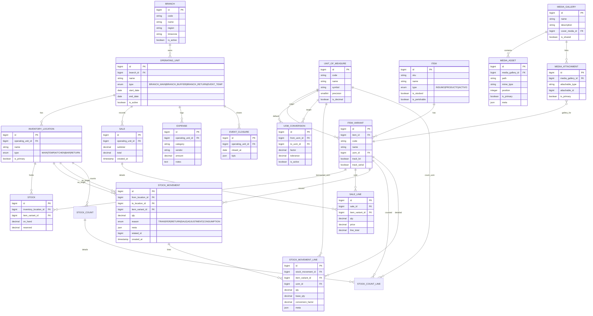
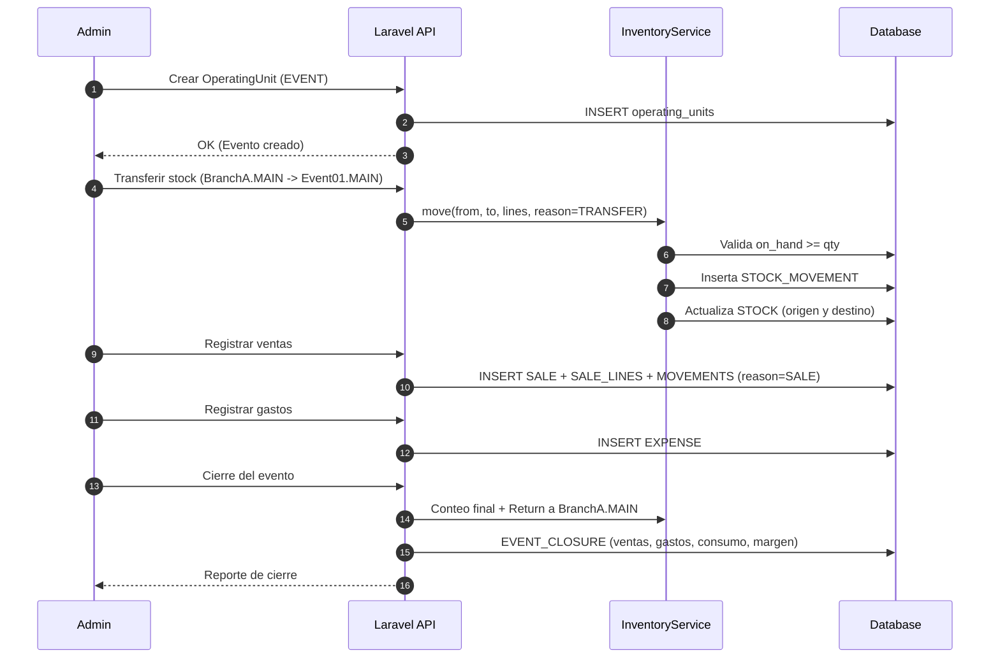
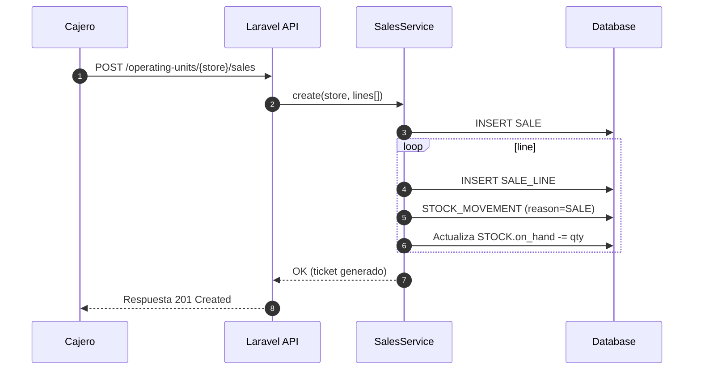
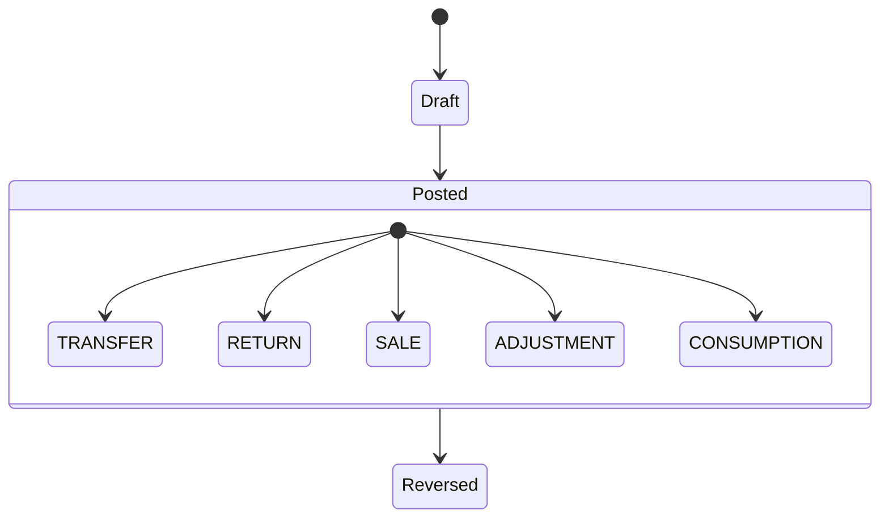

# 🍣 SushiGo Tenant — Inventory Architecture & Design

**Scope**
Plano integral del sistema de inventarios del tenant **SushiGo** dentro de ComandaFlow. Incluye contexto, principios, modelo de dominio, diagramas ER, flujos operativos y lineamientos técnicos para la implementación en Laravel + React.

---

## 1. Contexto y requerimientos

SushiGo opera hoy como un restaurante único con eventos temporales, pero se prepara para:

-   **Sucursales múltiples** que administran inventarios propios por ciudad o zona.
-   **Eventos (`EVENT`)** que requieren mover inventario temporalmente, registrar costos/ventas y ejecutar cierres con retorno de existencias.
-   **Control de rentabilidad** por unidad operativa (tienda o evento) y periodos definidos.
-   **Escalabilidad** hacia compras, producción, lotes y analítica avanzada.

El sistema debe garantizar:

-   Inventario multi-ubicación por unidad operativa.
-   Transferencias y ajustes auditables.
-   Registro de ventas, gastos y cierres operativos.
-   Trazabilidad completa de movimientos (quién, cuándo, por qué).
-   Preparación para módulos de costos y forecasting.
-   Gestión de galerías de imágenes reutilizables con portada principal, asociables a productos u otros objetos de dominio.

---

## 2. Principios de diseño

| Principio                      | Descripción                                                                            |
| ------------------------------ | -------------------------------------------------------------------------------------- |
| **Single Tenant Scope**        | Toda la data pertenece al tenant SushiGo; no se requiere aislamiento multi-cliente.    |
| **Operating Unit Abstraction** | Cada operación ocurre dentro de una unidad (inventario de sucursal o evento temporal). |
| **Inventory by Location**      | Stock segregado por `InventoryLocation` (MAIN, KITCHEN, BAR, etc.).                    |
| **Traceabilidad total**        | Cada movimiento genera `StockMovement` y líneas detalladas.                            |
| **Expandable Architecture**    | Preparado para compras, lotes, producción y analítica.                                 |
| **Secure IDs**                 | IDs internos incrementales, externos expuestos como `public_id` (ULID).                |
| **Service-Oriented Layering**  | Controladores delgados → Servicios de dominio → Modelos.                               |
| **Laravel Native**             | Uso de patrones propios de Laravel 12 + Spatie Permission.                             |

---

## 3. Modelo de dominio

> **Nota (2026-08-12):** las formas de `Item`/`ItemVariant` de abajo (diagrama ER §3.2, diagrama de
> clases §3.7) todavía muestran el esquema plano actual, incluyendo campos equivalentes a
> `sale_price` que la vertical de Producto está retirando de su ruta de
> escritura de catálogo. `min_stock`/`max_stock` ya se eliminaron de `ItemVariant` — los umbrales
> de reabastecimiento ahora son por Ubicación de Inventario, ver §3.10 (#439). Ver
> [Product Catalog — Target Architecture](product-catalog/product-catalog-architecture.es.md) y
> [TD-03](../decisions/td-03-product-catalog-separation.md) para el modelo objetivo de
> Producto/Variante/Presentación de Compra y la secuencia de migración; este documento se
> actualizará para coincidir una vez que esa migración concluya (`#442`).
>
> **Nota adicional:** esta versión en español anteriormente incluía `Item.is_manufactured` en el
> diagrama ER, el diagrama de clases y el resumen de clases, con una descripción de negocio que no
> tiene respaldo real: la migración que debía agregar esa columna
> (`2025_11_12_092126_add_is_manufactured_to_items_table.php`) quedó vacía (no-op). Se removió de
> esta versión para que coincida con la versión en inglés (que nunca lo tuvo); el campo muerto en
> `product-wizard.tsx` que lo leía/escribía sigue señalado para limpieza en
> [Product Catalog — Target Architecture](product-catalog/product-catalog-architecture.es.md) §9.4
> (`#429`). Por la misma razón, también se removió del resumen de clases (§3.8) el bloque
> "Aplicación"/"Casos de uso" de `UomConversion` que daba ejemplos de `PRODUCTO` (bandeja/caja) —
> contradecía la propia regla de la §3.3 ("Only INSUMO enables multiple conversions; PRODUCTO and
> ACTIVO operate 1:1") y es exactamente el antipatrón que
> [Product Catalog — Target Architecture](product-catalog/product-catalog-architecture.es.md) §4 y
> §9.3 reemplazan con `VariantPurchasePresentation`; la versión en inglés nunca tuvo ese bloque.

### 3.1 Entidades principales

-   **Branch**: sucursal física/administrativa del tenant; agrupa inventarios permanentes y temporales.
-   **OperatingUnit (Inventory)**: contexto operativo dentro de una sucursal (inventario principal, almacenes auxiliares o eventos temporales).
-   **InventoryLocation**: zonas físicas o lógicas dentro de cada unidad.
-   **Item / ItemVariant**: catálogo maestro (bienes `ACTIVO`, productos terminados, insumos).
-   **UnitOfMeasure / UomConversion**: unidad base por variante y conversiones permitidas.
-   **Stock / StockMovement / StockMovementLine**: existencias, movimientos y detalle transaccional.
-   **Sale / SaleLine**: tickets de venta por unidad operativa.
-   **Expense**: gastos operativos por unidad.
-   **EventClosure**: resultados y KPIs al cierre de un evento.
-   **StockCount / StockCountLine**: conteos físicos que alimentan ajustes.
-   **MediaGallery / MediaAsset / MediaAttachment**: gestión de imágenes (portada + galería) reutilizable entre productos, variantes u otros modelos.
-   **Users & Roles**: asignación de personal a unidades y permisos por dominio.

### 3.2 Diagrama ER principal

```mermaid
erDiagram
  BRANCH ||--o{ OPERATING_UNIT : owns
  OPERATING_UNIT ||--o{ INVENTORY_LOCATION : has
  OPERATING_UNIT ||--o{ SALE : records
  OPERATING_UNIT ||--o{ EXPENSE : logs
  OPERATING_UNIT ||--o{ EVENT_CLOSURE : closes

  INVENTORY_LOCATION ||--o{ STOCK : holds
  INVENTORY_LOCATION ||--o{ STOCK_MOVEMENT : as_origin
  INVENTORY_LOCATION ||--o{ STOCK_MOVEMENT : as_target
  INVENTORY_LOCATION ||--o{ STOCK_COUNT : counts

  UNIT_OF_MEASURE ||--o{ ITEM_VARIANT : default
  UNIT_OF_MEASURE ||--o{ UOM_CONVERSION : origin
  UNIT_OF_MEASURE ||--o{ UOM_CONVERSION : target

  ITEM ||--o{ ITEM_VARIANT : has
  ITEM_VARIANT ||--o{ STOCK : stored
  ITEM_VARIANT ||--o{ SALE_LINE : sold
  ITEM_VARIANT ||--o{ STOCK_MOVEMENT : moved
  ITEM_VARIANT ||--o{ STOCK_COUNT_LINE : counted
  ITEM_VARIANT ||--o{ STOCK_MOVEMENT_LINE : detailed

  STOCK_MOVEMENT ||--o{ STOCK_MOVEMENT_LINE : lines
  UNIT_OF_MEASURE ||--o{ STOCK_MOVEMENT_LINE : transacted_uom
  UNIT_OF_MEASURE ||--o{ STOCK_COUNT_LINE : count_uom

  SALE ||--o{ SALE_LINE : details
  STOCK_COUNT ||--o{ STOCK_COUNT_LINE : details
  MEDIA_GALLERY ||--o{ MEDIA_ASSET : contains
  MEDIA_GALLERY ||--o{ MEDIA_ATTACHMENT : links
  MEDIA_ATTACHMENT }o--|| ITEM_VARIANT : gallery_for

  BRANCH {
    bigint id PK
    string code
    string name
    string region
    string timezone
    boolean is_active
  }

  OPERATING_UNIT {
    bigint id PK
    bigint branch_id FK
    string name
    enum type "BRANCH_MAIN|BRANCH_BUFFER|BRANCH_RETURN|EVENT_TEMP"
    date start_date
    date end_date
    boolean is_active
  }

  INVENTORY_LOCATION {
    bigint id PK
    bigint operating_unit_id FK
    string name
    enum type "MAIN|TEMP|KITCHEN|BAR|RETURN"
    boolean is_primary
  }

  ITEM {
    bigint id PK
    string sku
    string name
    enum type "INSUMO|PRODUCTO|ACTIVO"
    boolean is_stocked
    boolean is_perishable
  }

  ITEM_VARIANT {
    bigint id PK
    bigint item_id FK
    string code
    string name
    bigint uom_id FK
    boolean track_lot
    boolean track_serial
  }

  UNIT_OF_MEASURE {
    bigint id PK
    string code
    string name
    string symbol
    smallint precision
    boolean is_decimal
  }

  UOM_CONVERSION {
    bigint id PK
    bigint from_uom_id FK
    bigint to_uom_id FK
    decimal factor
    decimal tolerance
    boolean is_active
  }

  STOCK {
    bigint id PK
    bigint inventory_location_id FK
    bigint item_variant_id FK
    decimal on_hand
    decimal reserved
  }

  STOCK_MOVEMENT {
    bigint id PK
    bigint from_location_id FK
    bigint to_location_id FK
    bigint item_variant_id FK
    decimal qty
    enum reason "TRANSFER|RETURN|SALE|ADJUSTMENT|CONSUMPTION"
    json meta
    bigint related_id
    timestamp created_at
  }

  STOCK_MOVEMENT_LINE {
    bigint id PK
    bigint stock_movement_id FK
    bigint item_variant_id FK
    bigint uom_id FK
    decimal qty
    decimal base_qty
    decimal conversion_factor
    json meta
  }

  SALE {
    bigint id PK
    bigint operating_unit_id FK
    decimal subtotal
    decimal total
    timestamp created_at
  }

  SALE_LINE {
    bigint id PK
    bigint sale_id FK
    bigint item_variant_id FK
    decimal qty
    decimal price
    decimal line_total
  }

  EXPENSE {
    bigint id PK
    bigint operating_unit_id FK
    string category
    string vendor
    decimal amount
    text notes
  }

  EVENT_CLOSURE {
    bigint id PK
    bigint operating_unit_id FK
    date closed_at
    json kpis
  }

  MEDIA_GALLERY {
    bigint id PK
    string name
    string description
    bigint cover_media_id FK
    boolean is_shared
  }

  MEDIA_ASSET {
    bigint id PK
    bigint media_gallery_id FK
    string path
    string mime_type
    integer position
    boolean is_primary
    json meta
  }

  MEDIA_ATTACHMENT {
    bigint id PK
    bigint media_gallery_id FK
    string attachable_type
    bigint attachable_id
    boolean is_primary
  }
```

### 3.3 Unidades de medida y transacciones

-   Cada variante posee una **unidad base** (`ITEM_VARIANT.uom_id`).
-   Las conversiones (`UOM_CONVERSION`) definen factores dirigidos `from_uom → to_uom` con tolerancias.
-   Solo los `INSUMO` habilitan conversiones múltiples; `PRODUCTO` y `ACTIVO` operan 1:1 (misma unidad de entrada y salida).
-   `StockMovementLine` registra tanto la cantidad operada (`qty`, `uom_id`) como la cantidad normalizada (`base_qty`) y el factor aplicado.
-   `meta.original_qty` y `meta.original_uom` en `StockMovement` preservan la transacción original para auditoría y costing.
-   Los conteos físicos (`StockCountLine`) aceptan cualquier unidad y se convierten con las mismas reglas.

### 3.4 Seguridad y roles

El detalle del sistema de usuarios, roles y permisos se documenta en
[Security & User System Architecture](./security-and-user-system-architecture.md).
Allí se describe el flujo de asignación, los roles base (`super-admin`, `admin`, `user`) y la estrategia para combinar permisos directos con roles contextuales.

---

### 3.5 Modelo de sucursales e inventarios

-   **Branch** actúa como contenedor maestro. Cada sucursal tiene al menos un inventario permanente (`OperatingUnit` de tipo `BRANCH_MAIN`) y puede sumar inventarios auxiliares (`BRANCH_BUFFER`, `BRANCH_RETURN`, etc.).
-   Los **events** se representan como `OperatingUnit` temporales (`EVENT_TEMP`) asociados a una sucursal origen; poseen `start_date` y `end_date` para delimitar el corte y el retorno de stock.
-   Las **transferencias** se realizan entre `OperatingUnit`, permitiendo movimientos intra-sucursal (principal ↔ cocina) e inter-sucursal (Sucursal A → Sucursal B). El servicio de transferencias valida capacidad y registra trazabilidad cruzada.
-   Cuando el sistema aún no expone la gestión de sucursales, se puede inicializar una sucursal por defecto y trabajar con su inventario principal. El diseño soporta activar sucursales adicionales sin refactorizar dominios.
-   Los reportes de stock y rentabilidad se calculan por `OperatingUnit` y agregan métricas por sucursal para análisis financiero y operativo.

**Esquema propuesto**

| Tabla                 | Campos clave                                                       | Notas                                                                             |
| --------------------- | ------------------------------------------------------------------ | --------------------------------------------------------------------------------- |
| `branches`            | `id`, `code`, `name`, `region`, `timezone`, `is_active`            | Catálogo de sucursales; inicialmente se crea una por defecto.                     |
| `operating_units`     | `branch_id`, `type`, `name`, `start_date`, `end_date`, `is_active` | Inventarios permanentes (`BRANCH_*`) o temporales (`EVENT_TEMP`).                 |
| `inventory_locations` | `operating_unit_id`, `name`, `type`, `is_primary`                  | Localidades dentro de cada inventario (Main, Kitchen, Bar, Waste, etc.).          |
| `stock_movements`     | `from_location_id`, `to_location_id`, `reason`, `related_id`       | Permite traspasos inter-sucursal gracias al branch asociado a cada localidad.     |
| `event_closures`      | `operating_unit_id`, `closed_at`, `kpis`                           | Aplica solo a inventarios temporales; ejecuta cierre y retorno a sucursal origen. |

---

### 3.6 Media y galerías reutilizables

> La arquitectura completa a nivel de sistema (autorización de ownership, seguridad ante concurrencia, abstracción de storage) vive en un documento dedicado: [Arquitectura del Sistema de Multimedia](media/media-architecture.es.md). Esta sección solo cubre cómo participa `Item` en él desde el lado del dominio de inventario.

-   **MediaGallery** es el contenedor lógico de imágenes; soporta bandera `is_shared` para reutilizar la misma galería entre modelos.
-   **MediaAsset** representa cada archivo (ruta en storage, MIME, orden y si es la imagen principal). El campo `position` define el orden y `is_primary` garantiza una portada por galería.
-   **MediaAttachment** permite asociar galerías a cualquier modelo (`attachable_type` + `attachable_id`). `Item` es el primer adoptante ([#377](https://github.com/pakodiazdev/sushigo/issues/377)); se deja abierto a futuras entidades como `Employee`, `User` o el próximo catálogo de Dish — ver `doc/conventions/backend/media-uploads.md` para el patrón upload-first/attach-on-save que sigue cada nuevo adoptante.
-   Las galerías huérfanas (subidas pero nunca adjuntadas — p. ej. un formulario de "Nuevo Dish" abandonado) no se limpian reactivamente al eliminar; `php artisan media:cleanup-orphans` las barre una vez que superan un periodo de gracia configurable. Ver [TD-02](../decisions/td-02-media-cleanup-strategy.md) para por qué esto corre al iniciar el contenedor en vez de con un schedule recurrente.
-   Las transformaciones (thumbnails, webp, etc.) se almacenan en `meta` dentro del asset para coordinar con el pipeline de archivos.
-   `App\Services\Media\UploadMediaService`, `UpdateMediaAssetService`, `DeleteMediaAssetService` y `App\Services\Media\MediaAttachmentService` — cada uno una clase invocable (`__invoke()`) de responsabilidad única — encapsulan la interacción con el storage. Todos pasan por `Storage::disk(config('filesystems.default'))` — nunca un disco hardcodeado — de modo que la propia abstracción Flysystem de Laravel (ya configurada con `local`/`public`/`s3` en `config/filesystems.php`) satisface "cambiar de proveedor cloud sin tocar código de negocio" sin necesidad de una interfaz de driver propia.

---

### 3.7 Diagrama de clases (vista lógica)

```mermaid
classDiagram
  class Branch {
    +id: bigint
    +code: string
    +name: string
    +region: string
    +timezone: string
    +is_active: bool
    +activate()
  }

  class OperatingUnit {
    +id: bigint
    +branch_id: bigint
    +name: string
    +type: OperatingUnitType
    +start_date: date
    +end_date: date
    +is_active: bool
    +activate()
    +scheduleClosure(date)
  }

  class InventoryLocation {
    +id: bigint
    +operating_unit_id: bigint
    +name: string
    +type: InventoryLocationType
    +is_primary: bool
    +markPrimary()
  }

  class Item {
    +id: bigint
    +sku: string
    +name: string
    +type: ItemType
    +is_stocked: bool
    +is_perishable: bool
    +registerVariant(data)
  }

  class ItemVariant {
    +id: bigint
    +item_id: bigint
    +code: string
    +name: string
    +uom_id: bigint
    +track_lot: bool
    +track_serial: bool
    +changeDefaultUom(uom)
  }

  class UnitOfMeasure {
    +id: bigint
    +code: string
    +name: string
    +symbol: string
    +precision: smallint
    +is_decimal: bool
  }

  class UomConversion {
    +id: bigint
    +from_uom_id: bigint
    +to_uom_id: bigint
    +factor: decimal
    +tolerance: decimal
    +is_active: bool
    +convert(qty)
  }

  class Stock {
    +id: bigint
    +inventory_location_id: bigint
    +item_variant_id: bigint
    +on_hand: decimal
    +reserved: decimal
    +adjust(delta)
  }

  class StockMovement {
    +id: bigint
    +from_location_id: bigint
    +to_location_id: bigint
    +item_variant_id: bigint
    +qty: decimal
    +reason: MovementReason
    +meta: json
    +related_id: bigint
    +created_at: datetime
    +post()
    +reverse(reason)
  }

  class StockMovementLine {
    +id: bigint
    +stock_movement_id: bigint
    +item_variant_id: bigint
    +uom_id: bigint
    +qty: decimal
    +base_qty: decimal
    +conversion_factor: decimal
    +meta: json
  }

  class StockCount {
    +id: bigint
    +inventory_location_id: bigint
    +counted_at: datetime
    +status: string
    +finalize()
  }

  class StockCountLine {
    +id: bigint
    +stock_count_id: bigint
    +item_variant_id: bigint
    +uom_id: bigint
    +qty: decimal
    +base_qty: decimal
  }

  class Sale {
    +id: bigint
    +operating_unit_id: bigint
    +subtotal: decimal
    +total: decimal
    +created_at: datetime
    +registerPayment(data)
  }

  class SaleLine {
    +id: bigint
    +sale_id: bigint
    +item_variant_id: bigint
    +qty: decimal
    +price: decimal
    +line_total: decimal
  }

  class Expense {
    +id: bigint
    +operating_unit_id: bigint
    +category: string
    +vendor: string
    +amount: decimal
    +notes: text
  }

  class EventClosure {
    +id: bigint
    +operating_unit_id: bigint
    +closed_at: date
    +kpis: json
    +generateReport()
  }

  class MediaGallery {
    +id: bigint
    +name: string
    +description: string
    +cover_media_id: bigint
    +is_shared: bool
    +mediaAssets()
    +coverMedia()
    +primaryMedia()
  }

  class MediaAsset {
    +id: bigint
    +media_gallery_id: bigint
    +path: string
    +mime_type: string
    +position: int
    +is_primary: bool
    +meta: json
    +isImage()
    +isVideo()
    +getUrlAttribute()
  }

  class MediaAttachment {
    +id: bigint
    +media_gallery_id: bigint
    +attachable_type: string
    +attachable_id: bigint
    +is_primary: bool
    +attachable()
  }

  class UploadMediaService {
    +__invoke(file, mediaGalleryId): MediaAsset
  }

  class UpdateMediaAssetService {
    +__invoke(asset, data): MediaAsset
  }

  class DeleteMediaAssetService {
    +__invoke(asset): void
  }

  class MediaAttachmentService {
    +__invoke(attachable, mediaGalleryId, isPrimary): MediaAttachment
  }

  class CleanupOrphanedMedia {
    <<command>>
    +handle(): int
  }

  class OperatingUnitType {
    <<enumeration>>
    BRANCH_MAIN
    BRANCH_BUFFER
    BRANCH_RETURN
    EVENT_TEMP
  }

  class InventoryLocationType {
    <<enumeration>>
    MAIN
    TEMP
    KITCHEN
    BAR
    RETURN
    WASTE
  }

  class ItemType {
    <<enumeration>>
    INSUMO
    PRODUCTO
    ACTIVO
  }

  class MovementReason {
    <<enumeration>>
    TRANSFER
    RETURN
    SALE
    ADJUSTMENT
    CONSUMPTION
    OPENING_BALANCE
    COUNT_VARIANCE
  }

  Branch --o OperatingUnit
  OperatingUnit --o InventoryLocation
  OperatingUnit --o Sale
  OperatingUnit --o Expense
  OperatingUnit --o EventClosure
  InventoryLocation --o Stock
  InventoryLocation --o StockMovement
  InventoryLocation --o StockCount
  Item --o ItemVariant
  ItemVariant --o Stock
  ItemVariant --o StockMovement
  ItemVariant --o StockMovementLine
  ItemVariant --o StockCountLine
  ItemVariant --o SaleLine
  UnitOfMeasure --o ItemVariant
  UnitOfMeasure --o UomConversion
  UnitOfMeasure --o StockMovementLine
  UnitOfMeasure --o StockCountLine
  StockMovement --o StockMovementLine
  StockCount --o StockCountLine
  Sale --o SaleLine
  MediaGallery --o MediaAsset
  MediaGallery --o MediaAttachment
  MediaAttachment --o Item
  UploadMediaService --o MediaAsset
  UpdateMediaAssetService --o MediaAsset
  DeleteMediaAssetService --o MediaAsset
  MediaAttachmentService --o MediaAttachment
  CleanupOrphanedMedia --> DeleteMediaAssetService
```

### 3.8 Resumen de clases

-   **Branch**
    -   Propiedades: `id`, `code`, `name`, `region`, `timezone`, `is_active`.
    -   Acciones: `activate()` o `deactivate()` según disponibilidad operativa; define configuraciones por defecto (inventario principal, moneda).
-   **OperatingUnit**
    -   Propiedades: `id`, `branch_id`, `name`, `type`, `start_date`, `end_date`, `is_active`.
    -   Acciones conceptuales: `activate()` para habilitar operaciones, `scheduleClosure(date)` para marcar fecha de cierre (derivará en servicios como `EventsService`); `changeType()` restringido para transicionar entre `BRANCH_*` y `EVENT_TEMP`.
    -   Tipos disponibles: `BRANCH_MAIN` (inventario principal de sucursal), `BRANCH_BUFFER`/`BRANCH_RETURN` (almacenes auxiliares) y `EVENT_TEMP` (inventario temporal de eventos).
-   **InventoryLocation**
    -   Propiedades: `id`, `operating_unit_id`, `name`, `type`, `is_primary`.
    -   Acciones: `markPrimary()` (se usa en ajustes iniciales de la unidad).
-   **Item**
    -   Propiedades: `id`, `sku`, `name`, `type`, `is_stocked`, `is_perishable`.
    -   Acciones: `registerVariant(data)` encapsula la creación de variantes a través de factories/acciones.
-   **ItemVariant**
    -   Propiedades: `id`, `item_id`, `code`, `name`, `uom_id`, `track_lot`, `track_serial`.
    -   Acciones: `changeDefaultUom(uom)` (valida reglas 1:1 en productos/activos), ganchos para lotes/serializados.
-   **UnitOfMeasure**
    -   Propiedades: `id`, `code`, `name`, `symbol`, `precision`, `is_decimal`.
    -   Usada como catálogo; no expone métodos adicionales.
-   **UomConversion**
    -   Propiedades: `id`, `from_uom_id`, `to_uom_id`, `factor`, `tolerance`, `is_active`.
    -   Acción: `convert(qty)` aplica factor y tolerancia (en la práctica se resuelve vía `TransfersService`/`CostingService`).
-   **Stock**
    -   Propiedades: `id`, `inventory_location_id`, `item_variant_id`, `on_hand`, `reserved`.
    -   Acciones: `adjust(delta)` para restar/sumar existencias (llamado desde servicios de movimientos).
-   **StockMovement**
    -   Propiedades: `id`, `from_location_id`, `to_location_id`, `item_variant_id`, `qty`, `reason`, `meta`, `related_id`, `created_at`.
    -   Acciones: `post()` confirma y aplica el movimiento; `reverse(reason)` genera reversos controlados.
-   **StockMovementLine**
    -   Propiedades: `id`, `stock_movement_id`, `item_variant_id`, `uom_id`, `qty`, `base_qty`, `conversion_factor`, `meta`.
    -   Actúa como detalle del movimiento para soportar múltiples líneas y conversiones.
-   **StockCount / StockCountLine**
    -   Propiedades principales: `inventory_location_id`, `counted_at`, `status` y líneas con `qty`, `uom_id`, `base_qty`.
    -   Acciones: `finalize()` procesa diferencias contra `Stock`.
-   **Sale / SaleLine**
    -   Propiedades: `operating_unit_id`, `subtotal`, `total`, `created_at` y líneas con `qty`, `price`, `line_total`.
    -   Acciones: `registerPayment(data)` (orquestrado por `SalesService`), generación de movimientos `SALE`.
-   **Expense**
    -   Propiedades: `operating_unit_id`, `category`, `vendor`, `amount`, `notes`.
    -   Registro simple, asociado a reportes y cierres.
-   **EventClosure**
    -   Propiedades: `operating_unit_id`, `closed_at`, `kpis`.
    -   Acciones: `generateReport()` invoca servicios para KPIs, balances y retornos de stock.
-   **MediaGallery / MediaAsset / MediaAttachment**
    -   Propiedades principales: galería (`name`, `description`, `cover_media_id`, `is_shared`), assets (`path`, `mime_type`, `position`, `is_primary`, `meta`) y attachments (`attachable_type`, `attachable_id`, `is_primary`).
    -   Se suben vía `POST /api/v1/media/upload` (upload-first, antes de que exista la entidad dueña), se reordenan/marcan como primary vía `PATCH /api/v1/media/assets/{id}`, se eliminan vía `DELETE /api/v1/media/assets/{id}` — ver `doc/conventions/backend/media-uploads.md`.
-   **UploadMediaService, UpdateMediaAssetService, DeleteMediaAssetService y MediaAttachmentService**
    -   `UploadMediaService`, `UpdateMediaAssetService` y `DeleteMediaAssetService` gestionan, cada una como clase invocable de responsabilidad única, un paso del ciclo de vida de upload/reorden/borrado, siempre vía `Storage::disk(config('filesystems.default'))` — sin interfaz de driver propia, la abstracción Flysystem de Laravel basta para cambiar entre `local`/`s3` por configuración.
    -   `MediaAttachmentService` (invocable) es el único lugar donde se crea un `MediaAttachment`, vinculando una galería ya subida con su entidad dueña al guardar.
    -   `CleanupOrphanedMedia` (`php artisan media:cleanup-orphans`) elimina galerías sin attachment tras un periodo de gracia — corre al iniciar el contenedor, ver [TD-02](../decisions/td-02-media-cleanup-strategy.md).
    -   `MediaGallery::isManageableBy()` protege los tres endpoints de media más allá del permiso base `media.*` de la ruta: una vez adjunta a una entidad, delega en `App\Contracts\AuthorizesMediaOwnership::userCanManageMedia()` de esa entidad (`Item` verifica el permiso dedicado `items.manage-media`, no `items.update` — ese también protege ediciones de catálogo/precio); mientras sigue sin adjuntar, verifica un `owner_token` generado por el cliente y capturado al crearla — ver `doc/conventions/backend/media-uploads.md` § 5.

> Nota: las “acciones” descritas se modelarán como métodos en servicios/aplicaciones (ej. `TransfersService` o acciones de dominio). El diagrama ayuda a visualizar responsabilidades antes de trasladarlas a capas de servicios y jobs.

### 3.9 Costo promedio ponderado (#434)

Antes del `#434`, `OpeningBalanceService` escribía un promedio ponderado *global*, cruzando
ubicaciones, en `ItemVariant.avg_unit_cost`, mientras las Recepciones del `#432` escribían un
promedio ponderado *por ubicación* en `Stock.weighted_avg_cost` — ambos podían divergir en
silencio, y tanto el costeo de salidas de stock como los reportes leían el campo que tuvieran más
a la mano.

**Fuente única de verdad: `Stock.weighted_avg_cost`, por Ubicación de Inventario.** Una Variante de
catálogo recibida en dos ubicaciones distintas a precios distintos tiene dos costos de adquisición
reales distintos — combinarlos en un único número a nivel Variante distorsionaría la valuación en
cualquiera de las ubicaciones que pagó más (o menos) que el promedio combinado.
`ItemVariant.avg_unit_cost`/`last_unit_cost` permanecen en el esquema (los valores existentes se
reconciliaron con una migración de backfill de una sola vez, no se eliminaron) pero ahora son
**de solo lectura** — ningún código de la aplicación escribe en ellos.

**Toda escritura pasa por un único cálculo.** `Stock::applyWeightedAverageCost(float $qtyAdded,
float $unitCost)` es el único método que modifica `weighted_avg_cost`, y delega la fórmula de
combinación en sí a `App\Support\Money\WeightedAverageCostCalculator::blend()` — un helper pequeño,
puro, respaldado por bcmath (decimal exacto, no float, internamente) y compartido por todo flujo
de entrada que involucre costo:

-   `ReceiptService::postReceipt()` — una llamada por línea registrada, usando el
    `effective_unit_cost` de la línea (ver `doc/architecture/purchasing/purchase-receipts.es.md`).
-   `OpeningBalanceService::registerOpeningBalance()` — una llamada cuando se provee un costo
    unitario.

**Toda lectura pasa por el mismo campo.** `StockOutService` costea un movimiento de salida usando el
`Stock.weighted_avg_cost` de *esa misma ubicación* (nunca el de la Variante de catálogo);
`SummarizesStock`, `StockByLocationController` y `StockByVariantController` ya lo leen
directamente para los reportes de valuación.

Revertir una Recepción registrada deja `weighted_avg_cost` intencionalmente sin tocar — deshacer un
promedio combinado con exactitud requeriría rastreo de costo a nivel de lote, algo que este código
todavía no tiene.

### 3.10 Umbrales de reabastecimiento, por Ubicación de Inventario (#439)

Antes del `#439`, `ItemVariant` cargaba un único par global `min_stock` / `max_stock`. Una Variante
almacenada en la bodega principal de una sucursal, en un refrigerador de barra y en una unidad de
evento temporal tiene tres demandas y capacidades distintas, así que un solo número no representaba
ninguna.

**Fuente de verdad: `VariantLocationReplenishmentPolicy`, una fila por par `(inventory_location_id,
item_variant_id)`.** Guarda `min_stock` (punto de reorden), `max_stock` (techo objetivo, forzado en
BD a `>= min_stock`) y `notes` opcional. Un índice único parcial mantiene una sola política viva por
par; la fila usa borrado lógico. `ItemVariant.min_stock` / `max_stock` se eliminaron — una migración
única movió cada par heredado a una fila de política **solo** cuando la Variante tenía stock en
exactamente una ubicación (destino inequívoco), y registró cada par que no pudo colocar, con un
resumen (`LegacyThresholdMigrator`).

**La resolución pasa por un servicio.** `App\Services\Inventory\ReplenishmentPolicyResolver`
devuelve la política efectiva de un par `(ubicación, variante)` — hoy una búsqueda directa de la
fila a nivel de ubicación; es la única costura donde se agregarían más adelante valores por defecto
o herencia a nivel de Unidad Operativa. Una fila de `Stock` **sin** política resuelta nunca está
"baja" — no hay punto de reorden configurado con el cual comparar.

**Semántica de stock bajo.** Una fila de `Stock` está baja cuando existe una política resuelta y
`on_hand <= policy.min_stock`. `Stock::scopeLowStock()` e `ItemVariant::scopeLowStock()` se definen
en esos términos; `SummarizesStock` / `StockByLocationController` / `StockByVariantController`
exponen el `min_stock` / `max_stock` resuelto y una bandera `is_low_stock` por fila más un conteo en
el resumen; `GET /stock` gana un filtro `low_stock` y lleva los campos resueltos en cada fila.

**API.** Con alcance por ubicación, bajo `inventory-locations/{id}/replenishment-policies`:
`GET /` (listar), `GET /{variantId}` (política resuelta, sintética `is_configured:false` si no está
configurada), `PUT /{variantId}` (upsert idempotente — 201 nueva / 200 actualización),
`DELETE /{variantId}`. Las lecturas requieren `stock.view`, las escrituras `stock.manage` — la
configuración de reabastecimiento es gobernanza de stock, no identidad de catálogo, así que reutiliza
los permisos de stock en lugar de crear nuevos. La UI de gestión es un panel por ubicación en el
detalle de ubicación del Stock Dashboard.

---

## 4. Flujos operativos

### 4.1 Flujo de un evento

```mermaid
sequenceDiagram
  autonumber
  participant Admin as Admin
  participant API as Laravel API
  participant Inv as InventoryService
  participant DB as Database

  Admin->>API: Crear OperatingUnit (EVENT)
  API->>DB: INSERT operating_units
  API-->>Admin: OK (Evento creado)

  Admin->>API: Transferir stock (BranchA.MAIN -> Event01.MAIN)
  API->>Inv: move(from, to, lines, reason=TRANSFER)
  Inv->>DB: Valida on_hand >= qty
  Inv->>DB: Inserta STOCK_MOVEMENT
  Inv->>DB: Actualiza STOCK (origen y destino)

  Admin->>API: Registrar ventas
  API->>DB: INSERT SALE + SALE_LINES + MOVEMENTS (reason=SALE)

  Admin->>API: Registrar gastos
  API->>DB: INSERT EXPENSE

  Admin->>API: Cierre del evento
  API->>Inv: Conteo final + Return a BranchA.MAIN
  API->>DB: EVENT_CLOSURE (ventas, gastos, consumo, margen)
  API-->>Admin: Reporte de cierre
```

### 4.2 Flujo de venta normal

```mermaid
sequenceDiagram
  autonumber
  participant Cashier as Cajero
  participant API as Laravel API
  participant Sales as SalesService
  participant DB as Database

  Cashier->>API: POST /operating-units/{store}/sales
  API->>Sales: create(store, lines[])
  Sales->>DB: INSERT SALE
  loop line
    Sales->>DB: INSERT SALE_LINE
    Sales->>DB: STOCK_MOVEMENT (reason=SALE)
    Sales->>DB: Actualiza STOCK.on_hand -= qty
  end
  Sales-->>API: OK (ticket generado)
  API-->>Cashier: Respuesta 201 Created
```

### 4.3 Máquina de estados de movimientos

```mermaid
stateDiagram-v2
  [*] --> Draft
  Draft --> Posted
  Posted --> Reversed

  state Posted {
    [*] --> TRANSFER
    [*] --> RETURN
    [*] --> SALE
    [*] --> ADJUSTMENT
    [*] --> CONSUMPTION
  }
```

**Reglas clave**

-   `SALE|CONSUMPTION`: solo `from_location_id` (resta stock).
-   `TRANSFER|RETURN`: ambos (`from`, `to`) — resta en origen, suma en destino.
-   `ADJUSTMENT`: una sola dirección (entrada o salida).
-   Validar `on_hand >= qty` al restar stock.
-   Persistir `meta.cost` para auditoría de costo promedio.

---

## 5. Identificadores ofuscados

> **Nota de obsolescencia (2026-08-12):** esta sección describía una estrategia Hashids planeada que
> nunca se implementó y enlaza a un documento que no existe en este repositorio. La convención
> realmente en uso es `public_id` (ULID) mediante los traits `HasPublicId`/`SerializesPublicIdAsId`
> — ya adoptada por `Dish`, `MediaGallery`, `CashAdjustment`, entre otros. Migrar `Item`/`ItemVariant`
> (y el resto de este dominio) a esa convención se rastrea en
> [#399](https://github.com/pakodiazdev/sushigo/issues/399); las nuevas tablas del catálogo de
> Producto (`Brand`, `InventoryCategory`, `PurchasePresentationTemplate`,
> `VariantPurchasePresentation`) la adoptan desde el inicio — ver
> [Product Catalog — Target Architecture](product-catalog/product-catalog-architecture.es.md) §2.

-   Ningún ID incremental se expone en APIs; los IDs internos autoincrementales permanecen internos,
    los IDs externos son ULIDs (`public_id`).

---

## 6. Arquitectura Laravel

| Capa                         | Responsabilidad                                                         |
| ---------------------------- | ----------------------------------------------------------------------- |
| **Controllers**              | Reciben requests, validan y delegan a servicios.                        |
| **FormRequests**             | Validan payloads, resuelven route bindings por `public_id` y sanitizan datos. |
| **Services**                 | Orquestan reglas de negocio (transferencias, ventas, cierres, costing). |
| **Policies**                 | Autorización por unidad operativa y rol.                                |
| **Resources / Transformers** | Serializan respuestas exponiendo `public_id` (como `id`) y datos calculados. |

Servicios principales:

-   `TransfersService`
-   `SalesService`
-   `AdjustmentsService`
-   `EventsService`
-   `CostingService`

---

## 7. Referencias

-   [Tenancy for Laravel](https://tenancyforlaravel.com/docs)
-   [Martin Fowler — DDD Aggregates](https://martinfowler.com/bliki/DDD_Aggregate.html)
-   [Eric Evans — Domain Driven Design](https://domainlanguage.com/ddd/)
-   [Inventory Management Overview (MS Docs)](https://learn.microsoft.com/en-us/dynamics365/supply-chain/inventory/inventory-overview)

---

**Autoría**
Equipo SushiGo / ComandaFlow · 2025-11-04
