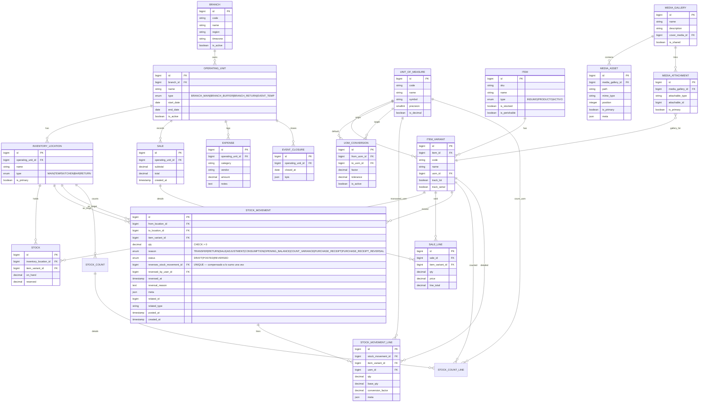
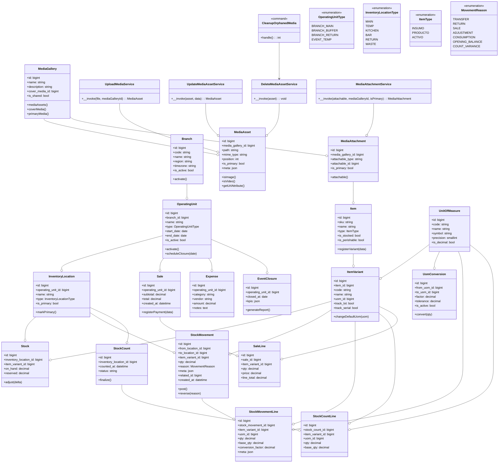
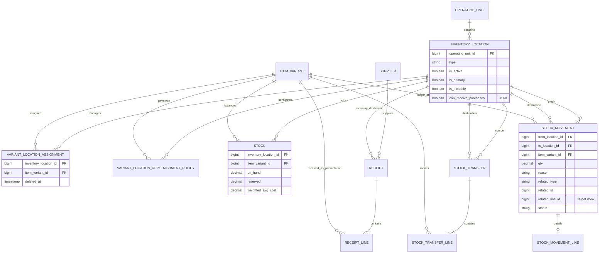
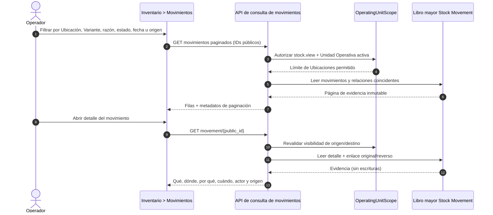
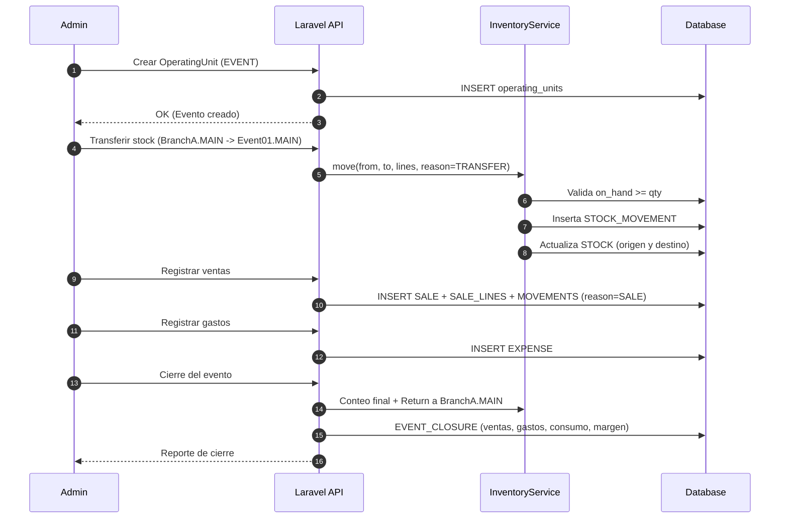
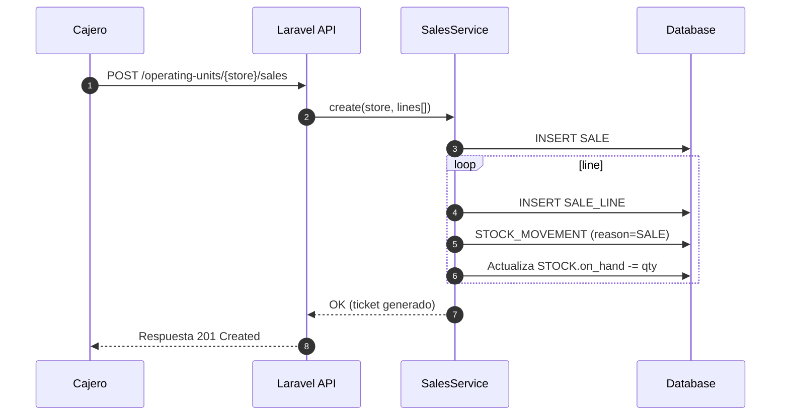
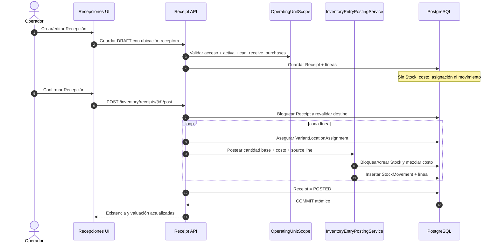
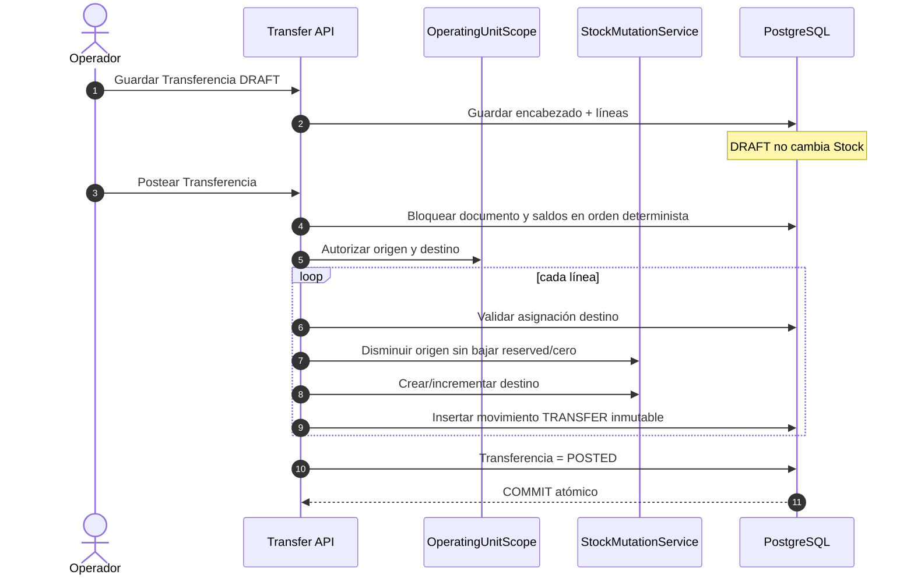

# 🍣 SushiGo Tenant — Inventory Architecture & Design

**Scope**
Plano integral del sistema de inventarios del tenant **SushiGo** dentro de ComandaFlow. Incluye contexto, principios, modelo de dominio, diagramas ER, flujos operativos y lineamientos técnicos para la implementación en Laravel + React.

---

## 1. Contexto y requerimientos

SushiGo opera hoy como un restaurante único con eventos temporales, pero se prepara para:

-   **Sucursales múltiples** que administran inventarios propios por ciudad o zona.
-   **Eventos (`EVENT`)** que requieren mover inventario temporalmente, registrar costos/ventas y ejecutar cierres con retorno de existencias.
-   **Control de rentabilidad** por unidad operativa (tienda o evento) y periodos definidos.
-   **Escalabilidad** hacia compras, producción, lotes y analítica avanzada.

El sistema debe garantizar:

-   Inventario multi-ubicación por unidad operativa.
-   Transferencias y ajustes auditables.
-   Registro de ventas, gastos y cierres operativos.
-   Trazabilidad completa de movimientos (quién, cuándo, por qué).
-   Preparación para módulos de costos y forecasting.
-   Gestión de galerías de imágenes reutilizables con portada principal, asociables a productos u otros objetos de dominio.

---

## 2. Principios de diseño

| Principio                      | Descripción                                                                            |
| ------------------------------ | -------------------------------------------------------------------------------------- |
| **Single Tenant Scope**        | Toda la data pertenece al tenant SushiGo; no se requiere aislamiento multi-cliente.    |
| **Operating Unit Abstraction** | Cada operación ocurre dentro de una unidad (inventario de sucursal o evento temporal). |
| **Inventory by Location**      | Stock segregado por `InventoryLocation` (MAIN, KITCHEN, BAR, etc.).                    |
| **Traceabilidad total**        | Cada movimiento genera `StockMovement` y líneas detalladas.                            |
| **Expandable Architecture**    | Preparado para compras, lotes, producción y analítica.                                 |
| **Secure IDs**                 | IDs internos incrementales, externos expuestos como `public_id` (ULID).                |
| **Service-Oriented Layering**  | Controladores delgados → Servicios de dominio → Modelos.                               |
| **Laravel Native**             | Uso de patrones propios de Laravel 12 + Spatie Permission.                             |

---

## 3. Modelo de dominio

> **Nota (actualizada por #442):** las formas de `Item`/`ItemVariant` de abajo (diagrama ER §3.2,
> diagrama de clases §3.7) ya reflejan el esquema de solo-identidad tal como quedó construido.
> `min_stock`/`max_stock` pasaron a una política por Ubicación de Inventario (#439, §3.10);
> `last_unit_cost`/`avg_unit_cost`/`sale_price` se eliminaron de `item_variants` en #442 — el costo
> de adquisición vive en `Stock.weighted_avg_cost` por ubicación (#434, §3.9) y el precio de venta
> en listas de precios vigentes por fecha (#435). `Item.sku` se conserva: autoritativo para
> `INSUMO`/`ACTIVO` (#500), deprecado solo para `type = PRODUCTO`. Ver
> [Product Catalog — Target Architecture](product-catalog/product-catalog-architecture.es.md) y
> [TD-03](../decisions/td-03-product-catalog-separation.md) para el modelo de
> Producto/Variante/Presentación de Compra y la secuencia completa de migración.
>
> **Nota adicional:** esta versión en español anteriormente incluía `Item.is_manufactured` en el
> diagrama ER, el diagrama de clases y el resumen de clases, con una descripción de negocio que no
> tiene respaldo real: la migración que debía agregar esa columna
> (`2025_11_12_092126_add_is_manufactured_to_items_table.php`) quedó vacía (no-op). Se removió de
> esta versión para que coincida con la versión en inglés (que nunca lo tuvo); el campo muerto en
> `product-wizard.tsx` que lo leía/escribía sigue señalado para limpieza en
> [Product Catalog — Target Architecture](product-catalog/product-catalog-architecture.es.md) §9.4
> (`#429`). Por la misma razón, también se removió del resumen de clases (§3.8) el bloque
> "Aplicación"/"Casos de uso" de `UomConversion` que daba ejemplos de `PRODUCTO` (bandeja/caja) —
> contradecía la propia regla de la §3.3 ("Only INSUMO enables multiple conversions; PRODUCTO and
> ACTIVO operate 1:1") y es exactamente el antipatrón que
> [Product Catalog — Target Architecture](product-catalog/product-catalog-architecture.es.md) §4 y
> §9.3 reemplazan con `VariantPurchasePresentation`; la versión en inglés nunca tuvo ese bloque.

### 3.1 Entidades principales

-   **Branch**: sucursal física/administrativa del tenant; agrupa inventarios permanentes y temporales.
-   **OperatingUnit (Inventory)**: contexto operativo dentro de una sucursal (inventario principal, almacenes auxiliares o eventos temporales).
-   **InventoryLocation**: zonas físicas o lógicas dentro de cada unidad.
-   **Item / ItemVariant**: catálogo maestro (bienes `ACTIVO`, productos terminados, insumos).
-   **UnitOfMeasure / UomConversion**: unidad base por variante y conversiones permitidas.
-   **Stock / StockMovement / StockMovementLine**: existencias, movimientos y detalle transaccional.
-   **Sale / SaleLine**: tickets de venta por unidad operativa.
-   **Expense**: gastos operativos por unidad.
-   **EventClosure**: resultados y KPIs al cierre de un evento.
-   **StockCount / StockCountLine**: conteos físicos que alimentan ajustes.
-   **MediaGallery / MediaAsset / MediaAttachment**: gestión de imágenes (portada + galería) reutilizable entre productos, variantes u otros modelos.
-   **Users & Roles**: asignación de personal a unidades y permisos por dominio.

### 3.2 Diagrama ER principal


```mermaid
erDiagram
  BRANCH ||--o{ OPERATING_UNIT : owns
  OPERATING_UNIT ||--o{ INVENTORY_LOCATION : has
  OPERATING_UNIT ||--o{ SALE : records
  OPERATING_UNIT ||--o{ EXPENSE : logs
  OPERATING_UNIT ||--o{ EVENT_CLOSURE : closes

  INVENTORY_LOCATION ||--o{ STOCK : holds
  INVENTORY_LOCATION ||--o{ STOCK_MOVEMENT : as_origin
  INVENTORY_LOCATION ||--o{ STOCK_MOVEMENT : as_target
  INVENTORY_LOCATION ||--o{ STOCK_COUNT : counts

  UNIT_OF_MEASURE ||--o{ ITEM_VARIANT : default
  UNIT_OF_MEASURE ||--o{ UOM_CONVERSION : origin
  UNIT_OF_MEASURE ||--o{ UOM_CONVERSION : target

  ITEM ||--o{ ITEM_VARIANT : has
  ITEM_VARIANT ||--o{ STOCK : stored
  ITEM_VARIANT ||--o{ SALE_LINE : sold
  ITEM_VARIANT ||--o{ STOCK_MOVEMENT : moved
  ITEM_VARIANT ||--o{ STOCK_COUNT_LINE : counted
  ITEM_VARIANT ||--o{ STOCK_MOVEMENT_LINE : detailed

  STOCK_MOVEMENT ||--o{ STOCK_MOVEMENT_LINE : lines
  UNIT_OF_MEASURE ||--o{ STOCK_MOVEMENT_LINE : transacted_uom
  UNIT_OF_MEASURE ||--o{ STOCK_COUNT_LINE : count_uom

  SALE ||--o{ SALE_LINE : details
  STOCK_COUNT ||--o{ STOCK_COUNT_LINE : details
  MEDIA_GALLERY ||--o{ MEDIA_ASSET : contains
  MEDIA_GALLERY ||--o{ MEDIA_ATTACHMENT : links
  MEDIA_ATTACHMENT }o--|| ITEM_VARIANT : gallery_for

  BRANCH {
    bigint id PK
    string code
    string name
    string region
    string timezone
    boolean is_active
  }

  OPERATING_UNIT {
    bigint id PK
    bigint branch_id FK
    string name
    enum type "BRANCH_MAIN|BRANCH_BUFFER|BRANCH_RETURN|EVENT_TEMP"
    date start_date
    date end_date
    boolean is_active
  }

  INVENTORY_LOCATION {
    bigint id PK
    bigint operating_unit_id FK
    string name
    enum type "MAIN|TEMP|KITCHEN|BAR|RETURN"
    boolean is_primary
  }

  ITEM {
    bigint id PK
    string sku
    string name
    enum type "INSUMO|PRODUCTO|ACTIVO"
    boolean is_stocked
    boolean is_perishable
  }

  ITEM_VARIANT {
    bigint id PK
    bigint item_id FK
    string code
    string name
    bigint uom_id FK
    boolean track_lot
    boolean track_serial
  }

  UNIT_OF_MEASURE {
    bigint id PK
    string code
    string name
    string symbol
    smallint precision
    boolean is_decimal
  }

  UOM_CONVERSION {
    bigint id PK
    bigint from_uom_id FK
    bigint to_uom_id FK
    decimal factor
    decimal tolerance
    boolean is_active
  }

  STOCK {
    bigint id PK
    bigint inventory_location_id FK
    bigint item_variant_id FK
    decimal on_hand
    decimal reserved
  }

  STOCK_MOVEMENT {
    bigint id PK
    bigint from_location_id FK
    bigint to_location_id FK
    bigint item_variant_id FK
    decimal qty "CHECK > 0"
    enum reason "TRANSFER|RETURN|SALE|ADJUSTMENT|CONSUMPTION|OPENING_BALANCE|COUNT_VARIANCE|PURCHASE_RECEIPT|PURCHASE_RECEIPT_REVERSAL"
    enum status "DRAFT|POSTED|REVERSED"
    bigint reverses_stock_movement_id FK "UNIQUE — compensado a lo sumo una vez"
    bigint reversed_by_user_id FK
    timestamp reversed_at
    text reversal_reason
    json meta
    bigint related_id
    string related_type
    timestamp posted_at
    timestamp created_at
  }

  STOCK_MOVEMENT_LINE {
    bigint id PK
    bigint stock_movement_id FK
    bigint item_variant_id FK
    bigint uom_id FK
    decimal qty
    decimal base_qty
    decimal conversion_factor
    json meta
  }

  SALE {
    bigint id PK
    bigint operating_unit_id FK
    decimal subtotal
    decimal total
    timestamp created_at
  }

  SALE_LINE {
    bigint id PK
    bigint sale_id FK
    bigint item_variant_id FK
    decimal qty
    decimal price
    decimal line_total
  }

  EXPENSE {
    bigint id PK
    bigint operating_unit_id FK
    string category
    string vendor
    decimal amount
    text notes
  }

  EVENT_CLOSURE {
    bigint id PK
    bigint operating_unit_id FK
    date closed_at
    json kpis
  }

  MEDIA_GALLERY {
    bigint id PK
    string name
    string description
    bigint cover_media_id FK
    boolean is_shared
  }

  MEDIA_ASSET {
    bigint id PK
    bigint media_gallery_id FK
    string path
    string mime_type
    integer position
    boolean is_primary
    json meta
  }

  MEDIA_ATTACHMENT {
    bigint id PK
    bigint media_gallery_id FK
    string attachable_type
    bigint attachable_id
    boolean is_primary
  }
```

### 3.3 Unidades de medida y transacciones

-   Cada variante posee una **unidad base** (`ITEM_VARIANT.uom_id`).
-   Las conversiones (`UOM_CONVERSION`) definen factores dirigidos `from_uom → to_uom` con tolerancias.
-   Solo los `INSUMO` habilitan conversiones múltiples; `PRODUCTO` y `ACTIVO` operan 1:1 (misma unidad de entrada y salida).
-   `StockMovementLine` registra tanto la cantidad operada (`qty`, `uom_id`) como la cantidad normalizada (`base_qty`) y el factor aplicado.
-   `meta.original_qty` y `meta.original_uom` en `StockMovement` preservan la transacción original para auditoría y costing.
-   Los conteos físicos (`StockCountLine`) aceptan cualquier unidad y se convierten con las mismas reglas.

### 3.4 Seguridad y roles

El detalle del sistema de usuarios, roles y permisos se documenta en
[Arquitectura de Seguridad y Usuarios](./security-and-user-system-architecture.es.md).
Allí se describe el flujo de asignación, los roles base (`super-admin`, `admin`, `user`) y la estrategia para combinar permisos directos con roles contextuales.

---

### 3.5 Modelo de sucursales e inventarios

-   **Branch** actúa como contenedor maestro. Cada sucursal tiene al menos un inventario permanente (`OperatingUnit` de tipo `BRANCH_MAIN`) y puede sumar inventarios auxiliares (`BRANCH_BUFFER`, `BRANCH_RETURN`, etc.).
-   Los **events** se representan como `OperatingUnit` temporales (`EVENT_TEMP`) asociados a una sucursal origen; poseen `start_date` y `end_date` para delimitar el corte y el retorno de stock.
-   Las **transferencias** se expresan entre `InventoryLocation`; el `OperatingUnit` de cada extremo
    determina si el movimiento es interno, entre unidades de una sucursal o entre sucursales. El
    contrato de `StockMovement` ya admite `TRANSFER`, pero al 2026-08-30 el documento/API/UI de
    transferencias sigue planeado en [#573](https://github.com/pakodiazdev/sushigo/issues/573); no
    debe interpretarse como un flujo construido todavía.
-   Cuando el sistema aún no expone la gestión de sucursales, se puede inicializar una sucursal por defecto y trabajar con su inventario principal. El diseño soporta activar sucursales adicionales sin refactorizar dominios.
-   Los reportes de stock y rentabilidad se calculan por `OperatingUnit` y agregan métricas por sucursal para análisis financiero y operativo.

**Esquema propuesto**

| Tabla                 | Campos clave                                                       | Notas                                                                             |
| --------------------- | ------------------------------------------------------------------ | --------------------------------------------------------------------------------- |
| `branches`            | `id`, `code`, `name`, `region`, `timezone`, `is_active`            | Catálogo de sucursales; inicialmente se crea una por defecto.                     |
| `operating_units`     | `branch_id`, `type`, `name`, `start_date`, `end_date`, `is_active` | Inventarios permanentes (`BRANCH_*`) o temporales (`EVENT_TEMP`).                 |
| `inventory_locations` | `operating_unit_id`, `name`, `type`, `is_primary`; objetivo Sprint 7: `can_receive_purchases` | Localidades dentro de cada inventario; #568 hará explícita la capacidad de recibir compras. |
| `stock_movements`     | `from_location_id`, `to_location_id`, `reason`, `related_id`       | Permite traspasos inter-sucursal gracias al branch asociado a cada localidad.     |
| `event_closures`      | `operating_unit_id`, `closed_at`, `kpis`                           | Aplica solo a inventarios temporales; ejecuta cierre y retorno a sucursal origen. |

---

### 3.6 Media y galerías reutilizables

> La arquitectura completa a nivel de sistema (autorización de ownership, seguridad ante concurrencia, abstracción de storage) vive en un documento dedicado: [Arquitectura del Sistema de Multimedia](media/media-architecture.es.md). Esta sección solo cubre cómo participa `Item` en él desde el lado del dominio de inventario.

-   **MediaGallery** es el contenedor lógico de imágenes; soporta bandera `is_shared` para reutilizar la misma galería entre modelos.
-   **MediaAsset** representa cada archivo (ruta en storage, MIME, orden y si es la imagen principal). El campo `position` define el orden y `is_primary` garantiza una portada por galería.
-   **MediaAttachment** permite asociar galerías a cualquier modelo (`attachable_type` + `attachable_id`). `Item` es el primer adoptante ([#377](https://github.com/pakodiazdev/sushigo/issues/377)); se deja abierto a futuras entidades como `Employee`, `User` o el próximo catálogo de Dish — ver `doc/conventions/backend/media-uploads.md` para el patrón upload-first/attach-on-save que sigue cada nuevo adoptante.
-   Las galerías huérfanas (subidas pero nunca adjuntadas — p. ej. un formulario de "Nuevo Dish" abandonado) no se limpian reactivamente al eliminar; `php artisan media:cleanup-orphans` las barre una vez que superan un periodo de gracia configurable. Ver [TD-02](../decisions/td-02-media-cleanup-strategy.md) para por qué esto corre al iniciar el contenedor en vez de con un schedule recurrente.
-   Las transformaciones (thumbnails, webp, etc.) se almacenan en `meta` dentro del asset para coordinar con el pipeline de archivos.
-   `App\Services\Media\UploadMediaService`, `UpdateMediaAssetService`, `DeleteMediaAssetService` y `App\Services\Media\MediaAttachmentService` — cada uno una clase invocable (`__invoke()`) de responsabilidad única — encapsulan la interacción con el storage. Todos pasan por `Storage::disk(config('filesystems.default'))` — nunca un disco hardcodeado — de modo que la propia abstracción Flysystem de Laravel (ya configurada con `local`/`public`/`s3` en `config/filesystems.php`) satisface "cambiar de proveedor cloud sin tocar código de negocio" sin necesidad de una interfaz de driver propia.

---

### 3.7 Diagrama de clases (vista lógica)


```mermaid
classDiagram
  class Branch {
    +id: bigint
    +code: string
    +name: string
    +region: string
    +timezone: string
    +is_active: bool
    +activate()
  }

  class OperatingUnit {
    +id: bigint
    +branch_id: bigint
    +name: string
    +type: OperatingUnitType
    +start_date: date
    +end_date: date
    +is_active: bool
    +activate()
    +scheduleClosure(date)
  }

  class InventoryLocation {
    +id: bigint
    +operating_unit_id: bigint
    +name: string
    +type: InventoryLocationType
    +is_primary: bool
    +markPrimary()
  }

  class Item {
    +id: bigint
    +sku: string
    +name: string
    +type: ItemType
    +is_stocked: bool
    +is_perishable: bool
    +registerVariant(data)
  }

  class ItemVariant {
    +id: bigint
    +item_id: bigint
    +code: string
    +name: string
    +uom_id: bigint
    +track_lot: bool
    +track_serial: bool
    +changeDefaultUom(uom)
  }

  class UnitOfMeasure {
    +id: bigint
    +code: string
    +name: string
    +symbol: string
    +precision: smallint
    +is_decimal: bool
  }

  class UomConversion {
    +id: bigint
    +from_uom_id: bigint
    +to_uom_id: bigint
    +factor: decimal
    +tolerance: decimal
    +is_active: bool
    +convert(qty)
  }

  class Stock {
    +id: bigint
    +inventory_location_id: bigint
    +item_variant_id: bigint
    +on_hand: decimal
    +reserved: decimal
    +adjust(delta)
  }

  class StockMovement {
    +id: bigint
    +from_location_id: bigint
    +to_location_id: bigint
    +item_variant_id: bigint
    +qty: decimal
    +reason: MovementReason
    +meta: json
    +related_id: bigint
    +created_at: datetime
    +post()
    +reverse(reason)
  }

  class StockMovementLine {
    +id: bigint
    +stock_movement_id: bigint
    +item_variant_id: bigint
    +uom_id: bigint
    +qty: decimal
    +base_qty: decimal
    +conversion_factor: decimal
    +meta: json
  }

  class StockCount {
    +id: bigint
    +inventory_location_id: bigint
    +counted_at: datetime
    +status: string
    +finalize()
  }

  class StockCountLine {
    +id: bigint
    +stock_count_id: bigint
    +item_variant_id: bigint
    +uom_id: bigint
    +qty: decimal
    +base_qty: decimal
  }

  class Sale {
    +id: bigint
    +operating_unit_id: bigint
    +subtotal: decimal
    +total: decimal
    +created_at: datetime
    +registerPayment(data)
  }

  class SaleLine {
    +id: bigint
    +sale_id: bigint
    +item_variant_id: bigint
    +qty: decimal
    +price: decimal
    +line_total: decimal
  }

  class Expense {
    +id: bigint
    +operating_unit_id: bigint
    +category: string
    +vendor: string
    +amount: decimal
    +notes: text
  }

  class EventClosure {
    +id: bigint
    +operating_unit_id: bigint
    +closed_at: date
    +kpis: json
    +generateReport()
  }

  class MediaGallery {
    +id: bigint
    +name: string
    +description: string
    +cover_media_id: bigint
    +is_shared: bool
    +mediaAssets()
    +coverMedia()
    +primaryMedia()
  }

  class MediaAsset {
    +id: bigint
    +media_gallery_id: bigint
    +path: string
    +mime_type: string
    +position: int
    +is_primary: bool
    +meta: json
    +isImage()
    +isVideo()
    +getUrlAttribute()
  }

  class MediaAttachment {
    +id: bigint
    +media_gallery_id: bigint
    +attachable_type: string
    +attachable_id: bigint
    +is_primary: bool
    +attachable()
  }

  class UploadMediaService {
    +__invoke(file, mediaGalleryId): MediaAsset
  }

  class UpdateMediaAssetService {
    +__invoke(asset, data): MediaAsset
  }

  class DeleteMediaAssetService {
    +__invoke(asset): void
  }

  class MediaAttachmentService {
    +__invoke(attachable, mediaGalleryId, isPrimary): MediaAttachment
  }

  class CleanupOrphanedMedia {
    <<command>>
    +handle(): int
  }

  class OperatingUnitType {
    <<enumeration>>
    BRANCH_MAIN
    BRANCH_BUFFER
    BRANCH_RETURN
    EVENT_TEMP
  }

  class InventoryLocationType {
    <<enumeration>>
    MAIN
    TEMP
    KITCHEN
    BAR
    RETURN
    WASTE
  }

  class ItemType {
    <<enumeration>>
    INSUMO
    PRODUCTO
    ACTIVO
  }

  class MovementReason {
    <<enumeration>>
    TRANSFER
    RETURN
    SALE
    ADJUSTMENT
    CONSUMPTION
    OPENING_BALANCE
    COUNT_VARIANCE
  }

  Branch --o OperatingUnit
  OperatingUnit --o InventoryLocation
  OperatingUnit --o Sale
  OperatingUnit --o Expense
  OperatingUnit --o EventClosure
  InventoryLocation --o Stock
  InventoryLocation --o StockMovement
  InventoryLocation --o StockCount
  Item --o ItemVariant
  ItemVariant --o Stock
  ItemVariant --o StockMovement
  ItemVariant --o StockMovementLine
  ItemVariant --o StockCountLine
  ItemVariant --o SaleLine
  UnitOfMeasure --o ItemVariant
  UnitOfMeasure --o UomConversion
  UnitOfMeasure --o StockMovementLine
  UnitOfMeasure --o StockCountLine
  StockMovement --o StockMovementLine
  StockCount --o StockCountLine
  Sale --o SaleLine
  MediaGallery --o MediaAsset
  MediaGallery --o MediaAttachment
  MediaAttachment --o Item
  UploadMediaService --o MediaAsset
  UpdateMediaAssetService --o MediaAsset
  DeleteMediaAssetService --o MediaAsset
  MediaAttachmentService --o MediaAttachment
  CleanupOrphanedMedia --> DeleteMediaAssetService
```

### 3.8 Resumen de clases

-   **Branch**
    -   Propiedades: `id`, `code`, `name`, `region`, `timezone`, `is_active`.
    -   Acciones: `activate()` o `deactivate()` según disponibilidad operativa; define configuraciones por defecto (inventario principal, moneda).
-   **OperatingUnit**
    -   Propiedades: `id`, `branch_id`, `name`, `type`, `start_date`, `end_date`, `is_active`.
    -   Acciones conceptuales: `activate()` para habilitar operaciones, `scheduleClosure(date)` para marcar fecha de cierre (derivará en servicios como `EventsService`); `changeType()` restringido para transicionar entre `BRANCH_*` y `EVENT_TEMP`.
    -   Tipos disponibles: `BRANCH_MAIN` (inventario principal de sucursal), `BRANCH_BUFFER`/`BRANCH_RETURN` (almacenes auxiliares) y `EVENT_TEMP` (inventario temporal de eventos).
-   **InventoryLocation**
    -   Propiedades: `id`, `operating_unit_id`, `name`, `type`, `is_primary`.
    -   Acciones: `markPrimary()` (se usa en ajustes iniciales de la unidad).
-   **Item**
    -   Propiedades: `id`, `sku`, `name`, `type`, `is_stocked`, `is_perishable`.
    -   Acciones: `registerVariant(data)` encapsula la creación de variantes a través de factories/acciones.
-   **ItemVariant**
    -   Propiedades: `id`, `item_id`, `code`, `name`, `uom_id`, `track_lot`, `track_serial`.
    -   Acciones: `changeDefaultUom(uom)` (valida reglas 1:1 en productos/activos), ganchos para lotes/serializados.
-   **UnitOfMeasure**
    -   Propiedades: `id`, `code`, `name`, `symbol`, `precision`, `is_decimal`.
    -   Usada como catálogo; no expone métodos adicionales.
-   **UomConversion**
    -   Propiedades: `id`, `from_uom_id`, `to_uom_id`, `factor`, `tolerance`, `is_active`.
    -   Acción: `convert(qty)` aplica factor y tolerancia (en la práctica se resuelve vía `TransfersService`/`CostingService`).
-   **Stock**
    -   Propiedades: `id`, `inventory_location_id`, `item_variant_id`, `on_hand`, `reserved`.
    -   Acciones: `adjust(delta)` para restar/sumar existencias (llamado desde servicios de movimientos).
-   **StockMovement** — asiento del libro mayor de stock, solo-anexar (**contrato de línea única**, ver §4.3).
    -   Propiedades: `id`, `from_location_id`, `to_location_id`, `item_variant_id`, `qty`, `reason`,
        `status`, `meta`, `related_id`, `related_type`, `reverses_stock_movement_id`,
        `reversed_by_user_id`, `reversed_at`, `reversal_reason`, `posted_at`, `created_at`.
    -   El encabezado es la única fuente de verdad de la Variante y la cantidad base movida; un
        movimiento `POSTED` es inmutable y no eliminable (`ImmutableStockMovementException` ante
        cualquier edición/borrado), y su `qty` lleva un CHECK `> 0`.
    -   Acciones: `assertContractInvariants()` valida cantidad positiva, la forma origen/destino según
        `reason` y las transiciones de estado (`DRAFT → POSTED → REVERSED` únicamente).
        `StockMovementReverser::reverse($movimiento, $userId, $motivo)` registra un movimiento
        compensatorio inmutable y causalmente enlazado (dirección espejo, misma qty/Variante), marca
        el original como `REVERSED` con `reversed_by/at/reason` y —mediante un
        `reverses_stock_movement_id` **UNIQUE** más una revalidación de estado bajo bloqueo— garantiza
        que el saldo se restaura **exactamente una vez**. Un reverso imposible (stock ya consumido por
        debajo del monto movido) lanza `StockMovementReversalBoundaryException` y no persiste nada.
-   **StockMovementLine** — el desglose opcional de UOM/costo/precio de ese único movimiento.
    -   Propiedades: `id`, `stock_movement_id`, `item_variant_id`, `uom_id`, `qty`, `base_qty`,
        `conversion_factor`, `unit_cost`, `line_total`, campos de precio, `meta`.
    -   A lo sumo **una** línea por movimiento (UNIQUE `stock_movement_id`); no puede expresar una
        Variante ni un `base_qty` distintos del encabezado. Eliminar las columnas
        `item_variant_id`/cantidad ahora redundantes de esta tabla quedó fuera del alcance de #442
        (cuyas Tareas Técnicas enumeran solo el SKU de Item y los campos de costo/precio por
        Variante) y se deja para un follow-up dedicado, dado el riesgo de un cambio de esquema en
        una tabla transaccional con escritura activa.
-   **StockCount / StockCountLine**
    -   Propiedades principales: `inventory_location_id`, `counted_at`, `status` y líneas con `qty`, `uom_id`, `base_qty`.
    -   Acciones: `finalize()` procesa diferencias contra `Stock`.
-   **Sale / SaleLine**
    -   Propiedades: `operating_unit_id`, `subtotal`, `total`, `created_at` y líneas con `qty`, `price`, `line_total`.
    -   Acciones: `registerPayment(data)` (orquestrado por `SalesService`), generación de movimientos `SALE`.
-   **Expense**
    -   Propiedades: `operating_unit_id`, `category`, `vendor`, `amount`, `notes`.
    -   Registro simple, asociado a reportes y cierres.
-   **EventClosure**
    -   Propiedades: `operating_unit_id`, `closed_at`, `kpis`.
    -   Acciones: `generateReport()` invoca servicios para KPIs, balances y retornos de stock.
-   **MediaGallery / MediaAsset / MediaAttachment**
    -   Propiedades principales: galería (`name`, `description`, `cover_media_id`, `is_shared`), assets (`path`, `mime_type`, `position`, `is_primary`, `meta`) y attachments (`attachable_type`, `attachable_id`, `is_primary`).
    -   Se suben vía `POST /api/v1/media/upload` (upload-first, antes de que exista la entidad dueña), se reordenan/marcan como primary vía `PATCH /api/v1/media/assets/{id}`, se eliminan vía `DELETE /api/v1/media/assets/{id}` — ver `doc/conventions/backend/media-uploads.md`.
-   **UploadMediaService, UpdateMediaAssetService, DeleteMediaAssetService y MediaAttachmentService**
    -   `UploadMediaService`, `UpdateMediaAssetService` y `DeleteMediaAssetService` gestionan, cada una como clase invocable de responsabilidad única, un paso del ciclo de vida de upload/reorden/borrado, siempre vía `Storage::disk(config('filesystems.default'))` — sin interfaz de driver propia, la abstracción Flysystem de Laravel basta para cambiar entre `local`/`s3` por configuración.
    -   `MediaAttachmentService` (invocable) es el único lugar donde se crea un `MediaAttachment`, vinculando una galería ya subida con su entidad dueña al guardar.
    -   `CleanupOrphanedMedia` (`php artisan media:cleanup-orphans`) elimina galerías sin attachment tras un periodo de gracia — corre al iniciar el contenedor, ver [TD-02](../decisions/td-02-media-cleanup-strategy.md).
    -   `MediaGallery::isManageableBy()` protege los tres endpoints de media más allá del permiso base `media.*` de la ruta: una vez adjunta a una entidad, delega en `App\Contracts\AuthorizesMediaOwnership::userCanManageMedia()` de esa entidad (`Item` verifica el permiso dedicado `items.manage-media`, no `items.update` — ese también protege ediciones de catálogo/precio); mientras sigue sin adjuntar, verifica un `owner_token` generado por el cliente y capturado al crearla — ver `doc/conventions/backend/media-uploads.md` § 5.

> Nota: las “acciones” descritas se modelarán como métodos en servicios/aplicaciones (ej. `TransfersService` o acciones de dominio). El diagrama ayuda a visualizar responsabilidades antes de trasladarlas a capas de servicios y jobs.

### 3.9 Costo promedio ponderado (#434)

Antes del `#434`, `OpeningBalanceService` escribía un promedio ponderado *global*, cruzando
ubicaciones, en `ItemVariant.avg_unit_cost`, mientras las Recepciones del `#432` escribían un
promedio ponderado *por ubicación* en `Stock.weighted_avg_cost` — ambos podían divergir en
silencio, y tanto el costeo de salidas de stock como los reportes leían el campo que tuvieran más
a la mano.

**Fuente única de verdad: `Stock.weighted_avg_cost`, por Ubicación de Inventario.** Una Variante de
catálogo recibida en dos ubicaciones distintas a precios distintos tiene dos costos de adquisición
reales distintos — combinarlos en un único número a nivel Variante distorsionaría la valuación en
cualquiera de las ubicaciones que pagó más (o menos) que el promedio combinado.
`#434` reconcilió los valores legados de `ItemVariant.avg_unit_cost`/`last_unit_cost` con el rollup
por ubicación y los congeló como solo-lectura; `#442` luego **eliminó ambas columnas** (junto con
`sale_price`) de `item_variants` por completo — `Stock.weighted_avg_cost` es el único costo de
adquisición que el catálogo conoce.

**Toda escritura pasa por un único cálculo.** `Stock::applyWeightedAverageCost(float $qtyAdded,
float $unitCost)` es el único método que modifica `weighted_avg_cost`, y delega la fórmula de
combinación en sí a `App\Support\Money\WeightedAverageCostCalculator::blend()` — un helper pequeño,
puro, respaldado por bcmath (decimal exacto, no float, internamente) y compartido por todo flujo
de entrada que involucre costo:

-   `ReceiptService::postReceipt()` — una llamada por línea registrada, usando el
    `effective_unit_cost` de la línea (ver `doc/architecture/purchasing/purchase-receipts.es.md`).
-   `OpeningBalanceService::registerOpeningBalance()` — una llamada cuando se provee un costo
    unitario.

**Objetivo de precisión (#415).**
[TD-05](../decisions/td-05-monetary-precision-and-rounding.md) define `weighted_avg_cost` y los
demás costos unitarios como tasas exactas con escala 4, las cantidades con escala 4 y los cálculos
intermedios del promedio con escala 8 o mayor. La valuación se convierte en Money solo en su
frontera documentada, donde redondea a escala 2 con `ROUND_HALF_UP`. El total original de la
transacción con dos decimales permanece autoritativo; una tasa unitaria redondeada nunca debe
multiplicarse para reescribir esa evidencia. La firma `float` actual descrita arriba es as-built y
debe eliminarse mediante el issue #415 de Sprint 8.

**Transferencias (objetivo #573).** Al postear una transferencia, el costo promedio de la ubicación
origen no cambia: retirar unidades homogéneas no altera el costo de las que permanecen. La línea
captura una instantánea de ese costo origen y el destino lo combina como costo de entrada mediante el mismo
calculador. Un reverso no intenta reconstruir promedios históricos después de movimientos
posteriores; sin capas/lotes esa reconstrucción no sería exacta. El movimiento compensatorio
restaura cantidades y conserva la evidencia del costo utilizado.

**Toda lectura pasa por el mismo campo.** `StockOutService` costea un movimiento de salida usando el
`Stock.weighted_avg_cost` de *esa misma ubicación* (nunca el de la Variante de catálogo);
`SummarizesStock`, `StockByLocationController` y `StockByVariantController` ya lo leen
directamente para los reportes de valuación.

Revertir una Recepción registrada deja `weighted_avg_cost` intencionalmente sin tocar — deshacer un
promedio combinado con exactitud requeriría rastreo de costo a nivel de lote, algo que este código
todavía no tiene.

### 3.10 Umbrales de reabastecimiento, por Ubicación de Inventario (#439)

Antes del `#439`, `ItemVariant` cargaba un único par global `min_stock` / `max_stock`. Una Variante
almacenada en la bodega principal de una sucursal, en un refrigerador de barra y en una unidad de
evento temporal tiene tres demandas y capacidades distintas, así que un solo número no representaba
ninguna.

**Fuente de verdad: `VariantLocationReplenishmentPolicy`, una fila por par `(inventory_location_id,
item_variant_id)`.** Guarda `min_stock` (punto de reorden), `max_stock` (techo objetivo, forzado en
BD a `>= min_stock`) y `notes` opcional. Un índice único parcial mantiene una sola política viva por
par; la fila usa borrado lógico. `ItemVariant.min_stock` / `max_stock` se eliminaron — una migración
única movió cada par heredado a una fila de política **solo** cuando la Variante tenía stock en
exactamente una ubicación (destino inequívoco), y registró cada par que no pudo colocar, con un
resumen (`LegacyThresholdMigrator`). Como el esquema anterior no tenía guarda `max >= min`, un techo
heredado por debajo de su punto de reorden (normalmente `0`, sin configurar) se eleva al punto de
reorden durante la migración —marcado por fila y contado en el resumen— en lugar de abortar por la
nueva restricción.

**La resolución pasa por un servicio.** `App\Services\Inventory\ReplenishmentPolicyResolver`
devuelve la política efectiva de un par `(ubicación, variante)` — hoy una búsqueda directa de la
fila a nivel de ubicación; es la única costura donde se agregarían más adelante valores por defecto
o herencia a nivel de Unidad Operativa. Una fila de `Stock` **sin** política resuelta nunca está
"baja" — no hay punto de reorden configurado con el cual comparar.

**Semántica de stock bajo.** Una fila de `Stock` está baja cuando existe una política resuelta y
`on_hand <= policy.min_stock`. `Stock::scopeLowStock()` e `ItemVariant::scopeLowStock()` se definen
en esos términos; `SummarizesStock` / `StockByLocationController` / `StockByVariantController`
exponen el `min_stock` / `max_stock` resuelto y una bandera `is_low_stock` por fila más un conteo en
el resumen; `GET /stock` gana un filtro `low_stock` y lleva los campos resueltos en cada fila.

**API.** Con alcance por ubicación, bajo `inventory-locations/{id}/replenishment-policies`:
`GET /` (listar), `GET /{variantId}` (política resuelta, sintética `is_configured:false` si no está
configurada), `PUT /{variantId}` (upsert idempotente — 201 nueva / 200 actualización),
`DELETE /{variantId}`. Las lecturas requieren `stock.view`, las escrituras `stock.manage` — la
configuración de reabastecimiento es gobernanza de stock, no identidad de catálogo, así que reutiliza
los permisos de stock en lugar de crear nuevos. La UI de gestión es un panel por ubicación en el
detalle de ubicación del Stock Dashboard.

---

### 3.11 Autorización horizontal — alcance por Unidad Operativa (#440)

Una capacidad global (`inventory_locations.*`, `stock.*`, …) define *qué* puede hacer un usuario;
**no** define *dónde*. Aplicar solo el permiso permitiría a cualquier titular leer o mutar otra
sucursal/evento adivinando public IDs o cambiando un filtro. La autorización horizontal
("a nivel de fila") cierra esa brecha.

**Regla.** Para toda lectura o mutación de datos de Inventario con alcance, el usuario debe tener
una membresía **activa** en `operating_unit_users` (`is_active = true`) en la Unidad Operativa
dueña de la `InventoryLocation` referida — *además* del permiso funcional.

**Roles de bypass.** Los usuarios con rol `super-admin` o `admin` omiten por completo el requisito
de membresía (siguen necesitando el permiso funcional). Esto es explícito y está probado, no un
efecto secundario de que los seeders asignen a los admins a todas las unidades — ver
`App\Support\Access\OperatingUnitScope::BYPASS_ROLES`.

**Única fuente de verdad.** `App\Support\Access\OperatingUnitScope` centraliza el contrato:

| Método | Usado por |
| --- | --- |
| `accessibleOperatingUnitIds()` / `constrainLocations()` / `constrainStock()` | Endpoints de listado — el conjunto de resultados se restringe a las unidades del usuario *antes* de cualquier filtro de la request, así `?operating_unit_id=` / `?inventory_location_id=` nunca lo amplían. |
| `canAccessLocation()` | Habilidades por instancia de `InventoryLocationPolicy` (`view`/`update`/`delete`/`restore`/`forceDelete`) vía el concern `ChecksOperatingUnitAccess`; los checks de Gate sobre class-string siguen siendo solo de permiso (#400). |
| `assertCanAccessLocation()` (lanza 403) | Controladores de Show / mutación y flujos de movimiento de stock — se invoca una vez por cada ubicación que toca un movimiento, de modo que **tanto** el origen como el destino de una transferencia se validan con la misma regla. |

**Aplicado aquí:** listado/detalle/creación/actualización/borrado de Inventory Location, los
endpoints de consulta de `stock` (`/stock`, `/stock/by-location/{id}`, `/stock/by-variant/{id}`),
el sub-recurso de políticas de reabastecimiento por ubicación
(`/inventory-locations/{id}/replenishment-policies…`, #439) y las operaciones de movimiento de
stock (`opening-balance`, `stock-out`). Los endpoints de Receipt y los filtros adicionales de
stock adoptan el mismo contrato de `OperatingUnitScope` a medida que aterrizan sus propias issues
(coordinado con #432).

Una ubicación u operating-unit id desconocido / `missing` sigue fallando como un error de
validación `422` normal (regla `exists`), nunca como un `403` engañoso.

---

### 3.12 Recepción de almacén y existencia por ubicación — objetivo Sprint 7

> **Estado al 2026-08-30:** esta sección es la arquitectura objetivo aprobada para
> [Sprint 007](../sprints/planned/sprint-007-warehouse-receiving-and-location-aware-stock.md), no
> una descripción del código ya entregado. Las piezas pendientes están rastreadas en #567–#574.

#### Límite de almacén

Sprint 7 no agrega una tabla `warehouses`. El modelo existente ya separa el contexto operativo y
el punto de custodia:

```text
Branch
  └─ OperatingUnit          alcance operativo y de autorización
       └─ InventoryLocation ubicación física/lógica que custodia Stock
```

Una ubicación gana la capacidad explícita `can_receive_purchases` (#568). Esta capacidad es
independiente de `type`, `is_primary`, `is_active` e `is_pickable`: una bodega principal puede ser
solo almacenamiento y un andén dedicado puede recibir compras sin ser la ubicación primaria. Una
Recepción solo puede apuntar a una ubicación no eliminada, activa, receptora y dentro del
`OperatingUnitScope` del usuario (#572).

Una entidad `Warehouse` separada se justifica únicamente cuando una misma Unidad Operativa deba
contener varios almacenes administrativamente independientes. Hasta entonces duplicaría ownership,
autorización y valores por defecto ya resueltos por `OperatingUnit` + `InventoryLocation`.

#### Surtido, evidencia y saldo son conceptos distintos

| Concepto | Fuente de verdad objetivo | Semántica |
|---|---|---|
| Surtido administrado | `VariantLocationAssignment` (#569) | La Variante se maneja en la Ubicación; no crea cantidad |
| Política | `VariantLocationReplenishmentPolicy` (#439) | Min/max opcionales del par; no implica saldo |
| Evidencia | `StockMovement` + línea (#438, #567, #574) | Libro mayor inmutable y consultable: razón, dirección, cantidad, origen documental, actor y tiempo |
| Proyección | `Stock` (#430, #434) | Saldo actual y costo promedio por Ubicación + Variante |

Asignar una Variante nunca inserta `Stock`. La primera entrada posteada crea la fila de saldo de
forma perezosa y segura ante carreras. Las consultas de Existencias parten del surtido y hacen una
proyección opcional de Stock (#571), por lo que un par asignado sin fila física se presenta como
cero sin persistir un saldo ficticio ni un movimiento.

#### Diagrama ER objetivo


```mermaid
erDiagram
  OPERATING_UNIT ||--o{ INVENTORY_LOCATION : contains
  INVENTORY_LOCATION ||--o{ VARIANT_LOCATION_ASSIGNMENT : manages
  ITEM_VARIANT ||--o{ VARIANT_LOCATION_ASSIGNMENT : assigned
  INVENTORY_LOCATION ||--o{ VARIANT_LOCATION_REPLENISHMENT_POLICY : configures
  ITEM_VARIANT ||--o{ VARIANT_LOCATION_REPLENISHMENT_POLICY : governed
  INVENTORY_LOCATION ||--o{ STOCK : holds
  ITEM_VARIANT ||--o{ STOCK : balances

  SUPPLIER ||--o{ RECEIPT : supplies
  INVENTORY_LOCATION ||--o{ RECEIPT : receiving_destination
  RECEIPT ||--|{ RECEIPT_LINE : contains
  ITEM_VARIANT ||--o{ RECEIPT_LINE : received_as_presentation

  INVENTORY_LOCATION ||--o{ STOCK_TRANSFER : source
  INVENTORY_LOCATION ||--o{ STOCK_TRANSFER : destination
  STOCK_TRANSFER ||--|{ STOCK_TRANSFER_LINE : contains
  ITEM_VARIANT ||--o{ STOCK_TRANSFER_LINE : moves

  INVENTORY_LOCATION ||--o{ STOCK_MOVEMENT : origin
  INVENTORY_LOCATION ||--o{ STOCK_MOVEMENT : destination
  ITEM_VARIANT ||--o{ STOCK_MOVEMENT : ledger_entry
  STOCK_MOVEMENT ||--o| STOCK_MOVEMENT_LINE : details

  INVENTORY_LOCATION {
    bigint operating_unit_id FK
    string type
    boolean is_active
    boolean is_primary
    boolean is_pickable
    boolean can_receive_purchases "#568"
  }

  VARIANT_LOCATION_ASSIGNMENT {
    bigint inventory_location_id FK
    bigint item_variant_id FK
    timestamp deleted_at
  }

  STOCK {
    bigint inventory_location_id FK
    bigint item_variant_id FK
    decimal on_hand
    decimal reserved
    decimal weighted_avg_cost
  }

  STOCK_MOVEMENT {
    bigint from_location_id FK
    bigint to_location_id FK
    bigint item_variant_id FK
    decimal qty
    string reason
    string related_type
    bigint related_id
    bigint related_line_id "target #567"
    string status
  }
```

#### Límites de escritura

- Crear Producto/Variante, asignar surtido, configurar min/max y guardar documentos `DRAFT` no
  cambian Stock.
- Confirmar una Recepción crea/incrementa Stock en su ubicación receptora y registra evidencia
  `PURCHASE_RECEIPT` por línea (#572).
- Registrar un saldo inicial crea/incrementa Stock con evidencia `OPENING_BALANCE`; no simula una
  compra y no exige `can_receive_purchases` (#570).
- Postear una Transferencia disminuye origen e incrementa destino dentro de una sola transacción y
  registra `TRANSFER` por línea (#573).
- Toda entrada de ingreso (línea de Recepción, Saldo Inicial) se registra mediante la única
  primitiva `InventoryEntryPostingService` (#567), que agrega el movimiento inmutable, bloquea o crea
  de forma segura ante condiciones de carrera `Stock` y combina el costo promedio ponderado como una
  sola operación que controla la transacción del documento propietario.
- La identidad de línea origen es explícita en el movimiento —`related_type`/`related_id`/`related_line_id`—
  y un índice UNIQUE parcial sobre `(related_type, related_id, related_line_id, reason)` (solo filas
  `POSTED` vivas con línea no nula) hace idempotente reprocesar la misma línea origen: devuelve el
  movimiento existente en vez de incrementar Stock dos veces. `related_line_id` es nulo para
  movimientos manuales sin documento origen, que el índice deja sin restringir.
- Todo reverso es compensatorio; el historial posteado no se edita ni elimina.

#### Libro mayor de movimientos de solo lectura (#574 — entregado)

El historial de movimientos es un modelo de lectura sobre la evidencia inmutable existente, no otra
fuente de verdad de Stock. Las consultas de lista y detalle son paginadas, usan IDs públicos,
aplican `stock.view` y restringen las ubicaciones origen y destino al `OperatingUnitScope` activo del
usuario. Filtrar o abrir un detalle nunca materializa Stock, crea evidencia ni modifica un
movimiento posteado.

**Contrato entregado:**

| Aspecto | Decisión |
|---|---|
| Endpoints | `GET /api/v1/inventory/movements` (lista paginada) · `GET /api/v1/inventory/movements/{movement}` (detalle, resuelto por `public_id`) |
| Permiso | `stock.view` — sin permiso de lectura dedicado; el libro solo expone evidencia que los endpoints de consulta de Stock ya implican |
| Alcance por Unidad Operativa | `OperatingUnitScope::constrainStockMovements()` (lista) / `assertCanAccessStockMovement()` (detalle) — un movimiento es visible cuando **alguna** de sus ubicaciones pertenece a una unidad accesible; se aplica **antes** de filtros/conteo/paginación, así los metadatos de página nunca filtran filas ajenas. `super-admin`/`admin` sin restricción. Las ubicaciones con borrado lógico igual resuelven su unidad. |
| Orden | `posted_at DESC NULLS LAST, id DESC` — determinista, desempate estable; los borradores (`posted_at` nulo) quedan al final |
| Tamaño de página | 15 por defecto, máximo duro 100 (`>100` → 422) |
| Filtros | `location_id` (origen **o** destino), `item_variant_id`, `reason`, `status`, `date_from`/`date_to` (sobre `posted_at`), `search` (ILIKE sobre `reference`, comodines escapados), `source_type` (token estable → FQCN vía `StockMovementSourceType`; hoy `receipt`). Los IDs de filtro se validan contra el mismo alcance de unidad: un ULID fuera de alcance da 422 igual que uno inexistente. |
| Carga útil | ID público, `direction` derivada (`entry`/`exit`/`transfer`/`adjustment` — nunca el `type` legado eliminado), `is_reversal`, cantidad + UOM base, ubicación origen/destino, variante, actor, referencia, `posted_at`, `source` `{type, id}` donde `id` es el **ULID público** del documento de origen (nulo para movimientos manuales o un origen con borrado físico — nunca las claves internas `related_id`/`related_line_id`). El detalle agrega `notes`, el enlace bidireccional `reverses` / `reversed_by` y la auditoría de reversa. Las relaciones opcionales o con borrado lógico se serializan como `null` sin ocultar el movimiento. |
| Enmascarado de unidad ajena | Un traspaso entre unidades se devuelve cuando *un* extremo está en alcance (el OR de `constrainStockMovements`), pero la Ubicación del extremo que el usuario no puede alcanzar se anula antes de serializar — se muestra igual que un extremo externo real, así un usuario con alcance nunca conoce el nombre ni el ID público de una Ubicación de otra unidad. Sin efecto para roles bypass. |
| N+1 | La lista precarga `fromLocation`/`toLocation`/`itemVariant.unitOfMeasure`/`user` (todo `withTrashed`); el conteo de consultas es plano sin importar el tamaño de página. |
| Navegación | `Inventario > Movimientos` → `/inventario/movimientos`, con `stock.view`. El estado de filtros y de la fila abierta vive en el query string de la URL, así una vista filtrada o un movimiento concreto se comparten copiando la dirección. |


```mermaid
sequenceDiagram
  autonumber
  actor Operador
  participant UI as Inventario > Movimientos
  participant API as API de consulta de movimientos
  participant Scope as OperatingUnitScope
  participant DB as Libro mayor Stock Movement

  Operador->>UI: Filtrar por Ubicación, Variante, razón, estado, fecha u origen
  UI->>API: GET movimientos paginados (IDs públicos)
  API->>Scope: Autorizar stock.view + Unidad Operativa activa
  Scope-->>API: Límite de Ubicaciones permitido
  API->>DB: Leer movimientos y relaciones coincidentes
  DB-->>API: Página de evidencia inmutable
  API-->>UI: Filas + metadatos de paginación
  Operador->>UI: Abrir detalle del movimiento
  UI->>API: GET movement/{public_id}
  API->>Scope: Revalidar visibilidad de origen/destino
  API->>DB: Leer detalle + enlace original/reverso
  DB-->>API: Evidencia (sin escrituras)
  API-->>UI: Qué, dónde, por qué, cuándo, actor y origen
```

---

## 4. Flujos operativos

### 4.1 Flujo de un evento

> **Objetivo, no as-built completo:** el tramo de Transferencia se habilita con #573. El resto del
> diagrama conserva la visión de largo plazo de eventos.


```mermaid
sequenceDiagram
  autonumber
  participant Admin as Admin
  participant API as Laravel API
  participant Inv as InventoryService
  participant DB as Database

  Admin->>API: Crear OperatingUnit (EVENT)
  API->>DB: INSERT operating_units
  API-->>Admin: OK (Evento creado)

  Admin->>API: Transferir stock (BranchA.MAIN -> Event01.MAIN)
  API->>Inv: move(from, to, lines, reason=TRANSFER)
  Inv->>DB: Valida on_hand >= qty
  Inv->>DB: Inserta STOCK_MOVEMENT
  Inv->>DB: Actualiza STOCK (origen y destino)

  Admin->>API: Registrar ventas
  API->>DB: INSERT SALE + SALE_LINES + MOVEMENTS (reason=SALE)

  Admin->>API: Registrar gastos
  API->>DB: INSERT EXPENSE

  Admin->>API: Cierre del evento
  API->>Inv: Conteo final + Return a BranchA.MAIN
  API->>DB: EVENT_CLOSURE (ventas, gastos, consumo, margen)
  API-->>Admin: Reporte de cierre
```

### 4.2 Flujo de venta normal


```mermaid
sequenceDiagram
  autonumber
  participant Cashier as Cajero
  participant API as Laravel API
  participant Sales as SalesService
  participant DB as Database

  Cashier->>API: POST /operating-units/{store}/sales
  API->>Sales: create(store, lines[])
  Sales->>DB: INSERT SALE
  loop line
    Sales->>DB: INSERT SALE_LINE
    Sales->>DB: STOCK_MOVEMENT (reason=SALE)
    Sales->>DB: Actualiza STOCK.on_hand -= qty
  end
  Sales-->>API: OK (ticket generado)
  API-->>Cashier: Respuesta 201 Created
```

### 4.3 Máquina de estados de movimientos

`DRAFT → POSTED → REVERSED` es la **única** ruta legal — validada en la capa de modelo
(`StockMovement::assertContractInvariants()` + guarda en `saving`/`deleting`). Un movimiento `POSTED`
es inmutable y no eliminable; el único cambio que aún acepta es la transición `POSTED → REVERSED` que
escribe el flujo de reverso. Las correcciones se hacen **registrando un nuevo movimiento
compensatorio**, nunca editando el historial.

```mermaid
stateDiagram-v2
  [*] --> DRAFT
  DRAFT --> POSTED : post
  DRAFT --> [*] : descartar (borrado permitido solo en DRAFT)
  POSTED --> REVERSED : StockMovementReverser::reverse()\n(registra un movimiento compensatorio enlazado)
  REVERSED --> [*] : congelado (solo-anexar)
```

**Contrato de línea única.** Un `StockMovement` describe exactamente una `ItemVariant` moviendo una
`qty` base. El encabezado es dueño de la Variante + cantidad; la `StockMovementLine` opcional (a lo
sumo una, UNIQUE `stock_movement_id`) solo añade el desglose de UOM/costo/precio y no puede
contradecir al encabezado.

**Reglas de origen / destino por `reason`** (las violaciones fallan atómicamente antes de cualquier escritura):

| Forma | Reasons | `from` | `to` |
|---|---|---|---|
| Entrada | `OPENING_BALANCE`, `PURCHASE_RECEIPT` | ∅ | requerido |
| Salida | `SALE`, `CONSUMPTION`, `PURCHASE_RECEIPT_REVERSAL` | requerido | ∅ |
| Movimiento | `TRANSFER`, `RETURN` | requerido | requerido (≠ `from`) |
| Un solo lado | `ADJUSTMENT`, `COUNT_VARIANCE` | exactamente uno de `from` / `to` | |

Un **reverso compensatorio** conserva el `reason` de su original pero invierte su dirección, y se
valida contra el original (misma Variante/qty, `from`/`to` intercambiados) en `StockMovementReverser`.

**Otras reglas**

-   `qty` es estrictamente `> 0` (guarda de modelo + CHECK de BD).
-   Validar `on_hand >= qty` al restar stock; un reverso que dejaría `on_hand` bajo cero se rechaza
    (`StockMovementReversalBoundaryException`) y no persiste nada.
-   `reverses_stock_movement_id` es UNIQUE → un movimiento posteado se compensa **a lo sumo una vez**.
-   Persistir `meta.cost` para auditoría de costo promedio.

### 4.4 Recepción confirmada hacia una ubicación receptora — objetivo Sprint 7


```mermaid
sequenceDiagram
  autonumber
  actor Operator as Operador
  participant UI as Recepciones UI
  participant API as Receipt API
  participant Scope as OperatingUnitScope
  participant Posting as InventoryEntryPostingService
  participant DB as PostgreSQL

  Operator->>UI: Crear/editar Recepción
  UI->>API: Guardar DRAFT con ubicación receptora
  API->>Scope: Validar acceso + activa + can_receive_purchases
  API->>DB: Guardar Receipt + líneas
  Note over DB: Sin Stock, costo, asignación ni movimiento
  Operator->>UI: Confirmar Recepción
  UI->>API: POST /inventory/receipts/{id}/post
  API->>DB: Bloquear Receipt y revalidar destino
  loop cada línea
    API->>DB: Asegurar VariantLocationAssignment
    API->>Posting: Postear cantidad base + costo + source line
    Posting->>DB: Bloquear/crear Stock y mezclar costo
    Posting->>DB: Insertar StockMovement + línea
  end
  API->>DB: Receipt = POSTED
  DB-->>API: COMMIT atómico
  API-->>UI: Existencia y valuación actualizadas
```

### 4.5 Transferencia interna — objetivo Sprint 7


```mermaid
sequenceDiagram
  autonumber
  actor Operator as Operador
  participant API as Transfer API
  participant Scope as OperatingUnitScope
  participant StockSvc as StockMutationService
  participant DB as PostgreSQL

  Operator->>API: Guardar Transferencia DRAFT
  API->>DB: Guardar encabezado + líneas
  Note over DB: DRAFT no cambia Stock
  Operator->>API: Postear Transferencia
  API->>DB: Bloquear documento y saldos en orden determinista
  API->>Scope: Autorizar origen y destino
  loop cada línea
    API->>DB: Validar asignación destino
    API->>StockSvc: Disminuir origen sin bajar reserved/cero
    API->>StockSvc: Crear/incrementar destino
    API->>DB: Insertar movimiento TRANSFER inmutable
  end
  API->>DB: Transferencia = POSTED
  DB-->>API: COMMIT atómico
```

---

## 5. Identificadores ofuscados

> **Nota de obsolescencia (2026-08-12):** esta sección describía una estrategia Hashids planeada que
> nunca se implementó y enlaza a un documento que no existe en este repositorio. La convención
> realmente en uso es `public_id` (ULID) mediante los traits `HasPublicId`/`SerializesPublicIdAsId`
> — ya adoptada por `Dish`, `MediaGallery`, `CashAdjustment`, entre otros. Migrar `Item`/`ItemVariant`
> (y el resto de este dominio) a esa convención se rastrea en
> [#399](https://github.com/pakodiazdev/sushigo/issues/399); las nuevas tablas del catálogo de
> Producto (`Brand`, `InventoryCategory`, `PurchasePresentationTemplate`,
> `VariantPurchasePresentation`) la adoptan desde el inicio — ver
> [Product Catalog — Target Architecture](product-catalog/product-catalog-architecture.es.md) §2.

-   Ningún ID incremental se expone en APIs; los IDs internos autoincrementales permanecen internos,
    los IDs externos son ULIDs (`public_id`).

---

## 6. Arquitectura Laravel

| Capa                         | Responsabilidad                                                         |
| ---------------------------- | ----------------------------------------------------------------------- |
| **Controllers**              | Reciben requests, validan y delegan a servicios.                        |
| **FormRequests**             | Validan payloads, resuelven route bindings por `public_id` y sanitizan datos. |
| **Services**                 | Orquestan reglas de negocio (transferencias, ventas, cierres, costing). |
| **Policies**                 | Autorización por unidad operativa y rol.                                |
| **Resources / Transformers** | Serializan respuestas exponiendo `public_id` (como `id`) y datos calculados. |

Servicios principales as-built:

-   `StockMutationService` — bloqueo, primera creación race-safe, incrementos y decrementos.
-   `StockMovementReverser` — movimientos compensatorios inmutables.
-   `OpeningBalanceService` y `StockOutService` — entradas iniciales y salidas actuales.
-   `ReceiptService` — ciclo de vida y posting/reverso de Recepciones.
-   `ReplenishmentPolicyResolver` — min/max efectivos por Ubicación + Variante.

Servicios objetivo Sprint 7:

-   `InventoryEntryPostingService` (#567) — entrada idempotente de saldo + costo + evidencia.
-   Servicio de Transferencias (#573; nombre final durante implementación) — documento
    multi-línea, posting y reverso entre ubicaciones.
-   Límite de consulta del libro de movimientos (#574; nombres finales durante implementación) —
    lista/detalle paginados, filtrables, acotados por Unidad Operativa y sin efectos de escritura.

---

## 7. Referencias

-   [Sprint 007 — Warehouse Receiving & Location-Aware Stock](../sprints/planned/sprint-007-warehouse-receiving-and-location-aware-stock.md)
-   [Recepciones de compra](purchasing/purchase-receipts.es.md)
-   [Tenancy for Laravel](https://tenancyforlaravel.com/docs)
-   [Martin Fowler — DDD Aggregates](https://martinfowler.com/bliki/DDD_Aggregate.html)
-   [Eric Evans — Domain Driven Design](https://domainlanguage.com/ddd/)
-   [Inventory Management Overview (MS Docs)](https://learn.microsoft.com/en-us/dynamics365/supply-chain/inventory/inventory-overview)

---

**Autoría**
Equipo SushiGo / ComandaFlow · 2025-11-04
