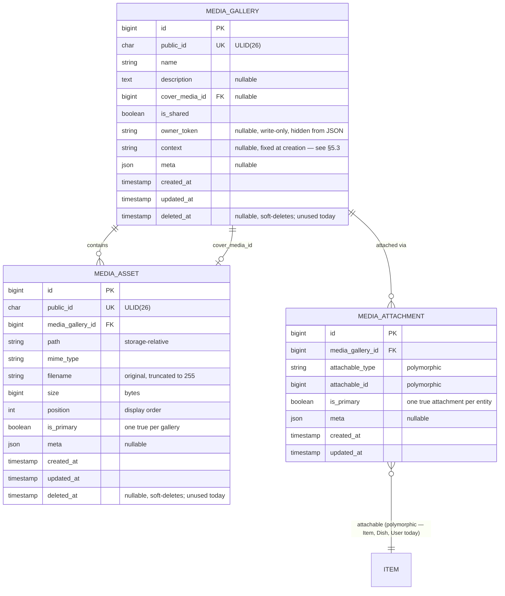
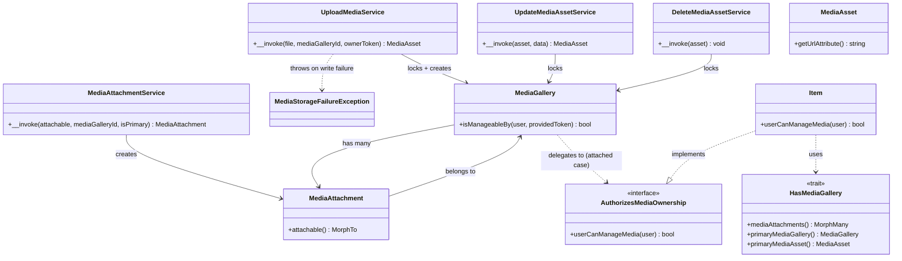
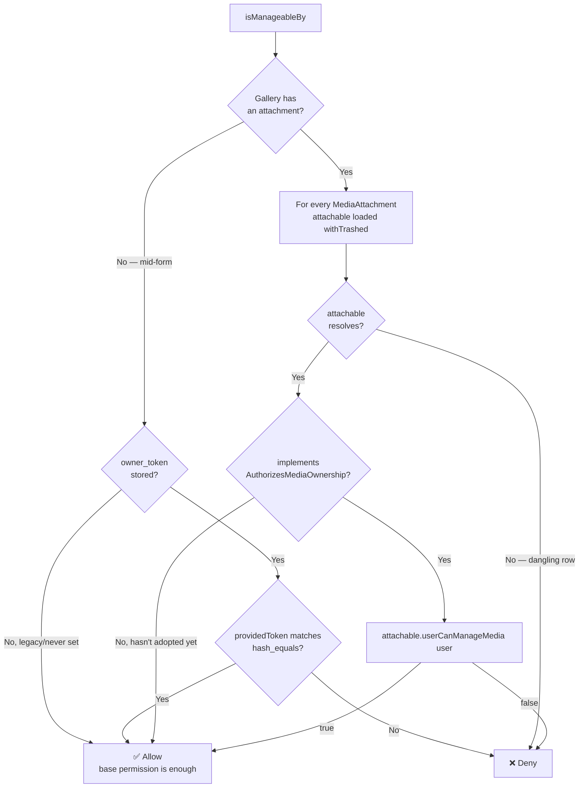
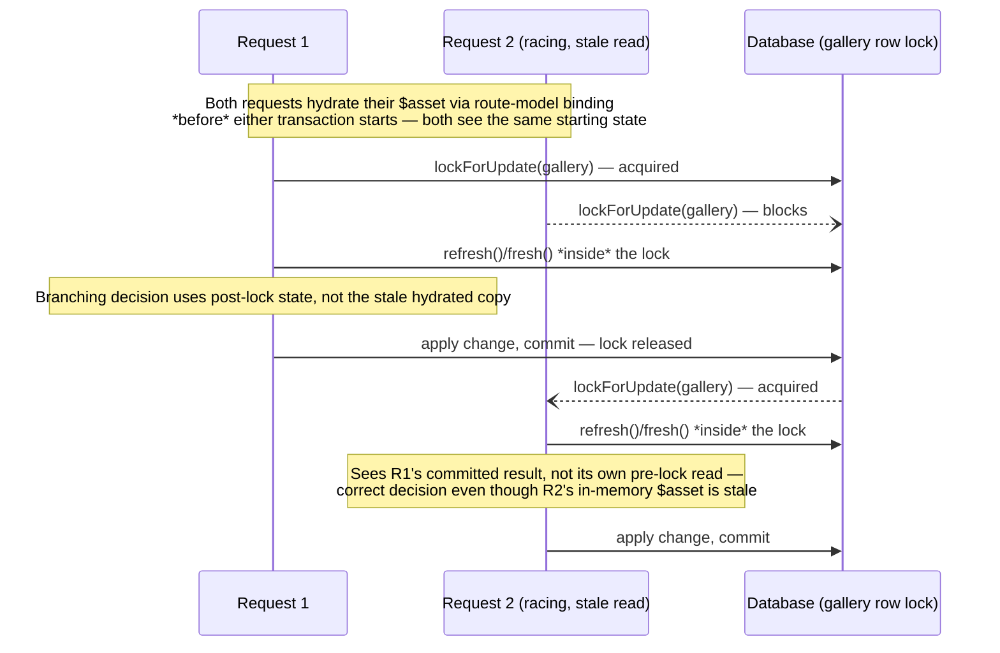
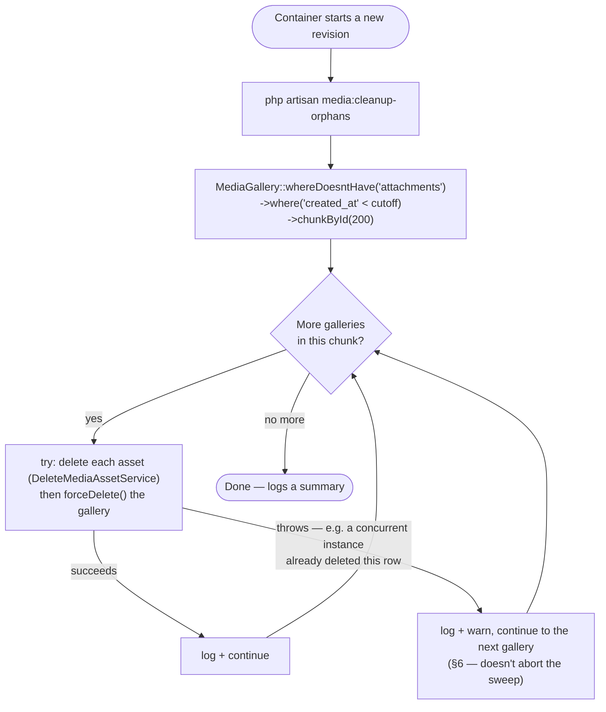

# 🖼️ Media System Architecture — SushiGo

**Scope**
The polymorphic, cloud-swappable media upload system introduced in [#377](https://github.com/pakodiazdev/sushigo/issues/377): storage, domain model, service architecture, ownership authorization, concurrency safety, and orphan cleanup. `Item` is the first adopter; the Dish catalog and `User` (employee avatars, [#401](https://github.com/pakodiazdev/sushigo/issues/401)) have since followed the same shape.

---

## 1. Context and Design Goals

Forms that let a user attach images (a new Item, a new Dish, an employee's avatar) commonly need to upload the file **before the owning record exists** — the user is still mid-form. Building a bespoke upload path per entity (`items/{id}/photo`, `employees/{id}/avatar`, ...) means solving "where does the file live before the entity does" once per entity. This system solves it once, on a **polymorphic** data model any entity can attach to.

Four goals shaped every design decision below:

| Goal | How it's satisfied |
|---|---|
| **Upload before the entity exists** | `POST /media/upload` creates a still-unattached `MediaGallery`; the entity's own create/update request attaches it later — see §7.1. |
| **Cloud-swappable storage** | Every read/write goes through `Storage::disk(config('filesystems.default'))` — never a hardcoded disk name. Switching `local` → `s3` in production is a config change only; no custom driver interface was built because Laravel's own Flysystem abstraction already satisfies this. |
| **No enumerable IDs** | `MediaGallery`/`MediaAsset` expose a ULID `public_id`, not the raw sequential `id`, at the API boundary — matching the convention already used by 20+ models (see [TD... #293](https://github.com/pakodiazdev/sushigo/issues/293)). |
| **Ownership isn't optional** | Every mutation — upload, reorder, delete, and attach-on-save — is authorized through one shared decision point (§5), not left to each new adopter to reinvent. |

---

## 2. Domain Model

### 2.1 Entity-Relationship Diagram



### 2.2 Table Notes

- **`media_galleries`** — the logical container. `is_shared` reserves the ability to reuse one gallery across models (not yet exercised). `owner_token` is a client-generated bearer credential set only when a gallery is created **without** a `media_gallery_id` (a brand-new, still-unattached gallery); it is `$hidden` on the model — never serialized in any response, only compared. `context` declares what a gallery is for and fixes its allowed file types — see §5.3. `cover_media_id`'s FK to `media_assets` is added in a second migration step since the tables are mutually referential.
- **`media_assets`** — one row per uploaded file. `media_gallery_id` has `cascadeOnDelete()`, so force-deleting a gallery removes its assets at the DB level too. `position` is computed as `max(position) + 1` on insert, not `count()` — after a deletion leaves a gap (positions `0, 2`), `count()` would recompute `2` and collide with the asset already there.
- **`media_attachments`** — the polymorphic join. The unique constraint is on `(media_gallery_id, attachable_type, attachable_id)` — a given gallery can only be attached once to a given entity, but nothing today stops the **same gallery** from being attached to two **different** entities (a known limitation — see §9). `MediaAttachmentService` is the only place a row here is created.
- Both `media_galleries` and `media_assets` carry `deleted_at` (`SoftDeletes`), but every delete path in this system is a **hard** delete (`forceDelete()`) — a soft-deleted row pointing at an already-deleted file serves no purpose. The column exists for a future soft-delete adopter, not because anything uses it today; `MediaGallery::isManageableBy()` (§5) already accounts for that gap.

---

## 3. Service Architecture



- **`UploadMediaService`, `UpdateMediaAssetService`, `DeleteMediaAssetService`, `MediaAttachmentService`** — each a single-responsibility, invokable (`__invoke()`) class, one per HTTP verb plus the attach-on-save step. They started as one `MediaLibraryService` with three methods and were split during review to keep each class's responsibility (and its lock/transaction boundary) legible on its own.
- **`MediaStorageFailureException`** — thrown by `UploadMediaService` when `Storage::store()` returns `false` instead of throwing (both disks set `'throw' => false`, so a write failure is silent by default — this makes it loud instead of letting a `MediaAsset` row point at a file that was never actually written).
- **`HasMediaGallery`** — one trait, three methods, used by any model that owns a gallery. Even a "single photo" entity models its image as a gallery of one underneath, so `HasMediaGallery` is the one place that hops `attachable → attachment → gallery → primary asset` instead of every consumer re-chaining it.
- **`AuthorizesMediaOwnership`** — see §5.

---

## 4. Storage Abstraction

All I/O goes through `Storage::disk(config('filesystems.default'))` — `local`, `public`, and `s3` are already scaffolded in `config/filesystems.php`; switching providers in production is a config change, not a code change.

Two details that only surface once you serve files across two different origins (`api.sushigo.local` vs `sushigo.local` in this project) or move off the default disk:

- **`MediaAsset::getUrlAttribute()` wraps `Storage::url($path)` in `url()`.** The default `local` disk has no `url` key configured, so `Storage::url()` alone returns a host-relative path (`/storage/media/xxx.jpg`) via Laravel's serve route — correct only when the API and the page requesting it share an origin. `url()` anchors a relative path at `APP_URL` and leaves an already-absolute URL (e.g. the `s3` disk's) untouched, so the same code is correct on both disks without branching.
- **Uploaded filenames are client-controlled and unbounded.** `getClientOriginalName()` comes straight from the multipart `Content-Disposition` header, so it's truncated to fit the `filename` column (`varchar(255)`) before the insert, instead of letting an oversized value reach the DB as an uncaught error.
- **`svg` is deliberately excluded** from every key in `config('media.contexts')` (see §5.3). An SVG can embed `<script>` and is served back from the API's own domain — a stored-XSS vector this project has no sanitization step to neutralize.

---

## 5. Ownership Authorization

Route-level `media.upload`/`media.update`/`media.delete` permissions only prove a caller can touch **some** gallery — not that they're allowed to touch **this** one. `MediaGallery::isManageableBy(User $user, ?string $providedToken)` is the single decision point every media `FormRequest::authorize()` (and, since a follow-up fix, the `Item` create/update requests too) calls before allowing a mutation:



Two branches, each with a lesson learned during review:

### 5.1 Unattached — the `owner_token` bearer credential

While a gallery is mid-form, there's no owning entity to delegate to — the only signal is a client-generated `owner_token`. `POST /media/upload` requires it when starting a new gallery (no `media_gallery_id` given); every later request against that same unattached gallery — another upload, a `PATCH`, a `DELETE`, or the entity's own create/update request attaching it — must send the same token back **as a JSON body field, never a query parameter**, even for `DELETE`. A query string is commonly recorded in web-server/proxy/CDN access logs and APM traces, which would leak a bearer-style credential; `FormRequest::authorize()` reads it via `$this->input()`, which Laravel populates from the JSON body regardless of HTTP verb, so no endpoint needed special-casing for this.

Skipping the check here was a real, shipped vulnerability during development: **attach-on-save originally validated `media_gallery_id` only with `exists:media_galleries,public_id`**, with no ownership check at all — a caller who merely learned another user's in-progress gallery `public_id` (no token needed) could claim its photos on their own `Item`. `CreateItemRequest`/`UpdateItemRequest::authorize()` now call `isManageableBy()` with the request's own `owner_token` before the entity's own create/update permission is allowed to pass.

### 5.2 Attached — per-entity rules via `AuthorizesMediaOwnership`

Once a gallery has at least one `MediaAttachment`, `owner_token` stops being consulted — authorization delegates to each attached entity's own `AuthorizesMediaOwnership::userCanManageMedia(User $user)`. `Item` implements it:

```php
public function userCanManageMedia(User $user): bool
{
    return $user->can('items.manage-media');
}
```

**`items.manage-media` is a permission dedicated to media, deliberately not `items.update`.** `items.update` is also the guard for `PUT /items/{id}` and `PUT /item-variants/{id}` — name, `sale_price`, `min_stock`, and other catalog/pricing fields. Granting a role `items.update` purely so it could manage an item's photos (an early version of this system did exactly that, for the `manager` role) silently handed that role full catalog write access too. The dedicated permission is the fix; it's the pattern any future adopter should follow rather than reusing whatever "update" permission the entity already has.

An entity that hasn't implemented `AuthorizesMediaOwnership` yet is treated the same as "unattached with no token" — allowed by the base route permission alone. This is what lets entities adopt the contract one at a time without breaking the ones that haven't gotten to it yet.

**`withTrashed()` and the null-attachable edge case.** `Item`/`ItemVariant`/the Dish models all use `SoftDeletes`, and their own delete endpoints only ever soft-delete. Loading `attachable` with the default `MorphTo` scope meant a soft-deleted owner's `attachable` resolved to `null` — indistinguishable, at the time, from "this entity hasn't adopted the contract" — silently falling back to the base permission instead of running the entity's real rule. The eager load now uses `MorphTo::withTrashed()`, which is safe across heterogeneous morph types on its own: Laravel's implementation checks `$query->hasMacro('withTrashed')` per resolved type before applying it, so an attachable that *doesn't* soft-delete (`User`, since #401 — no `SoftDeletes` on that model) doesn't crash — it's simply not affected. A `null` attachable that survives `withTrashed()` (the row is genuinely gone — hard-deleted, or a dangling reference) is denied outright, distinct from both cases above.

### 5.3 Upload Contexts — per-adopter file types

`config('media.contexts')` maps a context key (`item`, `dish`, `avatar`) to the extensions `POST /media/upload` will accept for it — every adopter used to share one global list (`config('media.allowed_mimes')`), so an employee avatar accepted the same video formats as an Item photo even though every avatar surface only ever renders through an `` (flagged in #401's review; a selected video would upload successfully and then just silently fail to render, with the initials fallback masking the failure entirely).

`context` is now required in the request when starting a **new** gallery (no `media_gallery_id` given) — `UploadMediaRequest` rejects an unknown key outright (a clean 422, not a fallback) and stores the value on the gallery. Every later upload into that **same** gallery is validated against the gallery's own stored `context`, not whatever the request claims — a client can't relabel an existing gallery mid-session to slip a disallowed file type past the restriction its first upload already fixed. `MediaGallery::allowedExtensions()` is the single place this is resolved (`config("media.contexts.{$this->context}")`); a legacy gallery predating this column falls back to no restriction rather than breaking an in-flight pre-deployment session (see the `2026_08_13_000000_add_context_to_media_galleries_table` migration's backfill for already-attached galleries).

The frontend mirrors this for immediate feedback: `MediaGalleryUploaderProps.context` sets the file input's `accept` attribute and the same allowed-extensions check `useMediaGalleryUploader` runs client-side — the backend remains the source of truth either way.

---

## 6. Concurrency Safety

Every mutating service takes `MediaGallery::lockForUpdate()` for the duration of its transaction — `upload`, `update`, and `delete` on assets in the same gallery serialize against each other, so two requests can't both read "0 assets" and both write `position=0, is_primary=true`, or both decide independently who the next primary should be.

The lock alone isn't enough — **what gets read after acquiring it matters just as much**:



This pattern — re-read the row **after** the lock, not before — closed two review-found races:

- **`is_primary` reassignment**: `UpdateMediaAssetService`/`DeleteMediaAssetService` originally captured `$asset->is_primary` from the route-model-bound instance before the transaction began. If a concurrent request had already promoted or demoted that same asset while this one waited for the lock, the branching decision used stale data — capable of leaving a gallery with zero primaries (a delete) or two (an update), defeating the lock's entire purpose.
- **Concurrent deletion tolerance**: `DeleteMediaAssetService` calls `$asset->fresh()` (not `refresh()`, which throws `ModelNotFoundException` via `firstOrFail()`) — if a concurrent actor already hard-deleted this same row, `fresh()` returns `null` and the service treats it as already done instead of raising. This matters beyond a single HTTP race: `media:cleanup-orphans` explicitly relies on redundant concurrent runs being safe (§8, TD-02) — two container instances sweeping the same orphan backlog at startup will legitimately race on the same assets, and an uncaught exception here used to abort the *entire* sweep over one already-handled row. `CleanupOrphanedMedia` additionally wraps each gallery's deletion in its own `try`/`catch` as defense in depth, so any other unexpected per-gallery failure doesn't take the rest of the backlog down with it.

The **single-primary invariant** ("never zero, never two, while assets exist") is enforced the same way everywhere it can break: `UploadMediaService` only marks an asset primary when `max(position)` is `null` (a genuinely empty gallery, not merely "no primary asset" — a demoted gallery doesn't self-heal on the next upload); `UpdateMediaAssetService` refuses to demote a gallery's *only* asset (no sibling exists to promote, so the demotion is rejected rather than leaving the gallery bare); `DeleteMediaAssetService` promotes the next asset by `position` when the deleted one was primary.

---

## 7. Operational Flows

### 7.1 Upload-First / Attach-on-Save

```mermaid
sequenceDiagram
    participant C as Client (Webapp)
    participant Up as POST /media/upload
    participant Svc as UploadMediaService
    participant Item as POST/PUT /items
    participant Attach as MediaAttachmentService
    participant DB as Database

    Note over C,DB: 1. Start a gallery — the Item doesn't exist yet
    C->>C: generate owner_token (client-side)
    C->>Up: file + owner_token
    Up->>Svc: __invoke(file, null, ownerToken)
    Svc->>DB: CREATE media_galleries(owner_token)<br/>CREATE media_assets(position=0, is_primary=true)
    Svc-->>C: { gallery_id, asset_id, url, is_primary: true }

    Note over C,DB: 2. Add more photos to the same gallery
    C->>Up: file + media_gallery_id + owner_token
    Up->>Up: authorize(): isManageableBy(user, owner_token) — §5.1
    Up->>Svc: __invoke(file, galleryId, ownerToken)
    Svc->>DB: lockForUpdate(gallery); position = max(position)+1; is_primary=false
    Svc-->>C: { gallery_id, asset_id, is_primary: false, position: 1 }

    Note over C,DB: 3. Save the Item, attaching the gallery
    C->>Item: media_gallery_id + owner_token + item fields
    Item->>Item: authorize(): isManageableBy(user, owner_token) — §5.1<br/>*then* the entity's own create/update permission
    Item->>DB: Item::create()/update()
    Item->>Attach: __invoke(item, galleryId)
    Attach->>DB: DELETE other attachments for this item (different gallery)<br/>updateOrCreate media_attachments (unique: gallery+type+id)
    Note over DB: From now on, isManageableBy() delegates to<br/>Item::userCanManageMedia() — owner_token is no longer consulted
```

### 7.2 Orphan Cleanup

`media:cleanup-orphans` deletes `MediaGallery` rows with no `MediaAttachment` — never attached, or the form that would have attached them was abandoned — once they're older than `config('media.orphan_grace_period_days')` (default 7 days). It runs at container startup rather than on a recurring schedule; see [TD-02](../../decisions/td-02-media-cleanup-strategy.md) for the full justification (Cloud Run's scale-to-zero model doesn't fit an always-on scheduler cheaply, and startup-triggered cleanup is free — no new infrastructure).



`chunkById` (not `->get()`) keeps memory bounded even with a large backlog, and — unlike offset-based `chunk()` — stays correct while rows are deleted mid-iteration, since each batch is fetched by `id > lastSeenId` rather than an offset that shifts as rows disappear.

---

## 8. Adopting This for a New Entity

The full step-by-step recipe — `FormRequest` rules, the `authorize()` snippet, excluding `media_gallery_id`/`owner_token` from the entity's own fillable data, the controller call site, and implementing `AuthorizesMediaOwnership` — lives in [`doc/conventions/backend/media-uploads.md`](../../conventions/backend/media-uploads.md) § 3 and § 5, kept in sync with whatever `Item` (the reference implementation) actually does. This document describes *why* the system is shaped this way; that one is the adoption checklist.

---

## 9. Known Limitations

Carried forward from review (Copilot + Devin/DeepWiki) as documented, accepted technical debt — none block `Item`'s current usage, but a future adopter should read this before assuming a use case is already covered:

- **A gallery can end up attached to more than one entity.** The unique constraint on `media_attachments` is per-gallery-per-entity, not per-gallery — `MediaAttachmentService` only removes an entity's *other* attachments (different gallery, same entity) when attaching a new one, never another entity's attachment to the *same* gallery. Nothing in this system's normal flow produces that state today (each gallery is created for one form), but nothing prevents a caller from reusing an already-attached `media_gallery_id` on a second entity if they're authorized for both.
- **Deleting an item's last photo doesn't retract the attachment.** Emptying a gallery down to zero assets leaves the (now-empty) `MediaGallery` and its `MediaAttachment` row in place. `media:cleanup-orphans` only sweeps galleries with **zero attachments**, so an emptied-but-still-attached gallery is not orphaned and is never reclaimed — `HasMediaGallery::primaryMediaAsset()` correctly returns `null` for it, but the row itself lingers.
- **`media:cleanup-orphans` is wired into the preview container's entrypoint only** (`docker/app/config/preview/entrypoint.sh`), not the production startup script — TD-02's rationale applies equally to both, this is scope that was never extended to prod.
- **New permissions require a forced reseed on existing environments.** `PermissionSeeder` is a `LockedSeeder` — an environment where it already ran won't pick up `media.*`/`items.manage-media` without an explicit unlock/re-run.
- **No detach action.** Sending `media_gallery_id: null` on an `Item` update is a no-op, not a "remove this item's photos" instruction — there's no way to detach a gallery from an entity through the API today.

---

## 10. References

- Introduced in [#377](https://github.com/pakodiazdev/sushigo/issues/377) — build log and full retrospective archived at `doc/tasks/2026-08/377-media-upload-system.md`.
- [`doc/conventions/backend/media-uploads.md`](../../conventions/backend/media-uploads.md) — the adoption checklist for a new entity.
- [TD-02](../../decisions/td-02-media-cleanup-strategy.md) — why orphan cleanup runs at container startup, not a recurring schedule.
- [#293](https://github.com/pakodiazdev/sushigo/issues/293) — the ULID `public_id` convention this system's API boundary follows.
- [#400](https://github.com/pakodiazdev/sushigo/issues/400) — `ItemPolicy`'s abilities are currently stubs (`return true` unconditionally); `Item::userCanManageMedia()` deliberately checks a Spatie permission directly instead of going through it.
- [#401](https://github.com/pakodiazdev/sushigo/issues/401) — the next planned adopter: employee avatars, with ownership resolved by identity (`$user->id === $this->id`) rather than a permission.
- [#378](https://github.com/pakodiazdev/sushigo/issues/378) — the reusable frontend counterpart to this system: `<MediaGalleryUploader />` + `useMediaGalleryUploader()` (`code/webapp/src/components/media/`), wired end-to-end into `ItemForm` (§7.1's "Client (Webapp)" participant). Dish's and the employee form's avatar uploader ([#401](https://github.com/pakodiazdev/sushigo/issues/401)) reuse this same component rather than re-implementing the upload/gallery-tracking logic.
- [Inventory Architecture](../inventory-architecture.en.md) § 3.6 — how `Item` fits into this system from the inventory domain's side.
