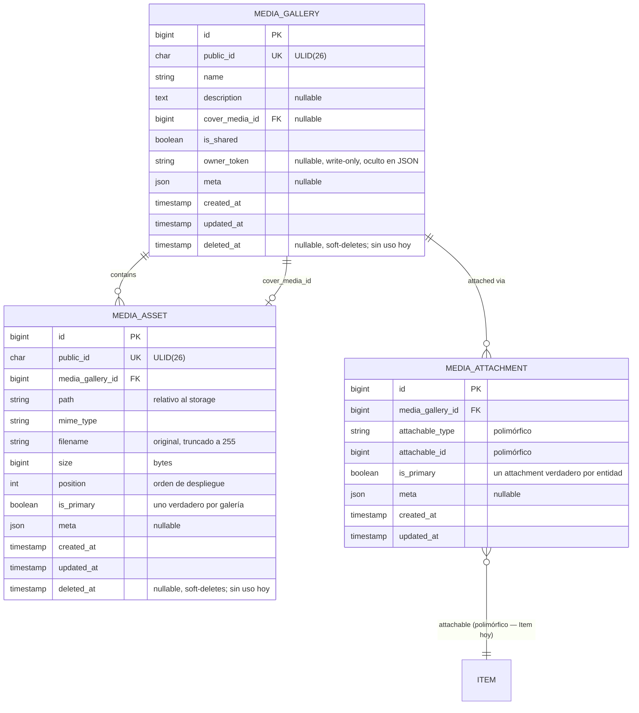
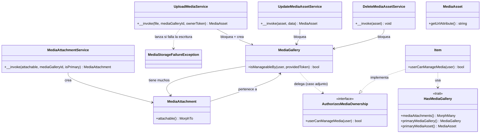
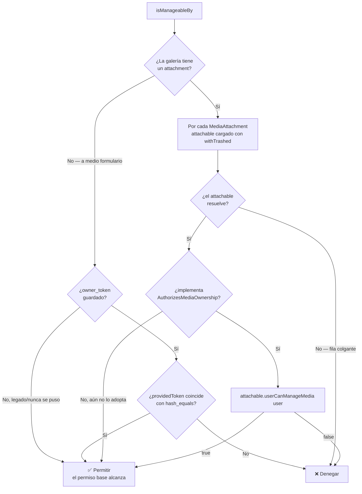
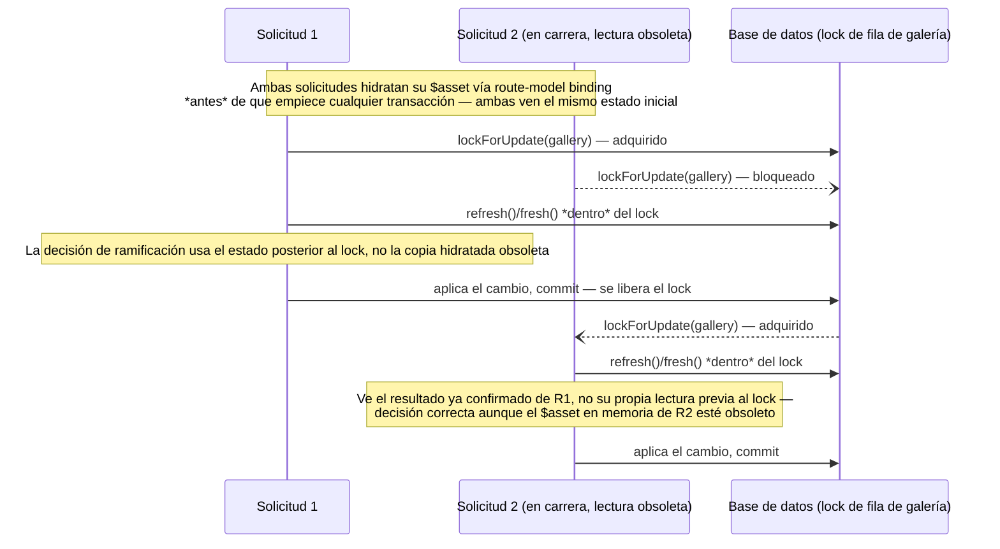
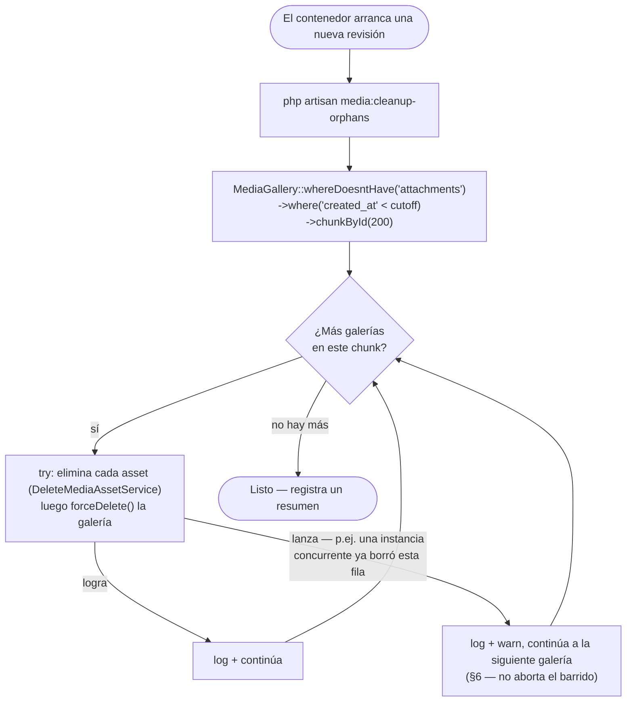

# 🖼️ Arquitectura del Sistema de Multimedia — SushiGo

**Alcance**
El sistema de subida de archivos polimórfico y agnóstico de proveedor de nube introducido en [#377](https://github.com/pakodiazdev/sushigo/issues/377): storage, modelo de dominio, arquitectura de servicios, autorización de ownership, seguridad ante concurrencia, y limpieza de huérfanos. `Item` es el primer adoptante; el sistema está diseñado para que los avatares de `Employee`/`User` ([#401](https://github.com/pakodiazdev/sushigo/issues/401)) y el catálogo de Platillos sigan el mismo patrón.

---

## 1. Contexto y Objetivos de Diseño

Los formularios que permiten adjuntar imágenes (un nuevo Item, un nuevo Platillo, el avatar de un empleado) comúnmente necesitan subir el archivo **antes de que exista el registro dueño** — el usuario sigue a mitad de formulario. Construir una ruta de subida a medida por entidad (`items/{id}/photo`, `employees/{id}/avatar`, ...) implica resolver "dónde vive el archivo antes de que exista la entidad" una vez por cada entidad. Este sistema lo resuelve una sola vez, sobre un modelo de datos **polimórfico** al que cualquier entidad puede adjuntarse.

Cuatro objetivos moldearon cada decisión de diseño de este documento:

| Objetivo | Cómo se satisface |
|---|---|
| **Subir antes de que exista la entidad** | `POST /media/upload` crea una `MediaGallery` todavía sin adjuntar; la propia solicitud de creación/edición de la entidad la adjunta después — ver §7.1. |
| **Storage agnóstico de nube** | Cada lectura/escritura pasa por `Storage::disk(config('filesystems.default'))` — nunca un nombre de disco fijo en el código. Cambiar de `local` a `s3` en producción es un cambio de configuración, no de código; no se construyó una interfaz de driver propia porque la abstracción Flysystem de Laravel ya satisface esto. |
| **Sin IDs enumerables** | `MediaGallery`/`MediaAsset` exponen un `public_id` ULID, no el `id` secuencial crudo, en el límite de la API — siguiendo la convención ya usada en 20+ modelos (ver [#293](https://github.com/pakodiazdev/sushigo/issues/293)). |
| **El ownership no es opcional** | Toda mutación — subir, reordenar, eliminar, y el attach-on-save — se autoriza a través de un único punto de decisión compartido (§5), no queda a criterio de cada nuevo adoptante reinventarlo. |

---

## 2. Modelo de Dominio

### 2.1 Diagrama Entidad-Relación



### 2.2 Notas sobre las Tablas

- **`media_galleries`** — el contenedor lógico. `is_shared` reserva la posibilidad de reutilizar una galería entre modelos (aún no se ejerce). `owner_token` es una credencial tipo bearer generada por el cliente, guardada solo cuando una galería se crea **sin** un `media_gallery_id` (galería nueva, todavía sin adjuntar); está `$hidden` en el modelo — nunca se serializa en ninguna respuesta, solo se compara. La FK de `cover_media_id` hacia `media_assets` se agrega en un segundo paso de migración porque ambas tablas se referencian mutuamente.
- **`media_assets`** — una fila por archivo subido. `media_gallery_id` tiene `cascadeOnDelete()`, así que forzar el borrado de una galería elimina sus assets también a nivel de BD. `position` se calcula como `max(position) + 1` al insertar, no `count()` — después de que un borrado deja un hueco (posiciones `0, 2`), `count()` recalcularía `2` y colisionaría con el asset que ya está ahí.
- **`media_attachments`** — el join polimórfico. La restricción única es sobre `(media_gallery_id, attachable_type, attachable_id)` — una galería dada solo puede adjuntarse una vez a una entidad dada, pero nada hoy impide que la **misma galería** se adjunte a dos entidades **distintas** (limitación conocida — ver §9). `MediaAttachmentService` es el único lugar donde se crea una fila aquí.
- Tanto `media_galleries` como `media_assets` tienen `deleted_at` (`SoftDeletes`), pero toda ruta de borrado en este sistema es un borrado **duro** (`forceDelete()`) — una fila soft-deleted apuntando a un archivo ya eliminado no sirve de nada. La columna existe para un futuro adoptante de soft-delete, no porque algo la use hoy; `MediaGallery::isManageableBy()` (§5) ya contempla ese hueco.

---

## 3. Arquitectura de Servicios



- **`UploadMediaService`, `UpdateMediaAssetService`, `DeleteMediaAssetService`, `MediaAttachmentService`** — cada una una clase invocable (`__invoke()`) de responsabilidad única, una por verbo HTTP más el paso de attach-on-save. Empezaron como un único `MediaLibraryService` con tres métodos y se separaron durante la revisión para que la responsabilidad de cada clase (y su límite de lock/transacción) sea legible por sí sola.
- **`MediaStorageFailureException`** — la lanza `UploadMediaService` cuando `Storage::store()` devuelve `false` en vez de lanzar (ambos discos tienen `'throw' => false`, así que un fallo de escritura es silencioso por defecto — esto lo hace ruidoso en vez de dejar una fila `MediaAsset` apuntando a un archivo que nunca se escribió realmente).
- **`HasMediaGallery`** — un trait, tres métodos, usado por cualquier modelo dueño de una galería. Incluso una entidad de "una sola foto" modela su imagen como una galería de uno por debajo, así que `HasMediaGallery` es el único lugar que recorre `attachable → attachment → gallery → asset primario` en vez de que cada consumidor lo encadene por su cuenta.
- **`AuthorizesMediaOwnership`** — ver §5.

---

## 4. Abstracción de Storage

Todo el I/O pasa por `Storage::disk(config('filesystems.default'))` — `local`, `public`, y `s3` ya están definidos en `config/filesystems.php`; cambiar de proveedor en producción es un cambio de configuración, no de código.

Dos detalles que solo salen a la luz cuando se sirven archivos entre dos orígenes distintos (`api.sushigo.local` vs `sushigo.local` en este proyecto) o al cambiar del disco por defecto:

- **`MediaAsset::getUrlAttribute()` envuelve `Storage::url($path)` en `url()`.** El disco `local` por defecto no tiene configurada la clave `url`, así que `Storage::url()` solo devuelve una ruta relativa al host (`/storage/media/xxx.jpg`) vía la ruta de servido de Laravel — correcta solo cuando la API y la página que la solicita comparten origen. `url()` ancla una ruta relativa a `APP_URL` y deja intacta una URL ya absoluta (la del disco `s3`, por ejemplo), así que el mismo código es correcto en ambos discos sin ramificar.
- **Los nombres de archivo subidos son controlados por el cliente y sin límite.** `getClientOriginalName()` viene directo del header multipart `Content-Disposition`, así que se trunca para caber en la columna `filename` (`varchar(255)`) antes del insert, en vez de dejar que un valor sobredimensionado llegue a la BD como un error sin capturar.
- **`svg` está excluido deliberadamente** de `config('media.allowed_mimes')`. Un SVG puede incrustar `<script>` y se sirve de vuelta desde el propio dominio de la API — un vector de XSS almacenado que este proyecto no tiene ningún paso de sanitización para neutralizar.

---

## 5. Autorización de Ownership

Los permisos de ruta `media.upload`/`media.update`/`media.delete` solo prueban que quien llama puede tocar **alguna** galería — no que tiene permiso de tocar **esta**. `MediaGallery::isManageableBy(User $user, ?string $providedToken)` es el único punto de decisión que llama cada `FormRequest::authorize()` de media (y, desde un fix posterior, también las solicitudes de creación/edición de `Item`) antes de permitir una mutación:



Dos ramas, cada una con una lección aprendida durante la revisión:

### 5.1 Sin adjuntar — la credencial bearer `owner_token`

Mientras una galería está a medio formulario, no hay entidad dueña a la cual delegar — la única señal es un `owner_token` generado por el cliente. `POST /media/upload` lo exige al iniciar una galería nueva (sin `media_gallery_id`); toda solicitud posterior contra esa misma galería sin adjuntar — otra subida, un `PATCH`, un `DELETE`, o la propia solicitud de creación/edición de la entidad al adjuntarla — debe reenviar el mismo token **como campo del cuerpo JSON, nunca como parámetro de query**, incluso para `DELETE`. Un query string suele quedar registrado en logs de acceso de servidor web/proxy/CDN y trazas de APM, lo que filtraría una credencial tipo bearer; `FormRequest::authorize()` lo lee vía `$this->input()`, que Laravel llena desde el cuerpo JSON sin importar el verbo HTTP, así que ningún endpoint necesitó un caso especial para esto.

Saltarse este chequeo aquí fue una vulnerabilidad real, ya enviada, durante el desarrollo: **el attach-on-save originalmente solo validaba `media_gallery_id` con `exists:media_galleries,public_id`**, sin ningún chequeo de ownership — alguien que simplemente se enterara del `public_id` de una galería en progreso de otro usuario (sin necesitar el token) podía reclamar sus fotos en su propio `Item`. `CreateItemRequest`/`UpdateItemRequest::authorize()` ahora llaman a `isManageableBy()` con el `owner_token` de la propia solicitud antes de que se permita pasar el chequeo de permiso de creación/edición de la entidad.

### 5.2 Adjunta — reglas por entidad vía `AuthorizesMediaOwnership`

Una vez que una galería tiene al menos un `MediaAttachment`, `owner_token` deja de consultarse — la autorización delega en el `AuthorizesMediaOwnership::userCanManageMedia(User $user)` propio de cada entidad adjunta. `Item` lo implementa así:

```php
public function userCanManageMedia(User $user): bool
{
    return $user->can('items.manage-media');
}
```

**`items.manage-media` es un permiso dedicado a media, deliberadamente distinto de `items.update`.** `items.update` también es el guardián de `PUT /items/{id}` y `PUT /item-variants/{id}` — nombre, `sale_price`, `min_stock`, y otros campos de catálogo/precio. Otorgarle a un rol `items.update` solo para que pudiera gestionar las fotos de un item (una versión temprana de este sistema hizo exactamente eso, para el rol `manager`) le daba silenciosamente también acceso completo de escritura al catálogo. El permiso dedicado es la corrección; es el patrón que cualquier futuro adoptante debería seguir en vez de reutilizar el permiso de "editar" que la entidad ya tenga.

Una entidad que aún no implementa `AuthorizesMediaOwnership` se trata igual que "sin adjuntar y sin token" — permitida solo por el permiso base de la ruta. Esto es lo que permite que las entidades adopten el contrato una a la vez sin romper las que aún no lo han hecho.

**`withTrashed()` y el caso límite del attachable nulo.** `Item`/`ItemVariant`/los modelos de Platillos usan todos `SoftDeletes`, y sus propios endpoints de borrado solo hacen soft-delete. Cargar `attachable` con el scope por defecto de `MorphTo` hacía que el `attachable` de un dueño soft-deleted resolviera a `null` — indistinguible, en ese momento, de "esta entidad no ha adoptado el contrato" — cayendo silenciosamente al permiso base en vez de correr la regla real de la entidad. El eager load ahora usa `MorphTo::withTrashed()`, que es seguro por sí solo entre tipos polimórficos heterogéneos: la implementación de Laravel revisa `$query->hasMacro('withTrashed')` por cada tipo resuelto antes de aplicarlo, así que un futuro attachable que *no* haga soft-delete (el más probable, la galería de avatar de un `User`) no truena — simplemente no se ve afectado. Un `attachable` nulo que sobrevive a `withTrashed()` (la fila realmente ya no existe — borrado duro, o una referencia colgante) se deniega directamente, distinto de los dos casos anteriores.

---

## 6. Seguridad ante Concurrencia

Cada servicio que muta toma `MediaGallery::lockForUpdate()` durante toda su transacción — `upload`, `update`, y `delete` sobre assets de la misma galería se serializan entre sí, así dos solicitudes no pueden ambas leer "0 assets" y ambas escribir `position=0, is_primary=true`, ni decidir cada una por su cuenta quién debería ser el siguiente primario.

El lock por sí solo no basta — **lo que se lee después de adquirirlo importa igual**:



Este patrón — releer la fila **después** del lock, no antes — cerró dos condiciones de carrera encontradas en revisión:

- **Reasignación de `is_primary`**: `UpdateMediaAssetService`/`DeleteMediaAssetService` originalmente capturaban `$asset->is_primary` desde la instancia enlazada por route-model binding antes de que empezara la transacción. Si una solicitud concurrente ya había promovido o degradado ese mismo asset mientras esta esperaba el lock, la decisión de ramificación usaba datos obsoletos — capaz de dejar una galería con cero primarios (un delete) o con dos (un update), anulando por completo el propósito del lock.
- **Tolerancia a borrado concurrente**: `DeleteMediaAssetService` llama a `$asset->fresh()` (no `refresh()`, que lanza `ModelNotFoundException` vía `firstOrFail()`) — si un actor concurrente ya borró en duro esa misma fila, `fresh()` devuelve `null` y el servicio lo trata como ya hecho en vez de lanzar. Esto importa más allá de una sola carrera HTTP: `media:cleanup-orphans` depende explícitamente de que las corridas concurrentes redundantes sean seguras (§8, TD-02) — dos instancias de contenedor barriendo el mismo backlog de huérfanos al arrancar legítimamente entrarán en carrera sobre los mismos assets, y una excepción sin capturar aquí solía abortar **todo** el barrido por una sola fila ya atendida. `CleanupOrphanedMedia` además envuelve el borrado de cada galería en su propio `try`/`catch` como defensa adicional, así que cualquier otro fallo inesperado por galería no se lleva consigo al resto del backlog.

El **invariante de primario único** ("nunca cero, nunca dos, mientras existan assets") se refuerza de la misma forma en cada lugar donde puede romperse: `UploadMediaService` solo marca un asset como primario cuando `max(position)` es `null` (una galería genuinamente vacía, no solo "sin asset primario" — una galería degradada no se autorrepara en la siguiente subida); `UpdateMediaAssetService` se niega a degradar el **único** asset de una galería (no hay hermano al cual promover, así que la degradación se rechaza en vez de dejar la galería sin ninguno); `DeleteMediaAssetService` promueve el siguiente asset por `position` cuando el eliminado era el primario.

---

## 7. Flujos Operacionales

### 7.1 Upload-First / Attach-on-Save

```mermaid
sequenceDiagram
    participant C as Cliente (Webapp)
    participant Up as POST /media/upload
    participant Svc as UploadMediaService
    participant Item as POST/PUT /items
    participant Attach as MediaAttachmentService
    participant DB as Base de datos

    Note over C,DB: 1. Iniciar una galería — el Item aún no existe
    C->>C: genera owner_token (del lado del cliente)
    C->>Up: archivo + owner_token
    Up->>Svc: __invoke(file, null, ownerToken)
    Svc->>DB: CREATE media_galleries(owner_token)<br/>CREATE media_assets(position=0, is_primary=true)
    Svc-->>C: { gallery_id, asset_id, url, is_primary: true }

    Note over C,DB: 2. Agregar más fotos a la misma galería
    C->>Up: archivo + media_gallery_id + owner_token
    Up->>Up: authorize(): isManageableBy(user, owner_token) — §5.1
    Up->>Svc: __invoke(file, galleryId, ownerToken)
    Svc->>DB: lockForUpdate(gallery); position = max(position)+1; is_primary=false
    Svc-->>C: { gallery_id, asset_id, is_primary: false, position: 1 }

    Note over C,DB: 3. Guardar el Item, adjuntando la galería
    C->>Item: media_gallery_id + owner_token + campos del item
    Item->>Item: authorize(): isManageableBy(user, owner_token) — §5.1<br/>*luego* el permiso propio de creación/edición de la entidad
    Item->>DB: Item::create()/update()
    Item->>Attach: __invoke(item, galleryId)
    Attach->>DB: DELETE otros attachments de este item (galería distinta)<br/>updateOrCreate media_attachments (único: gallery+type+id)
    Note over DB: De aquí en adelante, isManageableBy() delega en<br/>Item::userCanManageMedia() — owner_token ya no se consulta
```

### 7.2 Limpieza de Huérfanos

`media:cleanup-orphans` elimina las filas de `MediaGallery` sin ningún `MediaAttachment` — nunca adjuntadas, o cuyo formulario que las hubiera adjuntado quedó abandonado — una vez que superan `config('media.orphan_grace_period_days')` (7 días por defecto). Corre al arrancar el contenedor en vez de con un schedule recurrente; ver [TD-02](../../decisions/td-02-media-cleanup-strategy.md) para la justificación completa (el modelo de escalado a cero de Cloud Run no encaja barato con un scheduler siempre activo, y la limpieza disparada al arranque es gratis — sin infraestructura nueva).



`chunkById` (no `->get()`) mantiene la memoria acotada incluso con un backlog grande, y — a diferencia del `chunk()` basado en offset — se mantiene correcto mientras se borran filas a mitad de la iteración, ya que cada lote se obtiene con `id > lastSeenId` en vez de un offset que se desplaza a medida que las filas desaparecen.

---

## 8. Adoptando Esto para una Nueva Entidad

La receta completa paso a paso — reglas del `FormRequest`, el fragmento de `authorize()`, excluir `media_gallery_id`/`owner_token` de los datos rellenables propios de la entidad, el punto de llamada del controller, e implementar `AuthorizesMediaOwnership` — vive en [`doc/conventions/backend/media-uploads.md`](../../conventions/backend/media-uploads.md) § 3 y § 5, mantenida en sincronía con lo que realmente hace `Item` (la implementación de referencia). Este documento describe *por qué* el sistema tiene esta forma; ese otro es la checklist de adopción.

---

## 9. Limitaciones Conocidas

Traídas desde la revisión (Copilot + Devin/DeepWiki) como deuda técnica documentada y aceptada — ninguna bloquea el uso actual de `Item`, pero un futuro adoptante debería leer esto antes de asumir que un caso de uso ya está cubierto:

- **Una galería puede terminar adjunta a más de una entidad.** La restricción única en `media_attachments` es por galería-por-entidad, no por galería — `MediaAttachmentService` solo elimina los *otros* attachments de una entidad (galería distinta, misma entidad) al adjuntar uno nuevo, nunca el attachment de otra entidad a la *misma* galería. Nada en el flujo normal de este sistema produce ese estado hoy (cada galería se crea para un formulario), pero nada impide que quien llama reutilice un `media_gallery_id` ya adjunto en una segunda entidad si está autorizado para ambas.
- **Borrar la última foto de un item no retracta el attachment.** Vaciar una galería a cero assets deja la `MediaGallery` (ahora vacía) y su fila `MediaAttachment` en su lugar. `media:cleanup-orphans` solo barre galerías con **cero attachments**, así que una galería vaciada-pero-aún-adjunta no está huérfana y nunca se recupera — `HasMediaGallery::primaryMediaAsset()` correctamente devuelve `null` para ella, pero la fila misma permanece.
- **`media:cleanup-orphans` solo está conectado al entrypoint del contenedor de preview** (`docker/app/config/preview/entrypoint.sh`), no al script de arranque de producción — la justificación de TD-02 aplica igual a ambos, este es alcance que nunca se extendió a prod.
- **Los permisos nuevos requieren un reseed forzado en entornos existentes.** `PermissionSeeder` es un `LockedSeeder` — un entorno donde ya corrió no recibirá `media.*`/`items.manage-media` sin un desbloqueo/re-ejecución explícitos.
- **Sin acción de "desadjuntar".** Enviar `media_gallery_id: null` al editar un `Item` es un no-op, no una instrucción de "quitar las fotos de este item" — hoy no hay forma de desadjuntar una galería de una entidad a través de la API.

---

## 10. Referencias

- Introducido en [#377](https://github.com/pakodiazdev/sushigo/issues/377) — bitácora de construcción y retrospectiva completa archivadas en `doc/tasks/2026-08/377-media-upload-system.md`.
- [`doc/conventions/backend/media-uploads.md`](../../conventions/backend/media-uploads.md) — la checklist de adopción para una nueva entidad.
- [TD-02](../../decisions/td-02-media-cleanup-strategy.md) — por qué la limpieza de huérfanos corre al arrancar el contenedor, no con un schedule recurrente.
- [#293](https://github.com/pakodiazdev/sushigo/issues/293) — la convención de `public_id` ULID que sigue el límite de API de este sistema.
- [#400](https://github.com/pakodiazdev/sushigo/issues/400) — las habilidades de `ItemPolicy` hoy son stubs (`return true` incondicional); `Item::userCanManageMedia()` deliberadamente verifica un permiso de Spatie directamente en vez de pasar por ella.
- [#401](https://github.com/pakodiazdev/sushigo/issues/401) — el siguiente adoptante planeado: avatares de empleados, con el ownership resuelto por identidad (`$user->id === $this->id`) en vez de un permiso.
- [Arquitectura de Inventario](../inventory-architecture.es.md) § 3.6 — cómo encaja `Item` en este sistema desde el lado del dominio de inventario.
