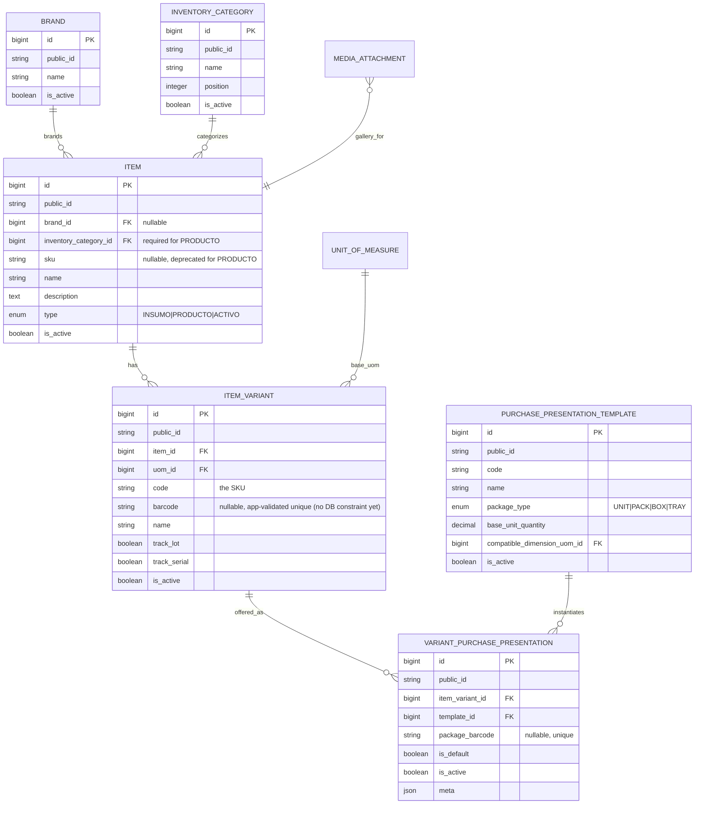
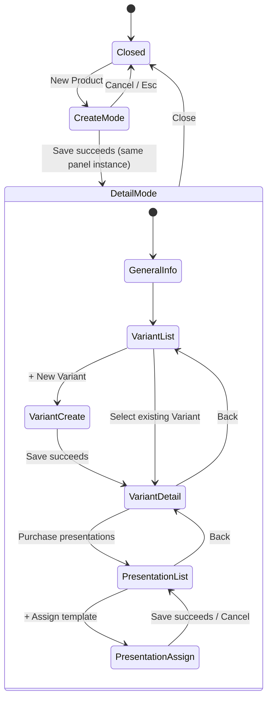

# 🍱 Product Inventory — Target Architecture & Migration Plan

**Scope**
Target design for the SushiGo Product inventory vertical: Product (`Item`, `type=PRODUCTO`) →
Variant → Purchase Presentation, the progressive SlidePanel UI, API contracts, invariants, public
identifiers, and the incremental migration/removal plan away from the current `ProductWizard`.
Produced by [issue #421](https://github.com/pakodiazdev/sushigo/issues/421) as a design-only
deliverable — no migrations, endpoints, production UI, seeders, or legacy deletion happen here.

This document is scoped to **Products only** (Milestone A of the roadmap below). Insumos need a
later workflow adapted to physical UOM conversions and recipe consumption; Fixed Assets remain a
separate, deferred domain. It complements, and does not replace,
[Inventory Architecture & Design](../inventory-architecture.en.md), which still owns
Branch/OperatingUnit/InventoryLocation/Stock/StockMovement. See that document's §3 (flat
Item/ItemVariant schema, including the cost/price/stock-threshold fields this design moves out) and
§5 (Hashids vs. `public_id`) for notes on where its own content is now superseded by this one.

---

## 1. Context

The current Product-creation path is a single four-step `ProductWizard`
(`code/webapp/src/components/inventory/product-wizard.tsx`) that mixes:

1. Item identity (`sku, name, description, type, is_stocked, is_perishable, is_active`, plus a
   dead `is_manufactured` field with no backing column — see §9.4).
2. Variant identity **and** commercial fields in one request (`code, name, uom_id, sale_price,
   min_stock, max_stock, is_active`).
3. A write directly to the **global** `uom_conversions` table, framed as if it were a
   product-specific packaging factor.
4. Opening balance per location, via a separate `/inventory/opening-balance` endpoint chained
   client-side.

Building the next increment of the wizard directly would bake these unresolved boundaries into new
code. This document finalizes the target shape first so the implementation backlog (`#422`–`#442`,
already filed) can build against a stable contract. `doc/conventions/tasks.md` documents the
`CAT-01`…`STK-06` planning-alias *convention* itself (lane glossary, format, a two-row illustrative
example); the actual full alias-to-issue mapping for this roadmap lives in the local, gitignored
`dev-lab plan/inventory-product-catalog-redesign.md` §11 — not committed to this repo, consistent
with that convention's own rule that aliases never appear as a second live copy inside a repo file.

---

## 2. Design Principles

| Principle | Description |
|---|---|
| **Identity vs. transaction** | Product/Variant capture *what something is*. Cost, price, and stock are *events* recorded elsewhere and never written back onto catalog rows as permanent fields. |
| **Explicit, reusable packaging** | Commercial packages (`Box x24`, `Pack x6`) are named, admin-managed templates assigned per Variant — never an ambiguous global `UOM_CONVERSION` row reused across unrelated products. |
| **Deactivate, don't delete** | Every new catalog table follows the existing `is_active` + `SoftDeletes` pattern already used by `Item`/`ItemVariant`. Rows referenced by history are deactivated, never hard-deleted. |
| **Incremental replacement** | Existing Item/ItemVariant CRUD, media integration, permissions, and test infrastructure are extended, not discarded. Legacy fields/routes/UI are removed only after their replacement has shipped (see §9). |
| **`items` stays the internal table** | `Item`/`ItemVariant` remain the internal Eloquent models during incremental replacement. "Product" is a UI/API vocabulary scoped to `type = PRODUCTO`, not a new table, to avoid forking the catalog mid-migration. |
| **Public IDs, one strategy** | Every new table exposes `public_id` (ULID) via the existing `HasPublicId` + `SerializesPublicIdAsId` traits — the same convention already used by `Dish`, `MediaGallery`, `CashAdjustment`, etc. — coordinated with, not duplicating, [#399](https://github.com/pakodiazdev/sushigo/issues/399). |

---

## 3. Domain Model

### 3.1 Entities

- **Brand** — optional catalog of manufacturer/commercial brands (`Coca-Cola`, `Buldak`). Normalized,
  soft-deletable, independent of Dish categories.
- **InventoryCategory** — required catalog of inventory taxonomy (`Beverages`, `Instant Noodles`).
  A **new**, separate taxonomy — not `DishCategory`, which belongs to the unrelated Menu/Dishes
  domain (`code/webapp/src/pages/productos.tsx`).
- **Item** (`type = PRODUCTO`) — the Product's catalog identity: name, brand, category, description,
  media, active state. No cost, price, opening stock, location, or UOM.
- **ItemVariant** — the concrete inventoried presentation (e.g. *Coca-Cola Original 600 ml*): SKU
  (`code`), unit barcode, base UOM, lot/serial tracking, active state. No cost, sale price, or stock
  thresholds.
- **PurchasePresentationTemplate** — a reusable, admin-managed commercial package definition
  (`Unit`, `Pack x6`, `Box x24`) with a package type and a base-unit quantity.
- **VariantPurchasePresentation** — the assignment of a template to a specific Variant, with an
  optional package barcode and a default flag.

Everything downstream of these six entities — acquisition cost, stock, and branch pricing — is
explicitly **out of scope** for the catalog write path; see §4.

### 3.2 Domain / ER Diagram



### 3.3 Cardinalities and lifecycle rules

| Relationship | Cardinality | Rule |
|---|---|---|
| Brand → Item | 1‑to‑many, optional | `Item.brand_id` nullable. Deactivating a Brand does not cascade; it only blocks new assignments (validated in the FormRequest, not a DB trigger). |
| InventoryCategory → Item | 1‑to‑many, required | `Item.inventory_category_id` NOT NULL for `type = PRODUCTO`. **As-built decision (#422, resolving this doc's own §3.3 asymmetry note):** unlike Brand, assigning an *inactive* category to a Product is allowed, not blocked — but the Product is not considered effectively active while its category is inactive (`ListProductsController`'s `is_active` filter excludes it from the active bucket regardless of the Product's own `is_active` flag), and `ProductResource` surfaces a `warnings` note explaining why. A category still cannot be deactivated *or deleted* while active Products reference it, regardless of whether the category is itself already inactive — enforced in the deactivate/delete endpoints, not a DB constraint (soft-delete already allows historical FK integrity); the blocked-response message names exactly how many active Products are blocking it. |
| Item → ItemVariant | 1‑to‑many | No DB-level minimum. Business rule (app layer, not schema): a Product needs at least one **active** Variant to be considered sellable/orderable by downstream domains (purchasing, pricing) — the catalog itself allows a Product with zero Variants mid-authoring. |
| ItemVariant → VariantPurchasePresentation | 1‑to‑many | A Variant may have zero presentations initially (falls back to "no packaging configured" in purchasing UIs, which is a valid state during CAT-04/CAT-05 rollout). |
| PurchasePresentationTemplate → VariantPurchasePresentation | 1‑to‑many, reusable | The same template (e.g. `BOX_24`) is assigned to many Variants across many Products. Templates used by any assignment (past or present) are deactivated, never deleted. |
| VariantPurchasePresentation.is_default | exactly one active default per Variant | Enforced with a partial unique index (`item_variant_id` where `is_default = true AND is_active = true`) plus a service-level check on write, mirroring the existing `Stock` unique-location-variant safe-creation pattern. |

### 3.4 SKU and barcode ownership

- **`ItemVariant.code`** is the authoritative SKU. It already exists, is unique today, and needs no
  rename — only clearer documentation (Swagger description, this doc) that it *is* the SKU. Unlike
  `barcode` below, `code` already has a real DB-level `unique()` constraint
  (`create_item_variants_table` migration), so data corruption isn't a risk — but the same
  create-only gap applies to its *validation*: `CreateItemVariantRequest` validates
  `unique:item_variants,code`, `UpdateItemVariantRequest` doesn't accept `code` at all today, and
  §6's PATCH endpoint (which accepts "same shape as create, partial") will need its own
  `unique:item_variants,code,{id}` rule once it does — without it, a duplicate `code` on PATCH would
  surface as a raw, unhandled DB constraint violation instead of a clean `422`. Same owner as the
  barcode gap below: `#424` (`CAT-03`). **As-built (`#424`):** `UpdateVariantRequest` now accepts
  `code` with `Rule::unique('item_variants', 'code')->ignore($variantId)`.
- **`Item.sku`** becomes nullable and deprecated for `type = PRODUCTO`. It is not read or written by
  the new Product create/edit contract. It is not dropped in this vertical — schema deletion is a
  Milestone C concern (`#442`, "Remove legacy Inventory fields...") once no consumer reads it.
- **`ItemVariant.barcode`** is the **unit** barcode (already exists, nullable). Today it is only
  validated as `unique:item_variants,barcode` on `CreateItemVariantRequest` — there is no
  database-level unique constraint, only a plain index (`add_barcode_to_item_variants_table`
  migration), and that create-path check is the *only* place uniqueness is enforced at all:
  `UpdateItemVariantRequest` doesn't accept `barcode` (or `code`/`uom_id`) as a field today, so under
  the **current** contract a Variant's barcode can only ever be set once, at creation — there's no
  live gap yet because there's no update path to race against. That changes with this design's own
  §6 API contract, which adds `barcode?` to the PATCH endpoint: once that ships, the create-only
  validation stops being sufficient, and both a DB-level unique constraint *and* an update-path
  `unique:item_variants,barcode,{id}` rule (excluding the row itself) are needed — flagged here for
  `#424` (`CAT-03`) to add both together, rather than shipping the new PATCH capability with only
  half of yesterday's protection. **As-built (`#424`):** both landed together —
  `add_unique_constraint_to_item_variants_barcode_table` migration adds the DB-level `unique()`, and
  `UpdateVariantRequest` validates `Rule::unique('item_variants', 'barcode')->ignore($variantId)`.
- **`VariantPurchasePresentation.package_barcode`** is a **separate** namespace from unit barcode —
  the barcode printed on a box/pack. Being a new table, it should get a real DB-level unique
  constraint from the start (unlike the legacy gap above). A package barcode and a unit barcode are
  allowed to coincide in principle only if they belong to different physical objects; the design does
  not need a cross-column uniqueness constraint because they are scanned in different operational
  contexts (receiving a case vs. selling a piece).

### 3.5 Brand / Category requirements and first Variant attributes

Resolved from the plan's own working assumptions (`plan/inventory-product-catalog-redesign.md` §17,
cited by this issue's `## 🔗 References`), validated against the current schema audit and finalized
here:

- **Brand is optional.** Not every product line has a distinct brand worth filtering by; forcing one
  would either invent placeholder brands or block catalog entry. Optional with a nullable FK keeps
  the filter usable without becoming a data-entry tax.
- **InventoryCategory is required.** Every Product needs a rubro for navigation/filtering and for
  future reporting; unlike Brand, there is no meaningful "uncategorized" bucket the UI should have to
  render around.
- **First-class Variant attributes** (beyond name/SKU/barcode/base UOM, which are already agreed):
  `description` (nullable text, free-form flavor/size/content note — e.g. "Original, 600 ml"),
  `track_lot`/`track_serial` (already exist, kept), `is_active`. A generic configurable-attribute
  engine (separate `flavor`, `size`, `content` columns or an EAV table) is explicitly **not** built
  in Milestone A — the current SushiGo catalog (Coca-Cola, Buldak, Peelez, Ramune, Mochis) is fully
  representable with a free-text `description` plus the Variant's own `name`, and a generic engine
  without real multi-attribute-filtering demand would be speculative scope. Revisit if a future
  catalog needs structured attribute filtering (e.g. "show me all 600 ml variants across brands").

---

## 4. Responsibility boundaries

The current wizard's core defect is collapsing five different responsibilities into one write.
The target design separates them explicitly:

| Responsibility | Owner | Where it lives | Milestone |
|---|---|---|---|
| Catalog identity | Product / Variant | `items`, `item_variants` (identity columns only) | A (this doc) |
| Commercial packaging | Purchase Presentation | `purchase_presentation_templates`, `variant_purchase_presentations` | A (`#426`/`#427`) |
| Physical UOM conversion | `UnitOfMeasure` / `UomConversion` | Existing global tables — reserved for genuine dimensional equivalences (`kg → g`), **not** product packaging | Unchanged; Insumos-only going forward |
| Acquisition cost | Purchase Receipt | Future `purchase_receipt_lines`, snapshotting the presentation factor at receipt time | B (`#431`/`#432`) |
| Stock balance | `Stock` / `StockMovement` | Existing tables, posted by receiving/sale/adjustment services | Unchanged (hardening in `#430`/`#438`) |
| Branch sale price | Price List | Future `price_lists` + variant price assignment, effective-dated per branch | B (`#435`/`#436`) |

`OpeningBalanceService` (`code/api/app/Services/Inventory/OpeningBalanceService.php`) already writes
`last_unit_cost`/`avg_unit_cost` transactionally today — confirming cost is *already* treated as a
transactional side effect in the service layer, even though `CreateItemVariantController` currently
also lets `sale_price` be set directly on create. The target contract removes that second path: cost
and price are never accepted by a Product/Variant create-or-update request, full stop.

---

## 5. Product SlidePanel UX flow

### 5.1 Navigation shape

```text
Products page (/inventory/products)
└── New Product  ─────────────────────────────┐
    │                                          │
    ▼                                          │
  SlidePanel: create mode                      │
    ├── Name, Brand (optional), Category*,     │
    │   Description, Images, Active            │
    └── [Save] ───────────────────────────────►┤
                                                 ▼
                                    SlidePanel: same instance,
                                    now in saved-detail mode
                                        ├── General information (edit-in-place)
                                        ├── Images (existing gallery pattern)
                                        └── Variant catalog
                                              ├── [+ New Variant] → nested slide
                                              │     Variant form: Name, SKU(code),
                                              │     Barcode, Base UOM, Description,
                                              │     track_lot/track_serial, Active
                                              │     [Save] → nested detail mode
                                              └── Variant card → nested slide
                                                    Variant detail
                                                      └── Purchase presentations
                                                            ├── [+ Assign template]
                                                            │     (existing Unit/Pack/Box
                                                            │     templates, admin can also
                                                            │     open template manager)
                                                            └── list: template name,
                                                                  package type, factor,
                                                                  package barcode, default,
                                                                  active
```

`*` Category is required at save time; the form allows leaving it unselected while drafting only if
the SlidePanel defers validation to submit (standard `react-hook-form` + `zod` behavior — no special
casing needed).

### 5.2 State diagram



This is a genuinely new interaction for this codebase: today's `SlidePanel`
(`code/webapp/src/components/ui/slide-panel.tsx`) is a generic single-panel primitive, and every
existing usage (e.g. Dishes) swaps between two separate panel instances (a details panel and a form
panel) rather than one panel transitioning its own content in place. `CAT-02` (`#423`) is the first
consumer of the create→detail transition; `CAT-04`/`CAT-06` (`#425`/`#427`) extend the same panel
instance with nested Variant/Presentation levels rather than opening new top-level panels, so the
user never loses the Product they were editing.

**As-built (`#423`):** the transition needed no new `SlidePanel` capability — a single instance
stays mounted (`isOpen` never toggles false across the flow) while a page-level
`'create' | 'detail' | 'edit'` mode state (`use-products-list.ts`) swaps its children; `SlidePanel`
itself is unchanged. "General information (edit-in-place)" is the same pattern one level in:
clicking Edit swaps the detail view for the same create/edit form component, in place, and Save
returns to the detail view — never a second top-level panel. Two scope boundaries, both deliberate:
photo upload is create-only (`ProductResource` has no gallery-asset GET to hydrate an edit form —
mirrors `ItemForm`/`DishForm`'s identical restriction), and the Variant section shows only a
count/empty-state message — the `View Variants` nested-slide navigation this section describes is
`#425`'s (`CAT-04`) own deliverable, not built here since there is no Variant-create endpoint yet
for it to lead to.

**As-built (`#425`):** the "nested slide" is the same content-swap pattern one level deeper, not a
second `SlidePanel` instance — `use-product-variants.ts` adds its own `'list' | 'create' | 'detail'
| 'edit'` mode state, and `products.tsx` swaps the whole panel body (and title) to `VariantForm`/
`VariantDetails` whenever that mode leaves `'list'`, exactly like the top-level panel already swaps
between `ProductForm`/`ProductDetails`. The Variant catalog itself (`ProductVariants`) stays inline
inside `ProductDetails`'s `'list'` state, as §5.1's tree shows it — no extra click needed to see it.
Purchase presentations are out of scope here, per `#425`'s own Technical Tasks/Acceptance Criteria —
`VariantDetails` renders no presentations section; that's `#427`'s (`CAT-06`) deliverable. Acceptance
Criterion "deactivate Variants without leaving Product detail" is satisfied through Edit's existing
Active checkbox, not a separate Delete action — matching this design's own "deactivate, don't
delete" principle (§2); `DeleteVariantController` exists on the backend (`#424`) but has no frontend
entry point from this issue on purpose.

**As-built (`#427`):** the `PresentationList`/`PresentationAssign` states are the same content-swap
pattern one level deeper still — `use-variant-purchase-presentations.ts` adds its own `'list' |
'assign' | 'edit'` mode state, and `products.tsx` swaps the whole panel body/title again whenever
that mode leaves `'list'`. Two deliberate deviations from this section's original sketch: there is
no separate `PresentationDetail` read state — a row click opens directly into `'edit'` (template
read-only, `package_barcode`/`is_default`/`is_active` editable), since the list already surfaces
every field this section calls for (template name, package type, factor, package barcode, default,
status); and the template manager ("admin can also open template manager") is a **standalone**
`SlidePanel` instance reachable from the Presentation list's "Manage templates" button, not a fourth
level nested inside this same panel — it manages a global, Product/Variant-independent resource, so
nesting it under one specific Product's panel would be a false hierarchy. Deactivate/reactivate reuse
the existing `is_active` PUT toggle (never the `DELETE` endpoint), matching `#425`'s own
Variant-level precedent above.

### 5.3 States to design for (per CAT-02/CAT-04/CAT-06 acceptance criteria)

Loading, empty (no Variants yet / no presentations yet), validation error (inline, per field),
submit error (toast + field errors via `getApiValidationErrors`), keyboard/focus (focus returns to
the triggering row on close, nested slides trap focus), responsive (mobile: full-screen slide), and
dark mode (existing `dark:` token conventions — no new Button/Label primitives invented ahead of
[[project_button_centralization]]/[[project_label_centralization]] if those land first).

---

## 6. API contract outline

All endpoints versioned under `/api/v1`, all use the existing `SingleActionController` (`__invoke`)
pattern. Route-model-binding via `HasPublicId` (`{item:public_id}` style) and
`SerializesPublicIdAsId` responses are an **existing convention elsewhere** in the codebase (`Dish`,
`MediaGallery`, `CashAdjustment`) — `Item`/`ItemVariant` don't have it yet, since `#399` ("Expose
public_id (ULID) for Item/ItemVariant...") is still open. This design's endpoints assume `#399`
lands as a prerequisite, not a parallel option: every path below (`{product}`, `{variant}`, etc.)
is written as a `public_id`, so `#422`/`#424` need `#399`'s migration and trait adoption in place
(or bundled into the same PR) before these routes can bind on anything but the internal numeric ID.
**As-built note (`#422`):** `#399` was still open and unreferenced by `#422`'s own Technical Tasks
when this vertical shipped, so `/inventory/products` binds on `Item`'s existing numeric `id` for now
— `Brand`/`InventoryCategory` do use `public_id` as designed, since `#422`'s own text calls for it
directly. Switch `/inventory/products` over once `#399` lands.
Permissions follow the existing granular `resource.action` convention rather than the coarser
per-domain style used by Dishes, to stay consistent with the current `items.*` mapping `#400`
already codifies.

| Method | Path | Request (create/update) | Permission | Notes |
|---|---|---|---|---|
| GET | `/inventory/products` | — (query: `search, brand_id, inventory_category_id, is_active, page`) | `items.view` | Filters to `type = PRODUCTO` server-side; returns variant count per row for the list. |
| POST | `/inventory/products` | `name, brand_id?, inventory_category_id, description?, media_gallery_id?, owner_token?, is_active?` | `items.create` | No `sku` accepted from this contract (kept nullable/legacy). No cost/price/stock fields. |
| GET | `/inventory/products/{product}` | — | `items.view` | Includes brand, category, media gallery, variant summary. |
| PUT | `/inventory/products/{product}` | Same shape as create, partial | `items.update` | **As-built (`#422`):** `PUT`, not `PATCH` as originally drafted here — matches the `PUT`-for-update convention already used by every other domain in the codebase (`Dish`, `Item`, `CashAdjustment`, etc.); `PATCH` doesn't appear anywhere else in the route tree outside a handful of narrow exceptions. |
| DELETE | `/inventory/products/{product}` | — | `items.delete` | Soft-delete / deactivate, existing pattern. |
| GET | `/inventory/products/{product}/variants` | — (query: `per_page`) | `items.view` | **As-built (`#424`):** no `search`/`is_active` filters — always scoped to the parent Product's own variants. |
| POST | `/inventory/products/{product}/variants` | `name, code, barcode?, uom_id, description?, track_lot?, track_serial?, is_active?` | `items.create` | `item_id` comes from the route, not the body — removes the global Item selector the plan doc flags. No `sale_price`/`min_stock`/`max_stock`/cost fields — this is the contract change from today's `CreateItemVariantRequest`. |
| GET | `/inventory/products/{product}/variants/{variant}` | — | `items.view` | |
| PUT | `/inventory/products/{product}/variants/{variant}` | Same shape as create, partial | `items.update` | **As-built (`#424`):** `PUT`, not `PATCH` as originally drafted here — same verb correction already made for `/inventory/products` (`#422`) and `/brands`/`/inventory-categories`; `PATCH` doesn't appear anywhere else in the route tree. |
| DELETE | `/inventory/products/{product}/variants/{variant}` | — | `items.delete` | Soft-delete, existing pattern — blocked (409) while the Variant has stock on hand, mirroring the legacy `/item-variants` endpoint's existing safety check. |
| GET | `/inventory/purchase-presentation-templates` | — (query: `is_active, package_type`) | `purchase_presentation_templates.view` | Global, not Product-scoped. |
| POST | `/inventory/purchase-presentation-templates` | `code, name, package_type, base_unit_quantity, compatible_dimension_uom_id, is_active?` | `purchase_presentation_templates.manage` | Admin-managed; deliberately a coarser single `manage` permission (create+update+deactivate) since this is low-frequency catalog governance, not daily product editing. |
| PUT / DELETE | `/inventory/purchase-presentation-templates/{template}` | Same shape as create, partial, plus `is_active?` | `purchase_presentation_templates.manage` | Deactivate, not delete, once referenced by any assignment. **As-built (`#426`):** `PUT`, not `PATCH` as originally drafted here — same verb correction already made for every other domain in this table (`/inventory/products`, `/inventory/products/{product}/variants`, `/brands`, `/inventory-categories`); `PATCH` doesn't appear anywhere else in the route tree. `package_type`, `base_unit_quantity` and `compatible_dimension_uom_id` are additionally rejected on update once the template has ever been assigned to a Variant (`PurchasePresentationTemplate::hasAnyAssignments()`, `withTrashed()` — past or present) — mirroring `UpdateVariantRequest`'s existing base-UOM-change guard, since a package's factor/shape is baked into every existing assignment's meaning. `DELETE` is blocked with the same `hasAnyAssignments()` check — a template with zero assignment history is soft-deleted (`SoftDeletes`, same "Deactivate, don't delete" pattern as the rest of this table), otherwise the caller must deactivate it (`PUT is_active=false`) instead. Never hard-deleted (`forceDelete()`) either way. |
| GET | `/inventory/products/{product}/variants/{variant}/purchase-presentations` | — | `items.view` | |
| POST | `/inventory/products/{product}/variants/{variant}/purchase-presentations` | `template_id, package_barcode?, is_default?` | `items.update` | Assignment is scoped to a Variant the user can already edit — no new permission needed here, unlike template governance above. **As-built (`#426`):** also rejects a `template_id` that is inactive, incompatible (`compatible_dimension_uom_id` != the Variant's `uom_id`), or already assigned to the same Variant — see §3.3 note below. |
| PUT / DELETE | `.../purchase-presentations/{assignment}` | `package_barcode?, is_default?, is_active?` | `items.update` | **As-built (`#426`):** `PUT`, not `PATCH`, same reasoning as the template row above. `template_id` is immutable on update — reassigning to a different template is a new assignment (delete + create), not an edit. `DELETE` is a plain soft-delete, unconditional — unlike the template row above, an assignment is never itself referenced by anything else, so there's no "blocked while referenced" case to guard here. |

**As-built (`#426`) — §3.3 addenda:**
- The one-active-default-per-Variant partial unique index and the unique-active-pair index both add `and deleted_at is null` on top of the rule as originally written here, so a soft-deleted former default/assignment doesn't block a new one — the same reasoning already applied to `brands_name_unique` in `create_brands_table`. Enforcement is a `VariantPurchasePresentationService` that locks the Variant's existing presentation rows (mirroring `StockMutationService::lockAndGet()`) and clears the previous default inside the same transaction before writing the new one; the partial index remains the DB-level backstop for a genuine race.
- `VariantPurchasePresentation.package_barcode` ended up with a plain DB-level `unique()` (allowing multiple `NULL`s, like `ItemVariant.barcode`) rather than a partial index — package barcodes aren't expected to be reused the way a deactivated template's `code` or a deleted Brand's `name` are.
- Routes nest `purchase-presentations` under the existing numeric `{id}`/`{variantId}` Product/Variant path (unchanged, since `#399` still hasn't landed — see the note at the top of this section), but the assignment resource itself is addressed by its own `public_id` (`{presentationId}`), consistent with Design Principle "Public IDs, one strategy" — a compromise between the parent chain's current numeric convention and every new table getting a `public_id`.
| GET | `/brands` | — | `brands.view` | **As-built (`#422`):** top-level, not `/inventory/brands` as originally drafted here — Brand is a standalone catalog, not nested under the Product/Item `inventory/` namespace like `/inventory/products` is. |
| POST / PUT / DELETE | `/brands[/{brand}]` | `name, is_active?` | `brands.create` / `brands.update` / `brands.delete` | **As-built (`#422`):** `PUT`, not `PATCH` — same verb correction as `/inventory/products` above. |
| GET | `/inventory-categories` | — | `inventory_categories.view` | **As-built (`#422`):** same top-level rationale as `/brands` above. |
| POST / PUT / DELETE | `/inventory-categories[/{category}]` | `name, position?, is_active?` | `inventory_categories.create` / `.update` / `.delete` | Distinct from `dish_categories.*` — see §3.1. **As-built (`#422`):** `PUT`, not `PATCH` — same verb correction as `/inventory/products` above. |

**New permissions to register** (Development/Production `PermissionSeeder`, per `#422`/`#426`):
`brands.view/create/update/delete`, `inventory_categories.view/create/update/delete`,
`purchase_presentation_templates.view/manage`. No new permission is needed for the assignment
endpoints (reuse `items.*`) — see the table above for why.

**Route naming decision:** `/inventory/products` is a **new** frontend route and API path prefix,
distinct from both `/inventory/items` (today's generic Item list across all three `type` values,
retained until `#429` removes the wizard entry point that depends on it) and `/productos` (the
unrelated Dish/Menu catalog — see `code/webapp/src/pages/productos.tsx`). This was a genuine naming
gap the plan doc didn't resolve explicitly; decided here to avoid the collision the audit surfaced.

---

## 7. Migration, compatibility, and legacy-removal sequencing

This is sequencing guidance for the already-filed backlog (`#422`–`#442`); it does not change any
issue's scope, only clarifies two points the audit surfaced (§9.3, §9.4) and confirms the dependency
order already reflects this design.

1. **`#422`** (`CAT-01`) — Add `brands`, `inventory_categories` tables and columns on `items`
   (`brand_id` nullable FK, `inventory_category_id` FK). Additive only; no existing column removed.
   Item `sku` becomes nullable if it isn't already (it is currently `NOT NULL unique` — this is a
   real schema change to sequence carefully: existing rows keep their `sku`, new Product writes stop
   populating it). **As-built exception, not additive:** the one deliberately destructive step in
   this issue is a follow-up migration that deletes any pre-existing `Item(type=PRODUCTO)` row that
   still has a null `inventory_category_id` and no variants — confirmed safe because no seeder in
   this codebase ever creates a `PRODUCTO` row (§9.5) and this repo carries no production data (see
   PR #467's Needs Human Judgment). Rows with variants are left untouched.
2. **`#423`** (`CAT-02`) — New `/inventory/products` SlidePanel UI, additive, does not touch
   `/inventory/items`.
3. **`#424`** (`CAT-03`) — `ItemVariant` write contract stops accepting `sale_price, min_stock,
   max_stock` from the Product/Variant path. **Compatibility:** keep the columns in the database
   (existing rows, existing read paths in stock/reporting keep working); only the *write* surface
   used by the new UI changes. The legacy `item-variants` global page and old `variant-form.tsx`
   keep working against the old contract until `#429` removes them. **As-built (`#424`):** delivered
   as a net-new, additive `inventory/products/{id}/variants` route group (see §6) — the legacy
   `/item-variants` flat endpoints, their controllers, requests, and tests are untouched by this
   issue, exactly as this compatibility note anticipated.
4. **`#425`/`#426`/`#427`** (`CAT-04`/`CAT-05`/`CAT-06`) — Additive: new tables
   (`purchase_presentation_templates`, `variant_purchase_presentations`), new nested UI. No
   compatibility concern — nothing existing depends on these tables.
5. **`#428`** (`CAT-07`) — Seed data. No schema change.
6. **`#429`** (`CAT-08`) — First real deletion point: `ProductWizard` and its tests/exports/query
   params, old opening-balance-in-product-creation flow, and (per §9.4 below) the dead
   `is_manufactured` frontend field and its empty no-op migration. Only runs after `#423`–`#428` have
   shipped and been verified to cover the wizard's functionality. The global Variant page
   (`/inventory/item-variants`) is removed here only if, at that point, no independent workflow still
   needs it — the plan doc already frames this as a conditional check, not a guaranteed deletion.
7. **`#438`/`#439`/`#440`/`#441`** and Milestone B (`#431`–`#437`) proceed per the existing dependency
   map in `plan/inventory-product-catalog-redesign.md` §15 — unchanged by this document.
8. **`#442`** (`STK-06`, Milestone C) — Final legacy-field removal: drop `Item.sku` and the
   now-unused `ItemVariant.last_unit_cost/avg_unit_cost/sale_price/min_stock/max_stock` columns (once
   `#434`'s single cost source of truth and `#439`'s per-location thresholds have both landed), and
   reconcile this document and `inventory-architecture.en.md`/`.es.md` with the as-built system.

**Rollback:** every migration in steps 1 and 4 is additive (new nullable columns / new tables) — a
rollback is a plain `migrate:rollback` with no data-loss risk before step 8. Step 8 is the only
destructive migration in the whole sequence and is explicitly gated behind two independent
prerequisite issues landing first, plus a reconciliation pass — not a same-PR deletion.

---

## 8. Decisions and open items

### 8.1 Decided in this document

- Brand optional, InventoryCategory required (§3.5).
- First-class Variant attributes limited to `description` beyond the already-agreed
  name/SKU/barcode/base UOM/lot-serial/active — no generic attribute engine in Milestone A (§3.5).
- `/inventory/products` is a new route/path prefix, distinct from `/inventory/items` and `/productos`
  (§6).
- Purchase-presentation **template** management uses a coarser `purchase_presentation_templates.manage`
  permission; **assignment** to a Variant reuses `items.update` rather than a new permission (§6).
- Branch is the primary price-list attachment target; Operating Unit overrides (e.g. for temporary
  events) are an explicit extension point for `#435`, not built in Milestone A — consistent with
  `#435`'s own title ("branch or operating context").
- Location+Variant replenishment thresholds (`#439`, `STK-03`) do not inherit a default from
  Operating Unit level in the first slice — every Location+Variant pair is configured explicitly.
  **Why:** the plan doc frames inheritance as conditional ("if justified") with no operational
  evidence yet that branches share identical thresholds; the conservative reading is no inheritance
  until real multi-location usage shows repetitive configuration is a real friction point.

### 8.2 Explicit blocker — owner assigned, not resolvable from code or docs

- **Exact commercial names/spellings for Buldak and Peelez product lines** (and their flavors/sizes)
  are real-world catalog facts, not something derivable from the repository. **Blocker owner:**
  `#428` (`CAT-07` — seed data) must confirm exact names before writing seeders; this does not block
  any other issue in Milestone A, since `#422`–`#427` build the contract and UI generically.
  **As-built (`#428`):** resolved via web research (no way to ask a human in this issue's unattended
  delivery flow) — Buldak is Samyang's "Buldak Bokkeummyun" hot-chicken-flavor instant ramen line
  (flavors seeded: Original, 2x Spicy, Carbonara, Cheese; 140g individual packs); "Peelez" is the
  peelable-gummy fruit-candy line more commonly spelled "Peelerz" (Amos Peelerz) — seeded under the
  issue's own spelling per its literal text, flavors Mango/Piña/Sandía plus a "Variedad Tropical"
  multi-flavor box, 85g bags. Ramune seeded as Original/Fresa/Melón, 200ml Codd-neck bottles (the
  standard retail size). Mochi seeded as a private-label "Mochis" brand (no single dominant global
  brand exists for this category) — Mango/Fresa/Matcha flavors, 6pz boxes. See
  `config/seeders.php` → `development_products` for the full seeded catalog.

### 8.3 Explicitly deferred, not a blocker

- A per-Variant **custom** purchase presentation that doesn't match any reusable template — the plan
  doc's own §5 already excludes this from `#426`, framing reusable templates as the only Milestone A
  mechanism. No new decision needed here; revisit only if a real product needs an un-reusable
  one-off package.
- **The legacy `POST /items` endpoint still accepts `type=PRODUCTO` with no `inventory_category_id`**
  (`CreateItemRequest` was never updated to require or even accept the field), and `product-wizard.tsx`
  — the only currently-working Product creation UI — defaults to that type and still calls this
  endpoint. `#422`'s new `/inventory/products` list already treats a Product with no category the
  same as one with an inactive category (excluded from `is_active=1`, flagged with a `warnings` note),
  so an ongoing legacy write can no longer masquerade as a fully active Product — but the write path
  itself is deliberately left open. Closing it now (reject `PRODUCTO` on `/items`, or require a
  category there) would break the only live Product creation flow before its replacement ships.
  **Owner: `#423`** (the progressive Product SlidePanel) — either that issue or `#429` (legacy wizard
  removal) must close this gap once the wizard is no longer the only way to create a Product.
  **As-built (`#423`):** left open here, per this document's own §7 point 2 ("`#423` ... does not
  touch `/inventory/items`") — `#423` adds `/inventory/products` as a new, additive UI without
  changing the legacy `/items` write path or removing `product-wizard.tsx`, so the wizard is still a
  second live Product-creation route (not yet the *only* one being removed) until `#429` retires it.
  Closing this gap remains `#429`'s job.

---

## 9. Current design assessment (audit findings feeding this design)

### 9.1 Backend

`items`/`item_variants` already separate soft-deletable, `is_active`-flagged rows — the pattern this
design extends rather than replaces. `CreateItemRequest` is already narrow (no cost/price); the gap
is on the Variant write path on **both** sides — `CreateItemVariantRequest` **and**
`UpdateItemVariantRequest` each independently accept `sale_price, min_stock, max_stock` directly
today, so `#424` must remove the fields from both FormRequests, not just the create path.
`ItemPolicy`/`ItemVariantPolicy` currently authorize unconditionally (`#400`, in progress in
workspace `sushigo-a` at the time of this audit) — this design's FormRequests must call `$this->user()
->can(...)` against the real policy once `#400` lands, per `#424`'s existing dependency note; `#421`
itself needs no code change since it is read-only.

### 9.2 Frontend

No existing component implements the create→same-panel-detail transition (§5.2) — every current
`SlidePanel` usage swaps two separate panel instances instead. `/productos` is the Dish/Menu catalog,
not Products — a naming trap this design avoids by picking `/inventory/products` (§6).

### 9.3 UOM conversions

`App\Services\Inventory\Concerns\ConvertsUomQuantities` resolves a global `UomConversion` by UOM pair
with no scoping to a specific Item/Variant — exactly the ambiguity §5 of the plan doc (and §4 above)
replaces with Variant-scoped `VariantPurchasePresentation` for commercial packaging. The global table
remains valid for genuine physical dimensional equivalences on Insumos.

### 9.4 Pre-existing dead code (flagged for `#429`, not fixed here)

`2025_11_12_092126_add_is_manufactured_to_items_table.php` is an empty no-op migration (both `up()`
and `down()` bodies are blank) — `is_manufactured` was never actually added to the `items` table.
The dead field reaches further than just the frontend wizard:

- **Frontend component:** `product-wizard.tsx` reads/writes an `is_manufactured` field with no
  backing column.
- **Frontend shared type:** `types/inventory.ts` declares `is_manufactured: boolean` on the shared
  Item type every inventory component imports — the dead field is part of the type contract, not
  just one component's local state.
- **Frontend tests:** `product-wizard.test.tsx`, `item-form.test.tsx`, `item-details.test.tsx`,
  `variant-details.test.tsx`, and `types/__tests__/inventory.test.ts` all assert on
  `is_manufactured` — any cleanup has to update five test files, not just the component and the
  type.
- **Backend, read path:** `ShowItemController.php` unconditionally includes
  `'is_manufactured' => $item->is_manufactured` in every Product show response — since the column
  doesn't exist, Eloquent's magic `__get` returns `null` for the undefined attribute, so every
  caller of this endpoint receives a permanently-`null`, meaningless field.
- **Backend, filter path:** `ListItemsController.php`'s Swagger annotation documents an
  `is_manufactured` query filter, but no filtering logic for it exists anywhere in
  `Concerns/FiltersItemListing.php` — the documented parameter is a silent no-op that misleads API
  consumers (and Swagger UI users) into thinking it filters results.

This is a pre-existing defect, unrelated to and not fixed by this design-only issue — noted here
with its full surface area so `#429` (wizard removal) can clean up all nine locations together
(one component, one shared type, five tests, two backend controllers) instead of discovering them
one at a time, since most are outside the wizard component itself and easy to miss.

### 9.5 Seeders

No seeder currently creates `Item`/`ItemVariant` rows. `doc/conventions/testing/test-data-seeders.md`
already reserves `InventoryTestSeeder.php` as a documented "future" slot in its Testing tier — `#428`
fills an already-anticipated gap, not a new convention.

**As-built (`#428`):** filled across all three tiers — `Development/BrandSeeder`,
`InventoryCategorySeeder`, `PurchasePresentationTemplateSeeder` and `ProductCatalogSeeder` (believable
catalog, registered in `DevelopmentSeeder`); `Testing/ProductCatalogTestSeeder` (minimal deterministic
fixtures, registered as the `products` group in `TestReset`, named `ProductCatalogTestSeeder` rather
than the doc's placeholder `InventoryTestSeeder` name since it seeds the catalog specifically, not
stock/location data); `Fakes/FakeProductCatalogSeeder` (volume generation for pagination, `fakes-products`
group). No cost, supplier, purchase, stock or branch price fields are populated by any tier.

---

## 10. Dependency and delivery map

Unchanged from `plan/inventory-product-catalog-redesign.md` §15, reproduced here with the actual
GitHub issue numbers now that all 21 downstream issues are filed and confirmed to match:

```text
#421 (design, this doc) + #400 (authorization)
  └── #422 ──→ #423 ────────────────────────────┐
       │        │                                │
       └── #424 ┴──→ #425 ──┐                   │
              │              │                   │
              └── #426 ──→ #427 ──→ #429 ──→ Usable Product Catalog
                    │                │
                    └── #428 ────────┘

#430 + #426/#427
  └── #431 ──→ #432 ──→ #433
                  └──────→ #434

#424 ──→ #435 ──→ #436
#431..436 ─────────→ #437 ──→ Operational Product

#430 ──→ #438
#424 ──→ #439
#400 + stable APIs ──→ #440
#429 + OPS + #438/#439 ──→ #441 ──→ #442
```

No issue's scope, estimate, or dependency changes as a result of this audit — the two clarifications
in §7 (Item `sku` nullability sequencing, `#429`'s `is_manufactured` cleanup) are implementation
detail within already-filed issues, not a re-scope. Acceptance Criterion "the implementation backlog
and dependency order reflect the approved design" is satisfied by this confirmation rather than by
any issue edit.

---

## 11. Related decisions

See [TD-03](../../decisions/td-03-product-catalog-separation.md) for the accepted architectural
decision this design is built on (why catalog identity, packaging, cost, and price are four separate
write surfaces instead of one wizard).

---

## 12. References

- [Inventory Architecture & Design](../inventory-architecture.en.md)
- `dev-lab plan/inventory-product-catalog-redesign.md` — local discovery summary this design
  formalizes (not a repo-relative link: this file lives in the `sushigo-dev-lab` orchestration repo,
  outside the `sushigo` monorepo, and is gitignored there — see this issue's own `## 🔗 References`)
- [#400 — Inventory policies authorize unconditionally](https://github.com/pakodiazdev/sushigo/issues/400)
- [#399 — Expose public_id (ULID) for Item/ItemVariant](https://github.com/pakodiazdev/sushigo/issues/399)
- `doc/conventions/testing/test-data-seeders.md`
- `doc/conventions/backend/media-uploads.md`

---

**Authorship**
SushiGo / ComandaFlow Team · 2026-08-12
