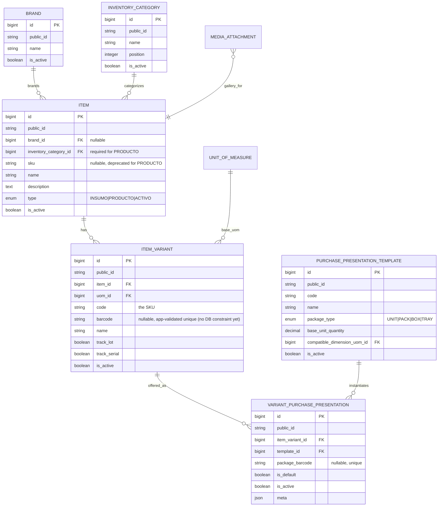
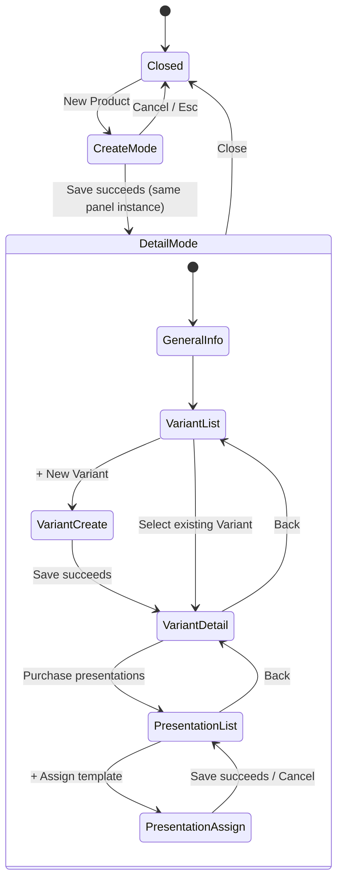

# 🍱 Inventario de Producto — Arquitectura Objetivo y Plan de Migración

**Alcance**
Diseño objetivo para la vertical de Inventario de Producto de SushiGo: Producto (`Item`,
`type=PRODUCTO`) → Variante → Presentación de Compra, la UI progresiva en SlidePanel, los contratos
de API, los invariantes, los identificadores públicos y el plan incremental de migración/retiro del
`ProductWizard` actual. Producido por el
[issue #421](https://github.com/pakodiazdev/sushigo/issues/421) como entregable de solo diseño — en
este issue no se implementan migraciones, endpoints, UI de producción, seeders ni borrado de código
legado.

Este documento se limita a **Productos únicamente** (Hito A de la hoja de ruta abajo). Los Insumos
requieren un flujo posterior adaptado a conversiones físicas de UOM y consumo de recetas; Activos
Fijos permanece como un dominio separado y diferido. Complementa, y no reemplaza, a
[Arquitectura de Inventario](../inventory-architecture.es.md), que sigue siendo dueño de
Branch/OperatingUnit/InventoryLocation/Stock/StockMovement. Ver la §3 de ese documento (esquema
plano de Item/ItemVariant, incluyendo los campos de costo/precio/umbral de stock que este diseño
retira) y la §5 (Hashids vs. `public_id`) para notas sobre qué contenido queda ahora superado por
este.

---

## 1. Contexto

El flujo actual de creación de Producto es un `ProductWizard` de cuatro pasos
(`code/webapp/src/components/inventory/product-wizard.tsx`) que mezcla:

1. Identidad del Item (`sku, name, description, type, is_stocked, is_perishable, is_active`, más un
   campo `is_manufactured` muerto sin columna respaldándolo — ver §9.4).
2. Identidad de Variante **y** campos comerciales en una sola petición (`code, name, uom_id,
   sale_price, min_stock, max_stock, is_active`).
3. Una escritura directa a la tabla **global** `uom_conversions`, presentada como si fuera un factor
   de empaque específico del producto.
4. Saldo inicial por ubicación, vía un endpoint separado `/inventory/opening-balance` encadenado del
   lado del cliente.

Construir el siguiente incremento del wizard directamente arrastraría estos límites sin resolver
hacia código nuevo. Este documento finaliza primero la forma objetivo para que el backlog de
implementación (`#422`–`#442`, ya creados) pueda construirse sobre un contrato estable.
`doc/conventions/tasks.md` documenta la *convención* de alias de planeación `CAT-01`…`STK-06` en sí
(glosario de carriles, formato, un ejemplo ilustrativo de dos filas); el mapeo completo real de
alias a issue para este roadmap vive en el `dev-lab plan/inventory-product-catalog-redesign.md` §11
local, con `.gitignore` — no está commiteado a este repo, consistente con la propia regla de esa
convención de que los alias nunca aparecen como una segunda copia viva dentro de un archivo del
repo.

---

## 2. Principios de diseño

| Principio | Descripción |
|---|---|
| **Identidad vs. transacción** | Producto/Variante capturan *qué es algo*. Costo, precio y stock son *eventos* registrados en otro lugar y nunca se escriben de vuelta como campos permanentes del catálogo. |
| **Empaque explícito y reutilizable** | Los paquetes comerciales (`Box x24`, `Pack x6`) son plantillas nombradas, administradas por el admin, asignadas por Variante — nunca una fila ambigua de `UOM_CONVERSION` global reutilizada entre productos no relacionados. |
| **Desactivar, no borrar** | Cada tabla nueva de catálogo sigue el patrón `is_active` + `SoftDeletes` ya usado por `Item`/`ItemVariant`. Las filas referenciadas por historial se desactivan, nunca se borran físicamente. |
| **Reemplazo incremental** | El CRUD existente de Item/ItemVariant, la integración de media, los permisos y la infraestructura de pruebas se extienden, no se descartan. Los campos/rutas/UI legados se retiran solo después de que su reemplazo haya salido (ver §9). |
| **`items` sigue siendo la tabla interna** | `Item`/`ItemVariant` siguen siendo los modelos Eloquent internos durante el reemplazo incremental. "Producto" es un vocabulario de UI/API acotado a `type = PRODUCTO`, no una tabla nueva, para evitar bifurcar el catálogo a mitad de la migración. |
| **IDs públicos, una sola estrategia** | Cada tabla nueva expone `public_id` (ULID) vía los traits existentes `HasPublicId` + `SerializesPublicIdAsId` — la misma convención ya usada por `Dish`, `MediaGallery`, `CashAdjustment`, etc. — coordinada con, no duplicando, [#399](https://github.com/pakodiazdev/sushigo/issues/399). |

---

## 3. Modelo de dominio

### 3.1 Entidades

- **Brand** — catálogo opcional de marcas comerciales/fabricante (`Coca-Cola`, `Buldak`).
  Normalizado, con soft-delete, independiente de las categorías de Dish.
- **InventoryCategory** — catálogo requerido de taxonomía de inventario (`Bebidas`, `Fideos
  Instantáneos`). Una taxonomía **nueva** y separada — no `DishCategory`, que pertenece al dominio
  no relacionado de Menú/Platillos (`code/webapp/src/pages/productos.tsx`).
- **Item** (`type = PRODUCTO`) — la identidad de catálogo del Producto: nombre, marca, categoría,
  descripción, media, estado activo. Sin costo, precio, saldo inicial, ubicación ni UOM.
- **ItemVariant** — la presentación concreta inventariada (ej. *Coca-Cola Original 600 ml*): SKU
  (`code`), código de barras unitario, UOM base, seguimiento de lote/serie, estado activo. Sin costo,
  precio de venta ni umbrales de stock.
- **PurchasePresentationTemplate** — definición reutilizable de empaque comercial, administrada por
  el admin (`Unit`, `Pack x6`, `Box x24`) con un tipo de paquete y una cantidad en unidad base.
- **VariantPurchasePresentation** — la asignación de una plantilla a una Variante específica, con
  código de barras de paquete opcional y bandera de default.

Todo lo posterior a estas seis entidades — costo de adquisición, stock y precio por sucursal — queda
explícitamente **fuera de alcance** de la ruta de escritura del catálogo; ver §4.

### 3.2 Diagrama de dominio / ER



### 3.3 Cardinalidades y reglas de ciclo de vida

| Relación | Cardinalidad | Regla |
|---|---|---|
| Brand → Item | 1‑a‑muchos, opcional | `Item.brand_id` nullable. Desactivar una Brand no cascada; solo bloquea nuevas asignaciones (validado en el FormRequest, no un trigger de BD). |
| InventoryCategory → Item | 1‑a‑muchos, requerido | `Item.inventory_category_id` NOT NULL para `type = PRODUCTO`. Una categoría no puede desactivarse mientras Productos activos la referencien — se aplica en el endpoint de desactivación, no como constraint de BD (el soft-delete ya preserva la integridad histórica del FK). |
| Item → ItemVariant | 1‑a‑muchos | Sin mínimo a nivel BD. Regla de negocio (capa de aplicación, no esquema): un Producto necesita al menos una Variante **activa** para considerarse vendible/pedible por dominios posteriores (compras, precios) — el catálogo permite un Producto con cero Variantes mientras se está creando. |
| ItemVariant → VariantPurchasePresentation | 1‑a‑muchos | Una Variante puede tener cero presentaciones inicialmente (recae en "sin empaque configurado" en las UIs de compras, un estado válido durante el despliegue de CAT-04/CAT-05). |
| PurchasePresentationTemplate → VariantPurchasePresentation | 1‑a‑muchos, reutilizable | La misma plantilla (ej. `BOX_24`) se asigna a muchas Variantes en muchos Productos. Las plantillas usadas por cualquier asignación (pasada o presente) se desactivan, nunca se borran. |
| VariantPurchasePresentation.is_default | exactamente un default activo por Variante | Se aplica con un índice único parcial (`item_variant_id` donde `is_default = true AND is_active = true`) más una validación a nivel de servicio en la escritura, siguiendo el mismo patrón de creación segura de primera fila que usa `Stock` con su constraint único de Location+Variant. |

### 3.4 Propiedad de SKU y código de barras

- **`ItemVariant.code`** es el SKU autoritativo. Ya existe, ya es único hoy, y no necesita
  renombrarse — solo documentación más clara (descripción en Swagger, este documento) de que *es* el
  SKU. A diferencia de `barcode` abajo, `code` ya tiene una constraint real de unicidad a nivel de
  BD (migración `create_item_variants_table`), así que la corrupción de datos no es un riesgo — pero
  el mismo vacío de solo-creación aplica a su *validación*: `CreateItemVariantRequest` valida
  `unique:item_variants,code`, `UpdateItemVariantRequest` no acepta `code` en absoluto hoy, y el
  endpoint PATCH de la §6 (que acepta "la misma forma que crear, parcial") necesitará su propia
  regla `unique:item_variants,code,{id}` una vez que lo haga — sin ella, un `code` duplicado en PATCH
  se manifestaría como una violación de constraint de BD sin manejar, en vez de un `422` limpio.
  Mismo dueño que el vacío de barcode abajo: `#424` (`CAT-03`).
- **`Item.sku`** es nullable y está deprecado para `type = PRODUCTO` — el nuevo contrato de
  creación/edición de Producto no lo lee ni lo escribe (los seeders lo dejan null para Productos;
  `ProductCrudTest` / `ProductCatalogSeederTest` lo verifican). **Tal como quedó (`#442`):** la
  columna se **conserva**, no se elimina. Sigue siendo el SKU autoritativo para los Items
  `INSUMO`/`ACTIVO`, cuya CRUD legada `/items` sigue siendo su única superficie de gestión y sobre
  la que `#500` construye activamente (sugerencia contextual de SKU vía `/items/next-sku`). `#442`
  solo reconcilió la documentación y eliminó las columnas de costo/precio por Variante en desuso
  (abajo); eliminar `Item.sku` queda descartado hasta que el catálogo de Insumos tenga su propio
  contrato de identidad rediseñado.
- **`ItemVariant.barcode`** es el código de barras **unitario** (ya existe, nullable). Hoy solo se
  valida como `unique:item_variants,barcode` en `CreateItemVariantRequest` — no existe una
  constraint de unicidad a nivel de base de datos, solo un índice simple (migración
  `add_barcode_to_item_variants_table`), y esa validación en creación es el **único** lugar donde se
  aplica unicidad: `UpdateItemVariantRequest` no acepta `barcode` (ni `code`/`uom_id`) como campo
  hoy, así que bajo el contrato **actual** el código de barras de una Variante solo puede
  establecerse una vez, al crearla — no hay un vacío activo todavía porque no hay una ruta de
  edición contra la cual competir. Eso cambia con el contrato de API de la propia §6 de este
  documento, que agrega `barcode?` al endpoint PATCH: una vez que eso salga, la validación
  solo-en-creación deja de ser suficiente, y se necesitan tanto una constraint de unicidad a nivel
  de BD **como** una regla `unique:item_variants,barcode,{id}` en la ruta de edición (excluyendo la
  propia fila) — señalado aquí para que `#424` (`CAT-03`) agregue ambas juntas, en vez de lanzar la
  nueva capacidad de PATCH con solo la mitad de la protección de ayer.
- **`VariantPurchasePresentation.package_barcode`** es un namespace **separado** del código de barras
  unitario — el código impreso en una caja/paquete. Al ser una tabla nueva, debería tener una
  constraint de unicidad real a nivel de BD desde el inicio (a diferencia del vacío heredado arriba).
  Un código de paquete y uno unitario pueden coincidir en principio solo si pertenecen a objetos
  físicos distintos; el diseño no necesita una constraint de unicidad cruzada entre columnas porque
  se escanean en contextos operativos distintos (recibir una caja vs. vender una pieza).

### 3.5 Requisitos de Brand/Category y primeros atributos de Variante

Resuelto a partir de las hipótesis de trabajo del propio plan
(`plan/inventory-product-catalog-redesign.md` §17, citado en la `## 🔗 References` de este issue),
validado contra la auditoría del esquema actual y finalizado aquí:

- **Brand es opcional.** No todas las líneas de producto tienen una marca distintiva por la cual
  filtrar; hacerla obligatoria implicaría inventar marcas placeholder o bloquear el alta de catálogo.
  Opcional con FK nullable mantiene el filtro utilizable sin volverse un impuesto de captura de
  datos.
- **InventoryCategory es requerida.** Todo Producto necesita un rubro para navegación/filtrado y
  para reportes futuros; a diferencia de Brand, no existe un "sin categorizar" significativo sobre
  el cual la UI deba renderizar.
- **Primeros atributos de clase de Variante** (más allá de nombre/SKU/código de
  barras/UOM base, ya acordados): `description` (texto libre nullable, nota de
  sabor/tamaño/contenido — ej. "Original, 600 ml"), `track_lot`/`track_serial` (ya existen, se
  conservan), `is_active`. Un motor de atributos configurables genérico (columnas separadas
  `flavor`, `size`, `content` o una tabla EAV) explícitamente **no** se construye en el Hito A — el
  catálogo actual de SushiGo (Coca-Cola, Buldak, Peelez, Ramune, Mochis) es totalmente representable
  con un `description` de texto libre más el `name` propio de la Variante, y un motor genérico sin
  demanda real de filtrado multi-atributo sería alcance especulativo. Revisar si un catálogo futuro
  necesita filtrado de atributos estructurado (ej. "mostrar todas las variantes de 600 ml en todas
  las marcas").

---

## 4. Límites de responsabilidad

El defecto central del wizard actual es colapsar cinco responsabilidades distintas en una sola
escritura. El diseño objetivo las separa explícitamente:

| Responsabilidad | Dueño | Dónde vive | Hito |
|---|---|---|---|
| Identidad de catálogo | Producto / Variante | `items`, `item_variants` (solo columnas de identidad) | A (este documento) |
| Empaque comercial | Presentación de Compra | `purchase_presentation_templates`, `variant_purchase_presentations` | A (`#426`/`#427`) |
| Conversión física de UOM | `UnitOfMeasure` / `UomConversion` | Tablas globales existentes — reservadas para equivalencias dimensionales genuinas (`kg → g`), **no** empaque de producto | Sin cambios; solo Insumos en adelante |
| Costo de adquisición | Recibo de Compra | Futuras `purchase_receipt_lines`, tomando snapshot del factor de presentación al recibir | B (`#431`/`#432`) |
| Saldo de stock | `Stock` / `StockMovement` | Tablas existentes, actualizadas por servicios de recepción/venta/ajuste | Sin cambios (hardening en `#430`/`#438`) |
| Precio de venta por sucursal | Lista de Precios | Futuras `price_lists` + asignación de precio por variante, vigente por rango de fechas por sucursal | B (`#435`/`#436`) |

`OpeningBalanceService` (`code/api/app/Services/Inventory/OpeningBalanceService.php`) trata el costo
de adquisición como efecto secundario transaccional en la capa de servicio, mezclándolo en
`Stock.weighted_avg_cost` por Ubicación de Inventario (`#434`). **Tal como quedó:** costo y precio
nunca son aceptados por una petición de creación/edición de Producto/Variante, y las columnas por
Variante `last_unit_cost` / `avg_unit_cost` / `sale_price` que esas vías solían tocar se eliminaron
por completo en `#442` — `Stock.weighted_avg_cost` y las listas de precios vigentes por fecha
(`#435`) son las únicas fuentes de verdad.

---

## 5. Flujo de UX del SlidePanel de Producto

### 5.1 Forma de navegación

```text
Página de Productos (/inventory/products)
└── Nuevo Producto  ───────────────────────────┐
    │                                          │
    ▼                                          │
  SlidePanel: modo creación                    │
    ├── Nombre, Marca (opcional), Categoría*,  │
    │   Descripción, Imágenes, Activo          │
    └── [Guardar] ─────────────────────────────►┤
                                                 ▼
                                    SlidePanel: misma instancia,
                                    ahora en modo detalle guardado
                                        ├── Información general (edición in-place)
                                        ├── Imágenes (patrón de galería existente)
                                        └── Catálogo de Variantes
                                              ├── [+ Nueva Variante] → slide anidado
                                              │     Formulario de Variante: Nombre, SKU(code),
                                              │     Código de barras, UOM base, Descripción,
                                              │     track_lot/track_serial, Activo
                                              │     [Guardar] → modo detalle anidado
                                              └── Tarjeta de Variante → slide anidado
                                                    Detalle de Variante
                                                      └── Presentaciones de compra
                                                            ├── [+ Asignar plantilla]
                                                            │     (plantillas Unit/Pack/Box
                                                            │     existentes; el admin también
                                                            │     puede abrir el gestor de plantillas)
                                                            └── lista: nombre de plantilla,
                                                                  tipo de paquete, factor,
                                                                  código de barras, default,
                                                                  activo
```

`*` La Categoría es requerida al guardar; el formulario permite dejarla sin seleccionar mientras se
está redactando solo si el SlidePanel difiere la validación hasta el envío (comportamiento estándar
de `react-hook-form` + `zod` — no requiere casos especiales).

### 5.2 Diagrama de estados



Esta es una interacción genuinamente nueva para este código base: el `SlidePanel` actual
(`code/webapp/src/components/ui/slide-panel.tsx`) es una primitiva de panel único genérica, y todo
uso existente (ej. Platillos) alterna entre dos instancias de panel separadas (un panel de detalle y
un panel de formulario) en vez de que un mismo panel transicione su propio contenido in-place.
`CAT-02` (`#423`) es el primer consumidor de la transición creación→detalle; `CAT-04`/`CAT-06`
(`#425`/`#427`) extienden la misma instancia de panel con niveles anidados de
Variante/Presentación en vez de abrir nuevos paneles de nivel superior, de modo que el usuario nunca
pierde el Producto que estaba editando.

### 5.3 Estados a diseñar (por criterios de aceptación de CAT-02/CAT-04/CAT-06)

Carga, vacío (sin Variantes aún / sin presentaciones aún), error de validación (inline, por campo),
error de envío (toast + errores de campo vía `getApiValidationErrors`), teclado/foco (el foco vuelve
a la fila que disparó el panel al cerrar, los slides anidados atrapan el foco), responsivo (móvil:
slide de pantalla completa) y modo oscuro (convenciones `dark:` existentes — sin inventar nuevas
primitivas Button/Label antes de que aterricen
[[project_button_centralization]]/[[project_label_centralization]] si eso ocurre primero).

---

## 6. Bosquejo del contrato de API

Todos los endpoints versionados bajo `/api/v1`, todos usan el patrón existente de
`SingleActionController` (`__invoke`). El route-model-binding vía `HasPublicId` (estilo
`{item:public_id}`) y las respuestas `SerializesPublicIdAsId` son una **convención existente en
otra parte** del código base (`Dish`, `MediaGallery`, `CashAdjustment`) — `Item`/`ItemVariant` aún
no la tienen, ya que `#399` ("Expose public_id (ULID) for Item/ItemVariant...") sigue abierto. Los
endpoints de este diseño asumen que `#399` aterriza como prerrequisito, no como opción paralela:
cada ruta abajo (`{product}`, `{variant}`, etc.) está escrita como un `public_id`, así que
`#422`/`#424` necesitan la migración y adopción del trait de `#399` implementadas (o incluidas en
el mismo PR) antes de que estas rutas puedan hacer binding sobre algo más que el ID numérico
interno. Los permisos siguen la convención granular `resource.action` existente en vez del estilo
más grueso por dominio usado por Platillos, para mantener consistencia con el mapeo `items.*` que
`#400` ya codifica.

| Método | Ruta | Petición (crear/editar) | Permiso | Notas |
|---|---|---|---|---|
| GET | `/inventory/products` | — (query: `search, brand_id, inventory_category_id, is_active, page`) | `items.view` | Filtra a `type = PRODUCTO` en el servidor; devuelve el conteo de variantes por fila en el listado. |
| POST | `/inventory/products` | `name, brand_id?, inventory_category_id, description?, media_gallery_id?, owner_token?, is_active?` | `items.create` | Este contrato no acepta `sku` (se conserva nullable/legado). Sin campos de costo/precio/stock. |
| GET | `/inventory/products/{product}` | — | `items.view` | Incluye marca, categoría, galería de media, resumen de variantes. |
| PATCH | `/inventory/products/{product}` | Misma forma que crear, parcial | `items.update` | |
| DELETE | `/inventory/products/{product}` | — | `items.delete` | Soft-delete / desactivación, patrón existente. |
| GET | `/inventory/products/{product}/variants` | — | `items.view` | |
| POST | `/inventory/products/{product}/variants` | `name, code, barcode?, uom_id, description?, track_lot?, track_serial?, is_active?` | `items.create` | `item_id` viene de la ruta, no del body — elimina el selector global de Item que señala el plan. Sin campos `sale_price`/`min_stock`/`max_stock`/costo — este es el cambio de contrato respecto al `CreateItemVariantRequest` de hoy. |
| GET | `/inventory/products/{product}/variants/{variant}` | — | `items.view` | |
| PATCH | `/inventory/products/{product}/variants/{variant}` | Misma forma que crear, parcial | `items.update` | |
| DELETE | `/inventory/products/{product}/variants/{variant}` | — | `items.delete` | |
| GET | `/inventory/purchase-presentation-templates` | — (query: `is_active, package_type`) | `purchase_presentation_templates.view` | Global, no acotado por Producto. |
| POST | `/inventory/purchase-presentation-templates` | `code, name, package_type, base_unit_quantity, compatible_dimension_uom_id, is_active?` | `purchase_presentation_templates.manage` | Administrado por el admin; deliberadamente un único permiso `manage` más grueso (crear+editar+desactivar) por ser gobernanza de catálogo de baja frecuencia, no edición diaria de producto. |
| PATCH / DELETE | `/inventory/purchase-presentation-templates/{template}` | — | `purchase_presentation_templates.manage` | Desactivar, no borrar, una vez referenciada por cualquier asignación. |
| GET | `/inventory/products/{product}/variants/{variant}/purchase-presentations` | — | `items.view` | |
| POST | `/inventory/products/{product}/variants/{variant}/purchase-presentations` | `template_id, package_barcode?, is_default?` | `items.update` | La asignación se acota a una Variante que el usuario ya puede editar — no se necesita un permiso nuevo aquí, a diferencia de la gobernanza de plantillas arriba. |
| PATCH / DELETE | `.../purchase-presentations/{assignment}` | `package_barcode?, is_default?` | `items.update` | |
| GET | `/inventory/brands` | — | `brands.view` | |
| POST / PATCH / DELETE | `/inventory/brands[/{brand}]` | `name, is_active?` | `brands.create` / `brands.update` / `brands.delete` | |
| GET | `/inventory/inventory-categories` | — | `inventory_categories.view` | |
| POST / PATCH / DELETE | `/inventory/inventory-categories[/{category}]` | `name, position?, is_active?` | `inventory_categories.create` / `.update` / `.delete` | Distinta de `dish_categories.*` — ver §3.1. |

**Permisos nuevos a registrar** (`PermissionSeeder` de Development/Production, según `#422`/`#426`):
`brands.view/create/update/delete`, `inventory_categories.view/create/update/delete`,
`purchase_presentation_templates.view/manage`. No se necesita un permiso nuevo para los endpoints de
asignación (se reutiliza `items.*`) — ver la tabla arriba para el porqué.

**Decisión de nomenclatura de ruta:** `/inventory/products` es una ruta frontend y un prefijo de
ruta de API **nuevos**, distintos tanto de `/inventory/items` (el listado genérico actual de Item
para los tres valores de `type`, conservado hasta que `#429` retire el punto de entrada del wizard
que depende de él) como de `/productos` (el catálogo no relacionado de Platillos/Menú — ver
`code/webapp/src/pages/productos.tsx`). Este era un vacío de nomenclatura real que el plan no
resolvía explícitamente; decidido aquí para evitar la colisión que reveló la auditoría.

---

## 7. Secuencia de migración, compatibilidad y retiro de código legado

Esta es una guía de secuenciación para el backlog ya creado (`#422`–`#442`); no cambia el alcance de
ningún issue, solo aclara dos puntos que reveló la auditoría (§9.3, §9.4) y confirma que el orden de
dependencias ya refleja este diseño.

1. **`#422`** (`CAT-01`) — Agregar tablas `brands`, `inventory_categories` y columnas en `items`
   (`brand_id` FK nullable, `inventory_category_id` FK). Solo aditivo; ninguna columna existente se
   elimina. `Item.sku` se vuelve nullable si no lo era ya (actualmente es `NOT NULL unique` — este es
   un cambio de esquema real que hay que secuenciar con cuidado: las filas existentes conservan su
   `sku`, las nuevas escrituras de Producto dejan de poblarlo).
2. **`#423`** (`CAT-02`) — Nueva UI de SlidePanel en `/inventory/products`, aditiva, no toca
   `/inventory/items`.
3. **`#424`** (`CAT-03`) — El contrato de escritura de `ItemVariant` deja de aceptar `sale_price,
   min_stock, max_stock` desde la ruta de Producto/Variante. **Compatibilidad:** las columnas se
   conservan en la base de datos (las filas existentes, las rutas de lectura existentes en
   stock/reportes siguen funcionando); solo cambia la superficie de *escritura* que usa la nueva UI.
   La página global legada `item-variants` y el `variant-form.tsx` viejo siguen funcionando contra el
   contrato antiguo hasta que `#429` los retire.
4. **`#425`/`#426`/`#427`** (`CAT-04`/`CAT-05`/`CAT-06`) — Aditivo: tablas nuevas
   (`purchase_presentation_templates`, `variant_purchase_presentations`), UI anidada nueva. Sin
   problema de compatibilidad — nada existente depende de estas tablas.
5. **`#428`** (`CAT-07`) — Datos semilla. Sin cambio de esquema.
6. **`#429`** (`CAT-08`) — Primer punto real de eliminación: `ProductWizard` y sus
   pruebas/exports/query params, el flujo viejo de saldo inicial dentro de la creación de producto y
   (según §9.4 abajo) el campo frontend muerto `is_manufactured` y su migración no-op vacía. Solo se
   ejecuta después de que `#423`–`#428` hayan salido y se haya verificado que cubren la
   funcionalidad del wizard. La página global de Variante (`/inventory/item-variants`) se elimina
   aquí solo si, en ese punto, ningún flujo independiente sigue necesitándola — el plan ya enmarca
   esto como una verificación condicional, no un borrado garantizado.
7. **`#438`/`#439`/`#440`/`#441`** e Hito B (`#431`–`#437`) proceden según el mapa de dependencias
   existente en `plan/inventory-product-catalog-redesign.md` §15 — sin cambios por este documento.
8. **`#442`** (`STK-06`, Hito C) — Eliminación final de campos legados. **Tal como quedó:** se
   eliminaron las columnas ahora no usadas `ItemVariant.last_unit_cost/avg_unit_cost/sale_price`
   (`#439` ya había eliminado `min_stock/max_stock`), tras aterrizar la fuente única de verdad de
   costo de `#434` y los umbrales por ubicación de `#439`; la migración de borrado registra la
   población previa como evidencia de paridad y su `down()` re-crea las columnas con un backfill de
   mejor esfuerzo. `Item.sku` **no** se eliminó — ver §3.4: sigue siendo autoritativo para
   `INSUMO`/`ACTIVO` (`#500`), solo deprecado para `PRODUCTO`. Este documento e
   `inventory-architecture.en.md`/`.es.md` se reconciliaron con el sistema tal como quedó en el
   mismo PR.

**Rollback:** cada migración en los pasos 1 y 4 es aditiva (columnas nuevas nullable / tablas
nuevas) — un rollback es un simple `migrate:rollback` sin riesgo de pérdida de datos antes del paso
8. El borrado de columnas del paso 8 es la única migración destructiva de toda la secuencia y
estuvo condicionado a que dos issues prerrequisito (`#434`, `#439`) aterrizaran primero, más un
pase de reconciliación — no un borrado en el mismo PR. Su `down()` re-crea las columnas; el
backfill de costo en el rollback es de mejor esfuerzo (aproximado para un diseño ya superado).

---

## 8. Decisiones y puntos abiertos

### 8.1 Decidido en este documento

- Brand opcional, InventoryCategory requerida (§3.5).
- Atributos de clase de Variante limitados a `description` más allá de lo ya acordado
  nombre/SKU/código de barras/UOM base/lote-serie/activo — sin motor de atributos genérico en el
  Hito A (§3.5).
- `/inventory/products` es una ruta/prefijo nuevo, distinto de `/inventory/items` y `/productos`
  (§6).
- La gestión de **plantillas** de presentación de compra usa un permiso más grueso
  `purchase_presentation_templates.manage`; la **asignación** a una Variante reutiliza `items.update`
  en vez de un permiso nuevo (§6).
- La sucursal (Branch) es el objetivo de asignación primario de listas de precios; los overrides por
  Operating Unit (ej. para eventos temporales) son un punto de extensión explícito para `#435`, no
  construido en el Hito A — consistente con el propio título de `#435` ("branch or operating
  context").
- Los umbrales de reabastecimiento por Ubicación+Variante (`#439`, `STK-03`) no heredan un default
  desde el nivel de Operating Unit en la primera entrega — cada par Ubicación+Variante se configura
  explícitamente. **Por qué:** el plan enmarca la herencia como condicional ("si se justifica") sin
  evidencia operativa aún de que las sucursales comparten umbrales idénticos; la lectura conservadora
  es sin herencia hasta que el uso real multi-ubicación muestre que la configuración repetitiva es
  una fricción real.

### 8.2 Bloqueo explícito — dueño asignado, no resoluble desde código o documentación

- **Los nombres/ortografías comerciales exactos de las líneas de producto Buldak y Peelez** (y sus
  sabores/tamaños) son hechos del mundo real, no algo derivable del repositorio. **Dueño del
  bloqueo:** `#428` (`CAT-07` — datos semilla) debe confirmar los nombres exactos antes de escribir
  los seeders; esto no bloquea ningún otro issue del Hito A, ya que `#422`–`#427` construyen el
  contrato y la UI de forma genérica.

### 8.3 Explícitamente diferido, no un bloqueo

- Una presentación de compra **personalizada** por Variante que no coincida con ninguna plantilla
  reutilizable — la propia §5 del plan ya excluye esto de `#426`, enmarcando las plantillas
  reutilizables como el único mecanismo del Hito A. No se necesita una decisión nueva aquí; revisar
  solo si un producto real necesita un paquete único no reutilizable.

---

## 9. Evaluación del diseño actual (hallazgos de la auditoría que alimentan este diseño)

### 9.1 Backend

`items`/`item_variants` ya separan filas con soft-delete y bandera `is_active` — el patrón que este
diseño extiende en vez de reemplazar. `CreateItemRequest` ya es acotado (sin costo/precio); el vacío
está en la ruta de escritura de Variante en **ambos** lados — `CreateItemVariantRequest` **y**
`UpdateItemVariantRequest` aceptan cada uno, de forma independiente, `sale_price, min_stock,
max_stock` directamente hoy, así que `#424` debe remover los campos de ambos FormRequests, no solo
de la ruta de creación. `ItemPolicy`/`ItemVariantPolicy` actualmente autorizan sin condición (`#400`, en
progreso en el workspace `sushigo-a` al momento de esta auditoría) — los FormRequests de este diseño
deben llamar a `$this->user()->can(...)` contra la política real una vez que `#400` aterrice, según
la nota de dependencia ya existente en `#424`; `#421` en sí no necesita ningún cambio de código
porque es de solo lectura.

### 9.2 Frontend

Ningún componente existente implementa la transición creación→detalle en el mismo panel (§5.2) —
todo uso actual de `SlidePanel` alterna dos instancias de panel separadas en su lugar. `/productos`
es el catálogo de Platillos/Menú, no Productos — una trampa de nomenclatura que este diseño evita
eligiendo `/inventory/products` (§6).

### 9.3 Conversiones de UOM

`App\Services\Inventory\Concerns\ConvertsUomQuantities` resuelve una `UomConversion` global por par
de UOM sin acotarla a un Item/Variante específico — exactamente la ambigüedad que la §5 del plan (y
la §4 arriba) reemplazan con `VariantPurchasePresentation` acotada por Variante para el empaque
comercial. La tabla global sigue siendo válida para equivalencias dimensionales físicas genuinas en
Insumos.

### 9.4 Código muerto preexistente (señalado para `#429`, no corregido aquí)

`2025_11_12_092126_add_is_manufactured_to_items_table.php` es una migración no-op vacía (los cuerpos
de `up()` y `down()` están vacíos) — `is_manufactured` nunca se agregó realmente a la tabla `items`.
El campo muerto alcanza más allá del wizard frontend:

- **Componente frontend:** `product-wizard.tsx` lee/escribe un campo `is_manufactured` sin columna
  respaldándolo.
- **Tipo compartido frontend:** `types/inventory.ts` declara `is_manufactured: boolean` en el tipo
  Item compartido que importa cada componente de inventario — el campo muerto es parte del contrato
  de tipos, no solo el estado local de un componente.
- **Pruebas frontend:** `product-wizard.test.tsx`, `item-form.test.tsx`, `item-details.test.tsx`,
  `variant-details.test.tsx` y `types/__tests__/inventory.test.ts` todas aseveran sobre
  `is_manufactured` — cualquier limpieza tiene que actualizar cinco archivos de prueba, no solo el
  componente y el tipo.
- **Backend, ruta de lectura:** `ShowItemController.php` incluye incondicionalmente
  `'is_manufactured' => $item->is_manufactured` en cada respuesta de detalle de Producto — como la
  columna no existe, el `__get` mágico de Eloquent retorna `null` para el atributo indefinido, así
  que cualquier consumidor de este endpoint recibe un campo permanentemente `null` y sin sentido.
- **Backend, ruta de filtro:** la anotación Swagger de `ListItemsController.php` documenta un
  filtro de query `is_manufactured`, pero no existe lógica de filtrado para él en ninguna parte de
  `Concerns/FiltersItemListing.php` — el parámetro documentado es un no-op silencioso que engaña a
  los consumidores de la API (y a quienes usan Swagger UI) haciéndoles creer que filtra resultados.

Es un defecto preexistente, no relacionado con este issue de solo diseño y no corregido por él —
señalado aquí con su superficie completa para que `#429` (retiro del wizard) limpie las nueve
ubicaciones juntas (un componente, un tipo compartido, cinco pruebas, dos controladores backend) en
vez de descubrirlas una por una, ya que la mayoría están fuera del propio componente del wizard y son
fáciles de pasar por alto.

### 9.5 Seeders

Ningún seeder crea actualmente filas de `Item`/`ItemVariant`.
`doc/conventions/testing/test-data-seeders.md` ya reserva `InventoryTestSeeder.php` como un slot
"futuro" documentado en su nivel Testing — `#428` llena un vacío ya anticipado, no una convención
nueva.

---

## 10. Mapa de dependencias y entrega

Sin cambios respecto a `plan/inventory-product-catalog-redesign.md` §15, reproducido aquí con los
números reales de issue de GitHub ahora que los 21 issues posteriores están creados y confirmados
como coincidentes:

```text
#421 (diseño, este documento) + #400 (autorización)
  └── #422 ──→ #423 ────────────────────────────┐
       │        │                                │
       └── #424 ┴──→ #425 ──┐                   │
              │              │                   │
              └── #426 ──→ #427 ──→ #429 ──→ Catálogo de Producto Usable
                    │                │
                    └── #428 ────────┘

#430 + #426/#427
  └── #431 ──→ #432 ──→ #433
                  └──────→ #434

#424 ──→ #435 ──→ #436
#431..436 ─────────→ #437 ──→ Producto Operacional

#430 ──→ #438
#424 ──→ #439
#400 + APIs estables ──→ #440
#429 + OPS + #438/#439 ──→ #441 ──→ #442
```

Ningún alcance, estimación o dependencia de issue cambia como resultado de esta auditoría — las dos
aclaraciones de la §7 (secuenciación de nullability de `sku` en Item, limpieza de `is_manufactured`
en `#429`) son detalle de implementación dentro de issues ya creados, no un re-scope. El criterio de
aceptación "el backlog de implementación y el orden de dependencias reflejan el diseño aprobado" se
satisface con esta confirmación en vez de con alguna edición de issue.

---

## 11. Decisiones relacionadas

Ver [TD-03](../../decisions/td-03-product-catalog-separation.md) para la decisión arquitectónica
aceptada sobre la que se construye este diseño (por qué identidad de catálogo, empaque, costo y
precio son cuatro superficies de escritura separadas en vez de un solo wizard).

---

## 12. Referencias

- [Arquitectura de Inventario](../inventory-architecture.es.md)
- `dev-lab plan/inventory-product-catalog-redesign.md` — resumen de descubrimiento local que este
  diseño formaliza (no es un link relativo al repo: este archivo vive en el repositorio de
  orquestación `sushigo-dev-lab`, fuera del monorepo `sushigo`, y está en su `.gitignore` — ver la
  `## 🔗 References` de este mismo issue)
- [#400 — Inventory policies authorize unconditionally](https://github.com/pakodiazdev/sushigo/issues/400)
- [#399 — Expose public_id (ULID) for Item/ItemVariant](https://github.com/pakodiazdev/sushigo/issues/399)
- `doc/conventions/testing/test-data-seeders.md`
- `doc/conventions/backend/media-uploads.md`

---

**Autoría**
SushiGo / ComandaFlow Team · 2026-08-12
