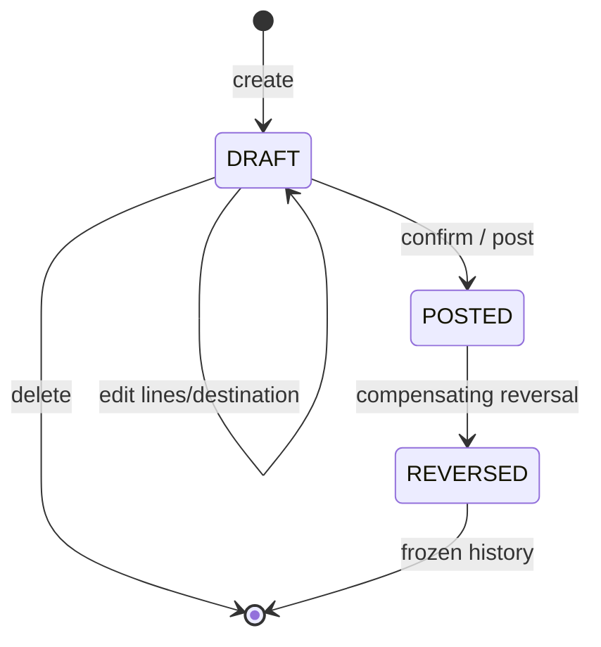
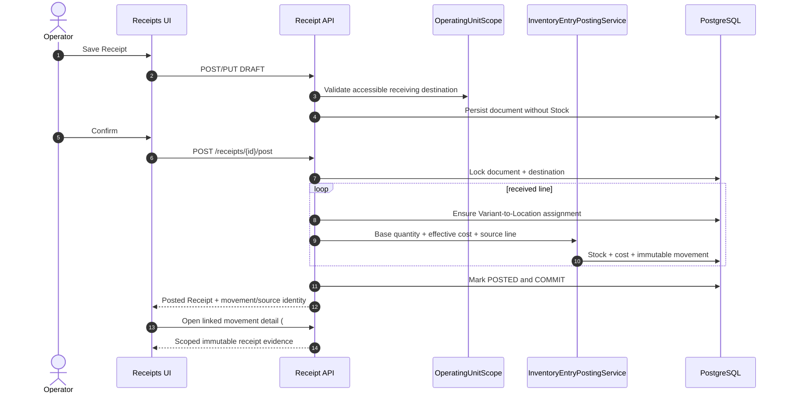

# Purchase Receipts

Issue `#432` is the acquisition-cost authority Supplier Offerings (`#431`) explicitly defer to. A
Receipt records the actual commercial transaction — supplier, presentation, paid/received/bonus
packages, discounts, allocated expenses, non-recoverable taxes — and posting it is the only path
that mutates Stock's weighted-average cost for a purchase.

## Model

```text
Supplier 1 ── * Receipt 1 ── * ReceiptLine * ── 1 VariantPurchasePresentation
```

- `Receipt` (header): public ULID, `supplier`, `destination_location`, `reference`, `receipt_date`,
  `notes`, and a `DRAFT → POSTED → REVERSED` lifecycle (`status` plus `posted_at`/`posted_by_user_id`
  and `reversed_at`/`reversed_by_user_id`/`reversal_reason`).
- `ReceiptLine`: snapshots everything needed to reproduce cost, immutably, once posted —
  `presentation_factor` (the Purchase Presentation Template's `base_unit_quantity` at the time this
  line was created, independent of later template changes), `ordered_packages`,
  `received_packages` (total physical packages received, bonus packages already included),
  `bonus_packages` (the free subset of `received_packages`), `gross_amount`, `discounts`,
  `allocated_expenses`, `non_recoverable_taxes`, and the two computed, stored fields
  `net_acquisition_amount` and `base_units_received`/`effective_unit_cost`.

### Document and Stock boundary



- Saving, editing, or deleting a `DRAFT` creates no Stock, changes no cost, and writes no movement.
- `DRAFT → POSTED` is the exact moment goods enter the destination Location.
- `POSTED`/`REVERSED` are evidence: corrections append compensating movements instead of editing or
  deleting history.

## Cost calculation

```text
net_acquisition_amount = gross_amount − discounts + allocated_expenses + non_recoverable_taxes
base_units_received    = received_packages × presentation_factor
effective_unit_cost    = net_acquisition_amount / base_units_received
```

`gross_amount` covers only the *paid* portion of `received_packages` — bonus packages are physically
received (they inflate `base_units_received`) but never add to `net_acquisition_amount`. That
asymmetry is what makes bonus packages lower `effective_unit_cost` without touching
`presentation_factor`. These fields are computed once, while the Receipt is a draft, and are never
recomputed after posting — the stored values *are* the audit evidence.

### Precision contract (Sprint 8 target)

Per [TD-05](../../decisions/td-05-monetary-precision-and-rounding.md), receipt totals and their
components are Money at scale 2; quantities use scale 4, presentation factors scale 6, effective
unit cost scale 4, and intermediate arithmetic at least scale 8. The final monetary result uses
`ROUND_HALF_UP`; no intermediate value crosses a binary-float boundary.

The transaction total is authoritative monetary evidence and the unit cost is a higher-precision
derived rate. Thus MXN 100.00 / 24 units yields `4.1667` per unit without changing the immutable
MXN 100.00 receipt total. This is the target of #415, not current as-built compliance: existing
Receipt DTOs still contain PHP `float` boundaries until that Sprint 8 issue is delivered.

## Posting

Posting a Receipt (`ReceiptService::postReceipt`) is atomic per line: it locks the Receipt header row
for the duration of the transaction (closing the same duplicate/concurrent-posting gap #430 closed
for Stock itself), then delegates every line to the shared `InventoryEntryPostingService` (#567) —
the one inbound posting primitive that locks or race-safely creates the destination `Stock` row (the
`#430` lock/recovery pattern), blends the effective unit cost (`#434`), and appends immutable
`StockMovement`/`StockMovementLine` evidence (`reason: PURCHASE_RECEIPT`, linked back to the Receipt
via `related_type`/`related_id`/`related_line_id`) as one transactionally consistent operation.
Reversing a posted Receipt (`reverseReceipt`) decreases Stock by the same base units through Stock's
own guarded `decreaseOnHand()`; if consumption has since dropped on-hand below what the receipt
added, reversal is rejected (`ReceiptReversalBoundaryException`) rather than driving Stock negative.

### Source-line identity and idempotency (#567)

Every posted entry carries explicit source identity — `related_type`/`related_id` (the Receipt) plus
`related_line_id` (the `ReceiptLine`) — instead of hiding the line key inside `meta`. A partial
UNIQUE index over `(related_type, related_id, related_line_id, reason)`, restricted to live `POSTED`
rows with a non-null line, is the final idempotency backstop: replaying the same receipt line (a
queue retry, an import, a concurrent double-post) returns the already-posted movement rather than
incrementing Stock a second time. `related_line_id` is null for manual movements with no source
document (e.g. Opening Balance), which the partial index leaves unconstrained; `reason` is part of
the key so a compensating `PURCHASE_RECEIPT_REVERSAL` sharing the document line does not collide with
its `PURCHASE_RECEIPT` original. `reverseReceipt` resolves the movement it compensates by
`related_line_id` (movements posted before #567 were backfilled from the former
`meta.receipt_line_id`).

Acquisition cost lands on `Stock.weighted_avg_cost`, never on `ItemVariant` — the issue is explicit
that cost "must not be entered on Product or Variant". `#434` unified this: `OpeningBalanceService`
now blends into the same per-location `Stock.weighted_avg_cost` (via `Stock::applyWeightedAverageCost()`
and the shared `WeightedAverageCostCalculator`) instead of writing `ItemVariant.avg_unit_cost` —
see `inventory-architecture.en.md` § "Weighted-average cost" for the full unification.

## API and authorization

Authenticated endpoints live below `/api/v1/inventory/receipts`, plus `{receipt}/post` and
`{receipt}/reverse` action endpoints. Public ULIDs are the only external identifiers.

- `receipts.view`: list/show Receipts.
- `receipts.manage`: create/update/delete a draft, post, and reverse.

**As-built (`#433`):** the UI's own header/line lookups the Receipt form needs — `GET
/inventory/suppliers`, `GET /inventory/suppliers/{supplier}/offerings`, `GET
/inventory-locations`, `GET /inventory/products`, `GET /inventory/products/{product}/variants`,
and `GET .../variants/{variant}/purchase-presentations` — now also accept `receipts.manage` as an
alternative to their own view permission (`suppliers.view`, `inventory_locations.view`,
`items.view`), the same way `suppliers.manage` was already widened onto the product/variant/
presentation list endpoints for the Supplier Offering cascade (`#505`). Without this, a role
holding only `receipts.manage` could open the Receipt create form but every one of its selects
would fail authorization and come back empty.

Editing or deleting is only allowed while a Receipt is still a draft; posting/reversing a Receipt
that isn't in the expected state returns `409`, never a silent no-op.

**As-built gap on 2026-08-30.** `ReceiptRequest` proves `destination_location_id` exists and is not
soft-deleted, but does not yet require an active, purchase-receiving, caller-accessible Location.
The UI selector uses the scoped Location list, but a direct payload must not rely on browser-side
filtering for authorization or business validity.

## Sprint 7 target: warehouse receiving

> Planned by #567–#569, #572, and the read-only audit surface in #574. See
> [Sprint 007](../../sprints/planned/sprint-007-warehouse-receiving-and-location-aware-stock.md) and
> [Inventory Architecture §3.12](../inventory-architecture.en.md).

Sprint 7 keeps `OperatingUnit` as the operational boundary and `InventoryLocation` as the custody
point; it does not add a `Warehouse` table. A Receipt destination must be:

- non-deleted and active;
- marked `can_receive_purchases = true` (#568);
- inside the caller's Operating Unit scope (#440/#572).

Eligibility is checked when the draft is saved (field-level `422`) and again under lock when posted
(`409` if it changed afterward). Posting also ensures the Variant-to-Location assignment (#569)
and routes every source line through #567. If any line fails, assignments, balance, cost, movements,
and document state all roll back.



#574 does not alter Receipt posting. It makes the resulting immutable movement discoverable from
the posted Receipt and from `Inventory > Movements`, subject to `stock.view` and the active
Operating Unit boundary.
