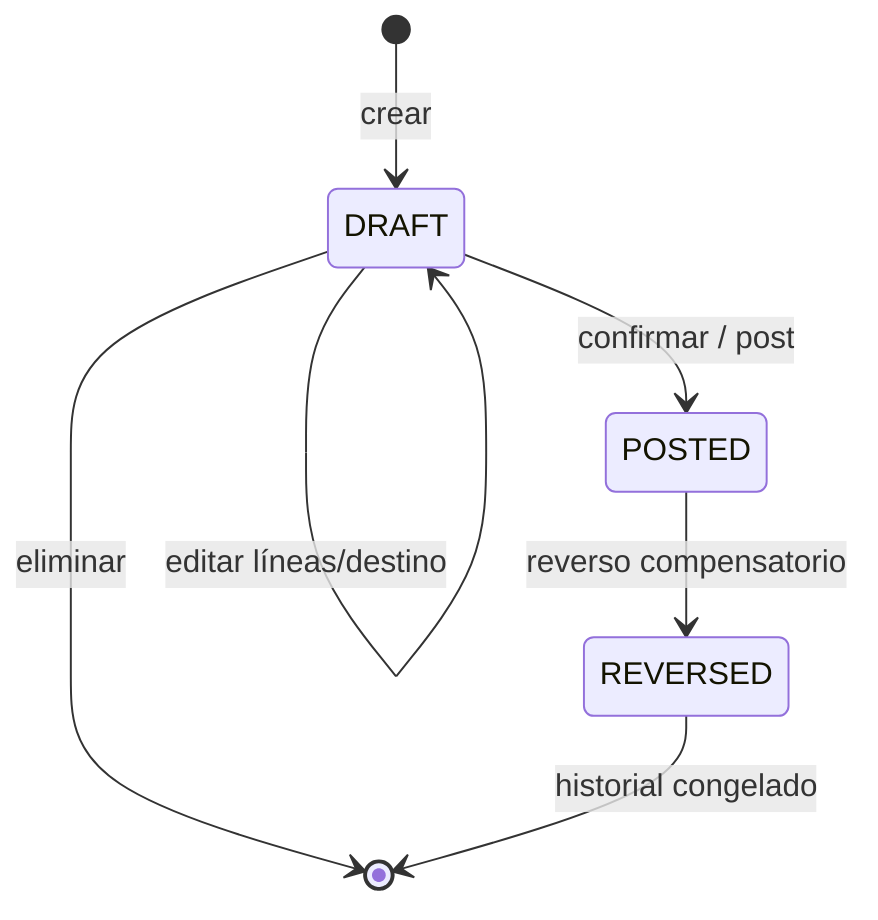
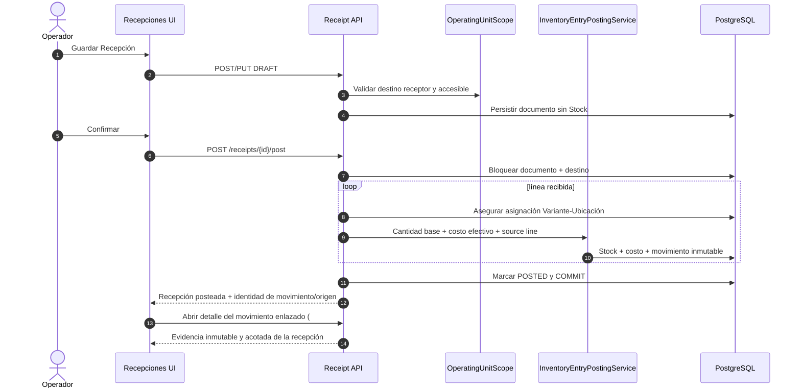

# Recepciones de compra

El Issue `#432` es la autoridad del costo de adquisición a la que las Ofertas de Proveedores
(`#431`) explícitamente remiten. Una Recepción registra la transacción comercial real —
proveedor, presentación, piezas pagadas/recibidas/bonificadas, descuentos, gastos asignados,
impuestos no recuperables— y su registro (posting) es la única vía que modifica el costo promedio
ponderado de Stock para una compra.

## Modelo

```text
Supplier 1 ── * Receipt 1 ── * ReceiptLine * ── 1 VariantPurchasePresentation
```

- `Receipt` (encabezado): ULID público, `supplier`, `destination_location`, `reference`,
  `receipt_date`, `notes`, y un ciclo de vida `DRAFT → POSTED → REVERSED` (`status` más
  `posted_at`/`posted_by_user_id` y `reversed_at`/`reversed_by_user_id`/`reversal_reason`).
- `ReceiptLine`: captura todo lo necesario para reproducir el costo, de forma inmutable una vez
  registrada — `presentation_factor` (el `base_unit_quantity` de la Plantilla de Presentación de
  Compra al momento de crear la línea, independiente de cambios posteriores a la plantilla),
  `ordered_packages`, `received_packages` (total de paquetes físicos recibidos, las bonificaciones
  ya incluidas), `bonus_packages` (el subconjunto gratuito de `received_packages`), `gross_amount`,
  `discounts`, `allocated_expenses`, `non_recoverable_taxes`, y los dos campos calculados y
  almacenados `net_acquisition_amount` y `base_units_received`/`effective_unit_cost`.

### Límite documental y de existencias



- Guardar, editar o eliminar `DRAFT` no crea `Stock`, no cambia costo y no registra movimientos.
- `DRAFT → POSTED` es el momento exacto en que la mercancía entra a la ubicación destino.
- `POSTED`/`REVERSED` son evidencia: una corrección crea movimientos compensatorios; no edita ni
  elimina el historial.

## Cálculo de costo

```text
net_acquisition_amount = gross_amount − discounts + allocated_expenses + non_recoverable_taxes
base_units_received    = received_packages × presentation_factor
effective_unit_cost    = net_acquisition_amount / base_units_received
```

`gross_amount` cubre únicamente la porción *pagada* de `received_packages` — las piezas
bonificadas se reciben físicamente (incrementan `base_units_received`) pero nunca se suman a
`net_acquisition_amount`. Esa asimetría es lo que hace que las bonificaciones reduzcan el
`effective_unit_cost` sin tocar `presentation_factor`. Estos campos se calculan una sola vez,
mientras la Recepción es borrador, y nunca se recalculan después de registrarse — los valores
almacenados **son** la evidencia de auditoría.

### Contrato de precisión (objetivo Sprint 8)

Según [TD-05](../../decisions/td-05-monetary-precision-and-rounding.md), los totales de Recepción y
sus componentes son Money con escala 2; las cantidades usan escala 4, los factores de presentación
escala 6, el costo unitario efectivo escala 4 y los cálculos intermedios al menos escala 8. El
resultado monetario final usa `ROUND_HALF_UP`; ningún valor intermedio cruza por punto flotante
binario.

El total de la transacción es la evidencia monetaria autoritativa y el costo unitario es una tasa
derivada con mayor precisión. Por ello, MXN 100.00 / 24 unidades produce `4.1667` por unidad sin
cambiar el total inmutable de MXN 100.00. Este es el objetivo de #415, no cumplimiento as-built:
los DTO de Recepción existentes todavía contienen fronteras PHP `float` hasta entregar ese issue
de Sprint 8.

## Registro (posting)

Registrar una Recepción (`ReceiptService::postReceipt`) es atómico por línea: bloquea la fila del
encabezado de la Recepción durante toda la transacción (cerrando el mismo hueco de registro
duplicado/concurrente que el `#430` cerró para Stock), luego delega cada línea al
`InventoryEntryPostingService` compartido (#567) —la única primitiva de entrada que bloquea o crea
de forma segura ante condiciones de carrera la fila de `Stock` destino (el patrón de
bloqueo/recuperación de `#430`), combina el costo unitario efectivo (`#434`) y agrega evidencia
inmutable de `StockMovement`/`StockMovementLine` (`reason: PURCHASE_RECEIPT`, vinculada a la
Recepción mediante `related_type`/`related_id`/`related_line_id`) como una sola operación
transaccionalmente consistente—. Revertir una Recepción registrada (`reverseReceipt`) disminuye
Stock en las mismas unidades base mediante el propio `decreaseOnHand()` protegido de Stock; si el
consumo ya redujo el disponible por debajo de lo que aportó la recepción, la reversión se rechaza
(`ReceiptReversalBoundaryException`) en vez de dejar Stock en negativo.

### Identidad de línea origen e idempotencia (#567)

Cada entrada registrada lleva identidad de origen explícita —`related_type`/`related_id` (la
Recepción) más `related_line_id` (la `ReceiptLine`)— en vez de esconder la clave de línea dentro de
`meta`. Un índice UNIQUE parcial sobre `(related_type, related_id, related_line_id, reason)`,
restringido a filas `POSTED` vivas con línea no nula, es el respaldo final de idempotencia: reprocesar
la misma línea de recepción (un reintento en cola, una importación, un doble registro concurrente)
devuelve el movimiento ya registrado en vez de incrementar Stock una segunda vez. `related_line_id`
es nulo para movimientos manuales sin documento origen (p. ej. Saldo Inicial), que el índice parcial
deja sin restringir; `reason` forma parte de la clave para que una reversión compensatoria
`PURCHASE_RECEIPT_REVERSAL` que comparte la línea del documento no choque con su original
`PURCHASE_RECEIPT`. `reverseReceipt` resuelve el movimiento que compensa por `related_line_id` (los
movimientos registrados antes de #567 se rellenaron desde el anterior `meta.receipt_line_id`).

El costo de adquisición se registra en `Stock.weighted_avg_cost`, nunca en `ItemVariant` — el Issue
es explícito en que el costo "no debe capturarse en Producto o Variante". El `#434` unificó esto:
`OpeningBalanceService` ahora también combina el costo en el mismo `Stock.weighted_avg_cost` por
ubicación (mediante `Stock::applyWeightedAverageCost()` y el `WeightedAverageCostCalculator`
compartido) en vez de escribir `ItemVariant.avg_unit_cost` — ver `inventory-architecture.es.md`
§ "Costo promedio ponderado" para la unificación completa.

## API y autorización

Los endpoints autenticados viven bajo `/api/v1/inventory/receipts`, más los endpoints de acción
`{receipt}/post` y `{receipt}/reverse`. Los únicos identificadores externos son ULID públicos.

- `receipts.view`: listar/ver Recepciones.
- `receipts.manage`: crear/actualizar/eliminar un borrador, registrar y revertir.

Editar o eliminar solo se permite mientras la Recepción sigue en borrador; registrar/revertir una
Recepción que no está en el estado esperado responde `409`, nunca un no-op silencioso.

**El permiso se exige dos veces (`#572`).** `receipts.manage` lo aplica el middleware de ruta *y* se
vuelve a exigir en `ReceiptRequest::authorize()` (crear/actualizar), de modo que la restricción se
mantiene incluso en un camino que llegue al FormRequest sin middleware de ruta — defensa en
profundidad, no un cambio de comportamiento.

**Contrato de listado acotado (`#586`).** `GET /inventory/receipts` es un modelo de lectura
*resumen* paginado en el servidor — las Recepciones de Compra son historia operativa de solo
adición, así que el listado nunca devuelve una coincidencia sin límite. El sobre de respuesta es
`ResponsePaginated` (`{ status, data, meta: { current_page, last_page, per_page, total } }`).
`per_page` es `15` por defecto y tiene un máximo de `100` (superarlo es `422`). El orden es
determinista, más reciente primero: `receipt_date DESC, id DESC`. Filtros validados: `status`,
`supplier_id`, `destination_location_id`, `date_from`/`date_to` (cada uno opcional de forma
independiente, inclusivos, sobre `receipt_date`; `date_to` no puede ser anterior a `date_from` solo
cuando se envían ambos) y
`search` (sin distinción de mayúsculas sobre `reference`). La fila de resumen lleva un único
agregado `total` (`SUM` en SQL de `net_acquisition_amount` de las líneas) en lugar del arreglo
`lines` y de las referencias de usuario `posted_by`/`reversed_by` — la evidencia completa de líneas
se obtiene de `GET /inventory/receipts/{id}` (`ReceiptResource`). El pipeline de la consulta es
**`OperatingUnitScope::constrainReceipts` → filtros validados → orden determinista → paginar/contar →
serializar**: el alcance horizontal por Unidad Operativa (mediante la Ubicación de recepción
`destination_location` y su unidad; los roles con bypass según `#440`) se aplica *antes* de los
filtros, el conteo y la paginación, para que los metadatos de página (`total`, `last_page`) nunca
reflejen Recepciones de unidades a las que quien llama no tiene acceso. `#572` añade su contrato de
enrutamiento de Ubicación de recepción (activa + apta para recepción de compras) sobre la misma
relación sin cambiar este pipeline.

Las rutas por ID (`show` / `update` / `delete` / `post` / `reverse`) aplican el **mismo** alcance de
unidad (`AssertsReceiptOperatingUnitAccess` → `OperatingUnitScope::assertCanAccessLocation` sobre la
`destinationLocation` de la Recepción, una relación `withTrashed()`): quien conozca el ULID de una
Recepción de otra unidad recibe `403`, no el registro. Los roles con bypass pasan. El lado de
*escritura* también está restringido por alcance: la regla de `destination_location_id` de
`ReceiptRequest` (`ScopesDestinationLocationToAccessibleUnits`) se limita a las unidades accesibles
del solicitante para los roles sin bypass, así que un payload de creación —o un `update` que nombra
un destino nuevo— hacia una unidad ajena es `422`, no una transferencia silenciosa entre unidades
(`assertReceiptInScope` por sí solo solo valida el destino *anterior* de la Recepción). Además del
alcance, el after-check de `withValidator` de `ReceiptRequest` (`#572`) rechaza un destino
**inactivo** o sin `can_receive_purchases` (`#568`) con el mismo `422` de campo.
`AssertsReceiptOperatingUnitAccess` corre antes de la transacción del servicio y es un
fallo rápido, no la última palabra: cada método mutador del servicio (`updateDraft` / `deleteDraft`
/ `postReceipt` / `reverseReceipt`) vuelve a ejecutar `assertCanAccessLocation` bajo su bloqueo de
fila, contra el destino actual de la Recepción, mediante
`ReceiptService::assertActorMayMutateLockedReceipt`; además, `createDraft` y `updateDraft` revalidan
el destino del *payload* mediante `assertActorMayUseDestination`, de modo que el Servicio impone el
alcance por sí mismo en vez de confiar en la validación del request. Así, un cambio de alcance entre
el guard previo al bloqueo y el bloqueo —una membresía revocada, o una transferencia por un rol con
bypass de una Recepción aún en borrador— no puede dejar que quien llama mute (ni deje Stock en) una
unidad a la que ya no tiene acceso. El único hueco residual —esas lecturas de membresía no usan
`lockForUpdate` sobre `operating_unit_users`, así que una revocación en el *mismo instante* no queda
serializada contra una mutación en curso— es una propiedad de todo el `OperatingUnitScope`. `#572`
endureció el contrato del *destino* de la Recepción (ver abajo) pero dejó abierta a propósito esa
cuestión del bloqueo de membresía.

El filtro `search` del listado compara `reference` con `ILIKE`; el término pasa por
`addcslashes(term, '\\%_')` para que `%` / `_` en la búsqueda se traten como literales y no como
comodines de LIKE.

## Recepción hacia almacén (Sprint 7)

> Entregado en #567–#569, #572 y la superficie de auditoría de solo lectura de #574. Ver
> [Sprint 007](../../sprints/planned/sprint-007-warehouse-receiving-and-location-aware-stock.md) y
> [Arquitectura de Inventario §3.12](../inventory-architecture.es.md).

Sprint 7 mantiene `OperatingUnit` como límite operativo y `InventoryLocation` como punto de custodia;
no agrega una tabla `Warehouse`. La ubicación destino de una Recepción debe estar:

- no eliminada y activa;
- marcada `can_receive_purchases = true` (#568);
- dentro del alcance de Unidad Operativa del usuario (#440/#572).

**Tal como se implementó (`#572`).** Las tres restricciones se exigen en el payload de
crear/actualizar (`ReceiptRequest`: la regla `exists` + `ScopesDestinationLocationToAccessibleUnits`
cubren no-eliminada / dentro de alcance; un after-check de `withValidator` cubre activa +
`can_receive_purchases`), devolviendo un único `422` de campo en `destination_location_id`.
`ReceiptService::postReceipt()` vuelve a leer el destino **bajo su bloqueo de fila** y lanza
`ReceiptDestinationUnavailableException` → `409` si está eliminada, inactiva o ya no apta para
recepción de compras — porque el estado de la Ubicación puede cambiar mientras la Recepción sigue en
borrador. En la misma transacción de confirmación, la `VariantLocationAssignment` (#569) de cada
línea recibida se garantiza de forma idempotente mediante el servicio compartido
`VariantLocationAssignmentEnsurer` (nunca una fila de `Stock` ni un movimiento) y luego se registra
mediante el `InventoryEntryPostingService` de #567. Si cualquier línea falla, las asignaciones, el
saldo, el costo, los movimientos y el estado `POSTED` se revierten juntos. La reversión compensa
Stock y movimientos pero **conserva** la asignación de surtido.

`ReceiptResource.destination_location` incluye `type`, `is_active`, `can_receive_purchases` y la
`operating_unit` dueña (`{id, name, type}`) para que la vista de detalle sea inequívoca sobre dónde
entró el inventario. El formulario de Recepción del webapp nombra el campo "Almacén / ubicación
receptora", ofrece solo Ubicaciones activas + `can_receive_purchases` (agrupadas por Unidad
Operativa), aclara que guardar un borrador no toca el inventario y —tras confirmar o revertir—
invalida los modelos de lectura de Stock, de asignaciones y de Movimientos de Stock (#574) junto con
el listado de Recepciones.



#574 no modifica el posting de la Recepción. Hace que el movimiento inmutable resultante pueda
consultarse desde la Recepción posteada y desde `Inventario > Movimientos`, sujeto a `stock.view` y
al límite de la Unidad Operativa activa.
