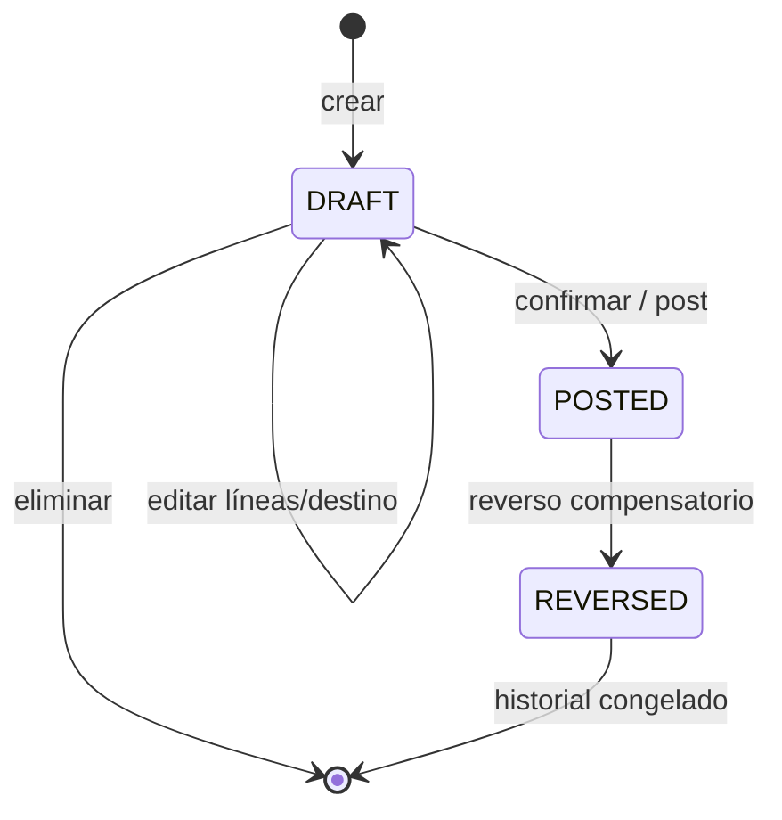
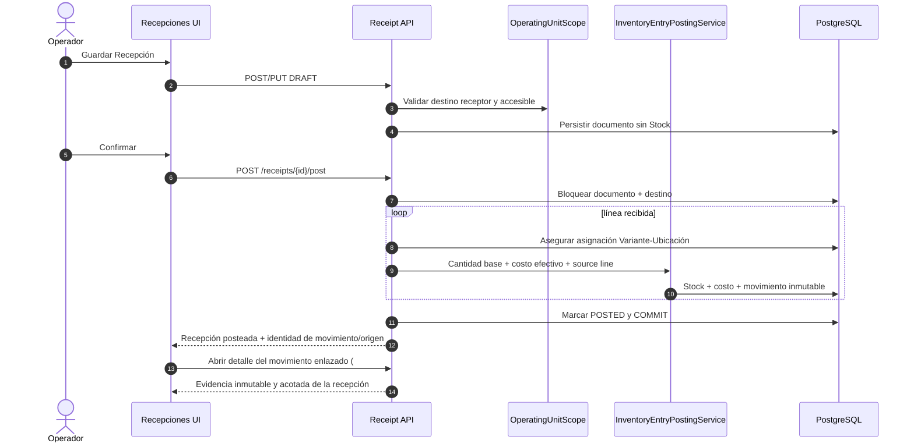

# Recepciones de compra

El Issue `#432` es la autoridad del costo de adquisición a la que las Ofertas de Proveedores
(`#431`) explícitamente remiten. Una Recepción registra la transacción comercial real —
proveedor, presentación, piezas pagadas/recibidas/bonificadas, descuentos, gastos asignados,
impuestos no recuperables— y su registro (posting) es la única vía que modifica el costo promedio
ponderado de Stock para una compra.

## Modelo

```text
Supplier 1 ── * Receipt 1 ── * ReceiptLine * ── 1 VariantPurchasePresentation
```

- `Receipt` (encabezado): ULID público, `supplier`, `destination_location`, `reference`,
  `receipt_date`, `notes`, y un ciclo de vida `DRAFT → POSTED → REVERSED` (`status` más
  `posted_at`/`posted_by_user_id` y `reversed_at`/`reversed_by_user_id`/`reversal_reason`).
- `ReceiptLine`: captura todo lo necesario para reproducir el costo, de forma inmutable una vez
  registrada — `presentation_factor` (el `base_unit_quantity` de la Plantilla de Presentación de
  Compra al momento de crear la línea, independiente de cambios posteriores a la plantilla),
  `ordered_packages`, `received_packages` (total de paquetes físicos recibidos, las bonificaciones
  ya incluidas), `bonus_packages` (el subconjunto gratuito de `received_packages`), `gross_amount`,
  `discounts`, `allocated_expenses`, `non_recoverable_taxes`, y los dos campos calculados y
  almacenados `net_acquisition_amount` y `base_units_received`/`effective_unit_cost`.

### Límite documental y de existencias



- Guardar, editar o eliminar `DRAFT` no crea `Stock`, no cambia costo y no registra movimientos.
- `DRAFT → POSTED` es el momento exacto en que la mercancía entra a la ubicación destino.
- `POSTED`/`REVERSED` son evidencia: una corrección crea movimientos compensatorios; no edita ni
  elimina el historial.

## Cálculo de costo

```text
net_acquisition_amount = gross_amount − discounts + allocated_expenses + non_recoverable_taxes
base_units_received    = received_packages × presentation_factor
effective_unit_cost    = net_acquisition_amount / base_units_received
```

`gross_amount` cubre únicamente la porción *pagada* de `received_packages` — las piezas
bonificadas se reciben físicamente (incrementan `base_units_received`) pero nunca se suman a
`net_acquisition_amount`. Esa asimetría es lo que hace que las bonificaciones reduzcan el
`effective_unit_cost` sin tocar `presentation_factor`. Estos campos se calculan una sola vez,
mientras la Recepción es borrador, y nunca se recalculan después de registrarse — los valores
almacenados **son** la evidencia de auditoría.

### Contrato de precisión (objetivo Sprint 8)

Según [TD-05](../../decisions/td-05-monetary-precision-and-rounding.md), los totales de Recepción y
sus componentes son Money con escala 2; las cantidades usan escala 4, los factores de presentación
escala 6, el costo unitario efectivo escala 4 y los cálculos intermedios al menos escala 8. El
resultado monetario final usa `ROUND_HALF_UP`; ningún valor intermedio cruza por punto flotante
binario.

El total de la transacción es la evidencia monetaria autoritativa y el costo unitario es una tasa
derivada con mayor precisión. Por ello, MXN 100.00 / 24 unidades produce `4.1667` por unidad sin
cambiar el total inmutable de MXN 100.00. Este es el objetivo de #415, no cumplimiento as-built:
los DTO de Recepción existentes todavía contienen fronteras PHP `float` hasta entregar ese issue
de Sprint 8.

## Registro (posting)

Registrar una Recepción (`ReceiptService::postReceipt`) es atómico por línea: bloquea la fila del
encabezado de la Recepción durante toda la transacción (cerrando el mismo hueco de registro
duplicado/concurrente que el `#430` cerró para Stock), luego para cada línea invoca el
`StockMutationService::receiveInto()` existente —el mismo patrón de bloqueo/recuperación de
condición de carrera que introdujo `#430` para Stock— y escribe evidencia inmutable de
`StockMovement`/`StockMovementLine` (`reason: PURCHASE_RECEIPT`, vinculada a la Recepción mediante
`related_id`/`related_type`). Revertir una Recepción registrada (`reverseReceipt`) disminuye Stock
en las mismas unidades base mediante el propio `decreaseOnHand()` protegido de Stock; si el consumo
ya redujo el disponible por debajo de lo que aportó la recepción, la reversión se rechaza
(`ReceiptReversalBoundaryException`) en vez de dejar Stock en negativo.

**Estado as-built al 2026-08-30.** El bloqueo del encabezado protege la confirmación normal, pero
cada línea todavía orquesta Stock/costo/movimiento dentro de `ReceiptService`; la identidad de la
línea origen vive en `meta.receipt_line_id`, sin una restricción única reutilizable. #567
centraliza la entrada y agrega identidad de documento/línea respaldada por BD para que reintentos,
procesos en segundo plano o importaciones no dupliquen el efecto.

El costo de adquisición se registra en `Stock.weighted_avg_cost`, nunca en `ItemVariant` — el Issue
es explícito en que el costo "no debe capturarse en Producto o Variante". El `#434` unificó esto:
`OpeningBalanceService` ahora también combina el costo en el mismo `Stock.weighted_avg_cost` por
ubicación (mediante `Stock::applyWeightedAverageCost()` y el `WeightedAverageCostCalculator`
compartido) en vez de escribir `ItemVariant.avg_unit_cost` — ver `inventory-architecture.es.md`
§ "Costo promedio ponderado" para la unificación completa.

## API y autorización

Los endpoints autenticados viven bajo `/api/v1/inventory/receipts`, más los endpoints de acción
`{receipt}/post` y `{receipt}/reverse`. Los únicos identificadores externos son ULID públicos.

- `receipts.view`: listar/ver Recepciones.
- `receipts.manage`: crear/actualizar/eliminar un borrador, registrar y revertir.

Editar o eliminar solo se permite mientras la Recepción sigue en borrador; registrar/revertir una
Recepción que no está en el estado esperado responde `409`, nunca un no-op silencioso.

**Brecha as-built al 2026-08-30.** `ReceiptRequest` comprueba que `destination_location_id` exista y
no esté eliminado, pero todavía no exige que esté activo, que pueda recibir compras ni que pertenezca
al `OperatingUnitScope` del solicitante. El selector usa el listado restringido por alcance, pero
una solicitud directa no debe depender de que el navegador haya filtrado correctamente.

## Objetivo Sprint 7: recepción hacia almacén

> Planeado en #567–#569, #572 y la superficie de auditoría de solo lectura de #574. Ver
> [Sprint 007](../../sprints/planned/sprint-007-warehouse-receiving-and-location-aware-stock.md) y
> [Arquitectura de Inventario §3.12](../inventory-architecture.es.md).

Sprint 7 mantiene `OperatingUnit` como límite operativo y `InventoryLocation` como punto de custodia;
no agrega una tabla `Warehouse`. La ubicación destino de una Recepción debe estar:

- no eliminada y activa;
- marcada `can_receive_purchases = true` (#568);
- dentro del alcance de Unidad Operativa del usuario (#440/#572).

La elegibilidad se valida al guardar el borrador (`422` de campo) y de nuevo bajo bloqueo al
confirmar (`409` si cambió después). Confirmar garantiza además la asignación Variante–Ubicación
(#569) y registra cada línea mediante #567. Si cualquier línea falla, se revierten asignaciones,
saldos, costo, movimientos y estado del documento.



#574 no modifica el posting de la Recepción. Hace que el movimiento inmutable resultante pueda
consultarse desde la Recepción posteada y desde `Inventario > Movimientos`, sujeto a `stock.view` y
al límite de la Unidad Operativa activa.
