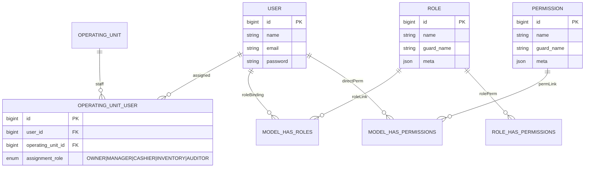

# 🔐 Security & User System Architecture

**Scope**
Design of authentication, authorization, and permission assignment for the SushiGo tenant within the ComandaFlow ecosystem. Describes key entities, default roles, permission strategy, and guidelines for integrating new domains.

---

## 1. Main Components

-   **User**: authenticated account (Laravel Passport) with basic data (`name`, `email`, `password`).
-   **Role**: contextual grouper of permissions. Used to assign common profiles to a user.
-   **Permission**: granular action (e.g., `users.index`, `roles.store`).
-   **OperatingUnitUser**: pivot table that links users with operating units (branches/inventories) and grants them an operating role (`OWNER`, `MANAGER`, `INVENTORY`, etc.).
-   **SeederLog**: seeder tracking to control role/permission initialization in different environments.

> Implemented using [Spatie Laravel Permission](https://spatie.be/docs/laravel-permission), which allows assigning roles and permissions directly (`User->assignRole()`, `User->givePermissionTo()`).

---

## 2. Relational Model



---

## 3. Default Roles

| Role          | Description                                                                 | Initial Permissions                                                                                                               |
| ------------- | --------------------------------------------------------------------------- | --------------------------------------------------------------------------------------------------------------------------------- |
| `super-admin` | Full tenant control. Can manage users, roles, permissions, and inventories. | All permissions (`*`).                                                                                                            |
| `admin`       | Operational management: standard users, inventories, and reports.           | `users.index`, `users.show`, `users.store`, `users.update`, `roles.index`, `roles.show`, `permissions.index`, `permissions.show`. |
| `user`        | Limited access to dashboards and basic functionalities assigned manually.   | No default permissions (added as needed).                                                                                         |

These roles are generated through production and development seeders (`RoleSeeder`, `PermissionSeeder`, `UserRoleSeeder`) and can be extended with domain-specific roles (e.g., `inventory-manager`, `event-manager`) as the system evolves.

---

## 4. Permission Strategy

1. **Direct permission evaluation**
   Policies and middleware first verify `User::hasPermissionTo($permission)` to allow mixed compositions. This enables specific assignments (e.g., a user with `user` role but direct `orders.approve` permission).

2. **Roles as wrappers**
   Roles group a predefined set of permissions to accelerate initial assignment. A user can have multiple roles and, additionally, direct permissions when required.

3. **Spatie compatibility**

    - `hasPermissionTo()` already evaluates both direct permissions and those inherited via roles.
    - `hasRole()` is used in specific rules when we want clear semantics (e.g., differentiating a global `super-admin`).
    - Commands `syncRoles()` and `syncPermissions()` help maintain consistency when updating permission templates.

4. **Policies and guards**
    - Policies (`Policy`) rely on permissions (`viewAny`, `update`, `transfer`, etc.) and verify belonging to the operating unit through `OperatingUnitUser`.
    - The active guard is `api`, aligned with seeders and Passport.

---

## 5. Assignment Flow

```mermaid
flowchart LR
    A[Seeders] -->|create| R(Role)
    A -->|create| P(Permission)
    U[User] -->|assignRole()| R
    U -->|givePermissionTo()| P
    subgraph Operating Unit Context
      U -->|assigns operating role| OU_USER[OperatingUnitUser]
      OU_USER --> OU[OperatingUnit]
    end
    Policy[Policies / Gates] -->|hasPermissionTo?| U
    Policy -->|hasRole?| U
```

---

## 6. Practical Guidelines

-   **Initial assignment**: use roles (`super-admin`, `admin`, `user`) for bootstrap; add direct permissions when extra granularity is needed.
-   **Unit-specific roles**: if a branch requires its own roles (e.g., `inventory-manager`), create the role and associate corresponding permissions; branch membership is managed via `OperatingUnitUser`.
-   **Auditing**: log critical role/permission changes for traceability (can be extended with events `RoleAssigned`, `PermissionRevoked`).
-   **Testing**: include policy tests that cover role + direct permission combinations to avoid regressions.
-   **Future integrations**: when adding modules (e.g., purchases, production), define new permissions following the `context.action` schema (`purchases.create`, `production.schedule`).

---

## 7. References

-   [Spatie Laravel Permission](https://spatie.be/docs/laravel-permission)
-   [Laravel Authorization](https://laravel.com/docs/authorization)
-   [Inventory Architecture & Design](./inventory-architecture.md) – relationship with operating units and stock.
