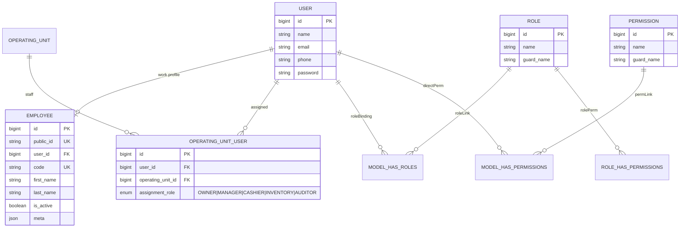
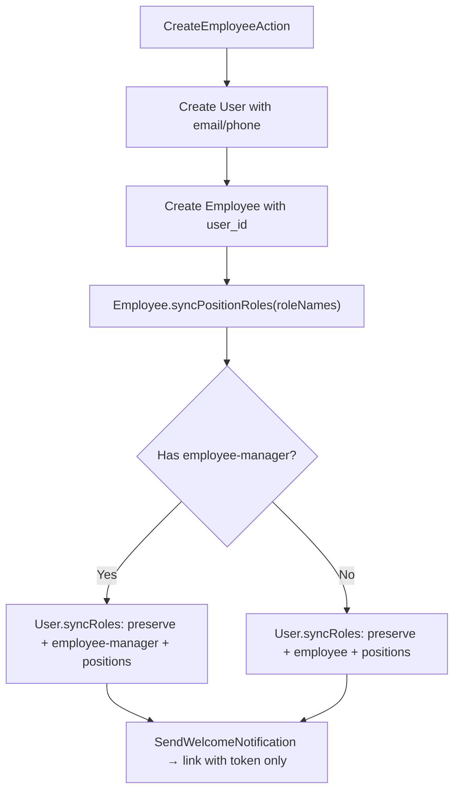
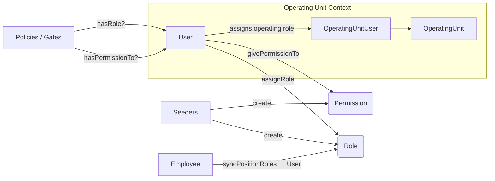

# 🔐 Security & User System Architecture

**Scope**
Design of authentication, authorization, and permission assignment for the SushiGo tenant within the ComandaFlow ecosystem. Describes key entities, default roles, permission strategy, and guidelines for integrating new domains.

---

## 1. Core Principle: User is the Identity, Employee is the Profile

```
A User has roles → reflects their access level within the application.
An Employee has a User → that User has a role within the company.
```

- **`User`** is the authenticated entity. It holds credentials (`email`, `phone`, `password`), Passport tokens, and **all roles and permissions live here**.
- **`Employee`** is the work profile. It has no roles of its own. When position roles are synced, they are assigned to the linked `User`, not to `Employee`.
- `super-admin` is the only exception: a system-level account with no employee profile.

---

## 2. Main Components

- **User**: authenticated account (Laravel Passport). All roles and permissions are assigned here via Spatie Permission (`guard: api`).
- **Employee**: work profile linked to a `User` (`user_id FK`). Describes the person: name, code, position. **Does not implement `HasRoles`**.
- **Role**: contextual grouper of permissions assigned to the `User`.
- **Permission**: granular action (e.g., `employees.create`, `users.index`).
- **OperatingUnitUser**: pivot table linking `User` with operating units, granting an operating role (`OWNER`, `MANAGER`, `INVENTORY`, etc.).

> Implemented using [Spatie Laravel Permission](https://spatie.be/docs/laravel-permission). All roles/permissions operate on `User` with `guard_name = 'api'`.

---

## 3. Relational Model


```mermaid
erDiagram
  USER ||--o| EMPLOYEE : "work profile"
  USER ||--o{ OPERATING_UNIT_USER : assigned
  OPERATING_UNIT ||--o{ OPERATING_UNIT_USER : staff
  USER ||--o{ MODEL_HAS_ROLES : roleBinding
  ROLE ||--o{ MODEL_HAS_ROLES : roleLink
  USER ||--o{ MODEL_HAS_PERMISSIONS : directPerm
  PERMISSION ||--o{ MODEL_HAS_PERMISSIONS : permLink
  ROLE ||--o{ ROLE_HAS_PERMISSIONS : rolePerm

  USER {
    bigint id PK
    string name
    string email
    string phone
    string password
  }

  EMPLOYEE {
    bigint id PK
    string public_id UK
    bigint user_id FK
    string code UK
    string first_name
    string last_name
    boolean is_active
    json meta
  }

  OPERATING_UNIT_USER {
    bigint id PK
    bigint user_id FK
    bigint operating_unit_id FK
    enum assignment_role "OWNER|MANAGER|CASHIER|INVENTORY|AUDITOR"
  }

  ROLE {
    bigint id PK
    string name
    string guard_name
  }

  PERMISSION {
    bigint id PK
    string name
    string guard_name
  }
```

---

## 4. System Roles

All roles are assigned to the **User**. `Employee` never holds roles directly.

### System roles (application access)

| Role | Employee profile | Description | Base permissions |
|------|------------------|-------------|-----------------|
| `super-admin` | ❌ No | Full system access. Technical account, no work profile. | All (`*`) |
| `admin` | ✅ Yes | Full operational management. | `users.*`, `employees.*` |
| `inventory-manager` | ✅ Yes | Inventory and employee management. | `users.*`, `employees.*` |
| `employee-manager` | ✅ Yes | Team lead. Assigned automatically via position sync. | `users.index/show`, `employees.*` |
| `employee` | ✅ Yes | Base access for any active employee. | `users.index/show` |
| `user` | ⚪ Optional | Generic fallback for non-employee accounts. | `users.index/show` |

### Position roles (job title)

Describe the employee's job within operations. Assigned to `User` via `Employee::syncPositionRoles()`.

| Position role | Resulting system role |
|---------------|-----------------------|
| `employee-manager` | `employee-manager` |
| `employee-cook` | `employee` |
| `employee-kitchen-assistant` | `employee` |
| `employee-delivery-driver` | `employee` |
| `employee-acting-manager` | `employee` |

A user can hold **multiple roles simultaneously**: e.g. `admin` + `employee-manager` (position).

---

## 5. Employee Creation Flow


```mermaid
flowchart TD
    A[CreateEmployeeAction] --> B[Create User with email/phone]
    B --> C[Create Employee with user_id]
    C --> D["Employee.syncPositionRoles(roleNames)"]
    D --> E{Has employee-manager?}
    E -- Yes --> F[User.syncRoles: preserve + employee-manager + positions]
    E -- No  --> G[User.syncRoles: preserve + employee + positions]
    F --> H[SendWelcomeNotification → link with token only]
    G --> H
```

**Key rule**: `syncPositionRoles()` preserves roles outside the employee domain (`admin`, `inventory-manager`, `super-admin`, etc.) and only replaces `employee` / `employee-manager`.

---

## 6. General Assignment Flow


```mermaid
flowchart LR
    A[Seeders] -->|create| R(Role)
    A -->|create| P(Permission)
    U[User] -->|assignRole| R
    U -->|givePermissionTo| P
    E[Employee] -->|syncPositionRoles → User| R
    subgraph Operating Unit Context
      U -->|assigns operating role| OU_USER[OperatingUnitUser]
      OU_USER --> OU[OperatingUnit]
    end
    Policy[Policies / Gates] -->|hasPermissionTo?| U
    Policy -->|hasRole?| U
```

---

## 7. Development Seeders

| Seeder | Type | Description |
|--------|------|-------------|
| `RoleSeeder` | `LockedSeeder` | Creates all system and position roles. |
| `PermissionSeeder` | `LockedSeeder` | Creates permissions and assigns them to roles. |
| `UserSeeder` | `OnceSeeder` | Creates admin/superadmin users with dev credentials. |
| `UserRoleSeeder` | `OnceSeeder` | Assigns the system role to each admin user. |
| `AdminEmployeeSeeder` | `OnceSeeder` | Links `admin` and `inventory-manager` users with an `Employee` profile. |
| `EmployeeSeeder` | `OnceSeeder` | Creates sample employees with linked `User` accounts. |

**Order**: `RoleSeeder` → `PermissionSeeder` → `UserSeeder` → `UserRoleSeeder` → `AdminEmployeeSeeder` → `EmployeeSeeder`.

---

## 8. Permission Strategy

1. **Direct permission evaluation**: policies verify `User::hasPermissionTo($permission)`, enabling mixed compositions with direct permissions.
2. **Roles as wrappers**: group predefined permissions. A user can have multiple roles and additional direct permissions.
3. **Spatie compatibility**: `hasPermissionTo()` evaluates both direct and inherited permissions. `syncRoles()` / `syncPermissions()` maintain consistency.
4. **Guard**: active `api`, aligned with seeders and Passport.

---

## 9. Practical Guidelines

- **Roles always on User**: never assign roles or permissions directly to `Employee`.
- **`syncPositionRoles()`**: the single entry point for changing an employee's position.
- **`super-admin`**: excluded from employee profiles. Technical system account.
- **Auditing**: log role/permission changes (events `RoleAssigned`, `PermissionRevoked`).
- **Testing**: cover role + direct permission combinations in policy tests.
- **New modules**: define permissions with the `context.action` schema (`sales.create`, `production.schedule`) and assign them in `PermissionSeeder`.

---

## 10. References

-   [Spatie Laravel Permission](https://spatie.be/docs/laravel-permission)
-   [Laravel Authorization](https://laravel.com/docs/authorization)
-   [Inventory Architecture & Design](./inventory-architecture.md) – relationship with operating units and stock.
