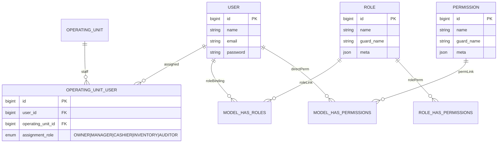

# 🔐 Security & User System Architecture

**Scope**  
Diseño de autenticación, autorización y asignación de permisos para el tenant SushiGo dentro del ecosistema ComandaFlow. Describe entidades clave, roles por defecto, estrategia de permisos y lineamientos para integrar nuevos dominios.

---

## 1. Componentes principales

- **User**: cuenta autenticada (Laravel Passport) con datos básicos (`name`, `email`, `password`).
- **Role**: agrupador contextual de permisos. Se utiliza para asignar perfiles comunes a un usuario.
- **Permission**: acción granular (e.g. `users.index`, `roles.store`).
- **OperatingUnitUser**: tabla pivote que vincula usuarios con unidades operativas (sucursales/inventarios) y les otorga un rol operativo (`OWNER`, `MANAGER`, `INVENTORY`, etc.).
- **SeederLog**: seguimiento de seeders para controlar la inicialización de roles/permisos en distintos entornos.

> Se implementa mediante [Spatie Laravel Permission](https://spatie.be/docs/laravel-permission), lo que permite asignar roles y permisos directamente (`User->assignRole()`, `User->givePermissionTo()`).

---

## 2. Modelo relacional



---

## 3. Roles por defecto

| Rol | Descripción | Permisos iniciales |
|-----|-------------|--------------------|
| `super-admin` | Control total del tenant. Puede administrar usuarios, roles, permisos e inventarios. | Todos los permisos (`*`). |
| `admin` | Gestión operativa: usuarios estándar, inventarios y reportes. | `users.index`, `users.show`, `users.store`, `users.update`, `roles.index`, `roles.show`, `permissions.index`, `permissions.show`. |
| `user` | Acceso limitado a dashboards y funcionalidades básicas asignadas manualmente. | Ningún permiso por defecto (se añaden según necesidad). |

Estos roles se generan mediante los seeders de producción y desarrollo (`RoleSeeder`, `PermissionSeeder`, `UserRoleSeeder`) y se pueden extender con roles específicos por dominio (ej. `inventory-manager`, `event-manager`) según evolucione el sistema.

---

## 4. Estrategia de permisos

1. **Evaluación directa de permisos**  
   Las políticas y middleware verifican primero `User::hasPermissionTo($permission)` para permitir composiciones mixtas. Esto habilita asignaciones puntuales (e.g. un usuario con rol `user` pero permiso directo `orders.approve`).

2. **Roles como envoltorios**  
   Los roles agrupan un conjunto de permisos predefinidos para acelerar la asignación inicial. Un usuario puede tener múltiples roles y, además, permisos directos cuando se requiera.

3. **Compatibilidad con Spatie**  
   - `hasPermissionTo()` ya evalúa tanto permisos directos como heredados via roles.  
   - `hasRole()` se utiliza en reglas específicas cuando queremos una semántica clara (ej. diferenciar un `super-admin` global).  
   - Los comandos `syncRoles()` y `syncPermissions()` ayudan a mantener consistencia cuando se actualizan plantillas de permisos.

4. **Políticas y guards**  
   - Las políticas (`Policy`) se apoyan en permisos (`viewAny`, `update`, `transfer`, etc.) y verifican la pertenencia a la unidad operativa mediante `OperatingUnitUser`.  
   - El guard activo es `api`, alineado con los seeders y Passport.

---

## 5. Flujo de asignación

```mermaid
flowchart LR
    A[Seeders] -->|crean| R(Role)
    A -->|crean| P(Permission)
    U[User] -->|assignRole()| R
    U -->|givePermissionTo()| P
    subgraph Operating Unit Context
      U -->|asigna rol operativo| OU_USER[OperatingUnitUser]
      OU_USER --> OU[OperatingUnit]
    end
    Policy[Policies / Gates] -->|hasPermissionTo?| U
    Policy -->|hasRole?| U
```

---

## 6. Lineamientos prácticos

- **Asignación inicial**: usar roles (`super-admin`, `admin`, `user`) para bootstrap; añadir permisos directos cuando sea necesario granularidad extra.
- **Roles específicos por unidad**: si una sucursal requiere roles propios (ej. `inventory-manager`), crear el rol y asociar permisos correspondientes; la pertenencia a la sucursal se gestiona vía `OperatingUnitUser`.
- **Auditoría**: loggear cambios de roles/permisos críticos para tener trazabilidad (puede extenderse con eventos `RoleAssigned`, `PermissionRevoked`).
- **Testing**: incluir pruebas de políticas que cubran combinaciones de rol + permiso directo para evitar regresiones.
- **Futuras integraciones**: cuando se agreguen módulos (p. ej. compras, producción), definir nuevos permisos siguiendo el esquema `context.action` (`purchases.create`, `production.schedule`).

---

## 7. Referencias

- [Spatie Laravel Permission](https://spatie.be/docs/laravel-permission)
- [Laravel Authorization](https://laravel.com/docs/authorization)
- [Inventory Architecture & Design](./inventory-architecture.md) – relación con unidades operativas y stock.
