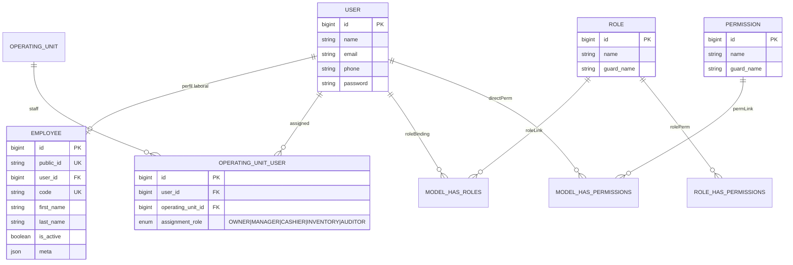
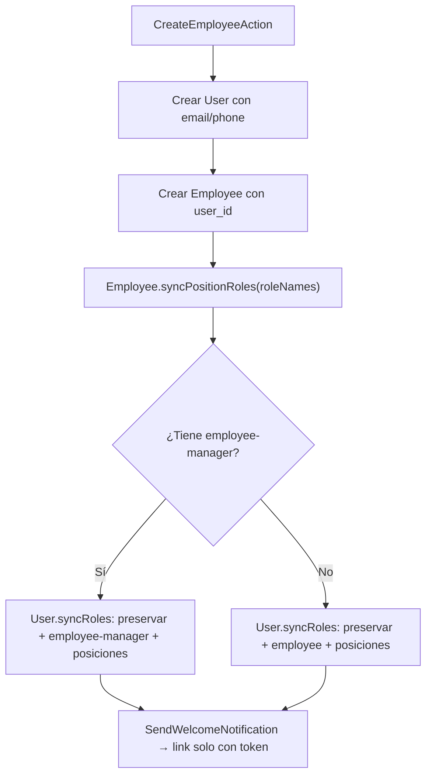
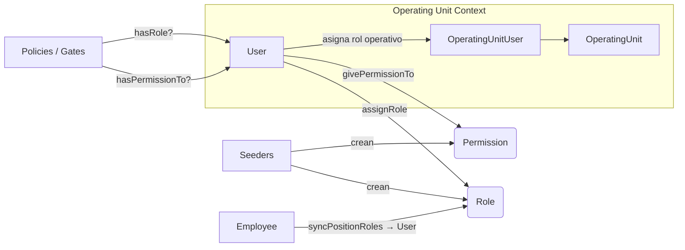

# 🔐 Security & User System Architecture

**Alcance**
Diseño de autenticación, autorización y asignación de permisos para el tenant SushiGo dentro del ecosistema ComandaFlow. Describe entidades clave, roles por defecto, estrategia de permisos y lineamientos para integrar nuevos dominios.

---

## 1. Principio fundamental: User es la identidad, Employee es el perfil

```
Un Usuario tiene roles → refleja su nivel de acceso en la aplicación.
Un Empleado tiene un Usuario → ese Usuario tiene un rol dentro de la empresa.
```

- **`User`** es la entidad autenticada. Tiene credenciales (`email`, `phone`, `password`), tokens Passport y **todos los roles y permisos viven aquí**.
- **`Employee`** es el perfil laboral. No tiene roles propios. Al sincronizar roles de posición, estos se asignan al `User` vinculado, no al `Employee`.
- El `super-admin` es la única excepción: cuenta de sistema sin perfil de empleado.

---

## 2. Componentes principales

- **User**: cuenta autenticada (Laravel Passport). Todos los roles y permisos se asignan aquí vía Spatie Permission (`guard: api`).
- **Employee**: perfil laboral vinculado a un `User` (`user_id FK`). Describe la persona: nombre, código, puesto. **No implementa `HasRoles`**.
- **Role**: agrupador contextual de permisos asignado al `User`.
- **Permission**: acción granular (p.ej. `employees.create`, `users.index`).
- **OperatingUnitUser**: tabla pivote que vincula `User` con unidades operativas y les asigna un rol operativo (`OWNER`, `MANAGER`, `INVENTORY`, etc.).

> Implementado con [Spatie Laravel Permission](https://spatie.be/docs/laravel-permission). Todos los roles/permisos operan sobre `User` con `guard_name = 'api'`.

---

## 3. Modelo relacional


```mermaid
erDiagram
  USER ||--o| EMPLOYEE : "perfil laboral"
  USER ||--o{ OPERATING_UNIT_USER : assigned
  OPERATING_UNIT ||--o{ OPERATING_UNIT_USER : staff
  USER ||--o{ MODEL_HAS_ROLES : roleBinding
  ROLE ||--o{ MODEL_HAS_ROLES : roleLink
  USER ||--o{ MODEL_HAS_PERMISSIONS : directPerm
  PERMISSION ||--o{ MODEL_HAS_PERMISSIONS : permLink
  ROLE ||--o{ ROLE_HAS_PERMISSIONS : rolePerm

  USER {
    bigint id PK
    string name
    string email
    string phone
    string password
  }

  EMPLOYEE {
    bigint id PK
    string public_id UK
    bigint user_id FK
    string code UK
    string first_name
    string last_name
    boolean is_active
    json meta
  }

  OPERATING_UNIT_USER {
    bigint id PK
    bigint user_id FK
    bigint operating_unit_id FK
    enum assignment_role "OWNER|MANAGER|CASHIER|INVENTORY|AUDITOR"
  }

  ROLE {
    bigint id PK
    string name
    string guard_name
  }

  PERMISSION {
    bigint id PK
    string name
    string guard_name
  }
```

---

## 4. Roles del sistema

Todos los roles se asignan al **User**. El `Employee` nunca tiene roles directos.

### Roles de sistema (acceso a la aplicación)

| Rol | Perfil de empleado | Descripción | Permisos base |
|-----|--------------------|-------------|---------------|
| `super-admin` | ❌ No | Control total. Cuenta técnica, sin perfil laboral. | Todos (`*`) |
| `admin` | ✅ Sí | Gestión operativa completa. | `users.*`, `employees.*` |
| `inventory-manager` | ✅ Sí | Gestión de inventario y empleados. | `users.*`, `employees.*` |
| `employee-manager` | ✅ Sí | Team-lead. Asignado automáticamente por posición. | `users.index/show`, `employees.*` |
| `employee` | ✅ Sí | Acceso base para cualquier empleado activo. | `users.index/show` |
| `user` | ⚪ Opcional | Fallback genérico para cuentas sin perfil laboral. | `users.index/show` |

### Roles de posición (puesto laboral)

Describen el cargo del empleado. Se asignan al `User` vía `Employee::syncPositionRoles()`.

| Rol de posición | Rol de sistema resultante |
|-----------------|--------------------------|
| `employee-manager` | `employee-manager` |
| `employee-cook` | `employee` |
| `employee-kitchen-assistant` | `employee` |
| `employee-delivery-driver` | `employee` |
| `employee-acting-manager` | `employee` |

Un usuario puede tener **múltiples roles simultáneamente**: p.ej. `admin` + `employee-manager` (posición).

---

## 5. Flujo de creación de empleado


```mermaid
flowchart TD
    A[CreateEmployeeAction] --> B[Crear User con email/phone]
    B --> C[Crear Employee con user_id]
    C --> D["Employee.syncPositionRoles(roleNames)"]
    D --> E{¿Tiene employee-manager?}
    E -- Sí --> F[User.syncRoles: preservar + employee-manager + posiciones]
    E -- No  --> G[User.syncRoles: preservar + employee + posiciones]
    F --> H[SendWelcomeNotification → link solo con token]
    G --> H
```

**Regla clave**: `syncPositionRoles()` preserva los roles que no son del dominio empleado (`admin`, `inventory-manager`, `super-admin`, etc.) y solo reemplaza `employee` / `employee-manager`.

---

## 6. Flujo de asignación general


```mermaid
flowchart LR
    A[Seeders] -->|crean| R(Role)
    A -->|crean| P(Permission)
    U[User] -->|assignRole| R
    U -->|givePermissionTo| P
    E[Employee] -->|syncPositionRoles → User| R
    subgraph Operating Unit Context
      U -->|asigna rol operativo| OU_USER[OperatingUnitUser]
      OU_USER --> OU[OperatingUnit]
    end
    Policy[Policies / Gates] -->|hasPermissionTo?| U
    Policy -->|hasRole?| U
```

---

## 7. Seeders de desarrollo

| Seeder | Tipo | Descripción |
|--------|------|-------------|
| `RoleSeeder` | `LockedSeeder` | Crea todos los roles del sistema y de posición. |
| `PermissionSeeder` | `LockedSeeder` | Crea permisos y los asocia a roles. |
| `UserSeeder` | `OnceSeeder` | Crea usuarios admin/superadmin con credenciales de dev. |
| `UserRoleSeeder` | `OnceSeeder` | Asigna el rol de sistema a cada usuario admin. |
| `AdminEmployeeSeeder` | `OnceSeeder` | Vincula usuarios `admin` e `inventory-manager` con un perfil `Employee`. |
| `EmployeeSeeder` | `OnceSeeder` | Crea empleados de ejemplo con su `User` vinculado. |

**Orden**: `RoleSeeder` → `PermissionSeeder` → `UserSeeder` → `UserRoleSeeder` → `AdminEmployeeSeeder` → `EmployeeSeeder`.

---

## 8. Estrategia de permisos

1. **Evaluación directa de permisos**: las políticas verifican `User::hasPermissionTo($permission)`, lo que permite mezclar roles con permisos puntuales.
2. **Roles como envoltorios**: agrupan permisos predefinidos. Un usuario puede tener múltiples roles y permisos directos adicionales.
3. **Compatibilidad con Spatie**: `hasPermissionTo()` evalúa tanto permisos directos como heredados vía roles. `syncRoles()` / `syncPermissions()` mantienen consistencia.
4. **Guard**: activo `api`, alineado con los seeders y Passport.

---

## 9. Lineamientos prácticos

- **Roles siempre en User**: nunca asignar roles o permisos directamente al `Employee`.
- **`syncPositionRoles()`**: único punto de entrada para cambiar el puesto de un empleado.
- **`super-admin`**: excluido de perfiles de empleado. Es una cuenta técnica.
- **Auditoría**: loggear cambios de roles/permisos (eventos `RoleAssigned`, `PermissionRevoked`).
- **Testing**: cubrir combinaciones de rol + permiso directo en tests de políticas.
- **Nuevos módulos**: definir permisos con esquema `context.action` (`sales.create`, `production.schedule`) y asignarlos en `PermissionSeeder`.

---

## 10. Referencias

- [Spatie Laravel Permission](https://spatie.be/docs/laravel-permission)
- [Laravel Authorization](https://laravel.com/docs/authorization)
- [Inventory Architecture & Design](./inventory-architecture.md) – relación con unidades operativas y stock.
