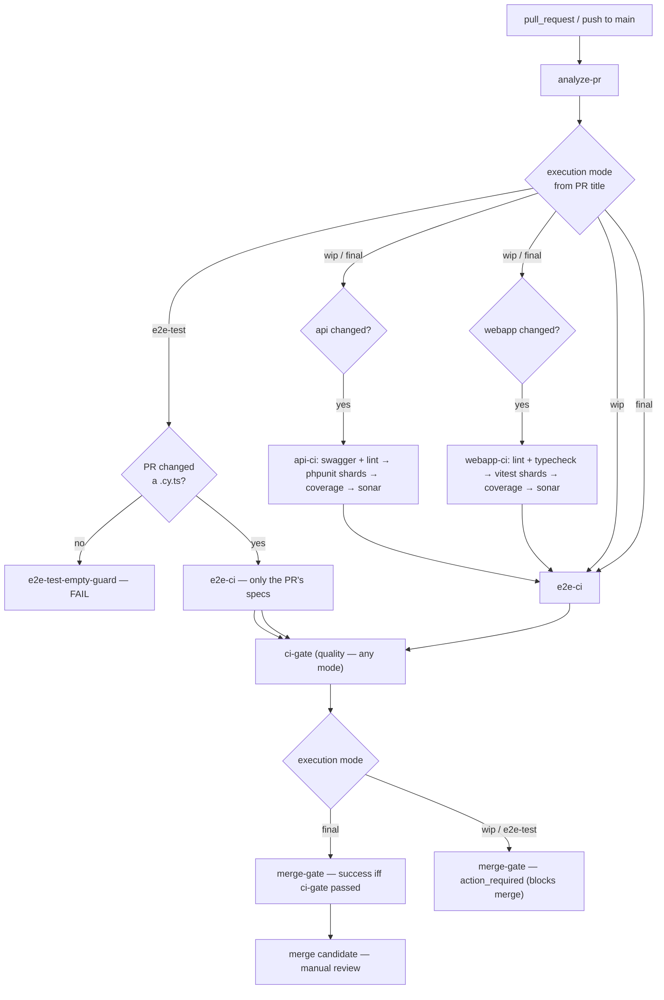

# PR CI Pipeline — one visible quality-gate DAG

SushiGo's PR validation is orchestrated by a single workflow, **`.github/workflows/ci.yml`**, so the
whole quality flow — its ordering, its fail-fast behavior, and which branches applied — is visible
as **one dependency graph in one workflow run**. See
[TD-06](../../decisions/td-06-unified-ci-dag.md) for the decision record.

`ci.yml` is the **only** PR-validation workflow. The old standalone `api-lint.yml` /
`api-swagger.yml` / `api-tests.yml` / `webapp-lint.yml` / `webapp-tests.yml` / `cypress-e2e.yml`
were removed, and `main`'s branch protection requires two contexts: **`ci-gate`** (quality — "did
everything that ran pass?", evaluated the same in every mode) and **`merge-gate`** (merge
candidacy — `success` only in final mode; posted **`action_required`** in `[wip]` / `[e2e-test]`,
which blocks merge as an "action needed" state rather than a red failure). The `_api-ci.yml` /
`_webapp-ci.yml` / `_e2e-ci.yml` files are `workflow_call` reusables that keep each surface's step
order and quality logic isolated — they are not separate runs.

---

## The one DAG



`e2e-ci` runs **targeted** Cypress in `[wip]` and the **full** suite in final — see
[E2E selection](#e2e-selection) below.

---

## Execution modes

The mode is parsed from the PR title's optional **third bracket**, after `[#NNN][x]` — from the
**title only, never the branch name** (canonical reference:
[`pull-requests.md`](./../git/pull-requests.md) → "PR Title Execution-Mode Flags"). The intended
workflow: **open the PR with `[wip]`** (or `[e2e-test]` while iterating on specs) and **drop the
bracket** when it's ready for final validation — the `edited` trigger re-runs CI in final mode. The
issue slash commands (`/start-issue`, `/issue`, `/issue-full`, `/issue-no-review`) open the PR with
`[wip]` automatically and never remove it; `/finish-pr` is what drops the bracket (its Phase 7.5a),
then waits for the final-mode run and validates it. Dropping it by hand earlier is fine too.

| Title | Mode | What runs | Mergeable? |
|---|---|---|---|
| `… [#123][a][e2e-test] - …` | **e2e-test** | Only the `.cy.ts` specs this PR added/modified. No lint, no PHPUnit, no Vitest, no coverage, no Sonar, no full Cypress. | **Never** — `merge-gate` is posted `action_required` (even if every selected spec is green). |
| `… [#123][a][wip] - …` | **wip** | Applicable `api-ci` / `webapp-ci` branches (`lint → tests → coverage → sonar`), then **targeted** Cypress by functional impact. `ci-gate` still goes green when they pass. | **Never** — `merge-gate` is posted `action_required` even if `ci-gate` and every check is green. |
| `… [#123][a] - …` (no third bracket) | **final** | All applicable `api-ci` / `webapp-ci` branches, then the **full** Cypress suite, then a green `ci-gate`, then `merge-gate` `success`. | **Yes** — the only mode `merge-gate` reports `success` in. |

`[review]` is intentionally **not** a mode: review/correction has the same CI semantics as normal
WIP.

Changed surfaces (`api`, `webapp`) and the execution mode are **independent dimensions** — a
`[wip]` PR that only touched `code/webapp/**` runs `webapp-ci` + targeted Cypress, skips `api-ci`,
and its `ci-gate` goes green when those pass; `merge-gate` is still `action_required` because it is `[wip]`,
so the PR is not mergeable.

### Title edits

`ci.yml` triggers on `pull_request` `edited` so a mode transition (`[wip]` → final) re-runs CI.
A description or label edit also re-triggers, but `analyze-pr` is cheap and every heavy branch
re-gates on `api_changed` / `webapp_changed` / `infra_changed` / `mode`, so nothing expensive runs
unless the diff warrants it; `concurrency` supersedes the previous run either way. (A debounce that
skips a pure body/label edit is possible future work — it is not a correctness requirement.)

`api-ci` runs when `mode != e2e-test` and (`api_changed` **or** `infra_changed`); `webapp-ci`
likewise with `webapp_changed`. `infra_changed` is the `analyze-pr` `infra` filter over
`docker-compose*.yml`, `docker/**`, `ci.yml`, the three reusable workflows, and
`.github/scripts/ci-analyze/**` — a change there must exercise the branches it governs, or
`ci-gate` could pass on an untested pipeline change.

---

## Quality order & fail-fast

Inside `api-ci` (`_api-ci.yml`):

```
swagger-validate ─┐
                  ├─► phpunit shards ─► coverage-merge ─► api-sonar
lint ─────────────┘                └─► junit-merge (timing summary — never a gate)
```

`api-junit-merge` (`_api-ci.yml`) and `cypress-timing` (`_e2e-ci.yml`) are reporting-only jobs with
**job-level** `continue-on-error: true` — so *any* failure inside them (a missing/failed artifact
download, the timing generator crashing) never fails `api-ci` / `e2e-ci` / `ci-gate`. Nothing gates
on a summary.

- **lint and Swagger generation both block PHPUnit.** A Pint failure or an invalid OpenAPI
  annotation stops the API branch before the shard matrix (and its Postgres containers) starts.
- `coverage-merge` runs only if every shard passed; `api-sonar` runs only if `coverage-merge`
  passed.

Inside `webapp-ci` (`_webapp-ci.yml`): `lint + typecheck → vitest shards → coverage-merge →
webapp-sonar`, same gating.

`e2e-ci` runs **after** every applicable `api-ci` / `webapp-ci` branch has passed (in `[wip]` and
final). In `[e2e-test]` it runs immediately after `analyze-pr` — there are no quality branches to
wait on.

| Mode | Failure | Effect |
|---|---|---|
| e2e-test | PR Cypress fails | `ci-gate` red. |
| e2e-test | PR Cypress passes | `ci-gate` green, `merge-gate` `action_required` — not a merge candidate. |
| wip / final | API/Webapp lint fails | Tests don't run. |
| wip / final | Tests fail | Coverage / Sonar don't run. |
| wip / final | Sonar fails | E2E doesn't run. |
| wip | Targeted E2E fails | `ci-gate` red (a real failure). |
| wip | All applicable branches green | `ci-gate` green, `merge-gate` `action_required` — not mergeable until `[wip]` is dropped. |
| final | Full E2E fails | `ci-gate` red → `merge-gate` red. |
| final | All applicable branches green | `ci-gate` green → `merge-gate` green → manual review / merge. |

---

## E2E selection

Two **different** selective Cypress behaviors — do not confuse them:

### `[e2e-test]` — exact PR Cypress files

```
pr_cypress_specs = Cypress specs added or modified by this PR
```

Deterministic, no Test Impact Analysis. **Zero changed specs → `e2e-test-empty-guard` fails the
run** with a clear message rather than reporting a misleading green no-op. `scripts-tests` is
excluded from this mode even when the PR also touched `.github/scripts/**` — `[e2e-test]` is the
Cypress-only diagnostic loop and must not run anything unrelated to the PR's own specs.

`_e2e-ci.yml`'s `plan` job fails closed whenever it resolves **zero** specs, for **any** selection
— including `full`. It is only ever called once `analyze-pr` decided there's something to run, so
an empty resolution (a stale impact-map glob, a removed spec, or an empty `cypress/e2e/`
directory) is always a bug; `ci-gate` must never approve an E2E run that executed nothing.

### `[wip]` — functional-impact targeted E2E

```
targeted_e2e_specs =
    Cypress specs added/modified in the PR
  + specs mapped from impacted API/Webapp areas via .github/e2e-impact-map.json
```

A backend/frontend change can break an existing Cypress flow even when the `.cy.*` file itself was
untouched, so WIP selection is **not** limited to changed Cypress files. The impact map
(`.github/e2e-impact-map.json`) is a list of `{ area, when: [<path globs>], run: [<spec globs>] }`.
It only ever **narrows** from the full suite when it is confident:

- If **any** changed non-spec `code/api/**` or `code/webapp/**` file matches **no** map entry →
  **full suite** (conservative fallback — never "no E2E"). It is not enough that *some* changed
  file mapped; every changed code file must.
- If the PR changed **pipeline / E2E infrastructure** — `docker-compose*.yml`, `docker/**`, the
  reusable workflows, `.github/scripts/ci-analyze/**`, or `.github/e2e-impact-map.json` (the
  `analyze-pr` job's `infra` filter) → **full suite**. Such a change can alter any flow without
  touching a `code/**` file, and it also makes `api-ci` / `webapp-ci` run so the reusable workflow
  it edited is exercised.

Two dependency-safety rules govern the map's own entries (see its `_comment`): a file with wide
blast radius — a global store like `auth.store.ts`, a model many domains hold a foreign key to —
must **not** sit in one narrow area's `when` list; leaving it unmapped routes it through the
conservative full-suite fallback above instead of silently under-covering it. And when area A's flows are a known consumer of area B's APIs/models (Employee → Attendance, Payroll;
Inventory & Product-catalog → Purchasing), area A carries an `includes: [<area>, …]` — an entry's
`includes` pulls in the *full, current* `run` set of each named area (transitively, cycle-safe), so
a shared-dependency regression can't escape targeted `[wip]` validation and the reference never
drifts stale the way a hand-copied subset does.
- Nothing E2E-relevant changed → no E2E at all.

Adding a map entry is safe: an incomplete entry just runs more specs, never fewer.

### final — full suite

The entire `cypress/e2e/**/*.cy.ts` set, split across 6 shards (unchanged from `cypress-e2e.yml`).

---

## `ci-gate` + `merge-gate` — the two stable required checks

Branch protection points at exactly two contexts, `ci-gate` and `merge-gate`. Their names never
change, so changing a shard count inside `_api-ci.yml` / `_webapp-ci.yml` / `_e2e-ci.yml` never
requires a branch-protection edit.

**`ci-gate` — quality.** "Did everything that ran pass?" Evaluated **identically in every mode**.
It **fails closed**: if `analyze-pr` did not succeed (change detection itself broke), `ci-gate` is
red regardless of anything else. Otherwise it is green when every applicable branch is `success` or
legitimately `skipped` (surface not touched, or a whole surface skipped in `[e2e-test]`), and red
when one failed. A red `ci-gate` therefore always means a real lint/test/e2e failure — it is never
red "just because the PR is `[wip]`".

**`merge-gate` — merge candidacy.** "May this PR merge right now?" It is a check run **posted via
the Checks API** (job `merge-gate-report` → `actions/github-script`), not a job exit code — so it
can carry an `action_required` conclusion, which a job exit code cannot. It is posted `success`
**only in final mode** and only iff `ci-gate` passed; `failure` in final mode if `ci-gate` failed
or if `analyze-pr` broke; and **`action_required`** in `[wip]` / `[e2e-test]` — an "action needed"
state, not a red failure X, that blocks merge. Removing the `[wip]` / `[e2e-test]` bracket re-runs
CI in final mode and `merge-gate` is re-posted `success`.

**Why `action_required` and not `neutral` or a skipped job:** GitHub's *passing* set for a
required status check is exactly `{success, skipped, neutral}` — a `neutral` conclusion, and a
job-level `if:`-skip (which reports `skipped`), both **let the merge through**. `action_required`
is the least-alarming conclusion that is *not* in that set, so it is what actually holds the merge.
See the amendment in [TD-06](../../decisions/td-06-unified-ci-dag.md).

**Same-repo PRs only.** `merge-gate-report` needs `checks: write`, which a `pull_request` run from
a **fork** never gets (read-only `GITHUB_TOKEN`). On a fork PR the job detects this, logs a
warning, and exits 0 — `merge-gate` is simply never reported and the fork PR stays unmergeable.
That is the intended outcome: dev-lab pushes workspace branches straight to this repo, and fork
contributions are not a supported path — re-push the work from a same-repo branch to land it.

---

## Documentation / config-only PRs

`analyze-pr` computes `verify_needed` = "did this PR touch **any** `code/api/**`, `code/webapp/**`,
pipeline-infra (`docker/**`, `ci.yml`, the reusable workflows, `ci-analyze`, the impact map), or
`.github/scripts/**` file?". When it is **false** — a PR that changed only `doc/**`, `*.md`,
`LICENSE`, an operational workflow like `deploy-preview.yml`, etc. — every heavy branch already
gates itself off, and in **final** mode `ci-gate` short-circuits to a fast green
("documentation/config-only PR — nothing to verify") instead of sending the arsenal to verify
nothing. (`[wip]` / `[e2e-test]` still block such a PR by their mode rule.) `verify_needed` is
computed by `.github/scripts/ci-analyze/verify-scope.js` and unit-tested.

## `scripts-tests`

A change under `.github/scripts/**` runs `scripts-tests` — `node --test` for both the test-timing
report helpers and the `ci-analyze` module. It is the only branch a test-timing-only change
triggers (it does **not** pull in `api-ci` / `webapp-ci` / `e2e-ci`). This replaces
`api-tests.yml`'s old `api-timing-script-tests` job.

---

## What stays independent

`deploy-preview.yml`, `update-iteration-progress.yml` (badge), and `wif-smoke-test.yml` are
operational workflows, not PR validation — they are **not** part of this DAG and remain
independently runnable.

---

## Local commands

The pipeline runs the same commands you run locally in dev-lab (see the workspace `CLAUDE.md`):

```bash
cd code/api    && ./vendor/bin/pint --test && php artisan l5-swagger:generate && php artisan test --coverage
cd code/webapp && npm run lint && npm run typecheck && npx vitest run --coverage
make cypress-run WORKSPACE=sushigo-a          # full Cypress suite
node --test .github/scripts/ci-analyze/tests/*.test.js   # the analyze-pr logic
```
