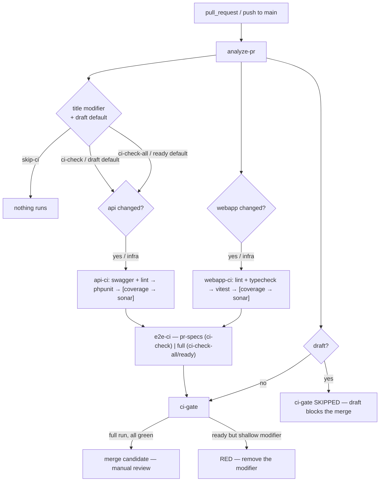

# PR CI Pipeline — one visible quality-gate DAG

SushiGo's PR validation is orchestrated by a single workflow, **`.github/workflows/ci.yml`**, so the
whole quality flow — its ordering, its fail-fast behavior, and which branches applied — is visible
as **one dependency graph in one workflow run**. See
[TD-06](../../decisions/td-06-unified-ci-dag.md) for the decision record.

`ci.yml` is the **only** PR-validation workflow. The old standalone `api-lint.yml` /
`api-swagger.yml` / `api-tests.yml` / `webapp-lint.yml` / `webapp-tests.yml` / `cypress-e2e.yml`
were removed, and `main`'s branch protection requires the single context **`ci-gate`** (nothing
else). The `_api-ci.yml` / `_webapp-ci.yml` / `_e2e-ci.yml` files are `workflow_call` reusables that
keep each surface's step order and quality logic isolated — they are not separate runs.

---

## The one DAG



`coverage → sonar` and the 4-shard split run **only** on a full-scope run (`[ci-check-all]` or a
ready PR); a `[ci-check]` / draft-default run is 1 shard, just the PR's own changed test files, no
coverage, no Sonar. See [E2E selection](#e2e-selection) below.

---

## Draft status + CI-cost modifiers

**Merge-blocking is native GitHub draft status** (#598). A draft PR cannot be merged; `ci-gate` is
*skipped* on it (a skipped required check counts as satisfied). Promote with `gh pr ready` (the
`pull_request: ready_for_review` trigger re-runs CI as the full regression); `/finish-pr` Phase
7.5a does this after stripping any modifier from the title.

Independently, an **optional CI-cost modifier bracket** in the PR title — after `[#NNN][x]`, from
the **title only, never the branch name** (canonical reference:
[`pull-requests.md`](./../git/pull-requests.md) → "PR Title CI-Cost Modifiers") — scopes how much
runs while iterating. Lint + typecheck run in every case except `[skip-ci]`.

| Title | Tests that run | `ci-gate` |
|---|---|---|
| `… [#123][a][skip-ci] - …` | nothing at all (not even lint) | skipped (draft) · **red** "remove the modifier" (ready) |
| `… [#123][a][ci-check] - …` | only the test files this PR added/modified, 1 shard, no coverage, no Sonar | skipped (draft) · **red** "remove the modifier" (ready) |
| `… [#123][a][ci-check-all] - …` | full surface suites + full Cypress + coverage + Sonar | skipped (draft) · **green** iff every branch passed (ready) |
| `… [#123][a] - …` (no modifier) | draft → `[ci-check]` (**infra change → `[ci-check-all]`**) · ready → `[ci-check-all]` | skipped (draft) · **green** iff full run passed (ready) |

`[review]` is intentionally **not** a modifier: review/correction uses the draft default. If
several modifiers appear, the **narrowest wins**: `[skip-ci]` > `[ci-check]` > `[ci-check-all]`.

Changed surfaces (`api`, `webapp`) and the cost modifier are **independent dimensions** — a draft
PR that only touched `code/webapp/**` runs `webapp-ci` (changed scope) + its changed Cypress specs
and skips `api-ci`.

### Title / draft-state edits

`ci.yml` triggers on `pull_request` `edited` (title modifier transitions) and `ready_for_review` /
`converted_to_draft` (the draft↔ready transition). `analyze-pr` is cheap and every heavy branch
re-gates on `api_changed` / `webapp_changed` / `infra_changed` and the effective scope, so nothing
expensive runs unless the diff warrants it; `concurrency` supersedes the previous run either way.

`api-ci` runs when the run is not `[skip-ci]` and (`api_changed` **or** `infra_changed`);
`webapp-ci` likewise with `webapp_changed`. `infra_changed` is the `analyze-pr` `infra` filter over
`docker-compose*.yml`, `docker/**`, `ci.yml`, the three reusable workflows, and
`.github/scripts/ci-analyze/**` — a change there must exercise the branches it governs, or
`ci-gate` could pass on an untested pipeline change. So `infra_changed` also **overrides the draft
default to `full` scope** (unless the title carries an explicit `[skip-ci]` / `[ci-check]`): an
infra change runs the full surface suites + full Cypress + Sonar even on a draft, since a shallow
run would hand the reusable workflows empty file lists and prove nothing about the pipeline edit.

---

## Quality order & fail-fast

Inside `api-ci` (`_api-ci.yml`):

```
swagger-validate ─┐
                  ├─► phpunit shards ─► coverage-merge ─► api-sonar
lint ─────────────┘                └─► junit-merge (timing summary — never a gate)
```

`api-junit-merge` (`_api-ci.yml`) and `cypress-timing` (`_e2e-ci.yml`) are reporting-only jobs with
**job-level** `continue-on-error: true` — so *any* failure inside them (a missing/failed artifact
download, the timing generator crashing) never fails `api-ci` / `e2e-ci` / `ci-gate`. Nothing gates
on a summary.

- **lint and Swagger generation both block PHPUnit.** A Pint failure or an invalid OpenAPI
  annotation stops the API branch before the shard matrix (and its Postgres containers) starts.
- On a **full-scope run only**, `coverage-merge` runs if every shard passed and `api-sonar` runs
  if `coverage-merge` passed. On a `[ci-check]` / draft-default run there is no `coverage-merge`
  and no `api-sonar` — just lint, swagger, and the PR's own changed `*Test.php` on one shard.

Inside `webapp-ci` (`_webapp-ci.yml`): `lint + typecheck → vitest → [coverage-merge → webapp-sonar]`,
same gating and the same full-scope-only coverage/Sonar.

`e2e-ci` runs **after** every applicable `api-ci` / `webapp-ci` branch has passed (or was skipped
because its surface wasn't touched).

| Case | Failure | Effect |
|---|---|---|
| any | API/Webapp lint fails | Tests don't run. |
| any | Tests fail | Coverage / Sonar don't run. |
| full run | Sonar fails | E2E doesn't run. |
| draft | any branch fails | `ci-gate` is skipped anyway (draft blocks the merge); fix and re-push. |
| ready, full | any applicable branch fails | `ci-gate` red. |
| ready, full | every applicable branch green | `ci-gate` green → manual review / merge. |
| ready, shallow modifier still on title | — | `ci-gate` red: "remove the modifier". |

---

## E2E selection

The effective E2E intent comes from `parse-mode.js`'s `resolveCi().e2eIntent` and
`select-e2e.js` maps it against the PR's changed files:

### `pr-specs` — exact PR Cypress files (draft default / `[ci-check]`)

```
pr_cypress_specs = Cypress specs added or modified by this PR
```

Deterministic, no impact analysis. **Zero changed specs → no E2E runs** (not a failure — the
retired `[e2e-test]` empty-guard is gone). A spec the PR **deleted** is dropped from the changed
list by `analyze-pr` (it's no longer in the checkout), so a deletion-only PR resolves to `none`
rather than selecting a `pr-specs` run that `_e2e-ci.yml` couldn't resolve. The reusable
`_e2e-ci.yml` is only called when `analyze-pr` resolved a non-`none` selection.

### `full` — the whole suite (ready default / `[ci-check-all]`)

The entire `cypress/e2e/**/*.cy.ts` set, split across 6 shards, run whenever any `code/**` file,
any changed `.cy.ts`, or pipeline/E2E infra changed; else no E2E. `_e2e-ci.yml`'s `plan` job fails
closed if a `full` selection ever resolves **zero** specs (a removed spec, an empty `cypress/e2e/`
directory) — `ci-gate` must never approve an E2E run that executed nothing.

There is no `targeted` selection and no `.github/e2e-impact-map.json` any more — both were tied to
the retired `[wip]` mode (#598).

---

## Cross-mode wall-clock comparison (#612)

#589's original three modes (`[e2e-test]` / `[wip]` / final) were retired by #598 before this
comparison was produced — see "Draft status + CI-cost modifiers" above. The measurement below
targets the **current** three-tier system instead: `[skip-ci]`, `[ci-check]` (draft default), and
`[ci-check-all]` (ready default). Figures are real, not synthetic — pulled from GitHub Actions job
timestamps on live runs (`gh run view --json jobs`), linked below for anyone who wants to
re-verify or refresh them.

### Total wall-clock per mode

| Mode | Representative run | Total wall-clock¹ | Dominant cost |
|---|---|---:|---|
| `[skip-ci]` (draft) | No separate draft run measured — inferred from the same `analyze-pr` job in the ready run below (9s), since `analyze-pr` has no `if` gating it on draft status or the modifier and runs identically either way; `ci-gate` is additionally skipped on a draft (`if: draft != true`), so nothing else runs | 9s | `analyze-pr` itself (checkout + change detection) — the only job that ever runs |
| `[skip-ci]` (ready, modifier still on title) | PR #661, [run 35434756712](https://github.com/pakodiazdev/sushigo/actions/runs/35434756712) — the PR's already-ready title was temporarily edited to add `[skip-ci]` to measure this row, then reverted | 15s | `ci-gate` failing red ("remove the modifier") in 3s — not a real test failure, but `analyze-pr` (9s) is still most of the wall-clock |
| `[ci-check]` (draft, webapp-only change) | PR #658, [run 35064538627](https://github.com/pakodiazdev/sushigo/actions/runs/35064538627) | 7m41s | 1 Cypress shard (`pr-specs`): 5m25s |
| `[ci-check-all]` (ready, webapp-only change, selects full E2E) | PR #658, [run 35070083374](https://github.com/pakodiazdev/sushigo/actions/runs/35070083374) | 12m46s | 6 Cypress shards (`full`), longest 7m57s (shard 2/6) |
| `[ci-check-all]` (ready, api+webapp+infra change, selects full E2E) | PR #660, [run 35279074203](https://github.com/pakodiazdev/sushigo/actions/runs/35279074203) | 12m46s | 6 Cypress shards (`full`), longest 7m53s (shard 2/6) |
| `[ci-check-all]` (ready, documentation-only change) | PR #661, [run 35311509095](https://github.com/pakodiazdev/sushigo/actions/runs/35311509095) | 15s | `analyze-pr` (10s) + `ci-gate`'s doc-only fast green (2s) — `api-ci`/`webapp-ci`/`e2e-ci` all legitimately skip (`verify_needed = false`) |

¹ First job's `startedAt` to `ci-gate`'s `completedAt`; excludes GitHub's own run-queue latency
before the first job starts, which varies with runner availability and isn't a pipeline cost.

The two api/webapp-touching `[ci-check-all]` rows land at the **same** 12m46s despite one
touching `api-ci` and the other not, but that equality doesn't mean zero marginal cost — it's two
different PRs' own totals happening to land close together, not a controlled comparison. The
precise number comes from *inside* the PR #660 run itself: `api-ci` (lint + swagger + 4-shard
phpunit + coverage + sonar) and `webapp-ci` run **in parallel**, and `api-sonar` completes at
21:57:08 vs. `webapp-sonar` at 21:56:33 — so `api-ci`, not `webapp-ci`, is what gates `e2e-plan`'s
21:57:11 start (this is why the per-mode aggregate below walks the `api-ci` chain, not
`webapp-ci`, as PR #660's critical path), a real **35s** marginal gating delay from `api-ci`'s
presence on that one run. That's the defensible number — not the ~6s a cross-PR comparison of the
`analyze-pr`-to-`e2e-plan` phase suggests (4m23s for PR #658, webapp-only, vs. 4m29s for PR #660,
api+webapp): that comparison nets two *different* PRs' own scheduling and Webapp-duration variance
together with the `api-ci` effect, so it understates it — but that 6s netted figure isn't just an
understatement, it's evidence the two runs aren't comparable enough to isolate the cost that way at
all: the slowest-Cypress-shard difference between them is only 4s (7m57s vs. 7m53s), nowhere near
enough to offset a 35s cost, so the 4s Cypress variance is not what makes the two totals land at
the same 12m46s. The gap between the 35s measured *inside* PR #660 alone and the 6s *netted across*
PR #658 and PR #660 means roughly 29s of PR #660's own `api-ci` cost was already being offset by
PR #658's and PR #660's own independent webapp-ci/scheduling variance before E2E even starts —
two different PRs, each with their own baseline timing, not a specific mechanism cancelling out the
35s. The 35s same-run figure remains the defensible per-run marginal cost; the cross-run totals
landing close together isn't a reliable way to observe it.

The full 6-shard Cypress suite is the wall-clock floor **only when the change actually selects
full E2E** (any `code/**`, changed `.cy.ts`, or pipeline/E2E-infra file) — a `[ci-check-all]` /
ready PR that touches none of those, like this very documentation PR, resolves
`e2e_selection = none` and finishes in ~15s via the documentation/config-only fast green (see
"Documentation / config-only PRs" below), not the 6-shard floor.

### Environment-startup overhead vs. actual work

**Per-mode aggregate** (what the archived task's own Objective asks for): each job on the mode's
**critical path** — the job chain that actually gates the next stage, not parallel siblings that
finish before their sibling does — is measured by its own `startedAt`/`completedAt` (the job
object's top-level fields, not the bounds of its `steps` array, which exclude GitHub's own
pre-first-step/post-last-step runner bookkeeping). Within each job, the lint/test/build/scan
command itself is classified as work; everything else in that job's own total (checkout,
`setup-node`/`setup-php`, dependency install/restore, Docker image build, Postgres boot,
Laravel/Vite health-wait, artifact upload, teardown, and the runner-acquisition/bookkeeping time
outside the visible steps) is overhead. The **dispatch/queue gap** is what's left after summing
every critical-path job's own total and subtracting from the mode's measured wall-clock — i.e. the
genuine idle time between one job finishing and the next one's own `startedAt`, not any bookkeeping
inside a job:

| Mode | Critical-path jobs | Overhead | Work | Dispatch/queue gap¹ | Overhead share of wall-clock |
|---|---|---:|---:|---:|---:|
| `[skip-ci]` (ready, PR #661, [run 35434756712](https://github.com/pakodiazdev/sushigo/actions/runs/35434756712)) | `analyze-pr` → `ci-gate` (fails shallow) | 11s | 1s | 3s | **73.3%** (11s / 15s) |
| `[ci-check]` (draft, PR #658, webapp-only) | `analyze-pr` → `webapp-lint` → `webapp-tests` → `webapp-test-count` → `e2e-plan` → `cypress-e2e-run` → `cypress-timing` | 180s | 263s | 18s | **39.0%** (180s / 461s) |
| `[ci-check-all]` (ready, PR #658, same PR, webapp-only) | `analyze-pr` → `webapp-lint` → `webapp-tests` (shard 4/4) → `webapp-coverage-merge` → `webapp-sonar` → `e2e-plan` → `cypress-e2e-run` (shard 2/6) → `cypress-timing` → `ci-gate` | 234s | 507s | 25s | **30.5%** (234s / 766s) |
| `[ci-check-all]` (ready, PR #660, api+webapp+infra) | `analyze-pr` → `api-lint` → `api-tests` (shard 4/4) → `api-coverage-merge` → `api-sonar` → `e2e-plan` → `cypress-e2e-run` (shard 2/6) → `cypress-timing` → `ci-gate` | 211s | 533s | 22s | **27.5%** (211s / 766s) |

¹ Time between a job's own `completedAt` and the next dependent job's own `startedAt` — GitHub
scheduling a fresh runner between jobs. Neither overhead nor work; included so overhead + work +
gap reconciles to the measured wall-clock.

`[skip-ci]` is the outlier: **73%** of its 15s (11s) is overhead, but almost all of it is *within*
the two jobs, not between them — `analyze-pr` itself totals 9s for ~1s of real step work, and
`ci-gate` totals 3s for ~0s of real step work, so acquiring two separate fresh runners dominates.
Because the jobs run sequentially, only 3s (20%) is genuine inter-job dispatch gap; the rest is
each job's own fixed runner-acquisition/bookkeeping cost, which this pipeline's own steps can't
shrink further. `[ci-check-all]` carries a **lower** overhead share than `[ci-check]` even on the
*same* workload — PR #658's own paired runs go from 39.0% (draft) to 30.5% (ready) — even though
both pay the same kind of fixed per-job costs: the full run's critical path does proportionally
more actual verification work (4-shard Vitest + coverage + Sonar + a full Cypress shard) for the
same handful of fixed setup steps, so the fixed cost matters less as a fraction of the total. PR
#660's ready run (api+webapp+infra, 27.5%) is consistent with this, but isn't a controlled
comparison against `[ci-check]` on its own — no draft `[ci-check]` run exists for that PR's
changed surface to pair it against, and its lower share also reflects a different, api-ci-heavier
workload, not just draft vs. ready.

**Per-job detail**, for two jobs from the PR #660 `[ci-check-all]` run above, each job's own
`startedAt`/`completedAt` against its one classified work step:

| Job | Total | Environment/stack-boot overhead | Actual work | Overhead share |
|---|---:|---|---|---:|
| `api-ci / api-lint` | 41s | 13s (checkout 2s + setup-php 3s + composer install 5s + job bookkeeping 3s) | 28s (Pint, 1346 files) | 31.7% |
| `e2e-ci / cypress-e2e-run` (shard 2/6) | 7m53s (473s) | 1m29s (89s: checkout + deps restore + Docker image build 17s + Postgres boot/wait 8s + Laravel/Vite health-wait 31s + teardown 12s + misc bookkeeping 21s) | 6m24s (384s, Cypress specs) | 18.8% |

### What this means for #491 / #559

This data reconfirms, rather than replaces, #559's own detailed per-shard analysis in
[`testing-strategy.md` → "Per-shard overhead reduction (#559)"](../testing/testing-strategy.md) —
that section already measured the fixed-overhead cuts, ruled out "more shards" as a lever (going
from 6 to 8 shards moved the slowest shard by ~1s for +33% runners), and named **duration-aware
shard balancing** as the follow-up worth doing. Two things this run's fresh numbers add:

- **Shard 2/6 is the slowest shard in both `[ci-check-all]` runs measured here** (7m57s and 7m53s,
  vs. #559's own ~6min warm baseline for the slowest shard) — the same shard index is the outlier
  across two different PRs with different diffs, which is more evidence for #559's "the split
  isn't by spec runtime" conclusion, specifically pointing at *which* shard index to look at first
  when doing the duration-aware rebalance #559 already recommends.
- The ~1m17s per-shard stack-boot overhead is paid **independently by every shard, in parallel** —
  so it doesn't add to wall-clock as shard count grows, only to total *compute* minutes (GitHub
  Actions billing). That confirms shard count is a cost lever, not a wall-clock lever — consistent
  with #559's own "more shards, rejected" finding above.
- `[ci-check]` is roughly **40% faster** wall-clock than `[ci-check-all]` (7m41s vs. 12m46s —
  `[ci-check-all]` takes about 66% longer), but **Cypress is only about half of that 305s growth,
  not almost all of it.** Decomposing PR #658's own draft→ready critical path (the same PR both
  times, so this isolates the mode change, using each job's own `startedAt`/`completedAt` so every
  delta below is on the same basis as the per-mode aggregate table above): the Cypress shard that
  gates the critical path grows from 325s (shard 1/1, `[ci-check]`) to 477s (shard 2/6,
  `[ci-check-all]`) — **+152s, 49.8%** of the 305s growth — from running the full suite instead of
  just the PR's own specs. Almost all the rest is `webapp-ci` gaining jobs and shards: dropping
  `webapp-test-count` (10s) for `webapp-coverage-merge` + `webapp-sonar` (31s + 72s) adds +93s,
  `webapp-tests` going from 1 to 4 shards adds +52s, and `webapp-lint` / `e2e-plan` /
  `cypress-timing` net out to −7s — **+138s combined, 45.2%**. `ci-gate` itself only runs on ready
  (draft skips it entirely), contributing +4s (1.3%); `analyze-pr` adds another +4s (1.3%) of
  per-job bookkeeping noise; the remaining **+7s, 2.3%**, is genuine dispatch-gap growth (18s →
  25s). So Cypress and `webapp-ci`'s own coverage/Sonar/shard growth are roughly equal
  contributors (49.8% vs. 45.2%), not Cypress alone — a further-speedups-to-the-draft-loop effort
  should weigh both, not assume Cypress alone.

---

## `ci-gate` — the one stable required check

`ci-gate` is the single context branch protection points at. Its name never changes, so changing a
shard count inside `_api-ci.yml` / `_webapp-ci.yml` / `_e2e-ci.yml` never requires a
branch-protection edit.

- **`if: !draft`** — skipped entirely on a draft PR. GitHub treats a skipped required check as
  satisfied; the draft status itself is what blocks the merge.
- **Fails closed**: if `analyze-pr` did not succeed (change detection itself broke), `ci-gate` is
  red regardless of anything else.
- **Ready PR still carrying `[skip-ci]` / `[ci-check]`** → **red** with "remove the `[skip-ci]` /
  `[ci-check]` modifier from the title to run the full regression and enable the merge". This is
  the only `ci-gate` red that is not a real test failure. `/finish-pr` Phase 7.5a strips the
  modifier before `gh pr ready`, so the promotion path never hits it.
- **Ready PR, full run** → green only when every applicable branch is `success` or legitimately
  `skipped` (surface not touched). A documentation / non-pipeline-config-only PR short-circuits to
  a fast green.

---

## Documentation / config-only PRs

`analyze-pr` computes `verify_needed` = "did this PR touch **any** `code/api/**`, `code/webapp/**`,
pipeline-infra (`docker/**`, `ci.yml`, the reusable workflows, `ci-analyze`), or `.github/scripts/**`
file?". When it is **false** — a PR that changed only `doc/**`, `*.md`, `LICENSE`, an operational
workflow like `deploy-preview.yml`, etc. — every heavy branch already gates itself off, and on a
**ready** PR `ci-gate` short-circuits to a fast green ("documentation/config-only PR — nothing to
verify"). `verify_needed` is computed by `.github/scripts/ci-analyze/verify-scope.js` and
unit-tested.

## `scripts-tests`

A change under `.github/scripts/**` (and the run is not `[skip-ci]`) runs `scripts-tests` —
`node --test` for the test-timing report helpers, the `ci-analyze` module, the sprint-audit
module, the CI badge renderer, the destructive-migration guard, and the Production release helpers
(`production-release/` — promotion guard and release-manifest validator, #636). It is the only branch a test-timing-only change triggers (it does **not** pull in
`api-ci` / `webapp-ci` / `e2e-ci`). This replaces `api-tests.yml`'s old `api-timing-script-tests`
job.

---

## `migration-guard` (PR-only, never gated)

When a PR touches `code/api/**`, `migration-guard` scans every migration the PR adds or modifies
(`.github/scripts/migration-guard/`) and annotates destructive operations in `up()` — dropped or
renamed columns/tables, column type changes (`->change()`), truncation/deletes, and destructive raw
SQL. It runs in **warn** mode and is deliberately **not** in `ci-gate`'s `needs`: a destructive
migration can be legitimate (the contract phase of expand/contract). But Production's automated
pipeline runs the same scanner in **block** mode (#636), so an unacknowledged finding stops the next
Production release — this job just makes it visible at review time. Acknowledge a genuine
contract-phase change inside the migration with `// migration-guard: allow <reason>`. See
[`deployment.md`](./deployment.md) → "Destructive migration guard".

---

## What stays independent

`deploy-preview.yml`, `deploy-production.yml`, `production-rollback.yml`,
`update-iteration-progress.yml` (badge), and `wif-smoke-test.yml` are
operational workflows, not PR validation — they are **not** part of this DAG and remain
independently runnable. See [`deployment.md`](./deployment.md) for the environment and
release-promotion contract ([TD-07](../../decisions/td-07-environment-release-promotion-contract.md))
these operational workflows implement.

---

## Local commands

The pipeline runs the same commands you run locally in dev-lab (see the workspace `CLAUDE.md`):

```bash
cd code/api    && ./vendor/bin/pint --test && php artisan l5-swagger:generate && php artisan test --coverage
cd code/webapp && npm run lint && npm run typecheck && npx vitest run --coverage
make cypress-run WORKSPACE=sushigo-a          # full Cypress suite
node --test .github/scripts/ci-analyze/tests/*.test.js   # the analyze-pr logic
```
