# 📐 Domain Model — Attendance & Payroll (SushiGo)

**Version:** 1.1
**Date:** 2026-04-21
**Base:** attendance-payroll-spec v0.8 + mvp-scope
**Status:** Active domain contract

**Changelog v1.1 (2026-04-21):** Added `EmployeeRequest` as the unified approval wrapper for all employee requests. Concrete entities (`NegotiatedExtraDay`, `Leave`, `VacationRequest`) are now created only upon approval — keeping the DB semantically clean. Approval lifecycle fields (`status`, `approved_by`, `approved_at`) removed from concrete entities and centralized in `EmployeeRequest`. Added subdomain 1.7 (Requests ER), section 2.24 (employee_requests dict), and sequence 6.5 (request lifecycle).

---

## Table of Contents

1. [Entity-Relationship Diagram (ER)](#1-entity-relationship-diagram-er)
2. [Field Dictionaries](#2-field-dictionaries)
3. [Enum Definitions](#3-enum-definitions)
4. [UML Class Diagram](#4-uml-class-diagram)
5. [State Diagrams](#5-state-diagrams)
6. [Sequence Diagrams](#6-sequence-diagrams)
7. [Integrity Rules and Constraints](#7-integrity-rules-and-constraints)

> **Subdomains:** 1.1 Employees & Config · 1.2 Daily Operations · 1.3 Leaves, Vacations & Holidays · 1.4 Payroll Close · 1.5 Punctuality Config · 1.6 Audit · **1.7 Requests (new)**

---

## 1) Entity-Relationship Diagram (ER)

### 1.1 Subdomain: Employees and Configuration

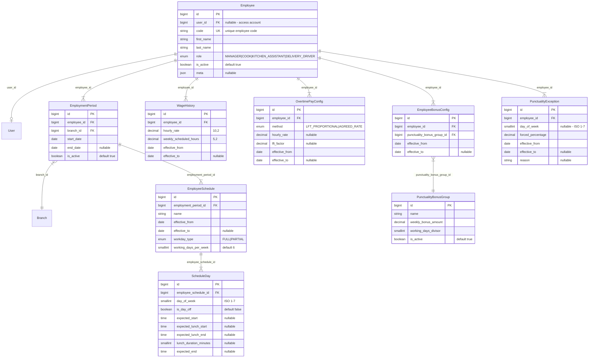
```mermaid
erDiagram
    Employee ||--o| User : "user_id"
    Employee ||--|{ EmploymentPeriod : "employee_id"
    Employee ||--|{ WageHistory : "employee_id"
    Employee ||--|{ OvertimePayConfig : "employee_id"
    Employee ||--|{ EmployeeBonusConfig : "employee_id"
    Employee ||--|{ PunctualityException : "employee_id"

    EmploymentPeriod }|--|| Branch : "branch_id"
    EmploymentPeriod ||--|{ EmployeeSchedule : "employment_period_id"

    EmployeeSchedule ||--|{ ScheduleDay : "employee_schedule_id"

    EmployeeBonusConfig }|--|| PunctualityBonusGroup : "punctuality_bonus_group_id"

    Employee {
        bigint id PK
        bigint user_id FK "nullable - access account"
        string code UK "unique employee code"
        string first_name
        string last_name
        enum role "MANAGER|COOK|KITCHEN_ASSISTANT|DELIVERY_DRIVER"
        boolean is_active "default true"
        json meta "nullable"
    }

    EmploymentPeriod {
        bigint id PK
        bigint employee_id FK
        bigint branch_id FK
        date start_date
        date end_date "nullable"
        boolean is_active "default true"
    }

    EmployeeSchedule {
        bigint id PK
        bigint employment_period_id FK
        string name
        date effective_from
        date effective_to "nullable"
        enum workday_type "FULL|PARTIAL"
        smallint working_days_per_week "default 6"
    }

    ScheduleDay {
        bigint id PK
        bigint employee_schedule_id FK
        smallint day_of_week "ISO 1-7"
        boolean is_day_off "default false"
        time expected_start "nullable"
        time expected_lunch_start "nullable"
        time expected_lunch_end "nullable"
        smallint lunch_duration_minutes "nullable"
        time expected_end "nullable"
    }

    WageHistory {
        bigint id PK
        bigint employee_id FK
        decimal hourly_rate "10,2"
        decimal weekly_scheduled_hours "5,2"
        date effective_from
        date effective_to "nullable"
    }

    OvertimePayConfig {
        bigint id PK
        bigint employee_id FK
        enum method "LFT_PROPORTIONAL|AGREED_RATE"
        decimal hourly_rate "nullable"
        decimal lft_factor "nullable"
        date effective_from
        date effective_to "nullable"
    }

    PunctualityBonusGroup {
        bigint id PK
        string name
        decimal weekly_bonus_amount
        smallint working_days_divisor
        boolean is_active "default true"
    }

    EmployeeBonusConfig {
        bigint id PK
        bigint employee_id FK
        bigint punctuality_bonus_group_id FK
        date effective_from
        date effective_to "nullable"
    }

    PunctualityException {
        bigint id PK
        bigint employee_id FK
        smallint day_of_week "nullable - ISO 1-7"
        decimal forced_percentage
        date effective_from
        date effective_to "nullable"
        string reason "nullable"
    }
```

### 1.2 Subdomain: Daily Operations

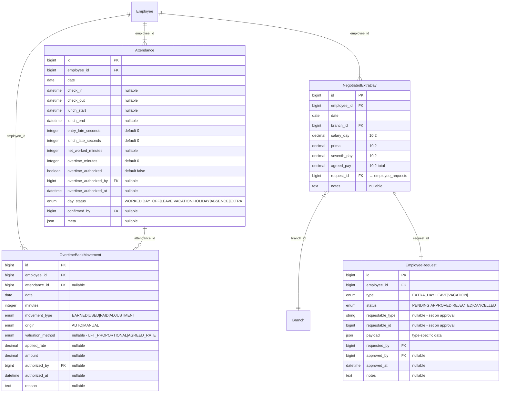
```mermaid
erDiagram
    Employee ||--|{ Attendance : "employee_id"
    Employee ||--|{ NegotiatedExtraDay : "employee_id"
    Employee ||--|{ OvertimeBankMovement : "employee_id"

    Attendance ||--o{ OvertimeBankMovement : "attendance_id"

    NegotiatedExtraDay }|--|| Branch : "branch_id"
    NegotiatedExtraDay ||--|| EmployeeRequest : "request_id"

    Attendance {
        bigint id PK
        bigint employee_id FK
        date date
        datetime check_in "nullable"
        datetime check_out "nullable"
        datetime lunch_start "nullable"
        datetime lunch_end "nullable"
        integer entry_late_seconds "default 0"
        integer lunch_late_seconds "default 0"
        integer net_worked_minutes "nullable"
        integer overtime_minutes "default 0"
        boolean overtime_authorized "default false"
        bigint overtime_authorized_by FK "nullable"
        datetime overtime_authorized_at "nullable"
        enum day_status "WORKED|DAY_OFF|LEAVE|VACATION|HOLIDAY|ABSENCE|EXTRA"
        bigint confirmed_by FK "nullable"
        json meta "nullable"
    }

    NegotiatedExtraDay {
        bigint id PK
        bigint employee_id FK
        date date
        bigint branch_id FK
        decimal salary_day "10,2"
        decimal prima "10,2"
        decimal seventh_day "10,2"
        decimal agreed_pay "10,2 total"
        bigint request_id FK "→ employee_requests"
        text notes "nullable"
    }

    EmployeeRequest {
        bigint id PK
        bigint employee_id FK
        enum type "EXTRA_DAY|LEAVE|VACATION|..."
        enum status "PENDING|APPROVED|REJECTED|CANCELLED"
        string requestable_type "nullable - set on approval"
        bigint requestable_id "nullable - set on approval"
        json payload "type-specific data"
        bigint requested_by FK
        bigint approved_by FK "nullable"
        datetime approved_at "nullable"
        text notes "nullable"
    }

    OvertimeBankMovement {
        bigint id PK
        bigint employee_id FK
        bigint attendance_id FK "nullable"
        date date
        integer minutes
        enum movement_type "EARNED|USED|PAID|ADJUSTMENT"
        enum origin "AUTO|MANUAL"
        enum valuation_method "nullable - LFT_PROPORTIONAL|AGREED_RATE"
        decimal applied_rate "nullable"
        decimal amount "nullable"
        bigint authorized_by FK "nullable"
        datetime authorized_at "nullable"
        text reason "nullable"
    }
```

### 1.3 Subdomain: Leaves, Vacations, and Holidays

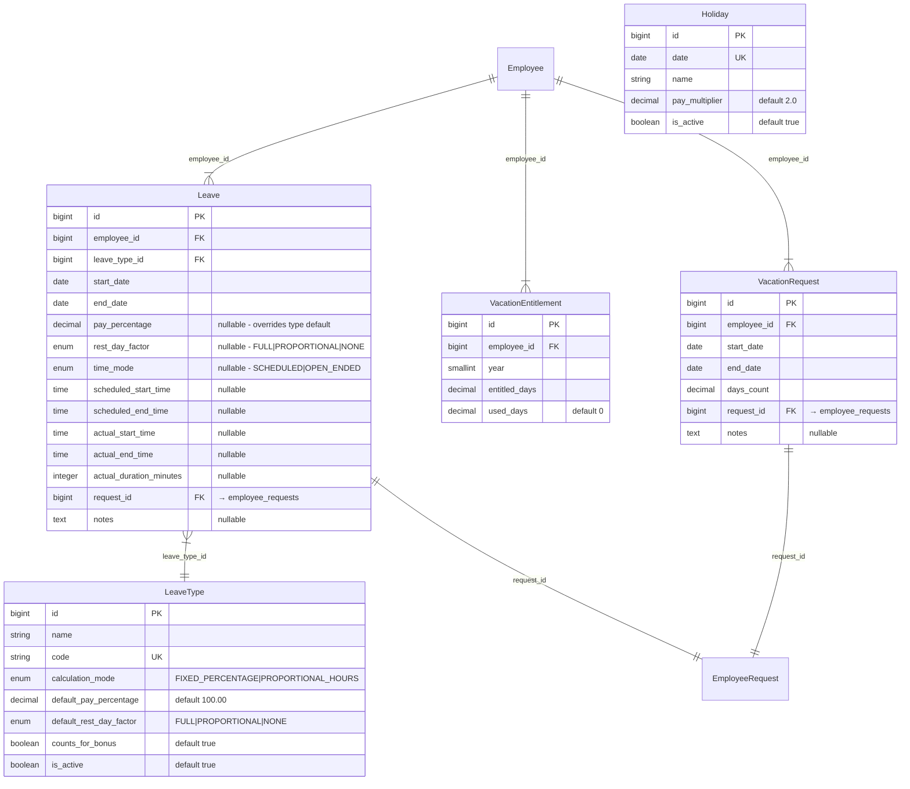
```mermaid
erDiagram
    Employee ||--|{ Leave : "employee_id"
    Employee ||--|{ VacationEntitlement : "employee_id"
    Employee ||--|{ VacationRequest : "employee_id"

    Leave }|--|| LeaveType : "leave_type_id"
    Leave ||--|| EmployeeRequest : "request_id"
    VacationRequest ||--|| EmployeeRequest : "request_id"

    LeaveType {
        bigint id PK
        string name
        string code UK
        enum calculation_mode "FIXED_PERCENTAGE|PROPORTIONAL_HOURS"
        decimal default_pay_percentage "default 100.00"
        enum default_rest_day_factor "FULL|PROPORTIONAL|NONE"
        boolean counts_for_bonus "default true"
        boolean is_active "default true"
    }

    Leave {
        bigint id PK
        bigint employee_id FK
        bigint leave_type_id FK
        date start_date
        date end_date
        decimal pay_percentage "nullable - overrides type default"
        enum rest_day_factor "nullable - FULL|PROPORTIONAL|NONE"
        enum time_mode "nullable - SCHEDULED|OPEN_ENDED"
        time scheduled_start_time "nullable"
        time scheduled_end_time "nullable"
        time actual_start_time "nullable"
        time actual_end_time "nullable"
        integer actual_duration_minutes "nullable"
        bigint request_id FK "→ employee_requests"
        text notes "nullable"
    }

    Holiday {
        bigint id PK
        date date UK
        string name
        decimal pay_multiplier "default 2.0"
        boolean is_active "default true"
    }

    VacationEntitlement {
        bigint id PK
        bigint employee_id FK
        smallint year
        decimal entitled_days
        decimal used_days "default 0"
    }

    VacationRequest {
        bigint id PK
        bigint employee_id FK
        date start_date
        date end_date
        decimal days_count
        bigint request_id FK "→ employee_requests"
        text notes "nullable"
    }
```

### 1.4 Subdomain: Payroll Close

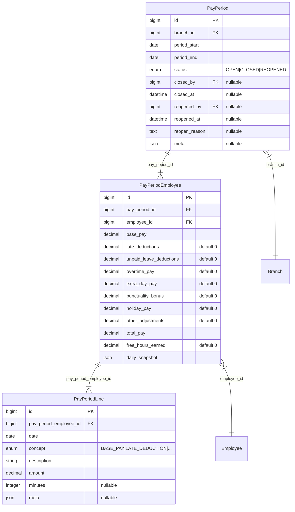
```mermaid
erDiagram
    PayPeriod ||--|{ PayPeriodEmployee : "pay_period_id"
    PayPeriodEmployee ||--|{ PayPeriodLine : "pay_period_employee_id"

    PayPeriod }|--|| Branch : "branch_id"
    PayPeriodEmployee }|--|| Employee : "employee_id"

    PayPeriod {
        bigint id PK
        bigint branch_id FK
        date period_start
        date period_end
        enum status "OPEN|CLOSED|REOPENED"
        bigint closed_by FK "nullable"
        datetime closed_at "nullable"
        bigint reopened_by FK "nullable"
        datetime reopened_at "nullable"
        text reopen_reason "nullable"
        json meta "nullable"
    }

    PayPeriodEmployee {
        bigint id PK
        bigint pay_period_id FK
        bigint employee_id FK
        decimal base_pay
        decimal late_deductions "default 0"
        decimal unpaid_leave_deductions "default 0"
        decimal overtime_pay "default 0"
        decimal extra_day_pay "default 0"
        decimal punctuality_bonus "default 0"
        decimal holiday_pay "default 0"
        decimal other_adjustments "default 0"
        decimal total_pay
        decimal free_hours_earned "default 0"
        json daily_snapshot
    }

    PayPeriodLine {
        bigint id PK
        bigint pay_period_employee_id FK
        date date
        enum concept "BASE_PAY|LATE_DEDUCTION|..."
        string description
        decimal amount
        integer minutes "nullable"
        json meta "nullable"
    }
```

### 1.5 Subdomain: Punctuality Configuration

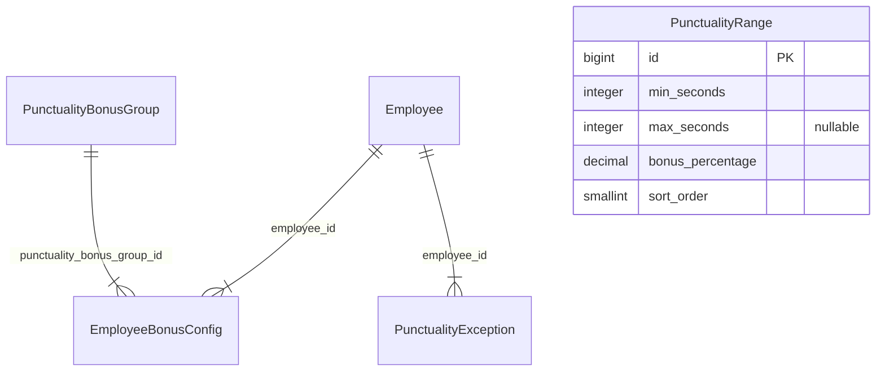
```mermaid
erDiagram
    PunctualityBonusGroup ||--|{ EmployeeBonusConfig : "punctuality_bonus_group_id"
    Employee ||--|{ EmployeeBonusConfig : "employee_id"
    Employee ||--|{ PunctualityException : "employee_id"

    PunctualityRange {
        bigint id PK
        integer min_seconds
        integer max_seconds "nullable"
        decimal bonus_percentage
        smallint sort_order
    }
```

### 1.6 Subdomain: Audit

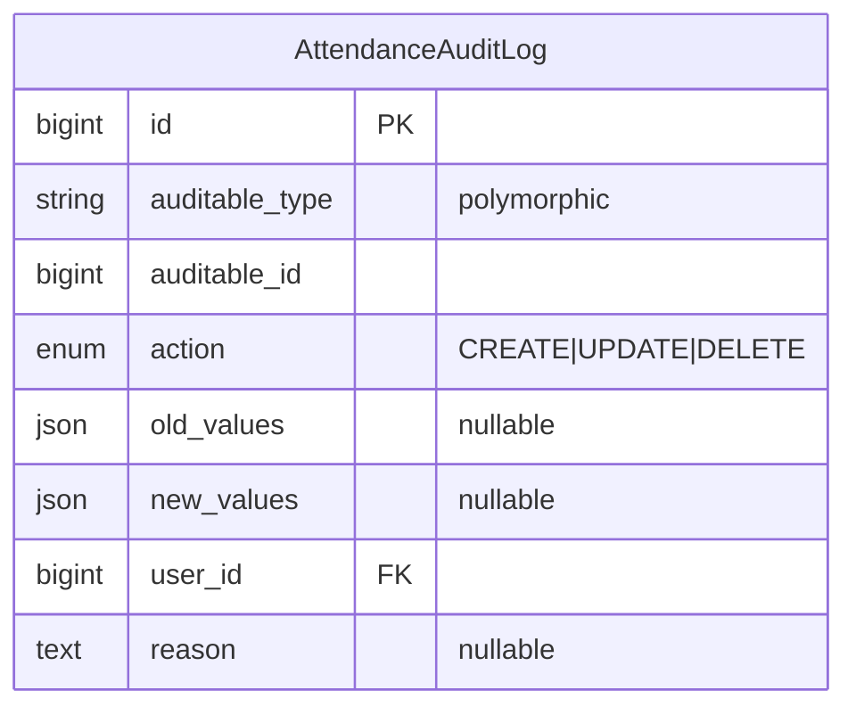
```mermaid
erDiagram
    AttendanceAuditLog {
        bigint id PK
        string auditable_type "polymorphic"
        bigint auditable_id
        enum action "CREATE|UPDATE|DELETE"
        json old_values "nullable"
        json new_values "nullable"
        bigint user_id FK
        text reason "nullable"
    }
```

### 1.7 Subdomain: Requests (Employee Requests & Approval Workflow)

> **Design decision:** `EmployeeRequest` is the unified approval wrapper for all employee requests. Concrete entities are created **only upon approval** — if a record exists in `negotiated_extra_days`, `leaves`, or `vacation_requests`, it is approved by definition. No status filtering needed on those tables.

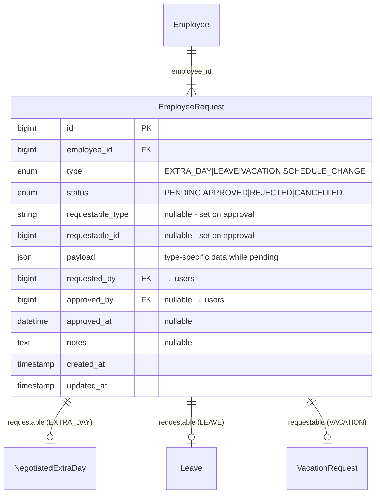
```mermaid
erDiagram
    Employee ||--|{ EmployeeRequest : "employee_id"
    EmployeeRequest ||--o| NegotiatedExtraDay : "requestable (EXTRA_DAY)"
    EmployeeRequest ||--o| Leave : "requestable (LEAVE)"
    EmployeeRequest ||--o| VacationRequest : "requestable (VACATION)"

    EmployeeRequest {
        bigint id PK
        bigint employee_id FK
        enum type "EXTRA_DAY|LEAVE|VACATION|SCHEDULE_CHANGE"
        enum status "PENDING|APPROVED|REJECTED|CANCELLED"
        string requestable_type "nullable - set on approval"
        bigint requestable_id "nullable - set on approval"
        json payload "type-specific data while pending"
        bigint requested_by FK "→ users"
        bigint approved_by FK "nullable → users"
        datetime approved_at "nullable"
        text notes "nullable"
        timestamp created_at
        timestamp updated_at
    }
```

**Lifecycle:**

```
Manager registers → EmployeeRequest{APPROVED} → concrete entity created immediately
Employee requests → EmployeeRequest{PENDING} → inbox → Manager approves → concrete entity created
                                                      → Manager rejects  → no entity created
```

**payload JSON shape by type:**

| type | payload fields |
|---|---|
| `EXTRA_DAY` | `date`, `branch_id`, `salary_pct`, `prima_pct`, `salary_day`, `prima`, `seventh_day`, `total` |
| `LEAVE` | `leave_type_id`, `start_date`, `end_date`, `pay_percentage`, `time_mode`, … |
| `VACATION` | `start_date`, `end_date`, `days_count` |

---

## 2) Field Dictionaries

### 2.1 `employees` — Employee Master Record

| Field        | Type         | Null | Default | Description                                                                 | FR    |
| ------------ | ------------ | ---- | ------- | --------------------------------------------------------------------------- | ----- |
| `id`         | bigint       | NO   | auto    | PK                                                                          | —     |
| `user_id`    | bigint FK    | YES  | NULL    | User account (→ `users`). NULL if no system access.                         | RF-01 |
| `code`       | varchar(20)  | NO   | —       | Unique employee code (e.g. "EMP-001").                                      | RF-03 |
| `first_name` | varchar(100) | NO   | —       | First name.                                                                 | RF-01 |
| `last_name`  | varchar(100) | NO   | —       | Last name.                                                                  | RF-01 |
| `role`       | enum         | NO   | —       | Functional role: `MANAGER`, `COOK`, `KITCHEN_ASSISTANT`, `DELIVERY_DRIVER`. | RF-02 |
| `is_active`  | boolean      | NO   | true    | Active in the system. `false` = deactivated (soft-delete).                  | RF-05 |
| `meta`       | json         | YES  | NULL    | Extensible metadata (phone, emergency contact, etc.).                       | RF-01 |
| `created_at` | timestamp    | NO   | now     | —                                                                           | —     |
| `updated_at` | timestamp    | NO   | now     | —                                                                           | —     |

**Constraints:** UNIQUE(`code`). INDEX(`is_active`).

---

### 2.2 `employment_periods` — Employment Periods (Employee–Branch Assignment)

| Field         | Type      | Null | Default | Description                                  | FR    |
| ------------- | --------- | ---- | ------- | -------------------------------------------- | ----- |
| `id`          | bigint    | NO   | auto    | PK                                           | —     |
| `employee_id` | bigint FK | NO   | —       | Employee.                                    | RF-06 |
| `branch_id`   | bigint FK | NO   | —       | Branch where they work (→ `branches`).       | RF-07 |
| `start_date`  | date      | NO   | —       | Start of period.                             | RF-06 |
| `end_date`    | date      | YES  | NULL    | End of period. NULL = currently active.      | RF-06 |
| `is_active`   | boolean   | NO   | true    | Active period. Only one active per employee. | RF-06 |
| `created_at`  | timestamp | NO   | now     | —                                            | —     |
| `updated_at`  | timestamp | NO   | now     | —                                            | —     |

**Business rule:** Maximum ONE active period (`is_active = true`) per `employee_id`.

---

### 2.3 `employee_schedules` — Work Schedules

| Field                   | Type         | Null | Default | Description                                           | FR    |
| ----------------------- | ------------ | ---- | ------- | ----------------------------------------------------- | ----- |
| `id`                    | bigint       | NO   | auto    | PK                                                    | —     |
| `employment_period_id`  | bigint FK    | NO   | —       | Associated employment period.                         | RF-09 |
| `effective_from`        | date         | NO   | —       | Effective start date.                                 | RF-09 |
| `effective_to`          | date         | YES  | NULL    | Effective end date. NULL = currently active.          | RF-09 |
| `workday_type`          | enum         | NO   | —       | `FULL` (full workday) or `PARTIAL` (variable).        | RF-10 |
| `working_days_per_week` | smallint     | NO   | 6       | Working days per week (base for bonus proration).     | RF-34 |
| `created_at`            | timestamp    | NO   | now     | —                                                     | —     |
| `updated_at`            | timestamp    | NO   | now     | —                                                     | —     |

---

### 2.4 `schedule_days` — Day-of-Week Definitions

| Field                  | Type      | Null | Default | Description                                   | FR    |
| ---------------------- | --------- | ---- | ------- | --------------------------------------------- | ----- |
| `id`                   | bigint    | NO   | auto    | PK                                            | —     |
| `employee_schedule_id` | bigint FK | NO   | —       | Parent schedule.                              | RF-08 |
| `day_of_week`          | smallint  | NO   | —       | ISO day: 1=Mon, 2=Tue, ..., 7=Sun.            | RF-08 |
| `is_day_off`           | boolean   | NO   | false   | Scheduled day off.                            | RF-08 |
| `expected_start`         | time      | YES  | NULL    | Expected clock-in time. NULL if `is_day_off`.                        | RF-08 |
| `expected_lunch_start`   | time      | YES  | NULL    | Expected lunch break start time.                                     | RF-08 |
| `expected_lunch_end`     | time      | YES  | NULL    | Expected lunch return time.                                          | RF-08 |
| `lunch_duration_minutes` | smallint  | YES  | NULL    | Expected lunch break duration in minutes. Used to pre-calculate expected return when actual lunch_start differs from scheduled. | RF-14 |
| `expected_end`           | time      | YES  | NULL    | Expected clock-out time.                                             | RF-08 |
| `created_at`           | timestamp | NO   | now     | —                                             | —     |
| `updated_at`           | timestamp | NO   | now     | —                                             | —     |

**Constraints:** UNIQUE(`employee_schedule_id`, `day_of_week`).

---

### 2.5 `wage_histories` — Wage History

| Field            | Type          | Null | Default | Description                                  | FR    |
| ---------------- | ------------- | ---- | ------- | -------------------------------------------- | ----- |
| `id`                      | bigint        | NO   | auto    | PK                                                                  | —          |
| `employee_id`             | bigint FK     | NO   | —       | Employee.                                                           | RF-22      |
| `hourly_rate`             | decimal(10,2) | NO   | —       | Hourly rate (atomic unit of compensation).                          | RF-22      |
| `weekly_scheduled_hours`  | decimal(5,2)  | NO   | —       | Contracted weekly hours (snapshot of active schedule).              | RF-22, RF-10 |
| `effective_from`          | date          | NO   | —       | Effective start date.                                               | RF-22      |
| `effective_to`            | date          | YES  | NULL    | Effective end date. NULL = currently active.                        | RF-22      |
| `created_at`              | timestamp     | NO   | now     | —                                                                   | —          |
| `updated_at`              | timestamp     | NO   | now     | —                                                                   | —          |

---

### 2.6 `overtime_pay_configs` — Overtime Pay Configuration per Employee

| Field            | Type          | Null | Default | Description                                                             | FR     |
| ---------------- | ------------- | ---- | ------- | ----------------------------------------------------------------------- | ------ |
| `id`             | bigint        | NO   | auto    | PK                                                                      | —      |
| `employee_id`    | bigint FK     | NO   | —       | Employee.                                                               | RF-47c |
| `method`         | enum          | NO   | —       | `LFT_PROPORTIONAL` or `AGREED_RATE`.                                    | DC-03  |
| `hourly_rate`    | decimal(10,2) | YES  | NULL    | Fixed hourly rate. Only when method = `AGREED_RATE`.                    | DC-03  |
| `lft_factor`     | decimal(5,2)  | YES  | NULL    | LFT factor (e.g. 2.00 = double). Only when method = `LFT_PROPORTIONAL`. | DC-03  |
| `effective_from` | date          | NO   | —       | Effective start date.                                                   | RF-47c |
| `effective_to`   | date          | YES  | NULL    | End date. NULL = currently active.                                      | RF-47c |
| `created_at`     | timestamp     | NO   | now     | —                                                                       | —      |
| `updated_at`     | timestamp     | NO   | now     | —                                                                       | —      |

---

### 2.7 `attendances` — Daily Attendance Record

| Field                    | Type      | Null | Default | Description                                                                          | FR            |
| ------------------------ | --------- | ---- | ------- | ------------------------------------------------------------------------------------ | ------------- |
| `id`                     | bigint    | NO   | auto    | PK                                                                                   | —             |
| `employee_id`            | bigint FK | NO   | —       | Employee.                                                                            | RF-11         |
| `date`                   | date      | NO   | —       | Work day date.                                                                       | RF-11         |
| `check_in`               | datetime  | YES  | NULL    | Actual clock-in time.                                                                | RF-11         |
| `check_out`              | datetime  | YES  | NULL    | Actual clock-out time.                                                               | RF-12         |
| `lunch_start`            | datetime  | YES  | NULL    | Lunch break start (optional).                                                        | RF-14         |
| `lunch_end`              | datetime  | YES  | NULL    | Lunch break return.                                                                  | RF-15a        |
| `entry_late_seconds`     | integer   | NO   | 0       | Entry tardiness in seconds (calculated: check_in − expected_start). 0 if on time.    | RF-13, RF-15a |
| `lunch_late_seconds`     | integer   | NO   | 0       | Lunch return tardiness in seconds (calculated: lunch_end − expected_lunch_end).      | RF-15a        |
| `net_worked_minutes`     | integer   | YES  | NULL    | Net minutes worked (excluding lunch). Calculated.                                    | RF-14         |
| `overtime_minutes`       | integer   | NO   | 0       | Extra minutes worked (check_out − expected_end).                                     | RF-42         |
| `overtime_authorized`    | boolean   | NO   | false   | Did Manager authorize overtime pay?                                                  | DC-01, RF-47a |
| `overtime_authorized_by` | bigint FK | YES  | NULL    | User who authorized (→ `users`).                                                     | RF-47b        |
| `overtime_authorized_at` | datetime  | YES  | NULL    | When it was authorized.                                                              | RF-47b        |
| `day_status`             | enum      | NO   | —       | Day status: `WORKED`, `DAY_OFF`, `LEAVE`, `VACATION`, `HOLIDAY`, `ABSENCE`, `EXTRA`. | RF-16         |
| `confirmed_by`           | bigint FK | YES  | NULL    | User who confirmed the status (→ `users`).                                           | RF-15         |
| `meta`                   | json      | YES  | NULL    | Additional data.                                                                     | —             |
| `created_at`             | timestamp | NO   | now     | —                                                                                    | —             |
| `updated_at`             | timestamp | NO   | now     | —                                                                                    | —             |

**Constraints:** UNIQUE(`employee_id`, `date`). INDEX(`date`). INDEX(`day_status`).

---

### 2.8 `partial_leaves` — ~~Deprecated~~

> **Merged into `leaves` (section 2.12).** Partial/hourly leaves (previously recorded here as ARRIVE_LATE, LEAVE_EARLY, TAKE_TIME) are now `Leave` records whose `LeaveType.calculation_mode = PROPORTIONAL_HOURS`. The `time_mode`, `scheduled_start_time`, `scheduled_end_time`, `actual_start_time`, `actual_end_time`, and `actual_duration_minutes` fields on `leaves` cover all sub-day scenarios.

---

### 2.9 `negotiated_extra_days` — Negotiated Extra Days

> **v1.1:** Records exist only in approved state. Approval lifecycle (`status`, `approved_by`, `approved_at`) is managed by `EmployeeRequest`. `agreed_pay` was split into three components for payroll line-item breakdown.

| Field         | Type          | Null | Default | Description                                         | FR           |
| ------------- | ------------- | ---- | ------- | --------------------------------------------------- | ------------ |
| `id`          | bigint        | NO   | auto    | PK                                                  | —            |
| `employee_id` | bigint FK     | NO   | —       | Employee.                                           | RF-38        |
| `date`        | date          | NO   | —       | Extra day date.                                     | RF-39        |
| `branch_id`   | bigint FK     | NO   | —       | Branch where they worked.                           | RF-39        |
| `salary_day`  | decimal(10,2) | NO   | —       | Salary component (agreed daily wage).               | RF-39, RN-10 |
| `prima`       | decimal(10,2) | NO   | —       | Rest-day premium component.                         | RF-39, RN-10 |
| `seventh_day` | decimal(10,2) | NO   | —       | Seventh-day component (séptimo día): 1/6 of weekly salary. For 6-day schedules this equals `salary_day` (weekly = salary_day × 6, so weekly / 6 = salary_day). | RF-39        |
| `agreed_pay`  | decimal(10,2) | NO   | —       | Total agreed pay (= salary_day + prima + seventh_day). | RF-39, RN-10 |
| `request_id`  | bigint FK     | NO   | —       | Originating request (→ `employee_requests`).        | RF-39, RN-09 |
| `notes`       | text          | YES  | NULL    | Notes/observations.                                 | RF-39        |
| `created_at`  | timestamp     | NO   | now     | —                                                   | —            |
| `updated_at`  | timestamp     | NO   | now     | —                                                   | —            |

**Constraints:** UNIQUE(`employee_id`, `date`). INDEX(`request_id`).

---

### 2.10 `overtime_bank_movements` — Overtime Bank Movements

| Field              | Type          | Null | Default | Description                                                            | FR            |
| ------------------ | ------------- | ---- | ------- | ---------------------------------------------------------------------- | ------------- |
| `id`               | bigint        | NO   | auto    | PK                                                                     | —             |
| `employee_id`      | bigint FK     | NO   | —       | Employee.                                                              | RF-42         |
| `attendance_id`    | bigint FK     | YES  | NULL    | Reference to the attendance record (for automatic EARNED/PAID).        | RF-47b        |
| `date`             | date          | NO   | —       | Movement date.                                                         | RF-45         |
| `minutes`          | integer       | NO   | —       | Movement minutes (always positive; type indicates direction).          | RF-45         |
| `movement_type`    | enum          | NO   | —       | `EARNED`, `USED`, `PAID`, `ADJUSTMENT`.                                | RF-44         |
| `origin`           | enum          | NO   | —       | `AUTO` (system) or `MANUAL` (manual entry).                            | RF-43, RF-45  |
| `valuation_method` | enum          | YES  | NULL    | Valuation method (only for `PAID`): `LFT_PROPORTIONAL`, `AGREED_RATE`. | RF-47b, DC-03 |
| `applied_rate`     | decimal(10,2) | YES  | NULL    | Applied rate (only for `PAID`).                                        | RF-47b        |
| `amount`           | decimal(10,2) | YES  | NULL    | Resulting amount (only for `PAID`).                                    | RF-47b        |
| `authorized_by`    | bigint FK     | YES  | NULL    | Who authorized (→ `users`).                                            | RF-45, RF-47a |
| `authorized_at`    | datetime      | YES  | NULL    | When it was authorized.                                                | RF-47a        |
| `reason`           | text          | YES  | NULL    | Movement reason/justification.                                         | RF-45         |
| `created_at`       | timestamp     | NO   | now     | —                                                                      | —             |
| `updated_at`       | timestamp     | NO   | now     | —                                                                      | —             |

---

### 2.11 `leave_types` — Leave Type Catalog

| Field                      | Type         | Null | Default              | Description                                                                                                                     | FR    |
| -------------------------- | ------------ | ---- | -------------------- | ------------------------------------------------------------------------------------------------------------------------------- | ----- |
| `id`                       | bigint       | NO   | auto                 | PK                                                                                                                              | —     |
| `name`                     | varchar(100) | NO   | —                    | Leave type name.                                                                                                                | RF-24 |
| `code`                     | varchar(30)  | NO   | —                    | Unique code (e.g. `MEDICAL`, `PERSONAL`, `PERMISSION`).                                                                         | RF-24 |
| `calculation_mode`         | enum         | NO   | `FIXED_PERCENTAGE`   | `FIXED_PERCENTAGE` — admin sets explicit pay %; `PROPORTIONAL_HOURS` — deduction proportional to hours taken.                  | RF-24 |
| `default_pay_percentage`   | decimal(5,2) | NO   | 100.00               | Default pay % (0–100) for instances. Only used when `calculation_mode = FIXED_PERCENTAGE`. Overridable per leave instance.      | RF-24 |
| `default_rest_day_factor`  | enum         | NO   | `PROPORTIONAL`       | Default rest-day impact: `FULL` (full 1/6 regardless of pay %), `PROPORTIONAL` (scaled by pay % or hours ratio), `NONE` (zero). | RF-24 |
| `counts_for_bonus`         | boolean      | NO   | true                 | Does this leave type count toward the punctuality bonus?                                                                        | RF-24 |
| `is_active`                | boolean      | NO   | true                 | Active in catalog.                                                                                                              | RF-24 |
| `created_at`               | timestamp    | NO   | now                  | —                                                                                                                               | —     |
| `updated_at`               | timestamp    | NO   | now                  | —                                                                                                                               | —     |

**Constraints:** UNIQUE(`code`).

**Default seeded types:**

| code | name | calculation_mode | default_pay_percentage | default_rest_day_factor |
|---|---|---|---|---|
| `MEDICAL` | Incapacidad médica | `FIXED_PERCENTAGE` | 0.00 | `NONE` |
| `PERSONAL` | Permiso personal | `FIXED_PERCENTAGE` | 0.00 | `NONE` |
| `PERMISSION_PAID` | Permiso con goce | `FIXED_PERCENTAGE` | 100.00 | `FULL` |
| `PERMISSION_HOURS` | Permiso por horas | `PROPORTIONAL_HOURS` | — | `PROPORTIONAL` |

---

### 2.12 `leaves` — Leave Records (Full Day, Range, or Partial Hours)

> **v1.1:** Records exist only in approved state. Approval lifecycle (`status`, `requested_by`, `approved_by`, `approved_at`) is managed by `EmployeeRequest`. `request_id` provides traceability to the originating request.

| Field                     | Type          | Null | Default | Description                                                                                                                         | FR     |
| ------------------------- | ------------- | ---- | ------- | ----------------------------------------------------------------------------------------------------------------------------------- | ------ |
| `id`                      | bigint        | NO   | auto    | PK                                                                                                                                  | —      |
| `employee_id`             | bigint FK     | NO   | —       | Employee.                                                                                                                           | RF-25  |
| `leave_type_id`           | bigint FK     | NO   | —       | Leave type from catalog.                                                                                                            | RF-25  |
| `start_date`              | date          | NO   | —       | Start date (= end_date for partial/hourly leaves).                                                                                  | RF-25  |
| `end_date`                | date          | NO   | —       | End date (= start_date if single day or partial).                                                                                   | RF-25  |
| `pay_percentage`          | decimal(5,2)  | YES  | NULL    | Pay % override for this instance (0–100). NULL = use `leave_types.default_pay_percentage`. Only for `FIXED_PERCENTAGE` types.       | RF-25  |
| `rest_day_factor`         | enum          | YES  | NULL    | Rest-day impact override: `FULL`, `PROPORTIONAL`, or `NONE`. NULL = use `leave_types.default_rest_day_factor`.                      | RF-25  |
| `time_mode`               | enum          | YES  | NULL    | `SCHEDULED` or `OPEN_ENDED`. Required for `PROPORTIONAL_HOURS` types. `SCHEDULED` = known start+end; `OPEN_ENDED` = start only.    | RF-25a |
| `scheduled_start_time`    | time          | YES  | NULL    | Planned departure time. Required when `time_mode` is set.                                                                           | RF-25a |
| `scheduled_end_time`      | time          | YES  | NULL    | Planned return time. NULL when `time_mode = OPEN_ENDED`.                                                                            | RF-25a |
| `actual_start_time`       | time          | YES  | NULL    | Actual departure recorded from Today view.                                                                                          | RF-25a |
| `actual_end_time`         | time          | YES  | NULL    | Actual return recorded from Today view. NULL if employee did not return.                                                            | RF-25a |
| `actual_duration_minutes` | integer       | YES  | NULL    | Minutes away from work. Computed from actual times; falls back to scheduled times. Used for payroll deduction.                      | RF-25a |
| `request_id`              | bigint FK     | NO   | —       | Originating request (→ `employee_requests`).                                                                                        | RF-25  |
| `notes`                   | text          | YES  | NULL    | Notes / justification.                                                                                                              | RF-25  |
| `created_at`              | timestamp     | NO   | now     | —                                                                                                                                   | —      |
| `updated_at`              | timestamp     | NO   | now     | —                                                                                                                                   | —      |

**Business rules:**
- `pay_percentage` and `rest_day_factor` on the instance always override the type defaults when not NULL.
- For `PROPORTIONAL_HOURS` leaves: payroll deduction = `actual_duration_minutes / scheduled_work_minutes × daily_wage`.
- For `FIXED_PERCENTAGE` leaves: payroll = `pay_percentage / 100 × daily_wage` per day in range.
- `actual_start_time` and `actual_end_time` are filled from the Today attendance view.

---

### 2.13 `holidays` — Holiday Catalog

| Field            | Type         | Null | Default | Description                                     | FR    |
| ---------------- | ------------ | ---- | ------- | ----------------------------------------------- | ----- |
| `id`             | bigint       | NO   | auto    | PK                                              | —     |
| `date`           | date         | NO   | —       | Holiday date.                                   | RF-29 |
| `name`           | varchar(100) | NO   | —       | Holiday name.                                   | RF-29 |
| `pay_multiplier` | decimal(3,1) | NO   | 2.0     | Pay factor: 1.0 normal, 2.0 double, 3.0 triple. | RF-30 |
| `is_active`      | boolean      | NO   | true    | Active.                                         | RF-29 |
| `created_at`     | timestamp    | NO   | now     | —                                               | —     |
| `updated_at`     | timestamp    | NO   | now     | —                                               | —     |

**Constraints:** UNIQUE(`date`).

---

### 2.14 `vacation_entitlements` — Vacation Entitlements

| Field           | Type         | Null | Default | Description                                    | FR    |
| --------------- | ------------ | ---- | ------- | ---------------------------------------------- | ----- |
| `id`            | bigint       | NO   | auto    | PK                                             | —     |
| `employee_id`   | bigint FK    | NO   | —       | Employee.                                      | RF-26 |
| `year`          | smallint     | NO   | —       | Corresponding year.                            | RF-26 |
| `entitled_days` | decimal(5,2) | NO   | —       | Vacation days entitled (MX Federal Labor Law). | RF-26 |
| `used_days`     | decimal(5,2) | NO   | 0.00    | Days used.                                     | RF-26 |
| `created_at`    | timestamp    | NO   | now     | —                                              | —     |
| `updated_at`    | timestamp    | NO   | now     | —                                              | —     |

**Constraints:** UNIQUE(`employee_id`, `year`).

**Computed column (app-level):** `remaining_days = entitled_days − used_days`.

---

### 2.15 `vacation_requests` — Approved Vacation Periods

> **v1.1:** Records exist only in approved state. Approval lifecycle is managed by `EmployeeRequest`. Renamed conceptually from "request" to "approved vacation period" — the name is kept for DB compatibility.

| Field         | Type         | Null | Default | Description                                          | FR    |
| ------------- | ------------ | ---- | ------- | ---------------------------------------------------- | ----- |
| `id`          | bigint       | NO   | auto    | PK                                                   | —     |
| `employee_id` | bigint FK    | NO   | —       | Employee.                                            | RF-27 |
| `start_date`  | date         | NO   | —       | Start date.                                          | RF-27 |
| `end_date`    | date         | NO   | —       | End date.                                            | RF-27 |
| `days_count`  | decimal(5,2) | NO   | —       | Vacation days approved.                              | RF-27 |
| `request_id`  | bigint FK    | NO   | —       | Originating request (→ `employee_requests`).         | RF-27 |
| `notes`       | text         | YES  | NULL    | Notes.                                               | RF-27 |
| `created_at`  | timestamp    | NO   | now     | —                                                    | —     |
| `updated_at`  | timestamp    | NO   | now     | —                                                    | —     |

---

### 2.16 `punctuality_ranges` — Punctuality Bonus Ranges

| Field              | Type         | Null | Default | Description                                        | FR    |
| ------------------ | ------------ | ---- | ------- | -------------------------------------------------- | ----- |
| `id`               | bigint       | NO   | auto    | PK                                                 | —     |
| `min_seconds`      | integer      | NO   | —       | Lower bound of range (inclusive).                  | RF-32 |
| `max_seconds`      | integer      | YES  | NULL    | Upper bound (exclusive). NULL = no limit (26:00+). | RF-32 |
| `bonus_percentage` | decimal(5,2) | NO   | —       | Applicable bonus percentage.                       | RF-32 |
| `sort_order`       | smallint     | NO   | —       | Evaluation order.                                  | RF-32 |
| `created_at`       | timestamp    | NO   | now     | —                                                  | —     |
| `updated_at`       | timestamp    | NO   | now     | —                                                  | —     |

---

### 2.17 `punctuality_bonus_groups` — Punctuality Bonus Groups

| Field                  | Type          | Null | Default | Description                                                | FR    |
| ---------------------- | ------------- | ---- | ------- | ---------------------------------------------------------- | ----- |
| `id`                   | bigint        | NO   | auto    | PK                                                         | —     |
| `name`                 | varchar(50)   | NO   | —       | Group name (e.g. "Group $110", "Group $100", "Group $50"). | RF-33 |
| `weekly_bonus_amount`  | decimal(10,2) | NO   | —       | Weekly base bonus amount.                                  | RF-33 |
| `working_days_divisor` | smallint      | NO   | —       | Divisor for daily proration (e.g. 6 or 3).                 | RF-34 |
| `is_active`            | boolean       | NO   | true    | Active.                                                    | RF-33 |
| `created_at`           | timestamp     | NO   | now     | —                                                          | —     |
| `updated_at`           | timestamp     | NO   | now     | —                                                          | —     |

---

### 2.18 `employee_bonus_configs` — Employee → Bonus Group Assignment

| Field                        | Type      | Null | Default | Description                                  | FR    |
| ---------------------------- | --------- | ---- | ------- | -------------------------------------------- | ----- |
| `id`                         | bigint    | NO   | auto    | PK                                           | —     |
| `employee_id`                | bigint FK | NO   | —       | Employee.                                    | RF-33 |
| `punctuality_bonus_group_id` | bigint FK | NO   | —       | Assigned bonus group.                        | RF-33 |
| `effective_from`             | date      | NO   | —       | Effective start date.                        | RF-33 |
| `effective_to`               | date      | YES  | NULL    | Effective end date. NULL = currently active. | RF-33 |
| `created_at`                 | timestamp | NO   | now     | —                                            | —     |
| `updated_at`                 | timestamp | NO   | now     | —                                            | —     |

---

### 2.19 `punctuality_exceptions` — Per-Employee Punctuality Exceptions

| Field               | Type         | Null | Default | Description                                           | FR    |
| ------------------- | ------------ | ---- | ------- | ----------------------------------------------------- | ----- |
| `id`                | bigint       | NO   | auto    | PK                                                    | —     |
| `employee_id`       | bigint FK    | NO   | —       | Employee.                                             | RF-37 |
| `day_of_week`       | smallint     | YES  | NULL    | ISO day (1-7). NULL = applies every day.              | RF-37 |
| `forced_percentage` | decimal(5,2) | NO   | —       | Forced percentage (e.g. 0.00 for Andrea Tue/Wed/Thu). | RF-37 |
| `effective_from`    | date         | NO   | —       | Effective start date.                                 | RF-37 |
| `effective_to`      | date         | YES  | NULL    | End. NULL = currently active.                         | RF-37 |
| `reason`            | varchar(255) | YES  | NULL    | Exception reason.                                     | RF-37 |
| `created_at`        | timestamp    | NO   | now     | —                                                     | —     |
| `updated_at`        | timestamp    | NO   | now     | —                                                     | —     |

---

### 2.20 `pay_periods` — Pay Periods (Weekly Close)

| Field           | Type      | Null | Default | Description                   | FR           |
| --------------- | --------- | ---- | ------- | ----------------------------- | ------------ |
| `id`            | bigint    | NO   | auto    | PK                            | —            |
| `branch_id`     | bigint FK | NO   | —       | Branch.                       | RF-20        |
| `period_start`  | date      | NO   | —       | Period start (Monday).        | RF-20        |
| `period_end`    | date      | NO   | —       | Period end (Sunday).          | RF-20        |
| `status`        | enum      | NO   | `OPEN`  | `OPEN`, `CLOSED`, `REOPENED`. | RF-20, RF-21 |
| `closed_by`     | bigint FK | YES  | NULL    | Who closed (→ `users`).       | RF-20        |
| `closed_at`     | datetime  | YES  | NULL    | When it was closed.           | RF-20        |
| `reopened_by`   | bigint FK | YES  | NULL    | Who reopened (→ `users`).     | RF-21        |
| `reopened_at`   | datetime  | YES  | NULL    | When it was reopened.         | RF-21        |
| `reopen_reason` | text      | YES  | NULL    | Reopen reason.                | RF-21        |
| `meta`          | json      | YES  | NULL    | Additional data.              | —            |
| `created_at`    | timestamp | NO   | now     | —                             | —            |
| `updated_at`    | timestamp | NO   | now     | —                             | —            |

**Constraints:** UNIQUE(`branch_id`, `period_start`, `period_end`).

---

### 2.21 `pay_period_employees` — Per-Employee Snapshot at Close

| Field                     | Type          | Null | Default | Description                               | FR     |
| ------------------------- | ------------- | ---- | ------- | ----------------------------------------- | ------ |
| `id`                      | bigint        | NO   | auto    | PK                                        | —      |
| `pay_period_id`           | bigint FK     | NO   | —       | Pay period.                               | RF-20  |
| `employee_id`             | bigint FK     | NO   | —       | Employee.                                 | RF-49  |
| `base_pay`                | decimal(10,2) | NO   | —       | Period base pay.                          | RF-23  |
| `late_deductions`         | decimal(10,2) | NO   | 0.00    | Total deductions for tardiness >30 min.   | RN-00  |
| `unpaid_leave_deductions` | decimal(10,2) | NO   | 0.00    | Total deductions for unpaid leaves.       | RN-00d |
| `overtime_pay`            | decimal(10,2) | NO   | 0.00    | Total authorized overtime pay.            | RF-47b |
| `extra_day_pay`           | decimal(10,2) | NO   | 0.00    | Total negotiated extra day pay.           | RF-41  |
| `punctuality_bonus`       | decimal(10,2) | NO   | 0.00    | Total punctuality bonus.                  | RF-34  |
| `holiday_pay`             | decimal(10,2) | NO   | 0.00    | Extra pay for holidays worked.            | RF-31  |
| `other_adjustments`       | decimal(10,2) | NO   | 0.00    | Other adjustments (positive or negative). | —      |
| `total_pay`               | decimal(10,2) | NO   | —       | **Total payable** (sum of all items).     | RF-49  |
| `free_hours_earned`       | decimal(4,2)  | NO   | 0.00    | Free hours earned for punctuality.        | RF-36  |
| `daily_snapshot`          | json          | NO   | —       | Frozen daily evidence (day-by-day table). | RF-20  |
| `created_at`              | timestamp     | NO   | now     | —                                         | —      |
| `updated_at`              | timestamp     | NO   | now     | —                                         | —      |

**Constraints:** UNIQUE(`pay_period_id`, `employee_id`).

**`total_pay` formula:**
```
total_pay = base_pay
          - late_deductions
          - unpaid_leave_deductions
          + overtime_pay
          + extra_day_pay
          + punctuality_bonus
          + holiday_pay
          + other_adjustments
```

---

### 2.22 `pay_period_lines` — Close Detail Lines

| Field                    | Type          | Null | Default | Description                                | FR    |
| ------------------------ | ------------- | ---- | ------- | ------------------------------------------ | ----- |
| `id`                     | bigint        | NO   | auto    | PK                                         | —     |
| `pay_period_employee_id` | bigint FK     | NO   | —       | Employee snapshot.                         | RF-49 |
| `date`                   | date          | NO   | —       | Date the line corresponds to.              | RF-49 |
| `concept`                | enum          | NO   | —       | Concept (see enum below).                  | RF-49 |
| `description`            | varchar(255)  | NO   | —       | Human-readable description.                | RF-49 |
| `amount`                 | decimal(10,2) | NO   | —       | Amount (negative for deductions).          | RF-49 |
| `minutes`                | integer       | YES  | NULL    | Related minutes (for time-based concepts). | RF-49 |
| `meta`                   | json          | YES  | NULL    | Additional context (rate, method, etc.).   | RF-49 |
| `created_at`             | timestamp     | NO   | now     | —                                          | —     |
| `updated_at`             | timestamp     | NO   | now     | —                                          | —     |

---

### 2.23 `employee_requests` — Employee Request & Approval Wrapper

> Unified approval entity. Holds the request in pending state (payload JSON) until the manager approves or rejects. On approval, the concrete entity is created and `requestable_type / requestable_id` are assigned.

| Field              | Type         | Null | Default   | Description                                                              | RF    |
| ------------------ | ------------ | ---- | --------- | ------------------------------------------------------------------------ | ----- |
| `id`               | bigint       | NO   | auto      | PK                                                                       | —     |
| `employee_id`      | bigint FK    | NO   | —         | Employee the request is for (→ `employees`).                             | RF-38 |
| `type`             | enum         | NO   | —         | `EXTRA_DAY`, `LEAVE`, `VACATION`, `SCHEDULE_CHANGE`.                     | —     |
| `status`           | enum         | NO   | `PENDING` | `PENDING`, `APPROVED`, `REJECTED`, `CANCELLED`.                          | RN-09 |
| `requestable_type` | varchar(100) | YES  | NULL      | Polymorphic model class. Set on approval (e.g. `NegotiatedExtraDay`).    | —     |
| `requestable_id`   | bigint       | YES  | NULL      | FK to concrete entity. Set on approval.                                  | —     |
| `payload`          | json         | NO   | —         | Type-specific data while pending. Consumed by handler on approval.       | —     |
| `requested_by`     | bigint FK    | NO   | —         | User who created the request (→ `users`).                                | RF-38 |
| `approved_by`      | bigint FK    | YES  | NULL      | User who approved or rejected (→ `users`). On manager auto-approval, set to the manager's user id (= `requested_by`). | RN-09 |
| `approved_at`      | datetime     | YES  | NULL      | When approved or rejected.                                               | —     |
| `notes`            | text         | YES  | NULL      | Notes / justification.                                                   | —     |
| `created_at`       | timestamp    | NO   | now       | —                                                                        | —     |
| `updated_at`       | timestamp    | NO   | now       | —                                                                        | —     |

**Constraints:** INDEX(`employee_id`, `status`). INDEX(`requestable_type`, `requestable_id`). INDEX(`type`, `status`).

**Business rules:**
- When `requested_by = manager` and `type = EXTRA_DAY`: status is set to `APPROVED` at creation (auto-approval). Concrete entity is created in the same transaction.
- `requestable_type` and `requestable_id` are NULL while `status = PENDING` or `REJECTED`. Set only on `APPROVED`.
- Rejecting a request never creates a concrete entity.
- **Cancelling an APPROVED request deletes the associated concrete entity (requestable) and nullifies `requestable_type`/`requestable_id` in the same transaction.** This preserves the "existence = approved" invariant on concrete entity tables. An audit log entry must be created.

---

### 2.24 `attendance_audit_logs` — Change Audit Log

| Field            | Type         | Null | Default | Description                                                  | FR    |
| ---------------- | ------------ | ---- | ------- | ------------------------------------------------------------ | ----- |
| `id`             | bigint       | NO   | auto    | PK                                                           | —     |
| `auditable_type` | varchar(100) | NO   | —       | Model type (polymorphic, e.g. `Attendance`, `PartialLeave`). | RF-19 |
| `auditable_id`   | bigint       | NO   | —       | Modified record ID.                                          | RF-19 |
| `action`         | enum         | NO   | —       | `CREATE`, `UPDATE`, `DELETE`.                                | RF-19 |
| `old_values`     | json         | YES  | NULL    | Values before the change.                                    | RF-19 |
| `new_values`     | json         | YES  | NULL    | Values after the change.                                     | RF-19 |
| `user_id`        | bigint FK    | NO   | —       | Who made the change (→ `users`).                             | RF-19 |
| `reason`         | text         | YES  | NULL    | Change justification.                                        | RF-19 |
| `created_at`     | timestamp    | NO   | now     | —                                                            | —     |

---

## 3) Enum Definitions

### 3.1 Domain Enums

| Enum                        | Values                                                                                                          | Used in                                                                   |
| --------------------------- | --------------------------------------------------------------------------------------------------------------- | ------------------------------------------------------------------------- |
| **EmployeeRole**            | `MANAGER`, `COOK`, `KITCHEN_ASSISTANT`, `DELIVERY_DRIVER`                                                          | `employees.role`                                                          |
| **WorkdayType**             | `FULL`, `PARTIAL`                                                                                                  | `employee_schedules.workday_type`                                         |
| **DayStatus**               | `WORKED`, `DAY_OFF`, `LEAVE`, `VACATION`, `HOLIDAY`, `ABSENCE`, `EXTRA`                                            | `attendances.day_status`                                                  |
| **RequestType**             | `EXTRA_DAY`, `LEAVE`, `VACATION`, `SCHEDULE_CHANGE`                                                                | `employee_requests.type`                                                  |
| **RequestStatus**           | `PENDING`, `APPROVED`, `REJECTED`, `CANCELLED`                                                                     | `employee_requests.status`                                                |
| **LeaveCalculationMode**    | `FIXED_PERCENTAGE`, `PROPORTIONAL_HOURS`                                                                           | `leave_types.calculation_mode`                                            |
| **RestDayFactor**           | `FULL`, `PROPORTIONAL`, `NONE`                                                                                     | `leave_types.default_rest_day_factor`, `leaves.rest_day_factor`           |
| **LeaveTimeMode**           | `SCHEDULED`, `OPEN_ENDED`                                                                                          | `leaves.time_mode`                                                        |
| **OvertimeMovementType**    | `EARNED`, `USED`, `PAID`, `ADJUSTMENT`                                                                             | `overtime_bank_movements.movement_type`                                   |
| **OvertimeOrigin**          | `AUTO`, `MANUAL`                                                                                                   | `overtime_bank_movements.origin`                                          |
| **OvertimeValuationMethod** | `LFT_PROPORTIONAL`, `AGREED_RATE`                                                                                  | `overtime_pay_configs.method`, `overtime_bank_movements.valuation_method` |
| **PayPeriodStatus**         | `OPEN`, `CLOSED`, `REOPENED`                                                                                       | `pay_periods.status`                                                      |
| **PayConcept**              | `BASE_PAY`, `LATE_DEDUCTION`, `LEAVE_DEDUCTION`, `OVERTIME`, `EXTRA_DAY`, `PUNCTUALITY_BONUS`, `HOLIDAY`, `OTHER`  | `pay_period_lines.concept`                                                |
| **AuditAction**             | `CREATE`, `UPDATE`, `DELETE`                                                                                       | `attendance_audit_logs.action`                                            |

---

## 4) UML Class Diagram

### 4.1 Domain Classes — Employees and Configuration

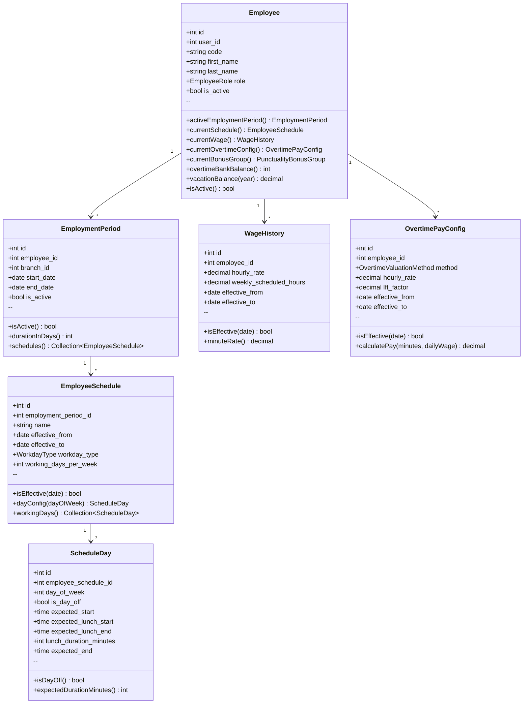
```mermaid
classDiagram
    class Employee {
        +int id
        +int user_id
        +string code
        +string first_name
        +string last_name
        +EmployeeRole role
        +bool is_active
        --
        +activeEmploymentPeriod() EmploymentPeriod
        +currentSchedule() EmployeeSchedule
        +currentWage() WageHistory
        +currentOvertimeConfig() OvertimePayConfig
        +currentBonusGroup() PunctualityBonusGroup
        +overtimeBankBalance() int
        +vacationBalance(year) decimal
        +isActive() bool
    }

    class EmploymentPeriod {
        +int id
        +int employee_id
        +int branch_id
        +date start_date
        +date end_date
        +bool is_active
        --
        +isActive() bool
        +durationInDays() int
        +schedules() Collection~EmployeeSchedule~
    }

    class EmployeeSchedule {
        +int id
        +int employment_period_id
        +string name
        +date effective_from
        +date effective_to
        +WorkdayType workday_type
        +int working_days_per_week
        --
        +isEffective(date) bool
        +dayConfig(dayOfWeek) ScheduleDay
        +workingDays() Collection~ScheduleDay~
    }

    class ScheduleDay {
        +int id
        +int employee_schedule_id
        +int day_of_week
        +bool is_day_off
        +time expected_start
        +time expected_lunch_start
        +time expected_lunch_end
        +int lunch_duration_minutes
        +time expected_end
        --
        +isDayOff() bool
        +expectedDurationMinutes() int
    }

    class WageHistory {
        +int id
        +int employee_id
        +decimal hourly_rate
        +decimal weekly_scheduled_hours
        +date effective_from
        +date effective_to
        --
        +isEffective(date) bool
        +minuteRate() decimal
    }

    class OvertimePayConfig {
        +int id
        +int employee_id
        +OvertimeValuationMethod method
        +decimal hourly_rate
        +decimal lft_factor
        +date effective_from
        +date effective_to
        --
        +isEffective(date) bool
        +calculatePay(minutes, dailyWage) decimal
    }

    Employee "1" --> "*" EmploymentPeriod
    Employee "1" --> "*" WageHistory
    Employee "1" --> "*" OvertimePayConfig
    EmploymentPeriod "1" --> "*" EmployeeSchedule
    EmployeeSchedule "1" --> "7" ScheduleDay
```

### 4.2 Domain Classes — Daily Operations

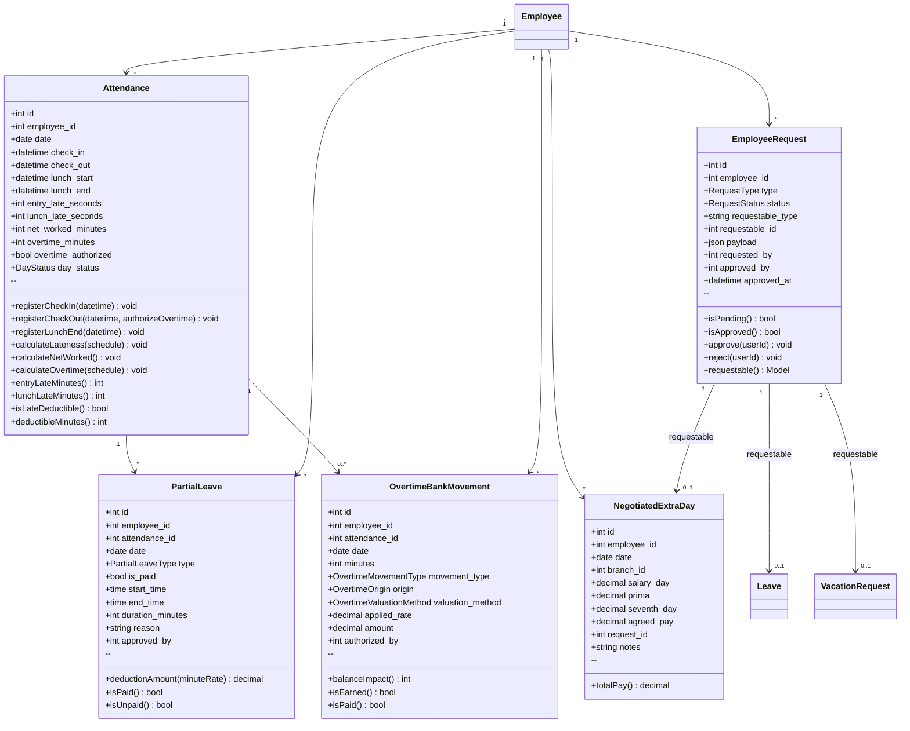
```mermaid
classDiagram
    class Attendance {
        +int id
        +int employee_id
        +date date
        +datetime check_in
        +datetime check_out
        +datetime lunch_start
        +datetime lunch_end
        +int entry_late_seconds
        +int lunch_late_seconds
        +int net_worked_minutes
        +int overtime_minutes
        +bool overtime_authorized
        +DayStatus day_status
        --
        +registerCheckIn(datetime) void
        +registerCheckOut(datetime, authorizeOvertime) void
        +registerLunchEnd(datetime) void
        +calculateLateness(schedule) void
        +calculateNetWorked() void
        +calculateOvertime(schedule) void
        +entryLateMinutes() int
        +lunchLateMinutes() int
        +isLateDeductible() bool
        +deductibleMinutes() int
    }

    class PartialLeave {
        +int id
        +int employee_id
        +int attendance_id
        +date date
        +PartialLeaveType type
        +bool is_paid
        +time start_time
        +time end_time
        +int duration_minutes
        +string reason
        +int approved_by
        --
        +deductionAmount(minuteRate) decimal
        +isPaid() bool
        +isUnpaid() bool
    }

    class NegotiatedExtraDay {
        +int id
        +int employee_id
        +date date
        +int branch_id
        +decimal salary_day
        +decimal prima
        +decimal seventh_day
        +decimal agreed_pay
        +int request_id
        +string notes
        --
        +totalPay() decimal
    }

    class EmployeeRequest {
        +int id
        +int employee_id
        +RequestType type
        +RequestStatus status
        +string requestable_type
        +int requestable_id
        +json payload
        +int requested_by
        +int approved_by
        +datetime approved_at
        --
        +isPending() bool
        +isApproved() bool
        +approve(userId) void
        +reject(userId) void
        +requestable() Model
    }

    class OvertimeBankMovement {
        +int id
        +int employee_id
        +int attendance_id
        +date date
        +int minutes
        +OvertimeMovementType movement_type
        +OvertimeOrigin origin
        +OvertimeValuationMethod valuation_method
        +decimal applied_rate
        +decimal amount
        +int authorized_by
        --
        +balanceImpact() int
        +isEarned() bool
        +isPaid() bool
    }

    Attendance "1" --> "*" PartialLeave
    Attendance "1" --> "0..*" OvertimeBankMovement
    Employee "1" --> "*" Attendance
    Employee "1" --> "*" PartialLeave
    Employee "1" --> "*" NegotiatedExtraDay
    Employee "1" --> "*" OvertimeBankMovement
    Employee "1" --> "*" EmployeeRequest
    EmployeeRequest "1" --> "0..1" NegotiatedExtraDay : requestable
    EmployeeRequest "1" --> "0..1" Leave : requestable
    EmployeeRequest "1" --> "0..1" VacationRequest : requestable
```

### 4.3 Domain Classes — Payroll Close

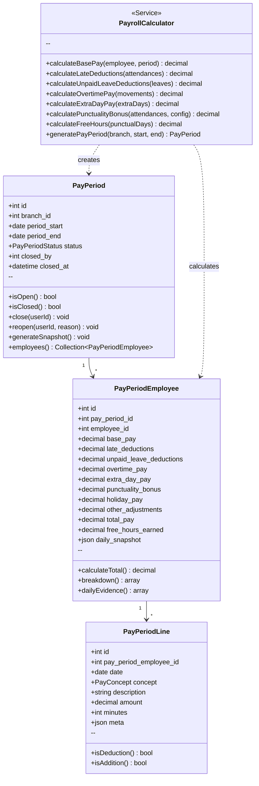
```mermaid
classDiagram
    class PayPeriod {
        +int id
        +int branch_id
        +date period_start
        +date period_end
        +PayPeriodStatus status
        +int closed_by
        +datetime closed_at
        --
        +isOpen() bool
        +isClosed() bool
        +close(userId) void
        +reopen(userId, reason) void
        +generateSnapshot() void
        +employees() Collection~PayPeriodEmployee~
    }

    class PayPeriodEmployee {
        +int id
        +int pay_period_id
        +int employee_id
        +decimal base_pay
        +decimal late_deductions
        +decimal unpaid_leave_deductions
        +decimal overtime_pay
        +decimal extra_day_pay
        +decimal punctuality_bonus
        +decimal holiday_pay
        +decimal other_adjustments
        +decimal total_pay
        +decimal free_hours_earned
        +json daily_snapshot
        --
        +calculateTotal() decimal
        +breakdown() array
        +dailyEvidence() array
    }

    class PayPeriodLine {
        +int id
        +int pay_period_employee_id
        +date date
        +PayConcept concept
        +string description
        +decimal amount
        +int minutes
        +json meta
        --
        +isDeduction() bool
        +isAddition() bool
    }

    class PayrollCalculator {
        <<Service>>
        --
        +calculateBasePay(employee, period) decimal
        +calculateLateDeductions(attendances) decimal
        +calculateUnpaidLeaveDeductions(leaves) decimal
        +calculateOvertimePay(movements) decimal
        +calculateExtraDayPay(extraDays) decimal
        +calculatePunctualityBonus(attendances, config) decimal
        +calculateFreeHours(punctualDays) decimal
        +generatePayPeriod(branch, start, end) PayPeriod
    }

    PayPeriod "1" --> "*" PayPeriodEmployee
    PayPeriodEmployee "1" --> "*" PayPeriodLine
    PayrollCalculator ..> PayPeriod : creates
    PayrollCalculator ..> PayPeriodEmployee : calculates
```

### 4.4 Domain Classes — Punctuality

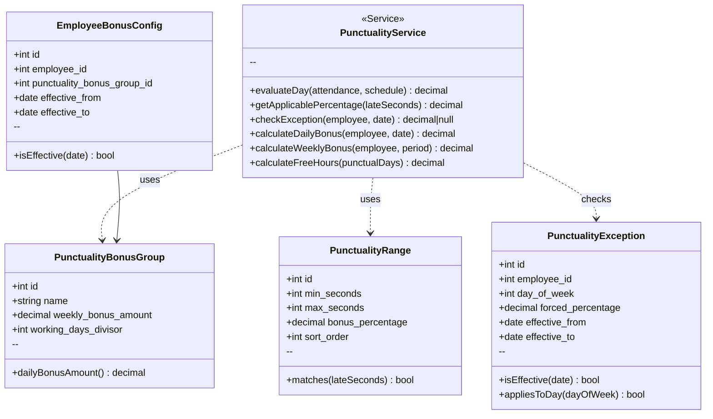
```mermaid
classDiagram
    class PunctualityRange {
        +int id
        +int min_seconds
        +int max_seconds
        +decimal bonus_percentage
        +int sort_order
        --
        +matches(lateSeconds) bool
    }

    class PunctualityBonusGroup {
        +int id
        +string name
        +decimal weekly_bonus_amount
        +int working_days_divisor
        --
        +dailyBonusAmount() decimal
    }

    class EmployeeBonusConfig {
        +int id
        +int employee_id
        +int punctuality_bonus_group_id
        +date effective_from
        +date effective_to
        --
        +isEffective(date) bool
    }

    class PunctualityException {
        +int id
        +int employee_id
        +int day_of_week
        +decimal forced_percentage
        +date effective_from
        +date effective_to
        --
        +isEffective(date) bool
        +appliesToDay(dayOfWeek) bool
    }

    class PunctualityService {
        <<Service>>
        --
        +evaluateDay(attendance, schedule) decimal
        +getApplicablePercentage(lateSeconds) decimal
        +checkException(employee, date) decimal|null
        +calculateDailyBonus(employee, date) decimal
        +calculateWeeklyBonus(employee, period) decimal
        +calculateFreeHours(punctualDays) decimal
    }

    PunctualityService ..> PunctualityRange : uses
    PunctualityService ..> PunctualityBonusGroup : uses
    PunctualityService ..> PunctualityException : checks
    EmployeeBonusConfig --> PunctualityBonusGroup
```

---

## 5) State Diagrams

### 5.1 Pay Period Lifecycle (`PayPeriod`)

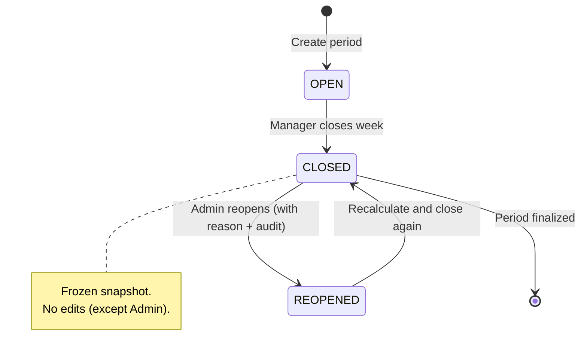
```mermaid
stateDiagram-v2
    [*] --> OPEN : Create period

    OPEN --> CLOSED : Manager closes week
    note right of CLOSED
        Frozen snapshot.
        No edits (except Admin).
    end note

    CLOSED --> REOPENED : Admin reopens (with reason + audit)
    REOPENED --> CLOSED : Recalculate and close again

    CLOSED --> [*] : Period finalized
```

### 5.2 EmployeeRequest Lifecycle

> Applies to all request types: `EXTRA_DAY`, `LEAVE`, `VACATION`, `SCHEDULE_CHANGE`.
> The concrete entity (NegotiatedExtraDay, Leave, etc.) is created **only on APPROVED**.

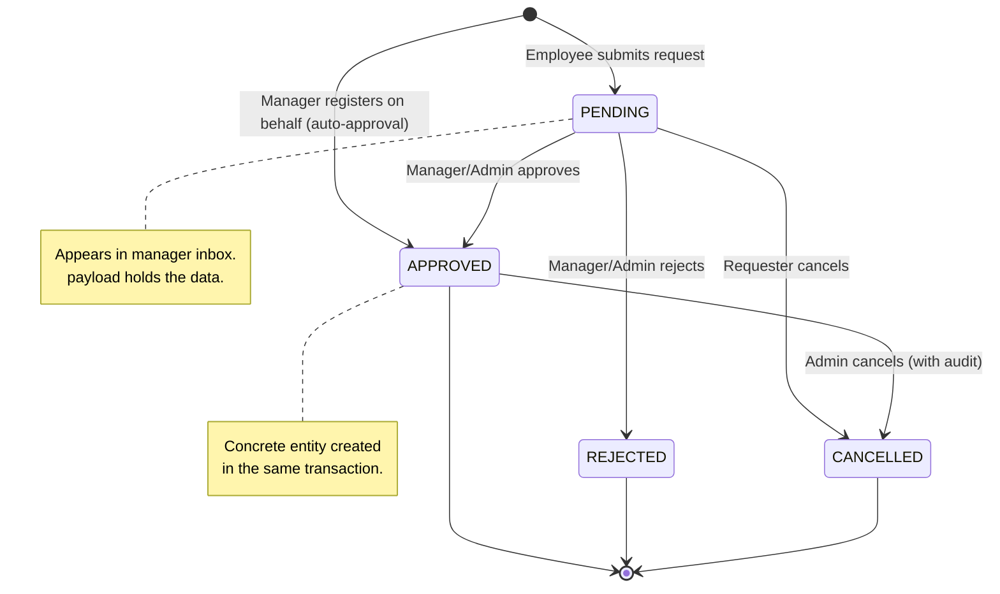
```mermaid
stateDiagram-v2
    [*] --> PENDING : Employee submits request
    [*] --> APPROVED : Manager registers on behalf (auto-approval)
    note right of APPROVED
        Concrete entity created
        in the same transaction.
    end note

    PENDING --> APPROVED : Manager/Admin approves
    note right of PENDING
        Appears in manager inbox.
        payload holds the data.
    end note
    PENDING --> REJECTED : Manager/Admin rejects
    PENDING --> CANCELLED : Requester cancels

    APPROVED --> CANCELLED : Admin cancels (with audit)

    APPROVED --> [*]
    REJECTED --> [*]
    CANCELLED --> [*]
```

### 5.3 Attendance Day Flow (`Attendance`)

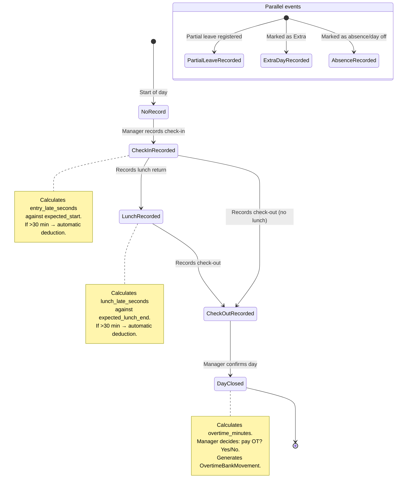
```mermaid
stateDiagram-v2
    [*] --> NoRecord : Start of day

    NoRecord --> CheckInRecorded : Manager records check-in
    note right of CheckInRecorded
        Calculates entry_late_seconds
        against expected_start.
        If >30 min → automatic deduction.
    end note

    CheckInRecorded --> LunchRecorded : Records lunch return
    note right of LunchRecorded
        Calculates lunch_late_seconds
        against expected_lunch_end.
        If >30 min → automatic deduction.
    end note

    CheckInRecorded --> CheckOutRecorded : Records check-out (no lunch)
    LunchRecorded --> CheckOutRecorded : Records check-out

    CheckOutRecorded --> DayClosed : Manager confirms day
    note right of DayClosed
        Calculates overtime_minutes.
        Manager decides: pay OT? Yes/No.
        Generates OvertimeBankMovement.
    end note

    DayClosed --> [*]

    state "Parallel events" as parallel {
        [*] --> PartialLeaveRecorded : Partial leave registered
        [*] --> ExtraDayRecorded : Marked as Extra
        [*] --> AbsenceRecorded : Marked as absence/day off
    }
```

### 5.4 Overtime Bank Movements

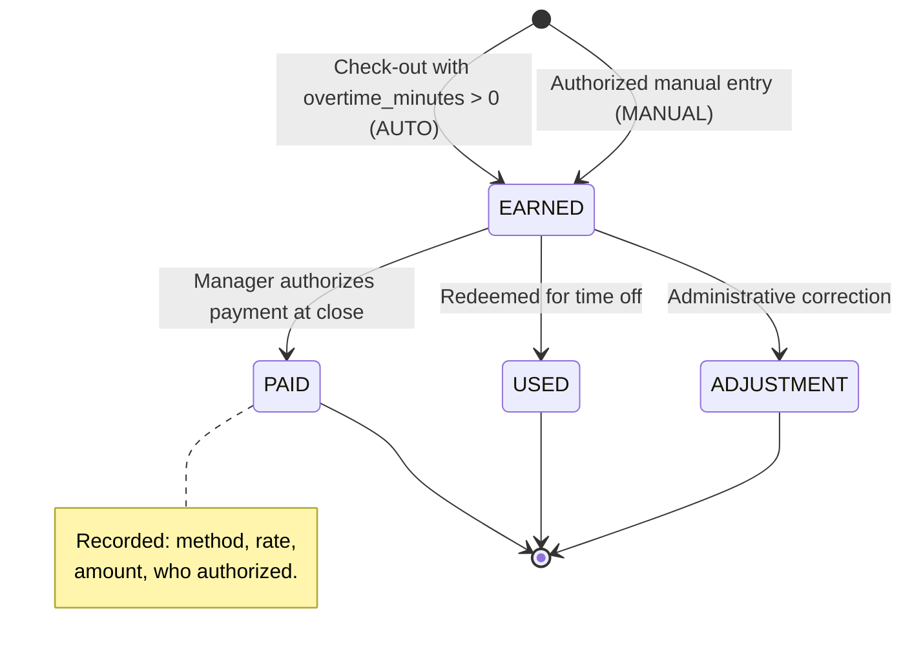
```mermaid
stateDiagram-v2
    [*] --> EARNED : Check-out with overtime_minutes > 0 (AUTO)
    [*] --> EARNED : Authorized manual entry (MANUAL)

    EARNED --> PAID : Manager authorizes payment at close
    note right of PAID
        Recorded: method, rate,
        amount, who authorized.
    end note

    EARNED --> USED : Redeemed for time off
    EARNED --> ADJUSTMENT : Administrative correction

    PAID --> [*]
    USED --> [*]
    ADJUSTMENT --> [*]
```

---

## 6) Sequence Diagrams

### 6.1 Check-in Registration (Daily Operation)

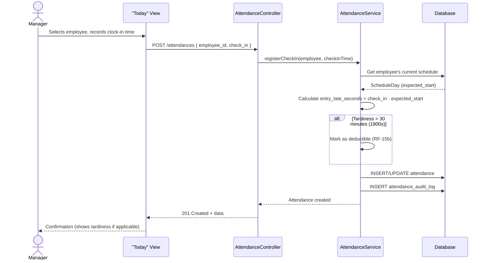
```mermaid
sequenceDiagram
    actor M as Manager
    participant UI as "Today" View
    participant API as AttendanceController
    participant Svc as AttendanceService
    participant DB as Database

    M->>UI: Selects employee, records clock-in time
    UI->>API: POST /attendances { employee_id, check_in }
    API->>Svc: registerCheckIn(employee, checkInTime)

    Svc->>DB: Get employee's current schedule
    DB-->>Svc: ScheduleDay (expected_start)

    Svc->>Svc: Calculate entry_late_seconds = check_in - expected_start

    alt Tardiness > 30 minutes (1800s)
        Svc->>Svc: Mark as deductible (RF-15b)
    end

    Svc->>DB: INSERT/UPDATE attendance
    Svc->>DB: INSERT attendance_audit_log

    Svc-->>API: Attendance created
    API-->>UI: 201 Created + data
    UI-->>M: Confirmation (shows tardiness if applicable)
```

### 6.2 Check-out Registration with Overtime Decision

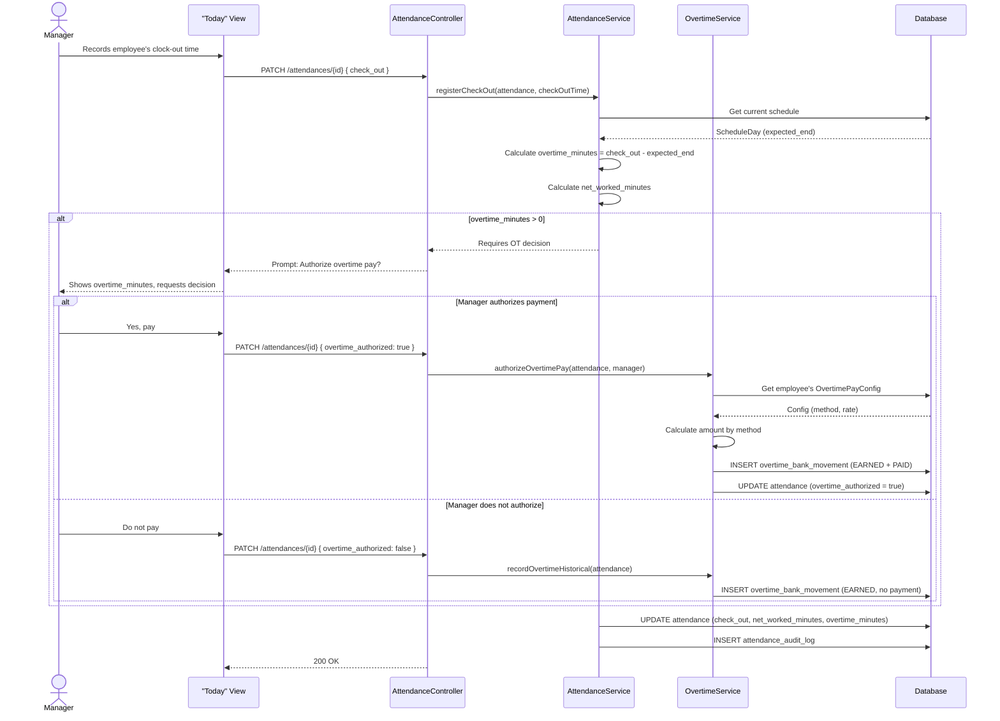
```mermaid
sequenceDiagram
    actor M as Manager
    participant UI as "Today" View
    participant API as AttendanceController
    participant Svc as AttendanceService
    participant OTSvc as OvertimeService
    participant DB as Database

    M->>UI: Records employee's clock-out time
    UI->>API: PATCH /attendances/{id} { check_out }
    API->>Svc: registerCheckOut(attendance, checkOutTime)

    Svc->>DB: Get current schedule
    DB-->>Svc: ScheduleDay (expected_end)

    Svc->>Svc: Calculate overtime_minutes = check_out - expected_end
    Svc->>Svc: Calculate net_worked_minutes

    alt overtime_minutes > 0
        Svc-->>API: Requires OT decision
        API-->>UI: Prompt: Authorize overtime pay?
        UI-->>M: Shows overtime_minutes, requests decision

        alt Manager authorizes payment
            M->>UI: Yes, pay
            UI->>API: PATCH /attendances/{id} { overtime_authorized: true }
            API->>OTSvc: authorizeOvertimePay(attendance, manager)

            OTSvc->>DB: Get employee's OvertimePayConfig
            DB-->>OTSvc: Config (method, rate)

            OTSvc->>OTSvc: Calculate amount by method
            OTSvc->>DB: INSERT overtime_bank_movement (EARNED + PAID)
            OTSvc->>DB: UPDATE attendance (overtime_authorized = true)
        else Manager does not authorize
            M->>UI: Do not pay
            UI->>API: PATCH /attendances/{id} { overtime_authorized: false }
            API->>OTSvc: recordOvertimeHistorical(attendance)
            OTSvc->>DB: INSERT overtime_bank_movement (EARNED, no payment)
        end
    end

    Svc->>DB: UPDATE attendance (check_out, net_worked_minutes, overtime_minutes)
    Svc->>DB: INSERT attendance_audit_log
    API-->>UI: 200 OK
```

### 6.3 Weekly Close (Snapshot)

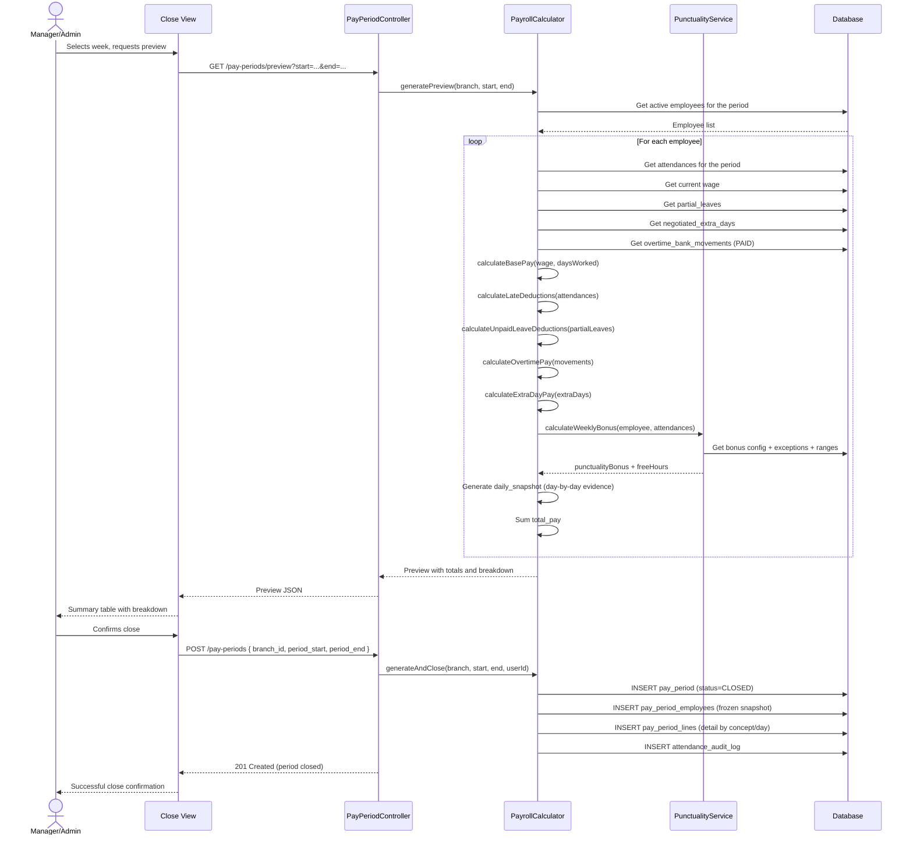
```mermaid
sequenceDiagram
    actor M as Manager/Admin
    participant UI as Close View
    participant API as PayPeriodController
    participant Calc as PayrollCalculator
    participant Punct as PunctualityService
    participant DB as Database

    M->>UI: Selects week, requests preview
    UI->>API: GET /pay-periods/preview?start=...&end=...

    API->>Calc: generatePreview(branch, start, end)
    Calc->>DB: Get active employees for the period
    DB-->>Calc: Employee list

    loop For each employee
        Calc->>DB: Get attendances for the period
        Calc->>DB: Get current wage
        Calc->>DB: Get partial_leaves
        Calc->>DB: Get negotiated_extra_days
        Calc->>DB: Get overtime_bank_movements (PAID)

        Calc->>Calc: calculateBasePay(wage, daysWorked)
        Calc->>Calc: calculateLateDeductions(attendances)
        Calc->>Calc: calculateUnpaidLeaveDeductions(partialLeaves)
        Calc->>Calc: calculateOvertimePay(movements)
        Calc->>Calc: calculateExtraDayPay(extraDays)

        Calc->>Punct: calculateWeeklyBonus(employee, attendances)
        Punct->>DB: Get bonus config + exceptions + ranges
        Punct-->>Calc: punctualityBonus + freeHours

        Calc->>Calc: Generate daily_snapshot (day-by-day evidence)
        Calc->>Calc: Sum total_pay
    end

    Calc-->>API: Preview with totals and breakdown
    API-->>UI: Preview JSON
    UI-->>M: Summary table with breakdown

    M->>UI: Confirms close
    UI->>API: POST /pay-periods { branch_id, period_start, period_end }

    API->>Calc: generateAndClose(branch, start, end, userId)
    Calc->>DB: INSERT pay_period (status=CLOSED)
    Calc->>DB: INSERT pay_period_employees (frozen snapshot)
    Calc->>DB: INSERT pay_period_lines (detail by concept/day)
    Calc->>DB: INSERT attendance_audit_log

    API-->>UI: 201 Created (period closed)
    UI-->>M: Successful close confirmation
```

### 6.4 EmployeeRequest — Creation and Approval

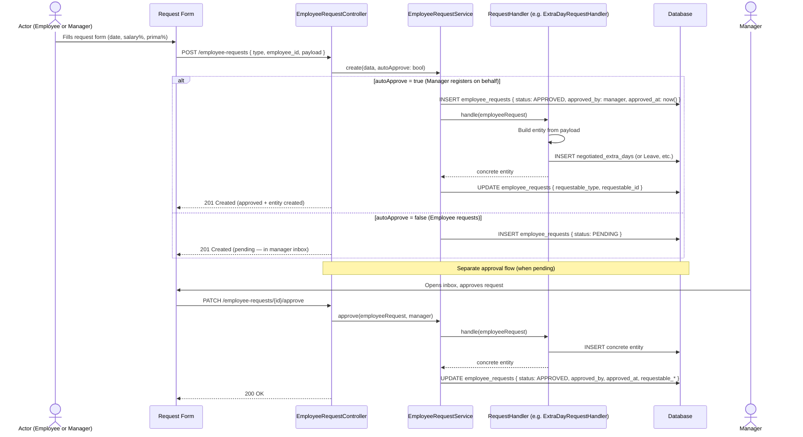
```mermaid
sequenceDiagram
    actor A as Actor (Employee or Manager)
    participant UI as Request Form
    participant API as EmployeeRequestController
    participant Svc as EmployeeRequestService
    participant Handler as RequestHandler (e.g. ExtraDayRequestHandler)
    participant DB as Database

    A->>UI: Fills request form (date, salary%, prima%)
    UI->>API: POST /employee-requests { type, employee_id, payload }
    API->>Svc: create(data, autoApprove: bool)

    alt autoApprove = true (Manager registers on behalf)
        Svc->>DB: INSERT employee_requests { status: APPROVED, approved_by: manager, approved_at: now() }
        Svc->>Handler: handle(employeeRequest)
        Handler->>Handler: Build entity from payload
        Handler->>DB: INSERT negotiated_extra_days (or Leave, etc.)
        Handler-->>Svc: concrete entity
        Svc->>DB: UPDATE employee_requests { requestable_type, requestable_id }
        API-->>UI: 201 Created (approved + entity created)
    else autoApprove = false (Employee requests)
        Svc->>DB: INSERT employee_requests { status: PENDING }
        API-->>UI: 201 Created (pending — in manager inbox)
    end

    note over API,DB: Separate approval flow (when pending)

    actor M as Manager
    M->>UI: Opens inbox, approves request
    UI->>API: PATCH /employee-requests/{id}/approve
    API->>Svc: approve(employeeRequest, manager)
    Svc->>Handler: handle(employeeRequest)
    Handler->>DB: INSERT concrete entity
    Handler-->>Svc: concrete entity
    Svc->>DB: UPDATE employee_requests { status: APPROVED, approved_by, approved_at, requestable_* }
    API-->>UI: 200 OK
```

### 6.5 Partial Leave Registration

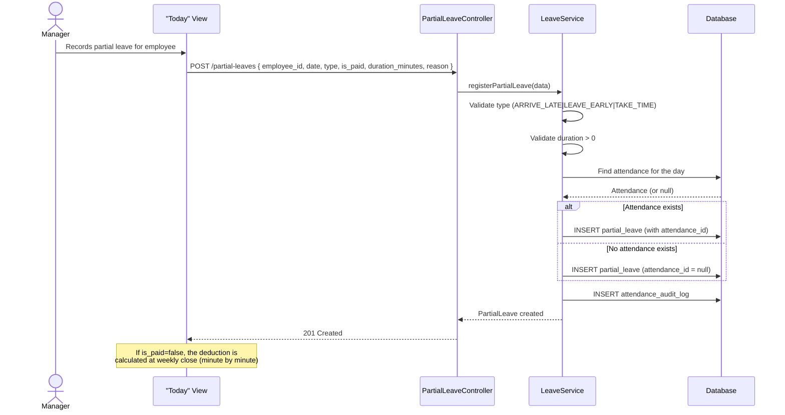
```mermaid
sequenceDiagram
    actor M as Manager
    participant UI as "Today" View
    participant API as PartialLeaveController
    participant Svc as LeaveService
    participant DB as Database

    M->>UI: Records partial leave for employee
    UI->>API: POST /partial-leaves { employee_id, date, type, is_paid, duration_minutes, reason }
    API->>Svc: registerPartialLeave(data)

    Svc->>Svc: Validate type (ARRIVE_LATE|LEAVE_EARLY|TAKE_TIME)
    Svc->>Svc: Validate duration > 0

    Svc->>DB: Find attendance for the day
    DB-->>Svc: Attendance (or null)

    alt Attendance exists
        Svc->>DB: INSERT partial_leave (with attendance_id)
    else No attendance exists
        Svc->>DB: INSERT partial_leave (attendance_id = null)
    end

    Svc->>DB: INSERT attendance_audit_log

    Svc-->>API: PartialLeave created
    API-->>UI: 201 Created

    note over UI: If is_paid=false, the deduction is<br/>calculated at weekly close (minute by minute)
```

---

## 7) Integrity Rules and Constraints

### 7.1 Uniqueness Constraints

| Table                   | Constraint                                        | Description                                            |
| ----------------------- | ------------------------------------------------- | ------------------------------------------------------ |
| `employees`             | UNIQUE(`code`)                                    | Employee code unique system-wide.                      |
| `attendances`           | UNIQUE(`employee_id`, `date`)                     | One attendance record per employee per day.            |
| `employee_requests`     | INDEX(`employee_id`, `status`)                    | Fast inbox queries by employee and status.             |
| `employee_requests`     | INDEX(`requestable_type`, `requestable_id`)       | Polymorphic reverse lookup.                            |
| `negotiated_extra_days` | UNIQUE(`employee_id`, `date`)                     | One extra day per employee per date.                   |
| `schedule_days`         | UNIQUE(`employee_schedule_id`, `day_of_week`)     | One configuration per day of week per schedule.        |
| `vacation_entitlements` | UNIQUE(`employee_id`, `year`)                     | One vacation entitlement record per employee per year. |
| `holidays`              | UNIQUE(`date`)                                    | One holiday per date.                                  |
| `pay_periods`           | UNIQUE(`branch_id`, `period_start`, `period_end`) | One period per branch and date range.                  |
| `pay_period_employees`  | UNIQUE(`pay_period_id`, `employee_id`)            | One snapshot per employee per period.                  |
| `leave_types`           | UNIQUE(`code`)                                    | Leave type code unique.                                |

### 7.2 Data-Level Business Rules

| Rule                                 | Validation                                                                            | Reference     |
| ------------------------------------ | ------------------------------------------------------------------------------------- | ------------- |
| Only one active employment period    | `employment_periods` with `is_active=true` per `employee_id` must be ≤ 1              | RF-06         |
| Tardiness in seconds ≥ 0             | `entry_late_seconds >= 0` and `lunch_late_seconds >= 0`                               | RF-13         |
| Leave duration > 0                   | `partial_leaves.duration_minutes > 0`                                                 | RF-25a        |
| Agreed pay > 0                       | `negotiated_extra_days.agreed_pay > 0`                                                | RF-39         |
| Hourly rate > 0                      | `wage_histories.hourly_rate > 0`                                                      | RF-22         |
| Weekly scheduled hours > 0           | `wage_histories.weekly_scheduled_hours > 0`                                           | RF-22, RF-10  |
| Weekly bonus ≥ 0                     | `punctuality_bonus_groups.weekly_bonus_amount >= 0`                                   | RF-33         |
| Bonus percentage 0–100               | `punctuality_ranges.bonus_percentage BETWEEN 0 AND 100`                               | RF-32         |
| Forced percentage 0–100              | `punctuality_exceptions.forced_percentage BETWEEN 0 AND 100`                          | RF-37         |
| Closed period not editable           | If `pay_periods.status = CLOSED`, do not allow INSERT/UPDATE on lines (except reopen) | RN-16         |
| Paid overtime requires authorization | `overtime_bank_movements.movement_type = PAID` requires `authorized_by IS NOT NULL`   | DC-01, RF-47a |
| Vacation balance ≥ 0                 | `vacation_entitlements.entitled_days - used_days >= 0` (app-level)                    | RF-26         |

### 7.3 Recommended Indexes

| Table                     | Index                                      | Justification                   |
| ------------------------- | ------------------------------------------ | ------------------------------- |
| `attendances`             | (`date`)                                   | Queries by date ("Today" view). |
| `attendances`             | (`employee_id`, `date`)                    | Fast lookup by employee+date.   |
| `attendances`             | (`day_status`)                             | Status filters.                 |
| `partial_leaves`          | (`employee_id`, `date`)                    | Lookup by employee+date.        |
| `overtime_bank_movements` | (`employee_id`, `date`)                    | Balance and bank queries.       |
| `pay_periods`             | (`branch_id`, `status`)                    | Open periods by branch.         |
| `employment_periods`      | (`employee_id`, `is_active`)               | Active period by employee.      |
| `employee_schedules`      | (`employment_period_id`, `effective_from`) | Current schedule.               |
| `wage_histories`          | (`employee_id`, `effective_from`)          | Current wage.                   |
| `attendance_audit_logs`   | (`auditable_type`, `auditable_id`)         | Polymorphic audit lookup.       |

---

## Entity Summary

| #   | Entity                | Table                      | Subdomain        |
| --- | --------------------- | -------------------------- | ---------------- |
| 1   | Employee              | `employees`                | Employees        |
| 2   | EmploymentPeriod      | `employment_periods`       | Employees        |
| 3   | EmployeeSchedule      | `employee_schedules`       | Schedules        |
| 4   | ScheduleDay           | `schedule_days`            | Schedules        |
| 5   | WageHistory           | `wage_histories`           | Employees        |
| 6   | OvertimePayConfig     | `overtime_pay_configs`     | Configuration    |
| 7   | Attendance            | `attendances`              | Daily Operations |
| 8   | PartialLeave          | `partial_leaves`           | Daily Operations |
| 9   | NegotiatedExtraDay    | `negotiated_extra_days`    | Daily Operations |
| 10  | OvertimeBankMovement  | `overtime_bank_movements`  | Overtime         |
| 11  | LeaveType             | `leave_types`              | Catalogs         |
| 12  | Leave                 | `leaves`                   | Leaves           |
| 13  | Holiday               | `holidays`                 | Catalogs         |
| 14  | VacationEntitlement   | `vacation_entitlements`    | Vacations        |
| 15  | VacationRequest       | `vacation_requests`        | Vacations        |
| 16  | PunctualityRange      | `punctuality_ranges`       | Punctuality      |
| 17  | PunctualityBonusGroup | `punctuality_bonus_groups` | Punctuality      |
| 18  | EmployeeBonusConfig   | `employee_bonus_configs`   | Punctuality      |
| 19  | PunctualityException  | `punctuality_exceptions`   | Punctuality      |
| 20  | PayPeriod             | `pay_periods`              | Payroll          |
| 21  | PayPeriodEmployee     | `pay_period_employees`     | Payroll          |
| 22  | PayPeriodLine         | `pay_period_lines`         | Payroll          |
| 23  | AttendanceAuditLog    | `attendance_audit_logs`    | Audit            |
| 24  | EmployeeRequest       | `employee_requests`        | Requests         |

---

> **Traceability:** Each field in the dictionary references the FR/BR/DC that originated it.
> **Conventions:** Table names in snake_case plural, models in PascalCase singular, FKs `{model}_id`, automatic timestamps, soft deletes where applicable, JSON `meta` for extensibility.
> **v1.1 note:** Concrete request entities (`negotiated_extra_days`, `leaves`, `vacation_requests`) are semantically "approved" by their existence — no status filter needed on those tables.
