# 📐 Modelo de Dominio — Attendance & Payroll (SushiGo)

**Versión:** 1.1
**Fecha:** 2026-04-21
**Base:** attendance-payroll-spec v0.8 + mvp-scope
**Estado:** Contrato de dominio activo

**Changelog v1.1 (2026-04-21):** Se agrega `EmployeeRequest` como wrapper unificado de aprobación para todas las solicitudes de empleados. Las entidades concretas (`NegotiatedExtraDay`, `Leave`, `VacationRequest`) solo se crean al aprobarse — la DB queda semánticamente limpia. Los campos de ciclo de aprobación (`status`, `approved_by`, `approved_at`) se centralizan en `EmployeeRequest`. Se agrega subdominio 1.7 (ER Solicitudes), sección 2.23 (diccionario employee_requests) y secuencia 6.4 (ciclo de vida de solicitud).

---

## Índice

1. [Diagrama Entidad-Relación (ER)](#1-diagrama-entidad-relación-er)
2. [Diccionarios de campos](#2-diccionarios-de-campos)
3. [Definición de Enums](#3-definición-de-enums)
4. [Diagrama de Clases UML](#4-diagrama-de-clases-uml)
5. [Diagramas de Estado](#5-diagramas-de-estado)
6. [Diagramas de Secuencia](#6-diagramas-de-secuencia)
7. [Reglas de integridad y constraints](#7-reglas-de-integridad-y-constraints)

---

## 1) Diagrama Entidad-Relación (ER)

### 1.1 Subdominio: Empleados y Configuración

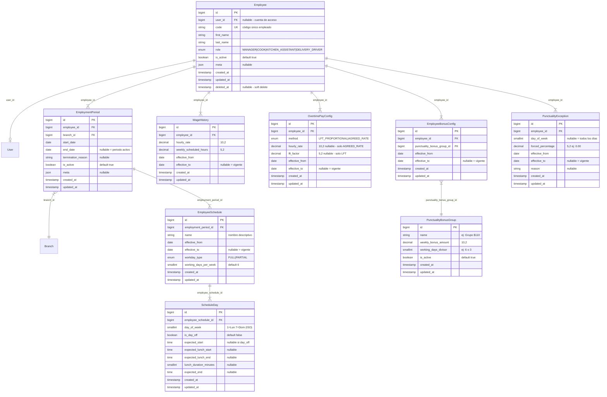
```mermaid
erDiagram
    Employee ||--o| User : "user_id"
    Employee ||--|{ EmploymentPeriod : "employee_id"
    Employee ||--|{ WageHistory : "employee_id"
    Employee ||--|{ OvertimePayConfig : "employee_id"
    Employee ||--|{ EmployeeBonusConfig : "employee_id"
    Employee ||--|{ PunctualityException : "employee_id"

    EmploymentPeriod }|--|| Branch : "branch_id"
    EmploymentPeriod ||--|{ EmployeeSchedule : "employment_period_id"

    EmployeeSchedule ||--|{ ScheduleDay : "employee_schedule_id"

    EmployeeBonusConfig }|--|| PunctualityBonusGroup : "punctuality_bonus_group_id"

    Employee {
        bigint id PK
        bigint user_id FK "nullable - cuenta de acceso"
        string code UK "código único empleado"
        string first_name
        string last_name
        enum role "MANAGER|COOK|KITCHEN_ASSISTANT|DELIVERY_DRIVER"
        boolean is_active "default true"
        json meta "nullable"
        timestamp created_at
        timestamp updated_at
        timestamp deleted_at "nullable - soft delete"
    }

    EmploymentPeriod {
        bigint id PK
        bigint employee_id FK
        bigint branch_id FK
        date start_date
        date end_date "nullable = periodo activo"
        string termination_reason "nullable"
        boolean is_active "default true"
        json meta "nullable"
        timestamp created_at
        timestamp updated_at
    }

    EmployeeSchedule {
        bigint id PK
        bigint employment_period_id FK
        string name "nombre descriptivo"
        date effective_from
        date effective_to "nullable = vigente"
        enum workday_type "FULL|PARTIAL"
        smallint working_days_per_week "default 6"
        timestamp created_at
        timestamp updated_at
    }

    ScheduleDay {
        bigint id PK
        bigint employee_schedule_id FK
        smallint day_of_week "1=Lun 7=Dom (ISO)"
        boolean is_day_off "default false"
        time expected_start "nullable si day_off"
        time expected_lunch_start "nullable"
        time expected_lunch_end "nullable"
        smallint lunch_duration_minutes "nullable"
        time expected_end "nullable"
        timestamp created_at
        timestamp updated_at
    }

    WageHistory {
        bigint id PK
        bigint employee_id FK
        decimal hourly_rate "10,2"
        decimal weekly_scheduled_hours "5,2"
        date effective_from
        date effective_to "nullable = vigente"
        timestamp created_at
        timestamp updated_at
    }

    OvertimePayConfig {
        bigint id PK
        bigint employee_id FK
        enum method "LFT_PROPORTIONAL|AGREED_RATE"
        decimal hourly_rate "10,2 nullable - solo AGREED_RATE"
        decimal lft_factor "5,2 nullable - solo LFT"
        date effective_from
        date effective_to "nullable = vigente"
        timestamp created_at
        timestamp updated_at
    }

    PunctualityBonusGroup {
        bigint id PK
        string name "ej: Grupo $110"
        decimal weekly_bonus_amount "10,2"
        smallint working_days_divisor "ej: 6 o 3"
        boolean is_active "default true"
        timestamp created_at
        timestamp updated_at
    }

    EmployeeBonusConfig {
        bigint id PK
        bigint employee_id FK
        bigint punctuality_bonus_group_id FK
        date effective_from
        date effective_to "nullable = vigente"
        timestamp created_at
        timestamp updated_at
    }

    PunctualityException {
        bigint id PK
        bigint employee_id FK
        smallint day_of_week "nullable = todos los días"
        decimal forced_percentage "5,2 ej: 0.00"
        date effective_from
        date effective_to "nullable = vigente"
        string reason "nullable"
        timestamp created_at
        timestamp updated_at
    }
```

### 1.2 Subdominio: Operación Diaria (Asistencia)

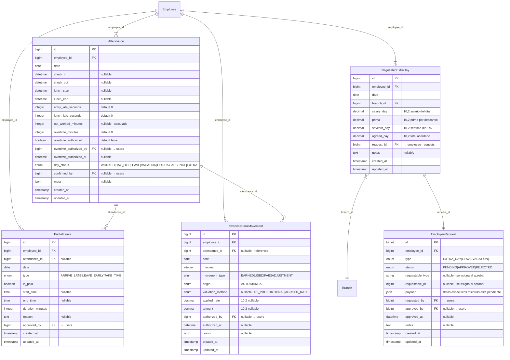
```mermaid
erDiagram
    Employee ||--|{ Attendance : "employee_id"
    Employee ||--|{ PartialLeave : "employee_id"
    Employee ||--|{ NegotiatedExtraDay : "employee_id"
    Employee ||--|{ OvertimeBankMovement : "employee_id"

    Attendance ||--o{ PartialLeave : "attendance_id"
    Attendance ||--o{ OvertimeBankMovement : "attendance_id"

    NegotiatedExtraDay }|--|| Branch : "branch_id"
    NegotiatedExtraDay ||--|| EmployeeRequest : "request_id"

    Attendance {
        bigint id PK
        bigint employee_id FK
        date date
        datetime check_in "nullable"
        datetime check_out "nullable"
        datetime lunch_start "nullable"
        datetime lunch_end "nullable"
        integer entry_late_seconds "default 0"
        integer lunch_late_seconds "default 0"
        integer net_worked_minutes "nullable - calculado"
        integer overtime_minutes "default 0"
        boolean overtime_authorized "default false"
        bigint overtime_authorized_by FK "nullable → users"
        datetime overtime_authorized_at "nullable"
        enum day_status "WORKED|DAY_OFF|LEAVE|VACATION|HOLIDAY|ABSENCE|EXTRA"
        bigint confirmed_by FK "nullable → users"
        json meta "nullable"
        timestamp created_at
        timestamp updated_at
    }

    PartialLeave {
        bigint id PK
        bigint employee_id FK
        bigint attendance_id FK "nullable"
        date date
        enum type "ARRIVE_LATE|LEAVE_EARLY|TAKE_TIME"
        boolean is_paid
        time start_time "nullable"
        time end_time "nullable"
        integer duration_minutes
        text reason "nullable"
        bigint approved_by FK "→ users"
        timestamp created_at
        timestamp updated_at
    }

    NegotiatedExtraDay {
        bigint id PK
        bigint employee_id FK
        date date
        bigint branch_id FK
        decimal salary_day "10,2 salario del día"
        decimal prima "10,2 prima por descanso"
        decimal seventh_day "10,2 séptimo día 1/6"
        decimal agreed_pay "10,2 total acordado"
        bigint request_id FK "→ employee_requests"
        text notes "nullable"
        timestamp created_at
        timestamp updated_at
    }

    EmployeeRequest {
        bigint id PK
        bigint employee_id FK
        enum type "EXTRA_DAY|LEAVE|VACATION|..."
        enum status "PENDING|APPROVED|REJECTED"
        string requestable_type "nullable - se asigna al aprobar"
        bigint requestable_id "nullable - se asigna al aprobar"
        json payload "datos específicos mientras está pendiente"
        bigint requested_by FK "→ users"
        bigint approved_by FK "nullable → users"
        datetime approved_at "nullable"
        text notes "nullable"
        timestamp created_at
        timestamp updated_at
    }

    OvertimeBankMovement {
        bigint id PK
        bigint employee_id FK
        bigint attendance_id FK "nullable - referencia"
        date date
        integer minutes
        enum movement_type "EARNED|USED|PAID|ADJUSTMENT"
        enum origin "AUTO|MANUAL"
        enum valuation_method "nullable LFT_PROPORTIONAL|AGREED_RATE"
        decimal applied_rate "10,2 nullable"
        decimal amount "10,2 nullable"
        bigint authorized_by FK "nullable → users"
        datetime authorized_at "nullable"
        text reason "nullable"
        timestamp created_at
        timestamp updated_at
    }
```

### 1.3 Subdominio: Permisos, Vacaciones y Festivos

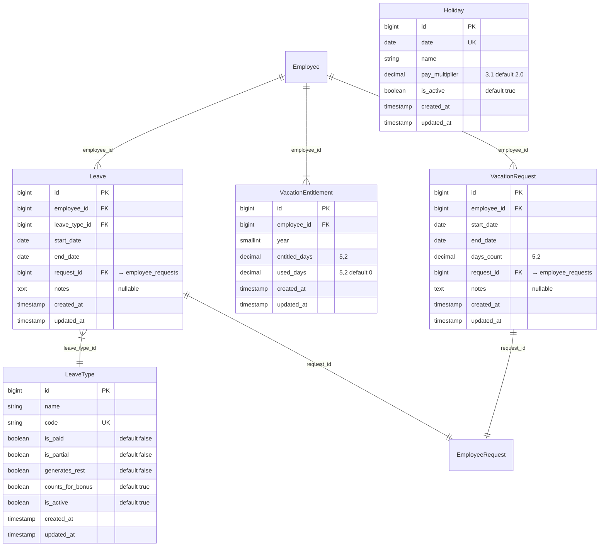
```mermaid
erDiagram
    Employee ||--|{ Leave : "employee_id"
    Employee ||--|{ VacationEntitlement : "employee_id"
    Employee ||--|{ VacationRequest : "employee_id"

    Leave }|--|| LeaveType : "leave_type_id"
    Leave ||--|| EmployeeRequest : "request_id"
    VacationRequest ||--|| EmployeeRequest : "request_id"

    LeaveType {
        bigint id PK
        string name
        string code UK
        boolean is_paid "default false"
        boolean is_partial "default false"
        boolean generates_rest "default false"
        boolean counts_for_bonus "default true"
        boolean is_active "default true"
        timestamp created_at
        timestamp updated_at
    }

    Leave {
        bigint id PK
        bigint employee_id FK
        bigint leave_type_id FK
        date start_date
        date end_date
        bigint request_id FK "→ employee_requests"
        text notes "nullable"
        timestamp created_at
        timestamp updated_at
    }

    Holiday {
        bigint id PK
        date date UK
        string name
        decimal pay_multiplier "3,1 default 2.0"
        boolean is_active "default true"
        timestamp created_at
        timestamp updated_at
    }

    VacationEntitlement {
        bigint id PK
        bigint employee_id FK
        smallint year
        decimal entitled_days "5,2"
        decimal used_days "5,2 default 0"
        timestamp created_at
        timestamp updated_at
    }

    VacationRequest {
        bigint id PK
        bigint employee_id FK
        date start_date
        date end_date
        decimal days_count "5,2"
        bigint request_id FK "→ employee_requests"
        text notes "nullable"
        timestamp created_at
        timestamp updated_at
    }
```

### 1.4 Subdominio: Cierre de Nómina

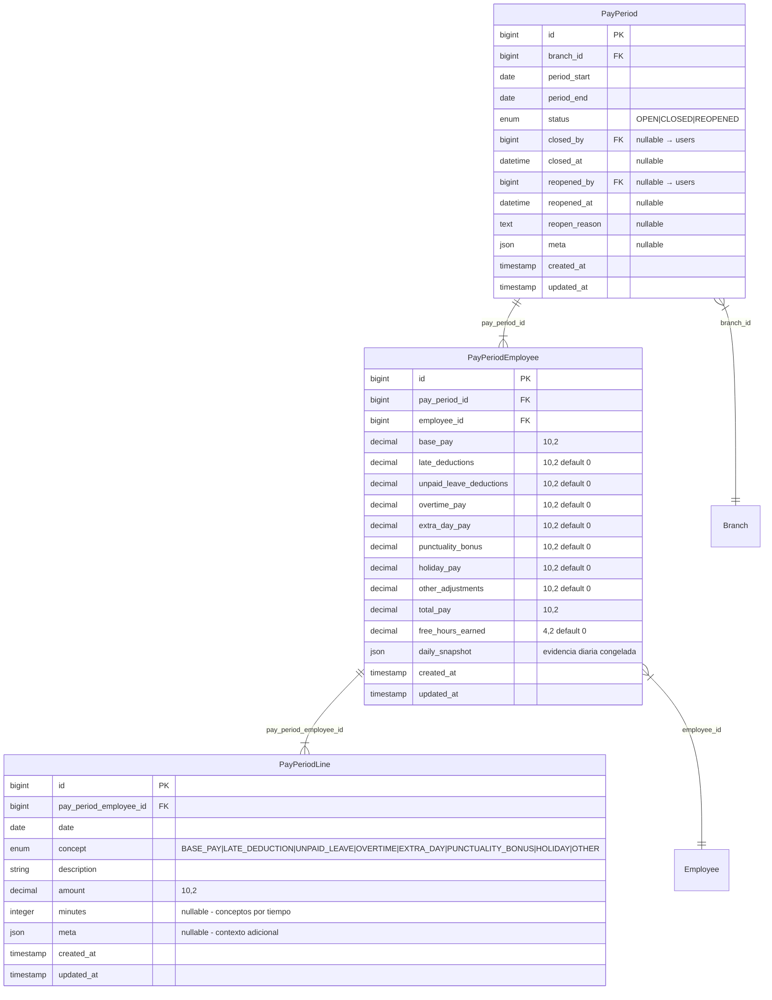
```mermaid
erDiagram
    PayPeriod ||--|{ PayPeriodEmployee : "pay_period_id"
    PayPeriodEmployee ||--|{ PayPeriodLine : "pay_period_employee_id"
    PayPeriod }|--|| Branch : "branch_id"
    PayPeriodEmployee }|--|| Employee : "employee_id"

    PayPeriod {
        bigint id PK
        bigint branch_id FK
        date period_start
        date period_end
        enum status "OPEN|CLOSED|REOPENED"
        bigint closed_by FK "nullable → users"
        datetime closed_at "nullable"
        bigint reopened_by FK "nullable → users"
        datetime reopened_at "nullable"
        text reopen_reason "nullable"
        json meta "nullable"
        timestamp created_at
        timestamp updated_at
    }

    PayPeriodEmployee {
        bigint id PK
        bigint pay_period_id FK
        bigint employee_id FK
        decimal base_pay "10,2"
        decimal late_deductions "10,2 default 0"
        decimal unpaid_leave_deductions "10,2 default 0"
        decimal overtime_pay "10,2 default 0"
        decimal extra_day_pay "10,2 default 0"
        decimal punctuality_bonus "10,2 default 0"
        decimal holiday_pay "10,2 default 0"
        decimal other_adjustments "10,2 default 0"
        decimal total_pay "10,2"
        decimal free_hours_earned "4,2 default 0"
        json daily_snapshot "evidencia diaria congelada"
        timestamp created_at
        timestamp updated_at
    }

    PayPeriodLine {
        bigint id PK
        bigint pay_period_employee_id FK
        date date
        enum concept "BASE_PAY|LATE_DEDUCTION|UNPAID_LEAVE|OVERTIME|EXTRA_DAY|PUNCTUALITY_BONUS|HOLIDAY|OTHER"
        string description
        decimal amount "10,2"
        integer minutes "nullable - conceptos por tiempo"
        json meta "nullable - contexto adicional"
        timestamp created_at
        timestamp updated_at
    }
```

### 1.5 Subdominio: Configuración de Puntualidad

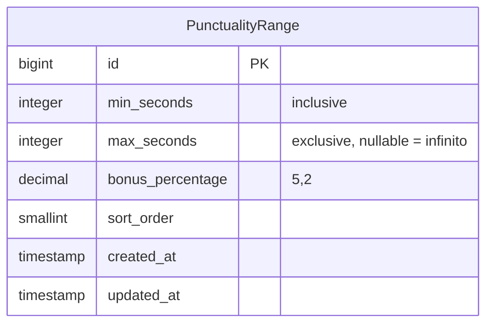
```mermaid
erDiagram
    PunctualityRange {
        bigint id PK
        integer min_seconds "inclusive"
        integer max_seconds "exclusive, nullable = infinito"
        decimal bonus_percentage "5,2"
        smallint sort_order
        timestamp created_at
        timestamp updated_at
    }
```

> **Datos semilla por defecto** (RF-32, RN-01):
>
> | min_seconds | max_seconds | bonus_percentage | Rango humano |
> |-------------|-------------|------------------|--------------|
> | 0           | 600         | 100.00           | 0:00 – 9:59 |
> | 600         | 900         | 50.00            | 10:00 – 14:59 |
> | 900         | 1260        | 25.00            | 15:00 – 20:59 |
> | 1260        | 1560        | 10.00            | 21:00 – 25:59 |
> | 1560        | NULL        | 0.00             | 26:00+ |

### 1.6 Auditoría

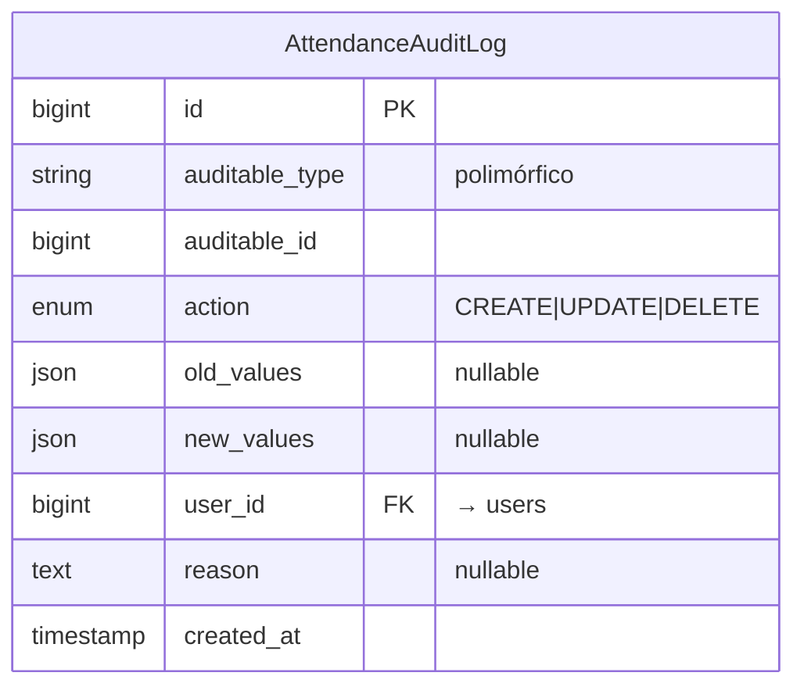
```mermaid
erDiagram
    AttendanceAuditLog {
        bigint id PK
        string auditable_type "polimórfico"
        bigint auditable_id
        enum action "CREATE|UPDATE|DELETE"
        json old_values "nullable"
        json new_values "nullable"
        bigint user_id FK "→ users"
        text reason "nullable"
        timestamp created_at
    }
```

### 1.7 Subdominio: Solicitudes (Employee Requests — Flujo de Aprobación)

> **Decisión de diseño:** `EmployeeRequest` es el wrapper unificado de aprobación para todas las solicitudes. Las entidades concretas se crean **únicamente al aprobarse** — si un registro existe en `negotiated_extra_days`, `leaves` o `vacation_requests`, está aprobado por definición.

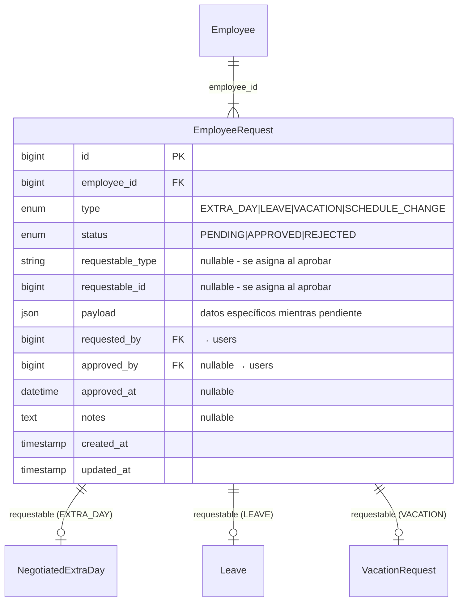
```mermaid
erDiagram
    Employee ||--|{ EmployeeRequest : "employee_id"
    EmployeeRequest ||--o| NegotiatedExtraDay : "requestable (EXTRA_DAY)"
    EmployeeRequest ||--o| Leave : "requestable (LEAVE)"
    EmployeeRequest ||--o| VacationRequest : "requestable (VACATION)"

    EmployeeRequest {
        bigint id PK
        bigint employee_id FK
        enum type "EXTRA_DAY|LEAVE|VACATION|SCHEDULE_CHANGE"
        enum status "PENDING|APPROVED|REJECTED"
        string requestable_type "nullable - se asigna al aprobar"
        bigint requestable_id "nullable - se asigna al aprobar"
        json payload "datos específicos mientras pendiente"
        bigint requested_by FK "→ users"
        bigint approved_by FK "nullable → users"
        datetime approved_at "nullable"
        text notes "nullable"
        timestamp created_at
        timestamp updated_at
    }
```

**Ciclo de vida:**

```
Manager registra → EmployeeRequest{APPROVED} → entidad concreta creada en la misma transacción
Empleado solicita → EmployeeRequest{PENDING} → inbox → Manager aprueba → entidad concreta creada
                                                       → Manager rechaza → no se crea entidad
```

**Estructura del payload por tipo:**

| type | campos del payload |
|---|---|
| `EXTRA_DAY` | `date`, `branch_id`, `salary_pct`, `prima_pct`, `salary_day`, `prima`, `seventh_day`, `total` |
| `LEAVE` | `leave_type_id`, `start_date`, `end_date`, `pay_percentage`, `time_mode`, … |
| `VACATION` | `start_date`, `end_date`, `days_count` |

---

## 2) Diccionarios de campos

### 2.1 `employees` — Empleados

| Campo | Tipo | Null | Default | Descripción | RF |
|-------|------|------|---------|-------------|-----|
| `id` | bigint | NO | auto | PK | — |
| `user_id` | bigint FK | SÍ | NULL | Cuenta de acceso al sistema (tabla `users`). Nullable porque no todo empleado requiere acceso. | RF-01 |
| `code` | varchar(20) | NO | — | Código único del empleado (ej: `EMP-001`). | RF-01 |
| `first_name` | varchar(100) | NO | — | Nombre(s). | RF-01 |
| `last_name` | varchar(100) | NO | — | Apellido(s). | RF-01 |
| `role` | enum | NO | — | Rol operativo: `MANAGER`, `COOK`, `KITCHEN_ASSISTANT`, `DELIVERY_DRIVER`. | RF-02 |
| `is_active` | boolean | NO | true | Empleado habilitado/deshabilitado. | RF-01 |
| `meta` | json | SÍ | NULL | Datos adicionales sin esquema fijo. | — |
| `created_at` | timestamp | NO | now | — | — |
| `updated_at` | timestamp | NO | now | — | — |
| `deleted_at` | timestamp | SÍ | NULL | Soft delete. | — |

**Constraints:** UNIQUE(`code`). INDEX(`is_active`).

---

### 2.2 `employment_periods` — Periodos Laborales

| Campo | Tipo | Null | Default | Descripción | RF |
|-------|------|------|---------|-------------|-----|
| `id` | bigint | NO | auto | PK | — |
| `employee_id` | bigint FK | NO | — | Empleado al que pertenece el periodo. | RF-05 |
| `branch_id` | bigint FK | NO | — | Sucursal asignada durante este periodo. | RF-03 |
| `start_date` | date | NO | — | Inicio del periodo laboral. | RF-05 |
| `end_date` | date | SÍ | NULL | Fin del periodo. NULL = periodo activo/vigente. | RF-05 |
| `termination_reason` | varchar(255) | SÍ | NULL | Motivo de baja (si aplica). | RF-05 |
| `is_active` | boolean | NO | true | Solo un periodo activo por empleado (RN). | RF-06 |
| `meta` | json | SÍ | NULL | Datos adicionales. | — |
| `created_at` | timestamp | NO | now | — | — |
| `updated_at` | timestamp | NO | now | — | — |

**Constraints:** Solo un registro con `is_active = true` por `employee_id` (CHECK/application-level).

---

### 2.3 `employee_schedules` — Horarios (cabecera versionada)

| Campo | Tipo | Null | Default | Descripción | RF |
|-------|------|------|---------|-------------|-----|
| `id` | bigint | NO | auto | PK | — |
| `employment_period_id` | bigint FK | NO | — | Periodo laboral asociado. | RF-09 |
| `effective_from` | date | NO | — | Inicio de vigencia. | RF-09 |
| `effective_to` | date | SÍ | NULL | Fin de vigencia. NULL = vigente. | RF-09 |
| `workday_type` | enum | NO | — | `FULL` (jornada completa) o `PARTIAL` (variable). | RF-10 |
| `working_days_per_week` | smallint | NO | 6 | Días laborales por semana (base para prorrateo de bono). | RF-34 |
| `created_at` | timestamp | NO | now | — | — |
| `updated_at` | timestamp | NO | now | — | — |

---

### 2.4 `schedule_days` — Definición por día de la semana

| Campo | Tipo | Null | Default | Descripción | RF |
|-------|------|------|---------|-------------|-----|
| `id` | bigint | NO | auto | PK | — |
| `employee_schedule_id` | bigint FK | NO | — | Horario al que pertenece. | RF-08 |
| `day_of_week` | smallint | NO | — | Día ISO: 1=Lun, 2=Mar, ..., 7=Dom. | RF-08 |
| `is_day_off` | boolean | NO | false | Día de descanso programado. | RF-08 |
| `expected_start` | time | SÍ | NULL | Hora esperada de entrada. NULL si `is_day_off`. | RF-08 |
| `expected_lunch_start` | time | SÍ | NULL | Hora esperada de inicio de comida. | RF-08 |
| `expected_lunch_end` | time | SÍ | NULL | Hora esperada de regreso de comida. | RF-08 |
| `lunch_duration_minutes` | smallint | SÍ | NULL | Duración esperada de comida en minutos. Usado para pre-calcular regreso esperado cuando la salida real difiere de la programada. | RF-14 |
| `expected_end` | time | SÍ | NULL | Hora esperada de salida. | RF-08 |
| `created_at` | timestamp | NO | now | — | — |
| `updated_at` | timestamp | NO | now | — | — |

**Constraints:** UNIQUE(`employee_schedule_id`, `day_of_week`).

---

### 2.5 `wage_histories` — Historial de Sueldo

| Campo | Tipo | Null | Default | Descripción | RF |
|-------|------|------|---------|-------------|-----|
| `id` | bigint | NO | auto | PK | — |
| `employee_id` | bigint FK | NO | — | Empleado. | RF-22 |
| `hourly_rate` | decimal(10,2) | NO | — | Tarifa por hora (unidad atómica de compensación). | RF-22 |
| `weekly_scheduled_hours` | decimal(5,2) | NO | — | Horas semanales contratadas (snapshot de la jornada vigente). | RF-22, RF-10 |
| `effective_from` | date | NO | — | Inicio de vigencia. | RF-22 |
| `effective_to` | date | SÍ | NULL | Fin de vigencia. NULL = vigente. | RF-22 |
| `created_at` | timestamp | NO | now | — | — |
| `updated_at` | timestamp | NO | now | — | — |

---

### 2.6 `overtime_pay_configs` — Configuración de Pago de Hora Extra por Empleado

| Campo | Tipo | Null | Default | Descripción | RF |
|-------|------|------|---------|-------------|-----|
| `id` | bigint | NO | auto | PK | — |
| `employee_id` | bigint FK | NO | — | Empleado. | RF-47c |
| `method` | enum | NO | — | `LFT_PROPORTIONAL` o `AGREED_RATE`. | DC-03 |
| `hourly_rate` | decimal(10,2) | SÍ | NULL | Tarifa fija por hora. Solo cuando method = `AGREED_RATE`. | DC-03 |
| `lft_factor` | decimal(5,2) | SÍ | NULL | Factor LFT (ej: 2.00 = doble). Solo cuando method = `LFT_PROPORTIONAL`. | DC-03 |
| `effective_from` | date | NO | — | Inicio de vigencia. | RF-47c |
| `effective_to` | date | SÍ | NULL | Fin. NULL = vigente. | RF-47c |
| `created_at` | timestamp | NO | now | — | — |
| `updated_at` | timestamp | NO | now | — | — |

---

### 2.7 `attendances` — Registro de Asistencia Diaria

| Campo | Tipo | Null | Default | Descripción | RF |
|-------|------|------|---------|-------------|-----|
| `id` | bigint | NO | auto | PK | — |
| `employee_id` | bigint FK | NO | — | Empleado. | RF-11 |
| `date` | date | NO | — | Fecha del día de trabajo. | RF-11 |
| `check_in` | datetime | SÍ | NULL | Hora real de entrada. | RF-11 |
| `check_out` | datetime | SÍ | NULL | Hora real de salida. | RF-12 |
| `lunch_start` | datetime | SÍ | NULL | Inicio de comida (opcional). | RF-14 |
| `lunch_end` | datetime | SÍ | NULL | Regreso de comida. | RF-15a |
| `entry_late_seconds` | integer | NO | 0 | Segundos de tardanza en entrada (calculado: check_in − expected_start). 0 si puntual. | RF-13, RF-15a |
| `lunch_late_seconds` | integer | NO | 0 | Segundos de tardanza en regreso de comida (calculado: lunch_end − expected_lunch_end). | RF-15a |
| `net_worked_minutes` | integer | SÍ | NULL | Minutos netos trabajados (descontando comida). Calculado. | RF-14 |
| `overtime_minutes` | integer | NO | 0 | Minutos extra trabajados (check_out − expected_end). | RF-42 |
| `overtime_authorized` | boolean | NO | false | ¿Manager autorizó pago de horas extra? | DC-01, RF-47a |
| `overtime_authorized_by` | bigint FK | SÍ | NULL | Usuario que autorizó (→ `users`). | RF-47b |
| `overtime_authorized_at` | datetime | SÍ | NULL | Cuándo se autorizó. | RF-47b |
| `day_status` | enum | NO | — | Estatus del día: `WORKED`, `DAY_OFF`, `LEAVE`, `VACATION`, `HOLIDAY`, `ABSENCE`, `EXTRA`. | RF-16 |
| `confirmed_by` | bigint FK | SÍ | NULL | Usuario que confirmó el estatus (→ `users`). | RF-15 |
| `meta` | json | SÍ | NULL | Datos adicionales. | — |
| `created_at` | timestamp | NO | now | — | — |
| `updated_at` | timestamp | NO | now | — | — |

**Constraints:** UNIQUE(`employee_id`, `date`). INDEX(`date`). INDEX(`day_status`).

---

### 2.8 `partial_leaves` — Permisos Parciales

| Campo | Tipo | Null | Default | Descripción | RF |
|-------|------|------|---------|-------------|-----|
| `id` | bigint | NO | auto | PK | — |
| `employee_id` | bigint FK | NO | — | Empleado. | RF-25a |
| `attendance_id` | bigint FK | SÍ | NULL | Referencia al registro de asistencia del día (si existe). | RF-25a |
| `date` | date | NO | — | Fecha del permiso. | RF-25a |
| `type` | enum | NO | — | `ARRIVE_LATE`, `LEAVE_EARLY`, `TAKE_TIME`. | RF-25a |
| `is_paid` | boolean | NO | — | `true` = con goce, `false` = sin goce. | RF-25a |
| `start_time` | time | SÍ | NULL | Hora inicio del permiso (nullable si solo se indica duración). | RF-25a |
| `end_time` | time | SÍ | NULL | Hora fin del permiso. | RF-25a |
| `duration_minutes` | integer | NO | — | Duración total en minutos. Si hay start/end, se calcula; si no, se indica directamente. | RF-25a |
| `reason` | text | SÍ | NULL | Motivo del permiso. | RF-25a |
| `approved_by` | bigint FK | NO | — | Usuario que aprobó (→ `users`). | RF-25a |
| `created_at` | timestamp | NO | now | — | — |
| `updated_at` | timestamp | NO | now | — | — |

---

### 2.9 `negotiated_extra_days` — Días Extra Negociados (Aprobados)

> **v1.1:** Se agrega `request_id` (FK nullable) para trazabilidad. El renombramiento de columnas (`salary_day`, `prima`, `seventh_day`) y la eliminación de los campos de ciclo de aprobación (`approved_by`, `status`) se posponen a una tarea futura.

| Campo | Tipo | Null | Default | Descripción | RF |
|-------|------|------|---------|-------------|-----|
| `id` | bigint | NO | auto | PK | — |
| `employee_id` | bigint FK | NO | — | Empleado. | RF-38 |
| `date` | date | NO | — | Fecha del día extra. | RF-39 |
| `branch_id` | bigint FK | NO | — | Sucursal donde trabajó. | RF-39 |
| `agreed_daily_wage` | decimal(10,4) | NO | — | Salario diario acordado. | RF-39 |
| `prima_percent` | decimal(7,4) | NO | — | Porcentaje de prima sobre el salario diario. | RF-39 |
| `prima_amount` | decimal(10,4) | NO | — | Monto de prima (= agreed_daily_wage × prima_percent / 100). | RF-39 |
| `approved_by` | bigint FK | NO | — | Usuario que aprobó (→ `users`). | RF-39 |
| `status` | varchar | NO | APPROVED | Estado (siempre APPROVED; el registro existe en estado aprobado). | RF-39 |
| `request_id` | bigint FK | SÍ | NULL | Solicitud de origen (→ `employee_requests`). Nullable; se popula en nuevas creaciones. | RF-39, RN-09 |
| `notes` | text | SÍ | NULL | Notas/observaciones. | RF-39 |
| `created_at` | timestamp | NO | now | — | — |
| `updated_at` | timestamp | NO | now | — | — |

**Constraints:** UNIQUE(`employee_id`, `date`) WHERE deleted_at IS NULL (partial). INDEX(`request_id`).

---

### 2.10 `overtime_bank_movements` — Movimientos del Banco de Horas Extra

| Campo | Tipo | Null | Default | Descripción | RF |
|-------|------|------|---------|-------------|-----|
| `id` | bigint | NO | auto | PK | — |
| `employee_id` | bigint FK | NO | — | Empleado. | RF-42 |
| `attendance_id` | bigint FK | SÍ | NULL | Referencia al registro de asistencia (para EARNED/PAID automáticos). | RF-47b |
| `date` | date | NO | — | Fecha del movimiento. | RF-45 |
| `minutes` | integer | NO | — | Minutos del movimiento (positivos siempre; el tipo indica dirección). | RF-45 |
| `movement_type` | enum | NO | — | `EARNED`, `USED`, `PAID`, `ADJUSTMENT`. | RF-44 |
| `origin` | enum | NO | — | `AUTO` (sistema) o `MANUAL` (captura). | RF-43, RF-45 |
| `valuation_method` | enum | SÍ | NULL | Método de valuación (solo para `PAID`): `LFT_PROPORTIONAL`, `AGREED_RATE`. | RF-47b, DC-03 |
| `applied_rate` | decimal(10,2) | SÍ | NULL | Tarifa aplicada (solo para `PAID`). | RF-47b |
| `amount` | decimal(10,2) | SÍ | NULL | Monto resultante (solo para `PAID`). | RF-47b |
| `authorized_by` | bigint FK | SÍ | NULL | Quién autorizó (→ `users`). | RF-45, RF-47a |
| `authorized_at` | datetime | SÍ | NULL | Cuándo se autorizó. | RF-47a |
| `reason` | text | SÍ | NULL | Motivo/justificación del movimiento. | RF-45 |
| `created_at` | timestamp | NO | now | — | — |
| `updated_at` | timestamp | NO | now | — | — |

---

### 2.11 `leave_types` — Catálogo de Tipos de Permiso

| Campo | Tipo | Null | Default | Descripción | RF |
|-------|------|------|---------|-------------|-----|
| `id` | bigint | NO | auto | PK | — |
| `name` | varchar(100) | NO | — | Nombre del tipo de permiso. | RF-24 |
| `code` | varchar(30) | NO | — | Código único (ej: `MEDICAL`, `PERSONAL`). | RF-24 |
| `is_paid` | boolean | NO | false | Con goce de sueldo por defecto. | RF-24 |
| `is_partial` | boolean | NO | false | ¿Permite uso parcial (horas/minutos)? | RF-24 |
| `generates_rest` | boolean | NO | false | ¿Genera descanso proporcional? | RF-24 |
| `counts_for_bonus` | boolean | NO | true | ¿Cuenta para bono de puntualidad? | RF-24 |
| `is_active` | boolean | NO | true | Activo en catálogo. | RF-24 |
| `created_at` | timestamp | NO | now | — | — |
| `updated_at` | timestamp | NO | now | — | — |

**Constraints:** UNIQUE(`code`).

---

### 2.12 `leaves` — Permisos (Solicitud + Aprobación)

> **v1.1:** La integración con `EmployeeRequest` (campo `request_id` y retiro de campos de ciclo de aprobación) se pospone a una tarea futura. La tabla mantiene su ciclo de aprobación actual.

| Campo | Tipo | Null | Default | Descripción | RF |
|-------|------|------|---------|-------------|-----|
| `id` | bigint | NO | auto | PK | — |
| `employee_id` | bigint FK | NO | — | Empleado. | RF-25 |
| `leave_type_id` | bigint FK | NO | — | Tipo de permiso del catálogo. | RF-25 |
| `start_date` | date | NO | — | Fecha inicio. | RF-25 |
| `end_date` | date | NO | — | Fecha fin (= start_date si un solo día). | RF-25 |
| `pay_percentage` | decimal(5,2) | SÍ | NULL | Override de % de pago. NULL = usar default del tipo. | RF-25 |
| `rest_day_factor` | enum | SÍ | NULL | Override del factor de descanso: FULL, PROPORTIONAL, NONE. | RF-25 |
| `time_mode` | enum | SÍ | NULL | SCHEDULED o OPEN_ENDED. Requerido para tipos PROPORTIONAL_HOURS. | RF-25a |
| `scheduled_start_time` | time | SÍ | NULL | Hora planificada de salida. | RF-25a |
| `scheduled_end_time` | time | SÍ | NULL | Hora planificada de regreso. | RF-25a |
| `actual_start_time` | time | SÍ | NULL | Hora real de salida (desde vista Today). | RF-25a |
| `actual_end_time` | time | SÍ | NULL | Hora real de regreso. NULL si no regresó. | RF-25a |
| `actual_duration_minutes` | integer | SÍ | NULL | Minutos ausente. Calculado desde tiempos reales. | RF-25a |
| `status` | enum | NO | PENDING | Estado: PENDING, APPROVED, REJECTED, CANCELLED. | RF-25 |
| `requested_by` | bigint FK | NO | — | Usuario que registró la solicitud (→ `users`). | RF-25 |
| `approved_by` | bigint FK | SÍ | NULL | Usuario que aprobó/rechazó (→ `users`). | RF-25 |
| `approved_at` | datetime | SÍ | NULL | Fecha/hora de aprobación o rechazo. | RF-25 |
| `notes` | text | SÍ | NULL | Notas. | RF-25 |
| `created_at` | timestamp | NO | now | — | — |
| `updated_at` | timestamp | NO | now | — | — |

---

### 2.13 `holidays` — Catálogo de Días Festivos

| Campo | Tipo | Null | Default | Descripción | RF |
|-------|------|------|---------|-------------|-----|
| `id` | bigint | NO | auto | PK | — |
| `date` | date | NO | — | Fecha del festivo. | RF-29 |
| `name` | varchar(100) | NO | — | Nombre del festivo. | RF-29 |
| `pay_multiplier` | decimal(3,1) | NO | 2.0 | Factor de pago: 1.0 normal, 2.0 doble, 3.0 triple. | RF-30 |
| `is_active` | boolean | NO | true | Activo. | RF-29 |
| `created_at` | timestamp | NO | now | — | — |
| `updated_at` | timestamp | NO | now | — | — |

**Constraints:** UNIQUE(`date`).

---

### 2.14 `vacation_entitlements` — Derechos de Vacaciones

| Campo | Tipo | Null | Default | Descripción | RF |
|-------|------|------|---------|-------------|-----|
| `id` | bigint | NO | auto | PK | — |
| `employee_id` | bigint FK | NO | — | Empleado. | RF-26 |
| `year` | smallint | NO | — | Año al que corresponde. | RF-26 |
| `entitled_days` | decimal(5,2) | NO | — | Días de vacaciones que le corresponden (LFT MX). | RF-26 |
| `used_days` | decimal(5,2) | NO | 0.00 | Días utilizados. | RF-26 |
| `created_at` | timestamp | NO | now | — | — |
| `updated_at` | timestamp | NO | now | — | — |

**Constraints:** UNIQUE(`employee_id`, `year`).

**Columna calculada (app-level):** `remaining_days = entitled_days − used_days`.

---

### 2.15 `vacation_requests` — Solicitudes de Vacaciones

> **v1.1:** La integración con `EmployeeRequest` (`request_id` y retiro de campos de ciclo de aprobación) se pospone a una tarea futura.

| Campo | Tipo | Null | Default | Descripción | RF |
|-------|------|------|---------|-------------|-----|
| `id` | bigint | NO | auto | PK | — |
| `employee_id` | bigint FK | NO | — | Empleado. | RF-27 |
| `start_date` | date | NO | — | Fecha inicio. | RF-27 |
| `end_date` | date | NO | — | Fecha fin. | RF-27 |
| `days_count` | decimal(5,2) | NO | — | Días de vacaciones solicitados. | RF-27 |
| `status` | varchar | NO | pending | Estado de la solicitud. | RF-27 |
| `approved_by` | bigint FK | SÍ | NULL | Usuario que aprobó/rechazó (→ `users`). | RF-27 |
| `approved_at` | timestamp | SÍ | NULL | Fecha/hora de aprobación o rechazo. | RF-27 |
| `notes` | text | SÍ | NULL | Notas. | RF-27 |
| `created_at` | timestamp | NO | now | — | — |
| `updated_at` | timestamp | NO | now | — | — |

---

### 2.16 `punctuality_ranges` — Rangos de Bono de Puntualidad

| Campo | Tipo | Null | Default | Descripción | RF |
|-------|------|------|---------|-------------|-----|
| `id` | bigint | NO | auto | PK | — |
| `min_seconds` | integer | NO | — | Límite inferior del rango (inclusive). | RF-32 |
| `max_seconds` | integer | SÍ | NULL | Límite superior (exclusive). NULL = sin límite (26:00+). | RF-32 |
| `bonus_percentage` | decimal(5,2) | NO | — | Porcentaje de bono que aplica. | RF-32 |
| `sort_order` | smallint | NO | — | Orden de evaluación. | RF-32 |
| `created_at` | timestamp | NO | now | — | — |
| `updated_at` | timestamp | NO | now | — | — |

---

### 2.17 `punctuality_bonus_groups` — Grupos de Bono de Puntualidad

| Campo | Tipo | Null | Default | Descripción | RF |
|-------|------|------|---------|-------------|-----|
| `id` | bigint | NO | auto | PK | — |
| `name` | varchar(50) | NO | — | Nombre del grupo (ej: "Grupo $110", "Grupo $100", "Grupo $50"). | RF-33 |
| `weekly_bonus_amount` | decimal(10,2) | NO | — | Monto semanal base del bono. | RF-33 |
| `working_days_divisor` | smallint | NO | — | Divisor para prorrateo diario (ej: 6 o 3). | RF-34 |
| `is_active` | boolean | NO | true | Activo. | RF-33 |
| `created_at` | timestamp | NO | now | — | — |
| `updated_at` | timestamp | NO | now | — | — |

---

### 2.18 `employee_bonus_configs` — Asignación Empleado → Grupo de Bono

| Campo | Tipo | Null | Default | Descripción | RF |
|-------|------|------|---------|-------------|-----|
| `id` | bigint | NO | auto | PK | — |
| `employee_id` | bigint FK | NO | — | Empleado. | RF-33 |
| `punctuality_bonus_group_id` | bigint FK | NO | — | Grupo de bono asignado. | RF-33 |
| `effective_from` | date | NO | — | Inicio de vigencia. | RF-33 |
| `effective_to` | date | SÍ | NULL | Fin de vigencia. NULL = vigente. | RF-33 |
| `created_at` | timestamp | NO | now | — | — |
| `updated_at` | timestamp | NO | now | — | — |

---

### 2.19 `punctuality_exceptions` — Excepciones de Puntualidad por Empleado

| Campo | Tipo | Null | Default | Descripción | RF |
|-------|------|------|---------|-------------|-----|
| `id` | bigint | NO | auto | PK | — |
| `employee_id` | bigint FK | NO | — | Empleado. | RF-37 |
| `day_of_week` | smallint | SÍ | NULL | Día ISO (1-7). NULL = aplica todos los días. | RF-37 |
| `forced_percentage` | decimal(5,2) | NO | — | Porcentaje forzado (ej: 0.00 para Andrea Mar/Mié/Jue). | RF-37 |
| `effective_from` | date | NO | — | Inicio de vigencia. | RF-37 |
| `effective_to` | date | SÍ | NULL | Fin. NULL = vigente. | RF-37 |
| `reason` | varchar(255) | SÍ | NULL | Motivo de la excepción. | RF-37 |
| `created_at` | timestamp | NO | now | — | — |
| `updated_at` | timestamp | NO | now | — | — |

---

### 2.20 `pay_periods` — Periodos de Pago (Cierre Semanal)

| Campo | Tipo | Null | Default | Descripción | RF |
|-------|------|------|---------|-------------|-----|
| `id` | bigint | NO | auto | PK | — |
| `branch_id` | bigint FK | NO | — | Sucursal. | RF-20 |
| `period_start` | date | NO | — | Inicio del periodo (lunes). | RF-20 |
| `period_end` | date | NO | — | Fin del periodo (domingo). | RF-20 |
| `status` | enum | NO | `OPEN` | `OPEN`, `CLOSED`, `REOPENED`. | RF-20, RF-21 |
| `closed_by` | bigint FK | SÍ | NULL | Quién cerró (→ `users`). | RF-20 |
| `closed_at` | datetime | SÍ | NULL | Cuándo se cerró. | RF-20 |
| `reopened_by` | bigint FK | SÍ | NULL | Quién reabrió (→ `users`). | RF-21 |
| `reopened_at` | datetime | SÍ | NULL | Cuándo se reabrió. | RF-21 |
| `reopen_reason` | text | SÍ | NULL | Motivo de reapertura. | RF-21 |
| `meta` | json | SÍ | NULL | Datos adicionales. | — |
| `created_at` | timestamp | NO | now | — | — |
| `updated_at` | timestamp | NO | now | — | — |

**Constraints:** UNIQUE(`branch_id`, `period_start`, `period_end`).

---

### 2.21 `pay_period_employees` — Snapshot por Empleado en el Cierre

| Campo | Tipo | Null | Default | Descripción | RF |
|-------|------|------|---------|-------------|-----|
| `id` | bigint | NO | auto | PK | — |
| `pay_period_id` | bigint FK | NO | — | Periodo de pago. | RF-20 |
| `employee_id` | bigint FK | NO | — | Empleado. | RF-49 |
| `base_pay` | decimal(10,2) | NO | — | Sueldo base del periodo. | RF-23 |
| `late_deductions` | decimal(10,2) | NO | 0.00 | Total descuentos por tardanza >30 min. | RN-00 |
| `unpaid_leave_deductions` | decimal(10,2) | NO | 0.00 | Total descuentos por permisos sin goce. | RN-00d |
| `overtime_pay` | decimal(10,2) | NO | 0.00 | Total pago horas extra autorizadas. | RF-47b |
| `extra_day_pay` | decimal(10,2) | NO | 0.00 | Total pago días extra negociados. | RF-41 |
| `punctuality_bonus` | decimal(10,2) | NO | 0.00 | Total bono de puntualidad. | RF-34 |
| `holiday_pay` | decimal(10,2) | NO | 0.00 | Pago extra por festivos laborados. | RF-31 |
| `other_adjustments` | decimal(10,2) | NO | 0.00 | Otros ajustes (positivos o negativos). | — |
| `total_pay` | decimal(10,2) | NO | — | **Total a pagar** (suma de todos los conceptos). | RF-49 |
| `free_hours_earned` | decimal(4,2) | NO | 0.00 | Horas libres ganadas por puntualidad. | RF-36 |
| `daily_snapshot` | json | NO | — | Evidencia diaria congelada (tabla día por día). | RF-20 |
| `created_at` | timestamp | NO | now | — | — |
| `updated_at` | timestamp | NO | now | — | — |

**Constraints:** UNIQUE(`pay_period_id`, `employee_id`).

**Fórmula de `total_pay`:**
```
total_pay = base_pay
          - late_deductions
          - unpaid_leave_deductions
          + overtime_pay
          + extra_day_pay
          + punctuality_bonus
          + holiday_pay
          + other_adjustments
```

---

### 2.22 `pay_period_lines` — Líneas de Detalle del Cierre

| Campo | Tipo | Null | Default | Descripción | RF |
|-------|------|------|---------|-------------|-----|
| `id` | bigint | NO | auto | PK | — |
| `pay_period_employee_id` | bigint FK | NO | — | Snapshot del empleado. | RF-49 |
| `date` | date | NO | — | Fecha a la que corresponde la línea. | RF-49 |
| `concept` | enum | NO | — | Concepto (ver enum abajo). | RF-49 |
| `description` | varchar(255) | NO | — | Descripción legible. | RF-49 |
| `amount` | decimal(10,2) | NO | — | Monto (negativo para descuentos). | RF-49 |
| `minutes` | integer | SÍ | NULL | Minutos relacionados (para conceptos basados en tiempo). | RF-49 |
| `meta` | json | SÍ | NULL | Contexto adicional (tarifa, método, etc.). | RF-49 |
| `created_at` | timestamp | NO | now | — | — |
| `updated_at` | timestamp | NO | now | — | — |

---

### 2.23 `employee_requests` — Solicitud de Empleado (Wrapper de Aprobación)

> Entidad unificada de aprobación. Guarda la solicitud en estado pendiente (payload JSON) hasta que el manager aprueba o rechaza. Al aprobar, se crea la entidad concreta y se asignan `requestable_type / requestable_id`.

| Campo | Tipo | Null | Default | Descripción | RF |
|-------|------|------|---------|-------------|-----|
| `id` | bigint | NO | auto | PK | — |
| `employee_id` | bigint FK | NO | — | Empleado al que corresponde la solicitud (→ `employees`). | RF-38 |
| `type` | enum | NO | — | `EXTRA_DAY`, `LEAVE`, `VACATION`, `SCHEDULE_CHANGE`. | — |
| `status` | enum | NO | `PENDING` | `PENDING`, `APPROVED`, `REJECTED`, `CANCELLED`. | RN-09 |
| `requestable_type` | varchar(100) | SÍ | NULL | Clase del modelo polimórfico. Se asigna al aprobar (ej: `NegotiatedExtraDay`). | — |
| `requestable_id` | bigint | SÍ | NULL | FK a la entidad concreta. Se asigna al aprobar. | — |
| `payload` | json | NO | — | Datos específicos del tipo mientras está pendiente. Los consume el handler al aprobar. | — |
| `requested_by` | bigint FK | NO | — | Usuario que creó la solicitud (→ `users`). | RF-38 |
| `approved_by` | bigint FK | SÍ | NULL | Usuario que aprobó o rechazó (→ `users`). En auto-aprobación por manager, se asigna el id del manager (= `requested_by`). | RN-09 |
| `approved_at` | datetime | SÍ | NULL | Cuándo se aprobó o rechazó. | — |
| `notes` | text | SÍ | NULL | Notas / justificación. | — |
| `created_at` | timestamp | NO | now | — | — |
| `updated_at` | timestamp | NO | now | — | — |

**Constraints:** INDEX(`employee_id`, `status`). INDEX(`requestable_type`, `requestable_id`). INDEX(`type`, `status`).

**Reglas de negocio:**
- Cuando `requested_by = manager` y `type = EXTRA_DAY`: el status se establece como `APPROVED` al crear (auto-aprobación). La entidad concreta se crea en la misma transacción.
- `requestable_type` y `requestable_id` son NULL mientras `status = PENDING` o `REJECTED`. Se asignan solo al `APPROVED`.
- Rechazar una solicitud nunca crea una entidad concreta.
- **Cancelar una solicitud en estado APPROVED elimina la entidad concreta asociada (requestable) y anula `requestable_type`/`requestable_id` en la misma transacción.** Esto preserva el invariante "existencia = aprobado" en las tablas de entidades concretas. Debe crearse una entrada en el log de auditoría.

---

### 2.24 `attendance_audit_logs` — Auditoría de Cambios

| Campo | Tipo | Null | Default | Descripción | RF |
|-------|------|------|---------|-------------|-----|
| `id` | bigint | NO | auto | PK | — |
| `auditable_type` | varchar(100) | NO | — | Tipo del modelo (polimórfico, ej: `Attendance`, `PartialLeave`). | RF-19 |
| `auditable_id` | bigint | NO | — | ID del registro modificado. | RF-19 |
| `action` | enum | NO | — | `CREATE`, `UPDATE`, `DELETE`. | RF-19 |
| `old_values` | json | SÍ | NULL | Valores antes del cambio. | RF-19 |
| `new_values` | json | SÍ | NULL | Valores después del cambio. | RF-19 |
| `user_id` | bigint FK | NO | — | Quién hizo el cambio (→ `users`). | RF-19 |
| `reason` | text | SÍ | NULL | Justificación del cambio. | RF-19 |
| `created_at` | timestamp | NO | now | — | — |

---

## 3) Definición de Enums

### 3.1 Enums de dominio

| Enum | Valores | Usado en |
|------|---------|----------|
| **EmployeeRole** | `MANAGER`, `COOK`, `KITCHEN_ASSISTANT`, `DELIVERY_DRIVER` | `employees.role` |
| **WorkdayType** | `FULL`, `PARTIAL` | `employee_schedules.workday_type` |
| **DayStatus** | `WORKED`, `DAY_OFF`, `LEAVE`, `VACATION`, `HOLIDAY`, `ABSENCE`, `EXTRA` | `attendances.day_status` |
| **RequestType** | `EXTRA_DAY`, `LEAVE`, `VACATION`, `SCHEDULE_CHANGE` | `employee_requests.type` |
| **RequestStatus** | `PENDING`, `APPROVED`, `REJECTED`, `CANCELLED` | `employee_requests.status` |
| **PartialLeaveType** | `ARRIVE_LATE`, `LEAVE_EARLY`, `TAKE_TIME` | `partial_leaves.type` |
| **OvertimeMovementType** | `EARNED`, `USED`, `PAID`, `ADJUSTMENT` | `overtime_bank_movements.movement_type` |
| **OvertimeOrigin** | `AUTO`, `MANUAL` | `overtime_bank_movements.origin` |
| **OvertimeValuationMethod** | `LFT_PROPORTIONAL`, `AGREED_RATE` | `overtime_pay_configs.method`, `overtime_bank_movements.valuation_method` |
| **PayPeriodStatus** | `OPEN`, `CLOSED`, `REOPENED` | `pay_periods.status` |
| **PayConcept** | `BASE_PAY`, `LATE_DEDUCTION`, `UNPAID_LEAVE`, `OVERTIME`, `EXTRA_DAY`, `PUNCTUALITY_BONUS`, `HOLIDAY`, `OTHER` | `pay_period_lines.concept` |
| **AuditAction** | `CREATE`, `UPDATE`, `DELETE` | `attendance_audit_logs.action` |

---

## 4) Diagrama de Clases UML

### 4.1 Clases de Dominio — Empleados y Configuración

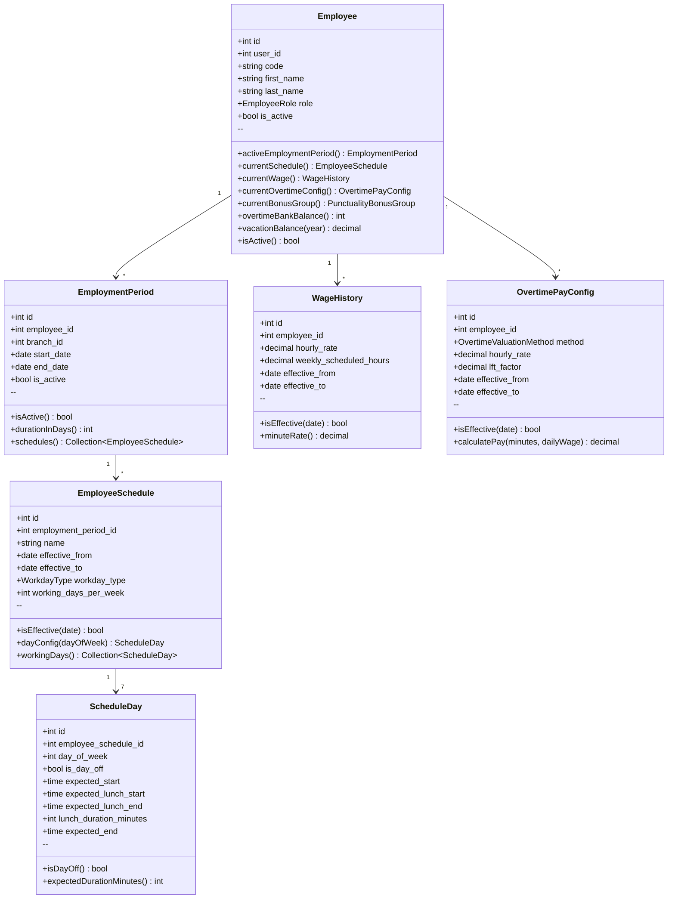
```mermaid
classDiagram
    class Employee {
        +int id
        +int user_id
        +string code
        +string first_name
        +string last_name
        +EmployeeRole role
        +bool is_active
        --
        +activeEmploymentPeriod() EmploymentPeriod
        +currentSchedule() EmployeeSchedule
        +currentWage() WageHistory
        +currentOvertimeConfig() OvertimePayConfig
        +currentBonusGroup() PunctualityBonusGroup
        +overtimeBankBalance() int
        +vacationBalance(year) decimal
        +isActive() bool
    }

    class EmploymentPeriod {
        +int id
        +int employee_id
        +int branch_id
        +date start_date
        +date end_date
        +bool is_active
        --
        +isActive() bool
        +durationInDays() int
        +schedules() Collection~EmployeeSchedule~
    }

    class EmployeeSchedule {
        +int id
        +int employment_period_id
        +string name
        +date effective_from
        +date effective_to
        +WorkdayType workday_type
        +int working_days_per_week
        --
        +isEffective(date) bool
        +dayConfig(dayOfWeek) ScheduleDay
        +workingDays() Collection~ScheduleDay~
    }

    class ScheduleDay {
        +int id
        +int employee_schedule_id
        +int day_of_week
        +bool is_day_off
        +time expected_start
        +time expected_lunch_start
        +time expected_lunch_end
        +int lunch_duration_minutes
        +time expected_end
        --
        +isDayOff() bool
        +expectedDurationMinutes() int
    }

    class WageHistory {
        +int id
        +int employee_id
        +decimal hourly_rate
        +decimal weekly_scheduled_hours
        +date effective_from
        +date effective_to
        --
        +isEffective(date) bool
        +minuteRate() decimal
    }

    class OvertimePayConfig {
        +int id
        +int employee_id
        +OvertimeValuationMethod method
        +decimal hourly_rate
        +decimal lft_factor
        +date effective_from
        +date effective_to
        --
        +isEffective(date) bool
        +calculatePay(minutes, dailyWage) decimal
    }

    Employee "1" --> "*" EmploymentPeriod
    Employee "1" --> "*" WageHistory
    Employee "1" --> "*" OvertimePayConfig
    EmploymentPeriod "1" --> "*" EmployeeSchedule
    EmployeeSchedule "1" --> "7" ScheduleDay
```

### 4.2 Clases de Dominio — Operación Diaria

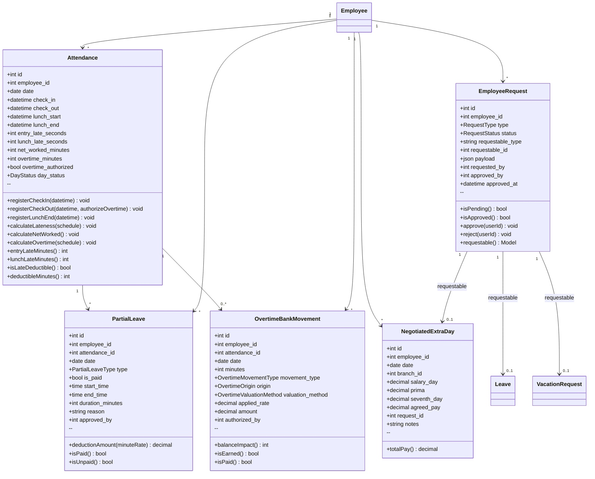
```mermaid
classDiagram
    class Attendance {
        +int id
        +int employee_id
        +date date
        +datetime check_in
        +datetime check_out
        +datetime lunch_start
        +datetime lunch_end
        +int entry_late_seconds
        +int lunch_late_seconds
        +int net_worked_minutes
        +int overtime_minutes
        +bool overtime_authorized
        +DayStatus day_status
        --
        +registerCheckIn(datetime) void
        +registerCheckOut(datetime, authorizeOvertime) void
        +registerLunchEnd(datetime) void
        +calculateLateness(schedule) void
        +calculateNetWorked() void
        +calculateOvertime(schedule) void
        +entryLateMinutes() int
        +lunchLateMinutes() int
        +isLateDeductible() bool
        +deductibleMinutes() int
    }

    class PartialLeave {
        +int id
        +int employee_id
        +int attendance_id
        +date date
        +PartialLeaveType type
        +bool is_paid
        +time start_time
        +time end_time
        +int duration_minutes
        +string reason
        +int approved_by
        --
        +deductionAmount(minuteRate) decimal
        +isPaid() bool
        +isUnpaid() bool
    }

    class NegotiatedExtraDay {
        +int id
        +int employee_id
        +date date
        +int branch_id
        +decimal salary_day
        +decimal prima
        +decimal seventh_day
        +decimal agreed_pay
        +int request_id
        +string notes
        --
        +totalPay() decimal
    }

    class EmployeeRequest {
        +int id
        +int employee_id
        +RequestType type
        +RequestStatus status
        +string requestable_type
        +int requestable_id
        +json payload
        +int requested_by
        +int approved_by
        +datetime approved_at
        --
        +isPending() bool
        +isApproved() bool
        +approve(userId) void
        +reject(userId) void
        +requestable() Model
    }

    class OvertimeBankMovement {
        +int id
        +int employee_id
        +int attendance_id
        +date date
        +int minutes
        +OvertimeMovementType movement_type
        +OvertimeOrigin origin
        +OvertimeValuationMethod valuation_method
        +decimal applied_rate
        +decimal amount
        +int authorized_by
        --
        +balanceImpact() int
        +isEarned() bool
        +isPaid() bool
    }

    Attendance "1" --> "*" PartialLeave
    Attendance "1" --> "0..*" OvertimeBankMovement
    Employee "1" --> "*" Attendance
    Employee "1" --> "*" PartialLeave
    Employee "1" --> "*" NegotiatedExtraDay
    Employee "1" --> "*" OvertimeBankMovement
    Employee "1" --> "*" EmployeeRequest
    EmployeeRequest "1" --> "0..1" NegotiatedExtraDay : requestable
    EmployeeRequest "1" --> "0..1" Leave : requestable
    EmployeeRequest "1" --> "0..1" VacationRequest : requestable
```

### 4.3 Clases de Dominio — Cierre de Nómina

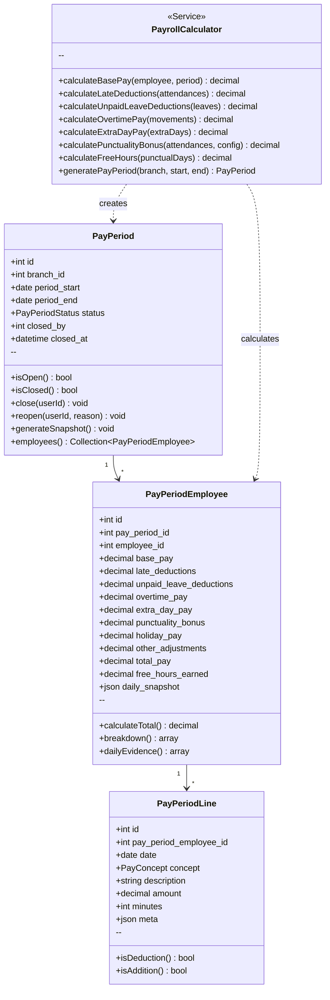
```mermaid
classDiagram
    class PayPeriod {
        +int id
        +int branch_id
        +date period_start
        +date period_end
        +PayPeriodStatus status
        +int closed_by
        +datetime closed_at
        --
        +isOpen() bool
        +isClosed() bool
        +close(userId) void
        +reopen(userId, reason) void
        +generateSnapshot() void
        +employees() Collection~PayPeriodEmployee~
    }

    class PayPeriodEmployee {
        +int id
        +int pay_period_id
        +int employee_id
        +decimal base_pay
        +decimal late_deductions
        +decimal unpaid_leave_deductions
        +decimal overtime_pay
        +decimal extra_day_pay
        +decimal punctuality_bonus
        +decimal holiday_pay
        +decimal other_adjustments
        +decimal total_pay
        +decimal free_hours_earned
        +json daily_snapshot
        --
        +calculateTotal() decimal
        +breakdown() array
        +dailyEvidence() array
    }

    class PayPeriodLine {
        +int id
        +int pay_period_employee_id
        +date date
        +PayConcept concept
        +string description
        +decimal amount
        +int minutes
        +json meta
        --
        +isDeduction() bool
        +isAddition() bool
    }

    class PayrollCalculator {
        <<Service>>
        --
        +calculateBasePay(employee, period) decimal
        +calculateLateDeductions(attendances) decimal
        +calculateUnpaidLeaveDeductions(leaves) decimal
        +calculateOvertimePay(movements) decimal
        +calculateExtraDayPay(extraDays) decimal
        +calculatePunctualityBonus(attendances, config) decimal
        +calculateFreeHours(punctualDays) decimal
        +generatePayPeriod(branch, start, end) PayPeriod
    }

    PayPeriod "1" --> "*" PayPeriodEmployee
    PayPeriodEmployee "1" --> "*" PayPeriodLine
    PayrollCalculator ..> PayPeriod : creates
    PayrollCalculator ..> PayPeriodEmployee : calculates
```

### 4.4 Clases de Dominio — Puntualidad

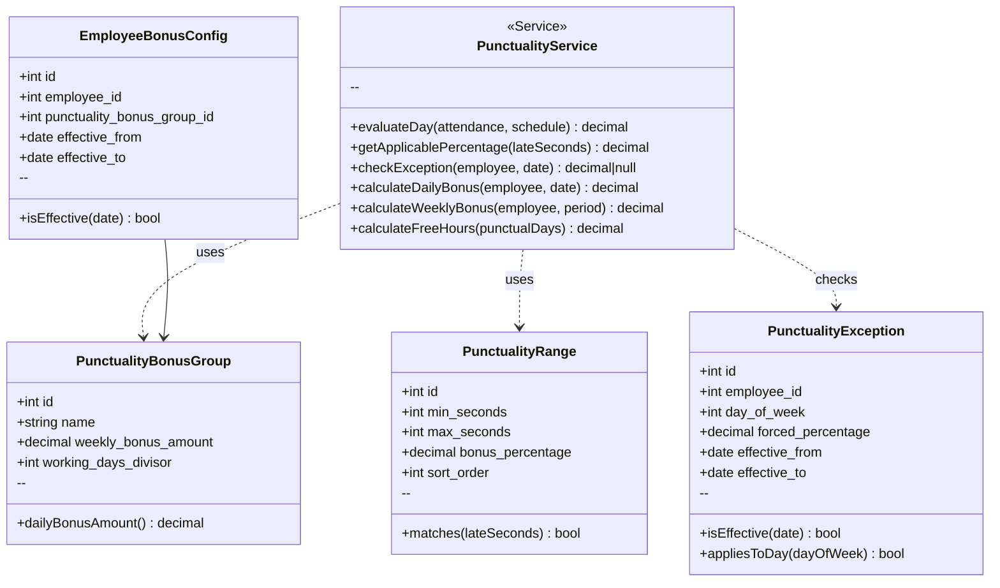
```mermaid
classDiagram
    class PunctualityRange {
        +int id
        +int min_seconds
        +int max_seconds
        +decimal bonus_percentage
        +int sort_order
        --
        +matches(lateSeconds) bool
    }

    class PunctualityBonusGroup {
        +int id
        +string name
        +decimal weekly_bonus_amount
        +int working_days_divisor
        --
        +dailyBonusAmount() decimal
    }

    class EmployeeBonusConfig {
        +int id
        +int employee_id
        +int punctuality_bonus_group_id
        +date effective_from
        +date effective_to
        --
        +isEffective(date) bool
    }

    class PunctualityException {
        +int id
        +int employee_id
        +int day_of_week
        +decimal forced_percentage
        +date effective_from
        +date effective_to
        --
        +isEffective(date) bool
        +appliesToDay(dayOfWeek) bool
    }

    class PunctualityService {
        <<Service>>
        --
        +evaluateDay(attendance, schedule) decimal
        +getApplicablePercentage(lateSeconds) decimal
        +checkException(employee, date) decimal|null
        +calculateDailyBonus(employee, date) decimal
        +calculateWeeklyBonus(employee, period) decimal
        +calculateFreeHours(punctualDays) decimal
    }

    PunctualityService ..> PunctualityRange : uses
    PunctualityService ..> PunctualityBonusGroup : uses
    PunctualityService ..> PunctualityException : checks
    EmployeeBonusConfig --> PunctualityBonusGroup
```

---

## 5) Diagramas de Estado

### 5.1 Ciclo de vida del Periodo de Pago (`PayPeriod`)

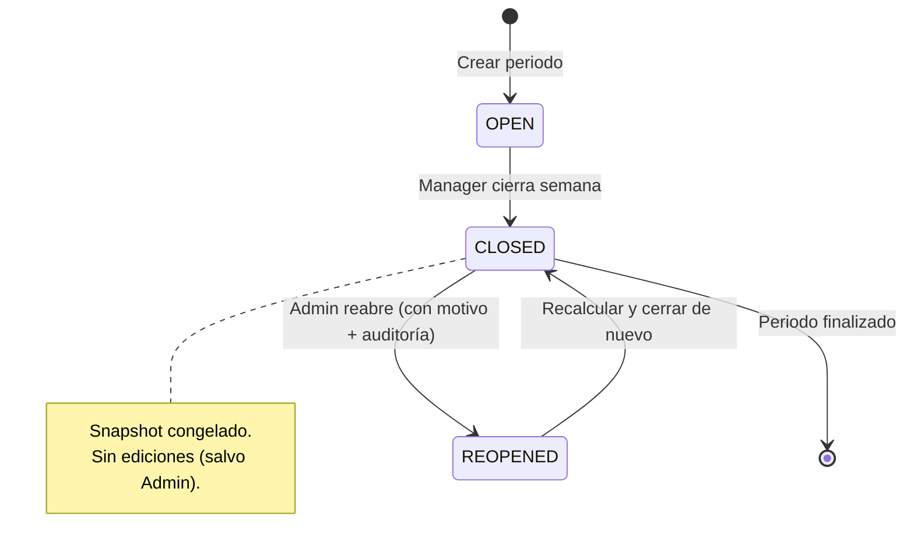
```mermaid
stateDiagram-v2
    [*] --> OPEN : Crear periodo

    OPEN --> CLOSED : Manager cierra semana
    note right of CLOSED
        Snapshot congelado.
        Sin ediciones (salvo Admin).
    end note

    CLOSED --> REOPENED : Admin reabre (con motivo + auditoría)
    REOPENED --> CLOSED : Recalcular y cerrar de nuevo

    CLOSED --> [*] : Periodo finalizado
```

### 5.2 Ciclo de vida de EmployeeRequest

> Aplica a todos los tipos: `EXTRA_DAY`, `LEAVE`, `VACATION`, `SCHEDULE_CHANGE`.
> La entidad concreta (NegotiatedExtraDay, Leave, etc.) se crea **únicamente en APPROVED**.

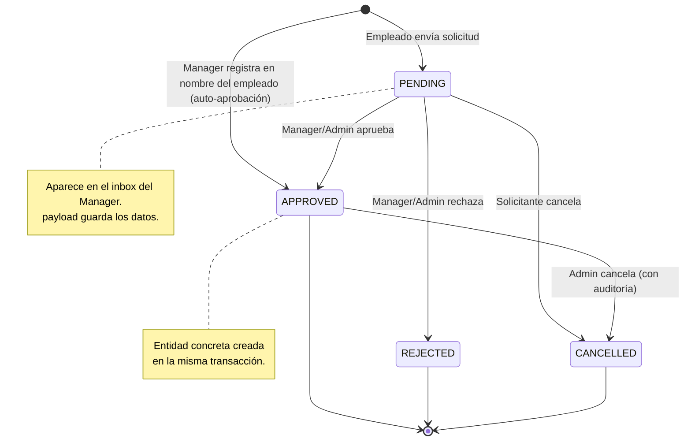
```mermaid
stateDiagram-v2
    [*] --> PENDING : Empleado envía solicitud
    [*] --> APPROVED : Manager registra en nombre del empleado (auto-aprobación)
    note right of APPROVED
        Entidad concreta creada
        en la misma transacción.
    end note

    PENDING --> APPROVED : Manager/Admin aprueba
    note right of PENDING
        Aparece en el inbox del Manager.
        payload guarda los datos.
    end note
    PENDING --> REJECTED : Manager/Admin rechaza
    PENDING --> CANCELLED : Solicitante cancela

    APPROVED --> CANCELLED : Admin cancela (con auditoría)

    APPROVED --> [*]
    REJECTED --> [*]
    CANCELLED --> [*]
```

### 5.3 Flujo del día de asistencia (`Attendance`)

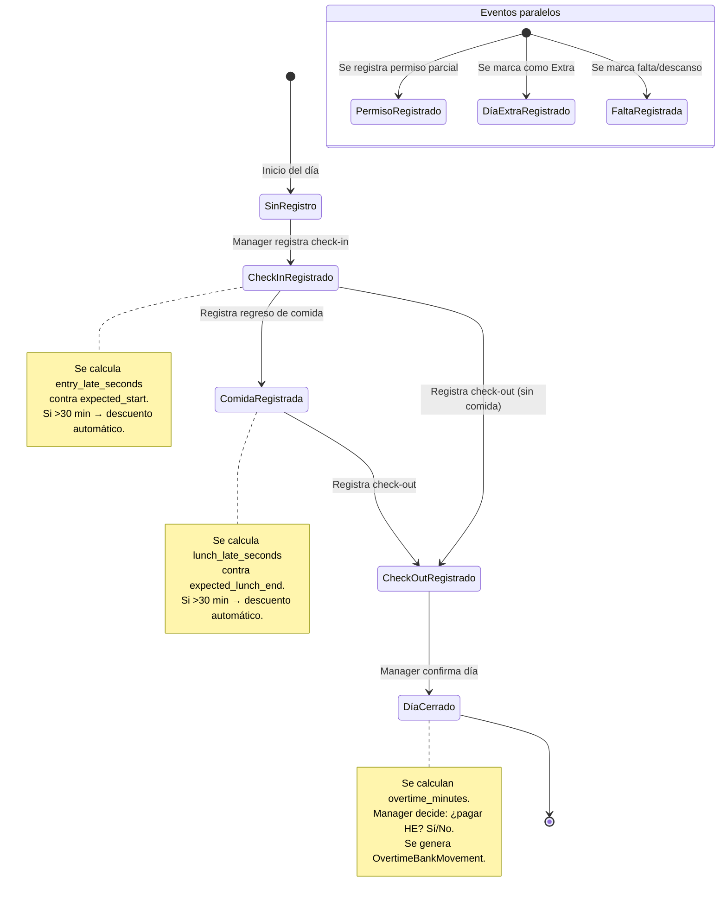
```mermaid
stateDiagram-v2
    [*] --> SinRegistro : Inicio del día

    SinRegistro --> CheckInRegistrado : Manager registra check-in
    note right of CheckInRegistrado
        Se calcula entry_late_seconds
        contra expected_start.
        Si >30 min → descuento automático.
    end note

    CheckInRegistrado --> ComidaRegistrada : Registra regreso de comida
    note right of ComidaRegistrada
        Se calcula lunch_late_seconds
        contra expected_lunch_end.
        Si >30 min → descuento automático.
    end note

    CheckInRegistrado --> CheckOutRegistrado : Registra check-out (sin comida)
    ComidaRegistrada --> CheckOutRegistrado : Registra check-out

    CheckOutRegistrado --> DíaCerrado : Manager confirma día
    note right of DíaCerrado
        Se calculan overtime_minutes.
        Manager decide: ¿pagar HE? Sí/No.
        Se genera OvertimeBankMovement.
    end note

    DíaCerrado --> [*]

    state "Eventos paralelos" as paralelo {
        [*] --> PermisoRegistrado : Se registra permiso parcial
        [*] --> DíaExtraRegistrado : Se marca como Extra
        [*] --> FaltaRegistrada : Se marca falta/descanso
    }
```

### 5.4 Movimientos del Banco de Horas Extra

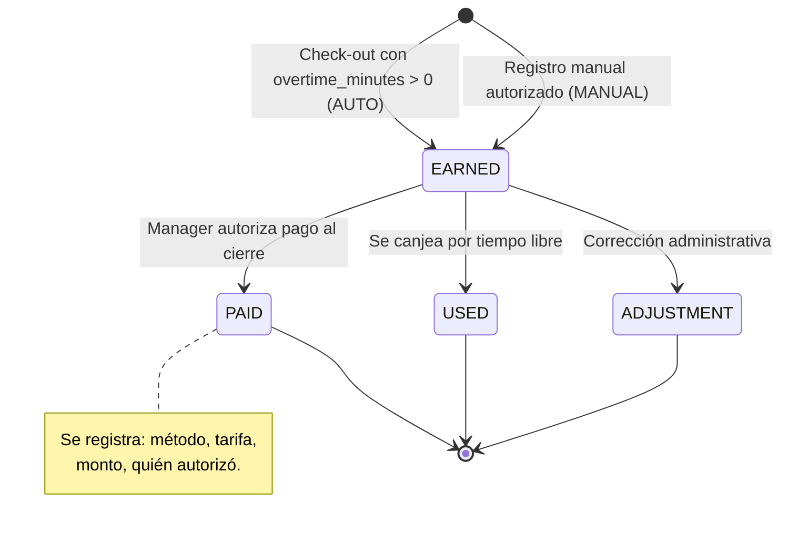
```mermaid
stateDiagram-v2
    [*] --> EARNED : Check-out con overtime_minutes > 0 (AUTO)
    [*] --> EARNED : Registro manual autorizado (MANUAL)

    EARNED --> PAID : Manager autoriza pago al cierre
    note right of PAID
        Se registra: método, tarifa,
        monto, quién autorizó.
    end note

    EARNED --> USED : Se canjea por tiempo libre
    EARNED --> ADJUSTMENT : Corrección administrativa

    PAID --> [*]
    USED --> [*]
    ADJUSTMENT --> [*]
```

---

## 6) Diagramas de Secuencia

### 6.1 Registro de Check-in (Operación diaria)

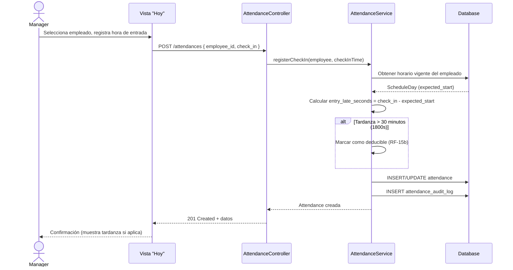
```mermaid
sequenceDiagram
    actor M as Manager
    participant UI as Vista "Hoy"
    participant API as AttendanceController
    participant Svc as AttendanceService
    participant DB as Database

    M->>UI: Selecciona empleado, registra hora de entrada
    UI->>API: POST /attendances { employee_id, check_in }
    API->>Svc: registerCheckIn(employee, checkInTime)

    Svc->>DB: Obtener horario vigente del empleado
    DB-->>Svc: ScheduleDay (expected_start)

    Svc->>Svc: Calcular entry_late_seconds = check_in - expected_start

    alt Tardanza > 30 minutos (1800s)
        Svc->>Svc: Marcar como deducible (RF-15b)
    end

    Svc->>DB: INSERT/UPDATE attendance
    Svc->>DB: INSERT attendance_audit_log

    Svc-->>API: Attendance creada
    API-->>UI: 201 Created + datos
    UI-->>M: Confirmación (muestra tardanza si aplica)
```

### 6.2 Registro de Check-out con decisión de Horas Extra

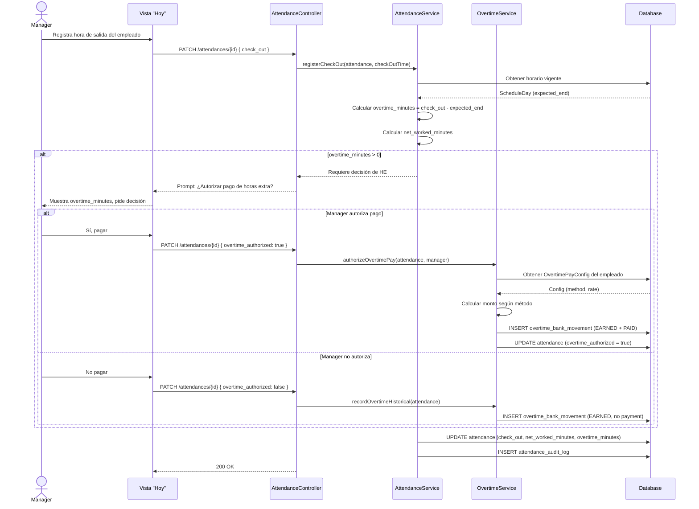
```mermaid
sequenceDiagram
    actor M as Manager
    participant UI as Vista "Hoy"
    participant API as AttendanceController
    participant Svc as AttendanceService
    participant OTSvc as OvertimeService
    participant DB as Database

    M->>UI: Registra hora de salida del empleado
    UI->>API: PATCH /attendances/{id} { check_out }
    API->>Svc: registerCheckOut(attendance, checkOutTime)

    Svc->>DB: Obtener horario vigente
    DB-->>Svc: ScheduleDay (expected_end)

    Svc->>Svc: Calcular overtime_minutes = check_out - expected_end
    Svc->>Svc: Calcular net_worked_minutes

    alt overtime_minutes > 0
        Svc-->>API: Requiere decisión de HE
        API-->>UI: Prompt: ¿Autorizar pago de horas extra?
        UI-->>M: Muestra overtime_minutes, pide decisión

        alt Manager autoriza pago
            M->>UI: Sí, pagar
            UI->>API: PATCH /attendances/{id} { overtime_authorized: true }
            API->>OTSvc: authorizeOvertimePay(attendance, manager)

            OTSvc->>DB: Obtener OvertimePayConfig del empleado
            DB-->>OTSvc: Config (method, rate)

            OTSvc->>OTSvc: Calcular monto según método
            OTSvc->>DB: INSERT overtime_bank_movement (EARNED + PAID)
            OTSvc->>DB: UPDATE attendance (overtime_authorized = true)
        else Manager no autoriza
            M->>UI: No pagar
            UI->>API: PATCH /attendances/{id} { overtime_authorized: false }
            API->>OTSvc: recordOvertimeHistorical(attendance)
            OTSvc->>DB: INSERT overtime_bank_movement (EARNED, no payment)
        end
    end

    Svc->>DB: UPDATE attendance (check_out, net_worked_minutes, overtime_minutes)
    Svc->>DB: INSERT attendance_audit_log
    API-->>UI: 200 OK
```

### 6.3 Cierre Semanal (Snapshot)

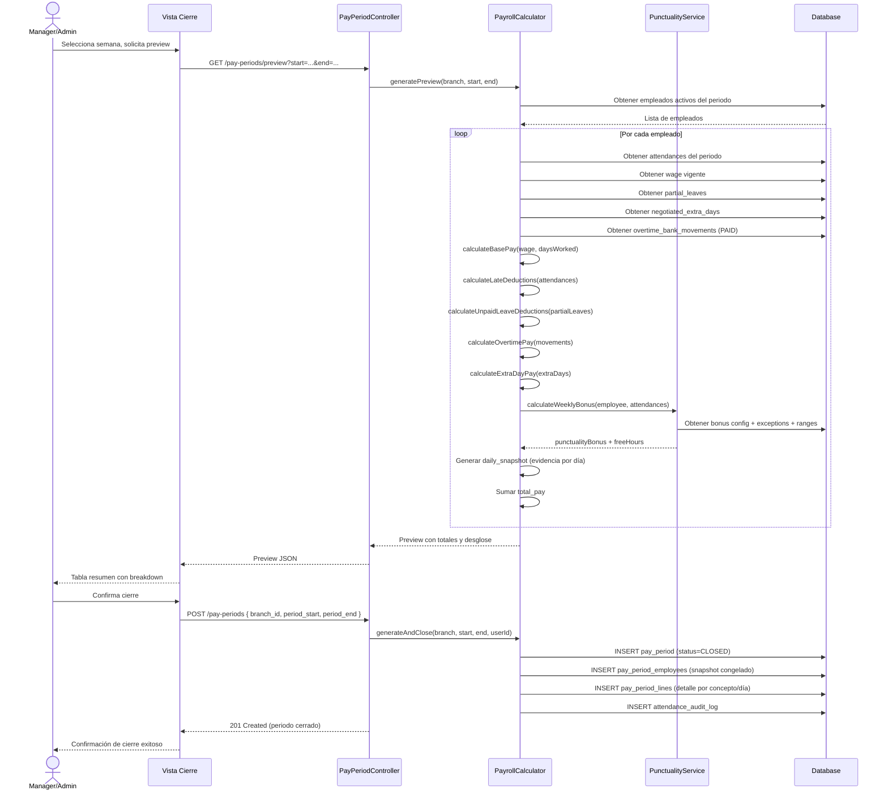
```mermaid
sequenceDiagram
    actor M as Manager/Admin
    participant UI as Vista Cierre
    participant API as PayPeriodController
    participant Calc as PayrollCalculator
    participant Punct as PunctualityService
    participant DB as Database

    M->>UI: Selecciona semana, solicita preview
    UI->>API: GET /pay-periods/preview?start=...&end=...

    API->>Calc: generatePreview(branch, start, end)
    Calc->>DB: Obtener empleados activos del periodo
    DB-->>Calc: Lista de empleados

    loop Por cada empleado
        Calc->>DB: Obtener attendances del periodo
        Calc->>DB: Obtener wage vigente
        Calc->>DB: Obtener partial_leaves
        Calc->>DB: Obtener negotiated_extra_days
        Calc->>DB: Obtener overtime_bank_movements (PAID)

        Calc->>Calc: calculateBasePay(wage, daysWorked)
        Calc->>Calc: calculateLateDeductions(attendances)
        Calc->>Calc: calculateUnpaidLeaveDeductions(partialLeaves)
        Calc->>Calc: calculateOvertimePay(movements)
        Calc->>Calc: calculateExtraDayPay(extraDays)

        Calc->>Punct: calculateWeeklyBonus(employee, attendances)
        Punct->>DB: Obtener bonus config + exceptions + ranges
        Punct-->>Calc: punctualityBonus + freeHours

        Calc->>Calc: Generar daily_snapshot (evidencia por día)
        Calc->>Calc: Sumar total_pay
    end

    Calc-->>API: Preview con totales y desglose
    API-->>UI: Preview JSON
    UI-->>M: Tabla resumen con breakdown

    M->>UI: Confirma cierre
    UI->>API: POST /pay-periods { branch_id, period_start, period_end }

    API->>Calc: generateAndClose(branch, start, end, userId)
    Calc->>DB: INSERT pay_period (status=CLOSED)
    Calc->>DB: INSERT pay_period_employees (snapshot congelado)
    Calc->>DB: INSERT pay_period_lines (detalle por concepto/día)
    Calc->>DB: INSERT attendance_audit_log

    API-->>UI: 201 Created (periodo cerrado)
    UI-->>M: Confirmación de cierre exitoso
```

### 6.4 EmployeeRequest — Creación y Aprobación

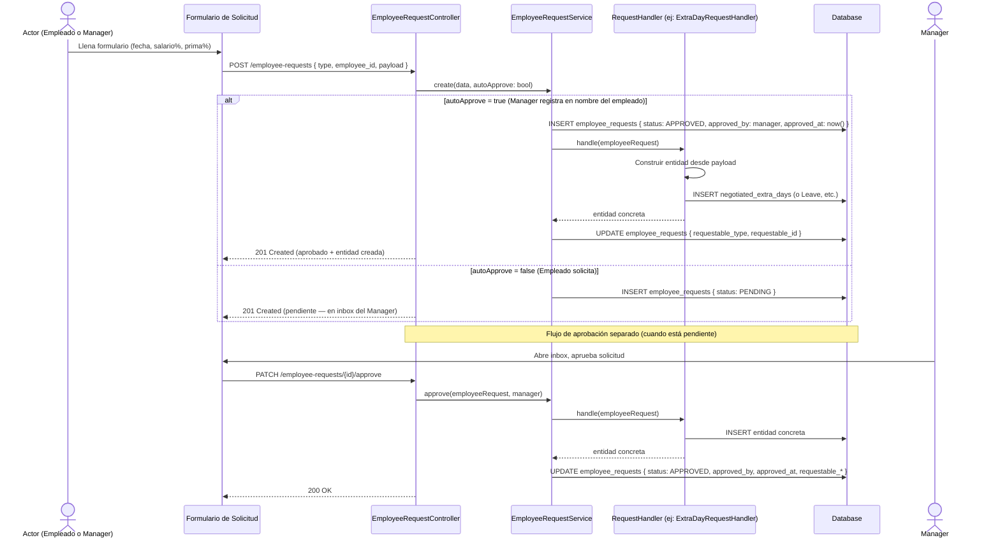
```mermaid
sequenceDiagram
    actor A as Actor (Empleado o Manager)
    participant UI as Formulario de Solicitud
    participant API as EmployeeRequestController
    participant Svc as EmployeeRequestService
    participant Handler as RequestHandler (ej: ExtraDayRequestHandler)
    participant DB as Database

    A->>UI: Llena formulario (fecha, salario%, prima%)
    UI->>API: POST /employee-requests { type, employee_id, payload }
    API->>Svc: create(data, autoApprove: bool)

    alt autoApprove = true (Manager registra en nombre del empleado)
        Svc->>DB: INSERT employee_requests { status: APPROVED, approved_by: manager, approved_at: now() }
        Svc->>Handler: handle(employeeRequest)
        Handler->>Handler: Construir entidad desde payload
        Handler->>DB: INSERT negotiated_extra_days (o Leave, etc.)
        Handler-->>Svc: entidad concreta
        Svc->>DB: UPDATE employee_requests { requestable_type, requestable_id }
        API-->>UI: 201 Created (aprobado + entidad creada)
    else autoApprove = false (Empleado solicita)
        Svc->>DB: INSERT employee_requests { status: PENDING }
        API-->>UI: 201 Created (pendiente — en inbox del Manager)
    end

    note over API,DB: Flujo de aprobación separado (cuando está pendiente)

    actor M as Manager
    M->>UI: Abre inbox, aprueba solicitud
    UI->>API: PATCH /employee-requests/{id}/approve
    API->>Svc: approve(employeeRequest, manager)
    Svc->>Handler: handle(employeeRequest)
    Handler->>DB: INSERT entidad concreta
    Handler-->>Svc: entidad concreta
    Svc->>DB: UPDATE employee_requests { status: APPROVED, approved_by, approved_at, requestable_* }
    API-->>UI: 200 OK
```

### 6.5 Registro de Permiso Parcial

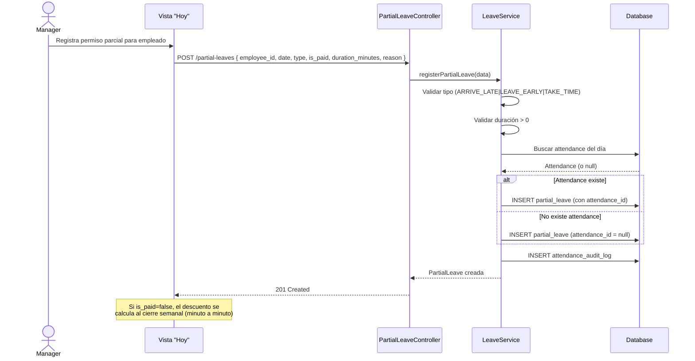
```mermaid
sequenceDiagram
    actor M as Manager
    participant UI as Vista "Hoy"
    participant API as PartialLeaveController
    participant Svc as LeaveService
    participant DB as Database

    M->>UI: Registra permiso parcial para empleado
    UI->>API: POST /partial-leaves { employee_id, date, type, is_paid, duration_minutes, reason }
    API->>Svc: registerPartialLeave(data)

    Svc->>Svc: Validar tipo (ARRIVE_LATE|LEAVE_EARLY|TAKE_TIME)
    Svc->>Svc: Validar duración > 0

    Svc->>DB: Buscar attendance del día
    DB-->>Svc: Attendance (o null)

    alt Attendance existe
        Svc->>DB: INSERT partial_leave (con attendance_id)
    else No existe attendance
        Svc->>DB: INSERT partial_leave (attendance_id = null)
    end

    Svc->>DB: INSERT attendance_audit_log

    Svc-->>API: PartialLeave creada
    API-->>UI: 201 Created

    note over UI: Si is_paid=false, el descuento se<br/>calcula al cierre semanal (minuto a minuto)
```

---

## 7) Reglas de integridad y constraints

### 7.1 Constraints de unicidad

| Tabla | Constraint | Descripción |
|-------|-----------|-------------|
| `employees` | UNIQUE(`code`) | Código de empleado único en el sistema. |
| `attendances` | UNIQUE(`employee_id`, `date`) | Un registro de asistencia por empleado por día. |
| `employee_requests` | INDEX(`employee_id`, `status`) | Consultas rápidas de inbox por empleado y estado. |
| `employee_requests` | INDEX(`requestable_type`, `requestable_id`) | Lookup polimórfico inverso. |
| `negotiated_extra_days` | UNIQUE(`employee_id`, `date`) | Un día extra por empleado por fecha. |
| `schedule_days` | UNIQUE(`employee_schedule_id`, `day_of_week`) | Una configuración por día de semana por horario. |
| `vacation_entitlements` | UNIQUE(`employee_id`, `year`) | Un registro de derecho vacacional por empleado por año. |
| `holidays` | UNIQUE(`date`) | Un festivo por fecha. |
| `pay_periods` | UNIQUE(`branch_id`, `period_start`, `period_end`) | Un periodo por sucursal y rango de fechas. |
| `pay_period_employees` | UNIQUE(`pay_period_id`, `employee_id`) | Un snapshot por empleado por periodo. |
| `leave_types` | UNIQUE(`code`) | Código de tipo de permiso único. |

### 7.2 Reglas de negocio a nivel de datos

| Regla | Validación | Referencia |
|-------|-----------|------------|
| Solo un periodo laboral activo | `employment_periods` con `is_active=true` por `employee_id` debe ser ≤ 1 | RF-06 |
| Tardanza en segundos ≥ 0 | `entry_late_seconds >= 0` y `lunch_late_seconds >= 0` | RF-13 |
| Duración de permiso > 0 | `partial_leaves.duration_minutes > 0` | RF-25a |
| Pago acordado > 0 | `negotiated_extra_days.agreed_pay > 0` | RF-39 |
| Tarifa por hora > 0 | `wage_histories.hourly_rate > 0` | RF-22 |
| Horas semanales > 0 | `wage_histories.weekly_scheduled_hours > 0` | RF-22, RF-10 |
| Bono semanal ≥ 0 | `punctuality_bonus_groups.weekly_bonus_amount >= 0` | RF-33 |
| Porcentaje de bono 0–100 | `punctuality_ranges.bonus_percentage BETWEEN 0 AND 100` | RF-32 |
| Porcentaje forzado 0–100 | `punctuality_exceptions.forced_percentage BETWEEN 0 AND 100` | RF-37 |
| Periodo cerrado no editable | Si `pay_periods.status = CLOSED`, no permitir INSERT/UPDATE en líneas (salvo reopen) | RN-16 |
| Overtime pagado requiere autorización | `overtime_bank_movements.movement_type = PAID` requiere `authorized_by IS NOT NULL` | DC-01, RF-47a |
| Vacation balance ≥ 0 | `vacation_entitlements.entitled_days - used_days >= 0` (app-level) | RF-26 |

### 7.3 Índices recomendados

| Tabla | Índice | Justificación |
|-------|--------|---------------|
| `attendances` | (`date`) | Consultas por fecha (vista "Hoy"). |
| `attendances` | (`employee_id`, `date`) | Lookup rápido por empleado+fecha. |
| `attendances` | (`day_status`) | Filtros por estatus. |
| `partial_leaves` | (`employee_id`, `date`) | Lookup por empleado+fecha. |
| `overtime_bank_movements` | (`employee_id`, `date`) | Balance y consulta de banco. |
| `pay_periods` | (`branch_id`, `status`) | Periodos abiertos por sucursal. |
| `employment_periods` | (`employee_id`, `is_active`) | Periodo activo por empleado. |
| `employee_schedules` | (`employment_period_id`, `effective_from`) | Horario vigente. |
| `wage_histories` | (`employee_id`, `effective_from`) | Sueldo vigente. |
| `attendance_audit_logs` | (`auditable_type`, `auditable_id`) | Lookup de auditoría polimórfico. |

---

## Resumen de entidades

| # | Entidad | Tabla | Subdominio |
|---|---------|-------|------------|
| 1 | Employee | `employees` | Empleados |
| 2 | EmploymentPeriod | `employment_periods` | Empleados |
| 3 | EmployeeSchedule | `employee_schedules` | Horarios |
| 4 | ScheduleDay | `schedule_days` | Horarios |
| 5 | WageHistory | `wage_histories` | Empleados |
| 6 | OvertimePayConfig | `overtime_pay_configs` | Configuración |
| 7 | Attendance | `attendances` | Operación diaria |
| 8 | PartialLeave | `partial_leaves` | Operación diaria |
| 9 | NegotiatedExtraDay | `negotiated_extra_days` | Operación diaria |
| 10 | OvertimeBankMovement | `overtime_bank_movements` | Horas extra |
| 11 | LeaveType | `leave_types` | Catálogos |
| 12 | Leave | `leaves` | Permisos |
| 13 | Holiday | `holidays` | Catálogos |
| 14 | VacationEntitlement | `vacation_entitlements` | Vacaciones |
| 15 | VacationRequest | `vacation_requests` | Vacaciones |
| 16 | PunctualityRange | `punctuality_ranges` | Puntualidad |
| 17 | PunctualityBonusGroup | `punctuality_bonus_groups` | Puntualidad |
| 18 | EmployeeBonusConfig | `employee_bonus_configs` | Puntualidad |
| 19 | PunctualityException | `punctuality_exceptions` | Puntualidad |
| 20 | PayPeriod | `pay_periods` | Nómina |
| 21 | PayPeriodEmployee | `pay_period_employees` | Nómina |
| 22 | PayPeriodLine | `pay_period_lines` | Nómina |
| 23 | AttendanceAuditLog | `attendance_audit_logs` | Auditoría |
| 24 | EmployeeRequest | `employee_requests` | Solicitudes |

---

> **Trazabilidad:** Cada campo del diccionario referencia el RF/RN/DC que lo origina.
> **Convenciones:** Nombres de tabla en snake_case plural, modelos PascalCase singular, FKs `{modelo}_id`, timestamps automáticos, soft deletes donde aplique, JSON `meta` para extensibilidad.
> **Nota v1.1:** Las entidades concretas de solicitud (`negotiated_extra_days`, `leaves`, `vacation_requests`) son semánticamente "aprobadas" por su existencia — no se necesita filtrar por estado en esas tablas.
