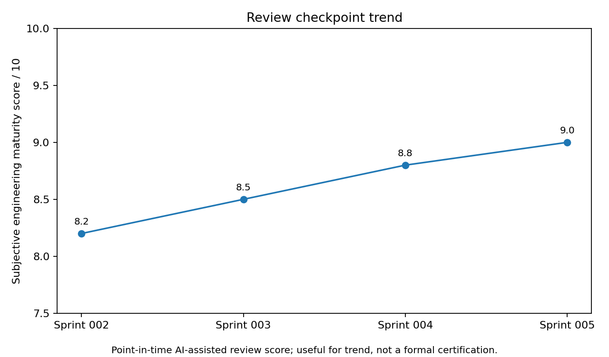
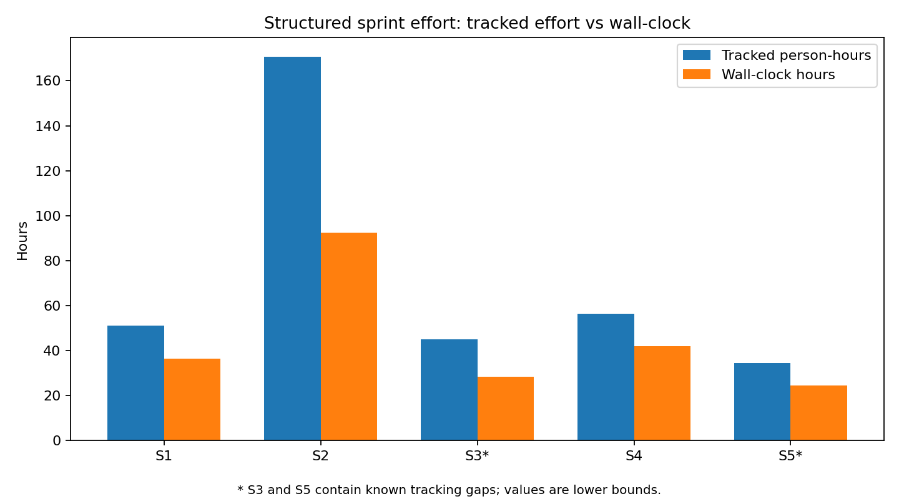
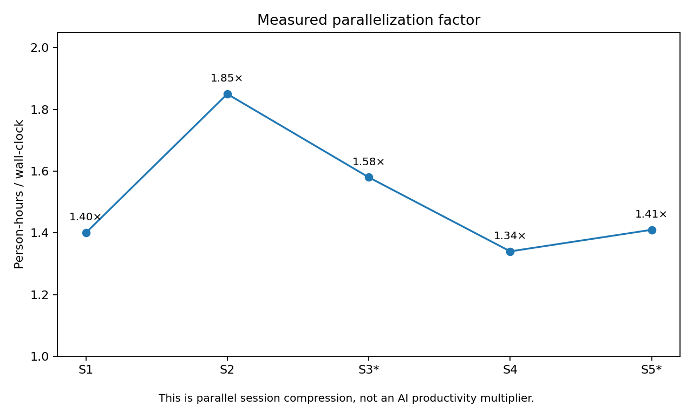
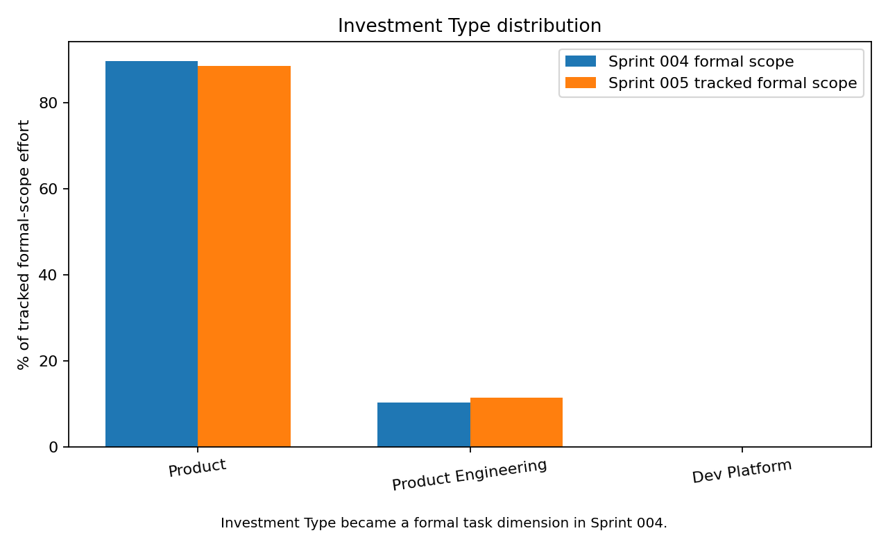

# Public Engineering Reviews

These documents are **point-in-time AI-assisted engineering reviews** of SushiGo.

They are not formal audits or certifications. Findings are based on repository evidence available
at the review date and may be corrected by later reviews. Historical problems are intentionally
preserved because the useful signal is the feedback loop: what was observed, what action followed,
and whether a later sprint closed the concern.

## Evidence policy

- Prefer GitHub Issues, PRs, sprint documents, tests and code as evidence.
- Separate **verified facts** from **review interpretation**.
- Do not publish private career, financial or personal context.
- Do not treat a subjective score as a project KPI.
- When a finding is fixed, keep the original finding and mark its follow-up as resolved.

## Executive charts

## Recommended future workflow

After every sprint:
1. Freeze the sprint evidence.
2. Produce one public review and one private steering review.
3. Update the private `PROJECT_MEMORY.md`.
4. Convert material findings into Issues when appropriate.
5. In the next review, explicitly report which previous findings were resolved, improved, unchanged
   or superseded.

## Findings in sprint context

Material findings live directly inside each sprint review. `ENGINEERING_FINDINGS.md` is only a
navigation index. This keeps each finding next to the sprint architecture, metrics and follow-up
that explain why it mattered.
