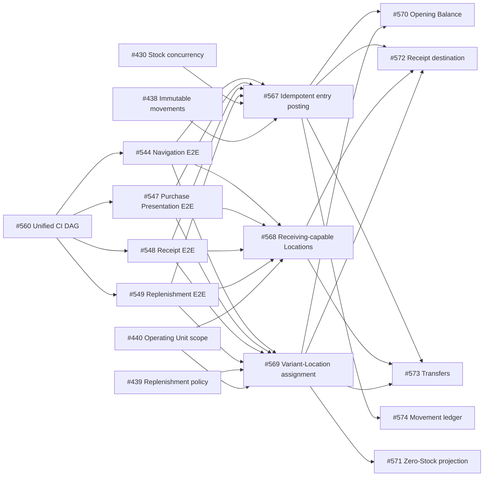

# Sprint 007 — Warehouse Receiving & Location-Aware Stock

> Turn the completed purchasing and Stock foundations into an explicit warehouse workflow: a
> confirmed Receipt enters an eligible receiving Location, managed assortment exists independently
> from physical balance, initial inventory is operable, and Stock can move auditably between Locations.

## 1. Executive Summary

Sprint 007 contains thirteen Issues estimated at **57h optimistic / 115h pessimistic**. It begins by
consolidating PR validation into one visible, mode-aware CI quality-gate DAG so every subsequent
functional lane receives faster and clearer review feedback, then restores the four quarantined
Inventory/Purchasing Cypress paths that directly cover the target workflow. It then deliberately
reuses the hierarchy already built by the Inventory module:

```text
Branch
  └─ OperatingUnit          access + operational/facility boundary
       └─ InventoryLocation physical/logical custody point
            └─ Stock         current balance per Location + Variant
```

No `Warehouse` table is added. An `OperatingUnit` plus its receiving/storage Locations already
models the required boundary; adding a second container now would duplicate ownership and access
semantics. A dedicated `Warehouse` becomes justified only when one Operating Unit must contain
multiple administratively independent warehouses.

After that enabling gate, the sprint separates three independent foundations from five user-facing
verticals so three agents can work in parallel without sharing primary files. Once the foundations
merge, Receipt hardening, Opening Balance, Transfers, and the assignment-aware Stock projection can
proceed concurrently with the read-only Movement ledger.

## 2. Context

Sprints 4–6 delivered Product/Variant identity, Purchase Presentations, Suppliers, Receipts,
per-Location cost, safe Stock mutation, immutable Stock Movements, replenishment policies, and
Operating Unit authorization. The remaining workflow gaps are now visible:

- a Receipt accepts any existing Location instead of an explicit receiving-capable destination;
- Receipt and Opening Balance duplicate inbound posting orchestration and have no reusable
  source-line idempotency key;
- the Opening Balance backend/form exists, but the form is not reachable from a page;
- Stock queries cannot represent a managed Variant before its first movement;
- the movement contract supports `TRANSFER`, but no transfer document/API/UI exists;
- operational documentation does not yet distinguish assortment, ledger evidence, and balance
  projection or show the receiving/put-away lifecycle.
- PR validation is split across independent workflow runs, delaying feedback and obscuring the
  complete lint/test/coverage/Sonar/Cypress dependency graph.
- navigation, Purchase Presentation, Purchase Receipt, and replenishment Cypress paths remain
  quarantined, so the affected baseline can report green without executing those regressions;
- immutable Stock Movement evidence has no paginated read API or operator-facing ledger/detail UI.

## 3. Sprint Goal

**Sprint Goal:** Make confirmed receiving, initialization, and internal movement explicit,
idempotent, Location-aware inventory operations while preserving `StockMovement` as immutable
evidence and `Stock` as the fast current-balance projection.

## 4. Timeline

| Metric | Value |
|---|---:|
| Created | 2026-08-30 |
| Planned start | 2026-09-09 |
| Planned end | 2026-09-22 |
| Target calendar duration | 14 days |
| Started | 2026-08-30 (promoted early by #582) |

The thirteen Issues are on **SushiGo Admin**, `Todo`, labeled `sprint-7`, and assigned to the
**Sprint 7** Project iteration created during promotion by #582.

## 5. Scope

### 5.1 Included Issues

| Status | Issue | Title | Investment | Priority | Size | Opt. | Pess. |
|---|---:|---|---|---|---|---:|---:|
| ✅ | #560 | Refactor PR CI into one visible quality-gate DAG | Dev platform | P0 | L | 4h | 12h |
| ⏳ | #544 | Fix quarantined Cypress spec: inventory-navigation | Dev platform | P1 | S | 0.5h | 3h |
| ⏳ | #547 | Fix quarantined Cypress spec: Variant Purchase Presentation | Dev platform | P0 | S | 0.5h | 3h |
| ⏳ | #548 | Fix quarantined Cypress spec: Purchase Receipts | Dev platform | P0 | S | 0.5h | 3h |
| ⏳ | #549 | Fix quarantined Cypress spec: replenishment thresholds | Dev platform | P1 | S | 0.5h | 3h |
| ✅ | #567 | Centralize idempotent Inventory entry posting | Product engineering | P0 | L | 7h | 12h |
| ⏳ | #568 | Define purchase-receiving capabilities for Inventory Locations | Product | P0 | M | 5h | 9h |
| ⏳ | #569 | Assign managed Variants to Inventory Locations | Product | P1 | L | 8h | 14h |
| ⏳ | #570 | Expose an auditable Opening Balance workflow | Product | P1 | M | 5h | 9h |
| ⏳ | #571 | Show assigned Variants with zero Stock in Existencias | Product | P1 | M | 6h | 11h |
| ⏳ | #572 | Route confirmed Purchase Receipts into eligible receiving Locations | Product | P0 | M | 5h | 9h |
| ⏳ | #573 | Implement auditable internal Stock Transfers | Product | P1 | L | 9h | 16h |
| ⏳ | #574 | Expose an auditable Inventory Stock Movement ledger | Product | P1 | M | 6h | 11h |
|  |  | **Total** |  |  |  | **57h** | **115h** |

### 5.2 Included Capabilities

- One canonical PR CI run with explicit `[e2e-test]`, `[wip]`, and final modes, targeted feedback,
  and one stable merge gate.
- Restored navigation, Purchase Presentation, Purchase Receipt, and replenishment Cypress coverage
  with their quarantine guards removed.
- Explicit `can_receive_purchases` capability on Inventory Locations.
- Active + receiving-capable + Operating-Unit-scoped Receipt destinations.
- One idempotent inbound posting boundary for Stock, cost, movement, and line evidence.
- Explicit managed assortment through Variant-to-Location assignment.
- Side-effect-free zero-Stock projection from assignments.
- Discoverable Opening Balance UI using the canonical posting contract.
- Multi-line, draft/post/reverse internal Stock Transfers.
- Paginated, Operating-Unit-scoped Stock Movement ledger and read-only detail UI.
- Bilingual architecture, ER, state, and sequence diagrams for the target flow.

### 5.3 Excluded

- A dedicated `Warehouse` table or hierarchy migration.
- Hierarchical bins, barcode-directed put-away, wave picking, or route optimization.
- Purchase Orders, supplier delivery appointments, quality inspection, lots, expiration, serials,
  FIFO/LIFO cost layers, or transfer-in-transit ownership across days.
- Automated purchase orders, forecasting, or replenishment suggestions.
- Bulk spreadsheet Opening Balance import or approval workflow.
- Editing/deleting posted movements or recomputing weighted-average cost on reversal.

### 5.4 Opportunistic Work

| Date | Issue | Title | Trigger | Result |
|---|---:|---|---|---|
| 2026-08-30 | #582 | Promote Sprint 007 and formally close Sprint 006 | Sprint 006 closure evidence and this plan were complete | Sprint lifecycle, both indexes, Project iteration assignments, and progress badge synchronized |

## 6. Domain Boundaries

| Concept | Source of truth | Does it change quantity? | Purpose |
|---|---|---:|---|
| Managed assortment | `variant_location_assignments` | No | Variant is expected/managed at a Location |
| Replenishment policy | `variant_location_replenishment_policies` | No | Optional min/max governance for one assigned pair |
| Audit ledger | `stock_movements` + line | Evidence only | Immutable reason, direction, quantity, source, actor, time |
| Current balance | `stock` | Yes, through posting services | Fast on-hand/reserved/available/cost projection |
| Receipt | `receipts` + lines | Only on `POSTED` | Commercial supplier-receiving document |
| Transfer | `stock_transfers` + lines | Only on `POSTED`/reversal | Internal movement document between Locations |

### Lifecycle rule

```text
Catalog creation          → no Stock
Location assignment       → no Stock
Receipt/Transfer DRAFT    → no Stock
Receipt POSTED            → inbound Stock + immutable PURCHASE_RECEIPT evidence
Opening Balance posted    → inbound Stock + immutable OPENING_BALANCE evidence
Transfer POSTED           → source decrement + destination increment + TRANSFER evidence
Reversal                  → compensating evidence; posted history is never edited/deleted
```

## 7. Route A — Parallel Execution Rounds

### Round 0 — Sprint Enabler

| Lane | Issue | Primary file ownership | Opt. | Pess. |
|---|---:|---|---:|---:|
| CI | #560 | GitHub Actions orchestration, change/mode analysis, stable gate, and CI documentation | 4h | 12h |

Treat #560 as P0 and merge it before opening the broad Round 1 implementation fan-out. It does not
change Inventory behavior; it shortens and clarifies the review loop used by every functional PR.
#559 remains a separate measured Cypress bootstrap optimization, while #491 must be reconciled with
the already-delivered six-shard topology rather than reimplemented inside #560.

### Round 0B — Restore the affected E2E baseline

After #560 proves `[e2e-test]` mode, the four quarantined specs can be repaired concurrently because
each owns a different Cypress file.

| Lane | Issue | Blocks/guards | Opt. | Pess. |
|---|---:|---|---:|---:|
| T1 | #544 | Inventory navigation used by #573/#574 | 0.5h | 3h |
| T2 | #547 | Purchase Presentation prerequisite used by #572 | 0.5h | 3h |
| T3 | #548 | Purchase Receipt happy path extended by #572 | 0.5h | 3h |
| T4 | #549 | Replenishment/Location baseline changed by #569/#571 | 0.5h | 3h |
|  |  | **Round effort** | **2h** | **12h** |

Each fix must remove its quarantine guard and prove the spec against a fresh isolated stack. Later
functional Issues extend the restored specs instead of creating a second overlapping E2E path.

### Round 1 — Independent Foundations

All three Issues start from `main` and may run concurrently.

| Lane | Issue | Primary file ownership | Opt. | Pess. |
|---|---:|---|---:|---:|
| A | #568 | Location schema/model/requests/resources + Location UI | 5h | 9h |
| B | #567 | Posting DTO/service, movement source identity, Receipt/Opening backend adoption | 7h | 12h |
| C | #569 | Assignment schema/model/API + focused Location assignment panel | 8h | 14h |
|  |  | **Round effort** | **20h** | **35h** |

Merge/contract order does not impose a sequence among A/B/C. Each Issue owns a distinct contract;
the consuming verticals wait for only the foundations they name.

### Round 2 — Parallel Operational Verticals

| Lane | Issue | Starts after | Primary file ownership | Opt. | Pess. |
|---|---:|---|---|---:|---:|
| D | #572 | #567 + #568 + #569 | Receipt requests/service/resource and Receipt feature UI | 5h | 9h |
| E | #570 | #567 + #569 | Opening Balance backend/response/form and minimal page action | 5h | 9h |
| F | #573 | #567 + #569; adopt #568 | New Transfer vertical and route/navigation | 9h | 16h |
| G | #571 | #569 | Stock read projection/controllers and broad Existencias rendering | 6h | 11h |
| H | #574 | #567 | New movement query/resource and ledger/detail UI | 6h | 11h |
|  |  |  | **Round effort** | **31h** | **56h** |

Round 2 is intentionally not one integration Issue. Each lane owns a user outcome and a bounded
file surface; integration is through the merged contracts from Round 1.

## 8. Route B — Dependency Graph



### Critical path

The pessimistic delivery critical path is approximately **45h** (`#560` 12h + one parallel E2E fix
3h + `#569` 14h + `#573` 16h).
With three independent Round 1 lanes and five Round 2 lanes, the effort fits the two-week calendar
without forcing multiple agents to edit the same feature concurrently.

## 9. Conflict Risk Map

| Shared area | Issues | Coordination rule |
|---|---|---|
| `.github/workflows` and CI scripts | #560 only | Prove the unified gate before retiring standalone PR workflows; preserve deploy/operational workflows |
| Cypress Inventory/Purchasing specs | #544, #547, #548, #549 then #569/#571/#572 | Baseline Issues remove quarantine first; functional Issues extend the green spec they affect |
| `ReceiptService` | #567, #572 | #567 owns posting refactor first; #572 rebases and owns eligibility/UI integration |
| `OpeningBalanceService` | #567, #570 | #567 adopts the posting service; #570 owns HTTP/UI semantics afterward |
| Location detail UI | #568, #569 | Separate capability form fields from the assignment panel; agree public exports before merge |
| Existencias page | #570, #571 | #571 owns query/data/table rewrite; #570 contributes only the action/panel hook and invalidation |
| Stock services | #567, #573 | #573 consumes merged primitives; it must not fork a second entry posting contract |
| Sidebar/routes | #573, #574 | #573 owns the Transfer entry; #574 rebases and appends Movements without rewriting shared navigation |
| Movement queries/resources | #574 only | Keep the ledger read-only; mutation services remain owned by #567/#570/#572/#573 |
| Architecture docs | Sprint planning baseline + each Issue | Issue PRs update only behavior actually delivered; do not claim planned code is already built |

## 10. API and Persistence Plan

### Additive migrations first

1. `inventory_locations.can_receive_purchases`, default false, conservative MAIN-primary backfill.
2. Stock Movement source-line identity and uniqueness for idempotent document-line posting.
3. `variant_location_assignments`, backfilled from Stock and replenishment policies.
4. Transfer header/line tables only after shared contracts are merged.

Every migration must support populated PostgreSQL databases, use database constraints as a
backstop, and prove `up()`/`down()` behavior. No Issue removes existing Stock/Receipt columns.

### Error semantics

| Condition | HTTP behavior |
|---|---|
| Unknown public ID / invalid field | `422` validation response |
| Functional permission or Operating Unit access denied | `403` |
| Draft destination became inactive/ineligible before post | `409` |
| Duplicate/already posted or reversed lifecycle action | `409` |
| Insufficient/reserved Stock or reversal boundary | `409` |
| Unexpected failure | standard `500`; transaction fully rolled back |

## 11. Test Strategy

### API

- Feature tests for every new/changed endpoint and lifecycle transition.
- Unit/service tests for posting idempotency, assignment invariants, deterministic transfer locking,
  balance boundaries, cost behavior, and side-effect-free projections.
- Concurrency tests for duplicate Receipt/Transfer posting and first destination Stock creation.
- Migration tests for backfill, uniqueness, rollback, and zero data loss.
- Full Inventory regression plus Pint for every backend Issue.

### Webapp

- Service contract tests for filters and response shapes.
- Component/page tests for permissions, forms, confirmation, zero rows, feedback, focus, and query
  invalidation.
- Focused Cypress paths for Receipt posting, Opening Balance, Transfers, and assigned zero Stock.
- Previously quarantined #544/#547/#548/#549 specs run without skip guards before their related
  functional paths are extended.
- ESLint and TypeScript clean for every frontend Issue.

### Required invariants

- Reads and assignments never create physical Stock or movements.
- Draft documents never alter Stock.
- One source document line affects balance at most once.
- Every successful balance change has immutable movement evidence.
- Failed multi-line posting leaves all balances, costs, movements, assignments, and document state
  unchanged.
- Every Location read/mutation remains constrained by active Operating Unit membership or the
  documented admin bypass.

## 12. Documentation Deliverables

The planning baseline updates, in English and Spanish:

- `doc/architecture/inventory-architecture.*.md`
  - explicit OperatingUnit/InventoryLocation boundary;
  - assignment vs ledger vs balance projection;
  - Sprint 7 target ER diagram;
  - Receipt and Transfer sequence diagrams;
  - as-built vs planned status.
- `doc/architecture/purchasing/purchase-receipts.*.md`
  - `DRAFT` non-mutating / `POSTED` inventory boundary;
  - receiving-Location eligibility;
  - idempotent source-line posting;
  - assignment behavior and failure semantics.

Each implementation Issue must replace target/future wording only for the behavior it actually
ships. Documentation must never report a pending Issue as production behavior.

## 13. Risks and Mitigations

| Risk | Impact | Mitigation |
|---|---|---|
| Unified CI migration hides or skips a required check | False-green PR or blocked merges | Fail-closed analysis, stable non-matrix `ci-gate`, and staged retirement of old workflows (#560) |
| Quarantined baseline masks a functional regression | False confidence while changing the same flows | Restore #544/#547/#548/#549 in Round 0B before related feature work |
| Duplicate source-line posting | Inflated Stock/cost | DB uniqueness + document lock + replay tests (#567) |
| Location disabled after draft save | Inventory enters invalid destination | Revalidate under lock at post (#572) |
| Assignment backfill misses historical Stock | Existing inventory disappears from new reads | Union Stock + live policies, reconciliation counts (#569) |
| Zero rows distort summaries | False valuation/alerts | Dedicated projection tests and no fake Stock models (#571) |
| Multi-line transfer deadlock/partial post | Corrupt balances | Deterministic locks + one transaction + concurrency tests (#573) |
| Round 2 edits shared files too early | Merge conflicts/contract forks | Enforced ownership and dependency gates in §7–9 |
| `Warehouse` abstraction added prematurely | Duplicate ownership/access hierarchy | Explicitly deferred; revisit only with concrete multi-warehouse requirement |

## 14. Definition of Ready

An Issue may start when:

- every listed dependency is merged to `main`;
- its body still matches the current code and architecture documents;
- no other workspace owns the same Issue/primary file surface;
- its project status is `Todo`, it has exactly one Investment Type, and it is assigned to Sprint 7
  during promotion;
- its tests can run against the workspace-isolated database.

## 15. Definition of Done

Each Issue is done only when:

- all acceptance criteria and required tests pass;
- migrations were tested forward and backward when applicable;
- Pint and relevant frontend lint/type/test gates pass;
- OpenAPI and bilingual architecture documentation reflect delivered behavior;
- no posted-history mutation or cross-unit access regression is introduced;
- PR review findings are resolved and CI is green;
- tracked time and retrospective are finalized on the GitHub Issue.

## 16. Promotion Checklist

- [x] Sprint 006 closure checklist is complete and its final metrics are recorded.
- [x] Move this document from `doc/sprints/planned/` to `doc/sprints/` without renaming it.
- [x] Mark Sprint 006 `Completed`, set its `completed`/`next`, and set this sprint `In Progress` with
      `started`.
- [x] Update both sprint indices: `doc/sprints/README.md` and root `README.md`.
- [x] Create/confirm the GitHub Project `Sprint 7` iteration for 2026-08-30 through 2026-09-12.
- [x] Assign #544, #547–#549, #560, and #567–#574 to that iteration and verify all thirteen are `Todo`.
- [x] Verify every Issue has `sprint-7` and exactly one canonical `investment:` label.
- [ ] Complete #560, prove the canonical CI gate, repair #544/#547/#548/#549 in parallel, then
      rebase Round 1 workspaces and begin #567/#568/#569 in parallel.

## 17. Closure Checklist

- [ ] #544, #547–#549, #560, and #567–#574 are merged and Done.
- [ ] One visible CI DAG provides targeted WIP feedback and a stable final merge gate.
- [ ] The four Inventory/Purchasing Cypress quarantine guards are removed and remain green.
- [ ] Receipt destination and lifecycle invariants are proven.
- [ ] Opening Balance is reachable and auditable.
- [ ] Transfers post/reverse atomically.
- [ ] Authorized users can query and inspect immutable Stock Movement evidence without read-side mutations.
- [ ] Assigned zero Stock appears without materializing fake balances.
- [ ] Full Inventory API regression, frontend tests, lint, typecheck, and focused E2E paths are green.
- [ ] Architecture target markers are reconciled to as-built behavior.
- [ ] Estimates, tracked effort, wall-clock overlap, evidence, risks, and lessons are consolidated.
- [ ] The next sprint is planned/promoted or Sprint 007 remains current per the lifecycle convention.
