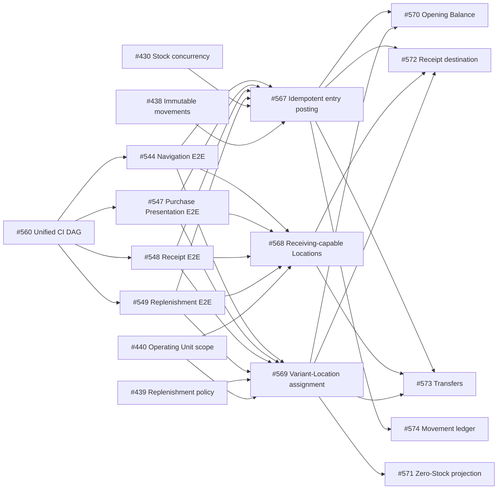

# Sprint 007 — Warehouse Receiving & Location-Aware Stock

> Turn the completed purchasing and Stock foundations into an explicit warehouse workflow: a
> confirmed Receipt enters an eligible receiving Location, managed assortment exists independently
> from physical balance, initial inventory is operable, and Stock can move auditably between Locations.

## 1. Executive Summary

Sprint 007 contains thirteen Issues estimated at **57h optimistic / 115h pessimistic**. It begins by
consolidating PR validation into one visible, mode-aware CI quality-gate DAG so every subsequent
functional lane receives faster and clearer review feedback, then restores the four quarantined
Inventory/Purchasing Cypress paths that directly cover the target workflow. It then deliberately
reuses the hierarchy already built by the Inventory module:

```text
Branch
  └─ OperatingUnit          access + operational/facility boundary
       └─ InventoryLocation physical/logical custody point
            └─ Stock         current balance per Location + Variant
```

No `Warehouse` table is added. An `OperatingUnit` plus its receiving/storage Locations already
models the required boundary; adding a second container now would duplicate ownership and access
semantics. A dedicated `Warehouse` becomes justified only when one Operating Unit must contain
multiple administratively independent warehouses.

After that enabling gate, the sprint separates three independent foundations from five user-facing
verticals so three agents can work in parallel without sharing primary files. Once the foundations
merge, Receipt hardening, Opening Balance, Transfers, and the assignment-aware Stock projection can
proceed concurrently with the read-only Movement ledger.

**Closure outcome (2026-09-09):** all 13 Issues merged to `main` and are Done on the board.
Implementation ran 2026-08-31 → 2026-09-09 for **33h17m tracked** — 58% of the optimistic estimate,
29% of the pessimistic — over ~28h55m wall-clock (~1.15× parallelization overall; ~1.31× excluding
the #560 CI outlier), peak concurrency 4. Two opportunistic Issues were picked up during the window
(#582 sprint promotion, #598 draft-based PR lifecycle). The planned Round 0 → 0B → 1 → 2 execution
route held. Remaining valuation work (exact-money contract #415, Receipt-reversal value
reconciliation #579) and #571's residual state/copy items (#576) are in Sprint 008 scope; #560's
and #573's deferred items (#612, #613) are filed to the backlog. See §20.

## 2. Context

Sprints 4–6 delivered Product/Variant identity, Purchase Presentations, Suppliers, Receipts,
per-Location cost, safe Stock mutation, immutable Stock Movements, replenishment policies, and
Operating Unit authorization. The remaining workflow gaps are now visible:

- a Receipt accepts any existing Location instead of an explicit receiving-capable destination;
- Receipt and Opening Balance duplicate inbound posting orchestration and have no reusable
  source-line idempotency key;
- the Opening Balance backend/form exists, but the form is not reachable from a page;
- Stock queries cannot represent a managed Variant before its first movement;
- the movement contract supports `TRANSFER`, but no transfer document/API/UI exists;
- operational documentation does not yet distinguish assortment, ledger evidence, and balance
  projection or show the receiving/put-away lifecycle.
- PR validation is split across independent workflow runs, delaying feedback and obscuring the
  complete lint/test/coverage/Sonar/Cypress dependency graph.
- navigation, Purchase Presentation, Purchase Receipt, and replenishment Cypress paths remain
  quarantined, so the affected baseline can report green without executing those regressions;
- immutable Stock Movement evidence has no paginated read API or operator-facing ledger/detail UI.

## 3. Sprint Goal

**Sprint Goal:** Make confirmed receiving, initialization, and internal movement explicit,
idempotent, Location-aware inventory operations while preserving `StockMovement` as immutable
evidence and `Stock` as the fast current-balance projection.

## 4. Timeline

| Metric | Value |
|---|---:|
| Created | 2026-08-30 |
| Planned start | 2026-09-09 |
| Planned end | 2026-09-22 |
| Target calendar duration | 14 days |
| Started | 2026-08-30 (promoted early by #582); first tracked session 2026-08-31 |
| Completed | 2026-09-09 (implementation finished 2026-09-09) |
| Calendar duration | 10 days (2026-08-30 → 2026-09-09) |
| Active workdays | 8 (session dates 2026-08-31, 09-01, 09-03, 09-05, 09-06, 09-07, 09-08, 09-09) |
| Progress (Issues completed) | **13 / 13 (100%)** as of 2026-09-09 — all scoped Issues merged to `main` and Done (see §13) |

The thirteen Issues were on **SushiGo Admin**, labeled `sprint-7`, and assigned to the **Sprint 7**
Project iteration created during promotion by #582. All thirteen are now closed.

## 5. Scope

### 5.1 Included Issues

| Status | Issue | Title | Investment | Priority | Size | Opt. | Pess. |
|---|---:|---|---|---|---|---:|---:|
| ✅ | #560 | Refactor PR CI into one visible quality-gate DAG | Dev platform | P0 | L | 4h | 12h |
| ✅ | #544 | Fix quarantined Cypress spec: inventory-navigation | Dev platform | P1 | S | 0.5h | 3h |
| ✅ | #547 | Fix quarantined Cypress spec: Variant Purchase Presentation | Dev platform | P0 | S | 0.5h | 3h |
| ✅ | #548 | Fix quarantined Cypress spec: Purchase Receipts | Dev platform | P0 | S | 0.5h | 3h |
| ✅ | #549 | Fix quarantined Cypress spec: replenishment thresholds | Dev platform | P1 | S | 0.5h | 3h |
| ✅ | #567 | Centralize idempotent Inventory entry posting | Product engineering | P0 | L | 7h | 12h |
| ✅ | #568 | Define purchase-receiving capabilities for Inventory Locations | Product | P0 | M | 5h | 9h |
| ✅ | #569 | Assign managed Variants to Inventory Locations | Product | P1 | L | 8h | 14h |
| ✅ | #570 | Expose an auditable Opening Balance workflow | Product | P1 | M | 5h | 9h |
| ✅ | #571 | Show assigned Variants with zero Stock in Existencias | Product | P1 | M | 6h | 11h |
| ✅ | #572 | Route confirmed Purchase Receipts into eligible receiving Locations | Product | P0 | M | 5h | 9h |
| ✅ | #573 | Implement auditable internal Stock Transfers | Product | P1 | L | 9h | 16h |
| ✅ | #574 | Expose an auditable Inventory Stock Movement ledger | Product | P1 | M | 6h | 11h |
|  |  | **Total** |  |  |  | **57h** | **115h** |

All 13 Issues completed. Investment mix: product 7 · product-engineering 1 · dev-platform 5.

### 5.2 Included Capabilities

- One canonical PR CI run with explicit `[e2e-test]`, `[wip]`, and final modes, targeted feedback,
  and one stable merge gate.
- Restored navigation, Purchase Presentation, Purchase Receipt, and replenishment Cypress coverage
  with their quarantine guards removed.
- Explicit `can_receive_purchases` capability on Inventory Locations.
- Active + receiving-capable + Operating-Unit-scoped Receipt destinations.
- One idempotent inbound posting boundary for Stock, cost, movement, and line evidence.
- Explicit managed assortment through Variant-to-Location assignment.
- Side-effect-free zero-Stock projection from assignments.
- Discoverable Opening Balance UI using the canonical posting contract.
- Multi-line, draft/post/reverse internal Stock Transfers.
- Paginated, Operating-Unit-scoped Stock Movement ledger and read-only detail UI.
- Bilingual architecture, ER, state, and sequence diagrams for the target flow.

### 5.3 Excluded

- A dedicated `Warehouse` table or hierarchy migration.
- Hierarchical bins, barcode-directed put-away, wave picking, or route optimization.
- Purchase Orders, supplier delivery appointments, quality inspection, lots, expiration, serials,
  FIFO/LIFO cost layers, or transfer-in-transit ownership across days.
- Automated purchase orders, forecasting, or replenishment suggestions.
- Bulk spreadsheet Opening Balance import or approval workflow.
- Editing/deleting posted movements or recomputing weighted-average cost on reversal.

### 5.4 Opportunistic Work

| Date | Issue | Title | Trigger | Result |
|---|---:|---|---|---|
| 2026-08-30 | #582 | Promote Sprint 007 and formally close Sprint 006 | Sprint 006 closure evidence and this plan were complete | Sprint lifecycle, both indexes, Project iteration assignments, and progress badge synchronized (PR #583, merged 2026-08-31) |
| 2026-09-06 | #598 | Draft-based PR lifecycle: draft blocks merge, title modifier scopes CI | While iterating on Sprint 7 PRs, native GitHub draft status was adopted as the merge-blocker and the `[wip]` bracket retired in favour of an optional CI-cost modifier | `/issue*` + `/start-issue` open PRs with `--draft`; `ci-gate` skipped on drafts; `[skip-ci]`/`[ci-check]`/`[ci-check-all]` scope CI while iterating; `/finish-pr` promotes with `gh pr ready` (PR #602, merged 2026-09-06); amends [TD-06](../decisions/td-06-unified-ci-dag.md) |

## 6. Domain Boundaries

| Concept | Source of truth | Does it change quantity? | Purpose |
|---|---|---:|---|
| Managed assortment | `variant_location_assignments` | No | Variant is expected/managed at a Location |
| Replenishment policy | `variant_location_replenishment_policies` | No | Optional min/max governance for one assigned pair |
| Audit ledger | `stock_movements` + line | Evidence only | Immutable reason, direction, quantity, source, actor, time |
| Current balance | `stock` | Yes, through posting services | Fast on-hand/reserved/available/cost projection |
| Receipt | `receipts` + lines | Only on `POSTED` | Commercial supplier-receiving document |
| Transfer | `stock_transfers` + lines | Only on `POSTED`/reversal | Internal movement document between Locations |

### Lifecycle rule

```text
Catalog creation          → no Stock
Location assignment       → no Stock
Receipt/Transfer DRAFT    → no Stock
Receipt POSTED            → inbound Stock + immutable PURCHASE_RECEIPT evidence
Opening Balance posted    → inbound Stock + immutable OPENING_BALANCE evidence
Transfer POSTED           → source decrement + destination increment + TRANSFER evidence
Reversal                  → compensating evidence; posted history is never edited/deleted
```

## 7. Route A — Parallel Execution Rounds

### Round 0 — Sprint Enabler

| Lane | Issue | Primary file ownership | Opt. | Pess. |
|---|---:|---|---:|---:|
| CI | #560 | GitHub Actions orchestration, change/mode analysis, stable gate, and CI documentation | 4h | 12h |

Treat #560 as P0 and merge it before opening the broad Round 1 implementation fan-out. It does not
change Inventory behavior; it shortens and clarifies the review loop used by every functional PR.
#559 remains a separate measured Cypress bootstrap optimization, while #491 must be reconciled with
the already-delivered six-shard topology rather than reimplemented inside #560.

### Round 0B — Restore the affected E2E baseline

After #560 proves `[e2e-test]` mode, the four quarantined specs can be repaired concurrently because
each owns a different Cypress file.

| Lane | Issue | Blocks/guards | Opt. | Pess. |
|---|---:|---|---:|---:|
| T1 | #544 | Inventory navigation used by #573/#574 | 0.5h | 3h |
| T2 | #547 | Purchase Presentation prerequisite used by #572 | 0.5h | 3h |
| T3 | #548 | Purchase Receipt happy path extended by #572 | 0.5h | 3h |
| T4 | #549 | Replenishment/Location baseline changed by #569/#571 | 0.5h | 3h |
|  |  | **Round effort** | **2h** | **12h** |

Each fix must remove its quarantine guard and prove the spec against a fresh isolated stack. Later
functional Issues extend the restored specs instead of creating a second overlapping E2E path.

### Round 1 — Independent Foundations

All three Issues start from `main` and may run concurrently.

| Lane | Issue | Primary file ownership | Opt. | Pess. |
|---|---:|---|---:|---:|
| A | #568 | Location schema/model/requests/resources + Location UI | 5h | 9h |
| B | #567 | Posting DTO/service, movement source identity, Receipt/Opening backend adoption | 7h | 12h |
| C | #569 | Assignment schema/model/API + focused Location assignment panel | 8h | 14h |
|  |  | **Round effort** | **20h** | **35h** |

Merge/contract order does not impose a sequence among A/B/C. Each Issue owns a distinct contract;
the consuming verticals wait for only the foundations they name.

### Round 2 — Parallel Operational Verticals

| Lane | Issue | Starts after | Primary file ownership | Opt. | Pess. | Status | Tracked | PR / Commit | Notes |
|---|---:|---|---|---:|---:|---|---:|---|---|
| D | #572 | #567 + #568 + #569 | Receipt requests/service/resource and Receipt feature UI | 5h | 9h | ✅ | 0.9h | PR #604 | Eligible destinations and idempotent posting now share deterministic assignment-before-stock locking; PR ready, merge pending |
| E | #570 | #567 + #569 | Opening Balance backend/response/form and minimal page action | 5h | 9h | ✅ | 3.8h | PR #605 | Auditable preview/posting on the shared #572 assignment ensurer; valuation rounding and decimal(15,4) ledger bounds verified; PR ready, merge pending |
| F | #573 | #567 + #569; adopt #568 | New Transfer vertical and route/navigation | 9h | 16h | ✅ | 1.5h | PR #603 | Auditable draft/post/reverse flow with deterministic locking, immutable movement evidence, authorization, numeric bounds, and UI; PR ready, merge pending |
| G | #571 | #569 | Stock read projection/controllers and broad Existencias rendering | 6h | 11h |
| H | #574 | #567 | New movement query/resource and ledger/detail UI | 6h | 11h |
|  |  |  | **Round effort** | **31h** | **56h** |

Round 2 is intentionally not one integration Issue. Each lane owns a user outcome and a bounded
file surface; integration is through the merged contracts from Round 1.

## 8. Route B — Dependency Graph



### Critical path

The pessimistic delivery critical path is approximately **45h** (`#560` 12h + one parallel E2E fix
3h + `#569` 14h + `#573` 16h).
With three independent Round 1 lanes and five Round 2 lanes, the effort fits the two-week calendar
without forcing multiple agents to edit the same feature concurrently.

## 9. Conflict Risk Map

| Shared area | Issues | Coordination rule |
|---|---|---|
| `.github/workflows` and CI scripts | #560 only | Prove the unified gate before retiring standalone PR workflows; preserve deploy/operational workflows |
| Cypress Inventory/Purchasing specs | #544, #547, #548, #549 then #569/#571/#572 | Baseline Issues remove quarantine first; functional Issues extend the green spec they affect |
| `ReceiptService` | #567, #572 | #567 owns posting refactor first; #572 rebases and owns eligibility/UI integration |
| `OpeningBalanceService` | #567, #570 | #567 adopts the posting service; #570 owns HTTP/UI semantics afterward |
| Location detail UI | #568, #569 | Separate capability form fields from the assignment panel; agree public exports before merge |
| Existencias page | #570, #571 | #571 owns query/data/table rewrite; #570 contributes only the action/panel hook and invalidation |
| Stock services | #567, #573 | #573 consumes merged primitives; it must not fork a second entry posting contract |
| Sidebar/routes | #573, #574 | #573 owns the Transfer entry; #574 rebases and appends Movements without rewriting shared navigation |
| Movement queries/resources | #574 only | Keep the ledger read-only; mutation services remain owned by #567/#570/#572/#573 |
| Architecture docs | Sprint planning baseline + each Issue | Issue PRs update only behavior actually delivered; do not claim planned code is already built |

## 10. API and Persistence Plan

### Additive migrations first

1. `inventory_locations.can_receive_purchases`, default false, conservative MAIN-primary backfill.
2. Stock Movement source-line identity and uniqueness for idempotent document-line posting.
3. `variant_location_assignments`, backfilled from Stock and replenishment policies.
4. Transfer header/line tables only after shared contracts are merged.

Every migration must support populated PostgreSQL databases, use database constraints as a
backstop, and prove `up()`/`down()` behavior. No Issue removes existing Stock/Receipt columns.

### Error semantics

| Condition | HTTP behavior |
|---|---|
| Unknown public ID / invalid field | `422` validation response |
| Functional permission or Operating Unit access denied | `403` |
| Draft destination became inactive/ineligible before post | `409` |
| Duplicate/already posted or reversed lifecycle action | `409` |
| Insufficient/reserved Stock or reversal boundary | `409` |
| Unexpected failure | standard `500`; transaction fully rolled back |

## 11. Test Strategy

### API

- Feature tests for every new/changed endpoint and lifecycle transition.
- Unit/service tests for posting idempotency, assignment invariants, deterministic transfer locking,
  balance boundaries, cost behavior, and side-effect-free projections.
- Concurrency tests for duplicate Receipt/Transfer posting and first destination Stock creation.
- Migration tests for backfill, uniqueness, rollback, and zero data loss.
- Full Inventory regression plus Pint for every backend Issue.

### Webapp

- Service contract tests for filters and response shapes.
- Component/page tests for permissions, forms, confirmation, zero rows, feedback, focus, and query
  invalidation.
- Focused Cypress paths for Receipt posting, Opening Balance, Transfers, and assigned zero Stock.
- Previously quarantined #544/#547/#548/#549 specs run without skip guards before their related
  functional paths are extended.
- ESLint and TypeScript clean for every frontend Issue.

### Required invariants

- Reads and assignments never create physical Stock or movements.
- Draft documents never alter Stock.
- One source document line affects balance at most once.
- Every successful balance change has immutable movement evidence.
- Failed multi-line posting leaves all balances, costs, movements, assignments, and document state
  unchanged.
- Every Location read/mutation remains constrained by active Operating Unit membership or the
  documented admin bypass.

## 12. Documentation Deliverables

The planning baseline updates, in English and Spanish:

- `doc/architecture/inventory-architecture.*.md`
  - explicit OperatingUnit/InventoryLocation boundary;
  - assignment vs ledger vs balance projection;
  - Sprint 7 target ER diagram;
  - Receipt and Transfer sequence diagrams;
  - as-built vs planned status.
- `doc/architecture/purchasing/purchase-receipts.*.md`
  - `DRAFT` non-mutating / `POSTED` inventory boundary;
  - receiving-Location eligibility;
  - idempotent source-line posting;
  - assignment behavior and failure semantics.

Each implementation Issue must replace target/future wording only for the behavior it actually
ships. Documentation must never report a pending Issue as production behavior.

## 13. Execution Evidence

Thirteen scoped Issues, all merged to `main` and Done. Two opportunistic Issues (§5.4) are listed
below the divider. `Tracked` is each Issue's finalized session total (`#574` synced from its
recorded session during this close-out).

| Status | Issue | Result Summary | Pull Request | Merge Commit | Tracked | Evidence Notes |
|---|---:|---|---:|---|---:|---|
| ✅ | #560 | Replaced the six independent PR-validation workflows with one `ci.yml` orchestrator: a single `analyze-pr` job (dorny change detection for `api`/`webapp`/`infra`/`scripts` + PR-title mode parse) feeding reusable `api-ci`/`webapp-ci`/`e2e-ci`/`scripts-tests` branches and one stable non-matrix `ci-gate`. Three PR execution modes (`[e2e-test]` Cypress-only diagnostic, `[wip]` targeted, final full regression). | PR #589 | `0e53f35f` | 15h 0m | `.github/scripts/ci-analyze` `node --test` suite grown to 44 cases across 8 review cycles; per-mode behavior verified on live CI (empty-`[e2e-test]` guard fails; `[wip]` never merge-eligible; final full DAG green → `ci-gate` success); six legacy workflows deleted; `main` branch protection cut over to the single `ci-gate` context (`strict: true`); `HolidayFactory` monotonic-date flake fix. Two Codex rounds (infra-path detection, `[wip]` fallback), plus review passes 2–8. Deferred: cross-mode wall-clock comparison artifact (#612). |
| ✅ | #544 | Repaired `inventory-navigation.cy.ts`: the consolidated-IA test now scrolls each `Inventario` sidebar link into view before asserting visibility (the `<nav>` is `overflow-y-auto`, so lower links sat outside the viewport and Cypress does not auto-scroll for `.should('be.visible')`); the #490 `this.skip()` quarantine guard is removed. | PR #610 | `4fc9e1b4` | 0h 32m | Local 15/15 green under CI config (`retries=2` + extended timeouts) on a fresh `sushigo-d` E2E stack, 0 retried attempts; CI `e2e-ci / cypress-e2e-run` passed with the spec re-included; webapp lint + tests green; no product code changed; `/issue-no-review`. |
| ✅ | #547 | Removed the #490 `this.skip()` guard from `product-variant-purchase-presentation.cy.ts`; the seed hook used the numeric PK `POST /units-of-measure` returns as `id`, but the variant/template create endpoints resolve the UOM by `public_id`, so the seed silently 422'd (followed to a 200) and the Variant never rendered. Now reads `public_id` from `GET /units-of-measure`, sends `Accept: application/json`, and purges leftover presentations per attempt so CI's `retries=2` is retry-safe. | PR #609 | `6c5a0353` | 0h 53m | 1 passing over 3 consecutive fresh-stack runs; retry-safety verified with a forced post-Assign failure; CI `e2e-ci` shard green; `cypress/tsconfig.json` typecheck clean; Codex P2 (retry state) resolved; no product code changed. API `id`/`public_id` inconsistency noted as out-of-scope. |
| ✅ | #548 | Removed the #490 `this.skip()` guard from `purchase-receipts.cy.ts` and repaired six independent staleness/flake defects — destination `aria-label` renamed by #568/#572, missing `can_receive_purchases` seed flag, a 404 route in the #586 pagination test, the `<option>` covered-element flake (assertions scoped to the SlidePanel), toast overlap, and two Cypress-retry hazards. Both specs (DRAFT→POSTED→REVERSED lifecycle + page-2 browse) run green. | PR #611 | `cc41bdac` | 2h 31m | 2 passing against a fresh dev-lab E2E stack (green ≥4× locally); CI `e2e-ci` shard green on the merge-ready commit; retry safety verified by a simulated `retries=2` first-attempt failure; ESLint + tsc clean; 2/2 Codex review threads (retry determinism) resolved; no product code changed. |
| ✅ | #549 | Removed the #490 `this.skip()` guard from `replenishment-thresholds.cy.ts` and scrolled the clipped `<h4>` section title into view before asserting visibility (`<main>` is `overflow-y-auto`); the per-location replenishment happy path runs green again. | PR #608 | `5fc10b7c` | 0h 13m | 1 passing against a fresh dev-lab E2E stack; original clip failure reproduced without the fix; CI `e2e-ci` shard ran the un-quarantined spec green; ESLint + tsc clean; no product code changed. |
| ✅ | #567 | Added `InventoryEntryPostingService` under `app/Services/Inventory` — one atomic inbound posting primitive accepting a normalized base quantity + explicit source-line identity (`related_line_id`), locking/creating destination Stock, blending weighted-average cost when supplied, and appending one immutable `StockMovement` (+ optional single line) per #438. Adopted by `OpeningBalanceService` and `ReceiptService::postReceipt`. | PR #595 | `3c899a79` | 1h 21m | Source-line-identity migration with a partial unique index as the idempotency backstop (reversible `up()`/`down()`); unit tests for first entry, repeat entry, zero/null cost, sequential + concurrent duplicate replay; Opening Balance / Receipt posting / reversal / Stock-mutation-concurrency suites extended; bilingual arch docs updated. Three Codex findings over two rounds (savepoint isolation of the duplicate INSERT `SQLSTATE 25P02`; all-or-nothing source triple to close a partial-NULL index bypass; `down()` restoring `meta.receipt_line_id`) — all fixed with tests. |
| ✅ | #568 | Made an Inventory Location's ability to receive supplier purchases an explicit `inventory_locations.can_receive_purchases` capability (default false; active+primary `MAIN` rows backfilled true), independent of `type`/`is_primary`/`is_active`. Exposed on the API with an OU-scoped optional filter and manageable in the Location UI ("Puede recibir compras"). No `Warehouse` table. | PR #599 | `de191179` | 2h 13m | Reversible migration with deterministic backfill + index; `$fillable`/casts/factories/resource updated; create/update boolean validation; feature tests for CRUD, list serialization, true/false filtering, defaults, OU scoping, and the "only active+primary+`MAIN`" backfill; frontend read/write tests; OpenAPI + bilingual arch docs. |
| ✅ | #569 | Added `variant_location_assignments` as the managed-assortment source of truth (backfilled from existing Stock + live replenishment policies), a model + API, and a focused Location assignment panel. A Variant can be "expected/managed at a Location" before its first movement, without creating Stock. | PR #600 | `8c77ac59` | 0h 44m | Backfill reconciliation (union Stock + policies) with counts; assignment CRUD + soft-delete; race-recovery `assignOrRecover` extracted as `VariantLocationAssignmentEnsurer` (later shared with #572); OU scope on assignment queries; bilingual arch `§3.13`. Single recorded session; review-response commits folded into the rebase-merge. |
| ✅ | #570 | Opening Balance is now posted from the Spanish Existencias panel through a non-mutating preview that shares conversion, cost, destination, and ledger-bound validation with posting; initialization ensures the Variant-to-Location assignment atomically without pretending a purchase occurred. | PR #605 | `d54ca690` | 3h 50m | Pint + webapp lint/typecheck clean; 762 Inventory + 106 Receipt + 23 opening-balance Vitest + `StockTest` boundary cases; rebased onto #572 and reconciled onto its shared `VariantLocationAssignmentEnsurer`; 14/14 review threads resolved (2 Codex: valuation double-rounding, `decimal(15,4)` float boundary). |
| ✅ | #571 | Re-spined `GET /stock`, `/stock/by-location/{id}`, `/stock/by-variant/{id}` and the Existencias page on the managed assignment (`LEFT JOIN` stock + live policy), so assigned pairs with no Stock row project as zero on-hand/reserved/available/cost/value and expose `stock_id: null` without persisting a zero Stock row. Summaries count assigned Variants. | PR #606 | `8ff65ae0` | 2h 1m | `AssignmentAwareStockProjection` + `AssignmentAwareExistenciasTest` (14 cases: assigned-with/without-Stock, unassigned, zero/no policy, soft-deleted assignment, cross-unit); proves reads create no `stock`/`stock_movements`; bilingual arch `§3.14`. Rebase-merged with 5 review-response commits (4 Codex P1: first-receipt assignment ensure under the Stock `FOR UPDATE` lock; soft-deleted-relation guard; `fetchAllPages` before summary; OU-gone `404`). Residual state/copy/filter items → #576. |
| ✅ | #572 | Confirmed Purchase Receipts now enforce eligible receiving Locations at save time (field-level `422`) and again under lock at post time (stable `409`), mutate inventory only on post, route each line through #567's posting service, and ensure the Variant-to-Location assignment in the same transaction via the shared `VariantLocationAssignmentEnsurer`. UI field renamed "Almacén / ubicación receptora". | PR #604 | `eb6705b1` | 0h 52m | Pint passed; 39 focused tests (131 assertions) + 2,446 API tests (7,148 assertions); draft-never-mutates and inactive/non-receiving/soft-deleted/cross-unit/became-ineligible destination cases covered; 7/7 review threads resolved. `purchase-receipts.cy.ts` stayed quarantined under #548 (its stability precondition unmet); happy path covered by Vitest. |
| ✅ | #573 | Delivered auditable draft/post/reverse internal Stock Transfers — `stock_transfers` + `stock_transfer_lines` with public ULIDs, SAC endpoints, `stock.view`/`stock.manage` + both-end OU access, deterministic Location/Variant lock ordering, one immutable `TRANSFER` movement/line per line, idempotent retries, compensating reversal, and the Spanish `/inventario/transferencias` UI. | PR #603 | `14469bd1` | 1h 30m | PHPUnit StockTransfer suite 38 tests / 185 assertions; Pint passed; full CI green across 4 API + 4 webapp + 6 E2E shards; both SonarCloud gates passed; 16 review threads resolved incl. final Devin hardening (deterministic locks, numeric bounds, authorization metadata, pagination, historical FKs). Non-authoritative availability preview left out of scope → #613. |
| ✅ | #574 | Added a paginated, OU-scoped Inventory Stock Movement list + detail API under `/api/v1/inventory` (public IDs only, validated Location/Variant/reason/status/date/source filters, deterministic newest-first ordering, no N+1) and a permission-aware `Inventario > Movimientos` ledger page with filters, detail view, and reversal linkage. Reads have no Stock/ledger write side effects. | PR #601 | `37c2c430` | 1h 37m | Feature tests for pagination, ordering, every filter, permission denial, active-unit isolation, admin bypass, reversal linkage, missing optional relations; query-count regression; webapp service + component/page + navigation tests; Cypress happy path; bilingual arch + OpenAPI. `Tracked` synced from the recorded session during this close-out (`/finish-pr` had not finalized it). |
| — | — | **Formal scope tracked** | | | **33h 17m** | 13 / 13 merged · Investment mix: product 7 · product-engineering 1 · dev-platform 5 |
| ✅ | #582 | Promoted Sprint 007 from `planned/`, formally closed Sprint 006, synchronized both sprint indexes, corrected the GitHub Project `Iteration` dates (85 items reassigned + verified), and refreshed the `iteration-progress.svg` badge to "Sprint 7". | PR #583 | (merged 2026-08-31) | — | Opportunistic (§5.4). Issue body was not finalized by `/finish-pr` — `Tracked` left `_in progress_`, no `## 📅 Sessions` entries — so it contributes no measured time (data gap, §16). Missing `sprint-7` label (closure-audit WARN, disclosed). |
| ✅ | #598 | Adopted native GitHub *draft* status as the merge-blocker (drafts skip `ci-gate`), retired the `[wip]` bracket, and added the optional `[skip-ci]`/`[ci-check]`/`[ci-check-all]` third-bracket CI-cost modifier; `/issue*` + `/start-issue` open PRs with `--draft`, `/finish-pr` promotes with `gh pr ready`. Amends [TD-06](../decisions/td-06-unified-ci-dag.md). | PR #602 | (merged 2026-09-06) | 4h 53m | Opportunistic (§5.4), picked up while iterating on Sprint 7 PRs. Carries a `sprint-7` label but is not formal scope (closure-audit orphan WARN, disclosed and recorded here). 2 sessions 2026-09-03 (10:08–10:34, 10:50–15:17). |

### Risks and Mitigations

Every planned risk held; the mitigation column records how.

| Risk | Impact | Mitigation |
|---|---|---|
| Unified CI migration hides or skips a required check | False-green PR or blocked merges | Fail-closed analysis, stable non-matrix `ci-gate`, and staged retirement of old workflows (#560) |
| Quarantined baseline masks a functional regression | False confidence while changing the same flows | Restore #544/#547/#548/#549 in Round 0B before related feature work |
| Duplicate source-line posting | Inflated Stock/cost | DB uniqueness + document lock + replay tests (#567) |
| Location disabled after draft save | Inventory enters invalid destination | Revalidate under lock at post (#572) |
| Assignment backfill misses historical Stock | Existing inventory disappears from new reads | Union Stock + live policies, reconciliation counts (#569) |
| Zero rows distort summaries | False valuation/alerts | Dedicated projection tests and no fake Stock models (#571) |
| Multi-line transfer deadlock/partial post | Corrupt balances | Deterministic locks + one transaction + concurrency tests (#573) |
| Round 2 edits shared files too early | Merge conflicts/contract forks | Enforced ownership and dependency gates in §7–9 |
| `Warehouse` abstraction added prematurely | Duplicate ownership/access hierarchy | Explicitly deferred; revisit only with concrete multi-warehouse requirement |

## 14. Estimate Tracking by Round

| Round | Issues | Opt. | Pess. | Tracked | vs Opt. | vs Pess. |
|---|---:|---:|---:|---:|---:|---:|
| 0 — Sprint Enabler | 1 (#560) | 4h | 12h | 15h 0m | +11h 0m | +3h 0m |
| 0B — Restore E2E baseline | 4 (#544, #547, #548, #549) | 2h | 12h | 4h 9m | +2h 9m | −7h 51m |
| 1 — Independent Foundations | 3 (#567, #568, #569) | 20h | 35h | 4h 18m | −15h 42m | −30h 42m |
| 2 — Parallel Operational Verticals | 5 (#570, #571, #572, #573, #574) | 31h | 56h | 9h 50m | −21h 10m | −46h 10m |
| **Total** | **13** | **57h** | **115h** | **33h 17m** | **−23h 43m** | **−81h 43m** |

```text
vs Opt.  = Tracked total − Optimistic total
vs Pess. = Tracked total − Pessimistic total
```

Round 0 is the only round that exceeded its estimate — see §16 for why #560's "15h" is almost
entirely unattended CI wall-clock. Rounds 1 and 2 landed at ~21% and ~32% of their optimistic
estimates because each Issue composed an already-merged contract (#567 posting service,
`OperatingUnitScope`, the #569 assignment model, the `/inventario/*` route tree) rather than
designing one.

## 15. Consolidated Time Tracking

| Category | Estimated | Tracked | Variance |
|---|---:|---:|---:|
| Planning and issue scoping | 4h | 1h 30m | −2h 30m |
| Implementation | 40h | 14h 27m | −25h 33m |
| Code review and validation | 9h | 16h 20m | +7h 20m |
| Documentation | 4h | 1h 0m | −3h 0m |
| **Formal scope total** | **57h** | **33h 17m** | **−23h 43m** |
| Opportunistic (#598 4h 53m; #582 not finalized) | — | 4h 53m | — |
| **Grand total** | — | **38h 10m** | — |

The category split is a qualitative allocation from each Issue's retrospective — Issues track total
session time, not per-category time (§16). "Code review and validation" is the only category over
its estimate: #560 alone contributes ~11h of CI-driven review-cycle wall-clock across 8 passes,
and #570/#573/#567 each resolved 14–16 review threads or multiple Codex correctness findings.

### Wall-Clock Time & Parallelism

Computed from every Issue's `## 📅 Sessions` array per `doc/conventions/sprints.md` §7. Two figures
are reported: **formal scope** (the 13 Issues) and **full sprint** (formal scope + opportunistic
#598, which had logged sessions; #582 had none).

| Figure | Formal scope (13 Issues) | Full sprint (+ #598) |
|---|---:|---:|
| Person-hours (sum of every session) | 33h 17m | 38h 10m |
| Wall-clock time (union of session intervals) | 28h 55m | 33h 29m |
| Parallelization factor | 1.15× | 1.14× |
| Peak concurrency | 4 | 4 |

- **Peak concurrency: 4** at **2026-09-08 21:16** — Issues **#544, #547, #548, #549** (the four
  quarantined-spec fixes, each owning one Cypress file, run in one evening).
- Excluding the #560 outlier (15h, mostly unattended CI wall-clock), the full-sprint figures are
  **23h 10m person-hours over ~18h 29m wall-clock (~1.25×)** — a truer picture of hands-on
  parallel effort.

| Wall-clock block | Duration | Issues active in this block |
|---|---:|---|
| 2026-08-31 23:30 → 2026-09-01 14:30 | 15h 0m | #560 (one continuous autonomous CI-driven session) |
| 2026-09-01 17:58 → 19:26 | 1h 21m (2 blocks, 7 m gap) | #567 s1 + s2 |
| 2026-09-03 02:03 → 03:41 | 1h 38m | #568 s1, #574, #569 (peak 3 concurrent) |
| 2026-09-03 09:50 → 10:34 | 44 m | #568 s2, #598 s1 |
| 2026-09-03 10:50 → 15:30 | 4h 40m | #598 s2, #568 s3 |
| 2026-09-05 19:42 → 21:12 | 1h 30m | #573 |
| 2026-09-05 21:32 → 23:49 | 2h 17m | #572, #570 s1 |
| 2026-09-06 00:01 → 02:02 | 2h 1m | #571 |
| 2026-09-07 20:05 → 21:40 | 1h 35m | #570 s2 |
| 2026-09-08 21:16 → 21:48 | 32 m | #544, #547 s1, #548 s1, #549 (peak 4 concurrent) |
| 2026-09-08 22:20 → 23:55 | 1h 35m | #548 s2 |
| 2026-09-09 00:05 → 00:41 | 36 m | #547 s2, #548 s3 |

Formal-scope wall-clock drops the two 2026-09-03 daytime blocks' #598 contribution (those blocks
become #568-only, 30 m + 20 m), giving 28h 55m.

## 16. Notes on Estimate Confidence

The 57h/115h range was **preliminary planning**, set from Issue-body sizing before the Round 1
foundations existed. It proved conservative by ~2.4× against the optimistic bound, for the same
reason as Sprints 4–6: every Issue reused an established contract (SAC + FormRequest + Resource,
`OperatingUnitScope`, `StockMutationService`, the `#438` immutable-movement contract, the
`/inventario/*` tree) instead of designing one, and much of the estimated "implementation" time was
already spent in prior sprints.

Confidence caveats in the recorded numbers:

- **#560's 15h** is a single autonomous session interval (2026-08-31 23:30 → 2026-09-01 14:30). Per
  §7 the interval is summed as-is; its retrospective estimates only **~2h 30m hands-on**, the rest
  being unattended GitHub Actions wall-clock across ~26 full-pipeline runs and 8 review cycles.
  Treat #560's contribution to every total as CI wall-clock, not engineering effort.
- **#574's tracked time** was not finalized by `/finish-pr` at merge; the 1h 37m figure was
  recovered from its one recorded session during this close-out.
- **#582** (opportunistic sprint promotion) has an unfinalized `## ⏱️ Time` section with no
  sessions, so it contributes **nothing** to person-hours / wall-clock — a data gap, not a zero.
- **#571's** five post-merge review-response commits were driven through `/pr-comments` rather than
  tracked issue sessions, so its 2h 1m understates real delivery effort (its retrospective says the
  full cycle would still have sat near the optimistic end).

## 17. Quality Results

| Metric | Before | Target | After | Result |
|---|---:|---:|---:|---|
| Quarantined Inventory/Purchasing Cypress specs | 4 skipped (#544/#547/#548/#549) | 0 | 0 — all four `this.skip()` guards removed, specs green in CI `e2e-ci` | ✅ |
| PR CI feedback | 6+ independent workflow runs; branch protection pinned to shard-name contexts | One visible DAG; one stable `ci-gate` | `ci.yml` orchestrator; `main` requires only `ci-gate` (`strict: true`); 6 legacy workflows deleted (#560) | ✅ |
| Inbound inventory posting | Receipt + Opening Balance each orchestrate Stock/cost/movement independently | One idempotent posting primitive | `InventoryEntryPostingService` with a partial-unique source-line backstop, adopted by both (#567) | ✅ |
| Receipt destination validation | Any non-deleted Location accepted | Active + receiving-capable + OU-scoped, re-checked under lock at post | `can_receive_purchases` capability; save-time `422` + post-time `409` (#568, #572) | ✅ |
| Managed assortment before first movement | Not representable | Assignment-spined projection; zero Stock without fake rows | `variant_location_assignments` + assignment-aware Existencias (#569, #571) | ✅ |
| Internal Stock movement | `TRANSFER` contract only, no document/API/UI | Auditable draft/post/reverse transfers | `stock_transfers` + deterministic locking + immutable evidence + Spanish UI (#573) | ✅ |
| Stock Movement evidence access | DB only, no read API/UI | Paginated OU-scoped ledger + detail | `/api/v1/inventory` movement list/detail + `Inventario > Movimientos` (#574) | ✅ |
| Tests passing | `main` green | 100% | 100% — full CI green on every merged PR; `ci-gate` required | ✅ |
| SonarCloud new-code coverage | ≥ 80% | ≥ 80% | Met on every scoped PR (api + webapp gates passed) | ✅ |

## 18. Results

### 18.1 Delivered Value

Sprint 7 turned the Sprints 4–6 purchasing and Stock foundations into an explicit, auditable
warehouse workflow. A Purchase Receipt now enters a validated receiving Location (checked at save
and again under lock at post); inbound posting for Receipts and Opening Balances runs through one
idempotent primitive with a source-line uniqueness backstop; managed assortment exists
independently of physical balance (assigned Variants show as zero Stock without persisting fake
rows); Stock moves auditably between Locations through a draft/post/reverse Transfer document with
deterministic locking; and every immutable Stock Movement is inspectable through a paginated,
Operating-Unit-scoped ledger with a detail view and reversal linkage. Underneath, PR validation is
now one visible dependency graph with a single stable `ci-gate`, and four previously quarantined
Inventory/Purchasing Cypress paths execute again.

This completes the "explicit warehouse workflow" increment. It does **not** close inventory
valuation: Receipt reversal is still quantity-only, and monetary arithmetic still crosses PHP
`float` boundaries — both owned by Sprint 8 (#579, #415).

### 18.2 Planned vs. Actual

- **Planned:** 13 Issues, 57h optimistic / 115h pessimistic.
- **Completed:** 13 / 13 — all merged to `main`, all Done (#560, #544, #547, #548, #549, #567,
  #568, #569, #570, #571, #572, #573, #574).
- **Tracked:** 33h 17m person-hours — **58% of optimistic, 29% of pessimistic** — over ~28h 55m
  wall-clock (~1.15×; ~1.25× on the full sprint excluding the #560 CI outlier). Peak concurrency 4.
- **Opportunistic:** 2 Issues — #582 (promoted Sprint 007 / closed Sprint 006, PR #583) and #598
  (draft-based PR lifecycle, PR #602, 4h 53m).
- **Scope changes:** none after sprint start. #574's `Tracked` was synced from its recorded session
  during close-out (`/finish-pr` had not finalized it).
- **Same-window work outside Sprint 7 scope** (sessions inside the window, tracked on their own
  Issues; disclosed per the closure audit, formal scope unchanged): #501, #559, #578, #586, #587.
- **Execution route:** the planned Round 0 → 0B → 1 → 2 sequence held. #560 landed first and gated
  the fan-out; the four spec fixes ran concurrently; the three foundations merged before the five
  verticals; no cross-Issue merge conflict materialized.

### 18.3 Known Limitations

- **Inventory valuation after a Purchase Receipt reversal is still quantity-only**
  (`Stock.weighted_avg_cost` left unchanged). Sprint 8 **#579** owns the fix; Sprint 8 **#415**
  owns the exact-money contract it depends on.
- **#560's cross-mode CI wall-clock comparison artifact** (`[e2e-test]` vs `[wip]` vs full) was
  deferred to **#612**; the three modes are proven functionally correct, only the measurement
  is outstanding.
- **#571's residual Inventory state/copy polish** (loading/empty/error consistency, Operating
  Unit/Location filter, cross-mutation query coherence) is folded into Sprint 8 **#576**.
- **#573's non-authoritative source-availability preview** in the transfer form was deferred to
  **#613** to keep a stock-projection UI dependency out of the transfer vertical.
- **Three more quarantined Cypress specs remain** (`item-media-gallery-uploader`, `price-lists`,
  `suppliers-catalog`) under the #490 guard — Sprint 8 #545/#546/#550.
- The **#560 "15h" tracked figure** is dominated by unattended CI wall-clock; recorded as-is per
  §7 (see §16).

## 19. Lessons Learned

- **Estimation:** for the fourth sprint running, Issues that reuse an established contract land far
  under the optimistic estimate — Round 1 came in at 4h 18m against 20h optimistic, Round 2 at
  9h 50m against 31h. The 57h/115h range was set before Sprint 7 had the #567 posting service,
  `OperatingUnitScope`, the assignment model, and the `/inventario/*` tree to compose from. Size
  future Inventory-adjacent sprints against the actual reuse surface, not a from-scratch build.
- **CI-time visibility:** #560's "15h" is almost entirely unattended pipeline wall-clock. A session
  that is mostly waiting on CI should be distinguishable in the record from hands-on engineering —
  the single "Tracked" number conflates them, and #560's retrospective had to add the ~2h 30m
  hands-on breakdown by hand. #612 starts quantifying this.
- **Process:** `/finish-pr` was not run at merge for #574, leaving `Tracked` unset despite a
  recorded session — the same gap as #439/#501 in Sprint 6. Reconciled during close-out. The merge
  step must not precede `/finish-pr`.
- **Quarantine restoration is ideal conflict-free filler:** the four spec fixes ran fully in
  parallel (peak concurrency 4) in one evening because each owned a single Cypress file and touched
  no product code. Sprint 8 repeats the pattern with #545/#546/#550.
- **Review cycles dominate wall-clock for foundation work:** #560 (8 passes), #573 (16 threads),
  #570 (14 threads), #567 (3 Codex findings over 2 rounds) — each finding a real correctness gap in
  a concurrency/rollback/authorization edge. Budget review-response time explicitly for
  shared-contract Issues instead of treating it as overrun.

## 20. Follow-up Work

| Status | Issue | Title | Reason | Candidate Sprint |
|---|---:|---|---|---|
| ⏳ | #612 | Capture cross-mode CI wall-clock comparison (e2e-test vs wip vs full) | #560 Technical Task left unchecked at close — the three modes work, the comparison artifact was not produced | Backlog (dev-platform) |
| ⏳ | #613 | Add non-authoritative source-availability preview to the Stock Transfer form | #573 Technical Task deferred to avoid a stock-projection UI dependency in the transfer vertical | Backlog (product) |
| ⏳ | #576 | Standardize Inventory loading/empty/error states + Spanish copy | Absorbs #571's residual state / copy / Operating Unit filter / cross-mutation coherence items | Sprint 008 |
| ⏳ | #579 | Reconcile inventory valuation when reversing Purchase Receipts | Sprint 7 delivered immutable quantity reversal (#438/#567); value reconciliation is the open half of the Sprint 5 review finding | Sprint 008 |
| ⏳ | #415 | Adopt an exact monetary value contract across API and webapp | Prerequisite for #579's final valuation arithmetic; Receipt amounts still cross PHP `float` boundaries | Sprint 008 |
| ✅ | #614 | Promote Sprint 008, formally close Sprint 007 | Sprint lifecycle per `doc/conventions/sprints.md` §4 — this sprint is only `Completed` once its checklist is done and the next sprint is promoted | Sprint 008 |

## 21. Definition of Ready (historical — planning record)

An Issue could start when:

- every listed dependency was merged to `main`;
- its body still matched the current code and architecture documents;
- no other workspace owned the same Issue/primary file surface;
- its project status was `Todo`, it had exactly one Investment Type, and it was assigned to Sprint 7
  during promotion;
- its tests could run against the workspace-isolated database.

## 22. Definition of Done (historical — planning record)

Each Issue was done only when:

- all acceptance criteria and required tests passed;
- migrations were tested forward and backward when applicable;
- Pint and relevant frontend lint/type/test gates passed;
- OpenAPI and bilingual architecture documentation reflected delivered behavior;
- no posted-history mutation or cross-unit access regression was introduced;
- PR review findings were resolved and CI was green;
- tracked time and retrospective were finalized on the GitHub Issue.

## 23. Promotion Checklist (into Sprint 7 — completed by #582)

- [x] Sprint 006 closure checklist is complete and its final metrics are recorded.
- [x] Move this document from `doc/sprints/planned/` to `doc/sprints/` without renaming it.
- [x] Mark Sprint 006 `Completed`, set its `completed`/`next`, and set this sprint `In Progress` with
      `started`.
- [x] Update both sprint indices: `doc/sprints/README.md` and root `README.md`.
- [x] Create/confirm the GitHub Project `Sprint 7` iteration for 2026-08-30 through 2026-09-12.
- [x] Assign #544, #547–#549, #560, and #567–#574 to that iteration and verify all thirteen are `Todo`.
- [x] Verify every Issue has `sprint-7` and exactly one canonical `investment:` label.
- [x] Complete #560, prove the canonical CI gate, repair #544/#547/#548/#549 in parallel, then
      rebase Round 1 workspaces and begin #567/#568/#569 in parallel. _(All 13 completed — see §13.)_

## 24. Sprint Closure Checklist

- [x] All 13 work items have a final status marker. (§5.1, §13 — all ✅, all merged and Done.)
- [x] Completed items include Pull Request and merge-commit evidence. (§13 — 13 scoped + 2 opportunistic rows with PR + SHA.)
- [x] Deprecated / cancelled items identify their replacement / reason. (None this sprint.)
- [x] Scope changes are recorded. (§18.2 — none after start; #574 `Tracked` synced during close-out.)
- [x] Tracked time was synchronized from Issue sessions. (§13, §14 — per-Issue from each finalized `## 📅 Sessions`; #574 recovered during close-out; #560/#574/#582 confidence caveats in §16.)
- [x] Round totals and sprint totals were recalculated. (§14 — 33h 17m formal; §15 — 38h 10m grand total.)
- [x] Estimate variance was calculated per round and for the sprint. (§14 — vs Opt. / vs Pess. per round + total.)
- [x] Consolidated effort was completed. (§15.)
- [x] Wall-clock time, parallelization factor, and peak concurrency were computed. (§15 — 28h 55m / 1.15× / peak 4 formal; 33h 29m / 1.14× full sprint; `doc/conventions/sprints.md` §7.)
- [x] The sprint closure audit reports `PASS` (`node .github/scripts/sprint-audit/generate.js` — see `doc/conventions/sprint-closure-audit.md`). _(Undisposed tasks on #560/#571/#573/#574 dispositioned to #612 / #576 / #613; all 13 §13 evidence rows present; #582 label + #598 orphan disclosed in §13/§18.2.)_
- [x] Dependencies reflect actual execution. (§8 — the #560 → foundations → verticals chain held.)
- [x] Conflict notes reflect actual execution. (§9 — no cross-Issue merge conflict materialized.)
- [x] Tests and relevant quality metrics were recorded. (§17.)
- [x] Delivered value and known limitations were documented. (§18.1, §18.3.)
- [x] Follow-up work was created or recorded. (§20 — #612, #613, #576/#579/#415, #614.)
- [x] Lessons learned were captured. (§19.)
- [x] Metadata dates and status were updated. (Frontmatter — `status: Completed`, `completed: 2026-09-09`, `next: sprint-008-…`.)
- [x] The next sprint was promoted. (Sprint 008 promoted from `planned/` by #614 on 2026-09-09; both indexes and the Project `Iteration` field updated.)
