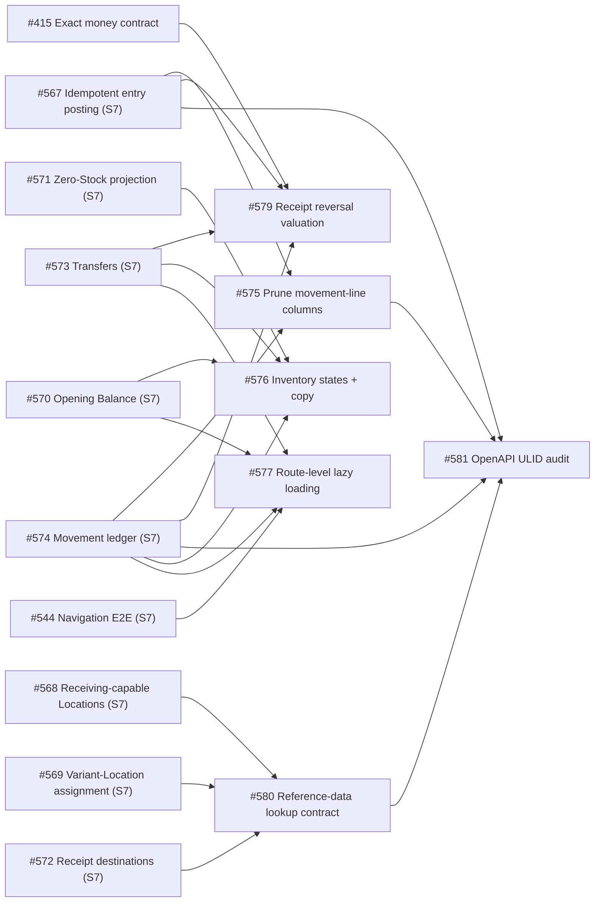

# Sprint 008 — Inventory Valuation Integrity & Platform Hardening

> Make Inventory's monetary and valuation arithmetic exact and reconcilable end to end, then clear
> the highest-value Sprint 5/6 engineering-review debt — schema duplication, lookup authorization,
> OpenAPI identifier drift, and Inventory UX state consistency — without adding new business
> capabilities.

## 1. Executive Summary

Sprint 008 contains **ten Issues** estimated at **39.5h optimistic / 87h pessimistic**. It is a
consolidation sprint: every Issue is a follow-up from the Sprint 5 or Sprint 6 engineering review
or from a Sprint 7 closure disposition, and none introduces a new user-facing capability.

Two Issues form the financial foundation and are the sprint's critical path:

- **#415** adopts one exact monetary value contract (integer minor units + currency, per
  [TD-05](../decisions/td-05-monetary-precision-and-rounding.md)) across database, PHP
  domain/DTO arithmetic, API payloads, and webapp calculations, so no domain-relevant money
  calculation depends on binary floating point.
- **#579** defines and implements correct inventory valuation when a posted Purchase Receipt is
  reversed — the highest-priority unresolved finding from the Sprint 5 review — with append-only
  value evidence and deterministic semantics for intervening consumption, receipts, and transfers.

The remaining seven Issues harden the module the Inventory roadmap (Sprints 4–7) delivered:
**#575** prunes the `StockMovementLine` columns made redundant by the #438 single-line contract,
with reconciliation and lossless rollback; **#580** replaces the growing per-workflow OR-permission
lists on lookup routes with an explicit reference-data access contract that preserves least
privilege; **#581** corrects Inventory OpenAPI so generated clients describe the ULID identifiers
the application actually accepts and emits; **#576** and **#577** finish the two Technical Tasks
#441 deferred (shared loading/empty/error/permission states plus a Spanish-copy sweep, and
evidence-backed route-level lazy loading); and **#545 / #546 / #550** restore three more quarantined
Cypress specs and remove their `this.skip()` guards.

Execution runs in four rounds so at most one writer owns each shared surface: the three quarantined
specs and the #415 field inventory start immediately, #415's primitive lands before #579's final
arithmetic, and the independent hardening lanes (#575, #580, #581) plus the Inventory UX lanes
(#576, #577) proceed in parallel on non-overlapping file surfaces.

## 2. Context

Sprints 4–7 delivered replacement Product/Variant identity, Purchase Presentations, Suppliers,
Purchase Receipts, per-Location weighted-average cost, safe concurrent Stock mutation, immutable
Stock Movements with linked reversals, per-Location replenishment policy, Operating Unit
authorization, receiving-capable Locations, managed Variant-to-Location assignment, an auditable
Opening Balance workflow, assignment-aware zero-Stock projection, eligible-destination Purchase
Receipts, auditable internal Stock Transfers, and a read-only Stock Movement ledger.

The reviews of those sprints recorded debt that could not be paid down while the verticals were
still being built:

- Purchase Receipt monetary amounts (`ReceiptLineData::$grossAmount`, `$discounts`,
  `$allocatedExpenses`, `$nonRecoverableTaxes`) still cross PHP `float` boundaries even though
  PostgreSQL stores exact `DECIMAL` and weighted-average blending uses BCMath — a cross-boundary
  contract problem that multiplies with every future arithmetic path (orders, adjustments,
  returns, valuation, reporting).
- `ReceiptService::reverseReceipt()` removes the received quantity (correct, immutable, per #438)
  but intentionally leaves `Stock.weighted_avg_cost` unchanged, so quantity and inventory value
  stop reconciling after a reversal, and blindly restoring the previous average is also wrong if
  consumption, another receipt, an adjustment, or a transfer happened in between.
- After #438 normalized every `StockMovement` to a single-line header that owns the Variant and
  base quantity, `stock_movement_lines` still repeats `item_variant_id` and `base_qty`; model
  guards keep them equal but the duplication allows database-level disagreement and complicates
  the ledger contract.
- Lookup routes on Product / Variant / Purchase Presentation / Supplier-Offering / Location / UOM
  carry an OR-permission list (`items.view | suppliers.manage | receipts.manage | …`) that grows
  by one clause per new workflow; Sprint 7 added several Inventory workflows, so the review's
  trigger to re-evaluate has arrived.
- `#399` migrated Inventory resources to public ULIDs, but generated OpenAPI still describes some
  path parameters and schemas as integer IDs, so generated clients disagree with runtime
  behavior.
- `#441` extracted `InventoryListLayout` / `CrudSlidePanels` / `StatusFilterSelect` but
  deliberately left loading/empty/error/permission-state standardization and the Spanish-copy
  sweep unfinished (TT4), and route-level code splitting unstarted because the app had no
  lazy-route pattern yet (TT6).
- Four Sprint 7 quarantined specs were restored (#544, #547, #548, #549); three more
  (`item-media-gallery-uploader`, `price-lists`, `suppliers-catalog`) remain skipped under the
  #490 guard, so those flows can report green without executing.

Repository base for planning: `main` at `6c5a0353`.

## 3. Sprint Goal

**Sprint Goal:** Make every domain-relevant monetary and inventory-valuation calculation exact and
reconcilable — including after a Purchase Receipt reversal — and pay down the highest-value
Inventory engineering-review debt (movement-line duplication, lookup authorization, OpenAPI
identifier accuracy, UX state consistency) and three quarantined Cypress specs, without adding a
new business capability or changing any business price or cost.

## 4. Sprint Timeline

| Metric | Value |
|---|---:|
| Created | 2026-09-09 |
| Planned start | 2026-09-09 |
| Planned end | 2026-09-23 |
| Target calendar duration | 14 days |
| Started | 2026-09-09 (promoted from `planned/` by #614) |
| Completed | — |
| Active workdays | — |

The ten Issues are on **SushiGo Admin**, labeled `sprint-8`, and are assigned to the **Sprint 8**
Project iteration created during promotion.

## 5. Scope

### 5.1 Included Issues

| Status | Issue | Title | Investment | Priority | Size | Opt. | Pess. |
|---|---:|---|---|---|---|---:|---:|
| ⏳ | #415 | Adopt an exact monetary value contract across API and webapp | Product engineering | P0 | XL | 12h | 24h |
| ⏳ | #579 | Reconcile inventory valuation when reversing Purchase Receipts | Product engineering | P0 | L | 8h | 16h |
| ⏳ | #575 | Prune redundant StockMovementLine columns with reconciliation | Product engineering | P1 | M | 4h | 8h |
| ⏳ | #580 | Decouple reference-data lookup access from workflow OR permissions | Product engineering | P1 | M | 4h | 8h |
| ⏳ | #581 | Align Inventory OpenAPI identifiers with public ULID contracts | Product engineering | P2 | S | 2h | 5h |
| ⏳ | #576 | Standardize Inventory loading, empty, error states and Spanish copy | Product engineering | P2 | M | 5h | 10h |
| ⏳ | #577 | Introduce route-level lazy loading starting with Inventory | Product engineering | P2 | M | 3h | 7h |
| ⏳ | #545 | Fix quarantined Cypress spec: item-media-gallery-uploader.cy.ts | Dev platform | P1 | S | 0.5h | 3h |
| ⏳ | #546 | Fix quarantined Cypress spec: price-lists.cy.ts | Dev platform | P1 | S | 0.5h | 3h |
| ⏳ | #550 | Fix quarantined Cypress spec: suppliers-catalog.cy.ts | Dev platform | P1 | S | 0.5h | 3h |
|  |  | **Total** |  |  |  | **39.5h** | **87h** |

### 5.2 Included Capabilities

- One exact Money/Decimal contract (integer minor units + currency at scale 2; unit/weighted-average
  cost at scale 4; quantities scale 4; conversion factors scale 6; rates scale 4; intermediate
  arithmetic at least scale 8; default `ROUND_HALF_UP`) rejected at PHP domain boundaries and
  mirrored by TypeScript helpers, with lossless reversible data migrations.
- Deterministic, append-only inventory valuation after a Purchase Receipt reversal, with explicit
  tested semantics for immediate reversal, partial remaining quantity, intervening consumption, a
  later receipt, a transfer, and double/concurrent reversal, reusing the #567 posting/source-line
  idempotency contract.
- A single persisted source of truth for movement Variant + base quantity on `StockMovement`, with
  the line retaining operated quantity/UOM/conversion and all financial evidence, plus a
  reconciliation step and lossless `up()`/`down()`.
- One documented reference-data access contract (a dedicated capability/policy such as
  `inventory_catalog.lookup`, or a workflow-aware authorization service) that grants active,
  scoped read access without catalog-management rights and without appending a permission per new
  workflow.
- Generated OpenAPI and clients that describe external Inventory identifiers as ULID strings and
  never expose an internal primary key, enforced by a regression check.
- One shared loading / background-refresh / empty-unfiltered / empty-filtered / recoverable-error /
  `403` / deleted-detail state contract across the canonical `/inventario/*` screens, with
  consistent Spanish copy and accessibility (focus, live regions, contrast, keyboard retry).
- A documented, reusable TanStack Router lazy-route convention applied to `/inventario/*` with a
  measured bundle baseline/after, an accessible chunk-load boundary with retry, and preserved
  `beforeLoad` guards and legacy redirects.
- Restored `item-media-gallery-uploader`, `price-lists`, and `suppliers-catalog` Cypress coverage
  with their `#490` quarantine guards removed and green in CI.

### 5.3 Excluded

- Multi-currency conversion, exchange rates, taxation policy, or accounting-ledger / general-ledger
  functionality; supplier credit notes, payables, or tax filing.
- Changing any business price or cost as part of the monetary representation migration.
- Editing or deleting posted quantity/value evidence, or arbitrary historical restatement.
- Full COGS, physical Stock Counts, manual Adjustments, Returns, reservations, lot/FIFO cost
  layers, serials, or expiration tracking (these consume #415/#579/#580 later, they are not built
  here).
- Replacing the global RBAC library or redesigning role administration.
- Server-side rendering, framework replacement, broad component rewrites, or speculative manual
  vendor chunking without measurement.
- Redesigning Inventory information architecture or business workflows.
- Changing database primary keys or URL shapes unrelated to identifier type.
- The remaining quarantined specs outside this sprint's three (`#535`–`#543`, `#551`–`#558`,
  `#561`) and unrelated deferred debt (`#85`, `#276`, `#450`).

### 5.4 Opportunistic Work

| Date | Issue | Title | Trigger | Result |
|---|---:|---|---|---|
| 2026-09-09 | #614 | Promote Sprint 008, formally close Sprint 007 | Sprint 007 implementation finished (13/13 merged) and this plan was complete | Sprint lifecycle advanced, both indexes synchronized, Project iteration dates corrected, progress badge refreshed |

## 6. Value Ranking

| Tier | Issues | Rationale |
|---|---|---|
| **Critical** | #415, #579 | Financial-arithmetic correctness foundation and quantity/value reconciliation — every future valuation, adjustment, return, and reporting path depends on both; #579 is the highest-priority unresolved Sprint 5 review finding |
| **High** | #575, #580 | Data integrity (one persisted source of truth for movement Variant/quantity) and least-privilege authorization (lookup access decoupled from catalog management before more workflows consume it) |
| **Medium** | #581, #576, #577 | API-contract accuracy, Inventory UX state/accessibility consistency, and a measurable initial-bundle reduction with a reusable lazy-route convention |
| **Low** | #545, #546, #550 | Conflict-free quarantined-spec restoration; each owns one Cypress file and can fill agent capacity without displacing higher-value work |

### Ordering principle

> Settle the monetary representation before the valuation arithmetic that must use it; harden the
> independent backend contracts (schema, authorization, OpenAPI) in parallel; finish the Inventory
> UX last so it standardizes against the final routes; restore quarantined specs as conflict-free
> filler throughout.

## 7. Route A — Execution Rounds

### Round 0 — Restore the affected E2E baseline

Each spec owns a different Cypress file, so all three may run concurrently. They gate nothing and
can be picked up whenever agent capacity is free.

| Lane | Issue | Owns | Opt. | Pess. |
|---|---:|---|---:|---:|
| T1 | #545 | `cypress/e2e/item-media-gallery-uploader.cy.ts` | 0.5h | 3h |
| T2 | #546 | `cypress/e2e/price-lists.cy.ts` | 0.5h | 3h |
| T3 | #550 | `cypress/e2e/suppliers-catalog.cy.ts` | 0.5h | 3h |
|  |  | **Round effort** | **1.5h** | **9h** |

Each fix must remove its `#490` `this.skip()` guard and prove the spec against a fresh isolated
stack and the CI `e2e-ci` shard.

### Round 1 — Financial foundation

| Lane | Issue | Primary file ownership | Opt. | Pess. |
|---|---:|---|---:|---:|
| A | #415 | Shared PHP Money/Decimal primitives; Receipt DTO/calculation, weighted-average cost, Opening Balance, Stock Out, Stock Movement financial evidence, price lists, dishes/extras, cash, payroll, reports migrated in bounded phases; matching TypeScript types/helpers; request validation, JsonResources/OpenAPI, seeders, factories, exports; lossless reversible DB migrations | 12h | 24h |
|  |  | **Round effort** | **12h** | **24h** |

#415 may begin its ADR confirmation and monetary-field inventory in parallel with Round 0. Its
primitive and Receipt-path migration must merge before #579 finalizes its valuation arithmetic.
Each in-scope monetary table has a single migration writer at a time.

### Round 2 — Valuation + independent hardening (parallel)

All four Issues start from `main` after Round 1's primitive is available (only #579 hard-depends on
it) and own disjoint file surfaces.

| Lane | Issue | Starts after | Primary file ownership | Opt. | Pess. |
|---|---:|---|---|---:|---:|
| B | #579 | #415 | Valuation model (accumulator / immutable valuation movements / cost layers), reversal semantics, `ReceiptService::reverseReceipt()`, valuation evidence in the #574 ledger read model, bilingual Receipt/Inventory architecture + OpenAPI | 8h | 16h |
| C | #575 | — (S7 #567/#574 merged) | `stock_movement_lines` schema/model/contracts, movement-line readers/writers in Opening Balance / Stock Out / Receipt / #567 posting / Transfer, webapp `StockMovementLine` types + #574 ledger serialization | 4h | 8h |
| D | #580 | — (S7 #568/#569/#572 merged) | Lookup route/controller middleware, the new capability/policy or authorization service, permission seeders, one reusable frontend query contract for workflow selectors | 4h | 8h |
| E | #581 | — (S7 #567–#574 merged) | Generated OpenAPI document audit, schema/type/description/example corrections, the identifier-contract regression test/linter | 2h | 5h |
|  |  |  | **Round effort** | **18h** | **37h** |

Coordination: #575 owns the movement-line schema; #579 and #581 read that contract but must not
change it. #581 closes its audit last so it covers every other backend Issue's regenerated schema.
#580 owns lookup-route middleware; #581 only documents it.

### Round 3 — Inventory UX (parallel)

Both Issues touch the canonical `/inventario/*` route tree; ownership is split by concern.

| Lane | Issue | Starts after | Primary file ownership | Opt. | Pess. |
|---|---:|---|---|---:|---:|
| F | #576 | S7 routes #570–#574 (merged) | Shared list/detail state components and their tests, in-page loading/empty/error/permission markup, Spanish copy for pages/columns/filters/summaries/toasts | 5h | 10h |
| G | #577 | #544 (merged) + S7 #570/#573/#574 (merged) | Lazy-route split of `/inventario/*` page components, the chunk-load boundary + retry component, the documented lazy-route convention, bundle baseline/after evidence | 3h | 7h |
|  |  |  | **Round effort** | **8h** | **17h** |

Coordination rule for the shared route files: #577 owns the route-module split (metadata/guards/
loader vs. lazily loaded page component); #576 owns the state markup and copy inside those page
components. Agree the public boundary and the file split before either edits a shared
`/inventario/*` route file.

## 8. Route B — Dependency Graph

### Critical path

The pessimistic delivery critical path is approximately **40h** (`#415` 24h + `#579` 16h). Every
other lane fits inside that window: Round 0 (9h pess.) and Round 2 lanes C/D/E (21h pess. combined
across three agents) run alongside #415, and Round 3 (17h pess.) runs alongside #579. With one
agent on the critical path and two-to-three on the parallel lanes, the sprint fits the two-week
calendar without forcing two agents onto the same file.

### Explicit dependencies

- **#415 → #579** — #579's final valuation arithmetic must use the canonical exact-money primitive;
  #579's architecture/semantics design may start in parallel, but its implementation rebases onto
  #415's merged primitive and Receipt-path migration.
- **S7 #567 + #574 → #575** — the final posting and ledger-read contracts must be known before the
  redundant movement-line columns are pruned (both merged in Sprint 007).
- **S7 #567 + #573 + #574 → #579** — reversal valuation consumes the source-line idempotency
  contract, the transfer cost behavior, and the ledger read model (all merged).
- **S7 #568 + #569 + #572 → #580** — the lookup cascades to decouple are the ones Sprint 7
  Location/Receipt work stabilized (all merged).
- **#575 + #580 → #581 (soft)** — the OpenAPI audit should close after the movement-line schema
  change and the lookup-route middleware change so it documents the final contracts; #581 can
  begin against `main` and re-run before closing.
- **S7 #570–#574 → #576, #577** — the Inventory routes to standardize and lazy-load are the ones
  Sprint 7 added; all merged.
- **#544 → #577** — the restored navigation spec is the regression guard for the route-boundary
  refactor.

## 9. Conflict Risk Map

| Shared area | Issues | Coordination rule |
|---|---|---|
| PHP monetary DTOs/services (`ReceiptLineData`, weighted-average cost, `Stock`, Opening Balance, Stock Out) | #415, #579 | #415 owns and lands the primitive + Receipt-path migration first; #579 rebases and consumes it, adds no parallel money type |
| `stock_movement_lines` schema / model / migrations | #575 only | #575 is the single writer; #579 and #581 read the resulting contract, they do not alter it |
| `StockMovement` / ledger read model (`#574`) | #575, #579 | #575 changes how Variant/base-qty is derived (header, not line); #579 adds valuation evidence fields — agree the resource shape before either merges |
| Inventory lookup routes / controllers / middleware (`items.php`, product/variant/presentation/UOM lookups) | #580, #581 | #580 owns the middleware/authorization change; #581 only documents the resulting contract in OpenAPI |
| Generated OpenAPI document | #581 owns; #415, #575, #579, #580 regenerate after their own change | #581 runs its audit last and its regression check gates a reintroduced integer-ID schema |
| Permission seeders / `config` | #415 (none), #580 | #580 is the only permission-model writer; idempotent seed + documented role implications |
| Canonical `/inventario/*` route files | #576, #577 | #577 owns the route-module split (metadata/guard/loader vs. lazy page component); #576 owns state markup + copy inside the page components; agree the split before editing a shared route file |
| Shared Inventory list/detail scaffolding (`InventoryListLayout`, `CrudSlidePanels`, `StatusFilterSelect`) | #576 only | #576 extends the scaffolding; #577 imports it unchanged |
| Bilingual Inventory / Purchase Receipt architecture docs + TypeScript money helpers | #415, #575, #579, #581 | Each Issue updates only the behavior it ships; #415 owns the money-helper module, others import it |
| Cypress specs | #545, #546, #550 | One file each; no overlap; later functional Issues extend the restored green spec rather than re-quarantining it |

### Conflict methodology

Affected files were identified from each Issue's own "Primary file ownership" / "Dependencies and
Parallelization" / "Out of Scope" sections, the Sprint 5 and Sprint 6 engineering-review findings
each Issue cites, and the Sprint 7 contracts (`#567` posting service, `#574` ledger read model,
`#568`/`#569`/`#572` lookup cascades, `#570`–`#574` routes) they build on. Two Issues conflict when
they modify the same file or when one changes a contract the other consumes; the round sequencing
keeps every shared surface single-writer within a round.

## 10. API and Persistence Plan

### Additive / reversible migrations first

1. **#415** — introduce Money/Decimal columns or representation alongside the existing exact
   `DECIMAL` values, backfilled losslessly; prove `up()`/`down()` round-trips every existing
   monetary value with no precision loss on a populated database; migrate consumers in bounded,
   individually documented phases.
2. **#579** — add the authoritative valuation evidence (value accumulator, immutable valuation
   movements, or cost layers — the design chosen and justified in the Issue/ADR) as append-only
   tables/columns; never edit posted quantity/value history.
3. **#575** — additive reconciliation/archive step that proves each candidate duplicate
   (`stock_movement_lines.item_variant_id`, `base_qty`) agrees with its parent header on real data,
   with an actionable failure on disagreement, before the destructive column drop; `down()`
   restores the columns and values verbatim.
4. **#580** — idempotent permission seed/migration for the new reference-data capability/policy;
   documented role implications; existing roles authorized through Suppliers or Receipts keep
   lookup access and gain no mutation capability.

Every migration must support a populated PostgreSQL database, use database constraints as a
backstop, and prove forward/backward behavior. No Issue removes an existing Stock, Receipt, or
Movement column without reconciliation evidence.

### Error semantics

| Condition | HTTP behavior |
|---|---|
| Unknown public ID / invalid field / malformed money value | `422` validation response |
| Lookup or workflow permission / Operating Unit access denied | `403` |
| Receipt reversal that cannot be reconciled exactly (intervening operation past the documented boundary) | `409` with an actionable message, or an explicit posted valuation adjustment — never a silent approximation |
| Duplicate / already-reversed lifecycle action, or concurrent reversal retry | `409`; compensation applied at most once |
| Unexpected failure | standard `500`; transaction fully rolled back (Stock, Receipt state, quantity movement, value evidence together) |

## 11. Test Strategy

### API

- Feature tests for every new/changed endpoint and every reversal-valuation scenario (immediate
  full reversal, partial remaining quantity, intervening consumption, later receipt, transfer,
  concurrent/double reversal, zero/free goods, fractional unit cost).
- Unit tests for the Money/Decimal primitive (fractional-cent unit costs, large values,
  discounts/taxes, zero/negative-where-allowed, repeated blends) and for the boundary rejection of
  raw floats.
- Migration tests: monetary round-trip preserves every existing value (#415); movement-line
  reconciliation on a populated DB plus a deliberately inconsistent fixture that fails safely
  (#575); permission seed idempotency and role implications (#580).
- Permission-matrix tests for the reference-data contract: catalog viewer, supplier manager,
  receipt manager, future Inventory operator, unauthorized user, inactive membership, admin bypass,
  and direct public-ID/filter bypass attempts (#580).
- A contract test/linter that compares public-ID route parameters and serialized resource IDs
  against generated OpenAPI types and fails on a reintroduced integer-ID schema (#581).
- Full Inventory API regression plus Pint for every backend Issue.

### Webapp

- TypeScript money-helper tests: serialization and arithmetic never coerce exact values to unsafe
  JS floating point; purchase preview and backend persistence produce identical results (#415).
- Shared component tests for every Inventory state × action/permission combination, plus
  representative route tests proving query state is wired correctly and stale data is not shown for
  a changed Operating Unit or filter (#576).
- Route tests proving every canonical and legacy Inventory URL resolves to the same authorized
  destination, plus lazy-load / chunk-load-failure-and-retry / permission-denial / deep-link
  coverage (#577).
- Restored `item-media-gallery-uploader` / `price-lists` / `suppliers-catalog` specs run without
  skip guards and green in CI (#545, #546, #550).
- ESLint and TypeScript clean for every frontend Issue.

### Required invariants

- No domain-relevant monetary calculation depends on binary floating-point arithmetic; database,
  API, PHP, and TypeScript agree on scale and representation.
- `sum(on_hand × valuation basis)` and immutable value evidence reconcile after every supported
  Receipt-reversal scenario; no reversal changes quantity while leaving unexplained residual value.
- Posted movement and value history remains append-only and causally linked; concurrency/retry
  cannot apply compensation twice.
- Movement Variant + base quantity has exactly one persisted source of truth; existing movements
  remain readable and reversible after the #575 migration; rollback is exact.
- Lookup access never implies catalog create/update/delete; every lookup read remains constrained
  by active Operating Unit membership or the documented admin bypass.
- Every reads-only Inventory screen (ledger, Existencias, lists) has no Stock or ledger write side
  effect.

## 12. Documentation Deliverables

In English and Spanish, updated only for behavior actually shipped:

- [`TD-05`](../decisions/td-05-monetary-precision-and-rounding.md) implementation status plus a
  complete inventory of monetary fields classified against it (#415).
- `doc/architecture/` financial/monetary contract: representation, scale, rounding, serialization,
  and migration behavior across DB / PHP / API / TypeScript (#415).
- `doc/architecture/inventory-architecture.*.md` and
  `doc/architecture/purchasing/purchase-receipts.*.md`: the reversal valuation model, its
  intervening-operation semantics and failure boundaries, and the movement-line contract after the
  #575 prune (#579, #575).
- The reference-data access contract documented separately from catalog management, with role
  implications (#580).
- OpenAPI regenerated and corrected for ULID identifiers, with the regression check documented
  (#581).
- `doc/conventions/frontend/` : the shared Inventory state contract and the reusable lazy-route
  convention (#576, #577).

## 13. Execution Evidence

| Status | Issue | Result Summary | Pull Request | Merge Commit | Tracked | Evidence Notes |
|---|---:|---|---:|---|---:|---|
| ⏳ | #415 | — | — | — | — | Not started |
| ⏳ | #579 | — | — | — | — | Not started |
| ⏳ | #575 | — | — | — | — | Not started |
| ⏳ | #580 | — | — | — | — | Not started |
| ⏳ | #581 | — | — | — | — | Not started |
| ⏳ | #576 | — | — | — | — | Not started |
| ⏳ | #577 | — | — | — | — | Not started |
| ⏳ | #545 | — | — | — | — | Not started |
| ⏳ | #546 | — | — | — | — | Not started |
| ⏳ | #550 | — | — | — | — | Not started |

### Risks and Mitigations

| Risk | Impact | Mitigation |
|---|---|---|
| Monetary migration loses precision or breaks an existing client | Corrupt financial data or a broken integration | Lossless reversible migration proven on a populated DB; API compatibility/contract tests; representation added alongside, consumers migrated in bounded phases (#415) |
| Reversal valuation silently approximates an intervening-operation case | Quantity and value stop reconciling without evidence | Every intervening case has an explicit tested boundary; unreconcilable cases fail `409` or post an explicit adjustment; append-only evidence (#579) |
| Movement-line prune drops a column a consumer still reads | Runtime error or lost audit value | Full reader/writer inventory; reconciliation on real data with a safe diagnostic failure; lossless `up()`/`down()`; retained transaction-UOM / cost evidence (#575) |
| Lookup-authorization change breaks a role authorized through Suppliers/Receipts | Existing workflows lose access | Permission matrix across every role and bypass path; existing cascades tested past page 1; idempotent seed with documented implications (#580) |
| #576 and #577 edit the same `/inventario/*` route files | Merge conflicts | Ownership split (route-module split vs. in-page state/copy) agreed before either edits a shared file (§9) |
| OpenAPI audit closes before another backend Issue regenerates the schema | Stale contract re-published | #581 runs its audit last and its regression check gates every future integer-ID schema |
| Quarantined-spec fix masks a real product regression | False confidence | Each fix proves the spec against a fresh isolated stack and the CI `e2e-ci` shard before removing the guard; no product code changed unless a real defect is found and scoped |

## 14. Quality Results

| Metric | Before | Target | After | Result |
|---|---:|---:|---:|---|
| Money float boundaries in Receipt/cost domain arithmetic | Present (`ReceiptLineData` float fields) | 0 | — | ⏳ |
| Reversal quantity/value reconciliation | Quantity only; value left stale | `sum(on_hand × basis)` reconciles every scenario | — | ⏳ |
| Persisted sources of truth for movement Variant/qty | 2 (header + line) | 1 (header) | — | ⏳ |
| Lookup routes with per-workflow OR-permission lists | Growing (`items.view \| suppliers.manage \| …`) | 0 (one reference-data contract) | — | ⏳ |
| Inventory OpenAPI identifiers wrong vs. runtime | Some integer-ID path params/schemas | 0 | — | ⏳ |
| Quarantined Cypress specs (this sprint's three) | 3 skipped | 0 | — | ⏳ |
| Tests passing | 100% on `main` | 100% | — | ⏳ |
| New-code coverage (SonarCloud) | ≥ 80% | ≥ 80% | — | ⏳ |

## 15. Results

### 15.1 Delivered Value

_To be completed at closure._

### 15.2 Planned vs. Actual

_To be completed at closure._

### 15.3 Known Limitations

_To be completed at closure._

## 16. Lessons Learned

_To be completed at closure._

## 17. Follow-up Work

| Status | Proposed Issue | Title | Reason | Candidate Sprint |
|---|---:|---|---|---|
| ⏳ | — | — | — | — |

## 18. Sprint Closure Checklist

- [ ] All ten Issues (`#415`, `#545`, `#546`, `#550`, `#575`, `#576`, `#577`, `#579`, `#580`, `#581`) are merged and Done.
- [ ] No domain-relevant monetary calculation depends on binary floating point; DB/API/PHP/TS agree on scale and representation, and existing data migrated and rolled back without precision loss.
- [ ] Quantity and inventory value reconcile after every supported Purchase Receipt reversal scenario, with append-only evidence and explicit intervening-operation boundaries.
- [ ] Movement Variant + base quantity has one persisted source of truth; existing movements remain readable and reversible; rollback is exact.
- [ ] One documented reference-data access contract replaces the per-workflow OR-permission lists; least privilege and Operating Unit isolation preserved; existing Supplier/Receipt roles retain access without gaining mutation rights.
- [ ] Generated OpenAPI describes every external Inventory identifier as a ULID string; the regression check fails on a reintroduced integer-ID schema.
- [ ] Every canonical Inventory screen has explicit loading/empty/error/permission behavior with consistent Spanish copy and accessibility.
- [ ] `/inventario/*` page components load as lazy route chunks with preserved guards/redirects and a measured bundle baseline/after; the convention is documented and reusable.
- [ ] The `item-media-gallery-uploader`, `price-lists`, and `suppliers-catalog` quarantine guards are removed and the specs are green in CI.
- [ ] Full Inventory API regression, frontend tests, lint, typecheck, and affected Cypress paths are green; SonarCloud new-code coverage ≥ 80% for every Issue.
- [ ] Architecture, financial-contract, OpenAPI, and frontend-convention documentation reflect as-built behavior.
- [ ] Estimates, tracked effort, wall-clock overlap, parallelization factor, peak concurrency, evidence, quality results, and lessons are consolidated (§10, §11, §14–§16 of `doc/conventions/sprints.md`).
- [ ] The sprint closure audit reports `PASS` (`node .github/scripts/sprint-audit/generate.js` — see `doc/conventions/sprint-closure-audit.md`).
- [ ] Follow-up work was created or recorded (§17).
- [ ] Metadata dates and status were updated.
- [ ] The next sprint was promoted or created, or Sprint 008 remains current per the lifecycle convention.
