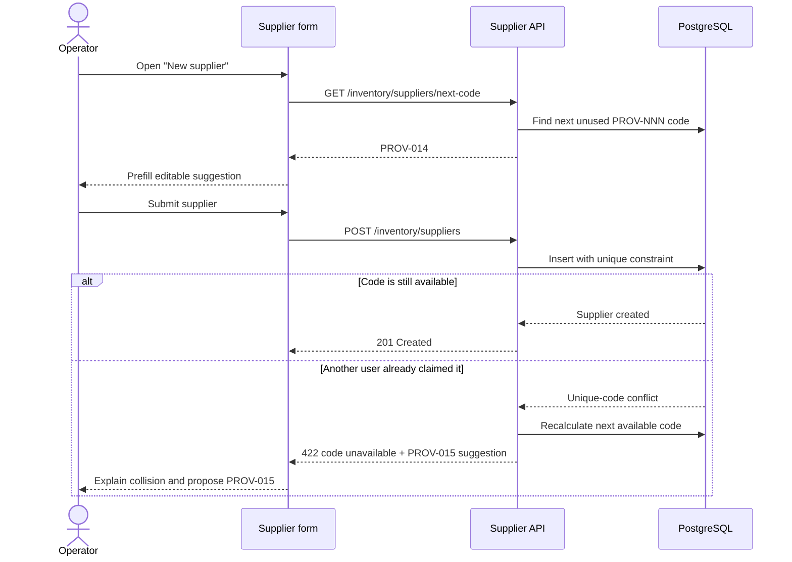

# ✨ Suggest collision-aware Supplier codes during creation

**Labels:** enhancement, backend, frontend, sprint-6, investment: product

# ✨ Suggest collision-aware Supplier codes during creation

## Description

Add an editable code suggestion to the Supplier creation flow, following the interaction already used by Employee creation. When the form opens, SushiGo should propose the next available sequential Supplier code (for example, `PROV-014`) instead of requiring the operator to invent and manually verify one.

This Issue also establishes the reusable sequential-code interaction that later entities such as Cash Registers can adopt. A suggestion is a convenience, not a reservation: the database unique constraint remains the authority, and the create request must handle the rare race where another user claims the same code after it was suggested.

### Proposed flow



### Proposed collision experience

```text
┌─ Nuevo proveedor ──────────────────────┐
│ Código *                                     │
│ [ PROV-015                              ] [↻] │
│ Sugerido automáticamente; puedes modificarlo.  │
│                                                │
│ ⚠ PROV-014 acaba de ser utilizado.             │
│   Te proponemos PROV-015.                    │
└────────────────────────────────────────────────┘
```

If the field still contains an automatically suggested value when a collision occurs, the UI may replace it with the new suggestion and require the user to submit again. If the user manually edited the field, SushiGo must not overwrite it; show the field error and an explicit `Use PROV-015` action instead. The create operation must never silently retry or create a record without a final user-confirmed code.

## Reason

Supplier codes are internal administrative identifiers, and the form already communicates a sequential convention through the `PROV-001` placeholder. Making every operator choose the next value manually adds avoidable friction and encourages inconsistent formatting. The Employee form has already demonstrated that a server-backed, editable suggestion works well for low-concurrency catalog creation.

The endpoint cannot reserve the code indefinitely: a user may keep the panel open, abandon it, or edit the suggestion. A lightweight optimistic suggestion plus authoritative uniqueness enforcement gives the expected usability without introducing reservation rows, expiration jobs, locks held across requests, or gaps caused by abandoned forms.

Codes belonging to soft-deleted Suppliers should still be considered occupied by the suggestion algorithm. Reusing a historical code can make audit trails, old documents, and human communication ambiguous even if the current partial unique index technically permits reuse.

## Objective

Opening the Supplier creation form proposes the next available `PROV-NNN` code, lets the operator edit or refresh it, and recovers clearly from a concurrent code collision without overwriting a manually chosen code or silently resubmitting the form.

## ✅ Technical Tasks

### Backend

- [x] 🔧 Add configurable Supplier code prefix and padding, defaulting to `PROV-` and three digits.
- [x] 🌐 Add a permission-protected `GET /api/v1/inventory/suppliers/next-code` endpoint available to users who can create/manage Suppliers.
- [x] 🗃️ Calculate the maximum numeric suffix in PostgreSQL without loading every Supplier into PHP, following the Employee implementation.
- [x] 🪦 Include soft-deleted Suppliers when determining occupied historical codes.
- [x] 🛡️ Keep the database unique constraint as the final authority.
- [x] 🔁 On a create-time unique-code conflict, return a stable field error contract containing the rejected code and a freshly calculated suggestion.
- [x] 📚 Document the endpoint and collision response in OpenAPI.

### Frontend

- [x] 🪝 Extract or introduce a reusable suggested-code hook/controller modeled after Employee creation.
- [x] ✨ Prefill the suggestion only in create mode; never mutate an existing Supplier code merely because a new suggestion was fetched.
- [x] 🔄 Add a refresh control with accessible Spanish label, loading state, and failure fallback.
- [x] ✍️ Track whether the current value is still system-suggested or has been manually edited.
- [x] ⚠️ Handle collision responses differently for auto-suggested and manually edited values.
- [x] 🌐 Keep every label, hint, alert, and backend message shown by the UI in Spanish; code identifiers remain in English.

### Tests

- [x] 🧪 Cover empty data, mixed/manual codes, gaps, large suffixes, and soft-deleted Suppliers in API tests.
- [x] 🧪 Cover the create-time collision contract and regenerated suggestion.
- [x] 🧪 Cover form prefill, manual override preservation, refresh, loading/error states, and collision UI in Vitest.
- [x] 🧪 Add one Cypress happy path for accepting the proposed Supplier code.

## 🎯 Acceptance Criteria

- [x] Opening a new Supplier form requests and displays the next available `PROV-NNN` code.
- [x] The suggestion is editable and can be refreshed explicitly.
- [x] Editing an existing Supplier does not request or replace its code.
- [x] Suggested codes never reuse a code held by an active or soft-deleted Supplier.
- [x] A concurrent collision returns a Spanish field error and a new available suggestion.
- [x] An untouched generated value may be replaced by the new suggestion, but creation requires another explicit submit.
- [x] A manually edited value is never overwritten; the user can explicitly choose the proposed replacement.
- [x] The API/database still rejects duplicates even if the suggestion endpoint was never called.
- [x] No reservation table, expiring lease, or silent automatic create retry is introduced.

## 🔗 References

- Existing pattern: `SuggestEmployeeCodeController`, `useNextEmployeeCode`, and Employee create form.
- Supplier catalog: #431.
- Sequential-code consumer: #498 (Cash Registers).
- Contextual-code consumers: #499 (Purchase Presentation Templates), #500 (Items), and #501 (Product Variants).

## ⏱️ Time

### 📊 Estimates
- **Optimistic:** `6h` · **Pessimistic:** `12h` · **Tracked:** `1h44m`

### 📅 Sessions
```json
[
  { "date": "2026-08-26", "start": "21:13", "end": "21:36" },
  { "date": "2026-08-26", "start": "23:30", "end": "23:58" },
  { "date": "2026-08-27", "start": "09:35", "end": "10:28" }
]
```

## 📊 Retrospective

**Actual total:** `1h44m` — 23m (2026-08-26 21:13–21:36) + 28m (2026-08-26 23:30–23:58) + 53m (2026-08-27 09:35–10:28).

**Variance:** `-4h16m` vs. optimistic (`6h`), `-10h16m` vs. pessimistic (`12h`).

**Narrative:** Delivered via the autonomous `/issue-no-review` pipeline, so wall-clock is far
below the human estimates. Session 1 built the whole feature — `config/suppliers.php`, the reusable
`SequentialCodeGenerator` + `SupplierCodeGenerator`, the `GET /inventory/suppliers/next-code`
endpoint, the enriched create-time collision contract (`rejected_code` + recomputed
`suggested_code`, insert wrapped in a transaction), the `useSuggestedCode` hook, the Supplier
create-form prefill/refresh/collision UX, ~15 PHPUnit + Vitest tests, a Cypress happy path, and the
OpenAPI/architecture doc updates. Two review-response cycles followed: session 2 handled Copilot +
Codex threads (an int4-overflow edge case on oversized numeric suffixes → `?::int` bind + `{1,15}`
digit bound + `bigint` cast with a regression test; a named `ChangeEventHandler` import; a skipped
Codex false-positive about panel-open refetch, since `SlidePanel` unmounts its children on close).
Session 3 fixed a stale-duplicate-error bug the operator spotted — the fresh suggested code was
still shown flagged as taken because `validationErrors` weren't cleared on collision replacement —
then rebased onto three `#439` commits that landed on `main` and ran close-out. Most of the elapsed
time was the two feedback loops and the rebase, not the initial build.


