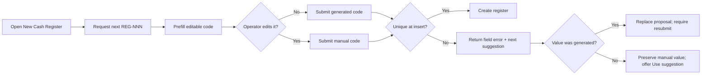

# ✨ Suggest the next available Cash Register code

**Labels:** enhancement, backend, frontend, sprint-6, investment: product

# ✨ Suggest the next available Cash Register code

## Description

Extend the sequential-code suggestion pattern established for Employees and Suppliers to the Cash Register creation form. New registers should receive an editable `REG-NNN` proposal, such as `REG-004`, while the existing code remains immutable during edit.

The form currently displays `REG-001` only as a placeholder and makes the operator determine whether that value is already in use. The backend already requires global uniqueness, so the suggestion endpoint must calculate against the same global namespace rather than resetting per branch, event, or register type.



## Reason

Cash Register codes are operational identifiers, not manufacturer or third-party references. The seeded and documented format already follows a simple sequence (`REG-001`, `REG-002`, `REG-003`), making it an ideal consumer of the same low-friction behavior as Employee and Supplier creation.

Keeping this as a separate Issue allows the Supplier work to establish the shared contract first, then verifies that the pattern is genuinely reusable instead of becoming Supplier-specific duplication.

## Objective

Operators creating a Cash Register receive the next globally available `REG-NNN` code automatically and get the same safe, explicit collision recovery as Supplier creation.

## ✅ Technical Tasks

### Backend

- [x] 🔧 Add configurable Cash Register prefix/padding with defaults `REG-` and three digits.
- [x] 🌐 Add a permission-protected next-code endpoint under the Cash Register API.
- [x] 🗃️ Calculate the next numeric suffix in SQL across all branches and register types.
- [x] 🛡️ Preserve the database unique constraint as the authority and adopt the shared collision response contract.
- [x] 📚 Document the suggestion and collision response in OpenAPI.

### Frontend

- [x] 🪝 Adopt the reusable suggested-code hook/controller from the Supplier Issue.
- [x] ✨ Prefill only when creating a register; preserve the immutable existing code in edit mode.
- [x] 🔄 Provide an accessible refresh action and loading/failure states.
- [x] ⚠️ Preserve manually edited values on collision and offer the fresh suggestion explicitly.
- [x] 🌐 Show all user-facing text in Spanish.

### Tests

- [x] 🧪 Cover an empty table, existing sequential/manual codes, gaps, and collisions in API tests.
- [x] 🧪 Cover create/edit mode, refresh, manual override, and collision handling in Vitest.
- [x] 🧪 Add one Cypress happy path accepting the suggested register code.

## 🎯 Acceptance Criteria

- [x] New Cash Register forms propose the next globally available `REG-NNN` code.
- [x] The proposal is editable and refreshable.
- [x] Edit mode keeps the persisted code and does not fetch a suggestion.
- [x] Suggestions do not reset per branch, operating unit, or register type while the database constraint remains global.
- [x] Concurrent duplicate submission produces a Spanish field error and a new suggestion without silent creation retry.
- [x] Manual values are never overwritten automatically.

## 🔗 References

- Existing Employee next-code behavior.
- Supplier suggested-code contract: #497; implement after its reusable contract is available.
- Cash Register seed convention: `REG-001`, `REG-002`, `REG-003`.

## ⏱️ Time

### 📊 Estimates
- **Optimistic:** `4h` · **Pessimistic:** `8h` · **Tracked:** `2h41m`

### 📅 Sessions
```json
[
  { "date": "2026-08-27", "start": "20:46", "end": "21:14" },
  { "date": "2026-08-27", "start": "21:14", "end": "23:27" }
]
```

## 📊 Retrospective

**Tracked:** `2h41m` — sessions: 2026-08-27 20:46–21:14 (28m) + 21:14–23:27 (2h13m).

**Variance:** `-1h19m` vs the `4h` optimistic estimate, `-5h19m` vs the `8h` pessimistic — comfortably under both.

**Why the time came out this way:**
- The core delivery was fast because #497 had already built every reusable piece: `SequentialCodeGenerator`, the `useSuggestedCode` controller hook, and the `rejected_code`/`suggested_code` 422 collision contract. This issue mostly adapted that proven pattern to `cash_registers` — a new `config/cash_registers.php`, a 3-line `CashRegisterCodeGenerator` subclass, one permission-guarded `next-code` endpoint, and the transaction + collision branch in `CreateCashRegisterController` — plus extracting `useCashRegisterForm` from the legacy always-mounted form so it could adopt the shared hook.
- Roughly half the tracked time was two manual review-response cycles, both surfacing real design gaps from reusing a pattern built for a conditionally-mounted form:
  1. Codex (P2) noted the always-mounted `CashRegisterForm` meant `!isEditing` alone fetched the suggestion once on page load and never refreshed it — a stale, possibly-taken code on reopen. Fixed by threading `isOpen` into the hook, gating the query on it, and resetting form + suggestion bookkeeping on every open transition.
  2. A follow-up review noted the shared `useCreateCashRegister` hook's generic `onError` still popped a red failure toast on the graceful collision-recovery path. Fixed by moving the create mutation into `useCashRegisterForm` with a collision-aware `onError` that stays silent for a `suggested_code` 422 while keeping the toast for every other failure.
- No scope changes; the estimate simply didn't account for the reused-pattern adaptation being this light on the happy path, nor for two review iterations on the always-mounted-panel edge cases.


