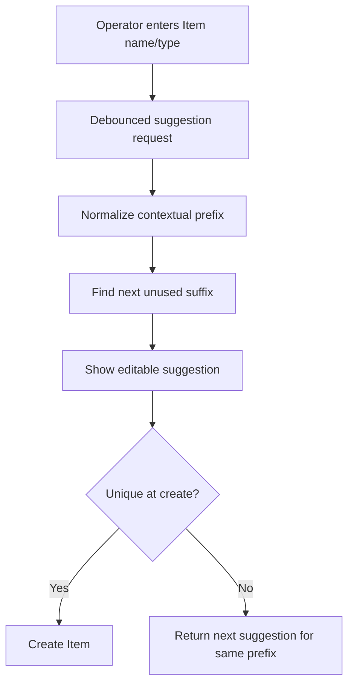

# ✨ Suggest contextual SKUs for Items

**Labels:** enhancement, backend, frontend, sprint-6, investment: product

# ✨ Suggest contextual SKUs for Items

## Description

Suggest an editable SKU when creating an Inventory Item (`INSUMO` or `ACTIVO`). Unlike Employee, Supplier, and Cash Register identifiers, an Item SKU benefits from a human-recognizable prefix derived from the Item name or type. For example, `Salmón fresco` could produce `SAL-001`, while a collision would advance to `SAL-002`.

The suggestion must remain advisory. Operators can replace it with an established internal SKU, and the database unique constraint remains authoritative.

### Suggested derivation

```text
Input name       Normalized prefix    Candidate
─────────────────────────────────────────────────
Salmón fresco    SAL                  SAL-001
Salsa de soya    SAL                  SAL-002
Refrigerador     REF                  REF-001
```

The exact normalization rules must be deterministic and documented: Unicode accents normalized, punctuation/whitespace removed, uppercase output, a stable prefix length, and a fallback such as `ITEM-001` when no useful prefix can be derived.



## Reason

Item SKUs are easier to recognize in lists, stock operations, and printed/internal references when they retain a meaningful prefix. A single generic sequence such as `ITEM-1042` reduces manual work but loses context; fully manual entry preserves context but causes inconsistent abbreviations and duplicate retries.

A deterministic contextual suggestion provides a useful default without pretending that SushiGo owns every organization's SKU policy. Because users may create Items concurrently, collision handling must follow the same explicit pattern as other suggested codes.

This Issue applies to the quick Item form for `INSUMO` and `ACTIVO`. Product identity is intentionally excluded because the reconstructed Product catalog makes Variant `code` the authoritative SKU.

## Objective

Creating an Item proposes a recognizable, unique-looking SKU derived from its name/type, keeps it editable, and safely proposes the next suffix when a concurrent collision occurs.

## ✅ Technical Tasks

### Product/contract decisions

- [x] 📝 Define and document deterministic prefix normalization, prefix length, separator, padding, and fallback behavior.
- [x] 📝 Confirm that only `INSUMO` and `ACTIVO` Item creation is in scope; Product SKU ownership remains on Variant.
- [x] 🪦 Decide whether soft-deleted Item SKUs remain permanently unavailable; default to no historical reuse unless explicitly changed.

### Backend

- [x] 🌐 Add a permission-protected Item SKU suggestion endpoint accepting the minimum context required to derive the prefix.
- [x] 🗃️ Calculate the next numeric suffix efficiently without loading all Items.
- [x] 🛡️ Preserve the unique constraint and return the shared collision response with a new suggestion for the same prefix.
- [x] 📚 Document normalization and response examples in OpenAPI.

### Frontend

- [x] ✨ Request/update the suggestion as the relevant Item context becomes available, using debounce or an explicit generate action to avoid request-per-keystroke noise.
- [x] ✍️ Stop automatic replacements once the operator manually edits the SKU.
- [x] 🔄 Provide an explicit regenerate action.
- [x] ⚠️ Apply the shared collision behavior: replace only untouched suggestions; preserve manual values and offer the alternative.
- [ ] 🌐 Present labels, hints, errors, and alerts in Spanish.

### Tests

- [x] 🧪 Cover accent normalization, punctuation, short/empty names, shared prefixes, gaps, soft deletion, and large suffixes.
- [x] 🧪 Cover collision response and unchanged database uniqueness behavior.
- [x] 🧪 Cover debounce/generation, manual override, regenerate, edit mode, and collision UI in Vitest.
- [x] 🧪 Add one Item creation Cypress happy path with the proposed SKU.

## 🎯 Acceptance Criteria

- [x] A new `INSUMO` or `ACTIVO` receives an editable contextual SKU suggestion.
- [x] Prefix normalization is deterministic and documented.
- [x] A safe fallback is used when a meaningful prefix cannot be derived.
- [x] Editing an existing Item never changes its SKU automatically.
- [x] Manual SKU entry remains fully supported.
- [x] A collision produces a new suggestion for the same contextual prefix and never silently retries creation.
- [x] Product creation is not given an Item-level SKU; Product Variant remains authoritative.

## 🔗 References

- Product catalog SKU ownership: #421, #422, #424.
- Item quick-create scope: #429.
- Shared collision interaction: #497.

## ⏱️ Time

### 📊 Estimates
- **Optimistic:** `7h` · **Pessimistic:** `14h` · **Tracked:** `1h 14m`

### 📅 Sessions
```json
[
  { "date": "2026-08-27", "start": "11:49", "end": "12:18" },
  { "date": "2026-08-27", "start": "16:40", "end": "17:25" }
]
```

## 📊 Retrospective
- **Actual total:** 1h 14m (29m implementation + 45m review response)
- **vs optimistic:** −5h 46m
- **vs pessimistic:** −12h 46m

**Justification:**
The estimate assumed building the sequential-code suggestion machinery from scratch. In practice
almost all of it already existed: `SequentialCodeGenerator`, the shared `useSuggestedCode` hook,
and the create-time collision contract (`rejected_* / suggested_*` with a same-prefix
regeneration) all landed the same day in #497 for Supplier codes, along with a proven pattern for
testing the create-time race (separate PDO connection + `eloquent.saving` listener). The only
genuinely new code in the first session was `ItemSkuGenerator` — the deterministic name →
contextual-prefix derivation (ASCII fold, strip non-alphanumerics, uppercase, first 3 chars,
`ITEM-` fallback, documented in `config/items.php`) — plus wiring the debounced, name-keyed query
into the existing `useSuggestedCode` controller and extracting the legacy `item-form.tsx` logic
into a `useItemForm` hook. That session ran via `/issue-no-review` and stopped once CI was green.

The second session (~45m) was the review-response pass a human then drove: Codex flagged a real
P2 in the new debounced-suggestion logic — a name change left the previously generated SKU in the
field while the new request was in flight, and a collision-pinned SKU kept overriding a fresh
suggestion for the new name, so an auto-managed `SAL-*` value could be submitted for a renamed
item. Fixed by making the system-managed field mirror only a settled suggestion for the *current*
name (empty otherwise, which fails validation) and dropping the pin/alert on any name-context
change, with two added Vitest cases. One SonarCloud smell (a nested ternary in `managedSku`,
`typescript:S3358`) was extracted in the same pass. Both quality gates end at 0 new issues.

One judgment call is logged on the PR: the new SKU-suggestion affordances are in Spanish per the
issue, but the surrounding legacy English chrome of `item-form.tsx` was left untouched as
out-of-scope, so the "labels/hints/errors/alerts in Spanish" Technical Task is only partially met
and its checkbox is left unticked for a maintainer to decide on a follow-up.


