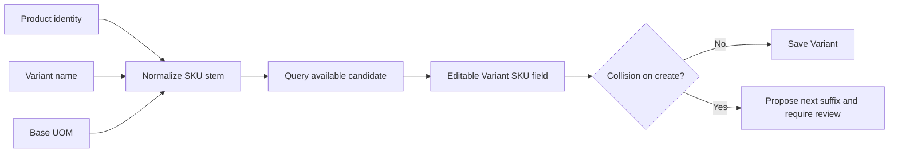

# ✨ Suggest contextual SKUs for Product Variants

**Labels:** enhancement, backend, frontend, sprint-6, investment: product

# ✨ Suggest contextual SKUs for Product Variants

## Description

Suggest an editable SKU (`ItemVariant.code`) when creating a Variant inside a Product. The SKU should be derived from stable Product/Variant context such as Product name, Variant name, and base unit, then advanced to the next available suffix when necessary.

Example candidates:

```text
Product              Variant        Base unit    Suggested SKU
─────────────────────────────────────────────────────────
Arroz Premium        1 kg            KG           ARR-KG
Arroz Premium        500 g           G            ARR-500G
Coca-Cola Original   600 ml          ML           COC-600ML
```

The table illustrates intent, not a final algorithm. This Issue must first define deterministic rules and decide when a numeric suffix is added (`ARR-KG`, then `ARR-KG-002`) so equivalent inputs do not produce inconsistent codes.

`ItemVariant.code` is the authoritative SKU for the reconstructed Product catalog. There are currently two Variant creation surfaces backed by the same table: the Product-scoped form and a legacy Inventory Variant form. The Product-scoped flow is mandatory. At implementation time, coordinate with #442: if the legacy form is still reachable, it must consume the same suggestion contract; if #442 has removed it, do not preserve dead UI solely for this feature.



## Reason

Variant SKUs are visible throughout catalog, stock, receiving, and reporting workflows. Requiring an operator to manually compose every SKU slows onboarding and creates inconsistent abbreviations, but a generic sequence discards useful identity. A contextual default makes common creation fast while keeping manual SKU policies possible.

Because Product, Variant, and UOM fields may be filled in different orders, the frontend must avoid repeatedly overwriting an operator's choice. Generation should continue only while the field remains untouched/system-owned.

## Objective

The Product Variant creation form proposes a deterministic contextual SKU, preserves manual control, and uses the shared collision contract to recover from simultaneous creation safely.

## ✅ Technical Tasks

### Product/contract decisions

- [x] 📝 Define deterministic stem composition, normalization, maximum length, separators, padding, fallback, and collision suffix rules.
- [x] 📝 Define which changes regenerate a still-untouched suggestion (Product, Variant name, UOM) and when generation stops.
- [x] 🔎 Reconcile scope with #442 and document whether the legacy Inventory Variant form remains active.
- [x] 🪦 Treat soft-deleted Variant SKUs as historically occupied unless the architecture explicitly allows reuse.

### Backend

- [x] 🌐 Add a Product-scoped, permission-protected Variant SKU suggestion endpoint.
- [x] 🗃️ Calculate availability against the global `item_variants.code` namespace.
- [x] 🛡️ Preserve unique enforcement and return a fresh contextual suggestion on collision.
- [x] 📚 Document the derivation inputs and collision response in OpenAPI/product architecture.

### Frontend

- [x] ✨ Integrate suggestion into the Product-scoped Variant form.
- [x] 🪝 Reuse the shared suggested-code state/collision interaction where possible.
- [x] ✍️ Never overwrite a manually edited SKU.
- [x] 🔄 Provide an explicit regenerate action after manual edits.
- [x] 🧹 If still reachable, migrate the legacy Variant form to the same endpoint/interaction; otherwise confirm its removal under #442.
- [x] 🌐 Present all user-facing text in Spanish.

### Tests

- [x] 🧪 Cover normalization, missing context, equivalent names, UOM changes, global collisions, soft deletion, and maximum length.
- [x] 🧪 Cover manual override preservation and regeneration rules in the hook.
- [x] 🧪 Cover collision response behavior.
- [x] 🧪 Add one Product Variant creation Cypress happy path using the suggestion.

## 🎯 Acceptance Criteria

- [x] A new Product Variant receives an editable contextual SKU suggestion once sufficient context exists.
- [x] Suggestions are deterministic for equivalent normalized input.
- [x] Availability is checked globally across all Item Variants, not only within the selected Product.
- [x] Manual edits stop automatic overwrites.
- [x] Existing Variants are never renamed automatically in edit mode.
- [x] Concurrent collisions return a new suggestion and require explicit resubmission.
- [x] The implementation does not create a second SKU field on Product; `ItemVariant.code` remains authoritative.
- [x] The legacy Variant form is either integrated consistently or confirmed removed by #442.

## 🔗 References

- Product catalog architecture and SKU ownership: #421 and #424.
- Embedded Product Variant UI: #425.
- Legacy Inventory cleanup: #442.
- Shared collision interaction: #497.

## 🤔 Assumptions

- The deterministic stem follows the issue examples plus the established contextual-code patterns in `App\Support\ItemSkuGenerator` (#500) and `PurchasePresentationTemplateCodeGenerator` (#499): a three-character Item prefix, normalized Variant/UOM descriptor, 100-character cap, then padded `-002` collisions.
- `code/webapp/src/pages/inventario/variantes.tsx` remains reachable after #442 for INSUMO/ACTIVO while explicitly excluding PRODUCTO, so it reuses the same generator through a protected legacy alias instead of being treated as dead UI.

## ⏱️ Time

### 📊 Estimates
- **Optimistic:** `8h` · **Pessimistic:** `16h` · **Tracked:** `1h11m`

### 📅 Sessions
```json
[
  { "date": "2026-08-30", "start": "01:26", "end": "02:37" }
]
```


## 📊 Retrospective
- **Actual total:** 1h 11m (71m, 1 session on 2026-08-30 01:26–02:37)
- **vs optimistic:** −6h 49m
- **vs pessimistic:** −14h 49m

**Justification:**
The 8h/16h estimate assumed designing the deterministic SKU stem algorithm, the concurrent-collision contract, and the suggested-code UI interaction largely from scratch. In practice all three already existed as merged precedents in the immediately preceding series: `PurchasePresentationTemplateCodeGenerator` (#499) and `ItemSkuGenerator` (#500) had established the three-char prefix / normalize / 100-char cap / padded `-002` collision-suffix generator pattern, #497 and #498 had established the `DB::transaction` + `UniqueConstraintViolationException` → `422 { suggested_code }` recovery contract, and `useSuggestedCode` / `useSuggestedCodeField` were already reusable hooks. The work was therefore adapting that accumulated pattern into `VariantSkuGenerator` and wiring it into the Product-scoped and legacy Variant forms via TDD — not novel design. No mid-flight scope changes; the single automated code-review pass surfaced only low-severity polish items, left for a follow-up rather than reworked here. The large under-run is an estimation miss that did not credit the reuse surface built up across #497–#500.

