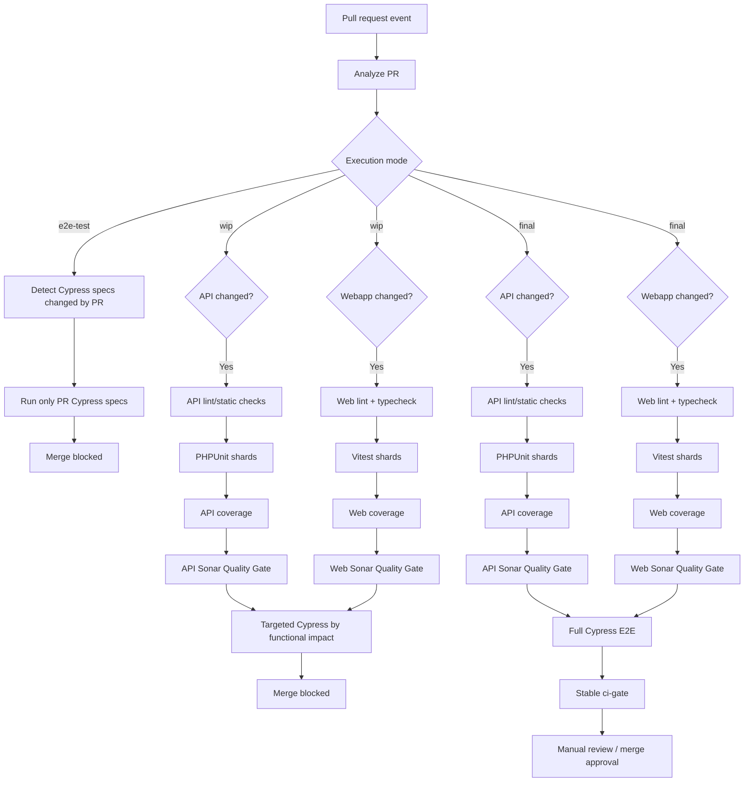

# ♻️ Refactor PR CI into one visible quality-gate DAG

**Labels:** investment: dev-platform, sprint-7

## 📝 Description

Refactor the current GitHub Actions PR validation so the **entire CI quality flow is visible as one dependency graph in a single workflow run**, instead of being split across independent workflow runs that each show only part of the pipeline.

This issue is **not** about introducing Cypress into CI — #490 owns that responsibility. This issue starts from the existing API/Webapp tests, coverage, Sonar and Cypress building blocks and focuses on **orchestrating them as one coherent quality pipeline**.

The architectural goal is **one PR CI run and one visible DAG**. The implementation may use one YAML or reusable internals if useful, provided GitHub presents the complete quality flow together.

## 💡 Reason

CI feedback is currently fragmented across independent workflow runs (`api-lint`, `api-swagger`,
`api-tests`, `webapp-lint`, `webapp-tests`, `cypress-e2e`), each showing only a slice of the quality
flow. A reviewer cannot see the whole pipeline — its ordering, its fail-fast behavior, or which
branches applied — as one picture. Branch protection is also pinned to matrix-shard context names
(`webapp-tests (shard 1/4)`, …), so the merge contract breaks whenever a shard count changes. And
there is no cheap iteration loop for a PR whose only change is a Cypress spec: today that still pays
for the entire API + Webapp pipeline. One orchestrated CI run with a single stable `ci-gate` and
explicit `[e2e-test]` / `[wip]` / final execution modes addresses all three.

---

## 🎯 Objective

Create a canonical PR CI orchestrator that:

1. analyzes the PR once,
2. determines what changed (`api`, `webapp`, E2E, later other surfaces),
3. determines the PR execution mode from its title,
4. starts only the jobs that belong to that mode,
5. preserves the normal quality order `lint → tests → coverage → Sonar`,
6. runs targeted Cypress during normal WIP development,
7. provides a dedicated **`[e2e-test]` diagnostic mode** that runs only Cypress specs modified/added by the PR,
8. runs the **full Cypress suite only in final/merge-candidate state**,
9. converges final validation into one stable merge gate,
10. renders the applicable process as one GitHub Actions DAG.

---

## 🧠 PR execution modes

Use three explicit behaviors:

```text
[#123][workspace][e2e-test] Description
[#123][workspace][wip] Description
[#123][workspace] Description
```

### `[e2e-test]` — Cypress-only diagnostic mode

Purpose: fast iteration while specifically creating/fixing Cypress specs.

Run only:

```text
Analyze PR
  ↓
Detect Cypress specs added/modified by this PR
  ↓
Boot E2E environment
  ↓
Run ONLY those Cypress specs
  ↓
Stop — merge remains blocked
```

Do **not** run in this mode:

- API lint
- PHPUnit
- API coverage
- API Sonar
- Webapp lint
- TypeScript validation
- Vitest
- Webapp coverage
- Webapp Sonar
- Full Cypress suite
- merge-eligible `ci-gate`

This is intentionally an incomplete validation mode. Even if every selected Cypress spec is green, the PR is **not mergeable**.

This mode is useful while repairing quarantined/broken E2E tests or iterating on selectors/intercepts/test setup, where repeatedly paying for the complete CI pipeline adds little value.

### `[wip]` — normal implementation/review/correction mode

Run the applicable API/Webapp quality branches:

```text
lint → tests → coverage → Sonar
```

Then run **targeted Cypress based on functional impact**.

WIP remains non-mergeable even when every applicable check is green.

### No state prefix — final / merge candidate

Run all applicable API/Webapp quality branches, then the **full Cypress suite**, then the stable `ci-gate`.

Only this mode can make the PR eligible for the user's final manual review and merge approval.

`[review]` is still unnecessary because review/correction has the same CI semantics as normal WIP.

---

## 🧭 One visible DAG / execution-mode diagram



Conceptually:

```text
[e2e-test]
  run_pr_cypress_only = true

[wip]
  run_quality_branches = true
  run_targeted_e2e = e2e_relevant_change

[final]
  run_quality_branches = true
  run_full_e2e = e2e_relevant_change
  allow_ci_gate = all_applicable_checks_passed
```

---

## 🎯 E2E selection semantics

There are now **two different selective Cypress behaviors** and they must not be confused.

### `[e2e-test]`: exact PR Cypress files

This mode is intentionally simple and deterministic:

```text
pr_cypress_specs =
    Cypress specs added or modified by this PR
```

If no Cypress spec was added/modified, the mode should fail/stop with a clear message rather than silently succeeding with zero tests.

This mode does **not** attempt Test Impact Analysis. Its purpose is to iterate directly on Cypress tests changed by the PR.

### `[wip]`: functional-impact targeted E2E

WIP selection is broader:

```text
targeted_e2e_specs =
    Cypress specs added/modified in the PR
    + specs mapped to impacted API/Webapp functional areas
```

A backend/frontend change may affect an existing Cypress flow even if the `.cy.*` file itself was untouched, so WIP must not rely only on Cypress-file diff detection.

A lightweight impact map is acceptable initially. If impact cannot be determined safely, fall back conservatively to a broader set or full Cypress rather than silently running no E2E.

---

## ⚡ Performance rationale

A typical PR is expected to add or touch only a small number of Cypress specs — commonly **1–2 and usually no more than ~3–4** — so both `[e2e-test]` and WIP targeted E2E should keep iteration cost much lower than repeatedly running the full suite.

However, Cypress wall-clock is not proportional only to spec count. Environment startup (containers, Laravel, DB, frontend, dependency/setup work, health checks, etc.) may dominate runtime. Measure separately:

- `[e2e-test]` Cypress-only wall-clock,
- WIP targeted-E2E wall-clock,
- Final full-suite wall-clock.

This lets future optimization use evidence rather than assumptions.

---

## ⚡ Fail-fast behavior

```text
[e2e-test]
PR Cypress fails  → stop / merge blocked
PR Cypress passes → stop / merge still blocked

[wip]
Lint fails        → tests do not run
Tests fail        → coverage/Sonar stop
Sonar fails       → targeted Cypress does not run
Targeted E2E fail → merge blocked
Targeted E2E pass → merge still blocked by WIP state

[final]
Lint/tests/Sonar fail → full Cypress does not run
Full E2E fails        → merge blocked
All green             → ci-gate may pass → manual review/merge
```

---

## 🗂️ Plan

> Added by `/issue 560` in **plan-first mode** (operator request). No branch or work session has
> been opened. Review the **Open decisions** at the end, then reply here or re-run `/issue 560` to
> proceed to implementation.

### Design decision: orchestrator + reusable sub-workflows

One canonical entrypoint plus three `workflow_call` reusable workflows:

```
.github/workflows/ci.yml          # analyze-pr, orchestration edges, ci-gate  ← the visible DAG
.github/workflows/_api-ci.yml     # swagger-validate → lint → phpunit shards → coverage-merge → sonar
.github/workflows/_webapp-ci.yml  # lint+typecheck → vitest shards → coverage-merge → sonar
.github/workflows/_e2e-ci.yml     # boot stack → cypress (selection = pr-specs | targeted | full)
```

Rationale: `api-tests.yml` alone is 360 lines; a single inlined `ci.yml` would be ~900 lines and
unreviewable. Reusable workflows still render as **one run with one expandable DAG** in the modern
Actions UI, satisfying "one PR CI run / one visible DAG". Each surface stays independently readable
and its shard/topology lessons (#477 / #481 / #486 / #490) move over verbatim.

### `analyze-pr` job — single source of truth (in `ci.yml`)

Runs once. Outputs consumed by every downstream job's `if:` / matrix / `with:`:

| Output | How derived |
|---|---|
| `mode` | Parse `github.event.pull_request.title`: contains `[e2e-test]` → `e2e-test`; contains `[wip]` → `wip`; else → `final`. `push` to `main` → `final`. |
| `api_changed` / `webapp_changed` / `e2e_changed` | `dorny/paths-filter` (same globs as today's `changes` jobs). |
| `swagger_relevant` | subset of `api_changed` (routes / controllers / requests / responses). |
| `pr_cypress_specs` | `git diff --diff-filter=AM <base>...<head> -- 'code/webapp/cypress/e2e/**/*.cy.ts'`. |
| `pr_cypress_empty` | `true` when `mode == e2e-test` and `pr_cypress_specs` is empty → `_e2e-ci` fails fast with a clear message (no misleading green no-op). |
| `targeted_e2e_specs` | `pr_cypress_specs` + specs matched from `.github/e2e-impact-map.yml`; **conservative fallback to the full suite** when `api_changed`/`webapp_changed` is true but no map entry matches. |

Logic-heavy parsing (mode parse, spec diff, impact-map resolution, fallback) is extracted to
`.github/scripts/ci-analyze/*.js` with `node --test` unit tests — mirrors
`.github/scripts/test-timing/`. **This is the issue's TDD surface**; the YAML wiring itself is only
verifiable by live CI.

`edited` trigger guard: `on: pull_request: types: [opened, synchronize, reopened, edited]`, and
`analyze-pr` short-circuits (no downstream work) when `github.event.action == 'edited'` and
`github.event.changes.title` is absent — so description/label edits don't re-run CI.

### Job graph

```
analyze-pr
 ├─ (mode != e2e-test && api_changed)     → api-ci      [_api-ci.yml]
 ├─ (mode != e2e-test && webapp_changed)  → webapp-ci   [_webapp-ci.yml]
 ├─ (mode == e2e-test)                    → e2e-ci (selection=pr-specs)  needs: analyze-pr
 ├─ (mode == wip   && e2e_changed)        → e2e-ci (selection=targeted)  needs: [api-ci, webapp-ci]
 ├─ (mode == final && e2e_changed)        → e2e-ci (selection=full)      needs: [api-ci, webapp-ci]
 └─ ci-gate  (if: always(), no matrix)    needs: [analyze-pr, api-ci, webapp-ci, e2e-ci]
```

Quality order preserved inside `_api-ci.yml` / `_webapp-ci.yml`: **lint moved before tests**, then
coverage, then Sonar (still gated on `coverage-merge.result == 'success'`). Swagger validation
becomes a **blocking upstream step** in `_api-ci.yml` (fails → PHPUnit doesn't run).

### `ci-gate` — the one stable required check

- `if: always()`, no matrix, literal name `ci-gate` → the only context branch protection ever needs.
- **Fails closed** when `analyze-pr.result != 'success'`.
- `mode == e2e-test` → **always exits non-zero** (`diagnostic mode — not a merge candidate`),
  regardless of the Cypress result.
- `mode == wip` → **always exits non-zero** (`WIP — not a merge candidate`), even if every job is
  green.
- `mode == final` → aggregate: every applicable job must be `success` or legitimately `skipped`
  (doc-only PR); any `failure`/`cancelled` → red. Removing the `[wip]`/`[e2e-test]` prefix (and
  editing the title) flips the PR to final and this becomes the real merge gate.

### Impact map

New `.github/e2e-impact-map.yml` — a list of `{ when: [<path globs>], run: [<cypress spec globs>] }`.
Seeded with a handful of obvious mappings; any unmatched api/webapp change → full suite (never
"no E2E").

### Docs

- New `doc/conventions/ci/pipeline.md` — the three modes, the mermaid DAG (from this issue),
  fail-fast tables.
- `doc/conventions/git/pull-requests.md` + root & workspace `CLAUDE.md` PR-title sections — document
  the optional `[wip]` / `[e2e-test]` third bracket.
- `doc/decisions/` — new TD entry: "Unified PR CI DAG with title-driven execution modes".

### Migration (multi-PR — the risky part)

1. **This PR**: add `ci.yml` + `_*.yml` + `ci-analyze` scripts + impact map + docs, running
   **alongside** the existing 9 workflows (none removed, branch protection untouched). New checks
   appear non-required. Prove green by flipping this PR's own title through `[e2e-test]` → `[wip]` →
   no-prefix and observing the DAG each time.
2. **Manual, operator-run** (documented in the PR, not automated): once `ci-gate` is proven,
   `gh api PUT .../branches/main/protection/required_status_checks` to require `ci-gate` and drop the
   8 legacy contexts (`api-lint`, `webapp-lint`, `webapp-coverage-merge`,
   `webapp-tests (shard 1..4/4)`, `api-tests`).
3. **Follow-up issue**: delete the superseded workflow files (`api-lint.yml`, `api-swagger.yml`,
   `api-tests.yml`, `webapp-lint.yml`, `webapp-tests.yml`, `cypress-e2e.yml`) once `ci-gate` is the
   sole required gate. `deploy-preview.yml`, `update-iteration-progress.yml`, `wif-smoke-test.yml`
   stay untouched (operational, not PR-validation).

### Open decisions for the operator

1. **Reusable sub-workflows vs single `ci.yml`** — plan assumes reusable (recommended).
2. **`ci-gate` in wip / e2e-test: explicit red** (plan's choice) vs never-report / neutral. Explicit
   red is unambiguous but leaves a permanent red check on every WIP PR.
3. **Old-workflow removal + branch-protection edit: follow-up issue** (plan's choice) vs done in this
   same PR after proving the DAG.
4. **Impact-map seed entries** — which functional areas first? Default guess: holidays, purchasing,
   cash, inventory.
5. **`final` mode on `push: branches: [main]`** — keep the post-merge full run (plan's choice,
   matches today) vs PR-only.

---

## ✅ Technical Tasks

- [x] Introduce one canonical PR CI workflow (for example `.github/workflows/ci.yml`).
- [x] Configure PR events required for commits and title-state transitions (`opened`, `synchronize`, `reopened`, `edited`; validate exact set).
- [x] Add one initial `analyze-pr` job as orchestration source of truth.
- [x] Parse execution mode safely as `e2e-test | wip | final`.
- [x] Publish change outputs such as `api_changed`, `webapp_changed`, `e2e_changed` and required E2E selections.
- [x] Keep changed surfaces and PR execution mode as independent dimensions.
- [x] Keep `[review]` out of the state model.
- [x] Implement `[e2e-test]` as a Cypress-only diagnostic mode.
- [x] In `[e2e-test]`, detect only Cypress specs added/modified by the PR.
- [x] In `[e2e-test]`, skip API/Webapp lint, unit tests, coverage and Sonar completely.
- [x] In `[e2e-test]`, fail clearly when the PR contains no Cypress specs to execute.
- [x] Ensure `[e2e-test]` can never make `ci-gate` merge-eligible.
- [x] Preserve normal WIP API/Webapp quality branches.
- [x] Move API lint before PHPUnit.
- [x] Decide where Swagger validation belongs and make it block downstream API validation when applicable.
- [x] Preserve PHPUnit sharding, isolated PostgreSQL topology, JUnit timing summaries and raw coverage merge.
- [x] Preserve API Sonar after successful tests/coverage.
- [x] Move Webapp lint + typecheck before Vitest.
- [x] Preserve Vitest sharding, merged coverage and Webapp Sonar.
- [x] Integrate existing Cypress infrastructure from #490/#491 rather than rebuilding it.
- [x] Implement WIP targeted-E2E selection based on functional impact, not only changed Cypress files.
- [x] Include changed/added Cypress specs in the WIP targeted set.
- [x] Add a conservative WIP fallback when impact mapping is unknown.
- [x] Run WIP targeted Cypress only after applicable API/Webapp quality branches pass.
- [x] Run full Cypress in Final only after all applicable quality branches pass.
- [ ] Capture/compare Cypress-only, targeted-WIP and full-suite wall-clock.
- [x] Add one stable non-matrix final check (`ci-gate`).
- [x] Make `ci-gate` fail closed if PR analysis/change detection fails.
- [x] Keep branch protection independent of matrix shard names.
- [x] Add concurrency/cancel-obsolete-run behavior if compatible with review automation.
- [x] Remove/convert superseded standalone PR workflows only after the unified DAG is proven green.
- [x] Keep deploy-preview, iteration badge automation and WIF diagnostics independent.
- [x] Update CI/testing documentation with all three execution modes and the visible DAG.

---

## 🎯 Acceptance Criteria

- [x] One PR CI run shows the complete applicable DAG in GitHub Actions.
- [x] PR analysis/change detection executes once.
- [x] Execution mode is deterministically parsed as `[e2e-test]`, `[wip]`, or final.
- [x] `[e2e-test]` runs only Cypress specs added/modified by the PR.
- [x] `[e2e-test]` does not run API/Webapp lint, PHPUnit, Vitest, coverage or Sonar.
- [x] `[e2e-test]` with zero changed Cypress specs fails/stops clearly instead of reporting a misleading green no-op.
- [x] `[e2e-test]` remains non-mergeable even when its Cypress specs pass.
- [x] `[wip]` runs applicable API/Webapp quality branches.
- [x] `[wip]` runs targeted Cypress based on functional impact after applicable quality branches pass.
- [x] WIP targeted selection is not limited to changed Cypress files.
- [x] WIP remains non-mergeable even when every check passes.
- [x] Removing all explicit state prefixes makes the current HEAD eligible for final validation.
- [x] Final PRs run the full Cypress suite after all applicable API/Webapp branches pass.
- [x] A new commit while final reruns full validation for the new HEAD SHA.
- [x] Unrelated/documentation-only changes may legitimately skip non-applicable branches without hiding orchestration failures.
- [x] Any applicable final lint/test/Sonar/Cypress failure blocks `ci-gate`.
- [x] Branch protection does not depend on matrix shard names.
- [x] Existing coverage artifacts, timing evidence, Sonar analysis and Cypress failure evidence are preserved.
- [x] Operational workflows remain independently runnable.
- [x] CI documentation explains `e2e-test` vs WIP vs Final clearly.

---

## 🏗️ Implementation strategy

The acceptance criterion is **one visible CI DAG**, not one monolithic YAML at any cost.

Possible structure:

```text
.github/workflows/ci.yml
```

or a canonical entrypoint plus reusable internals if GitHub still renders the orchestration clearly:

```text
.github/workflows/ci.yml
.github/workflows/_api-ci.yml
.github/workflows/_webapp-ci.yml
.github/workflows/_e2e-ci.yml
```

Choose the simpler design after validating the GitHub Actions graph.

Branch protection should depend on a stable external contract such as:

```text
ci-gate
```

Internal changes such as shard count must not require branch-protection edits.

---

## 🔒 Manual merge gate

Passing automated CI never merges automatically. Only **final** successful CI makes the PR eligible for the user's manual functional/code review and explicit merge approval.

---

## 🚫 Out of Scope

- Introducing Cypress CI for the first time (#490).
- Cypress sharding/throughput optimization already owned by #491/#559 except where selective execution integrates with it.
- Fixing quarantined Cypress specs themselves.
- Rewriting PHPUnit/Vitest sharding without an orchestration need.
- Production/preview deployment redesign.
- Badge automation redesign.
- WIF/GCP authentication redesign.
- Product behavior changes.
- Mobile CI; keep the design extensible but Mobile is not part of this implementation.

---

## 🔗 Dependencies / References

- #490 — Cypress E2E CI quality gate.
- #491 — Cypress sharding follow-up.
- #559 — Cypress wall-clock optimization.
- Preserve existing PHPUnit sharding/stable-gate lessons in `api-tests.yml`.

---

## Investment Type

`investment: dev-platform`

This is CI architecture/developer-experience work: improve feedback ordering, add a fast Cypress-only diagnostic loop, reduce unnecessary compute during WIP, stabilize branch protection and make the repository's quality contract visible as one professional CI graph.

## ⏱️ Time

### 📊 Estimates
- **Optimistic:** `4h`
- **Pessimistic:** `1d 4h`
- **Tracked:** `15h`

### 📅 Sessions
```json
[
  { "date": "2026-08-31", "start": "23:30", "end": "14:30" }
]
```

---

## 📊 Retrospective
- **Actual total:** 15h 0m (900m — one continuous autonomous session 2026-08-31 23:30 → 2026-09-01 14:30)
- **vs optimistic:** +11h 0m
- **vs pessimistic:** −13h 0m
- **Hands-on engineering:** ~2h30m of the 9h39m. The rest is unattended GitHub Actions wall-clock
  across ~26 full-pipeline runs (each `analyze-pr` → `api-ci` 4 PHPUnit shards + `webapp-ci`
  4 Vitest shards + `e2e-ci` up to 6 Cypress shards ≈ 15–20 min), driven by background watchers.

**Justification:**
Shipped in PR #589: the canonical orchestrator `.github/workflows/ci.yml` (one `analyze-pr` job —
dorny change detection for `api` / `webapp` / `infra` / `scripts` plus PR-title mode parse — feeding
`api-ci` / `webapp-ci` / `e2e-ci` / `scripts-tests` and one stable `ci-gate`), three reusable branch
workflows porting the existing shard / isolated-Postgres / phpcov-merge / blob-merge / Sonar /
Cypress-stack logic verbatim, `.github/scripts/ci-analyze` with a **37-case** `node --test` suite,
`.github/e2e-impact-map.json`, `code/webapp/cypress/e2e/ci-pipeline-smoke.cy.ts`, docs
(`doc/conventions/ci/pipeline.md`, TD-06, the title-bracket in `pull-requests.md` + `CLAUDE.md`),
a `HolidayFactory` flake fix, and — in the final cycle — deletion of the six legacy standalone
workflows so `ci.yml` is the only PR-validation run.

Eight cycles on top of the initial build:

1. **Live-CI hardening.** `concurrency: cancel-in-progress` cancelling `analyze-pr` mid-flight
   exposed an `e2e-ci` gating gap (with `always()` the implicit needs-success gate is off) and an
   unsafe `skip_all` title-edit shortcut. Fixed with an explicit `needs.analyze-pr.result ==
   'success'` and by removing `skip_all`.
2. **Codex review (2 real findings, both fixed).** P1: `analyze-pr` ignored infra paths → added the
   `infra` filter (forces the full Cypress suite and runs `api-ci` / `webapp-ci` on pipeline
   changes). P2: `[wip]` fallback checked "any mapped spec" instead of "every changed code file
   mapped" — now falls back to full when any changed non-spec code file is unmapped.
3. **Full-DAG proof.** The P1 fix makes this PR an "infra change", so its own CI ran the populated
   DAG for real — `api-ci`, `webapp-ci`, `e2e-ci` (6 Cypress shards), `ci-gate` — all green.
4. **Per-mode verification (operator-requested).** Cycled PR #589's title through all three modes on
   live CI: `[e2e-test]` without a spec → `e2e-test-empty-guard` **failed**, `ci-gate` failed
   (run 33480955972); `[wip]` → all branches green, `ci-gate` still **failed** "[wip] — NOT a merge
   candidate" (run 33481035518); added `ci-pipeline-smoke.cy.ts` then `[e2e-test]` with it →
   `e2e-plan` resolved `pr-specs` / **1 spec** / `shards=[1]`, `cypress-e2e-run (shard 1/1)` ran
   only that spec (`✔ 3s`), `ci-gate` failed (run 33484405439); no-bracket / `final` → full DAG
   green, `ci-gate` **success** (run 33482729813). `HolidayCrudTest::list_returns_all_holidays`
   flaked ~40% on `api-tests` shard 3 (`faker->unique()` collided under `->count(3)` on
   `holidays.date`) → fixed by a monotonic-date `HolidayFactory`.
5. **Cutover to one flow (operator-requested).** Deleted the six legacy standalone workflows
   (`api-lint` / `api-swagger` / `api-tests` / `webapp-lint` / `webapp-tests` / `cypress-e2e`) —
   `ci.yml` is now the only PR-validation run. `api-tests.yml`'s `api-timing-script-tests` moved
   into `ci.yml` as `scripts-tests` (gated on `.github/scripts/**`). Added explicit
   documentation/config-only detection: `analyze-pr` computes `verify_needed`
   (`verify-scope.js`, unit-tested), and `ci-gate` short-circuits a PR that touched no code / test /
   pipeline / script file to a fast green in final mode. Verified green with only the `CI` workflow
   running (run on `e6c58cb9`).
6. **Second review pass (4 findings, all fixed).** (a) `scripts-tests` now also requires `mode !=
   'e2e-test'` — it was running unit tests inside the Cypress-only diagnostic loop when a
   `[e2e-test]` PR also touched `.github/scripts/**`. (b) `junit-merge` / `cypress-timing` are
   `continue-on-error: true` — a bug in the timing generator or a missing artifact was failing the
   job and therefore `api-ci` / `e2e-ci` / `ci-gate` over a summary nothing gates on. (c)
   `_e2e-ci.yml`'s `plan` job now fails on zero resolved specs for **any** selection, not just
   non-full — a `full` run against an emptied `cypress/e2e/` previously let `ci-gate` approve an
   E2E run that executed nothing. (d) `e2e-impact-map.json`: dropped `auth.store.ts` from the
   narrow `auth-and-permissions` mapping (a global store this broad belongs in the conservative
   full-suite fallback), and added `attendance-*` / `payroll-*` to the `employees` `run` list
   (Employee is a shared FK dependency of both) — both dependency-safety rules written into the
   map's `_comment`. +2 node --test cases (39/39). CI green on `e1b90e60`.
7. **Third review pass (2 findings, both fixed).** (a) `continue-on-error` moved to the **job**
   level on `api-junit-merge` / `cypress-timing` — a step-level flag on the generator still let a
   failing `download-artifact` (the step before it) fail the job and block `ci-gate`. (b) Added an
   `includes: [<area>, ...]` key to the impact map (`select-e2e.js`, transitive + cycle-safe) that
   pulls in another area's *full, current* `run` set; `employees` now `includes: ["attendance",
   "payroll"]` instead of a hand-copied subset that had missed payroll's `closed-period-*` /
   `reopen-reclose-period` and attendance's `punctuality-*`. +4 node --test cases (43/43). CI green
   on `e52256ac`.
8. **Fourth review pass (1 finding, fixed).** `inventory` and `product-catalog-and-pricing` now
   `includes: ["purchasing"]` — a shared inventory/catalog/pricing route change (`inventory.php`,
   `items.php`, `product-catalog.php`, `pricing.php`) was selecting only its own narrow suite while
   purchasing flows that consume those APIs (supplier offerings, purchase receipts) got no targeted
   `[wip]` coverage. +1 node --test case (44/44). CI green on `dcae6b53`.

**Branch protection cutover — applied.** `main`'s required status checks are now the single
`ci-gate` context (`strict: true`); the eight legacy shard-name checks were dropped. PR #589 went
from `BLOCKED` to `CLEAN`. (The local archive snapshot in the PR predates this and still reads
"one manual step remains" — it is a verbatim point-in-time capture per `doc/conventions/tasks.md`.)

Deferred to follow-up (still-unchecked box): the cross-mode wall-clock comparison artifact.


