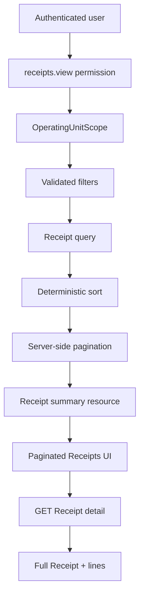
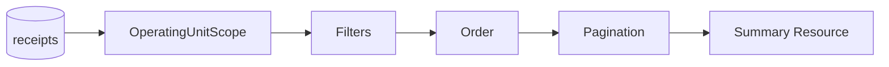

# 📄 Paginate Purchase Receipt history and preserve scoped query semantics

**Labels:** backend, frontend, 🔨 technical-debt, investment: product-engineering

## Description

Replace the current unbounded Purchase Receipt list with a bounded, deterministic, server-side paginated query and update the webapp to consume that contract without weakening the Operating Unit authorization rules introduced by Sprint 7.

This Issue comes from the Sprint 006 engineering review. The current Receipt list endpoint still ends in an unbounded `get()` over the matching Receipt query. That is acceptable while the dataset is tiny, but Purchase Receipts are an append-only operational history: unlike a small catalog, the table is expected to grow continuously as SushiGo records real receiving activity.

## Context

Today the read path is conceptually:

```text
GET /api/v1/inventory/receipts
        ↓
Receipt::query()
        ↓
filters
        ↓
orderBy receipt_date DESC
        ↓
orderBy id DESC
        ↓
get()
        ↓
all matching Receipts in one response
```

That creates several long-term problems:

1. response size grows with business history;
2. eager-loaded Supplier / Location / Lines / Presentation graphs multiply payload and query cost;
3. the UI cannot express a stable browsing contract for long histories;
4. future date/status/supplier/location filters risk becoming client-side workarounds;
5. after #572 applies horizontal Operating Unit access to Receipts, pagination must be applied **after scope** so page metadata never leaks the existence/count of inaccessible records.

The Sprint 006 review therefore classified Receipt-list pagination as an open scalability/read-model finding rather than a current production defect.

## Why this should be solved before history grows

A list endpoint that works with 20 Receipts can become operationally expensive with thousands of Receipts, especially because each result can load nested line/presentation data.

The desired boundary is:



The list should become a **summary read model**. Full line evidence belongs in the detail endpoint unless a measured UI requirement proves otherwise.

## Objective

Provide a bounded Purchase Receipt history contract that:

- scales independently from total Receipt count;
- respects active Operating Unit access before counting/paginating;
- keeps ordering deterministic across pages;
- exposes validated business filters;
- avoids unnecessary nested-line hydration in the list path;
- preserves public ULID contracts;
- gives the frontend explicit loading, empty, error, pagination and filter behavior;
- remains compatible with Sprint 7's #572 Receipt destination/authorization hardening.

## Recommended implementation process

### Phase 1 — Baseline and query inventory

- [ ] Measure/query the current endpoint with realistic seeded Receipt volume and record:
  - response size;
  - SQL/query count;
  - eager-loaded relations;
  - frontend fields actually rendered by the list;
  - current ordering/filter behavior.
- [x] Inventory every consumer of `GET /inventory/receipts` before changing the response envelope.
- [x] Confirm whether any consumer currently depends on full `lines` data from the list endpoint.

### Phase 2 — Define the read contract

- [x] Add bounded `per_page` validation with a conservative default and hard maximum.
- [x] Preserve deterministic newest-first ordering using a stable tie-breaker.
- [x] Support/retain validated filters needed by the operational UI, at minimum:
  - status;
  - supplier;
  - receiving Location / Operating Unit where appropriate;
  - receipt date range;
  - reference/search if the current UI requires it.
- [x] Apply `OperatingUnitScope` before filters, count and pagination.
- [x] Keep external identifiers as public ULID strings.
- [x] Decide whether the list resource should omit Receipt lines and other heavyweight nested evidence; prefer a summary resource plus the existing detail endpoint.

### Phase 3 — Backend implementation

- [x] Replace unbounded `get()` with Laravel pagination using the repository's current API envelope convention.
- [x] Ensure eager loading only includes relations required by the summary row.
- [x] Add query-count/N+1 regression coverage.
- [x] Return stable pagination metadata and links/parameters according to the project API conventions.
- [x] Keep soft-deleted historical Supplier/Location evidence readable where the Receipt audit contract requires it.

### Phase 4 — Frontend adoption

- [x] Update the Receipt API client/types for the paginated response.
- [x] Add server-side page state and preserve filters while navigating pages.
- [x] Reset/clamp the page deterministically when filters change.
- [x] Keep selected/detail state stable when returning from a Receipt detail view when practical.
- [x] Provide explicit loading, empty, error and retry states consistent with #576 if that Issue has landed.
- [x] Avoid fetching every page to reconstruct a client-side list.

### Phase 5 — Evidence and documentation

- [x] Add API feature tests for pagination boundaries, ordering, filters and scoped counts.
- [x] Add frontend tests for pagination/filter serialization and state transitions.
- [x] Extend/fix the Purchase Receipt Cypress path after #548 so it proves browsing a Receipt outside page 1.
- [x] Update OpenAPI with pagination/filter parameters and the response envelope.
- [x] Update bilingual Purchase Receipt documentation if the operator workflow changes materially.

## Security requirement — scope before pagination

The order matters.

Incorrect conceptual order:

```text
all Receipts
→ paginate/count
→ remove inaccessible rows
```

This can leak counts/page behavior and can produce sparse/incorrect pages.

Required order:

```text
all Receipts
→ OperatingUnitScope
→ validated filters
→ deterministic order
→ paginate/count
→ serialize
```



## Tests

- [x] Default page size is bounded.
- [x] `per_page` cannot exceed the documented maximum.
- [x] Page 1/page 2 never duplicate or omit rows under stable data/order.
- [x] Same-date Receipts remain deterministic through the tie-breaker.
- [x] Status/Supplier/Location/date filters compose with pagination.
- [x] Cross-Operating-Unit Receipts do not affect rows, totals or pagination metadata.
- [x] Admin/super-admin bypass follows the documented #440/#572 contract.
- [x] List path does not introduce N+1 loading.
- [x] Full Receipt detail remains available through the detail endpoint.
- [x] Frontend pagination and filters survive normal navigation/refetch behavior.

## Acceptance Criteria

- [x] `GET /api/v1/inventory/receipts` never returns an unbounded matching history.
- [x] Pagination is server-side, bounded and deterministic.
- [x] Operating Unit scope is applied before pagination/counting.
- [x] List payload contains only the data required for the Receipt history view; full line evidence is fetched from detail unless explicitly justified.
- [x] Public ULIDs remain the HTTP contract.
- [x] UI can browse/filter histories larger than one page without loading the full dataset.
- [x] Tests prove pagination, filters, authorization isolation and N+1 behavior.
- [x] OpenAPI and frontend types describe the same pagination contract.

## Dependencies / Coordination

- Coordinate with #572 because that Issue establishes the final Receipt Operating Unit and receiving-Location access contract.
- Coordinate with #548 for the restored Purchase Receipt Cypress baseline.
- Reuse #576's shared loading/empty/error behavior if it lands first.
- Include #581's public-ULID OpenAPI corrections if both Issues overlap documentation work.

## Out of Scope

- Infinite-scroll redesign solely for visual preference.
- Receipt export/reporting.
- Purchase Order history.
- Changing Receipt posting/reversal semantics.
- Recomputing valuation on reversal (#579).

## Investment Type

`investment: product-engineering`

This work strengthens the operational read model and prevents Purchase Receipt history from becoming an unbounded query/payload as real business data accumulates.

## ⏱️ Time

### 📊 Estimates
- **Optimistic:** `3h`
- **Pessimistic:** `7h`
- **Tracked:** `9h54m`

### 📅 Sessions
```json
[
  { "date": "2026-09-01", "start": "17:27", "end": "18:15" },
  { "date": "2026-09-01", "start": "18:20", "end": "23:59" },
  { "date": "2026-09-02", "start": "00:00", "end": "01:57" },
  { "date": "2026-09-02", "start": "16:20", "end": "17:50" }
]
```

## 🔗 Review origin

Sprint 006 engineering review — finding **S6-F06: Receipt listing remains unpaginated**.


## 📊 Retrospective
- **Actual total:** 9h54m (48m + 339m + 117m + 90m)
- **vs optimistic:** +6h54m
- **vs pessimistic:** +2h54m

**Justification:**
The core delivery (session 1, 48m) landed close to plan: server-side pagination, the
`ReceiptSummaryResource` read model, `OperatingUnitScope::constrainReceipts` applied before
counting, the new filters, the frontend paginated hook + detail fetch, tests, and bilingual docs —
all in one implementation pass via the autonomous `/issue-no-review` pipeline, green on the first
full CI run (one unrelated pre-existing flake in `ReclosePayPeriodApiTest` cleared on re-run).

The overrun is almost entirely **unplanned review-iteration** (sessions 2–4), which this lightweight
variant deliberately leaves to a human to drive. Eight review findings arrived across five rounds,
each requiring a fix (or a reasoned decline) + test + squash + rebase-onto-main + a full ~15-minute
CI cycle (api + webapp + 6-shard E2E) before the next round could start:
1. Codex — clamp `currentPage` to the returned `last_page` after a mutation shrinks a filtered page
   (post/reverse only invalidated, unlike delete's eager step-back).
2. Codex — the `destination_location_id` list filter leaked out-of-scope location existence
   (real-but-inaccessible ULID → empty page vs nonexistent → 422); extracted a scoped `Rule::exists`
   concern shared with `ReceiptRequest`.
3. Devin — the same concern had to cover the **write** side: `assertReceiptInScope` only guarded a
   Receipt's *old* destination, so a create/update payload could still route into a foreign unit.
4. Devin — `%`/`_` in `search` passed unescaped into `ILIKE` as wildcards.
5. Devin — TOCTOU: a bypass-role transfer of a still-draft Receipt between the controller's
   pre-lock guard and `postReceipt` could let a scoped caller post Stock into a foreign unit.
6. Devin — the same TOCTOU class applied to `update` / `delete` / `reverse`; generalized the
   under-lock re-check into `ReceiptService::assertActorMayMutateLockedReceipt`.
7. Devin — the under-lock re-check validated only the Receipt's *current* destination, not the
   create/update payload's; added `ReceiptService::assertActorMayUseDestination` so the Service
   enforces scope on the target destination itself rather than trusting request validation.
8. Devin (declined) — the residual sub-transaction race: `OperatingUnitScope` reads
   `operating_unit_users` without `lockForUpdate` anywhere in the domain, so a membership revoked in
   the same instant is not serialized against an in-flight mutation. This is a whole-`#440`-layer
   property, explicitly deferred to #572 by this issue's own Dependencies section; kept the decline
   with a full rationale in the PR's `## ⚠️ Needs Human Judgment` section and both architecture docs
   (confirmed by the user).
Findings 2–8 were all Operating-Unit authorization hardening the original issue explicitly scoped to
a coordinating issue (#572); folding the actionable ones in here rather than deferring, plus the
repeated re-surfacing of finding 8, is what pushed tracked time well past the pessimistic estimate.
Wall-clock also includes substantial unattended CI-polling time across ~10 push/validate cycles.


