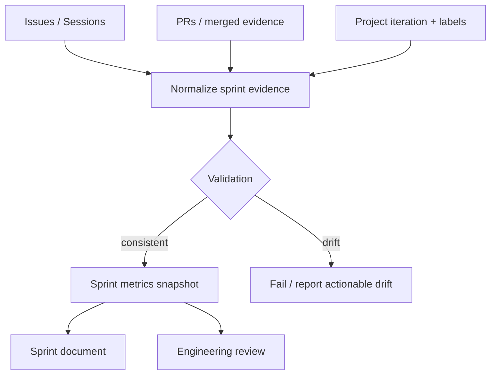
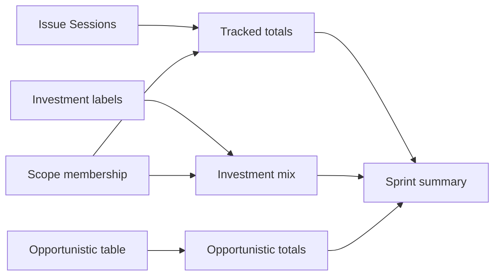

# 📋 Make sprint closure and tracking metrics a single consistent source of truth

**Labels:** documentation, 🔨 technical-debt, investment: dev-platform

## Description

Strengthen sprint closure so scope, Issue completion, tracked time, opportunistic work, and aggregated sprint metrics cannot drift apart.

This Issue comes from the Sprint 006 engineering review. Sprint 006 was functionally successful, but its evidence exposed several process inconsistencies:

- same-window engineering work such as #490 was not reflected in the sprint's aggregate metrics;
- some scoped Issues were closed while one or more Technical Tasks remained unchecked;
- closure evidence sometimes lived in PR retrospectives or Issue bodies without being reconciled into the sprint document;
- the sprint document, GitHub labels/project iteration, and actual work history can temporarily disagree.

None of these problems invalidates the delivered code. The risk is traceability: once the review archive depends on sprint metrics longitudinally, small inconsistencies compound into misleading velocity, investment-type, and quality conclusions.

## Reason

The Sprint 006 engineering review is the first review that consumes sprint metrics *longitudinally* — comparing velocity, investment mix, and quality across sprints. That only works if each sprint's numbers are reproducible from GitHub evidence and mean the same thing every time. Today they are reconciled by hand across four disconnected sources (Issue bodies/Sessions, PRs, GitHub Project iteration/labels, the sprint document), so two drift classes recur: valid same-window work is omitted from the aggregates, and Issues close with unchecked Technical Tasks that had no explicit deferral. Left unaddressed, every future review inherits and compounds that noise. This work makes the sprint-evidence contract explicit and adds a deterministic pre-closure audit so the drift is caught before a sprint is marked `Completed`, not discovered a review later.

## Context

The current information flow is effectively distributed:

```text
Issue body / Sessions
        │
        ├── tracked time
        ├── estimates
        ├── technical tasks
        └── retrospective

PR
        │
        ├── implementation evidence
        ├── review findings
        └── CI / Sonar / E2E evidence

GitHub Project / labels
        │
        ├── sprint assignment
        └── status

Sprint document
        │
        ├── formal scope
        ├── opportunistic work
        └── aggregate metrics

Engineering review
        └── derives trends from all of the above
```

When these sources are reconciled manually, two classes of drift appear:

1. **work omission** — valid project work happens during the sprint window but is not counted in the sprint's documented activity;
2. **closure inconsistency** — an Issue is Closed/Done even though its checklist or final evidence still indicates deliberately deferred work.

## Objective

Define and automate a clear sprint-evidence contract so that:

- formal scope and opportunistic work are distinguishable but both visible;
- aggregate tracked time is reproducible from Issue evidence;
- Issue closure cannot silently contradict unfinished checklist state without an explicit deferral explanation;
- sprint docs, GitHub Project iteration/status, labels and Issue state can be reconciled before promotion/closure;
- reviews can use sprint metrics without re-discovering missing same-window work manually.

## Recommended model



The system should distinguish at least these concepts:

```text
formal_scope_effort
opportunistic_effort
same_window_project_effort
wall_clock_window
tracked_quality / confidence
```

Do not collapse them into one number.

## Recommended implementation process

### Phase 1 — Define canonical semantics

- [x] Document what counts as **formal sprint scope**.
- [x] Document what counts as **opportunistic work**.
- [x] Define whether unrelated same-window Dev Platform work is included in:
  - sprint delivery metrics;
  - separate project-activity metrics;
  - neither.
- [x] Define closure semantics for unchecked Technical Tasks:
  - genuinely incomplete;
  - explicitly deferred/out of scope;
  - superseded by another Issue;
  - stale checklist needing reconciliation.
- [x] Define which source is authoritative for:
  - estimates;
  - tracked time;
  - Investment Type;
  - final state;
  - scope membership.

### Phase 2 — Add a reconciliation script/check

Create a small script/workflow that inspects the current sprint and reports drift before formal closure.

Suggested inputs:

- sprint document frontmatter/scope table;
- Issues carrying `sprint-N` label;
- Project iteration assignment;
- Issue state / Project status;
- Issue `Sessions` and `Tracked` evidence;
- Investment Type label;
- explicitly documented opportunistic table.

Suggested output:

```text
Sprint 007 closure audit

Formal scope          13 Issues
Closed                13
Open                   0
Missing iteration      0
Wrong sprint label     0
Missing investment     0
Unchecked tasks        3 (all explicitly deferred)
Formal tracked        XXhYYm
Opportunistic tracked  XXhYYm
Other same-window      XXhYYm
Metric confidence      high / medium / low
```

### Phase 3 — Fail on ambiguous drift

- [x] Fail closure when a scoped Issue is still Open/Todo.
- [x] Fail when a scoped Issue lacks Investment Type.
- [x] Fail when sprint label / Project iteration contradict formal scope.
- [x] Fail when an Issue is Closed but unchecked tasks have no explicit disposition.
- [x] Warn rather than fail for valid opportunistic/same-window work that is intentionally outside formal delivery metrics.
- [x] Never infer human-attention time from agent/session time; keep metric names explicit.

### Phase 4 — Generate aggregate evidence

Prefer generated values over hand-maintained totals where practical.



- [x] Generate/check total formal tracked effort.
- [x] Generate/check opportunistic tracked effort.
- [x] Generate/check Investment Type distribution.
- [x] Preserve manually entered wall-clock evidence where it cannot be reconstructed reliably.
- [x] Include a metric-confidence field when session tracking is known to understate real work.

### Phase 5 — Integrate with sprint promotion/closure

- [x] Run the audit before `Completed` is written.
- [x] Run it before promoting the next sprint.
- [x] Keep the user's manual review/approval as the final lifecycle gate.
- [x] Do not auto-close Issues or auto-merge PRs as part of reconciliation.

## Example: Sprint 006 discrepancy that motivated this Issue

Sprint 006 documented a formal tracked total and a grand total including selected opportunistic Issues. During review, #490 was found to have substantial Sessions in the same delivery window but was not represented in those aggregate numbers.

The correct resolution is **not necessarily to redefine Sprint 006's formal scope**. The important improvement is that future summaries explicitly distinguish:

```text
Formal sprint delivery             12h05m
Documented opportunistic work       3h14m
Other same-window project activity 11h10m
```

so a later reviewer does not mistake one number for total engineering activity.

## Tests / Validation

- [x] Fixture where every source agrees → audit passes.
- [x] Issue in scope but missing sprint label → actionable failure.
- [x] Issue labeled sprint but not in formal scope → warning or explicit orphan classification.
- [x] Closed Issue with unchecked task and no deferral → failure.
- [x] Closed Issue with unchecked task explicitly linked to follow-up → pass.
- [x] Missing Investment Type → failure.
- [x] Opportunistic Issue listed in sprint doc → counted separately.
- [x] Same-window Issue not in sprint → surfaced separately without modifying formal scope.
- [x] Malformed/missing Sessions → metric confidence downgraded, not silently treated as zero.

## Acceptance Criteria

- [x] A sprint can be closed only after a deterministic reconciliation report exists.
- [x] Formal scope metrics are reproducible from GitHub evidence.
- [x] Opportunistic work is visible and separated from formal scope.
- [x] Same-window project activity can be reported without corrupting formal sprint velocity.
- [x] Closed Issues cannot retain ambiguous unchecked work silently.
- [x] Investment Type totals derive from canonical labels.
- [x] Sprint document, labels, Project iteration and Issue states are checked for consistency.
- [x] The generated/validated metrics can be consumed by future engineering reviews.

## Out of Scope

- Automatic PR merge.
- Automatic business acceptance.
- Estimating the user's personal/human-attention hours.
- Replacing GitHub Issues or the existing sprint documents.
- Building a generic project-management platform.

## Investment Type

`investment: dev-platform`

This improves engineering traceability, longitudinal review quality and confidence in sprint/velocity metrics.

## ⏱️ Time

### 📊 Estimates
- **Optimistic:** `4h`
- **Pessimistic:** `10h`
- **Tracked:** `11h 50m`

### 📅 Sessions
```json
[
  { "date": "2026-09-01", "start": "17:25", "end": "20:35" },
  { "date": "2026-09-01", "start": "23:25", "end": "24:00" },
  { "date": "2026-09-02", "start": "00:00", "end": "02:00" },
  { "date": "2026-09-02", "start": "09:15", "end": "14:55" },
  { "date": "2026-09-02", "start": "22:20", "end": "22:45" }
]
```

## 🔗 Review origin

Sprint 006 engineering review — process findings around **same-window work omission, checklist closure consistency and sprint metric source-of-truth drift**.


## 📊 Retrospective
- **Actual total:** 11h 50m (190m + 35m + 120m + 340m + 25m)
- **vs optimistic (`4h`):** +7h 50m
- **vs pessimistic (`10h`):** +1h 50m

**Justification:**
The initial build — the `sprint-closure-audit.md` contract, the `.github/scripts/sprint-audit/`
module (parser, reconciliation, report, CLI), CI wiring, the `/close-sprint` and `sprints.md`
§18 integration, and `node --test` coverage for all nine of the issue's own Tests/Validation
cases — landed inside the optimistic estimate in the first session (~3h). The overrun is almost
entirely **review-response**: the PR went through roughly twenty-five Codex review cycles, each
one hardening the heuristic parsers against a concrete edge case in real repo data — cross-repo
issue identity `(repo, number)` and Sprint 003's `dev-lab#NNN` / code-formatted / repo-column
layouts; §5.3 Scope Changes; `scope_issues` reconciled against the pre-§5.3 count; disposition
verbs bound to `#NNN` and not negated; terminal `out of scope` only as an explicit annotation;
deferral headings anchored to the phrase; CommonMark-correct fenced-code stripping (indent,
bare closing fence, fence length, backtick info string); canonical `## Time` / `## Sessions`
headings; `24:00` session ends; impossible-date rejection; stated-`Tracked`-vs-sum drift; §13
Execution Evidence reconciliation; strict sprint-number / window-date validation; OR-not-AND
label search with pagination. The test suite grew from 30 to 101 cases across those rounds.
The final `/finish-pr` also spanned two calendar days because the base branch's flaky
`AttendancePayroll` CI cascade (#578) forced several CI re-runs before #578's own fix landed
on `main` and the rebase settled.

